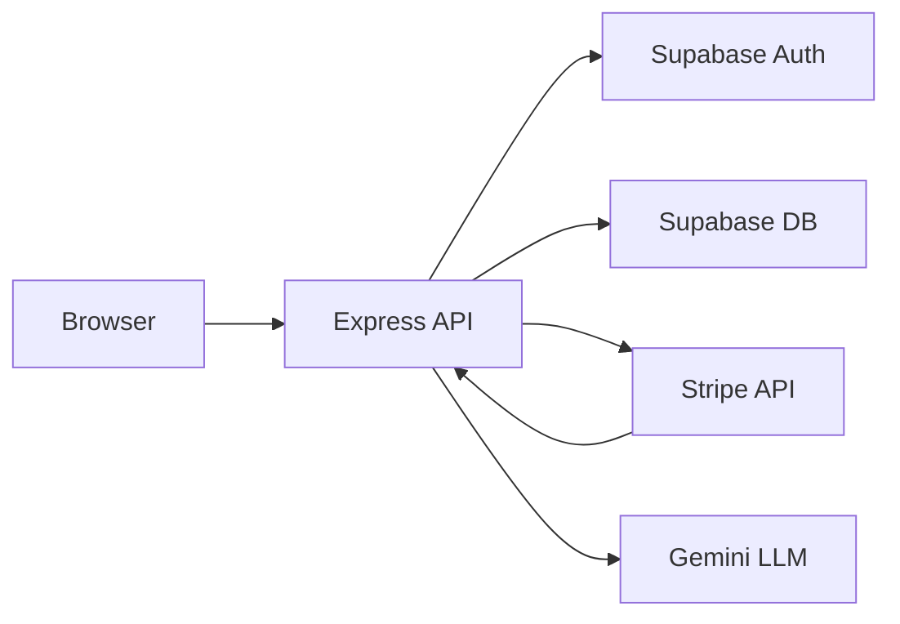

# Lyceonai Threat Model

## Executive summary
Lyceon is a public, internet-exposed SAT learning platform with cookie-based Supabase auth, a Node/Express API, and third-party integrations for payments (Stripe) and AI tutoring (Gemini). The highest-risk themes are cross-tenant data access because authorization is enforced at the application layer (service-role Supabase access is used in several paths), abuse of authenticated session cookies (XSS/CSRF and session fixation), and integrity risks around billing webhooks and admin-only capabilities if misconfigured. AI/RAG features add prompt injection and answer leakage risks, but there are explicit server-side reveal gates that reduce the impact. Evidence: `server/index.ts`, `server/middleware/supabase-auth.ts`, `apps/api/src/routes/rag-v2.ts`, `server/routes/tutor-v2.ts`, `server/lib/webhookHandlers.ts`, `server/routes/billing-routes.ts`.

## Scope and assumptions
In-scope paths:
- `server/` (Express API, auth middleware, billing, webhooks, CSRF, security headers)
- `apps/api/src/` (RAG routes, Supabase server client, AI embedding/LLM calls)
- `client/` (SPA routes and auth flows, for browser-side exposure)

Out-of-scope:
- `tests/`, `test/`, `test-results/` (test-only code)
- `deprecated/` and explicitly deprecated modules such as `server/sat-pdf-processor.ts`
- CI-only workflows beyond security posture evidence (CI job itself is not a runtime surface)

Assumptions (confirmed):
- Deployment is on Vercel, public internet exposure.
- Data sensitivity includes PII and education records (under-13 consent flows), with internal-only admin features.
- Tenancy is per-user only (no org or school multi-tenancy).

Open questions that could change risk ranking:
- Is there a WAF/CDN rule set in front of Vercel (rate limits, bot protection, IP allowlists for admin)?
- Are any production preview deployments publicly reachable with real data or secrets?

## System model
### Primary components
- Browser SPA (React) served from Express static output. Evidence: `server/index.ts` (staticPath + express.static).
- Express API server with auth, practice, and tutoring routes. Evidence: `server/index.ts` (route mounts), `server/routes/tutor-v2.ts`.
- Supabase Auth + Supabase Postgres accessed via anon and service role keys. Evidence: `server/middleware/supabase-auth.ts`, `apps/api/src/lib/supabase-server.ts`.
- Stripe billing and webhook processing. Evidence: `server/routes/billing-routes.ts`, `server/lib/webhookHandlers.ts`.
- Gemini LLM and embeddings for RAG/tutor. Evidence: `apps/api/src/lib/embeddings.ts`, `apps/api/src/routes/rag-v2.ts`.
- Google OAuth routes for auth flow. Evidence: `server/index.ts` (google OAuth route mounts), `server/routes/supabase-auth-routes.ts`.

### Data flows and trust boundaries
- Internet (browser) -> Express API (HTTP).
  - Data: auth cookies, CSRF token header, API payloads.
  - Channel: HTTPS (assumed on Vercel).
  - Security: CORS allowlist, Helmet headers, CSRF double-submit, request size limit, rate limits on auth/RAG. Evidence: `apps/api/src/middleware/cors.ts`, `server/middleware/security-headers.ts`, `server/middleware/csrf-double-submit.ts`, `server/index.ts`, `server/routes/supabase-auth-routes.ts`.
- Express API -> Supabase Auth (token validation).
  - Data: access JWT from httpOnly cookie.
  - Channel: HTTPS to Supabase.
  - Security: bearer tokens are rejected for user-facing routes; cookie-only auth enforced. Evidence: `server/middleware/supabase-auth.ts`.
- Express API -> Supabase Postgres (service role and anon clients).
  - Data: user profiles, practice data, entitlements, questions.
  - Channel: HTTPS to Supabase REST.
  - Security: anon client for RLS, service role for admin operations; application-layer authorization is required. Evidence: `server/middleware/supabase-auth.ts` (service role + comment), `apps/api/src/lib/supabase-server.ts`.
- Express API -> Stripe API (checkout/portal/prices) and Stripe -> webhook endpoint.
  - Data: billing metadata, account_id, subscription status.
  - Channel: HTTPS.
  - Security: Stripe signature verification, idempotency gate. Evidence: `server/routes/billing-routes.ts`, `server/lib/webhookHandlers.ts`, `server/index.ts` (raw webhook route).
- Express API -> Gemini (LLM/embeddings).
  - Data: student prompts, context, question metadata.
  - Channel: HTTPS.
  - Security: server-side prompt construction and answer reveal gating. Evidence: `apps/api/src/lib/embeddings.ts`, `server/routes/tutor-v2.ts`.

#### Diagram

## Assets and security objectives
| Asset | Why it matters | Security objective (C/I/A) |
| --- | --- | --- |
| Supabase auth cookies (sb-access-token, sb-refresh-token) | Grants account access; session hijack leads to full account takeover | C/I |
| Student profiles, under-13 consent metadata | PII + compliance (COPPA/FERPA) | C/I |
| Practice data, answers, mastery | Educational records and integrity of learning outcomes | C/I |
| Question bank and correct answers | Integrity for assessment fairness, business IP | C/I |
| Billing entitlements and Stripe customer IDs | Paid access gating and financial integrity | I/A |
| Service role keys and API secrets (Supabase, Stripe, Gemini) | Broad backend access; compromise enables full data access | C/I/A |
| Audit logs and security events | Incident response and detection | I |

## Attacker model
### Capabilities
- Remote internet attacker can create accounts and send API requests to public endpoints.
- Attacker can attempt CSRF, credential stuffing, and automation across public APIs.
- Attacker can provide malicious prompts to AI endpoints.
- Attacker can replay or forge webhook requests if secrets leak.

### Non-capabilities
- No direct access to Vercel infrastructure, database network, or secret stores.
- No internal admin privileges by default (admin is internal-only).
- No ability to intercept TLS in transit under normal conditions.

## Entry points and attack surfaces
| Surface | How reached | Trust boundary | Notes | Evidence (repo path / symbol) |
| --- | --- | --- | --- | --- |
| `/api/auth/*` (signup/signin/refresh/reset/update) | Public HTTP | Internet -> API | Rate limited; cookie-only sessions; CSRF required | `server/routes/supabase-auth-routes.ts`, `server/middleware/csrf-double-submit.ts` |
| `/api/rag/v2` | Authenticated HTTP | Browser -> API | RAG retrieval; sanitized responses | `server/index.ts`, `apps/api/src/routes/rag-v2.ts` |
| `/api/tutor/v2` | Authenticated HTTP | Browser -> API | LLM tutor; answer reveal policy | `server/index.ts`, `server/routes/tutor-v2.ts` |
| `/api/questions/*` | Authenticated HTTP | Browser -> API | Student data and question access | `server/index.ts` (questions routes) |
| `/api/practice/*` and `/api/full-length/*` | Authenticated HTTP | Browser -> API | Practice/session state changes | `server/index.ts` (practice/full-length mounts) |
| `/api/profile`, `/api/notifications` | Authenticated HTTP | Browser -> API | PII/profile updates | `server/index.ts`, `server/routes/profile-routes.ts` |
| `/api/billing/*` | Authenticated HTTP | Browser -> API | Stripe checkout/portal/status | `server/routes/billing-routes.ts` |
| `/api/billing/webhook` | Stripe -> API | Stripe -> API | Signature verified webhook | `server/index.ts`, `server/lib/webhookHandlers.ts` |
| `/api/health`, `/healthz` | Public HTTP | Internet -> API | Service health | `server/index.ts` |
| `/api/csrf-token` | Public HTTP | Browser -> API | CSRF token issuer | `server/index.ts`, `server/middleware/csrf-double-submit.ts` |

## Top abuse paths
Abuse Path 1 (Cross-tenant data access)
1. Attacker creates a normal student account.
2. Attacker calls a data endpoint with a crafted ID (question, session, or profile) that is not owned by the attacker.
3. If an application-layer user_id filter is missing, attacker reads or modifies another student’s data.
4. Impact: PII/education record exposure and integrity loss.

Abuse Path 2 (CSRF on state-changing endpoints)
1. Attacker lures a logged-in user to a malicious site.
2. Malicious page submits a POST to a state-changing endpoint.
3. If CSRF protection is missing for that route, the request succeeds with victim cookies.
4. Impact: unwanted profile changes, billing portal sessions, or practice submissions.

Abuse Path 3 (Session abuse via XSS)
1. Attacker finds a client-side XSS (e.g., unescaped content in SPA).
2. Attacker uses the victim’s session to invoke authenticated API calls from the browser.
3. Impact: account takeover actions without cookie exfiltration.

Abuse Path 4 (Billing entitlement manipulation)
1. Attacker forges a Stripe webhook or replays a past event.
2. If signature verification or idempotency fails, entitlement state is updated.
3. Impact: premium access granted without payment or incorrect billing state.

Abuse Path 5 (Admin provisioning misconfiguration)
1. Operator enables `ADMIN_PROVISION_ENABLE` or mis-sets `NODE_ENV`.
2. Attacker guesses or leaks `ADMN_PASSCODE` and provisions an admin user.
3. Impact: full administrative access to data and controls.

Abuse Path 6 (LLM prompt injection / answer leakage)
1. Attacker crafts prompts to elicit hidden answers or internal metadata.
2. If reveal gates or sanitizers are bypassed, model returns correct answers or other user context.
3. Impact: integrity loss and potential data leakage.

Abuse Path 7 (API DoS and quota exhaustion)
1. Attacker floods RAG/tutor endpoints with high-volume requests.
2. If rate limits or usage checks are insufficient, service degrades or costs spike.
3. Impact: availability loss and operational cost.

Abuse Path 8 (Secret exposure through debug paths)
1. Attacker accesses debug endpoints in a non-production deployment with real data.
2. Debug endpoint reveals sensitive environment configuration.
3. Impact: secret leakage and expanded attack surface.

## Threat model table
| Threat ID | Threat source | Prerequisites | Threat action | Impact | Impacted assets | Existing controls (evidence) | Gaps | Recommended mitigations | Detection ideas | Likelihood | Impact severity | Priority |
| --- | --- | --- | --- | --- | --- | --- | --- | --- | --- | --- | --- | --- |
| TM-001 | Authenticated user | User has valid session; endpoint lacks user_id filter | Access or modify another user’s data via crafted IDs | PII/education record exposure, integrity loss | Profiles, practice data, question attempts | App-layer auth via `requireSupabaseAuth` and role checks. Evidence: `server/middleware/supabase-auth.ts`, `server/index.ts` | Authorization relies on per-route filters; service role bypasses RLS | Centralize data access with explicit user_id scoping, add row ownership assertions in db layer, expand regression tests for IDOR | Log cross-user access attempts; add anomaly alerts on mismatched user_id | Medium | High | High |
| TM-002 | External attacker | Victim has active session; missing CSRF on a mutating route | CSRF to change profile or billing state | Unauthorized state changes | Profiles, billing state | Double-submit CSRF on many routes. Evidence: `server/middleware/csrf-double-submit.ts`, `server/index.ts` | Coverage depends on correct middleware usage for every mutating route | Enforce CSRF middleware for all POST/PATCH/DELETE globally; add origin checks for sensitive routes | Add CSRF failure metrics and log origin/referrer | Medium | Medium | Medium |
| TM-003 | External attacker | XSS in SPA or injected content | Issue authenticated API requests from victim browser | Account actions performed without consent | Auth cookies, user data | CSP and security headers. Evidence: `server/middleware/security-headers.ts` | CSP allows unsafe-inline; SPA content sanitization not shown | Tighten CSP (remove unsafe-inline where possible), audit content rendering for sanitization, add client-side escaping guidelines | Content-Security-Policy violation reports; unusual action patterns | Medium | High | High |
| TM-004 | External attacker | Stripe webhook secret leaked or misconfigured | Forge or replay webhook events | Incorrect premium entitlements | Billing entitlements | Stripe signature verification + idempotency gate. Evidence: `server/lib/webhookHandlers.ts`, `server/index.ts` | Webhook endpoint is public; relies solely on secret | Rotate webhook secret, restrict to Stripe IPs if possible, verify event livemode and account_id mapping | Alert on duplicate or unexpected webhook types, track entitlement changes | Low | High | Medium |
| TM-005 | External attacker | ADMIN_PROVISION_ENABLE enabled + passcode leaked | Provision admin account | Full admin access | Admin accounts, all data | Admin provision blocked in production. Evidence: `server/routes/supabase-auth-routes.ts` | Risk if NODE_ENV mis-set or previews expose route | Remove admin provision from production builds, IP allowlist for provisioning, alert when ADMIN_PROVISION_ENABLE is true | Audit logs for admin provisioning events | Low | High | Medium |
| TM-006 | Authenticated user | Access to tutor/RAG endpoints | Prompt injection or attempt answer leakage | Integrity loss, potential data leakage | Question bank, student data | Answer reveal gate and sanitization. Evidence: `server/routes/tutor-v2.ts`, `apps/api/src/routes/rag-v2.ts` | LLM behavior can be unpredictable; relies on logic correctness | Add tests for reveal policy, limit context fields passed to LLM, segregate sensitive data from prompts | Log cases where reveal is suppressed; alert on large prompt sizes | Medium | Medium | Medium |
| TM-007 | External attacker | Ability to send high-volume traffic | DoS or cost escalation on RAG/tutor/auth | Availability degradation, cost | Service availability, AI usage limits | Rate limits and usage limits. Evidence: `server/index.ts` (ragLimiter), `server/middleware/usage-limits.ts`, `server/routes/supabase-auth-routes.ts` | Rate limits are per-IP; distributed attacks possible | Add WAF/bot protection, per-account and per-token limits, adaptive rate limiting | Monitor request rates, 429 spikes, and model usage anomalies | Medium | Medium | Medium |
| TM-008 | External attacker | Non-prod deployment exposed with real secrets | Use debug endpoints to gather sensitive config | Secret leakage | API keys, environment config | Debug routes disabled in production. Evidence: `server/routes/supabase-auth-routes.ts`, `server/routes/billing-routes.ts` | Preview deployments may not set NODE_ENV=production | Enforce auth on debug routes, disable in previews with real secrets, separate preview secrets | Log debug endpoint access; alert on usage outside dev | Low | Medium | Low |

## Criticality calibration
- Critical: cross-tenant access to PII/education records, or full admin compromise. Examples: TM-001 if confirmed data leakage; TM-005 if admin provisioning misused.
- High: session abuse or XSS leading to account takeover actions; large-scale AI prompt abuse causing sensitive leakage. Examples: TM-003, TM-006 if reveal gate bypassed.
- Medium: billing entitlement errors, localized DoS, or CSRF on limited-scope actions. Examples: TM-002, TM-004, TM-007.
- Low: debug endpoints in non-prod with no real data, or minor info leaks with minimal impact. Example: TM-008.

## Focus paths for security review
| Path | Why it matters | Related Threat IDs |
| --- | --- | --- |
| `server/index.ts` | Central route mounts, rate limits, webhook entry | TM-001, TM-002, TM-004, TM-007 |
| `server/middleware/supabase-auth.ts` | Cookie-only auth and app-layer authorization | TM-001, TM-003 |
| `apps/api/src/lib/supabase-server.ts` | Service role client and data access | TM-001 |
| `server/middleware/csrf-double-submit.ts` | CSRF token generation/validation | TM-002 |
| `server/routes/supabase-auth-routes.ts` | Auth flows + admin provisioning | TM-002, TM-005, TM-008 |
| `server/routes/tutor-v2.ts` | LLM prompt construction and answer reveal gates | TM-006 |
| `apps/api/src/routes/rag-v2.ts` | RAG endpoint sanitization | TM-006 |
| `server/lib/webhookHandlers.ts` | Stripe webhook verification and idempotency | TM-004 |
| `server/routes/billing-routes.ts` | Checkout, portal, billing state | TM-004 |
| `server/middleware/security-headers.ts` | CSP and browser hardening | TM-003 |
| `apps/api/src/middleware/cors.ts` | CORS allowlist enforcement | TM-002, TM-003 |
| `server/lib/auth-cookies.ts` | Cookie flags/domain configuration | TM-003 |
| `server/middleware/usage-limits.ts` | Usage enforcement for AI/practice | TM-007 |

## Quality check
- All discovered entry points are listed: auth, RAG/tutor, billing, health, practice/full-length, profile.
- Each trust boundary appears in at least one threat: browser/API, API/Supabase, API/Stripe, API/LLM.
- Runtime vs CI/dev separation is explicit in scope.
- User clarifications on deployment, data sensitivity, and tenancy are reflected.
- Assumptions and open questions are stated.

