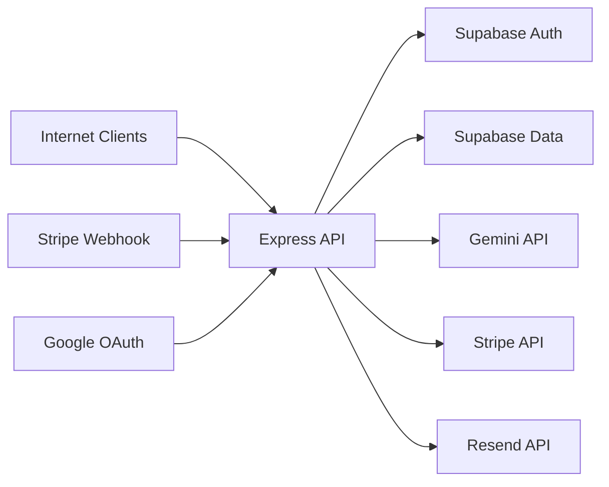

# Assumption-validation check-in
- Production uses `NODE_ENV=production`, so non-prod debug routes remain unavailable to internet users (for example `server/routes/supabase-auth-routes.ts:493`, `server/routes/google-oauth-routes.ts:99`, `server/routes/billing-routes.ts:650`, `server/routes/health-routes.ts:35`).
- The API is internet-reachable, with app-level controls as the primary gatekeepers (`server/index.ts`), and no guaranteed upstream WAF behavior is assumed.
- Supabase service-role access is used by runtime data paths, and authorization is enforced in application code (`apps/api/src/lib/supabase-server.ts:7`, `server/middleware/supabase-auth.ts:341`).
- Student/guardian records (including under-13 consent and linkage state) are sensitive and integrity-critical (`server/routes/supabase-auth-routes.ts`, `server/routes/guardian-consent-routes.ts`, `server/routes/guardian-routes.ts`).
- This model focuses on mounted runtime paths in `server/index.ts`; non-mounted code is treated as secondary risk unless explicitly noted.

Targeted context questions:
1. Is `/api/consent/*` intentionally unauthenticated in production for the entire verification lifecycle?
2. Do you enforce upstream IP/bot throttling beyond app-level `express-rate-limit` and durable account throttles?
3. Do any non-production environments share production Supabase or Stripe resources?

Assumption if unanswered: this report proceeds with conservative defaults (public internet exposure, no strong upstream anti-abuse guarantees, and production-grade data sensitivity).

## Executive summary
The most important risks are concentrated in public or semi-public state-changing flows and in service-role data access patterns. The highest-priority abuse path is the guardian consent verification flow, where checkout session verification is not strongly bound to the consent request identity; second is systemic cross-user risk from application-layer authorization on service-role clients. Availability and cost abuse on AI-backed endpoints are partially controlled but remain a realistic operational threat.

## Scope and assumptions
In-scope paths:
- `server/index.ts` and mounted runtime routes (`server/routes/*`).
- Security/auth middleware in `server/middleware/*` and cookie/session logic in `server/lib/auth-cookies.ts`.
- Service and data-access code used by mounted routes (`apps/api/src/lib/*`, `apps/api/src/services/*`).
- Billing, consent, and webhook processing (`server/routes/billing-routes.ts`, `server/routes/guardian-consent-routes.ts`, `server/lib/webhookHandlers.ts`).

Out-of-scope (primary ranking):
- Non-mounted route modules (for example `server/routes/student-routes.ts`) unless later mounted.
- Test fixtures and CI-only helpers except where they evidence controls (`tests/ci/*`, `.github/workflows/*`).
- Frontend rendering internals except where they change server trust boundaries.

Explicit assumptions:
- Browser clients authenticate via httpOnly Supabase cookies (`server/lib/auth-cookies.ts`, `server/middleware/supabase-auth.ts`).
- Most sensitive records are in Supabase tables queried via service-role clients (`apps/api/src/lib/supabase-server.ts`).
- Public endpoints are discoverable by remote attackers.

Open questions that materially change ranking:
- Whether `/api/consent/request/:id` and `/api/consent/verify-session` are intentionally unauthenticated in production.
- Whether a global edge control layer already dampens distributed search/AI abuse.
- Whether RLS-enforced user-scoped clients are planned for high-value user-data tables.

## System model
### Primary components
- Browser clients (student, guardian, admin) call Express routes in `server/index.ts`.
- Express API applies request-id/security headers/CORS/cookie parsing, then auth middleware and route-specific controls (`server/index.ts:83`, `server/index.ts:86`, `server/index.ts:87`, `server/index.ts:128`).
- Supabase Auth resolution uses anon key + JWT validation (`server/middleware/supabase-auth.ts`).
- Supabase data access primarily uses service-role clients (`apps/api/src/lib/supabase-server.ts`).
- External providers:
- Gemini (embeddings + LLM) via `apps/api/src/lib/embeddings.ts`.
- Stripe API/webhooks via billing routes and webhook handlers.
- Google OAuth token exchange via `server/routes/google-oauth-routes.ts`.
- Resend email API via `server/lib/email.ts`.

### Data flows and trust boundaries
- Internet client -> Express API
  - Data types: credentials, auth cookies, profile updates, practice/exam answers, tutor prompts, guardian link/consent IDs.
  - Channel: HTTPS (HTTP in local dev).
  - Security guarantees: CORS allowlist (`apps/api/src/middleware/cors.ts`), CSRF origin/referer checks (`server/middleware/csrf.ts`), auth/role middleware (`server/middleware/supabase-auth.ts`), per-route limits (`server/index.ts:233`, `server/index.ts:239`, `server/routes/supabase-auth-routes.ts:16`, `server/routes/practice-canonical.ts:127`).
  - Validation: Zod and explicit request validation in auth/practice/full-length/tutor routes.

- Express API -> Supabase Auth (anon client)
  - Data types: JWT from `sb-access-token`.
  - Channel: HTTPS API calls.
  - Security guarantees: bearer header rejection for user-facing auth (`server/middleware/supabase-auth.ts:32`, `server/middleware/supabase-auth.ts:49`).
  - Validation: `supabase.auth.getUser(token)` and user/profile bootstrap.

- Express API -> Supabase data plane (service role)
  - Data types: profiles, guardian links, consent requests, attempts, sessions, entitlements, notifications, analytics.
  - Channel: HTTPS API calls.
  - Security guarantees: route-level ownership and role checks (for example `server/routes/practice-canonical.ts:1453`, `apps/api/src/services/fullLengthExam.ts:2054`).
  - Validation: mostly `.eq("user_id", req.user.id)` and route/service invariants.
  - Trust assumption: code explicitly states application-layer isolation due Neon session limitations (`server/middleware/supabase-auth.ts:338`, `server/middleware/supabase-auth.ts:341`).

- Express API -> Gemini
  - Data types: user prompts, question context, profile-derived tutoring context.
  - Channel: HTTPS to Google APIs.
  - Security guarantees: auth + role + CSRF + limiter around tutor/RAG (`server/index.ts:247`, `server/index.ts:256`), response sanitization for answer/explanation fields (`apps/api/src/routes/rag-v2.ts:16`, `server/routes/tutor-v2.ts:316`).
  - Validation: message length and schema checks (`apps/api/src/lib/rag-types.ts`, `server/routes/tutor-v2.ts`).

- Express API <-> Stripe (checkout/portal/webhook)
  - Data types: subscription metadata, customer IDs, payment status, webhook events.
  - Channel: HTTPS.
  - Security guarantees: signed webhook verification + idempotency gate (`server/lib/webhookHandlers.ts:171`, `server/lib/webhookHandlers.ts:188`), CSRF on billing writes (`server/routes/billing-routes.ts:68`).
  - Validation: strict account_id extraction on webhook objects (`server/lib/webhookHandlers.ts:17`).

- Express API <-> Google OAuth
  - Data types: auth code, state cookie, id_token, session.
  - Channel: browser redirect + HTTPS token exchange.
  - Security guarantees: state cookie creation/validation (`server/routes/google-oauth-routes.ts:151`, `server/routes/google-oauth-routes.ts:210`) and cookie issuance via `setAuthCookies`.

- Express API -> Resend
  - Data types: guardian consent and password-reset emails.
  - Channel: HTTPS.
  - Security guarantees: API-key based auth header (`server/lib/email.ts:27`).
  - Gap: missing key path logs full email payload (`server/lib/email.ts:16`, `server/lib/email.ts:18`).

#### Diagram

## Assets and security objectives
| Asset | Why it matters | Security objective (C/I/A) |
|---|---|---|
| Session cookies (`sb-access-token`, `sb-refresh-token`) | Account takeover risk if compromised | C, I |
| Service-role Supabase access paths | Any authz gap can become cross-user data access/modification | C, I |
| Guardian consent requests and linkage state | COPPA/FERPA-sensitive integrity and parental authorization | C, I |
| Student profile and progress telemetry | Education privacy and trust in learning outcomes | C, I |
| Practice/full-length session state and answer records | Integrity of assessment flow and anti-cheat controls | I |
| Question answers/explanations | Leakage undermines product and assessment integrity | C, I |
| Billing entitlements and Stripe identifiers | Revenue and feature-access correctness | I, A |
| AI quota/budget (Gemini) | Operational availability and spend control | A |
| Audit/security logs | Detection and incident response quality | I, A |

## Attacker model
### Capabilities
- Unauthenticated remote attacker can call public endpoints and automate high-volume traffic.
- Authenticated low-privilege user can tamper with IDs and payloads inside their own session.
- Attacker can attempt distributed abuse to bypass simple per-IP/per-account limits.
- Attacker may obtain leaked links/tokens through phishing, client compromise, or logging exposure.

### Non-capabilities
- Cannot directly access service-role secrets from client-side code under normal operation.
- Cannot forge Stripe webhook signatures without webhook secret.
- Cannot read httpOnly cookies from browser JavaScript without an additional client compromise.
- Cannot access production-hidden debug routes if production gating is correct.

## Entry points and attack surfaces
| Surface | How reached | Trust boundary | Notes | Evidence (repo path / symbol) |
|---|---|---|---|---|
| `POST /api/auth/signup`, `POST /api/auth/signin` | Public internet | Internet -> API -> Supabase Auth | CSRF + auth rate limiter | `server/routes/supabase-auth-routes.ts:16`, `server/routes/supabase-auth-routes.ts:50`, `server/routes/supabase-auth-routes.ts:367` |
| Google OAuth start/callback | Browser redirect | Internet -> Google -> API | State cookie + validation before token exchange | `server/routes/google-oauth-routes.ts:151`, `server/routes/google-oauth-routes.ts:210`, `server/routes/google-oauth-routes.ts:254` |
| `POST /api/rag/v2` | Authenticated user | User session -> API -> Gemini/Supabase | Auth + CSRF + limiter; answer fields sanitized | `server/index.ts:247`, `apps/api/src/routes/rag-v2.ts:16`, `apps/api/src/routes/rag-v2.ts:58` |
| `POST /api/tutor/v2` | Authenticated user | User session -> API -> Gemini/Supabase | Auth + usage limits + reveal gating | `server/index.ts:256`, `server/middleware/usage-limits.ts:13`, `server/routes/tutor-v2.ts:316` |
| `GET /api/questions/search` | Public internet | Internet -> API -> Gemini/Supabase | Public semantic search with per-route limiter | `server/index.ts:239`, `server/index.ts:338`, `server/routes/search-runtime.ts:29` |
| Practice endpoints under `/api/practice` | Authenticated user | User session -> API -> Supabase | Ownership + idempotency; some GETs mutate state | `server/index.ts:375`, `server/routes/practice-canonical.ts:1453`, `server/routes/practice-canonical.ts:2093`, `server/routes/practice-canonical.ts:1606` |
| Full-length endpoints under `/api/full-length` | Authenticated user | User session -> API -> Supabase | Ownership checks in service layer; report/review lock until completion | `server/index.ts:379`, `apps/api/src/services/fullLengthExam.ts:2054`, `apps/api/src/services/fullLengthExam.ts:2266`, `apps/api/src/services/fullLengthExam.ts:2288` |
| `POST /api/guardian/link` | Authenticated guardian | Guardian -> API -> Supabase | Durable rate limiter and 8-char link code lookup | `server/routes/guardian-routes.ts:125`, `server/routes/guardian-routes.ts:136`, `server/lib/durable-rate-limiter.ts:85` |
| Consent endpoints (`/api/consent/request/:id`, `/create-checkout-session`, `/verify-session`) | Public internet | Internet -> API -> Stripe/Supabase | No auth middleware; state-changing verification path | `server/index.ts:268`, `server/routes/guardian-consent-routes.ts:15`, `server/routes/guardian-consent-routes.ts:51`, `server/routes/guardian-consent-routes.ts:112` |
| Billing webhook `POST /api/billing/webhook` | Stripe -> API | Stripe -> API -> Supabase | Raw body + signature verification + idempotency | `server/index.ts:93`, `server/index.ts:89`, `server/lib/webhookHandlers.ts:171`, `server/lib/webhookHandlers.ts:188` |

## Top abuse paths
1. Goal: fraudulently approve guardian consent and create unauthorized guardian-student linkage.
   - Attacker obtains or guesses a valid `requestId` (from leaked link or operational exposure).
   - Attacker creates or reuses any successful Stripe checkout session ID.
   - Attacker calls `POST /api/consent/verify-session` with mismatched `requestId` and `sessionId`.
   - Server verifies payment status but does not strongly bind session metadata to the consent request before approving and linking.
   - Impact: unauthorized consent approval and privacy/integrity breach for under-13 flows.

2. Goal: read/modify another user's records through authz drift.
   - Authenticated user probes ID parameters across practice/full-length/guardian/billing-related surfaces.
   - A missed ownership predicate on a service-role query allows cross-user record access.
   - Because service-role clients bypass RLS, a single missed check can expose or alter sensitive rows.
   - Impact: cross-user data disclosure/tampering.

3. Goal: mutate practice state via cross-site request side effects.
   - Victim is logged in and has active practice session.
   - Attacker induces browser to issue `GET /api/practice/sessions/:sessionId/next?...`.
   - Endpoint updates lifecycle/session item state and may increment usage without CSRF origin checks on that GET path.
   - Impact: forced progression/consumption, session integrity degradation, quota burn.

4. Goal: drive AI-cost and latency pressure.
   - Botnet sends high-cardinality queries to unauthenticated `GET /api/questions/search`.
   - Each request triggers embedding generation and vector search.
   - Distributed traffic weakens per-IP controls and increases provider spend and latency.
   - Impact: availability degradation and operational cost spikes.

5. Goal: unauthorized guardian linking through code-guessing campaigns.
   - Compromised or farmed guardian accounts repeatedly submit `/api/guardian/link` attempts.
   - Attack distributes attempts across identities to bypass per-account durable limits.
   - Valid 8-character student link code is discovered and linked.
   - Impact: unauthorized guardian visibility into student metrics and reports.

6. Goal: elevate to admin via bootstrap misconfiguration.
   - Attacker discovers environment where `ADMIN_PROVISION_ENABLE=true` and passcode is weak/exposed.
   - Attacker calls `/api/auth/admin-provision` in non-production-like deployment.
   - Admin profile is created and used for privileged actions.
   - Impact: full privileged data/control compromise in that environment.

7. Goal: apply fraudulent entitlement changes through forged webhook stream.
   - Attacker compromises webhook secret.
   - Attacker submits validly signed subscription events containing target account metadata.
   - Entitlement state is upserted to paid/active.
   - Impact: revenue loss and unauthorized premium access.

## Threat model table
| Threat ID | Threat source | Prerequisites | Threat action | Impact | Impacted assets | Existing controls (evidence) | Gaps | Recommended mitigations | Detection ideas | Likelihood | Impact severity | Priority |
|---|---|---|---|---|---|---|---|---|---|---|---|---|
| TM-001 | Internet attacker with leaked/guessed consent identifiers | Attacker has a valid `requestId` and any successful `sessionId` | Calls `/api/consent/verify-session` with mismatched session/request identities to approve consent and link guardian | Unauthorized consent approval and account linkage for minors | Guardian consent requests, guardian/student links, profile consent fields | CSRF middleware and Stripe payment-status check (`server/routes/guardian-consent-routes.ts:112`, `server/routes/guardian-consent-routes.ts:123`) | Verification flow does not assert session metadata matches `requestId/childId/guardianEmail`; no explicit expiry/pending-state enforcement in verify path | Require strict metadata binding (`session.metadata.requestId == requestId` and child/guardian match); reject expired/non-pending requests; add one-time signed nonce; add IP/device throttles for consent endpoints | Alert on metadata/request mismatches, repeated verify failures, and consent approvals without expected session metadata | Medium | High | critical |
| TM-002 | Authenticated low-privilege user | Valid account plus an authz bug on any data path | Exploits missing ownership check on service-role query to access/modify another user's records | Cross-user confidentiality/integrity breach | Student data, guardian links, entitlements, exam/practice records | Ownership checks in major flows (`server/routes/practice-canonical.ts:1453`, `apps/api/src/services/fullLengthExam.ts:2054`), role guards (`server/middleware/supabase-auth.ts:458`) | Service-role access bypasses RLS (`apps/api/src/lib/supabase-server.ts:7`); isolation is explicitly app-layer (`server/middleware/supabase-auth.ts:341`) | Shift user-data routes to JWT-scoped clients + RLS where feasible; centralize ownership helper APIs; require negative authz tests per route/service | Alert on IDOR-like probing patterns (high 403/404 for authenticated users), unusual cross-user access attempts in audit logs | Medium | High | high |
| TM-003 | Cross-site attacker targeting authenticated users | Victim has active session and attacker can cause browser GETs | Triggers state-changing `GET /api/practice/sessions/:sessionId/next` to mutate lifecycle and consume usage | Session integrity and usage abuse | Practice sessions/items, free-tier usage counters | Requires auth and client-instance consistency (`server/routes/practice-canonical.ts:2093`, `server/routes/practice-canonical.ts:1601`) | GET path mutates state and usage (`server/routes/practice-canonical.ts:1606`, `server/routes/practice-canonical.ts:1737`) without explicit mutating-GET CSRF middleware (contrast `server/routes/full-length-exam-routes.ts:67`, `server/routes/full-length-exam-routes.ts:204`) | Convert mutating GET to POST + CSRF; or add origin/referer enforcement equivalent to full-length route; ensure idempotent read-only GET semantics | Monitor external referers/user-agents hitting `/api/practice/*/next`; detect unusual serve/usage increments without matching user activity | Medium | Medium | medium |
| TM-004 | Distributed unauthenticated bots | Public internet access to search route | Floods semantic search endpoint to trigger embeddings/vector queries at scale | Availability degradation and spend increase | Gemini quota/budget, search API latency | Route limiter exists (`server/index.ts:239`, `server/index.ts:338`), request validation in search path (`server/routes/search-runtime.ts`) | Endpoint remains unauthenticated and provider-costly per request | Add edge throttling/bot scoring; cache repeated embeddings/results; consider auth for advanced semantic search; introduce provider budget circuit-breakers | Alert on sudden query cardinality, provider call spikes, and p95/p99 latency drift | Medium | Medium | medium |
| TM-005 | Malicious or farmed guardian accounts | Authenticated guardian identities and distributed attempts | Brute-forces 8-char link codes against `/api/guardian/link` | Unauthorized guardian-student linkage | Student privacy and guardian access control | Durable limiter and audit logging (`server/routes/guardian-routes.ts:125`, `server/lib/durable-rate-limiter.ts:85`), format checks (`server/routes/guardian-routes.ts:136`) | Entropy bounded by short code; limiter is per-account and can be distributed across identities | Increase code entropy/TTL/rotation; add global and IP/device throttles; add anomaly lockouts and abuse scoring | Alert on failed link attempts by source, distributed prefix probing, and unusual link churn | Low | Medium | medium |
| TM-006 | External attacker in misconfigured environment | `ADMIN_PROVISION_ENABLE=true` and passcode compromise | Uses `/api/auth/admin-provision` to create admin profile | Privilege escalation in impacted environment | Admin authorization integrity | Production hard-block + passcode requirement (`server/routes/supabase-auth-routes.ts:236`, `server/routes/supabase-auth-routes.ts:245`, `server/routes/supabase-auth-routes.ts:265`) | Bootstrap endpoint still present in runtime and depends on env hygiene | Remove runtime endpoint in deployed builds; perform one-time offline bootstrap; restrict path via network policy | Alert on any invocation of `/api/auth/admin-provision` and any admin role creation event | Low | High | medium |
| TM-007 | Attacker with webhook-secret access | Stripe webhook secret leakage | Sends signed forged subscription events to mutate entitlements | Fraudulent premium enablement and revenue loss | Entitlements, billing integrity | Signature verification and idempotency gate (`server/lib/webhookHandlers.ts:171`, `server/lib/webhookHandlers.ts:188`) plus strict account_id extraction (`server/lib/webhookHandlers.ts:17`) | Secret lifecycle/rotation and blast-radius controls not visible in repo | Rotate webhook secrets periodically; enforce secret manager controls; add abnormal entitlement-change guardrails | Alert on atypical webhook event rates, entitlement spikes, and signature-failure bursts | Low | High | medium |

## Criticality calibration
Critical for this repo:
- Abuse paths that can directly compromise under-13 consent integrity or create unauthorized guardian linkage.
- Cross-user data read/write where one authz miss can expose many users due service-role bypass.
- Example threats: TM-001, catastrophic variant of TM-002.

High for this repo:
- Abuse paths causing major confidentiality/integrity loss with realistic prerequisites.
- Privilege escalation into admin-level control in any environment with sensitive data.
- Example threats: TM-002 (non-catastrophic but confirmed authz drift), TM-006 if environment hygiene is weak.

Medium for this repo:
- Meaningful integrity/availability abuse requiring additional preconditions or distributed effort.
- Fraud/abuse with constrained blast radius and existing partial controls.
- Example threats: TM-003, TM-004, TM-005, TM-007.

Low for this repo:
- Low-sensitivity leaks or conditions that require unlikely misconfiguration plus additional compromise.
- Issues with strong existing containment and limited business/user harm.
- Example class: non-prod debug endpoints when `NODE_ENV=production` is reliably enforced; benign blocked CSRF/CORS probes.

## Focus paths for security review
| Path | Why it matters | Related Threat IDs |
|---|---|---|
| `server/routes/guardian-consent-routes.ts` | Public consent verification and guardian-link creation path with highest integrity risk. | TM-001 |
| `server/index.ts` | Route exposure, middleware order, and public/private boundary definition. | TM-001, TM-003, TM-004, TM-007 |
| `server/middleware/supabase-auth.ts` | Cookie auth resolution, role gates, and explicit app-layer isolation assumptions. | TM-002 |
| `apps/api/src/lib/supabase-server.ts` | Service-role data client boundary and RLS bypass concentration. | TM-002 |
| `server/routes/practice-canonical.ts` | High-volume user writes, ownership/idempotency, and mutating GET behavior. | TM-002, TM-003 |
| `apps/api/src/services/fullLengthExam.ts` | Ownership enforcement and report/review lock logic for exam data. | TM-002 |
| `server/routes/full-length-exam-routes.ts` | Route-level exam state transitions and mutating-GET CSRF pattern to replicate elsewhere. | TM-003 |
| `server/routes/search-runtime.ts` | Public AI-backed semantic search path with spend/DoS implications. | TM-004 |
| `apps/api/src/lib/embeddings.ts` | External LLM/embedding call boundary and payload handling. | TM-004 |
| `server/routes/guardian-routes.ts` | Guardian link-code workflow and authorization checks. | TM-005 |
| `server/lib/durable-rate-limiter.ts` | Durable anti-bruteforce design and failure modes. | TM-005 |
| `server/routes/supabase-auth-routes.ts` | Auth surface, refresh behavior, and admin bootstrap gate. | TM-006 |
| `server/routes/billing-routes.ts` | Authenticated billing state transitions and Stripe API trust boundary. | TM-007 |
| `server/lib/webhookHandlers.ts` | Webhook authenticity/idempotency and entitlement mutation path. | TM-007 |
| `server/lib/auth-cookies.ts` | Session cookie attributes, domain scope, and token lifecycle behavior. | TM-002, TM-003 |
| `server/middleware/csrf.ts` | Cross-site write protections and origin/referer policy baseline. | TM-001, TM-003 |
| `apps/api/src/middleware/cors.ts` | Browser cross-origin trust policy and credentialed request boundary. | TM-003, TM-004 |
| `server/lib/email.ts` | Operational fallback behavior that can log sensitive email payloads. | TM-001 |
