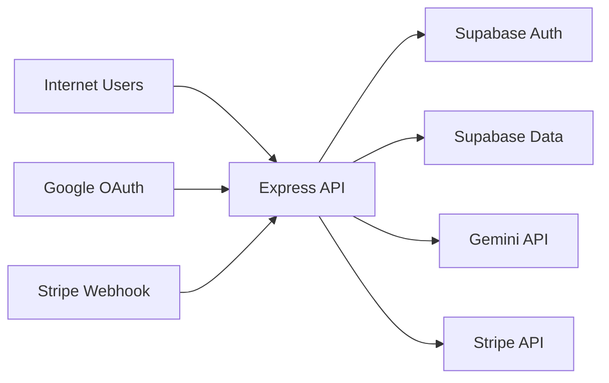

# Assumption-validation check-in
- Production uses `NODE_ENV=production`, so debug routes that return `404` in production are not exposed (`server/routes/supabase-auth-routes.ts:493`, `server/routes/google-oauth-routes.ts:99`, `server/routes/billing-routes.ts:650`, `server/routes/health-routes.ts:35`).
- The public internet can reach the API directly (no mandatory upstream WAF/API gateway throttling beyond app-level middleware).
- `SUPABASE_SERVICE_ROLE_KEY`, Stripe secrets, and Gemini keys are managed as secrets and not intentionally exposed to clients (`apps/api/src/lib/supabase-server.ts:7`, `server/lib/webhookHandlers.ts:161`).
- Student and guardian data are sensitive (education performance, profile linkage, entitlement/billing state).
- Non-mounted legacy code paths are out of runtime scope for this model; priority is the mounted server in `server/index.ts`.

Targeted context questions:
1. Is `GET /api/questions/search` intentionally public and unauthenticated in production?
2. Do you enforce global IP throttling/WAF limits in front of this app today?
3. Are staging/non-production deployments ever pointed at production Supabase/Stripe resources?

Assumption if unanswered: this report proceeds with conservative defaults (public exposure, no strong upstream throttling, production data sensitivity).

## Executive summary
The highest-risk themes are availability/cost abuse on public AI-backed surfaces, and confidentiality/integrity risk from application-layer authorization atop service-role Supabase access. The most important review areas are the public search path (`/api/questions/search`), all service-role data access paths, and privileged flows (admin bootstrap, guardian linking, Stripe webhook entitlement updates).

## Scope and assumptions
In-scope paths:
- `server/` runtime entrypoint and mounted route tree (`server/index.ts`).
- `apps/api/src/lib/` and `apps/api/src/services/` components called by mounted routes (RAG, embeddings, Supabase clients, full-length exam service).
- Security middleware and auth/session handling in `server/middleware/`, `server/lib/auth-cookies.ts`.
- Billing and webhook logic in `server/routes/billing-routes.ts`, `server/lib/webhookHandlers.ts`.

Out-of-scope (for primary risk ranking):
- Frontend rendering details in `client/` unless they directly alter server trust boundaries.
- Test-only behavior and fixtures (`tests/`, `test/`), except where they evidence intended controls.
- Deprecated or non-mounted routes not referenced by `server/index.ts`.

Assumptions:
- API is internet-exposed.
- Student progress, linked guardian/student relationships, and entitlement state are sensitive.
- No DB-native RLS backstop exists for Neon-backed routes, based on explicit application-layer isolation note (`server/middleware/supabase-auth.ts:341`).
- Production deployments rely on env-secret hygiene and are not intentionally exposing debug endpoints.

Open questions that would materially change ranking:
- Whether an upstream WAF/CDN already rate-limits anonymous search and large bodies.
- Whether production enforces stronger network segmentation for admin/bootstrap routes.
- Whether non-production environments can impact production billing or user data.

## System model
### Primary components
- Browser/mobile clients (student, guardian, admin) call Express API.
- Express runtime in `server/index.ts` mounts auth, practice, tutor/RAG, guardian, billing, and full-length exam routes.
- Supabase:
- Auth verification via anon client (`server/middleware/supabase-auth.ts`).
- Data reads/writes via service-role client (`apps/api/src/lib/supabase-server.ts`) and route/service logic.
- External providers:
- Gemini embeddings/LLM (`apps/api/src/lib/embeddings.ts`) for search/tutor/RAG.
- Stripe checkout/webhook/portal (`server/routes/billing-routes.ts`, `server/lib/webhookHandlers.ts`).
- Google OAuth callback and token exchange (`server/routes/google-oauth-routes.ts`).

### Data flows and trust boundaries
- Internet client -> Express API
- Data: credentials, cookies, question answers, tutor prompts, guardian link codes, billing actions.
- Channel: HTTPS/HTTP (Express).
- Security guarantees: CORS allowlist and CSRF origin/referer checks (`apps/api/src/middleware/cors.ts`, `server/middleware/csrf.ts`), auth/role middleware (`server/middleware/supabase-auth.ts`), selective rate limits (`server/index.ts:232`, `server/routes/supabase-auth-routes.ts:14`, `server/routes/practice-canonical.ts:111`).
- Validation: Zod schemas and explicit checks in auth/full-length/practice/tutor routes.
- Express API -> Supabase Auth (anon key)
- Data: session tokens (`sb-access-token`) for user resolution.
- Channel: Supabase HTTPS API.
- Security guarantees: cookie-only token resolution (Bearer rejected) and auth middleware (`server/middleware/supabase-auth.ts:35`).
- Validation: token verification through `supabase.auth.getUser`.
- Express API -> Supabase data plane (service role)
- Data: profiles, attempts, sessions, entitlements, notification state, guardian links.
- Channel: Supabase HTTPS API.
- Security guarantees: route-level ownership/role checks; no DB-level RLS guarantee for Neon path noted in code (`server/middleware/supabase-auth.ts:341`).
- Validation: per-route `.eq("user_id", req.user.id)` style filters and guard middleware.
- Express API -> Gemini
- Data: user query text and contextual question metadata.
- Channel: provider HTTPS API.
- Security guarantees: route auth for tutor/RAG; response sanitization for answer/explanation fields (`apps/api/src/routes/rag-v2.ts`, `server/routes/tutor-v2.ts`).
- Validation: request schema validation and text length limits in route/schema and embeddings helper (`apps/api/src/lib/embeddings.ts:46`).
- Stripe -> Express webhook endpoint
- Data: signed Stripe events affecting entitlements.
- Channel: HTTPS webhook.
- Security guarantees: signature verification and idempotency gate (`server/lib/webhookHandlers.ts:171`, `server/lib/webhookHandlers.ts:187`).
- Validation: strict `account_id` extraction rules and event-type handling.
- Express API -> Google OAuth/Supabase ID token sign-in
- Data: OAuth code/state and resulting id token/session.
- Channel: browser redirect + HTTPS token exchange.
- Security guarantees: state cookie + state validation (`server/routes/google-oauth-routes.ts:153`, `server/routes/google-oauth-routes.ts:209`), secure cookie session issuance.

#### Diagram

## Assets and security objectives
| Asset | Why it matters | Security objective (C/I/A) |
|---|---|---|
| Supabase session cookies and refresh tokens | Session hijack yields account takeover and data access | C, I |
| `SUPABASE_SERVICE_ROLE_KEY` access paths | Service-role bypass can expose/modify cross-user data | C, I |
| Student progress, attempts, exam state | Educational privacy and integrity of learning outcomes | C, I |
| Question bank answers/explanations | Premature leakage undermines exam/practice integrity | C, I |
| Guardian-student links | Incorrect links expose minors' data to unauthorized adults | C, I |
| Billing entitlement and Stripe identifiers | Fraud or tampering causes revenue and authorization errors | I, A |
| Gemini quota and API spend | Abuse can drive cost spikes and availability degradation | A |
| Audit/security event logs | Needed for incident detection and forensics | I, A |

## Attacker model
### Capabilities
- Remote unauthenticated attacker can call public GET endpoints and high-volume request traffic.
- Authenticated low-privilege users (student/guardian) can tamper with IDs/payloads within their session.
- Attacker can automate distributed requests to evade per-account controls.
- Attacker can attempt social engineering/token theft outside app controls.

### Non-capabilities
- Cannot directly query DB without compromising server-side secrets.
- Cannot forge Stripe webhook events without webhook secret/signature material.
- Cannot read `httpOnly` cookies from browser JS absent a separate XSS compromise.
- Cannot use production-hidden debug endpoints if production gating is correctly configured.

## Entry points and attack surfaces
| Surface | How reached | Trust boundary | Notes | Evidence (repo path / symbol) |
|---|---|---|---|---|
| `GET /api/questions/search` | Public HTTP GET | Internet -> API -> Gemini/Supabase | Unauthenticated semantic search invokes embeddings and vector lookup | `server/index.ts:328`, `server/routes/search-runtime.ts:12`, `server/routes/search-runtime.ts:30` |
| `POST /api/auth/signin` / `signup` | Public HTTP POST | Internet -> API -> Supabase Auth | Rate-limited auth endpoints with CSRF checks | `server/routes/supabase-auth-routes.ts:14`, `server/routes/supabase-auth-routes.ts:311` |
| `POST /api/auth/refresh` | HTTP POST with cookie/body token | Internet -> API -> Supabase Auth | Accepts refresh token from cookie or body | `server/routes/supabase-auth-routes.ts:450`, `server/routes/supabase-auth-routes.ts:454` |
| `POST /api/rag/v2` | Authenticated HTTP POST | Auth user -> API -> Gemini/Supabase | CSRF + auth + role + rate limit; response sanitization | `server/index.ts:240`, `apps/api/src/routes/rag-v2.ts:56` |
| `POST /api/tutor/v2` | Authenticated HTTP POST | Auth user -> API -> Gemini/Supabase | Rate limit + usage limits + reveal policy checks | `server/index.ts:249`, `server/middleware/usage-limits.ts:13`, `server/routes/tutor-v2.ts:225` |
| `POST /api/guardian/link` | Authenticated guardian POST | Guardian -> API -> Supabase | Link code based relationship boundary | `server/routes/guardian-routes.ts:138`, `server/routes/guardian-routes.ts:148` |
| `POST /api/billing/checkout` / `portal` | Authenticated POST | User -> API -> Stripe/Supabase | CSRF protected billing state transitions | `server/routes/billing-routes.ts:68`, `server/routes/billing-routes.ts:572` |
| `POST /api/billing/webhook` | Stripe webhook POST | Stripe -> API | Raw body signature verification before processing | `server/index.ts:92`, `server/lib/webhookHandlers.ts:171` |
| Google OAuth start/callback | Browser redirect + callback | Browser/Google -> API -> Supabase | State cookie + callback validation | `server/routes/google-oauth-routes.ts:153`, `server/routes/google-oauth-routes.ts:209` |
| Full-length exam endpoints | Authenticated GET/POST | Student -> API -> Supabase | Anti-leak and ownership enforced in service layer | `server/routes/full-length-exam-routes.ts`, `apps/api/src/services/fullLengthExam.ts` |

## Top abuse paths
1. Goal: exhaust AI quota and degrade service.
   Steps: attacker scripts `GET /api/questions/search` with many distinct queries -> each call triggers embedding generation -> Gemini quota/cost spike and latency increase.
   Impact: availability and spend disruption for all users.
2. Goal: memory/CPU denial of service.
   Steps: attacker sends many large JSON requests near global `50mb` parser limit -> body parsing occurs before route auth logic -> worker memory pressure and request backlog.
   Impact: API degradation/outage.
3. Goal: cross-user data access.
   Steps: authenticated attacker fuzzes IDs across routes using service-role data access -> finds an endpoint with missing ownership guard -> reads/modifies other users' data.
   Impact: confidentiality/integrity breach (student records, guardian links, billing state).
4. Goal: unauthorized guardian access to student data.
   Steps: guardian account automates link-code guessing across many accounts/IPs -> valid `student_link_code` discovered -> link established.
   Impact: privacy breach for linked student performance and reports.
5. Goal: privilege escalation to admin.
   Steps: attacker discovers non-production or misconfigured environment with admin bootstrap enabled -> brute-forces or obtains passcode -> creates admin user through `/api/auth/admin-provision`.
   Impact: full control over privileged operations and data.
6. Goal: fraudulent premium entitlement.
   Steps: attacker obtains Stripe webhook secret -> sends validly signed forged subscription events with target `account_id` metadata -> entitlement records updated.
   Impact: revenue loss and unauthorized paid-feature access.
7. Goal: persistent account hijack after token theft.
   Steps: attacker steals refresh token (outside app) -> calls `/api/auth/refresh` with body token -> receives renewed session cookies.
   Impact: long-lived unauthorized account access.

## Threat model table
| Threat ID | Threat source | Prerequisites | Threat action | Impact | Impacted assets | Existing controls (evidence) | Gaps | Recommended mitigations | Detection ideas | Likelihood | Impact severity | Priority |
|---|---|---|---|---|---|---|---|---|---|---|---|---|
| TM-001 | Unauthenticated internet attacker | Public API reachability and no upstream hard throttling | Flood `GET /api/questions/search` to force embedding + vector calls | Cost spike and user-facing latency/outage | Gemini quota, API availability, operating cost | Query presence and bounded `limit` (`server/routes/search-runtime.ts:18`, `server/routes/search-runtime.ts:21`) | No explicit rate limit/auth/caching on this public route (`server/index.ts:328`) | Add IP and token-based throttles for `/api/questions/search`; optional auth gate for semantic search; cache embeddings/results for repeated queries; add circuit breaker for provider failures | Alert on search QPS, Gemini request volume, and spend anomalies; per-route latency/error SLO alarms | High | High | high |
| TM-002 | Authenticated low-privilege user | Valid session and discovery of an endpoint with missing owner checks | Exploit authz drift on service-role data paths to read/write cross-user records | Cross-tenant/privacy breach; integrity tampering | Student data, guardian links, entitlements, notifications | Auth middleware and role guards (`server/middleware/supabase-auth.ts:386`, `server/middleware/supabase-auth.ts:458`); regression tests include IDOR checks (`package.json:28`) | Data isolation explicitly app-layer (no DB RLS backstop) (`server/middleware/supabase-auth.ts:341`); service-role client bypasses RLS (`apps/api/src/lib/supabase-server.ts:62`) | Move high-risk tables to DB-enforced RLS where possible; use user-scoped client for user data paths; centralize ownership predicates in shared helpers; add route-level authorization invariants in CI | Detect anomalous cross-user ID access patterns and repeated 403/404 probing by authenticated users | Medium | High | high |
| TM-003 | Unauthenticated internet attacker | Ability to issue repeated large requests | Send repeated near-`50mb` JSON payloads to POST endpoints | Memory and CPU exhaustion causing degraded availability | API availability | Some route-level rate limits on auth/rag/practice (`server/routes/supabase-auth-routes.ts:14`, `server/index.ts:232`, `server/routes/practice-canonical.ts:111`) | Global parser is broad (`server/index.ts:124`) and applies before most route logic; no uniform global request-size strategy | Reduce default JSON limit globally (for example `1-2mb`) and apply larger limits only on specific routes; enforce reverse-proxy body limits; add global connection/IP throttles | Monitor large request body distribution, worker RSS growth, and 5xx spikes by request size | Medium | High | high |
| TM-004 | Malicious guardian user (or distributed account farm) | Guardian auth and repeated attempts | Brute-force/link-code attacks against `/api/guardian/link` | Unauthorized guardian-student association and downstream data access | Guardian link integrity, student privacy | Guardian-only route, CSRF, durable per-guardian limiter (`server/routes/guardian-routes.ts:138`, `server/routes/guardian-routes.ts:20`); uniform invalid-code message (`server/routes/guardian-routes.ts:164`) | Code is fixed-length 8 chars (`server/routes/guardian-routes.ts:149`); limiter is account-scoped, not clearly global/IP-scoped | Increase code entropy and rotation; add IP/device/global throttles; add abuse scoring and temporary lockouts; consider CAPTCHA after repeated failures | Alert on high failed-link attempts by IP/device/account and unusual cross-account link attempts | Medium | Medium | medium |
| TM-005 | External attacker targeting misconfigured environment | `ADMIN_PROVISION_ENABLE=true`, reachable route, passcode known/guessable | Create admin via `/api/auth/admin-provision` | Administrative takeover | Admin integrity, all user data | Hard disabled in production and default-off flag checks (`server/routes/supabase-auth-routes.ts:188`, `server/routes/supabase-auth-routes.ts:189`); passcode required (`server/routes/supabase-auth-routes.ts:209`) | Bootstrap path still present in runtime in non-prod; risk if env config drifts or non-prod has prod data | Remove bootstrap route from deployed runtime; replace with one-time offline provisioning script; enforce network allowlist for admin bootstrap endpoints | Alert on any call to `/api/auth/admin-provision`; track admin-account creation events and environment context | Low | High | medium |
| TM-006 | Attacker with leaked Stripe webhook secret | Secret compromise via operational leak or host compromise | Submit forged signed webhook events to alter entitlements | Fraudulent premium access and revenue impact | Billing entitlements, revenue integrity | Signature verification (`server/lib/webhookHandlers.ts:171`), strict account ID extraction, and idempotency gate (`server/lib/webhookHandlers.ts:187`) | Secret lifecycle/rotation and anomaly controls not visible in repo | Rotate webhook secrets regularly; enforce secret manager usage; verify `livemode`/expected account context; add dual-control runbook for webhook secret changes | Alert on unusual webhook event patterns by account, sudden entitlement spikes, and repeated signature failures | Low | High | medium |
| TM-007 | Attacker with stolen refresh token | Refresh token theft via external channel (phishing/proxy/log leak) | Replay token at `/api/auth/refresh` via body path | Persistent session hijack until revocation | Session integrity, user data confidentiality | httpOnly secure cookies with domain scoping (`server/lib/auth-cookies.ts:16`); CSRF protection on refresh (`server/routes/supabase-auth-routes.ts:450`) | Refresh token accepted from request body (`server/routes/supabase-auth-routes.ts:454`), broadening handling surfaces | Accept refresh token only from httpOnly cookie; rotate refresh token on every use and bind device/session metadata; add revocation-on-anomaly controls | Monitor refresh events by IP/device drift and rapid multi-location refresh attempts | Medium | Medium | medium |

## Criticality calibration
For this repo/context:
- `critical`: easy-to-exploit paths enabling full account/system compromise or broad cross-user data disclosure at scale.
- `high`: realistic abuse causing major confidentiality/integrity loss or sustained availability/cost harm.
- `medium`: meaningful abuse requiring stronger preconditions or yielding bounded blast radius.
- `low`: niche misuse with limited impact or strong existing containment.

Examples for this repo:
- `critical` examples: confirmed cross-user read/write due missing ownership check on service-role path; exposed service-role key in a reachable artifact.
- `high` examples: unauthenticated search endpoint quota-burn DoS; parser-level large-body DoS causing prolonged API instability.
- `medium` examples: guardian link-code brute force with distributed identities; admin provisioning misuse limited to misconfigured/non-prod-like conditions; refresh token replay requiring token theft.
- `low` examples: noisy but blocked CORS/CSRF probing with no state change; failed webhook forgery attempts without valid signature material.

## Focus paths for security review
| Path | Why it matters | Related Threat IDs |
|---|---|---|
| `server/index.ts` | Central trust boundary and middleware order (auth, body parsing, public search, rate limits, webhook raw-body handling). | TM-001, TM-003, TM-006 |
| `server/routes/search-runtime.ts` | Public semantic search path that calls embedding + vector services. | TM-001 |
| `apps/api/src/lib/embeddings.ts` | External AI spend and payload handling boundaries; max input truncation behavior. | TM-001, TM-003 |
| `apps/api/src/lib/supabase.ts` | Vector RPC invocation behavior and error fallback semantics. | TM-001 |
| `server/middleware/supabase-auth.ts` | Cookie-only auth, role guards, and explicit app-layer isolation assumptions. | TM-002, TM-007 |
| `apps/api/src/lib/supabase-server.ts` | Service-role Supabase client boundary and RLS bypass risk concentration. | TM-002 |
| `server/routes/practice-canonical.ts` | High-volume student write path with ownership/idempotency controls and answer processing. | TM-002, TM-003 |
| `server/routes/full-length-exam-routes.ts` | High-value exam integrity and anti-leak orchestration at route boundary. | TM-002 |
| `apps/api/src/services/fullLengthExam.ts` | Service-layer ownership checks and review/answer-leak controls. | TM-002 |
| `server/routes/guardian-routes.ts` | Guardian linking, entitlement checks, and student-access authorization boundaries. | TM-004, TM-002 |
| `server/lib/durable-rate-limiter.ts` | Abuse-resistance for guardian linking; account-scoped durable throttling implementation. | TM-004 |
| `server/routes/supabase-auth-routes.ts` | Login/signup/refresh/admin-bootstrap attack surface. | TM-005, TM-007 |
| `server/lib/auth-cookies.ts` | Session cookie confidentiality/integrity attributes and domain scope. | TM-007 |
| `server/routes/billing-routes.ts` | Checkout/portal logic and role/account linkage for billing actions. | TM-006, TM-002 |
| `server/lib/webhookHandlers.ts` | Signature verification, idempotency, and entitlement mutation path from Stripe events. | TM-006 |
| `server/middleware/csrf.ts` | Cross-site state-change protection through origin/referer policy. | TM-007 |
| `apps/api/src/middleware/cors.ts` | Origin allowlist behavior and cross-origin request controls. | TM-001, TM-007 |
