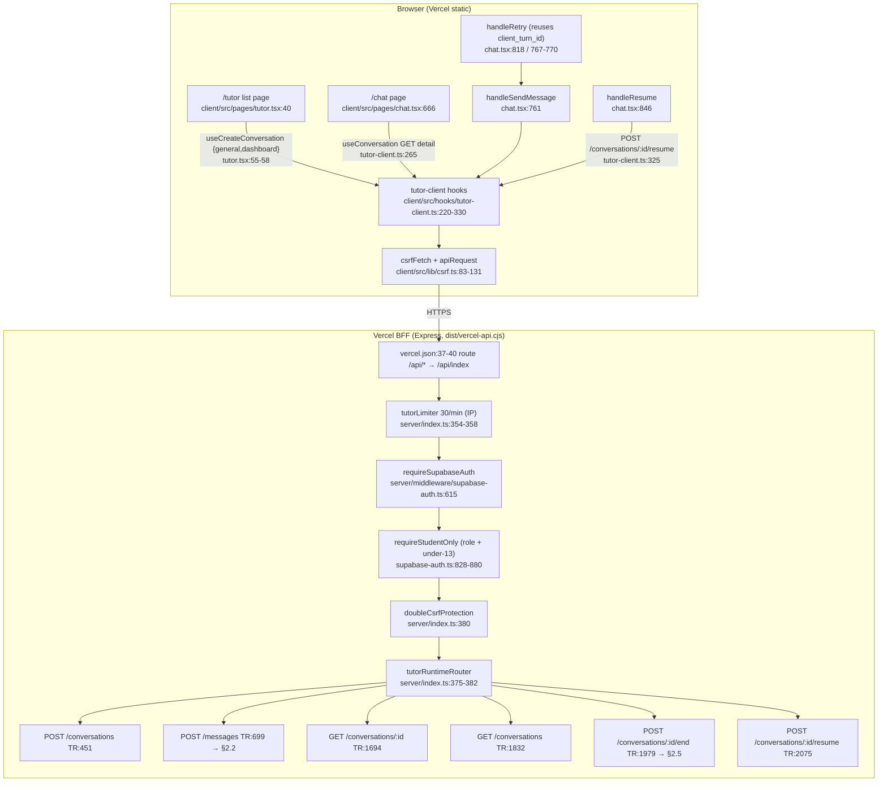
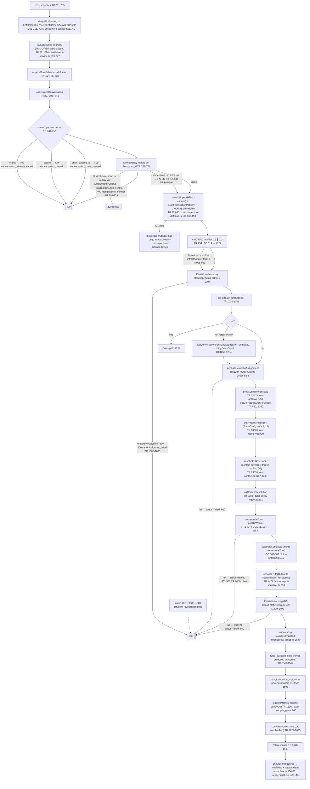
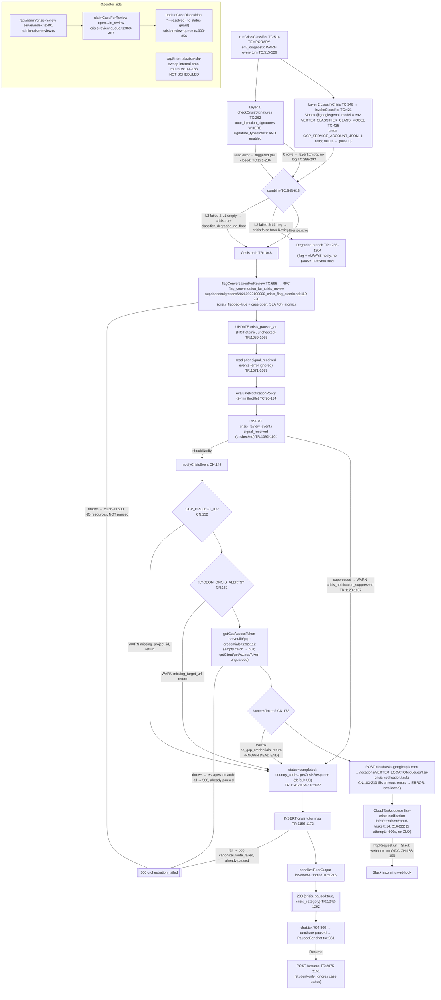
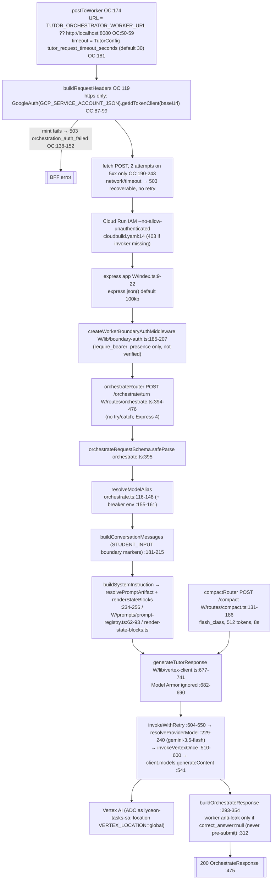
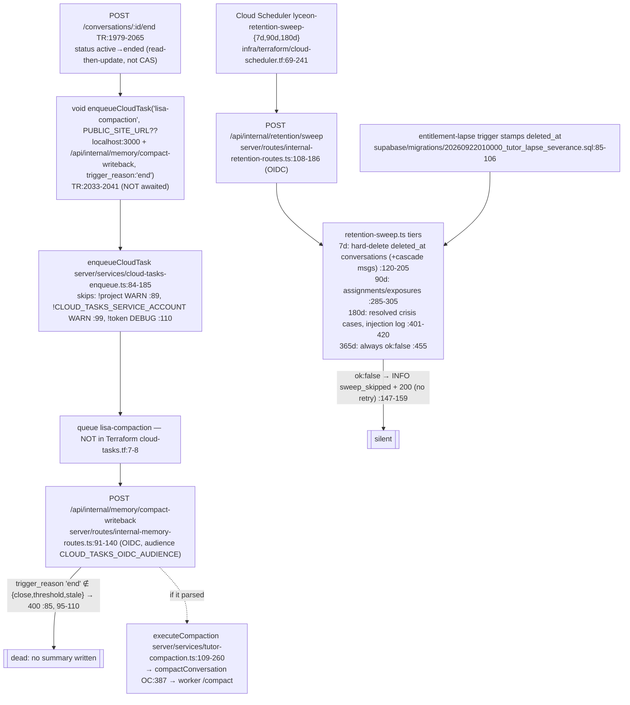
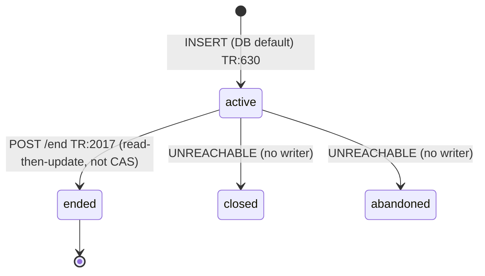
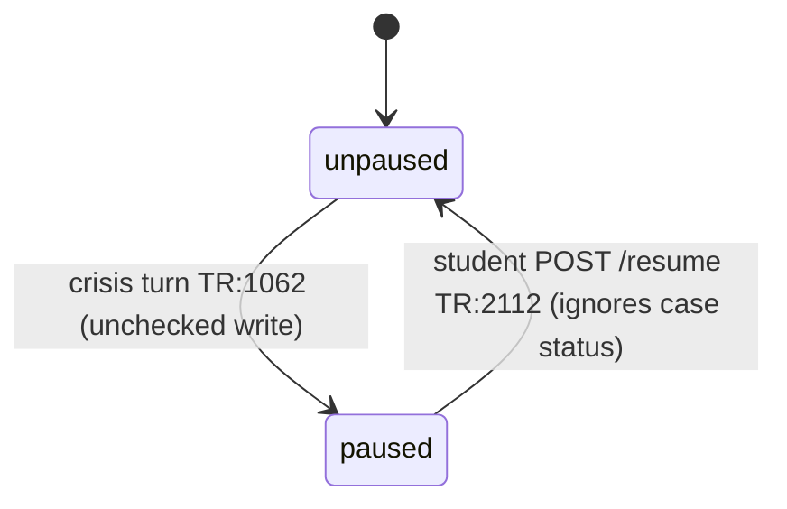
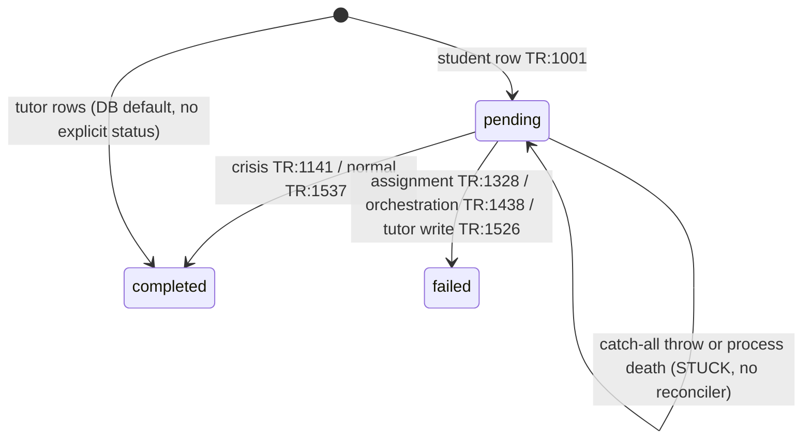

# LISA Vertical Flow Map

> **Status:** read-only documentation. Every claim is traced to code as `file:line`.
> **Snapshot:** `origin/main` @ `adfa158` (merge of PR #841 from `lisa`), read 2026-09-23.
> **Ground rule:** this records what the **code** does. It is not what the Doc 03 family says, and not how the system was designed. Where the code and a spec disagree, the code is recorded here and the disagreement is listed in §7.3.
> **UNKNOWN** means the question cannot be settled by reading the repo. Each UNKNOWN names what would settle it.

Line numbers drift. §9 says how to keep this document current.

---

## 0. Read this first — the vertical is not what we believe it is

These are the places where the code differs materially from the working assumptions in the brief. Each is verified in code.

| # | Belief | What the code does | Evidence |
|---|---|---|---|
| 0.1 | "The worker is on `gemini-2.5-pro` (retires 2026-10-16)." | **No code path calls any `gemini-2.5-*` model.** Both worker aliases, `pro_class` and `flash_class`, resolve to **`gemini-3.5-flash`**. That model is the deploy value and the hardcoded default. The "pro" route and the pro→flash fallback call the same model. The crisis classifier (BFF) uses `VERTEX_CLASSIFIER_CLASS_MODEL`, which has no default. The repo sets it only on the worker (`gemini-3.1-flash-lite`), where it is never read. The only `gemini-2.5` string in the repo is a retired, unread `VERTEX_MODEL` entry in the inventory. | `apps/workers/tutor-orchestrator/src/lib/vertex-client.ts:229-240`; `apps/workers/tutor-orchestrator/cloudbuild.yaml:15`; `server/services/tutor-crisis.ts:425-429`; `infra/secret-class-inventory.yaml:1184` |
| 0.2 | "There are three surfaces: standalone, practice, review." | **Only standalone exists in the client.** Two files import `tutor-client`: `client/src/pages/tutor.tsx` and `client/src/pages/chat.tsx`. Both on `main` and on `lisa`. Both create `entry_mode:"general", source_surface:"dashboard"` only. The server supports practice and review scoping, but no client code calls it. | `tutor.tsx:55-58`; `chat.tsx:748-752`; `git grep tutor-client origin/lisa -- client/src` |
| 0.3 | "Model Armor protects input/output." | **Model Armor is bypassed entirely.** The worker ignores the template IDs. `_buildInputModelArmorConfig` and `sanitizeOutput` have no callers. `armorOutputBlocked` is hardcoded `false`. The BFF would send `null` template IDs anyway (see 0.4). Separately, the Terraform templates live in `us-central1`, while the worker would address `locations/global`. | `vertex-client.ts:677-690, 295, 343, 737`; `infra/terraform/model-armor.tf:16,65` |
| 0.4 | "Runtime config comes from `tutor_context_runtime_config`." **✅ Resolved 2026-09-24, see K2.** | **`TutorConfig.loadAll()` is never called in non-test code.** All **22** keys serve hardcoded defaults on every call, and each call logs a WARN `cache_not_loaded`. Only 6 keys are read at all. The DB seeds are ignored, including the Model Armor template IDs, so those go out as `null`. | `server/services/tutor-config.ts:30-107, 266-280`; repo grep for `loadAll(` / `refreshCache(` finds only tests |
| 0.5 | "A failed turn is recoverable via retry." | **A turn that fails after the student message is persisted can never complete under the same `client_turn_id`.** The retry path "falls through" (`tutor-runtime.ts:899-900`) and **re-inserts** the student row (`:984-1003`). The unique index on `(student_id, conversation_id, client_turn_id, role)` rejects that insert, so the student gets 500 `canonical_write_failed`. The client **reuses** the `client_turn_id` on "Try again" (`chat.tsx:767-770`). So "Try again" after any orchestration failure always fails. | `supabase/migrations/20260812010000_tutor_messages_idempotency_role.sql:41-43` |
| 0.6 | "A paused conversation is only a rendering bug." | **The pause is invisible to the client after any reload.** `GET /conversations/:id` does not return `crisis_paused_at`, `title` or `surface`. The client derives `isPaused` from `crisis_paused_at`, so it is always false. The student sees a normal composer, every send returns 409, and there is no Resume button. | `tutor-runtime.ts:1789-1806`; `chat.tsx:691, 701, 1083-1089` |
| 0.7 | "Memory compaction runs at session end." | **Compaction has never succeeded from this path.** There are three independent failures: (a) `/end` enqueues `trigger_reason:"end"`, but the handler only accepts `close\|threshold\|stale`, so it returns 400; (b) the `lisa-compaction` queue is not provisioned in Terraform; (c) the enqueue is `void` (never awaited) on Vercel. No other trigger exists; the "stale-summary sweep" named in comments does not exist. | `tutor-runtime.ts:2033-2041`; `server/routes/internal-memory-routes.ts:85`; `infra/terraform/cloud-tasks.tf:7-8` |
| 0.8 | "Crisis alerts go through the notification system." | **Crisis alerts do not touch `emit_notification_event`.** They are a direct Cloud Tasks POST whose task target *is the Slack webhook URL*. No task handler exists in the repo. Nothing records delivery. Three env/credential guards skip the alert with a WARN only. | `server/services/crisis-notification.ts:142-240` |
| 0.9 | "The exam gate is a live safety control that fails open only on error." | `full_length_exam_sessions` is created by **no migration** on this branch. **Every** `/messages` call takes the fail-open path and logs a WARN containing `studentId`. SCL-079 is still **PROPOSED** in the register. | `server/services/entitlement-service.ts:219-247`; `docs/SpecAudit/SPEC_CHANGES_LOG.md:144,177` |
| 0.10 | "The Slack alert is the operator signal for crisis." | The SLA-breach sweep (`/api/internal/crisis-sla-sweep`) exists but is **not scheduled** anywhere: not in `vercel.json` and not in `cloud-scheduler.tf`. A case whose alert was skipped is never surfaced again. | `server/routes/internal-cron-routes.ts:126-188`; `vercel.json:6-35` |

---

## 1. Precondition

| Item | Value |
|---|---|
| Branch (working) | `claude/wizardly-franklin-ucty85` |
| `HEAD` at read | `adfa1587be6c30e8d2a5cef4f9bfa680851780c5` = `origin/main` |
| `git status --porcelain` at start | clean |
| `git rev-parse --show-toplevel` | `/home/user/Lyceonai` |
| `origin/main` vs `origin/lisa` | `main` = `lisa` + one merge commit; tree diff empty |

**Method.** The primary path (`server/routes/tutor-runtime.ts`, the BFF services and the orchestrator client) was read line by line. Five parallel read-only sweeps covered configuration, the crisis path, the client contract, the worker, and state/retention. Every §0 item and every "known" dead end was re-verified against source before inclusion. Nothing was executed against live infrastructure. Anything that depends on live infrastructure is UNKNOWN.

---

## 2. The map

The single end-to-end diagram was unreadable (>80 nodes). It is split into six diagrams that share node names at their boundaries:

- **2.1** Client → BFF entry (standalone surface; practice/review do not exist in the client, §0.2)
- **2.2** BFF turn pipeline (`POST /api/tutor/messages`)
- **2.3** Crisis branch and notification chain
- **2.4** Worker (`POST /orchestrate/turn`, `POST /compact`) and Vertex
- **2.5** Session end, compaction, retention
- **2.6** Degraded and fail-closed paths (summary)

Path abbreviations: `TR` = `server/routes/tutor-runtime.ts`, `TC` = `server/services/tutor-crisis.ts`, `CN` = `server/services/crisis-notification.ts`, `OC` = `server/lib/tutor-orchestrator-client.ts`, `W/` = `apps/workers/tutor-orchestrator/src/`.

### 2.1 Client → BFF entry

### 2.2 BFF turn pipeline — `POST /api/tutor/messages`

The code order differs from Doc 03B §6.5: the crisis classifier runs **before** the student message is persisted, and **in the BFF**, not inside orchestration. See §7.3.

### 2.3 Crisis branch and notification chain

### 2.4 Worker (Cloud Run `lyceon-tutor-orchestrator`, us-central1)

### 2.5 Session end, compaction, retention

### 2.6 Degraded and fail-closed paths (summary)

| Condition | Path taken | Direction | Source |
|---|---|---|---|
| Entitlement RPC error | 403 `entitlement_required` | fail closed | `entitlement-service.ts:59, 94-105` |
| Exam table query error (always, today) | turn allowed | **fail open** | `entitlement-service.ts:232-244` |
| Signature table unreadable (injection) | turn flagged as injection, **proceeds**; severity-5 abuse incident written | "closed" = flag only | `tutor-injection-defense.ts:199-209, 276-345` |
| Crisis L1 table unreadable | crisis path | fail closed | `TC:271-284` |
| Crisis L2 fails, L1 empty | crisis path (`classifier_degraded_no_floor`) | fail closed | `TC:553-571` |
| Crisis L2 fails, L1 negative | normal turn + forced review case + alert | fail open with review | `TC:572-579`, `TR:1266-1284` |
| Classifier throws | crisis path (`infrastructure_failure`) | fail closed | `TR:955-981` |
| Pre-submit state unresolvable | treated as pre-submit | fail closed | `tutor-antileak.ts:66-110` |
| Correct answer unresolvable pre-submit | response substituted | fail closed | `tutor-output-serializer.ts:303-315` |
| Serializer throws | response substituted | fail closed | `tutor-output-serializer.ts:262-285` |
| Memory summaries / structured fields fail | empty / null context | degrade | `tutor-context.ts:1272-1318` |
| Envelope Zod fails | throw → catch-all 500, row left `pending` | fail closed (stuck) | `tutor-context.ts:1241-1256` |
| Worker 5xx / timeout | 503 `orchestration_failed_recoverable` | fail closed | `OC:201-243` |
| Worker 4xx (incl. Vertex safety block 422) | **generic 500** `orchestration_failed` | fail closed, no safe message | `OC:245-281`; `vertex-client.ts:550-559` |

---

## 3. Dead ends

A **dead end** is any point where a request stops and neither the student nor an operator is told. "Alerts" means an out-of-band signal. The only in-repo mechanism is `logger` forwarding `level==="error"` to `ERROR_MONITOR_WEBHOOK_URL`, via an un-awaited `void` (`server/logger.ts:566-569`). Whether that variable is set in Vercel is **UNKNOWN**; the Vercel env listing would settle it. **No** Terraform alert policy exists (`infra/terraform/` has no `google_monitoring_*` resource). So "Alerts" is at best "error-webhook if configured" and otherwise "none".

### 3.1 The four known dead ends — all four surfaced

| # | Known | Exact location | Trigger | Student sees | Logged | Alerts |
|---|---|---|---|---|---|---|
| K1 | **✅ RESOLVED 2026-09-24** (#846: every skip now logs ERROR with its reason; project and token both come from `GCP_SERVICE_ACCOUNT_JSON`; the `VERTEX_PROJECT_ID` guard is gone). **Proof:** C-03, two alerts delivered to `#lyceon-crisis` on 09-23, and W2-2a, the breach alert delivered on 09-24. *Original finding:* Crisis notification returns before enqueue | `server/services/crisis-notification.ts:172-181` (`if (!accessToken) { logger.warn(...no_gcp_credentials...); return; }`). There are **two sibling guards of the same shape** before it, at `:152-160` (`!GCP_PROJECT_ID`) and `:162-170` (`!LYCEON_CRISIS_ALERTS`). | `getGcpAccessToken()` returns null when `GCP_SERVICE_ACCOUNT_JSON` is missing, unparsable or fails Zod: `server/lib/gcp-credentials.ts:94-98` swallows the error in an **empty `catch {}`**. `GCP_PROJECT_ID` is `VERTEX_PROJECT_ID ?? GCP_PROJECT_ID` at module load (`CN:67-68`), so an **empty-string** `VERTEX_PROJECT_ID` trips the guard even when `GCP_PROJECT_ID` is set. | Normal 200 crisis response. Nothing indicates the alert failed. | WARN (`no_gcp_credentials` / `missing_project_id` / `missing_target_url`) | **None**: WARN is not forwarded (`server/logger.ts:566`) |
| K2 | **✅ RESOLVED 2026-09-24** (#865: `TutorConfig.bootLoad()` at module load; the per-call WARN is removed). **Proof:** W4-3, production `cache_loaded` with 24 keys and the Model Armor IDs read from the DB; the prior deployment shows `cache_not_loaded` in the same log window. *Original finding:* `TutorConfig.loadAll()` never called | `server/services/tutor-config.ts:193` (definition), `:266-280` (fallback). No non-test caller. | Every `TutorConfig.get` | Nothing directly. Timeout, message window, friction threshold and promotion threshold are defaults. Model Armor IDs are `null`. | WARN `cache_not_loaded` **on every call** (6 keys × multiple calls per turn) | None. The WARN volume is the only signal. **Count correction:** 22 keys are defined, not 18. 6 are read. The other 16 are defined and never read. |
| K3 | `full_length_exam_sessions` missing | `server/services/entitlement-service.ts:224-244` | Every `POST /messages` (table not in `supabase/migrations/**`) | Tutor available during a live exam | WARN `live_exam_check_failed_open` with `studentId` + error, every turn | None. Also, once the table exists the gate checks only `status='in_progress'`; legacy statuses include `break` (`docs/SpecAudit/_legacy-migrations/.../20260213_full_length_exam_hardening.sql:143-147`). |
| K4 | 409 `conversation_crisis_paused` renders as a failed turn | Server `TR:756-759`. Client `chat.tsx:804-811` (bare `catch { setTurnState failed }`). `chat.tsx` never imports `classifyTutorError`, and the classifier has no case for this code anyway (`client/src/lib/tutor-error-classifier.ts:217`). | Any send to a paused conversation when client `turnState` is not `paused`. That is **always** the case after reload or navigation, because detail omits `crisis_paused_at` (§0.6). | "LISA couldn't respond to this message." + Try again, which returns 409 forever. The composer stays enabled (`chat.tsx:863`). No Resume button. | Server: nothing specific (a 409 is not logged) | None. The only escape is "End session" (`/end` does not check the pause, `TR:2006-2013`). |

### 3.2 Every other dead end found

Grouped by where it sits on the path. "Level" is the logger level. "—" means nothing is logged.

**Crisis path (highest severity first)**

| # | file:line | Trigger | Student sees | Logged | Alerts |
|---|---|---|---|---|---|
| D1 | **✅ RESOLVED 2026-09-24** (#846: `getGcpAccessTokenResult()` returns a Result and never throws; a mint failure is logged at ERROR and the crisis response still goes out). **Proof:** `tests/ci/crisis-notification.dispatch.contract.test.ts` for a mint throw; in production, the crisis alerts in C-03 and W2-2a. *Original finding:* `gcp-credentials.ts:107-108` (unguarded `getClient()` / `getAccessToken()`), reached from `CN:172`, which sits *before* the `try` at `CN:201` | Token endpoint / IAM / network error while minting | **500 `orchestration_failed` with no crisis resources.** By then the case, flag, pause and event row are committed. Every retry returns **409 paused** (checked before idempotency, `TR:756` vs `:766`), so the student **never** receives the help lines. | ERROR `append_turn_error` (`TR:1642`); metrics record `crisisTriggered:false` (`TR:1669`) | error-webhook if configured |
| D2 | `TC:716-742` → `TR:1050` → catch-all `TR:1641` | Crisis RPC error or unparsable RPC result on a crisis-positive turn | 500, no resources, **not paused**. The student row is stuck `pending`. A retry with the same `client_turn_id` hits the unique index (D10), so the crisis turn can never complete. | ERROR `crisis_flag_write_failed`, `append_turn_error` | error-webhook if configured. No case is created, so no SLA path either. |
| D3 | `TR:1175-1201` | Crisis tutor-message insert fails | 500 `canonical_write_failed`, already paused, so a retry returns 409 and there are no resources | ERROR `crisis_message_write_failed` | error-webhook if configured |
| D4 | `TR:1059-1065` | `crisis_paused_at` UPDATE fails (`{error}` never read) | Told `crisis_paused:true`. The DB is not paused, so the next turn goes through as normal. | — | None |
| D5 | `TR:1092-1104` | `crisis_review_events` insert fails (unchecked) | Nothing | — | None. It also loses throttle history, so later signals re-notify. |
| D6 | `TR:1071-1077` | Prior-events read error ignored (`data` only) | Nothing. The policy falls toward notify. | — | None |
| D7 | `TR:1146-1154` | `profiles.country_code` read fails (unchecked) | **US** crisis resources regardless of country | — | None |
| D8 | `CN:212-238` | Cloud Tasks returns non-2xx, or fetch throws / 5 s timeout | Normal crisis response | ERROR `enqueue_failed` / `enqueue_error`, swallowed | error-webhook if configured |
| D9 | `infra/terraform/cloud-tasks.tf:216-222`, `CN:188-199` | Slack webhook rejects or is unreachable for 5 attempts / 600 s | Nothing | Not visible to the app. The task is dropped (no DLQ); no `notification_sent` event is ever written. | Cloud Tasks console only |
| D9a | `CN:71` | `VERTEX_LOCATION` is reused as the **queue region** (default `us-central1`). If the Vercel env copies the worker's `global`, the queue path is invalid, which gives D8 on every alert. Vercel value: **UNKNOWN**. | Nothing | ERROR `enqueue_failed` | error-webhook if configured |
| D9b | `internal-cron-routes.ts:144-188`; `crisis-review-queue.ts:443` | SLA-breach sweep is never scheduled. Even if it were, it selects only `status='open'`, so `in_review` cases past SLA are never flagged. `CRON_SECRET` unset gives 404 (`:35-37`). | — | — | **None** |
| D9c | `TR:1266-1284` | Degraded classifier: flag RPC throws | 500 on an otherwise normal turn, row left `pending` | ERROR | error-webhook if configured |
| D9d | `TC:286-293`, `:300-307` | Layer 1 table has zero crisis rows; or a bad regex silently falls back to substring match | Nothing | — (zero rows) | None |
| D9e | `TC:358-367`, `:423-425` | DB key `crisis_classifier_model_alias` missing → Layer 2 skipped. If present, it is fetched and **ignored** (`_modelAlias`). The model is env-only. | Nothing | ERROR `classifier_config_missing` | error-webhook if configured |
| D9f | `TR:756` before `TR:954` | Messages sent to a paused conversation are **never classified** | 409 | — | None |

**Turn pipeline and idempotency**

| # | file:line | Trigger | Student sees | Logged | Alerts |
|---|---|---|---|---|---|
| D10 | `TR:899-900` → `:984-1033` | Retry, or a concurrent duplicate, of a `client_turn_id` whose student row exists but tutor row does not (after an orchestration failure, an assignment failure, a tutor-write failure, a catch-all throw, or while the first request is still in flight) | 500 `canonical_write_failed`, **permanently for that key**. The client reuses the key on Try again (`chat.tsx:767-770`). No 23505 handling exists in the file. | ERROR `student_message_write_failed` | error-webhook if configured |
| D11 | `TR:809` vs `tutor-injection-defense.ts:139-142` | Retry of any message containing `&`, `<` or `>` (e.g. "x < 5"). The stored text is HTML-escaped; the comparison uses raw input. | 409 `idempotency_conflict` (generic failed turn in UI) | — (metrics row only) | None |
| D12 | `chat.tsx:767-770` | The student types a **new** message while the UI is in `failed` state; the failed turn's id is reused for the new text | 409 `idempotency_conflict` if the failed student row was persisted | — | None |
| D13 | catch-all `TR:1641-1689` | Any throw after step 11 (envelope Zod failure `tutor-context.ts:1241-1256`, `getRecentMessages` `tutor-memory.ts:455`, crisis RPC, token mint) | 500 `orchestration_failed` | ERROR `append_turn_error` | error-webhook if configured. **The student row is never moved out of `pending`**, and nothing reconciles it (`tutor-pending-reconciliation.ts:33-44` is a stub). |
| D14 | `TR:1038-1045`, `:1141-1144`, `:1328-1331`, `:1438-1441`, `:1526-1529`, `:1537-1540`, `:1622-1625` | Unchecked Supabase updates: title, message status, `updated_at` | Nothing | — | None |
| D15 | `TR:1543-1595` | Question-link / exposure writes fail. Moot: the worker **always** returns `[]` (`W/routes/orchestrate.ts:344-352`). | Nothing | WARN | None |
| D16 | `TR:320-330` | DB error loading the conversation | **404 `conversation_not_found`** (masks a 5xx) | ERROR `conversation_lookup_failed` | error-webhook if configured |
| D17 | `TR:342-404` | Conversation create: an unresolvable scope ref is silently cleared (no log) | Conversation created with a broader scope | — | None |
| D18 | `TR:533-541` | Reuse lookup error is logged, then creation proceeds | New conversation instead of reuse | ERROR `reuse_lookup_failed` | — |
| D19 | `tutor-injection-defense.ts:199-209` | Signature table unreadable → every turn is marked as an injection and writes a **severity-5** `abuse_score_incidents` row for every student | Nothing (INV-03-13 silent) | ERROR | error-webhook if configured. Side effect: platform abuse scores inflate. |
| D20 | `TR:1775`, `tutor-output-serializer.ts:365-376` | Replaying a conversation (`GET /conversations/:id`) re-scans each tutor message. Every blocked message writes **another** injection-log and abuse-incident row, un-awaited (`void`). | Nothing | WARN per class | None |
| D21 | `TR:1606-1619` | `tokensIn` / `tokensOut` hardcoded `0` and `turnOrdinal` hardcoded `0` on every turn | — | Metrics rows are wrong | None. Cost dashboards built on `tutor_turn_metrics` read zero. |
| D22 | `TC:515-526` | TEMPORARY `env_diagnostic` WARN on every classifier call (env key names + value lengths) | — | WARN | — |

**Orchestrator and worker**

| # | file:line | Trigger | Student sees | Logged | Alerts |
|---|---|---|---|---|---|
| D23 | `OC:50-59` | `TUTOR_ORCHESTRATOR_WORKER_URL` unset → `http://localhost:8080` (and no OIDC, `OC:67-69`) | 503 on every turn → generic failed turn | ERROR `worker_unreachable` per turn; no startup log | error-webhook if configured |
| D24 | `OC:190-215` | BFF 30 s abort fires; the log says "unreachable" (a timeout is misreported). No retry. The worker's own budget is up to ~3×30 s × 2 with fallback (`vertex-client.ts:604-725`), so the BFF always gives up first and the worker keeps running. | 503 | ERROR `worker_unreachable` | error-webhook if configured |
| D25 | `vertex-client.ts:550-576` → `OC:245-281` | Vertex safety block or MAX_TOKENS → worker 422 → BFF generic **500** | Generic failure. No safe substitute text. | ERROR `worker_error_status` | error-webhook if configured |
| D26 | `vertex-client.ts:581` | Empty candidate (`response.text ?? ""`) → 200 with `content: ""` | **Empty tutor bubble** | — | None |
| D27 | `W/routes/orchestrate.ts:394-476`, `compact.ts:131` | Throw inside the async handler (Express 4, no try/catch) | No response → BFF times out (D24) | Unhandled rejection; the process may exit | None |
| D28 | `W/lib/boundary-auth.ts:102-114` | Auth mode missing: in production, 503 on every request, **no log**; outside production, `none` (open) | 503 → generic | — | None |
| D29 | `W/prompts/prompt-registry.ts:67-92` | Unknown `prompt_version` / `policy_variant` → silent fallback to `LISA_DEFAULT_V1` (all 5 variants map to the same artifact) | — | WARN | — |
| D30 | `vertex-client.ts:207-213` | `VERTEX_PROJECT_ID`/`GOOGLE_CLOUD_PROJECT` both unset → `""` passed to the SDK. SDK behaviour **UNKNOWN**; a test against `@google/genai` would settle it. | — | ERROR only if the call fails | — |

**Session end, compaction, retention**

| # | file:line | Trigger | Student sees | Logged | Alerts |
|---|---|---|---|---|---|
| D31 | `TR:2039` vs `internal-memory-routes.ts:85` | **Every** session end: `trigger_reason:"end"` is rejected | Nothing (`/end` already returned 200) | WARN `compact_writeback_invalid_payload` | None |
| D32 | `TR:2036`; `cloud-tasks.tf:7-8` | `lisa-compaction` queue not provisioned in Terraform. Whether it exists in GCP is **UNKNOWN** (`gcloud tasks queues list`). | Nothing | ERROR `enqueue_failed` if missing | error-webhook if configured |
| D33 | `TR:2036` | `void enqueueCloudTask(...)` is not awaited on Vercel serverless, and there is no `waitUntil` anywhere in `server/` | Nothing | Possibly none | None |
| D34 | `cloud-tasks-enqueue.ts:110-117` | No GCP token → skip logged at **DEBUG**, dropped outside development (`server/logger.ts:555`) | Nothing | **Invisible in production** | None |
| D35 | `TR:2034` | `PUBLIC_SITE_URL` unset → target **and OIDC audience** become `http://localhost:3000/...` | Nothing | — | None |
| D36 | `internal-retention-routes.ts:147-159` | Any tier DB error returns `{ok:false}` → **INFO** `sweep_skipped` + HTTP 200, so Cloud Scheduler does not retry | n/a | INFO | None |
| D37 | `retention-sweep.ts:170-205` | 7d memory-summary deletion is not transactional with the conversation delete, so summaries can be orphaned indefinitely | n/a | WARN/— | None |
| D38 | `tutor-memory-refresh.ts:42-58`, `tutor-pending-reconciliation.ts:33-44`, `internal-memory-routes.ts:224-237, 313-321` | Memory refresh and pending reconciliation are stubs returning `not_implemented` with HTTP 200 | n/a | INFO | None |

**Client**

| # | file:line | Trigger | Student sees | Logged | Alerts |
|---|---|---|---|---|---|
| D39 | `chat.tsx:754-756` | Empty `catch {}` on New session ("handled by `createConversation.error`", which is never read) | Nothing happens | — | None |
| D40 | `chat.tsx:834-855` | End / Resume mutations have no `onError`; errors never read | Modal stays, spinner stops, no message | — | None |
| D41 | `chat.tsx:670-672` | Detail / list query errors ignored | 404/403/500 renders as an empty "What are we working on?" / "No sessions yet" | — | None |
| D42 | `chat.tsx:776-803` | 35 s client timeout flips to `failed` **without aborting** the fetch. The late resolution of the first request can overwrite the second attempt's state. | Flicker / inconsistent state | — | None |
| D43 | `tutor-runtime.ts:1795` / `tutor-client.ts:42` | Conversation `closed`/`abandoned` (unreachable today, §7.1) would show a composer and return 409 on every send | Generic failed turn | — | None |
| D44 | `chat.tsx` (no reads) | `suggested_action` and `ui_hints` (including `allow_freeform_reply:false` on crisis, `TR:1255`) are ignored | — | — | — |
| D45 | `tutor-runtime.ts:879-897` | An idempotent replay omits `crisis_paused` / `crisis_category` | A replayed crisis turn would render as normal. Unreachable today, because the pause 409 fires first. | — | — |

---

## 4. Configuration dependency table

Legend. **Set where**:
- "Vercel env" means the repo records only `store: vercel_env` in `infra/secret-class-inventory.yaml`, and the value is **UNKNOWN**. A Vercel project env listing would settle it.
- "cloudbuild" means `apps/workers/tutor-orchestrator/cloudbuild.yaml:15`.

**Visible?** says what an operator can see when the variable is absent.

**⚠ = "silently skips / not visible", the pattern that cost the most time.**

### 4.1 BFF (Vercel) environment variables

| Variable | Read at | Runtime | Set where | Behavior when absent | Visible? |
|---|---|---|---|---|---|
| `TUTOR_ORCHESTRATOR_WORKER_URL` | `OC:50,57` | BFF | Vercel env (inventory `:518`) | Silent default `http://localhost:8080`, no OIDC. Every turn → 503. | ⚠ No startup log. ERROR `worker_unreachable` per turn. |
| `GCP_SERVICE_ACCOUNT_JSON` | `server/lib/gcp-credentials.ts:53` | BFF | Vercel env (inventory `:72`) | (a) orchestrator OIDC mint throws → **every turn 503** `orchestration_auth_failed`; (b) crisis L2 throws → degraded path; (c) Cloud Tasks token null → compaction skip (DEBUG) + **crisis alert skip (K1)** | Startup WARN `credentials_absent` (`server/lib/startup-guards.ts:158-166`), whose text wrongly says only the classifier + BigQuery are affected. Whether startup guards run on Vercel at all is **UNKNOWN** (`server/index.ts:881-920` `isMainModule` under CJS). |
| `VERTEX_PROJECT_ID` ?? `GCP_PROJECT_ID` | `cloud-tasks-enqueue.ts:40-41`; `CN:67-68` | BFF | Vercel env (inventory `:406,:421`) | Compaction enqueue skip; **crisis alert skip**. An empty `VERTEX_PROJECT_ID` does **not** fall through (`??`). | ⚠ WARN only |
| `VERTEX_LOCATION` | `cloud-tasks-enqueue.ts:43`; `CN:71` | BFF | Vercel env (inventory `:435`) | Default `us-central1`. **Used as the Cloud Tasks queue region, not a Vertex location.** | ⚠ none |
| `CLOUD_TASKS_SERVICE_ACCOUNT` | `cloud-tasks-enqueue.ts:51-52`; `internal-memory-routes.ts:74`; `internal-retention-routes.ts:86` | BFF | Vercel env (inventory `:308`); value from TF output `cloud_tasks_sa_email` (`outputs.tf:33-36`) | Enqueue skip; internal routes 500 | WARN `missing_oidc_config`; ERROR `oidc_config_missing` |
| `CLOUD_TASKS_OIDC_AUDIENCE` | `internal-memory-routes.ts:73`; `internal-retention-routes.ts:85` | BFF | Vercel env (inventory `:323`); no TF output | Internal route 500 (fail closed). **Must equal** the enqueue audience `PUBLIC_SITE_URL + /api/internal/memory/compact-writeback` (`TR:2034` → `cloud-tasks-enqueue.ts:143`); nothing ties them. | ERROR |
| `RETENTION_SWEEP_OIDC_AUDIENCE` | `internal-retention-routes.ts:84` | BFF | Vercel env (inventory `:337`); TF output `outputs.tf:40-48` | Falls back to `CLOUD_TASKS_OIDC_AUDIENCE` | ERROR if both absent |
| `CRISIS_CLOUD_TASKS_QUEUE` | `CN:65-66` | BFF | Vercel env (inventory `:731`) | Default `lisa-crisis-notification` (matches `cloud-tasks.tf:14`) | none (benign) |
| `LYCEON_CRISIS_ALERTS` (the Slack webhook; no `SLACK_*` var exists) | `CN:73` | BFF | Vercel env (inventory `:225`, `required:false`) | **Crisis alert skipped** | ⚠ WARN only |
| `VERTEX_CLASSIFIER_CLASS_MODEL` | `TC:425` | BFF | Vercel env (inventory `:462`). **Also set in cloudbuild for the worker, which never reads it.** | Throws → retry → L2 failed → degraded path, or crisis fail-closed if L1 is empty. **No default.** | WARN `classifier_attempt_failed`, ERROR `classifier_retry_exhausted` |
| `VERTEX_CLASSIFIER_LOCATION` | `TC:432-433` | BFF | Vercel env (inventory `:449`) | Default `global` | ⚠ none |
| `PUBLIC_SITE_URL` | `TR:2034`; `CN:99`; `server/index.ts:946` | BFF | Vercel env (inventory `:533`) | Compaction target and audience → `http://localhost:3000/...`; crisis Slack link → case-ID text. Fatal at startup only when `VERCEL_ENV=production` (`startup-guards.ts:81-90`). | console at startup |
| `SUPABASE_URL`, `SUPABASE_SERVICE_ROLE_KEY` | `apps/api/src/lib/supabase-server.ts:23-24` | BFF | Vercel env | Throws on first DB call → every tutor call fails | Exception |
| `ERROR_MONITOR_WEBHOOK_URL` | `server/logger.ts:684-686` | BFF | UNKNOWN | ERROR logs are not forwarded anywhere | ⚠ none. This is the only in-repo alert path for **every** dead end above. |
| `CRON_SECRET` | `internal-cron-routes.ts:35-37` | BFF | Vercel env | Cron routes (incl. unscheduled SLA sweep) return 404 | none |

### 4.2 Worker (Cloud Run) environment variables

| Variable | Read at | Runtime | Set where | Behavior when absent | Visible? |
|---|---|---|---|---|---|
| `PORT` | `W/index.ts:9` | worker | Cloud Run platform | 8080 | console.log |
| `NODE_ENV` | `W/lib/boundary-auth.ts:27` | worker | cloudbuild (`production`) | Non-production + no mode → auth `none` (open) | none |
| `TUTOR_ORCHESTRATOR_WORKER_AUTH_MODE` | `boundary-auth.ts:11,31` | worker | cloudbuild (`require_bearer`) | production → 503 every request; else open | ⚠ HTTP body only, no log |
| `TUTOR_ORCHESTRATOR_WORKER_SHARED_SECRET` | `boundary-auth.ts:12,66` | worker | not set in repo | only in `shared_secret` mode → 503. The BFF cannot send a shared secret, so that mode would 401 every call. | none |
| `VERTEX_PROJECT_ID` ?? `GOOGLE_CLOUD_PROJECT` | `vertex-client.ts:207-212` | worker | cloudbuild (`replit-cop`) | `""` to the SDK (UNKNOWN behaviour) | ERROR only on call failure |
| `VERTEX_LOCATION` | `vertex-client.ts:216-217` | worker | cloudbuild (`global`) | default `global` | none |
| `VERTEX_MODEL_PRO_CLASS_ALIAS` | `vertex-client.ts:232` | worker | cloudbuild (`gemini-3.5-flash`) | default `gemini-3.5-flash` | ⚠ none |
| `VERTEX_MODEL_FLASH_CLASS_ALIAS` | `vertex-client.ts:237` | worker | cloudbuild (`gemini-3.5-flash`) | default `gemini-3.5-flash` | ⚠ none |
| `VERTEX_PRO_BUDGET_CIRCUIT_BREAKER_TRIPPED` | `W/routes/orchestrate.ts:157` | worker | not set | false. No effect, since both aliases are the same model. | none |
| `MODEL_ARMOR_INPUT_TEMPLATE_ID` | `vertex-client.ts:300` (dead function) | worker | cloudbuild | effectively unread | — |
| `MODEL_ARMOR_OUTPUT_TEMPLATE_ID` | comment only (`vertex-client.ts:17`) | worker | cloudbuild | never read | — |
| `VERTEX_CLASSIFIER_CLASS_MODEL` | — | worker | cloudbuild | **set but never read in the worker** | — |

### 4.3 Runtime config keys (`TutorConfig`, `server/services/tutor-config.ts:30-107`) — all serve hardcoded defaults (K2)

| Key | Default | Read at | Runtime | Set where (DB) | Effect today | Visible? |
|---|---|---|---|---|---|---|
| `recent_message_window` | 12 | `tutor-memory.ts:438`; `tutor-compaction.ts:141` | BFF | seed 12 (`20260805000000:539`) | default | WARN every call |
| `observation_promotion_threshold` | 5 | `tutor-memory.ts:365` | BFF | seed 5 | default | WARN |
| `friction_long_pause_seconds` | 120 | `tutor-context.ts:844` | BFF | seed 120 | default | WARN |
| `tutor_request_timeout_seconds` | 30 | `OC:181` | BFF | seeded | 30 s BFF abort | WARN |
| `model_armor_input_template_id` | **null** | `tutor-context.ts:1235` | BFF → wire | seed `lyceon-lisa-input-v1` (`20260901000000:69`) | `null` on every envelope; worker ignores it anyway | WARN |
| `model_armor_output_template_id` | **null** | `tutor-context.ts:1237` | BFF → wire | seed `lyceon-lisa-output-v1` (`:76`) | `null` | WARN |
| `injection_length_bound_chars` | 4000 | unread (duplicated as `DEFAULT_MAX_INPUT_LENGTH`, `tutor-injection-defense.ts:64`) | — | — | — | — |
| `crisis_classifier_model_alias` | `classifier_class` | not via `.get`. `TC:352-356` queries the DB directly, then **ignores** the value (`TC:423`). | BFF | seeded | Missing row → L2 skipped | ERROR |
| `crisis_retry_count` | 1 | unread (hardcoded `attempt < 2`, `TC:375`) | — | — | — | — |
| `memory_summary_staleness_days`, `study_context_relevance_window_days`, `cost_soft_alert_usd_month`, `cost_hard_alert_usd_month`, `cost_hard_cap_usd_month`, `vertex_pro_daily_budget_usd`, `vertex_pro_budget_circuit_breaker_enabled`, `vertex_pro_budget_circuit_breaker_warning_pct`, `per_question_cooldown_minutes`, `conversation_reuse_days` (reuse is hardcoded 7 days, `TR:499`), `teaching_profile_freshness_days`, `recent_learning_pattern_freshness_days`, `study_context_freshness_days` | various | **never read** | — | some seeded | **no cost cap, no budget breaker, no cooldown enforced by code** | ⚠ none |
| DB rows `vertex.model.flash_class_alias`, `vertex.model.pro_class_alias` | — | **never read by any code** | — | `20260901000000:87,94`; `20260916200000:30-38` | model is env-only | ⚠ none |

### 4.4 Name mismatches across runtimes (live suspects)

| Concept | BFF name | Worker name | Other | Risk |
|---|---|---|---|---|
| GCP project | `VERTEX_PROJECT_ID ?? GCP_PROJECT_ID` (Cloud Tasks, crisis alert); `creds.project_id` from JSON (classifier, `TC:438-442`) | `VERTEX_PROJECT_ID ?? GOOGLE_CLOUD_PROJECT` | TF `var.project = replit-cop` | Three different resolution chains |
| Location | `VERTEX_LOCATION` = **Cloud Tasks queue region** (default `us-central1`); `VERTEX_CLASSIFIER_LOCATION` = Vertex (default `global`) | `VERTEX_LOCATION` = **Vertex location** (`global`) | queues and Model Armor in `us-central1` | Same name, two meanings. If Vercel copies the worker's `global`, every crisis enqueue fails (D9a). |
| Model Armor template | DB key (served `null`) | env var (dead code) | TF output | Three sources, none used |
| Classifier model | `VERTEX_CLASSIFIER_CLASS_MODEL` (read, no default) | same name set, never read | — | The only repo-visible value is on the wrong runtime |
| Request timeout | DB key `tutor_request_timeout_seconds` (default 30, BFF abort) | hardcoded `timeoutMs: 30_000` per Vertex attempt, from the envelope (`TR:1378`) | — | The worker budget exceeds the BFF budget (D24) |
| Compaction OIDC audience | enqueue: `PUBLIC_SITE_URL + path` | — | verify: `CLOUD_TASKS_OIDC_AUDIENCE` | Must be the same string; nothing enforces it |
| Service accounts | BFF identity = `client_email` inside `GCP_SERVICE_ACCOUNT_JSON` (**UNKNOWN**) | runtime SA `lyceon-tasks-sa` (cloudbuild `:13`) | TF grants `run.invoker` to `lisa-cloud-tasks` only (`iam.tf:14-31`) | Two similar SA names; see §5 |

---

## 5. External dependencies

| Dependency | Called from | Identity | When unavailable | Visible to student / logs / operator | Permission notes |
|---|---|---|---|---|---|
| **Supabase (Postgres/PostgREST)** | Every BFF step via `supabaseServer` (`apps/api/src/lib/supabase-server.ts`) | Service-role key | Mixed. Entitlement: fail closed (403). Exam gate: fail open. Idempotency lookup: fail closed (500). Crisis flag RPC: 500. Many writes are **unchecked** (D4-D7, D14). Retention: silent 200 (D36). | Student: 403/500/404-masked. Logs: ERROR for checked calls, **nothing** for unchecked ones. | Service role bypasses RLS; SECURITY DEFINER RPCs granted to `service_role` only (`20260922100000:233`) |
| **Vertex AI: tutor** | Worker `vertex-client.ts:541` | ADC as Cloud Run runtime SA `lyceon-tasks-sa@replit-cop` (`cloudbuild.yaml:13`) | Worker retries 5xx/timeout (3 attempts), then 503 → BFF 503. Safety block → 422 → BFF generic 500 (D25). Empty text → empty bubble (D26). | Student: generic failed turn. Logs: worker ERROR (`console.error` JSON), BFF ERROR. Operator: no alert policy in TF. | **No `roles/aiplatform.user` grant appears in Terraform.** Live IAM is UNKNOWN (`gcloud projects get-iam-policy replit-cop`). |
| **Vertex AI: crisis classifier (Layer 2)** | BFF `TC:421-504` | `GCP_SERVICE_ACCOUNT_JSON` key (`TC:438`) | Degraded: forced review + alert, or crisis fail-closed if L1 is empty | Student: normal turn or crisis card. Logs: WARN/ERROR. | Key SA identity and its Vertex role: UNKNOWN |
| **Cloud Tasks: crisis** | BFF `CN:201-210` (direct REST, **not** the shared `enqueueCloudTask`) | OAuth access token from `GCP_SERVICE_ACCOUNT_JSON` (`gcp-credentials.ts:100-111`) | Skip (WARN, K1), swallowed ERROR (D8), or **throw → student 500 without resources** (D1) | Student: normal crisis card, or 500 (D1). Operator: nothing unless the error webhook is configured. | **No `roles/cloudtasks.enqueuer` anywhere in Terraform**, and no `lyceon-server-sa` resource. The grant is referenced only in comments (`CN:28-29,36-38`). The brief notes `lyceon-server-sa` lacked it until 2026-09-23 and nothing surfaced that. **The code still cannot surface it**: a 403 from Cloud Tasks becomes ERROR `enqueue_failed` (D8) with no alert. |
| **Cloud Tasks: compaction** | BFF `cloud-tasks-enqueue.ts:84-185` | Same token; task carries `oidcToken{CLOUD_TASKS_SERVICE_ACCOUNT, audience=targetUrl}` (`:138-141`) | Skips silently (D34); queue not provisioned (D32); payload rejected (D31) | none | No `iam.serviceAccountUser` for OIDC minting on `CLOUD_TASKS_SERVICE_ACCOUNT` in TF |
| **Slack incoming webhook** | Cloud Tasks delivers directly (`CN:188-199`) | None: the URL is the secret, stored in plaintext in the task body (readable with `cloudtasks.tasks.get`) | Cloud Tasks retries 5×/600 s, then drops it (D9) | Invisible to the app | — |
| **Model Armor** | Nowhere (bypassed, §0.3) | — | n/a | n/a | Templates in `us-central1` (`model-armor.tf:16,65`); worker would address `global`. No `roles/modelarmor.user` in TF. |
| **Cloud Run (orchestrator)** | BFF `OC:174-330` | OIDC ID token from `GCP_SERVICE_ACCOUNT_JSON`, audience = worker base URL (`OC:131`) | 403 (IAM) / 401 (boundary) → 500. Unreachable/timeout → 503. Mint failure → 503. | Student: generic failed turn. Logs: ERROR with distinct event names. | TF grants `run.invoker` only to `lisa-cloud-tasks@` (`iam.tf:26-31`). Unless the BFF key *is* that SA, the BFF's invoker grant is out of band: **UNKNOWN** (`gcloud run services get-iam-policy lyceon-tutor-orchestrator --region us-central1`). TF ignores `custom_audiences` (`cloud-run.tf:41`). |
| **Cloud Scheduler** | TF `cloud-scheduler.tf:69-241` → retention route | OIDC as `lisa-cloud-tasks` SA, audience = URI | Scheduler retries 3× on non-2xx. The route returns 200 on DB failure, so **no retry** (D36). | Logs INFO only | — |
| **Vercel cron** | `vercel.json:6-35` | `CRON_SECRET` | 7 crons, **none LISA-related**; the SLA sweep is absent | — | — |

---

## 6. Contract points

### 6.1 Requests

| Endpoint | Client sends (`file:line`) | Server schema | When they disagree |
|---|---|---|---|
| `POST /api/tutor/conversations` | `tutor.tsx:55-58` `{entry_mode:"general", source_surface:"dashboard"}` with **no idempotency_key**; `chat.tsx:748-752` adds a fresh `idempotency_key` per click | `TR:105-113` (key optional) | Without a key, a double-submit creates two rows (general always inserts, `TR:490-496`). A race on the same key → `canonical_write_failed` (no 23505 recovery). |
| `POST /api/tutor/messages` | `chat.tsx:786-790` `{conversation_id, message(trimmed), client_turn_id}`. `client_turn_id` is reused while `turnState.kind==='failed'` (`:767-770`). | `TR:122-128`: `message` 1..4000, `client_turn_id` uuid required, `content_kind`/`client_scope` optional | See 6.4 for idempotency. Over 4000 chars → 400 on every retry (the client does no length check). |
| `POST .../:id/end`, `.../:id/resume` | `{}` (`tutor-client.ts:302, 326`) | `TR:130-136`: optional `idempotency_key`, **parsed and never used** | none |
| `GET /api/tutor/conversations` | `?surface=standalone&status=active` (`tutor-client.ts:284-287`) | `TR:140-146` | Practice/review/ended conversations never listed |
| CSRF | `x-csrf-token` on non-GET; retries twice on 403 `csrf_blocked` (`client/src/lib/csrf.ts:83-131`) | `doubleCsrfProtection` | — |

### 6.2 Response fields the UI branches on

| Field | Server | Client | Disagreement |
|---|---|---|---|
| `data.conversation_id` (create) | `TR:549-567, 649-667` | navigation `tutor.tsx:59`, `chat.tsx:753` | — |
| `data.crisis_paused` + `data.response.crisis_category` (send) | `TR:1253, 1258-1259` | `chat.tsx:794-800` → `paused` | Absent on idempotent replay (`TR:879-897`) |
| `data.conversation.crisis_paused_at` (detail) | **not returned** (`TR:1789-1806`) | `chat.tsx:691` → `isPaused` | **Always false → K4 stranding** |
| `data.conversation.title` (detail) | **not returned** | header `chat.tsx:997` | Header always "New session" |
| `data.conversation.status` (detail) | raw DB value, can be any of 4 (`TR:1795`) | type `"active"\|"ended"` (`tutor-client.ts:42`), `isEnded` checks `"ended"` only | `closed`/`abandoned` → composer shown, 409s (unreachable today) |
| `data.messages[].status` | **not returned** | not tracked | Failed/pending student messages render as normal bubbles; failed rows also feed the prompt context and compaction unfiltered (`tutor-memory.ts:441-443`) |
| `data.response.suggested_action`, `ui_hints` | always sent | **never read** | Crisis `allow_freeform_reply:false` ignored |
| `data.conversations[].crisis_paused_at` (list) | returned `TR:1934` | never read | A paused conversation is not indicated in the sidebar |
| Types | hand-written in `tutor-client.ts:34-184` | `packages/shared/src/tutor-lifecycle-schema.ts` is consumed only by `tests/ci/session-lifecycle.contract.test.ts:64` | Duplicate types shadow the Zod schema (§7.3) |

### 6.3 Error codes the UI must handle distinctly

Server codes are defined in `server/services/tutor-error-codes.ts` and sent via `sendTutorError` (`:273-287`), shape `{error:{message, code, details?}}`. Only `tutor.tsx` (create) uses `classifyTutorError`. **`chat.tsx` maps every send error to the same generic "LISA couldn't respond" notice** (`chat.tsx:250-266, 804-811`); the only exception is `entitlement_required`, which also shows an upgrade prompt (`:709-714`).

| Code | HTTP | Emitted at | Classifier case | `/chat` behavior | Disagreement consequence |
|---|---|---|---|---|---|
| `conversation_crisis_paused` | 409 | `TR:757` | **none** | generic, Try again loops | **K4: student stranded** |
| `conversation_already_ended` | 409 | `TR:749, 2007` | **none** | generic | Try again loops |
| `conversation_closed` | 409 | `TR:753, 2103` | yes | generic | Try again loops |
| `conversation_already_closed` | 409 | `TR:2011` (end) | yes | End has no onError → **silent** | — |
| `conversation_not_paused` | 409 | `TR:2107` (resume) | **none** | Resume has no onError → **silent** | — |
| `idempotency_conflict` | 409 | `TR:826` | yes | generic | D11/D12 |
| `tutor_unavailable_during_live_exam` | 403 | `TR:724` | yes | generic | Unreachable today (K3) |
| `entitlement_required` | 403 | `TR:208` (also on RPC error) | yes | upgrade prompt **and** generic notice; Try again clears the prompt | A transient RPC error shows an upgrade prompt to a paying student |
| `role_not_permitted` / `ROLE_NOT_PERMITTED` | 403 | middleware `supabase-auth.ts:854` | yes (lowercased) | generic | Admin passes the client `RequireRole` (`App.tsx:100`) then gets 403 |
| `AGE_RESTRICTION` | 403 | middleware `supabase-auth.ts:878` | classifier expects `age_restricted`, **mismatch** | generic | Under-13 message never shown |
| `invalid_input` | 400 | Zod failures | yes | generic | Retry resends same body |
| `canonical_write_failed` | 500 | many | yes | generic | D10 |
| `idempotency_lookup_failed` | 500 | `TR:597, 797` | yes | generic | — |
| `orchestration_failed` | 500 | `OC:279,297,314`; `TR:1686` | yes | generic | — |
| `orchestration_failed_recoverable` | 503 | `OC:213,240,326` with `{retry_after_ms:2000}` (`TR:1443-1446`) | yes (`retry_delayed`) | generic, **no auto-retry** | Manual retry → D10 |
| `orchestration_auth_failed` | 503 | `OC:149` | **none** | generic | Config fault invisible to student and indistinguishable from a model fault |
| express-rate-limit 429 `{error:"Too many tutor requests"}` | 429 | `server/index.ts:354-358` | no code (string `error`) | generic | Non-tutor shape. `Retry-After` never read. A turn costs up to 3 requests (send + 2 invalidation refetches). |
| `csrf_blocked` | 403 | `server/index.ts:821-827` | — | generic after 2 retries | — |
| Never emitted but handled by client | — | `token_expired`, `age_restricted`, `region_not_supported`, `account_under_review`, `rate_limited`, `quota_exceeded` | yes | — | Dead client branches |
| Emitted/defined but no client case | — | `pii_in_envelope`, `entitlement_check_unavailable` (never emitted) | none | — | — |

### 6.4 Idempotency keys

| Key | Scope | DB guarantee | Replay behavior | Disagreement behavior |
|---|---|---|---|---|
| `client_turn_id` (messages) | `(student_id, conversation_id, client_turn_id, role)` unique partial index (`20260812010000:41-43`) | one student + one tutor row per key | Both rows present → re-serialized replay (`TR:830-898`) | Student row only → **500 forever** (D10). Text mismatch → 409, **including false mismatches from HTML escaping** (D11). A paused conversation returns 409 before the lookup, so a crisis turn cannot be replayed. |
| `idempotency_key` → `assignment_key` (create) | unique `(student_id, assignment_key)` (`20260930000000:18-21`) | one conversation per key | Pre-lookup returns existing (`TR:582-624`) | Race loser → 500 |
| `idempotency_key` (end/resume) | none | none | none | Parsed, ignored |

---

## 7. Also recorded

### 7.1 State machines

**Conversation status** (`tutor_conversations.status`, CHECK `active|closed|abandoned|ended`, `20260922000000_lisa_session_lifecycle.sql:27-29`; shared Zod only `active|ended`, `packages/shared/src/tutor-lifecycle-schema.ts:13`)

- **Unreachable:** `closed` and `abandoned`. They are still read: `TR:752` returns 409 for them, and list excludes them by default at `TR:1869`.
- `ended` is terminal.
- **Soft delete is orthogonal.** `deleted_at` is stamped and cleared by the entitlement-lapse trigger (`20260922010000:85-106`). The 7d retention sweep hard-deletes these rows.

**Pause** (`crisis_paused_at TIMESTAMPTZ`, `20260922000000:41-42`; no status value)

- `crisis_flagged` is set `true` only by the RPC (`20260922100000:142-143`) and **never cleared**. It is display-only.
- Resolving a case touches neither `crisis_flagged` nor `crisis_paused_at`.
- No admin path un-pauses a conversation.

**Message status** (`tutor_messages.status`, CHECK `pending|completed|failed` DEFAULT `completed`, `20260922000000:59-61`)

- **Written but never read.** No server `select` of `tutor_messages` includes `status`. Failed and pending rows flow into `getRecentMessages`, compaction and replay unfiltered.
- None of the status updates check `{error}`.

**Crisis case** (`crisis_review_cases.status`, CHECK `open|in_review|resolved`, `20260813000000_crisis_review_queue.sql:77-78`; one active case per conversation, `:99-101`)

```mermaid
stateDiagram-v2
  [*] --> open: RPC flag_conversation_for_crisis_review (20260922100000:154-160)
  open --> in_review: claimCaseForReview crisis-review-queue.ts:370-376 (guarded)
  in_review --> resolved: updateCaseDisposition :303-313
  open --> resolved: updateCaseDisposition (API allows; UI does not)
  resolved --> resolved: re-resolve overwrites reviewer/disposition (no guard)
  resolved --> [*]: 180d retention delete retention-sweep.ts:401-404
```

- Audit metadata hardcodes `previous_status:"open"` (`crisis-review-queue.ts:337`), which is wrong on the UI's only path.
- `evaluateNotificationPolicy`'s `caseStatus:"resolved"` branch (`TC:79`) is **unreachable**: the RPC never returns a resolved case.
- `crisis_review_events.event_type` allows `case_opened|signal_received|notification_sent|assigned|resolved` (`20260922000000:86-92`). **Only `signal_received` is ever written.** The other four are unreachable, and the degraded path writes no event.
- `notification_suppressed` and `suppression_reason` are written but never read by code.

### 7.2 Model and version facts

| Runtime | Purpose | Model actually called | Source | Dated dependency |
|---|---|---|---|---|
| Worker | tutor turn (`pro_class` route) | `gemini-3.5-flash` | env `VERTEX_MODEL_PRO_CLASS_ALIAS` (cloudbuild `:15`), default `vertex-client.ts:233` | Retirement date: **UNKNOWN from repo**. Check the Vertex model lifecycle page. |
| Worker | tutor turn (`flash_class` / fallback) | `gemini-3.5-flash` | `VERTEX_MODEL_FLASH_CLASS_ALIAS`, default `:238` | same |
| Worker | compaction | `gemini-3.5-flash` (`flash_class`, 512 tokens, 8 s, `thinkingBudget` 1024 > max output) | `W/routes/compact.ts:62-69`; `vertex-client.ts:535` | Whether thinking tokens count against the 512 limit: UNKNOWN (a live `/compact` call would settle it) |
| BFF | crisis Layer 2 | value of `VERTEX_CLASSIFIER_CLASS_MODEL` in Vercel: **UNKNOWN**. The repo-visible value `gemini-3.1-flash-lite` is set on the *worker* only. | `TC:425`; cloudbuild `:15` | UNKNOWN |
| — | `gemini-2.5-pro` | **not referenced by any code** | — | The brief's "retires 2026-10-16" dependency does **not** apply to the code on `main`. If production is on 2.5-pro, the live Cloud Run revision env differs from cloudbuild. Check `gcloud run services describe lyceon-tutor-orchestrator --region us-central1 --format='value(spec.template.spec.containers[0].env)'`. |

Generation config (`vertex-client.ts:122-144, 529-538`):

- temperature 0.3, topP 0.95, topK 40, thinkingBudget 1024.
- maxOutputTokens 2048 for turns (`TR:1378`).
- Safety: SEXUALLY_EXPLICIT BLOCK_LOW_AND_ABOVE; HARASSMENT, HATE_SPEECH, DANGEROUS_CONTENT BLOCK_MEDIUM_AND_ABOVE.
- No grounding, RAG corpus, tools, `responseSchema` or streaming.

The BFF learns the model only after each turn, from `orchestration_meta.model_name`, and writes it to `tutor_turn_metrics.model_name` (`TR:1610`).

### 7.3 Where code and spec diverge (report only)

| # | Spec | Code | Evidence |
|---|---|---|---|
| S1 | Doc 03B §6.5 step 8: "if `client_turn_id` already persisted, skip to step 12" | Falls through to step 11 and re-inserts, which gives 500 (D10) | `TR:899-900, 984-1033` |
| S2 | Doc 03B §6.5 step 14: the crisis classifier runs inside orchestration (Doc 03C) | Runs in the BFF **before** the student message is persisted (step 10.5) | `TR:954` vs `:984` |
| S3 | Doc 03B §6.5 step 7: daily/weekly/monthly quotas | Not built; only an IP-keyed 30/min limiter | `TR:761-763`; `server/index.ts:354-358` |
| S4 | Doc 03B §6.6(4): scope conflicts logged to `reason_snapshot.scope_conflict` | `reasonSnapshot` is constant `{reason:"default_deterministic_assignment"}` | `TR:1308` |
| S5 | Doc 03B §6.5 step 3: "check age **and country**" | Only `is_under_13` is checked (middleware). Country is not checked. | `supabase-auth.ts:862-880` |
| S6 | Doc 03A §18.7: config loaded from `tutor_context_runtime_config` at bootstrap | Never loaded (K2) | `tutor-config.ts` |
| S7 | Model Armor on input/output (Doc 03 §18.2, Doc 03B §12B.8) | Bypassed (§0.3) | `vertex-client.ts:684-690` |
| S8 | Doc 03C §5.2: pro/flash routing | Both aliases are the same model | `cloudbuild.yaml:15` |
| S9 | CLAUDE.md step 7 / `contracts/notifications.contract.md`: notifiable events are emitted via `emit_notification_event` inside the mutating SQL function | The crisis RPC emits nothing; the alert is an out-of-band Cloud Tasks → Slack call | `20260922100000:119-220`; `CN:142-240` |
| S10 | Doc 03C §8 names Cloud Tasks queues incl. `lisa-compaction` | Queue not provisioned; payload rejected | §0.7 |
| S11 | Coding Standards §7.2/§17: no duplicate types shadowing a Zod schema | Client tutor types hand-written; `tutor-lifecycle-schema.ts` unused in runtime code | `tutor-client.ts:34-184` |
| S12 | Coding Standards §13: no empty catch blocks | `gcp-credentials.ts:94-98` (`catch { return null; }`), `chat.tsx:754-756`, `tutor-injection-defense.ts:227`, `tutor-context.ts:688, 731` | — |
| S13 | Coding Standards §12.1 / redaction | `live_exam_check_failed_open` WARN includes `studentId` every turn; TEMPORARY `env_diagnostic` WARN logs env key names every turn | `entitlement-service.ts:241`; `TC:515-526` |
| S14 | INV-03-16 "classifier runs on every student turn, no exceptions" | Turns to a paused conversation are rejected before classification (D9f) | `TR:756` vs `:954` |
| S15 | Doc 03B §3 surfaces standalone/practice/review | Only standalone is wired in the client (§0.2) | — |
| S16 | SCL-079 (exam fail-open) is cited in code as a "Karl ruling 2026-09-01" | The register still says **PROPOSED** | `docs/SpecAudit/SPEC_CHANGES_LOG.md:144,177` |
| S17 | Code header comments | `TR:5` says `ragLimiter`; the actual mount is `tutorLimiter`. `server/index.ts:373` lists `/close`; the actual route is `/end`. `W/routes/compact.ts:28-36` and `shared/tutor-orchestrator-wire.ts:343` say the BFF sends only ids; `tutor-compaction.ts:181-185` sends `recent_messages`. | — |

---

## 8. Known UNKNOWNs and what settles each

| UNKNOWN | Settle with |
|---|---|
| Actual Vercel values of every "Vercel env" variable in §4.1 (esp. `VERTEX_LOCATION`, `VERTEX_PROJECT_ID`, `VERTEX_CLASSIFIER_CLASS_MODEL`, `ERROR_MONITOR_WEBHOOK_URL`, `LYCEON_CRISIS_ALERTS` presence) | Vercel project env listing (names + presence, not values) |
| Whether `server/index.ts` startup guards (`isMainModule`) run under the Vercel CJS bundle | Vercel function boot logs for a cold start |
| Live worker env (model id actually deployed) | `gcloud run services describe lyceon-tutor-orchestrator --region us-central1` |
| Vertex / Model Armor / Cloud Tasks IAM for `lyceon-tasks-sa`, `lisa-cloud-tasks`, and the BFF key SA | `gcloud projects get-iam-policy replit-cop`; `gcloud tasks queues get-iam-policy lisa-crisis-notification --location us-central1`; `gcloud run services get-iam-policy lyceon-tutor-orchestrator --region us-central1` |
| Whether `lisa-compaction` exists in GCP | `gcloud tasks queues list --location us-central1` |
| Whether any out-of-repo alert policy or log-based metric exists (e.g. on `crisisClassifierOutcome`, referenced at `tutor-policy-logger.ts:190-194`) | `gcloud alpha monitoring policies list`; `gcloud logging metrics list` |
| Whether an out-of-repo scheduler calls `/api/internal/crisis-sla-sweep` | `gcloud scheduler jobs list --location us-central1` |
| Vercel function `maxDuration` vs the BFF's 2×30 s worker budget | Vercel project settings (not in `vercel.json`) |
| Whether `void` promises (compaction enqueue, serializer dual-writes, error-monitor forward) complete after the response on Vercel | A Vercel function trace for `/end` |
| `@google/genai` behavior with empty project id | SDK source / unit test |

---

## 9. Keeping this current

This document will be stale within weeks unless its anchors are checked mechanically. What would keep it current:

1. **Re-anchor on change.** Every node cites `file:line`. When a PR touches any file named in §2, the author updates the cited lines in the same PR. The files: `server/routes/tutor-runtime.ts`, `server/services/tutor-*.ts`, `server/services/crisis-*.ts`, `server/services/cloud-tasks-enqueue.ts`, `server/lib/tutor-orchestrator-client.ts`, `server/lib/gcp-credentials.ts`, `apps/workers/tutor-orchestrator/src/**`, `client/src/pages/chat.tsx`, `client/src/hooks/tutor-client.ts`, the `cloudbuild.yaml`, and `infra/terraform/{cloud-tasks,cloud-scheduler,iam,model-armor,cloud-run}.tf`. A CODEOWNERS-style reminder or a PR-template checkbox is enough.
2. **Cheap drift check (suggested, not implemented here).** A CI script could grep this file for every `` `path:line` `` anchor and fail when the path no longer exists. Checking line content would need stored snippets; path existence alone catches renames.
3. **Re-derive the four headline tables on a schedule:** §0, §3.1, §4 and §7.2. The config table is the most volatile. Diff `grep -rn "process.env\." server/services/tutor-* server/services/crisis-* server/lib/tutor-orchestrator-client.ts server/lib/gcp-credentials.ts apps/workers/tutor-orchestrator/src` against §4.1/§4.2.
4. **When a dead end is fixed,** strike it through here with the fixing PR link rather than deleting the row. The history of where things failed is the point of the document.
5. **Snapshot header.** Update the SHA at the top whenever the document is re-verified, so a reader knows how old the line numbers are.
