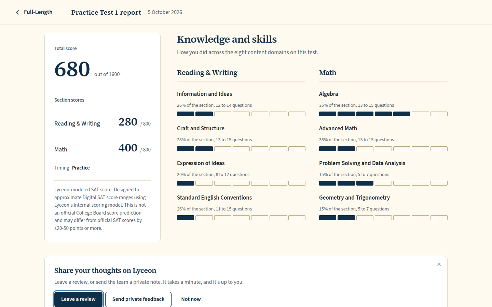
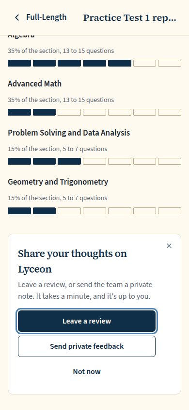
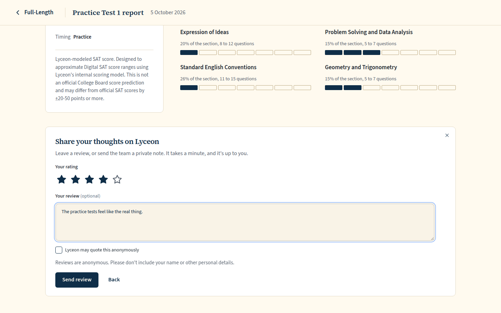
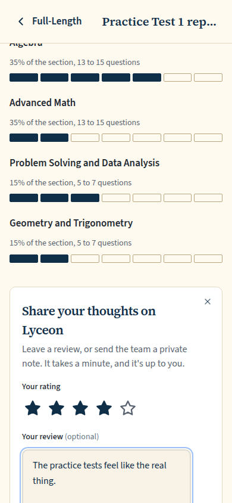
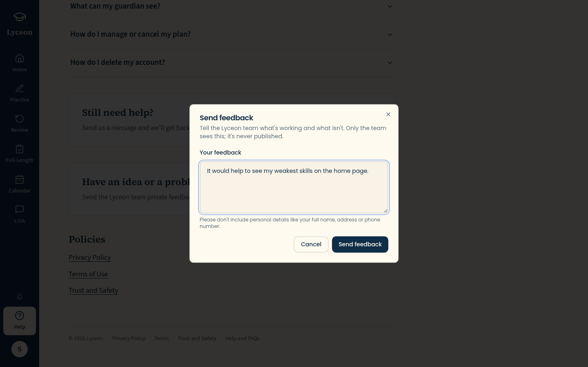
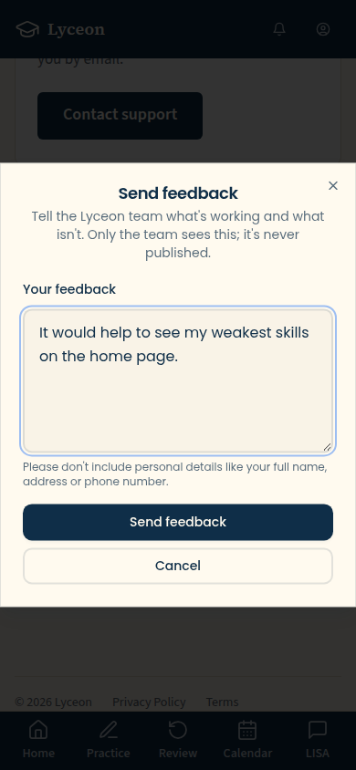
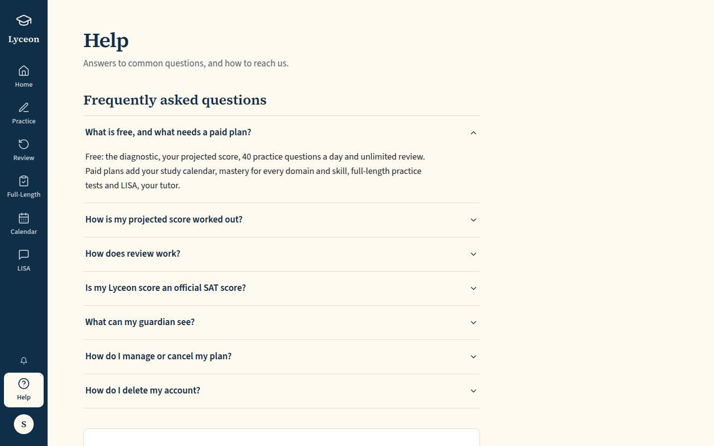
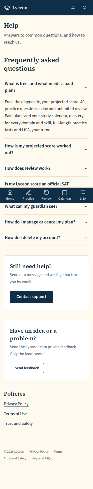
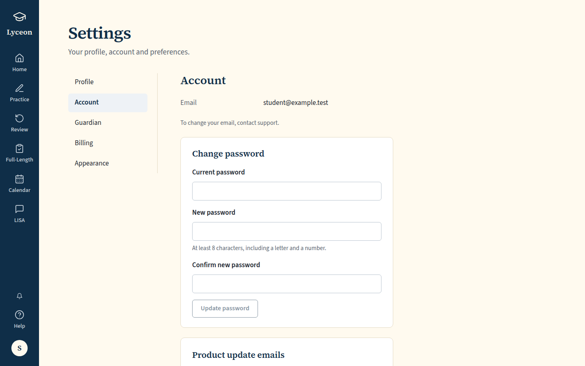
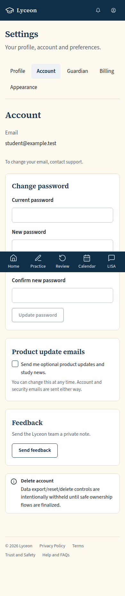

# SEO Wave 2 Q5/Q6: review prompt, review form, private feedback, Settings opt-in (light, 1440 and 390)

Generated 2026-10-05T14:42:26.542Z by `pnpm exec tsx tests/e2e/student-harness/capture.ts Q6` (see `tests/e2e/student-harness/README.md`). Built = a production build of the real client (`vite preview`, or the dev server with STUDENT_HARNESS_CLIENT=dev) against the student harness (real routers over a local Postgres built from this repo's migrations; personas seeded through the real practice routes). Prototype = the signed-off `docs/plans/student-ui/design/prototype/*.dc.html`, rendered locally.

Conditions, read before comparing:
- Viewport screenshots (not full page) unless the shot says full page: desktop 1440x900, phone 390x844, and any extra size a shot names.
- The prototypes are a fixed 1440x900 canvas with no phone layout; phone rows show the desktop prototype.
- Dark is requested through the app's own per-device setting; the theme column records what the page rendered.
- No external requests: the built app's Google Fonts (Inter, Poppins) are blocked, so legacy page bodies fall back to system faces; Source Sans 3 / Source Serif 4 are self-hosted and load for both sides.
- Prototype data is illustrative; built data is the seeded personas' real payloads.

## The review prompt under a scored full-length report: Leave a review, Send private feedback, Not now, and a close button. No Trustpilot (the student is 17).

Persona: `paid`. Route: `/tests/{paid.scoredExamSessionId}/report`.
Cookie banner already answered (the real `lyceon_consent` cookie, analytics rejected, current banner version).
No review-prompt state before each capture (the persona's `product_review_prompt_state` and `product_reviews` rows are deleted from the harness database), so the real cadence shows the prompt in every viewport and theme.
Step: focus `{"desktop":"[data-testid=\"review-prompt-leave-review\"]","mobile":"[data-testid=\"review-prompt-leave-review\"]"}` (no typing).
Prototype: none. New SEO Wave 2 surface; no signed-off prototype. Built with the student tokens (DESIGN.md §1).

| Viewport | Theme (as rendered) | Built | Prototype |
|---|---|---|---|
| desktop | light |  `/tests/5e130b9e-4db7-41ac-ac07-1bcd6a48c91b/report`, 127 KB, horizontal overflow 0px | none |
| mobile | light |  `/tests/5e130b9e-4db7-41ac-ac07-1bcd6a48c91b/report`, 51 KB, horizontal overflow 0px | none |

## Leave a review: a 1–5 rating, optional text, and the unticked 'Lyceon may quote this anonymously'

Persona: `paid`. Route: `/tests/{paid.scoredExamSessionId}/report`.
Cookie banner already answered (the real `lyceon_consent` cookie, analytics rejected, current banner version).
No review-prompt state before each capture (the persona's `product_review_prompt_state` and `product_reviews` rows are deleted from the harness database), so the real cadence shows the prompt in every viewport and theme.
Step: click `{"desktop":"[data-testid=\"review-prompt-leave-review\"]","mobile":"[data-testid=\"review-prompt-leave-review\"]"}`.
Step: click `{"desktop":"[data-testid=\"review-rating-4\"]","mobile":"[data-testid=\"review-rating-4\"]"}`.
Step: type `The practice tests feel like the real thing.` into `{"desktop":"[data-testid=\"review-text\"]","mobile":"[data-testid=\"review-text\"]"}`.
Must then show `[data-testid="review-quote-permission"]` (the capture fails otherwise).
Prototype: none. New SEO Wave 2 surface; no signed-off prototype. Built with the student tokens (DESIGN.md §1).

| Viewport | Theme (as rendered) | Built | Prototype |
|---|---|---|---|
| desktop | light |  `/tests/5e130b9e-4db7-41ac-ac07-1bcd6a48c91b/report`, 92 KB, horizontal overflow 0px | none |
| mobile | light |  `/tests/5e130b9e-4db7-41ac-ac07-1bcd6a48c91b/report`, 53 KB, horizontal overflow 0px | none |

## Private feedback, opened from Help

Persona: `paid`. Route: `/help`.
Cookie banner already answered (the real `lyceon_consent` cookie, analytics rejected, current banner version).
Step: click `{"desktop":"[data-testid=\"feedback-open-help\"]","mobile":"[data-testid=\"feedback-open-help\"]"}`.
Step: type `It would help to see my weakest skills on the home page.` into `{"desktop":"[data-testid=\"feedback-text\"]","mobile":"[data-testid=\"feedback-text\"]"}`.
Must then show `[data-testid="feedback-dialog"]` (the capture fails otherwise).
Prototype: none. New SEO Wave 2 surface; no signed-off prototype. Built with the student tokens (DESIGN.md §1).

| Viewport | Theme (as rendered) | Built | Prototype |
|---|---|---|---|
| desktop | light |  `/help`, 86 KB, horizontal overflow 0px | none |
| mobile | light |  `/help`, 44 KB, horizontal overflow 0px | none |

## Help: the private-feedback box between Contact support and the Policies

Persona: `paid`. Route: `/help`.
Cookie banner already answered (the real `lyceon_consent` cookie, analytics rejected, current banner version).
Full page: the whole document, not just the viewport.
Prototype: none. New SEO Wave 2 surface; no signed-off prototype. Built with the student tokens (DESIGN.md §1).

| Viewport | Theme (as rendered) | Built | Prototype |
|---|---|---|---|
| desktop | light |  `/help`, 87 KB, horizontal overflow 0px | none |
| mobile | light |  `/help`, 123 KB, horizontal overflow 0px | none |

## Settings → Account: Product update emails (the opt-in toggle) and Feedback, above Delete account

Persona: `paid`. Route: `/profile?tab=account`.
Cookie banner already answered (the real `lyceon_consent` cookie, analytics rejected, current banner version).
Full page: the whole document, not just the viewport.
Prototype: none. New SEO Wave 2 surface; no signed-off prototype. Built with the student tokens (DESIGN.md §1).

| Viewport | Theme (as rendered) | Built | Prototype |
|---|---|---|---|
| desktop | light |  `/profile`, 70 KB, horizontal overflow 0px | none |
| mobile | light |  `/profile`, 90 KB, horizontal overflow 0px | none |

## Run facts

- Seeded ids: `{"free":{"completedPracticeSessionId":"238f8ffe-da63-402d-b13f-0c8dbdc2289f","openPracticeSessionId":"97fdff9a-6884-4a2b-974c-75b1bcc8e952","openReviewSessionId":null,"diagnosticSessionId":null,"scoredExamSessionId":null,"inProgressExamSessionId":null,"lisaConversationId":null,"answered":13},"paid":{"completedPracticeSessionId":"d952ad1e-f815-4735-b1d3-de0f712d72f9","openPracticeSessionId":"6065279b-bffe-4ce0-8d96-b48d051cbc2a","openReviewSessionId":null,"diagnosticSessionId":"2e6bf90c-e3b2-4f7e-9297-1d89d3f9af84","scoredExamSessionId":"5e130b9e-4db7-41ac-ac07-1bcd6a48c91b","inProgressExamSessionId":"df6e1077-7796-4bda-a673-721dbf912900","lisaConversationId":null,"answered":178}}`
- Endpoints the pages asked for that the harness does not serve (answered 404): none
- External hosts blocked: none
