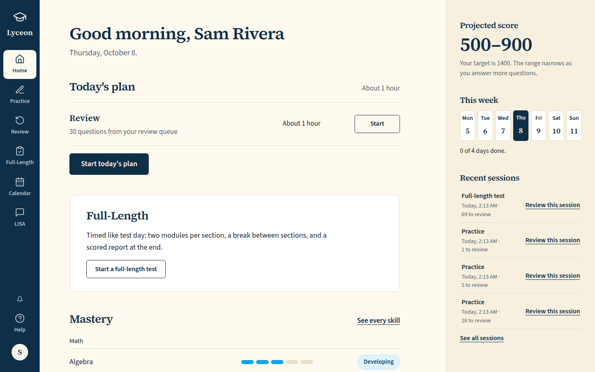
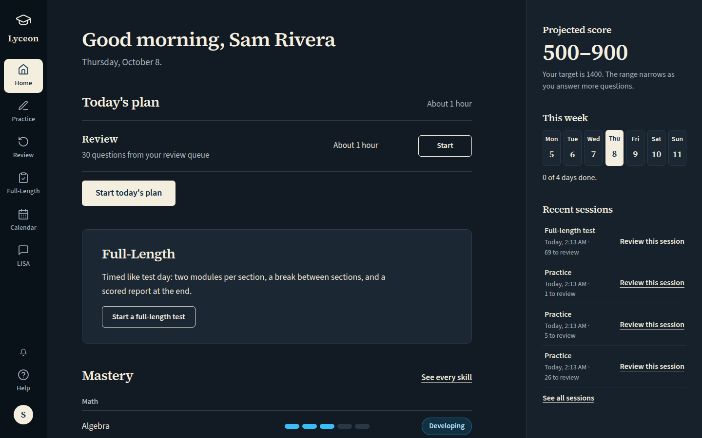
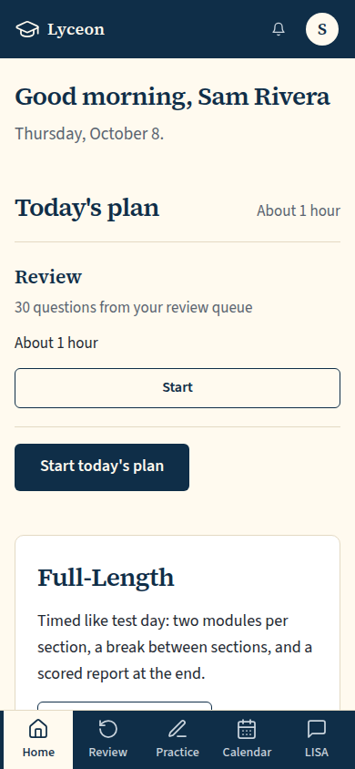
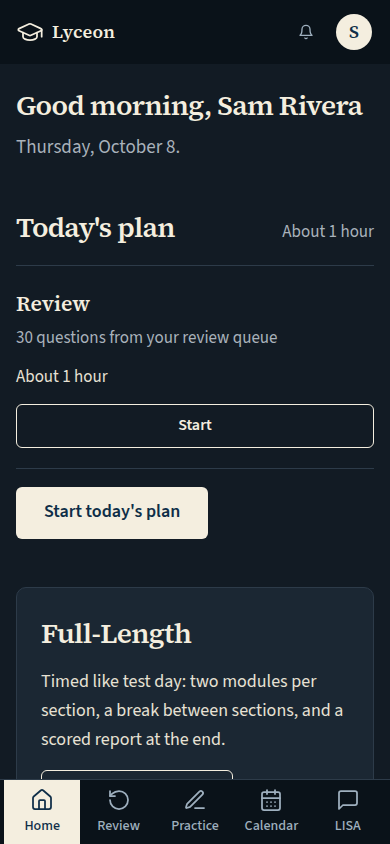
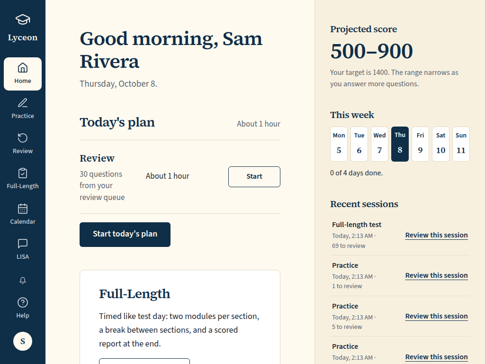
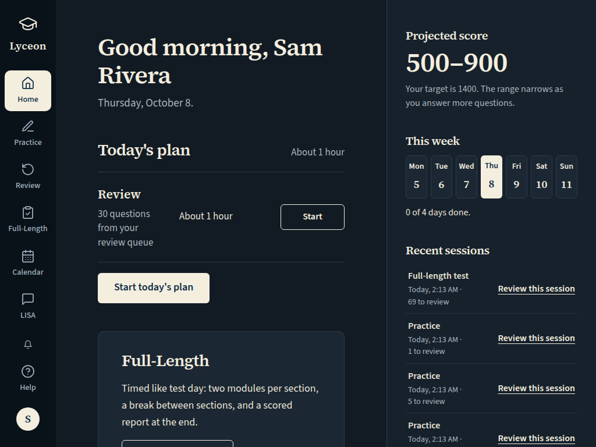
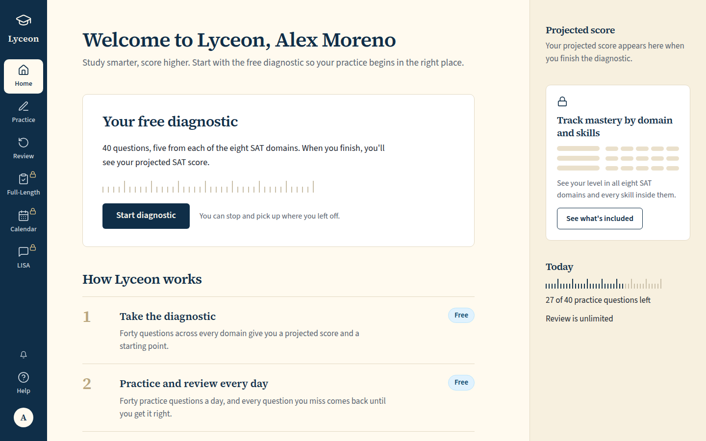
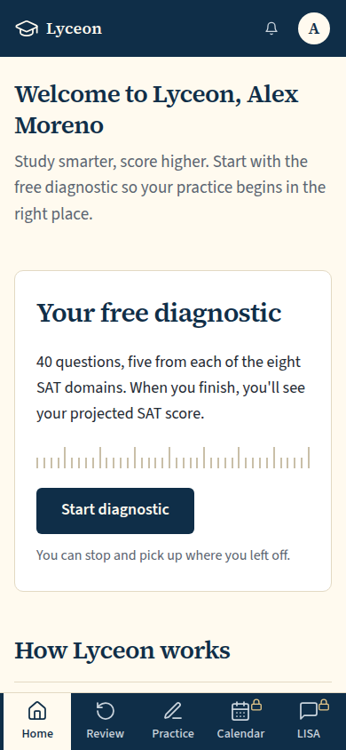
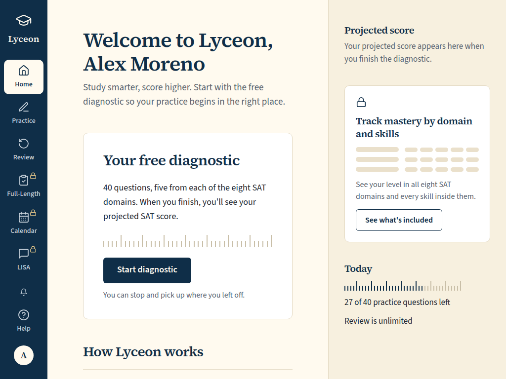
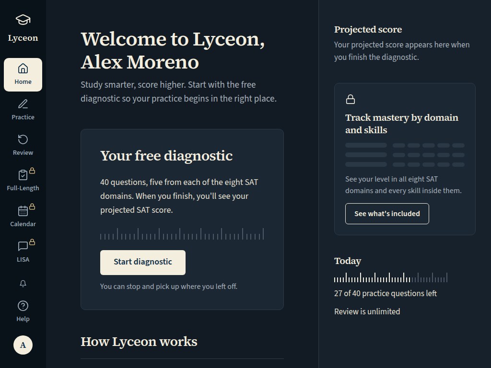

# UI-54 Full-Length home (/tests), the exam report and the timed module: free and paid, light and dark, 1440 and 390

Generated 2026-10-08T02:14:51.123Z by `pnpm exec tsx tests/e2e/student-harness/capture.ts UI-54` (see `tests/e2e/student-harness/README.md`). Built = a production build of the real client (`vite preview`, or the dev server with STUDENT_HARNESS_CLIENT=dev) against the student harness (real routers over a local Postgres built from this repo's migrations; personas seeded through the real practice routes). Prototype = the signed-off `docs/plans/student-ui/design/prototype/*.dc.html`, rendered locally.

Conditions, read before comparing:
- Viewport screenshots (not full page) unless the shot says full page: desktop 1440x900, phone 390x844, and any extra size a shot names.
- The prototypes are a fixed 1440x900 canvas with no phone layout; phone rows show the desktop prototype.
- Dark is requested through the app's own per-device setting; the theme column records what the page rendered.
- No external requests: the built app's Google Fonts (Inter, Poppins) are blocked, so legacy page bodies fall back to system faces; Source Sans 3 / Source Serif 4 are self-hosted and load for both sides.
- Prototype data is illustrative; built data is the seeded personas' real payloads.

## Full-Length, free: the in-page upgrade card; panel: the locked mastery card. No gated request

Persona: `free`. Route: `/tests`.
Must then show `[data-testid="tests-upgrade-card"]` (the capture fails otherwise).
Prototype: `FullLength.dc.html` (Full-Length, plan = free).

| Viewport | Theme (as rendered) | Built | Prototype |
|---|---|---|---|

## Full-Length, paid: Full-Length Test 1 scored (score + disclosure), Full-Length Test 2 in progress (Resume, the one primary), Full-Length Test 3 not started; Before you start; panel: score history and mastery

Persona: `paid`. Route: `/tests`.
Must then show the text `In progress: Reading & Writing, Module 2` (the capture fails otherwise).
Prototype: `FullLength.dc.html` (Full-Length, plan = paid).

| Viewport | Theme (as rendered) | Built | Prototype |
|---|---|---|---|

## QA2-F (Karl, 2026-10-08: "Full-Length cards: no layout shift on load"): Full-Length, paid, while the tests list loads (`GET /api/tests/forms` held in the browser). The loading rows hold the loaded rows' size, so nothing moves when they land

Persona: `paid`. Route: `/tests`.
Held: the browser's `GET /api/tests/forms` is left unanswered through the screenshot, then aborted (it never reaches the server).
Also shot at w1024 1024x768 (the desktop steps and selectors).
Prototype: none. A loading state the prototype does not draw.

| Viewport | Theme (as rendered) | Built | Prototype |
|---|---|---|---|

## QA2-F: Full-Length, paid, loaded over a slow network (every `/api/` answer 600ms late): the page's layout shift during load must stay under 0.01 (the run fails otherwise); the measured sum and its largest shifts are under each shot

Persona: `paid`. Route: `/tests`.
Must then show the text `In progress: Reading & Writing, Module 2` (the capture fails otherwise).
Layout shift during load (QA2-F): the sum of the page's `layout-shift` entries without recent input, observed from before the first byte, must be at most 0.01; every `/api/` answer is delayed 600ms in the browser, as over a real network, so the loading state paints first (the run fails otherwise, after this index is written); the sum and the largest shifts are under each built shot.
Also shot at w1024 1024x768 (the desktop steps and selectors).
Prototype: none. A measurement of the load; the loaded page is the tests-paid shot.

| Viewport | Theme (as rendered) | Built | Prototype |
|---|---|---|---|

## QA2-F: Home's Full-Length card (paid), loaded over a slow network (every `/api/` answer 600ms late): the page's layout shift during load must stay under 0.01 (the run fails otherwise); the measured sum and its largest shifts are under each shot

Persona: `paid`. Route: `/dashboard`.
Layout shift during load (QA2-F): the sum of the page's `layout-shift` entries without recent input, observed from before the first byte, must be at most 0.01; every `/api/` answer is delayed 600ms in the browser, as over a real network, so the loading state paints first (the run fails otherwise, after this index is written); the sum and the largest shifts are under each built shot.
Also shot at w1024 1024x768 (the desktop steps and selectors).
Prototype: none. A measurement of the load; Home itself is UI-50's.

| Viewport | Theme (as rendered) | Built | Prototype |
|---|---|---|---|
| desktop | light |  `/dashboard`, 130 KB, horizontal overflow 0px, layout shift 0.1249 (largest: 0.1081 at 2985ms by section[home-full-length] section[home-mastery] p section[home-recent]; 0.0121 at 2856ms by footer[legal-footer]; 0.0018 at 2018ms by footer[legal-footer]; 0.001 at 2870ms by section[home-recent]; 0.001 at 2943ms by a) | none |
| desktop | dark |  `/dashboard`, 131 KB, horizontal overflow 0px, layout shift 0.1249 (largest: 0.1081 at 2595ms by section[home-full-length] section[home-mastery] p section[home-recent]; 0.0121 at 2438ms by footer[legal-footer]; 0.0018 at 1782ms by footer[legal-footer]; 0.001 at 2515ms by section[home-recent]; 0.001 at 2532ms by a) | none |
| mobile | light |  `/dashboard`, 53 KB, horizontal overflow 0px, layout shift 0.6198 (largest: 0.3074 at 2690ms by footer[legal-footer] aside[app-shell-panel]; 0.2854 at 2825ms by section[home-full-length] section[home-mastery]; 0.027 at 2028ms by div footer[legal-footer] a a aside[app-shell-panel]; 0 at 380ms by span) | none |
| mobile | dark |  `/dashboard`, 54 KB, horizontal overflow 0px, layout shift 0.6198 (largest: 0.3074 at 2828ms by footer[legal-footer] aside[app-shell-panel]; 0.2854 at 3071ms by section[home-full-length] section[home-mastery]; 0.027 at 2078ms by div footer[legal-footer] a a aside[app-shell-panel]; 0 at 311ms by span) | none |
| w1024 | light |  `/dashboard`, 113 KB, horizontal overflow 0px, layout shift 0.1453 (largest: 0.1037 at 3023ms by section[home-full-length] section[home-mastery] p section[home-recent]; 0.0361 at 2963ms by footer[legal-footer]; 0.0024 at 3006ms by section[home-recent]; 0.002 at 2240ms by a[rail-help] div[rail-account] a[rail-lisa] div[rail-bell] a[rail-calendar]; 0.0011 at 3036ms by a) | none |
| w1024 | dark |  `/dashboard`, 114 KB, horizontal overflow 0px, layout shift 0.2614 (largest: 0.154 at 2889ms by section[home-full-length] section[home-mastery] p section[home-recent]; 0.0701 at 2827ms by section[home-recent]; 0.0354 at 2793ms by footer[legal-footer]; 0.002 at 2177ms by a[rail-help] div[rail-account] a[rail-lisa] div[rail-bell] a[rail-calendar]; 0 at 474ms by span) | none |

## QA2-F: Home's Full-Length card (free: the locked action), loaded over a slow network: layout shift during load under 0.01

Persona: `free`. Route: `/dashboard`.
Layout shift during load (QA2-F): the sum of the page's `layout-shift` entries without recent input, observed from before the first byte, must be at most 0.01; every `/api/` answer is delayed 600ms in the browser, as over a real network, so the loading state paints first (the run fails otherwise, after this index is written); the sum and the largest shifts are under each built shot.
Also shot at w1024 1024x768 (the desktop steps and selectors).
Prototype: none. A measurement of the load; Home itself is UI-50's.

| Viewport | Theme (as rendered) | Built | Prototype |
|---|---|---|---|
| desktop | light |  `/dashboard`, 140 KB, horizontal overflow 0px, layout shift 0.1404 (largest: 0.131 at 2700ms by section[home-how] section[home-full-length] section[locked-mastery-card]; 0.0085 at 2023ms by footer[legal-footer]; 0.0009 at 1799ms by a a a[rail-calendar] button[rail-lisa] a; 0 at 332ms by span) | none |
| desktop | dark |  `/dashboard`, 140 KB, horizontal overflow 0px, layout shift 0.1404 (largest: 0.131 at 2579ms by section[home-how] section[home-full-length] section[locked-mastery-card]; 0.0085 at 1883ms by footer[legal-footer]; 0.0009 at 1753ms by a a a[rail-calendar] button[rail-lisa] a; 0 at 363ms by span) | none |
| mobile | light |  `/dashboard`, 63 KB, horizontal overflow 0px, layout shift 0.4344 (largest: 0.3626 at 2491ms by section[home-how]; 0.0704 at 1819ms by footer[legal-footer]; 0.0014 at 1714ms by a a a a a; 0 at 234ms by span) | none |
| mobile | dark |  `/dashboard`, 64 KB, horizontal overflow 0px, layout shift 0.4344 (largest: 0.3626 at 2388ms by section[home-how]; 0.0704 at 1771ms by footer[legal-footer]; 0.0014 at 1692ms by a a a a a; 0 at 297ms by span) | none |
| w1024 | light |  `/dashboard`, 110 KB, horizontal overflow 0px, layout shift 0.2552 (largest: 0.2185 at 2561ms by section[home-how] section[locked-mastery-card] section[home-quota]; 0.0347 at 1880ms by footer[legal-footer]; 0.002 at 1754ms by div[rail-bell] a[rail-help] a[rail-calendar] button[rail-lisa] div[rail-account]; 0 at 247ms by span) | none |
| w1024 | dark |  `/dashboard`, 111 KB, horizontal overflow 0px, layout shift 0.2264 (largest: 0.1897 at 2489ms by section[home-how] section[locked-mastery-card]; 0.0347 at 1816ms by footer[legal-footer]; 0.002 at 1688ms by div[rail-bell] a[rail-help] a[rail-calendar] button[rail-lisa] div[rail-account]; 0 at 271ms by span) | none |

## Full-Length, paid, full page (on a phone the right panel stacks under the main column; the footer ends the column)

Persona: `paid`. Route: `/tests`.
Must then show the text `In progress: Reading & Writing, Module 2` (the capture fails otherwise).
Full page: the whole document, not just the viewport.
Prototype: `FullLength.dc.html` (Full-Length, plan = paid (the canvas is a fixed 1440x900)).

| Viewport | Theme (as rendered) | Built | Prototype |
|---|---|---|---|

## Full-Length on a phone (OQ-63): Resume asks the shared pre-start check, "Full-length tests are built for a laptop or tablet, like test day." with Continue anyway and Close; nothing opened yet. Desktop: no tap, no notice (control)

Persona: `paid`. Route: `/tests`.
Step: click `{"desktop":null,"mobile":"[data-testid=\"tests-resume\"]"}`.
Must then show `[data-testid="tests-home"]` (the capture fails otherwise).
Prototype: none. The prototypes have no phone layout; the notice is the owner ruling of 2026-10-05 (DESIGN.md §2 Mobile).

| Viewport | Theme (as rendered) | Built | Prototype |
|---|---|---|---|

## Exam report (Focus shell), the scored Full-Length Test 1: total out of 1600, sections out of 800, the disclosure; Knowledge and skills, seven segments per domain

Persona: `paid`. Route: `/tests/{paid.scoredExamSessionId}/report`.
Prototype: `Report.dc.html` (Report).

| Viewport | Theme (as rendered) | Built | Prototype |
|---|---|---|---|

## Exam report, full page (on a phone the score card stacks above Knowledge and skills)

Persona: `paid`. Route: `/tests/{paid.scoredExamSessionId}/report`.
Full page: the whole document, not just the viewport.
Prototype: `Report.dc.html` (Report (the canvas is a fixed 1440x900)).

| Viewport | Theme (as rendered) | Built | Prototype |
|---|---|---|---|

## The timed module (Full-Length Test 2, Reading and Writing Module 2): Bluebook layout kept, no back arrow, light only; type on the student tokens

Persona: `paid`. Route: `/tests/{paid.inProgressExamSessionId}/RW/2`.
Must fit the viewport (F-69): document no taller than the viewport, window unscrolled, `[data-testid="focus-shell-header"]` wholly in view, nothing to scroll in `main#main` (the capture fails otherwise); the measurement is under each built shot.
Also shot at tablet 820x1180 (the mobile steps and selectors).
Prototype: none. No prototype draws the timed module: DESIGN.md §2 keeps its shipped Bluebook layout (E7b), light only.

| Viewport | Theme (as rendered) | Built | Prototype |
|---|---|---|---|

## Click path (paid): Resume, the page's one primary action (at 390 through the shared pre-start check's Continue anyway), lands on the exam session route and on to the active module

Persona: `paid`. Route: `/tests`.
Step: click `{"desktop":"[data-testid=\"tests-resume\"]","mobile":"[data-testid=\"tests-resume\"]"}`.
Step: click `{"desktop":null,"mobile":"[data-testid=\"full-length-phone-continue\"]"}`.
Click path: must land on a path matching `^/tests/[0-9a-f-]{36}(/RW/[12])?$` (the capture fails otherwise); the path it landed on is under each built shot.
Prototype: none. A click path; its proof is the landing path (the prototype's Resume is not wired).

| Viewport | Theme (as rendered) | Built | Prototype |
|---|---|---|---|

## QA item 5: a test's Start pressed (at 390 after Continue anyway), the create held in flight: 'Starting…' with a spinner, disabled

Persona: `paid`. Route: `/tests`.
Step: click `{"desktop":"[data-testid=\"tests-start\"]","mobile":"[data-testid=\"tests-start\"]"}`.
Step: click `{"desktop":null,"mobile":"[data-testid=\"full-length-phone-continue\"]"}`.
Held: the browser's `POST /api/tests/sessions` is left unanswered through the screenshot, then aborted (it never reaches the server).
Must then show `[data-testid="tests-start"][aria-busy="true"]` (the capture fails otherwise).
Prototype: none. A pending state the prototype does not draw (owner QA list, 2026-10-07, item 5).

| Viewport | Theme (as rendered) | Built | Prototype |
|---|---|---|---|

## Run facts

- Seeded ids: `{"free":{"completedPracticeSessionId":"8a2450c0-2443-461a-b0b0-638ecf9b02a5","openPracticeSessionId":"f9f125a1-3bde-4854-842c-3fdb7949c836","openReviewSessionId":null,"diagnosticSessionId":null,"scoredExamSessionId":null,"inProgressExamSessionId":null,"lisaConversationId":null,"answered":13},"paid":{"completedPracticeSessionId":"5033150a-92d9-4880-8c43-4d7b2b07b6a3","openPracticeSessionId":"3a3bbb13-e6b4-4d99-9205-949266afa4bc","openReviewSessionId":null,"diagnosticSessionId":"62364f44-fcbb-4db4-a98d-c8475aea44d5","scoredExamSessionId":"8aef709a-3221-48b0-9696-9b769e11502f","inProgressExamSessionId":"0d690026-b859-4e52-bca1-51f47fb0ff0a","lisaConversationId":null,"answered":178}}`
- Endpoints the pages asked for that the harness does not serve (answered 404): none
- Desmos (QA2-B, opt-in `STUDENT_HARNESS_DESMOS=1`): not loaded (a local-only run; the calculator shows its unavailable line)
- External hosts blocked: none
