# Entry-aware sign-in / sign-up (Karl, 2026-10-10): Sign In, Sign Up, Sign Up as a guardian, a failed sign-in with Create one, Create one pressed, and the diagnostic landing; light and dark, 1440 and 390

Generated 2026-10-10T09:08:40.420Z by `pnpm exec tsx tests/e2e/student-harness/capture.ts AUTH-ENTRY` (see `tests/e2e/student-harness/README.md`). Built = a production build of the real client (`vite preview`, or the dev server with STUDENT_HARNESS_CLIENT=dev) against the student harness (real routers over a local Postgres built from this repo's migrations; personas seeded through the real practice routes). Prototype = the signed-off `docs/plans/student-ui/design/prototype/*.dc.html`, rendered locally.

Conditions, read before comparing:
- Viewport screenshots (not full page) unless the shot says full page: desktop 1440x900, phone 390x844, and any extra size a shot names.
- The prototypes are a fixed 1440x900 canvas with no phone layout; phone rows show the desktop prototype.
- Dark is requested through the app's own per-device setting; the theme column records what the page rendered.
- No external requests: the built app's Google Fonts (Inter, Poppins) are blocked, so legacy page bodies fall back to system faces; Source Sans 3 / Source Serif 4 are self-hosted and load for both sides.
- Prototype data is illustrative; built data is the seeded personas' real payloads.

## /login?mode=signin ("Sign in" anywhere): the Sign In tab, "Welcome back"

Persona: `signed-out`. Route: `/login?mode=signin`.
Full page: the whole document, not just the viewport.
Prototype: none. NOT PROTOTYPED (DESIGN.md §4): the auth page is a bare card built to the shell spec (§2 Bare card).

| Viewport | Theme (as rendered) | Built | Prototype |
|---|---|---|---|
| desktop | light | 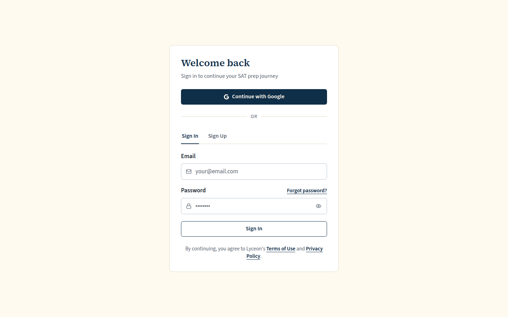 `/login`, 39 KB, horizontal overflow 0px | none |
| desktop | dark | 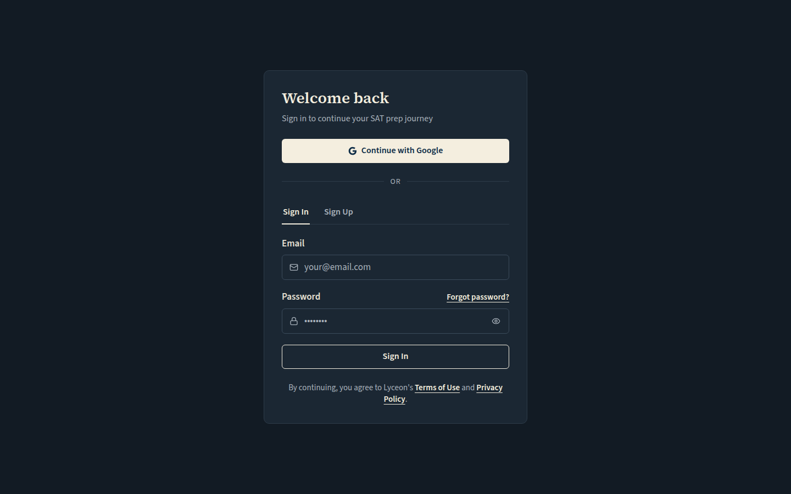 `/login`, 40 KB, horizontal overflow 0px | none |
| mobile | light | 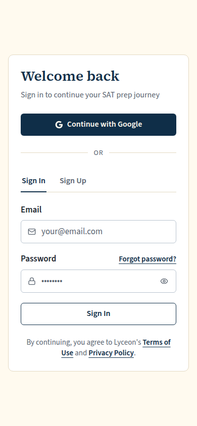 `/login`, 34 KB, horizontal overflow 0px | none |
| mobile | dark | 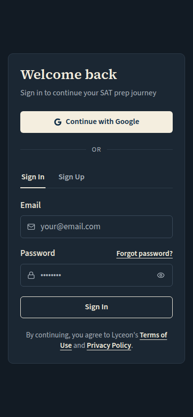 `/login`, 34 KB, horizontal overflow 0px | none |

## /login?mode=signup ("Sign up", "Get started"): the Sign Up tab, "Create your Lyceon account"

Persona: `signed-out`. Route: `/login?mode=signup`.
Full page: the whole document, not just the viewport.
Prototype: none. NOT PROTOTYPED (DESIGN.md §4): the auth page is a bare card built to the shell spec (§2 Bare card).

| Viewport | Theme (as rendered) | Built | Prototype |
|---|---|---|---|
| desktop | light | 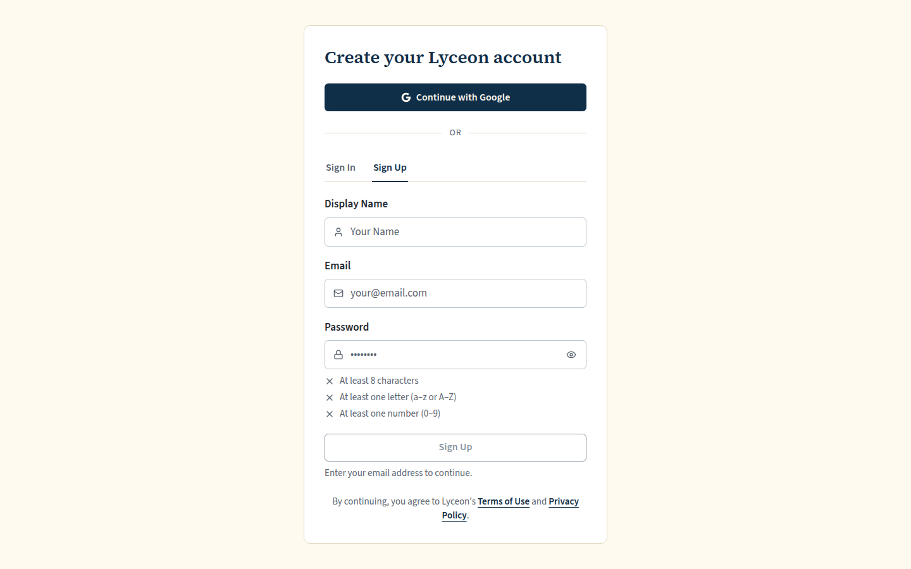 `/login`, 51 KB, horizontal overflow 0px | none |
| desktop | dark | 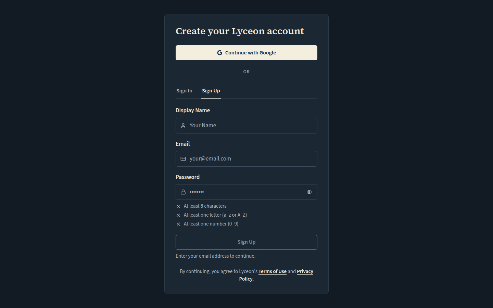 `/login`, 51 KB, horizontal overflow 0px | none |
| mobile | light |  `/login`, 44 KB, horizontal overflow 0px | none |
| mobile | dark |  `/login`, 45 KB, horizontal overflow 0px | none |

## /login?mode=signup&next=/practice/diagnostic ("Start the free diagnostic"): the Sign Up tab

Persona: `signed-out`. Route: `/login?mode=signup&next=%2Fpractice%2Fdiagnostic`.
Full page: the whole document, not just the viewport.
Prototype: none. NOT PROTOTYPED (DESIGN.md §4): the auth page is a bare card built to the shell spec (§2 Bare card).

| Viewport | Theme (as rendered) | Built | Prototype |
|---|---|---|---|
| desktop | light |  `/login`, 51 KB, horizontal overflow 0px | none |
| desktop | dark |  `/login`, 51 KB, horizontal overflow 0px | none |
| mobile | light | 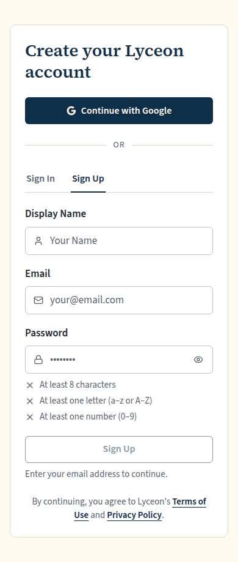 `/login`, 44 KB, horizontal overflow 0px | none |
| mobile | dark | 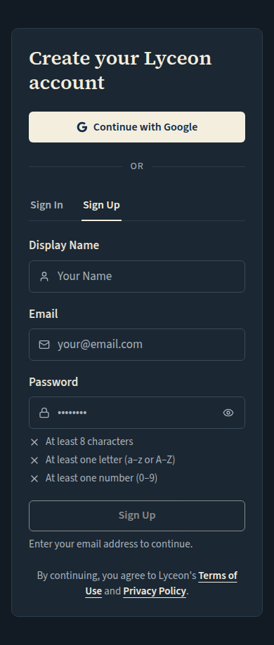 `/login`, 45 KB, horizontal overflow 0px | none |

## /login?mode=signup&role=guardian&next=/guardian ("I'm a parent or guardian"): Sign Up with the guardian line and "I'm a student"

Persona: `signed-out`. Route: `/login?mode=signup&role=guardian&next=%2Fguardian`.
Full page: the whole document, not just the viewport.
Prototype: none. NOT PROTOTYPED (DESIGN.md §4): the auth page is a bare card built to the shell spec (§2 Bare card).

| Viewport | Theme (as rendered) | Built | Prototype |
|---|---|---|---|
| desktop | light | 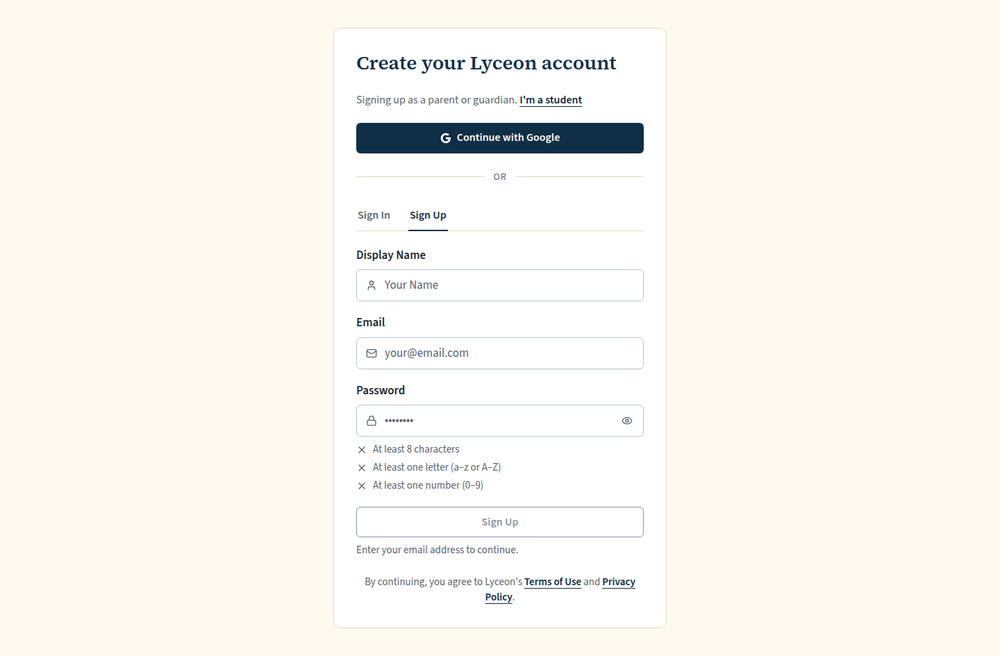 `/login`, 55 KB, horizontal overflow 0px | none |
| desktop | dark | 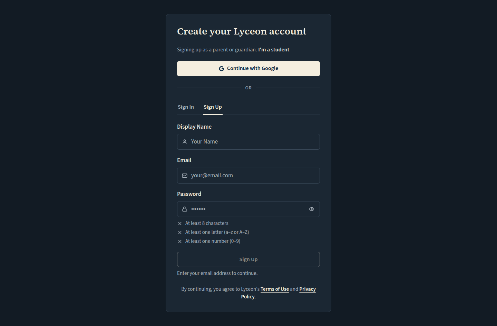 `/login`, 56 KB, horizontal overflow 0px | none |
| mobile | light | 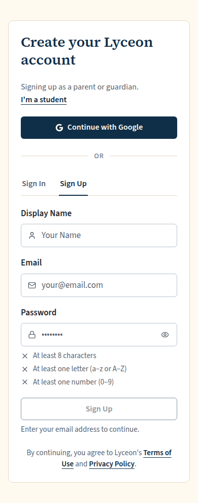 `/login`, 49 KB, horizontal overflow 0px | none |
| mobile | dark | 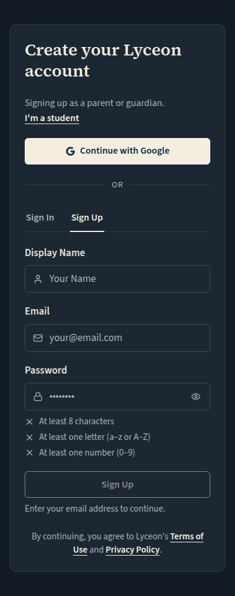 `/login`, 49 KB, horizontal overflow 0px | none |

## /login?mode=signin after a failed email sign-in: the generic error and "No account yet? Create one"

Persona: `signed-out`. Route: `/login?mode=signin`.
Step: type `typed@example.test` into `{"desktop":"[data-testid=\"input-signin-email\"]","mobile":"[data-testid=\"input-signin-email\"]"}`.
Step: type `not-the-password-1` into `{"desktop":"[data-testid=\"input-signin-password\"]","mobile":"[data-testid=\"input-signin-password\"]"}`.
Step: click `{"desktop":"[data-testid=\"button-signin\"]","mobile":"[data-testid=\"button-signin\"]"}`.
Stubbed in the browser: `POST /api/auth/signin` is answered by the browser itself and never reaches the server. The harness mounts no /api/auth routes (they call Supabase); this is the real sign-in route's 401 and body for a wrong email or password.
Must then show `[data-testid="signin-create-account"]` (the capture fails otherwise).
Full page: the whole document, not just the viewport.
Prototype: none. NOT PROTOTYPED (DESIGN.md §4): the auth page is a bare card built to the shell spec (§2 Bare card).

| Viewport | Theme (as rendered) | Built | Prototype |
|---|---|---|---|
| desktop | light | 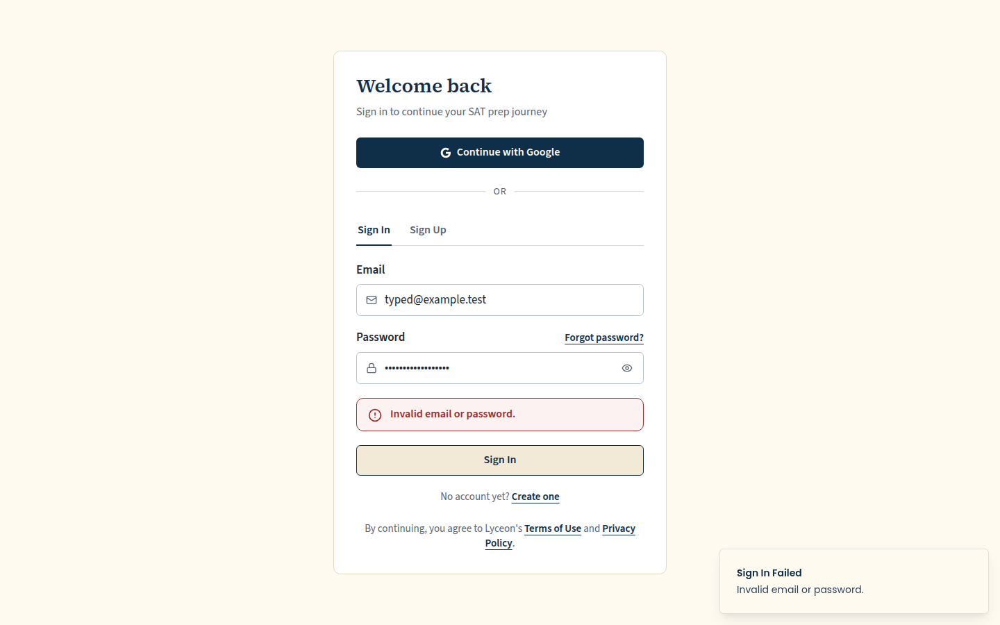 `/login`, 53 KB, horizontal overflow 0px | none |
| desktop | dark | 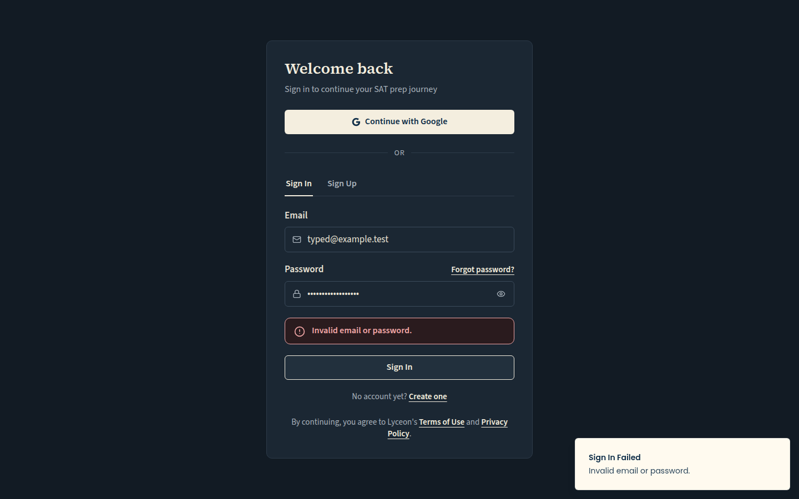 `/login`, 53 KB, horizontal overflow 0px | none |
| mobile | light | 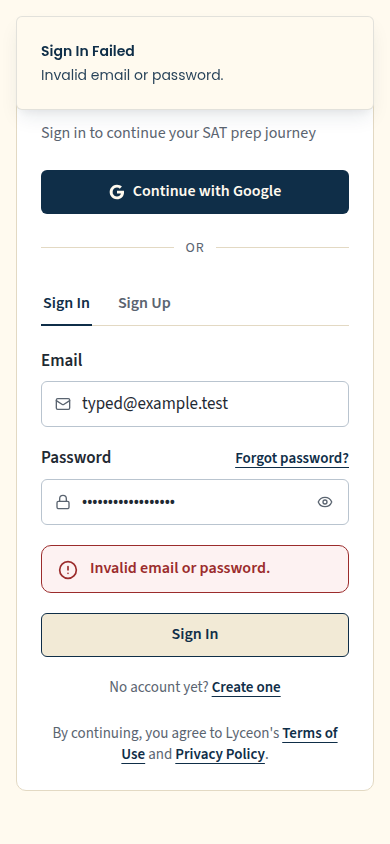 `/login`, 42 KB, horizontal overflow 0px | none |
| mobile | dark | 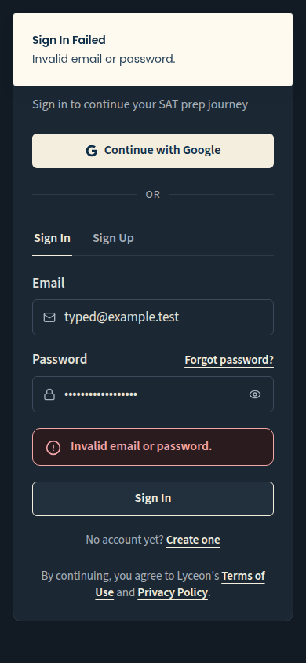 `/login`, 42 KB, horizontal overflow 0px | none |

## "Create one" pressed: the Sign Up tab with the typed email kept

Persona: `signed-out`. Route: `/login?mode=signin`.
Step: type `typed@example.test` into `{"desktop":"[data-testid=\"input-signin-email\"]","mobile":"[data-testid=\"input-signin-email\"]"}`.
Step: type `not-the-password-1` into `{"desktop":"[data-testid=\"input-signin-password\"]","mobile":"[data-testid=\"input-signin-password\"]"}`.
Step: click `{"desktop":"[data-testid=\"button-signin\"]","mobile":"[data-testid=\"button-signin\"]"}`.
Step: click `{"desktop":"[data-testid=\"button-create-account\"]","mobile":"[data-testid=\"button-create-account\"]"}`.
Stubbed in the browser: `POST /api/auth/signin` is answered by the browser itself and never reaches the server. The harness mounts no /api/auth routes (they call Supabase); this is the real sign-in route's 401 and body for a wrong email or password.
Must then show `[data-testid="button-signup"]` (the capture fails otherwise).
Full page: the whole document, not just the viewport.
Prototype: none. NOT PROTOTYPED (DESIGN.md §4): the auth page is a bare card built to the shell spec (§2 Bare card).

| Viewport | Theme (as rendered) | Built | Prototype |
|---|---|---|---|
| desktop | light | 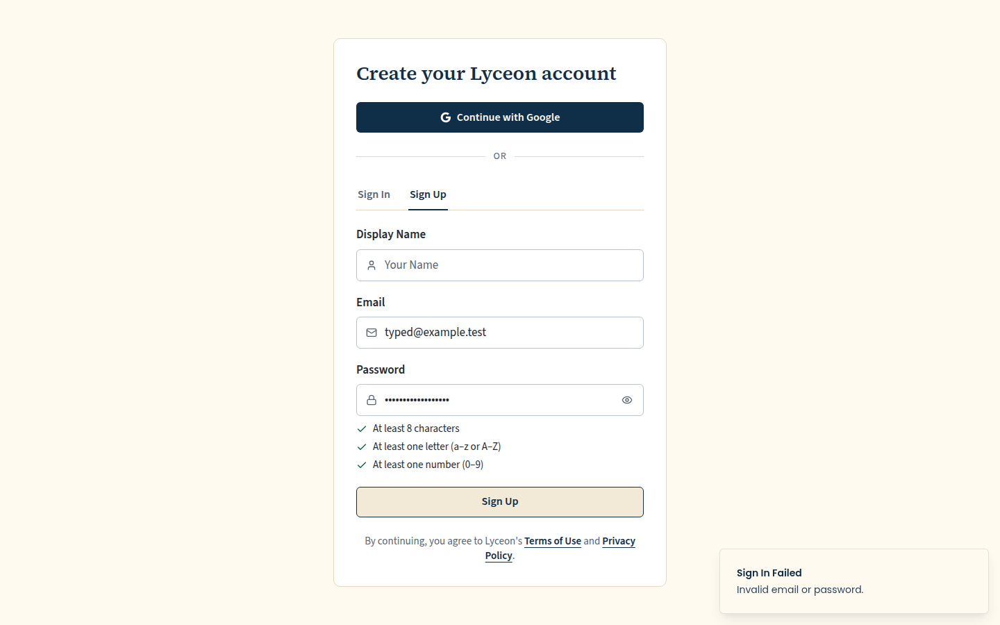 `/login`, 53 KB, horizontal overflow 0px | none |
| desktop | dark | 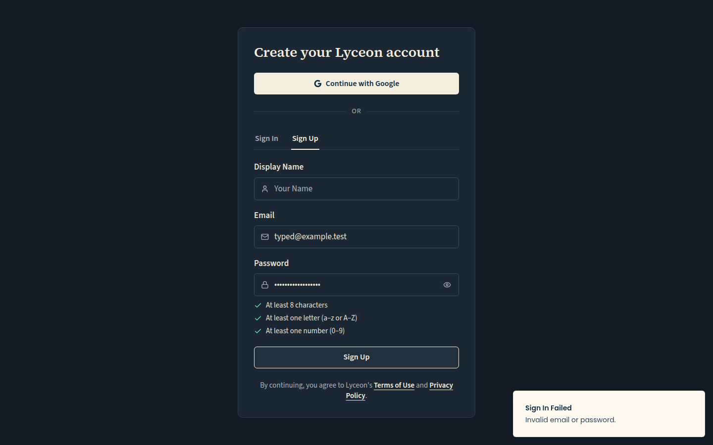 `/login`, 54 KB, horizontal overflow 0px | none |
| mobile | light | 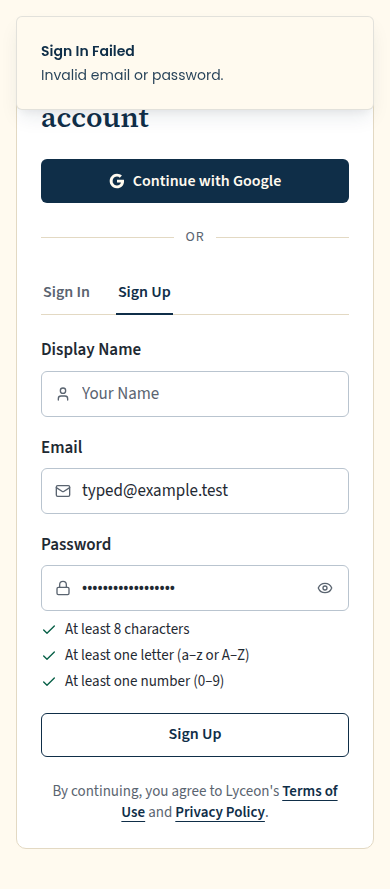 `/login`, 41 KB, horizontal overflow 0px | none |
| mobile | dark | 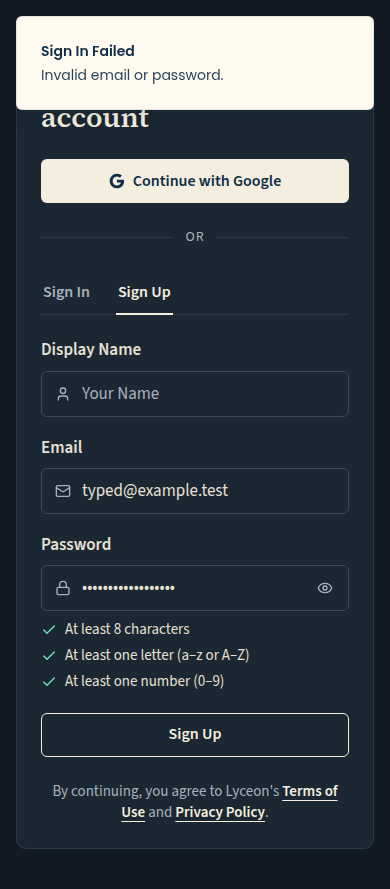 `/login`, 43 KB, horizontal overflow 0px | none |

## /practice/diagnostic (where "Start the free diagnostic" returns after sign-up and onboarding), a free student with no diagnostic: lands in the diagnostic runner

Persona: `free`. Route: `/practice/diagnostic`.
Click path: must land on a path matching `^/practice/session/[0-9a-f-]{36}$` (the capture fails otherwise); the path it landed on is under each built shot.
Prototype: none. A landing: the screenshot is where the page handed over (the diagnostic runner), proven by its pathname.

| Viewport | Theme (as rendered) | Built | Prototype |
|---|---|---|---|
| desktop | light | 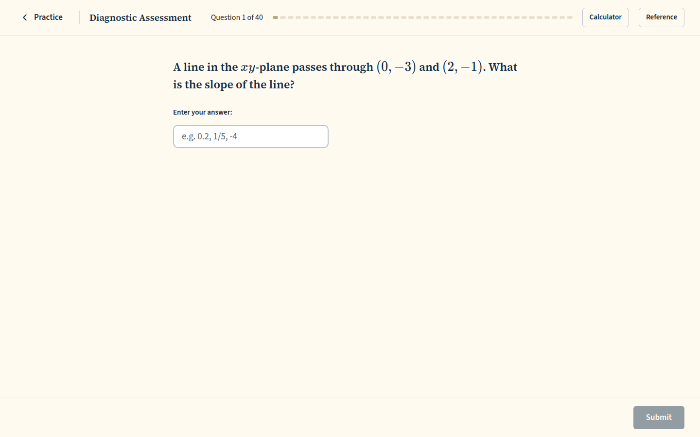 `/practice/session/5abcd546-5fd6-4187-81c7-86098e3fc2ba`, 41 KB, horizontal overflow 0px | none |
| desktop | dark | 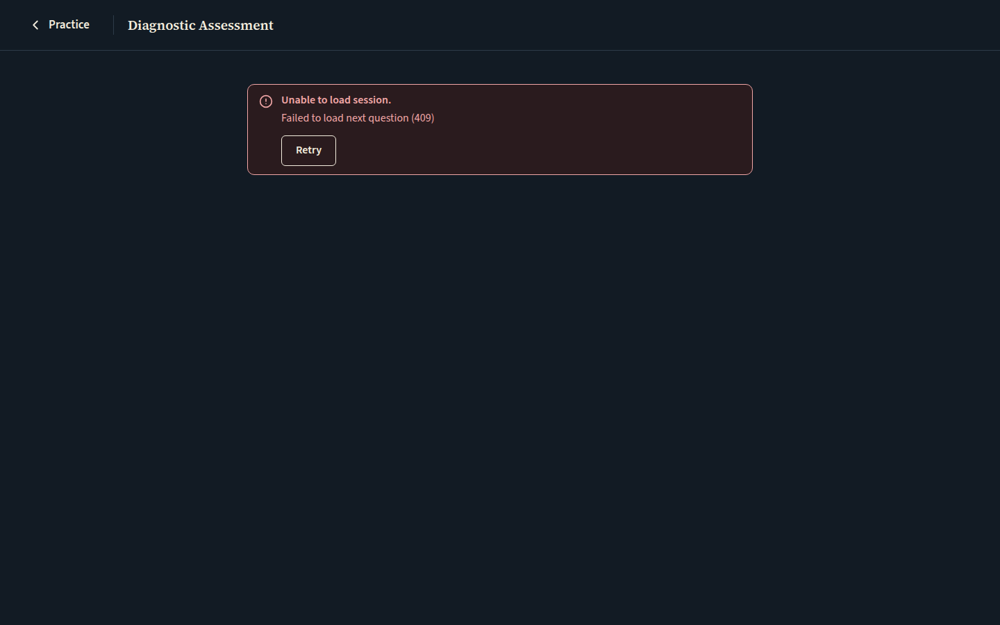 `/practice/session/5abcd546-5fd6-4187-81c7-86098e3fc2ba`, 21 KB, horizontal overflow 0px | none |
| mobile | light | 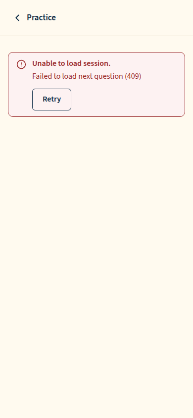 `/practice/session/5abcd546-5fd6-4187-81c7-86098e3fc2ba`, 13 KB, horizontal overflow 0px | none |
| mobile | dark | 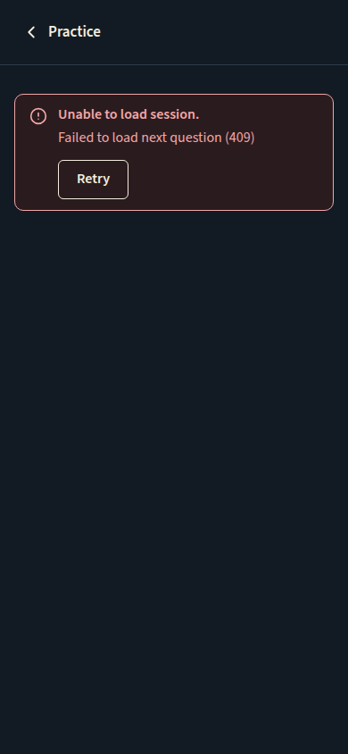 `/practice/session/5abcd546-5fd6-4187-81c7-86098e3fc2ba`, 13 KB, horizontal overflow 0px | none |

## Run facts

- Seeded ids: `{"free":{"completedPracticeSessionId":"60ec2b41-dde1-4780-867c-99e21c010f59","openPracticeSessionId":"4bc53bb8-35d6-412c-b027-12377119fbcf","openReviewSessionId":null,"diagnosticSessionId":null,"scoredExamSessionId":null,"inProgressExamSessionId":null,"lisaConversationId":null,"answered":13},"paid":{"completedPracticeSessionId":"1f7742f5-06f5-4e63-b3d3-cdcb3e514f9a","openPracticeSessionId":"88f17d1b-ea14-41fa-9cc8-f7b17f359031","openReviewSessionId":null,"diagnosticSessionId":"84b40cec-4091-4ce8-baa1-8b26733b8b32","scoredExamSessionId":null,"inProgressExamSessionId":null,"lisaConversationId":null,"answered":53}}`
- Endpoints the pages asked for that the harness does not serve (answered 404): none
- Desmos (QA2-B, opt-in `STUDENT_HARNESS_DESMOS=1`): not loaded (a local-only run; the calculator shows its unavailable line)
- External hosts blocked: none
