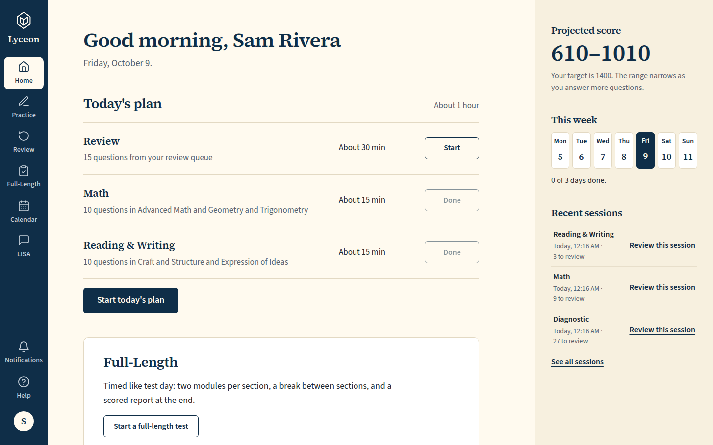
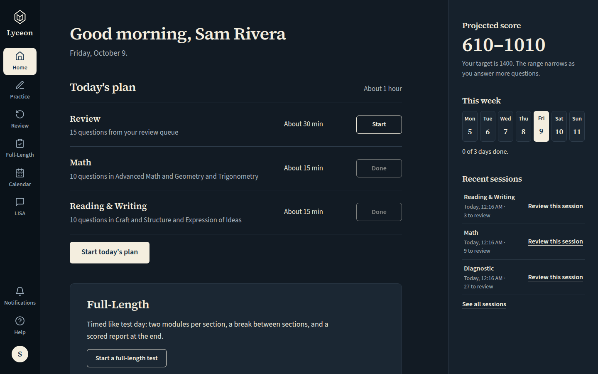
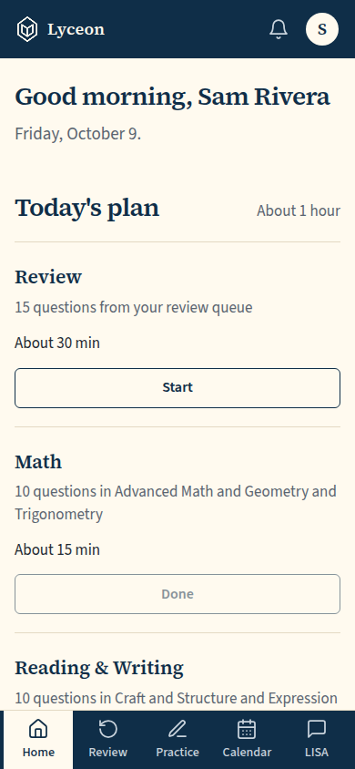
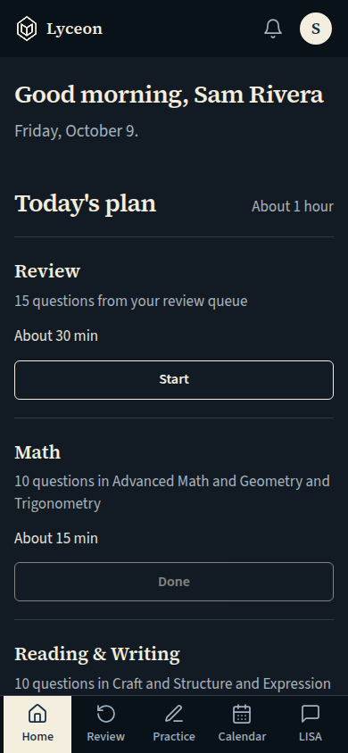
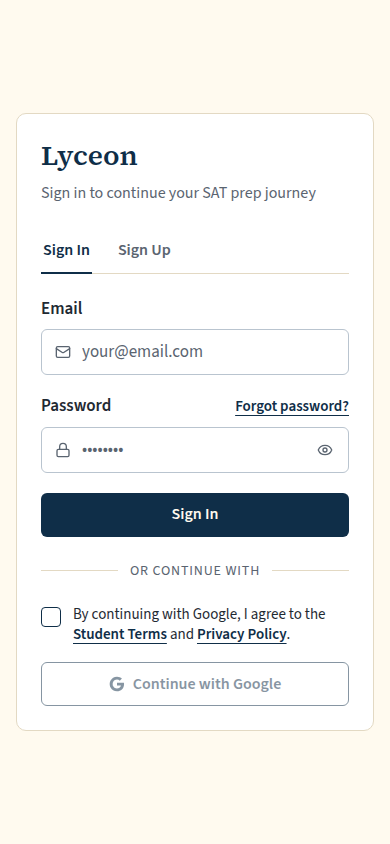
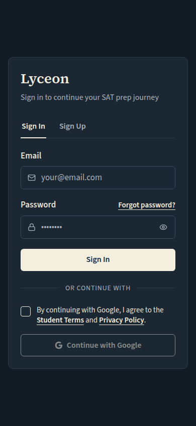
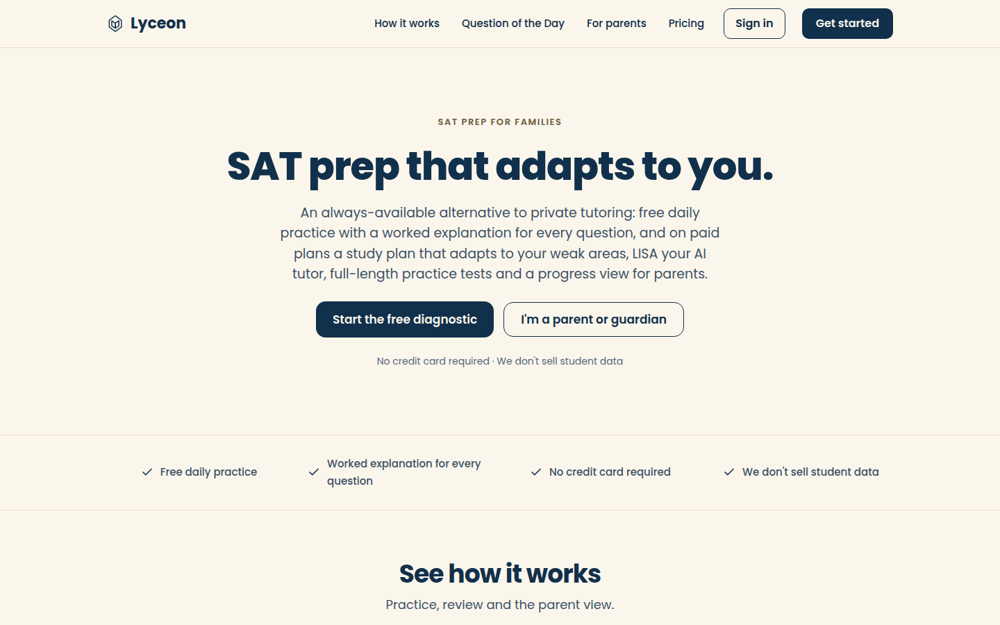
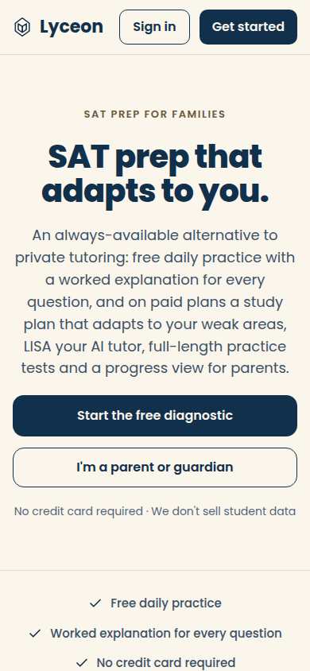

# Brand mark: the Lyceon logo on the rail, the mobile top bar, a bare page and the public nav

Generated 2026-10-09T00:17:07.549Z by `pnpm exec tsx tests/e2e/student-harness/capture.ts BRAND` (see `tests/e2e/student-harness/README.md`). Built = a production build of the real client (`vite preview`, or the dev server with STUDENT_HARNESS_CLIENT=dev) against the student harness (real routers over a local Postgres built from this repo's migrations; personas seeded through the real practice routes). Prototype = the signed-off `docs/plans/student-ui/design/prototype/*.dc.html`, rendered locally.

Conditions, read before comparing:
- Viewport screenshots (not full page) unless the shot says full page: desktop 1440x900, phone 390x844, and any extra size a shot names.
- The prototypes are a fixed 1440x900 canvas with no phone layout; phone rows show the desktop prototype.
- Dark is requested through the app's own per-device setting; the theme column records what the page rendered.
- No external requests: the built app's Google Fonts (Inter, Poppins) are blocked, so legacy page bodies fall back to system faces; Source Sans 3 / Source Serif 4 are self-hosted and load for both sides.
- Prototype data is illustrative; built data is the seeded personas' real payloads.

## App shell, /dashboard: the rail (desktop) and the top bar (phone)

Persona: `paid`. Route: `/dashboard`.
Prototype: none. Owner request; no prototype change.

| Viewport | Theme (as rendered) | Built | Prototype |
|---|---|---|---|
| desktop | light |  `/dashboard`, 140 KB, horizontal overflow 0px | none |
| desktop | dark |  `/dashboard`, 140 KB, horizontal overflow 0px | none |
| mobile | light |  `/dashboard`, 56 KB, horizontal overflow 0px | none |
| mobile | dark |  `/dashboard`, 56 KB, horizontal overflow 0px | none |

## Bare card, /login, signed out

Persona: `signed-out`. Route: `/login`.
Prototype: none. Owner request; no prototype change.

| Viewport | Theme (as rendered) | Built | Prototype |
|---|---|---|---|
| desktop | light |  `/login`, 38 KB, horizontal overflow 0px | none |
| desktop | dark |  `/login`, 39 KB, horizontal overflow 0px | none |
| mobile | light |  `/login`, 33 KB, horizontal overflow 0px | none |
| mobile | dark |  `/login`, 34 KB, horizontal overflow 0px | none |

## Public home, signed out: the nav and the footer

Persona: `signed-out`. Route: `/`.
Prototype: none. Owner request; no prototype change.

| Viewport | Theme (as rendered) | Built | Prototype |
|---|---|---|---|
| desktop | light |  `/`, 98 KB, horizontal overflow 0px | none |
| desktop | dark |  `/`, 98 KB, horizontal overflow 0px | none |
| mobile | light |  `/`, 70 KB, horizontal overflow 0px | none |
| mobile | dark |  `/`, 70 KB, horizontal overflow 0px | none |

## Run facts

- Seeded ids: `{"free":{"completedPracticeSessionId":"82ac2631-3dfb-4feb-9d39-c15f8ab1562a","openPracticeSessionId":"b3b4cce7-d80c-4cdc-be94-37f54614f0a3","openReviewSessionId":null,"diagnosticSessionId":null,"scoredExamSessionId":null,"inProgressExamSessionId":null,"lisaConversationId":null,"answered":13},"paid":{"completedPracticeSessionId":"8e6f2fab-ec08-45c5-a611-41dd68c0eb68","openPracticeSessionId":"e138d100-e8d4-4809-953b-c31706ab8fa6","openReviewSessionId":null,"diagnosticSessionId":"1ac47874-3a14-4b8c-9ffa-df1e38853a40","scoredExamSessionId":null,"inProgressExamSessionId":null,"lisaConversationId":null,"answered":53}}`
- Endpoints the pages asked for that the harness does not serve (answered 404): `GET /public/pricing`
- Desmos (QA2-B, opt-in `STUDENT_HARNESS_DESMOS=1`): not loaded (a local-only run; the calculator shows its unavailable line)
- External hosts blocked: none
