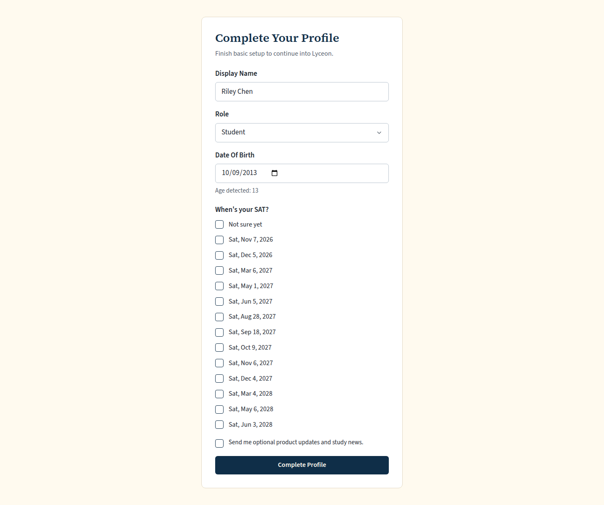
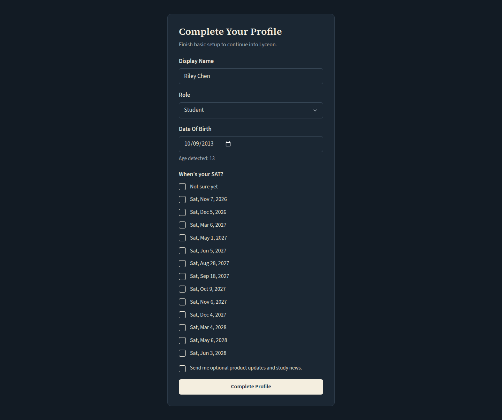
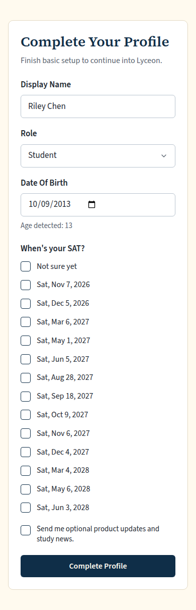
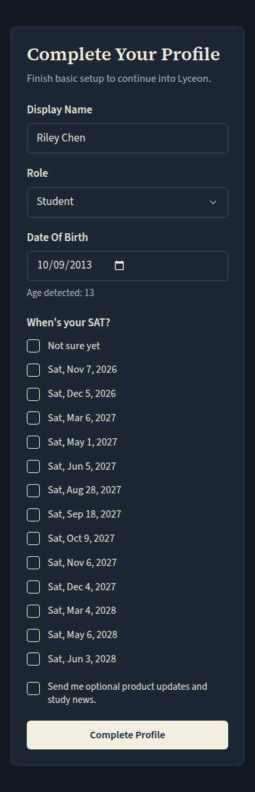

# Onboarding: 'When's your SAT?' (light and dark, 1440 and 390)

Generated 2026-10-09T01:56:05.581Z by `pnpm exec tsx tests/e2e/student-harness/capture.ts HOME-QOTD-ONBOARDING` (see `tests/e2e/student-harness/README.md`). Built = a production build of the real client (`vite preview`, or the dev server with STUDENT_HARNESS_CLIENT=dev) against the student harness (real routers over a local Postgres built from this repo's migrations; personas seeded through the real practice routes). Prototype = the signed-off `docs/plans/student-ui/design/prototype/*.dc.html`, rendered locally.

Conditions, read before comparing:
- Viewport screenshots (not full page) unless the shot says full page: desktop 1440x900, phone 390x844, and any extra size a shot names.
- The prototypes are a fixed 1440x900 canvas with no phone layout; phone rows show the desktop prototype.
- Dark is requested through the app's own per-device setting; the theme column records what the page rendered.
- No external requests: the built app's Google Fonts (Inter, Poppins) are blocked, so legacy page bodies fall back to system faces; Source Sans 3 / Source Serif 4 are self-hosted and load for both sides.
- Prototype data is illustrative; built data is the seeded personas' real payloads.

## Onboarding: Name, date of birth, then 'When's your SAT?' ('Not sure yet' first, future official dates, multi-select)

Persona: `onboarding`. Route: `/profile/complete`.
Full page: the whole document, not just the viewport.
Prototype: none. NOT PROTOTYPED: the Home QOTD card, streak chip, email prompt and SAT-date card are new in the owner brief of 2026-10-08/09 and built to DESIGN.md's tokens; these screenshots go to Karl before merge.

| Viewport | Theme (as rendered) | Built | Prototype |
|---|---|---|---|
| desktop | light |  `/profile/complete`, 71 KB, horizontal overflow 0px | none |
| desktop | dark |  `/profile/complete`, 74 KB, horizontal overflow 0px | none |
| mobile | light |  `/profile/complete`, 63 KB, horizontal overflow 0px | none |
| mobile | dark |  `/profile/complete`, 67 KB, horizontal overflow 0px | none |

## Run facts

- Seeded ids: `{"free":{"completedPracticeSessionId":"f71b3d49-4871-467f-a9ae-e51ff8789b15","openPracticeSessionId":"65714ef3-693b-4c1c-8b68-779a28112575","openReviewSessionId":null,"diagnosticSessionId":null,"scoredExamSessionId":null,"inProgressExamSessionId":null,"lisaConversationId":null,"answered":13},"paid":{"completedPracticeSessionId":"0287059d-db2e-4d67-b85a-25704bc0967e","openPracticeSessionId":"8613b751-c560-45b6-90e7-1749addbcdc9","openReviewSessionId":null,"diagnosticSessionId":"0d2d3d72-30df-4665-b4c4-c898fb2c3e24","scoredExamSessionId":null,"inProgressExamSessionId":null,"lisaConversationId":null,"answered":53}}`
- Endpoints the pages asked for that the harness does not serve (answered 404): none
- Desmos (QA2-B, opt-in `STUDENT_HARNESS_DESMOS=1`): not loaded (a local-only run; the calculator shows its unavailable line)
- External hosts blocked: none
