# Home QOTD, streak, email prompt, SAT dates (light and dark, 1440 and 390)

Generated 2026-10-09T01:55:39.443Z by `pnpm exec tsx tests/e2e/student-harness/capture.ts HOME-QOTD` (see `tests/e2e/student-harness/README.md`). Built = a production build of the real client (`vite preview`, or the dev server with STUDENT_HARNESS_CLIENT=dev) against the student harness (real routers over a local Postgres built from this repo's migrations; personas seeded through the real practice routes). Prototype = the signed-off `docs/plans/student-ui/design/prototype/*.dc.html`, rendered locally.

Conditions, read before comparing:
- Viewport screenshots (not full page) unless the shot says full page: desktop 1440x900, phone 390x844, and any extra size a shot names.
- The prototypes are a fixed 1440x900 canvas with no phone layout; phone rows show the desktop prototype.
- Dark is requested through the app's own per-device setting; the theme column records what the page rendered.
- No external requests: the built app's Google Fonts (Inter, Poppins) are blocked, so legacy page bodies fall back to system faces; Source Sans 3 / Source Serif 4 are self-hosted and load for both sides.
- Prototype data is illustrative; built data is the seeded personas' real payloads.

## Home, free: greeting, streak chip 'Start your streak', today's question unanswered, then the diagnostic

Persona: `free`. Route: `/dashboard`.
Today's question unanswered before each capture (scheduled if missing; the persona's answer, qotd session and email-prompt state deleted).
Full page: the whole document, not just the viewport.
Prototype: none. NOT PROTOTYPED: the Home QOTD card, streak chip, email prompt and SAT-date card are new in the owner brief of 2026-10-08/09 and built to DESIGN.md's tokens; these screenshots go to Karl before merge.

| Viewport | Theme (as rendered) | Built | Prototype |
|---|---|---|---|
| desktop | light | 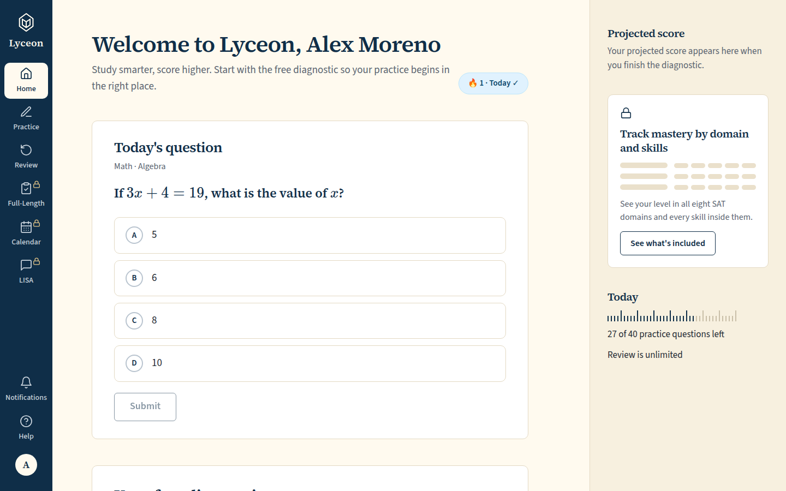 `/dashboard`, 111 KB, horizontal overflow 0px | none |
| desktop | dark | 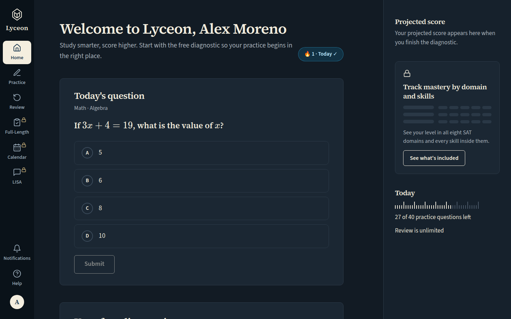 `/dashboard`, 112 KB, horizontal overflow 0px | none |
| mobile | light | 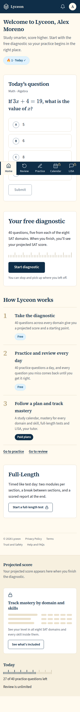 `/dashboard`, 205 KB, horizontal overflow 0px | none |
| mobile | dark | 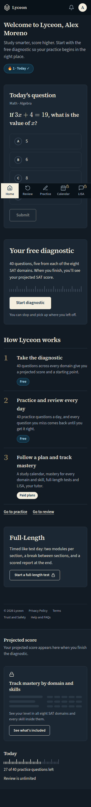 `/dashboard`, 207 KB, horizontal overflow 0px | none |

## Answered (first ask): result and explanation, chip '🔥 1 · Today ✓', the email prompt with Yes focused, no 'Don't ask again'

Persona: `free`. Route: `/dashboard`.
Today's question unanswered before each capture (scheduled if missing; the persona's answer, qotd session and email-prompt state deleted).
Step: click `{"desktop":"[data-testid=\"home-qotd\"] [data-testid=\"runner-choice\"]","mobile":"[data-testid=\"home-qotd\"] [data-testid=\"runner-choice\"]"}`.
Step: click `{"desktop":"[data-testid=\"home-qotd-submit\"]","mobile":"[data-testid=\"home-qotd-submit\"]"}`.
Must then show the text `Keep your streak alive 🔥` (the capture fails otherwise).
Prototype: none. NOT PROTOTYPED: the Home QOTD card, streak chip, email prompt and SAT-date card are new in the owner brief of 2026-10-08/09 and built to DESIGN.md's tokens; these screenshots go to Karl before merge.

| Viewport | Theme (as rendered) | Built | Prototype |
|---|---|---|---|
| desktop | light | 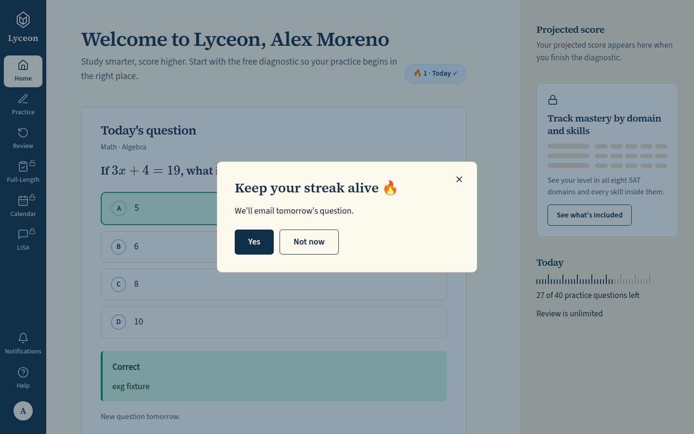 `/dashboard`, 121 KB, horizontal overflow 0px | none |
| desktop | dark | 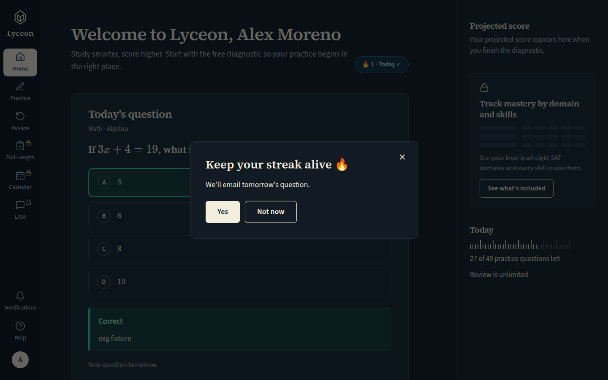 `/dashboard`, 118 KB, horizontal overflow 0px | none |
| mobile | light | 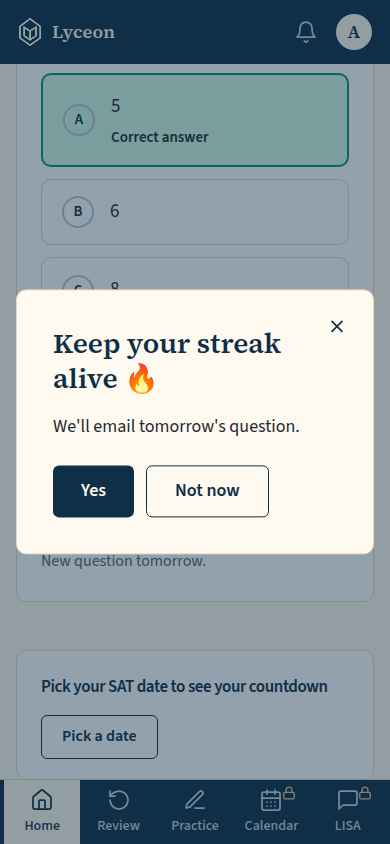 `/dashboard`, 43 KB, horizontal overflow 0px | none |
| mobile | dark | 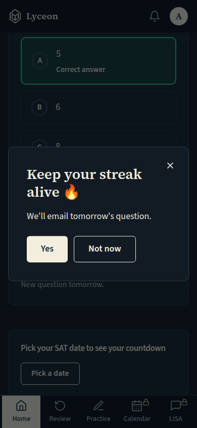 `/dashboard`, 42 KB, horizontal overflow 0px | none |

## Later visit the same day: collapsed '✓ Today's question done · 🔥 1-day streak · New question tomorrow', then the SAT-date card

Persona: `free`. Route: `/dashboard`.
Full page: the whole document, not just the viewport.
Prototype: none. NOT PROTOTYPED: the Home QOTD card, streak chip, email prompt and SAT-date card are new in the owner brief of 2026-10-08/09 and built to DESIGN.md's tokens; these screenshots go to Karl before merge.

| Viewport | Theme (as rendered) | Built | Prototype |
|---|---|---|---|
| desktop | light | 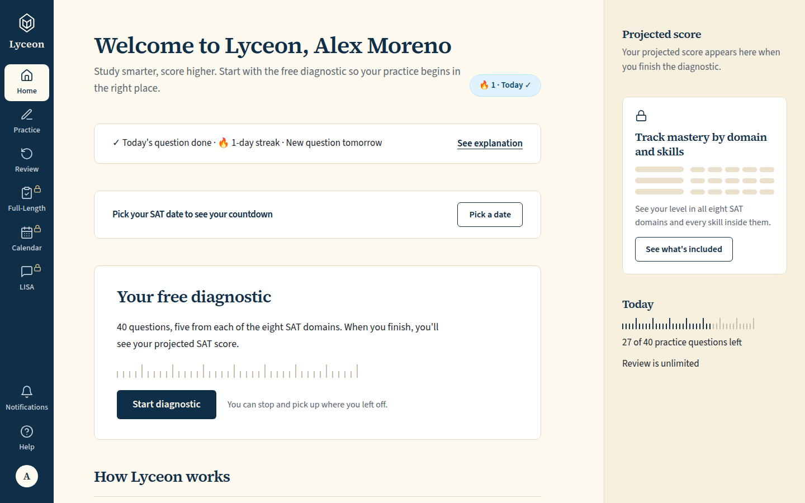 `/dashboard`, 132 KB, horizontal overflow 0px | none |
| desktop | dark | 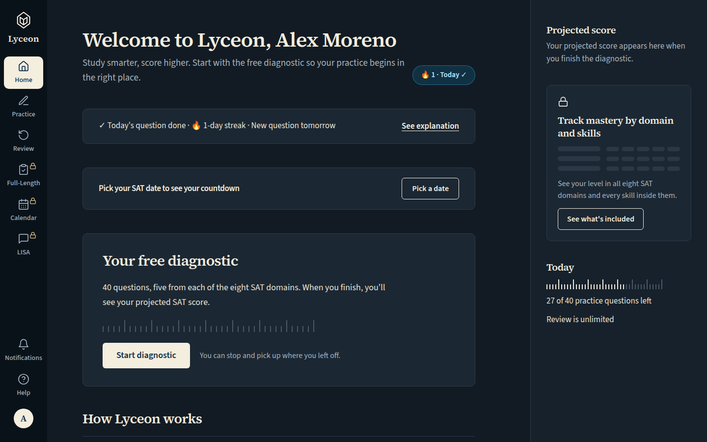 `/dashboard`, 134 KB, horizontal overflow 0px | none |
| mobile | light | 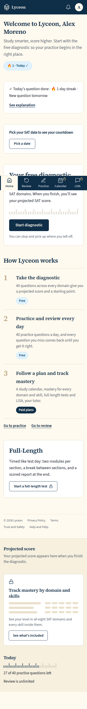 `/dashboard`, 191 KB, horizontal overflow 0px | none |
| mobile | dark | 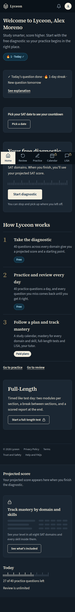 `/dashboard`, 193 KB, horizontal overflow 0px | none |

## The 3rd ask: the prompt adds the text link 'Don't ask again'

Persona: `free`. Route: `/dashboard`.
Today's question unanswered before each capture (scheduled if missing; the persona's answer, qotd session and email-prompt state deleted; 2 earlier asks seeded).
Step: click `{"desktop":"[data-testid=\"home-qotd\"] [data-testid=\"runner-choice\"]","mobile":"[data-testid=\"home-qotd\"] [data-testid=\"runner-choice\"]"}`.
Step: click `{"desktop":"[data-testid=\"home-qotd-submit\"]","mobile":"[data-testid=\"home-qotd-submit\"]"}`.
Must then show the text `Don't ask again` (the capture fails otherwise).
Prototype: none. NOT PROTOTYPED: the Home QOTD card, streak chip, email prompt and SAT-date card are new in the owner brief of 2026-10-08/09 and built to DESIGN.md's tokens; these screenshots go to Karl before merge.

| Viewport | Theme (as rendered) | Built | Prototype |
|---|---|---|---|
| desktop | light | 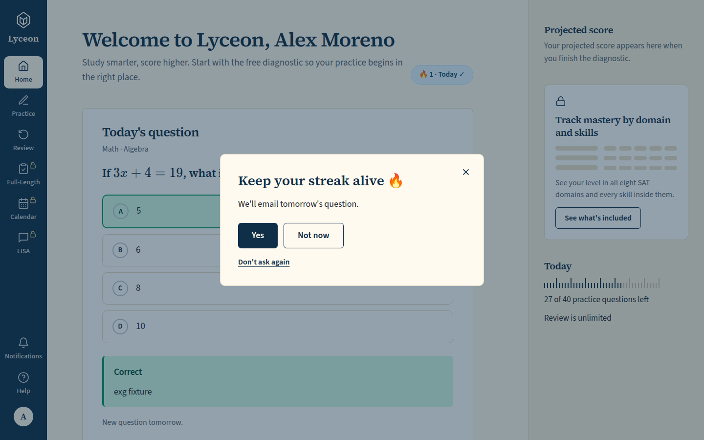 `/dashboard`, 123 KB, horizontal overflow 0px | none |
| desktop | dark | 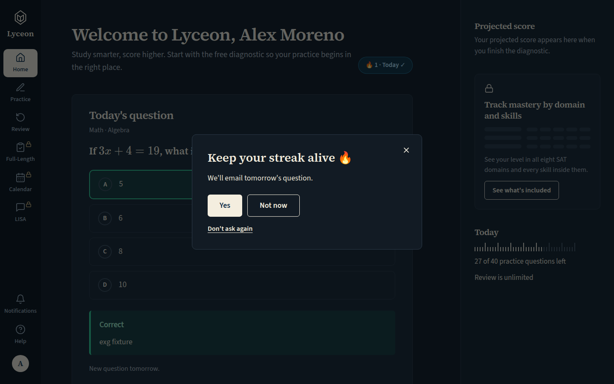 `/dashboard`, 120 KB, horizontal overflow 0px | none |
| mobile | light | 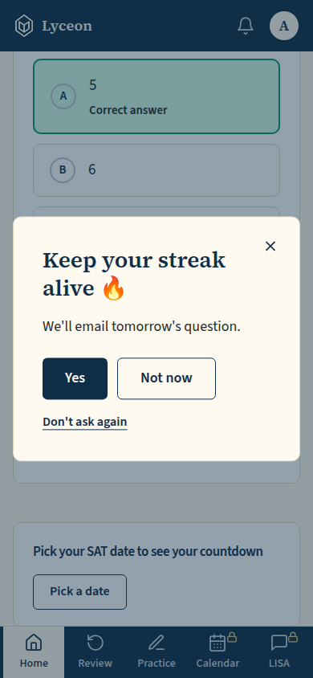 `/dashboard`, 42 KB, horizontal overflow 0px | none |
| mobile | dark | 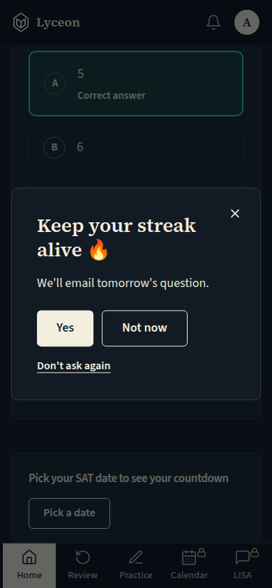 `/dashboard`, 41 KB, horizontal overflow 0px | none |

## The SAT-date card opened: 'Not sure yet', then the future official dates

Persona: `free`. Route: `/dashboard`.
Step: click `{"desktop":"[data-testid=\"home-sat-date-open\"]","mobile":"[data-testid=\"home-sat-date-open\"]"}`.
Must then show the text `Not sure yet` (the capture fails otherwise).
Full page: the whole document, not just the viewport.
Prototype: none. NOT PROTOTYPED: the Home QOTD card, streak chip, email prompt and SAT-date card are new in the owner brief of 2026-10-08/09 and built to DESIGN.md's tokens; these screenshots go to Karl before merge.

| Viewport | Theme (as rendered) | Built | Prototype |
|---|---|---|---|
| desktop | light | 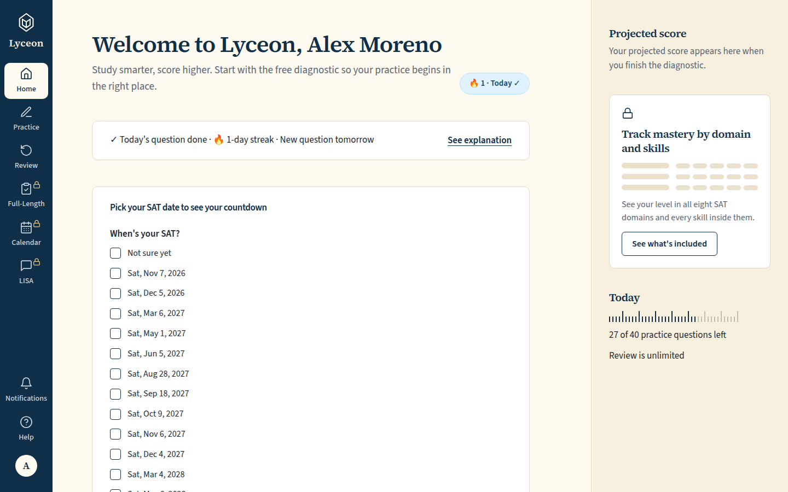 `/dashboard`, 129 KB, horizontal overflow 0px | none |
| desktop | dark | 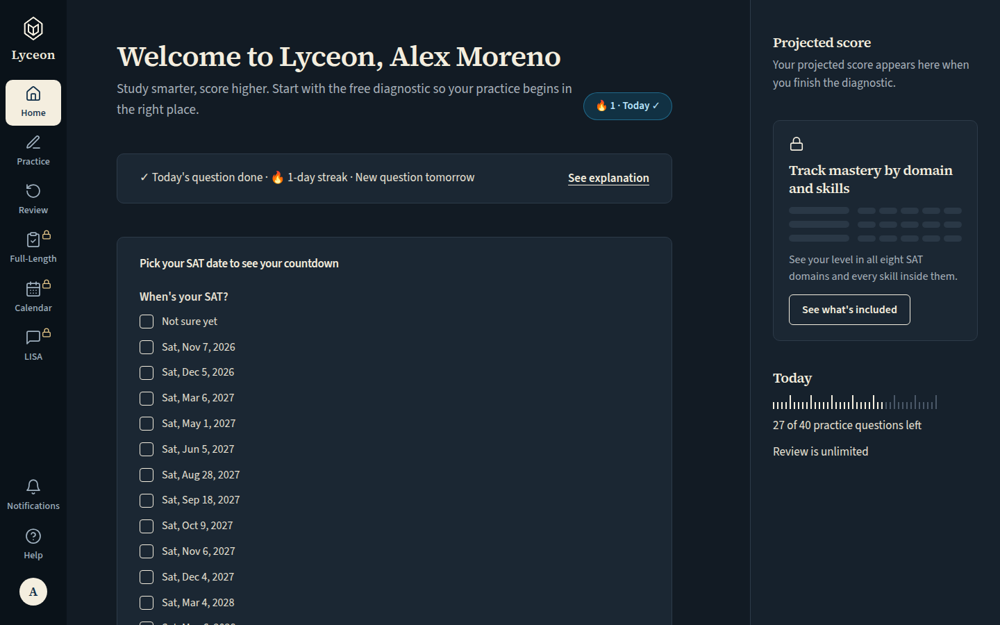 `/dashboard`, 132 KB, horizontal overflow 0px | none |
| mobile | light | 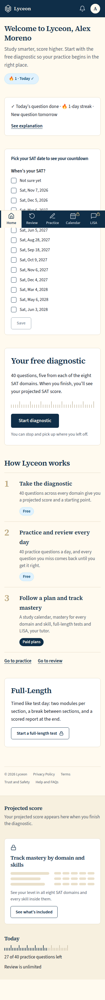 `/dashboard`, 227 KB, horizontal overflow 0px | none |
| mobile | dark | 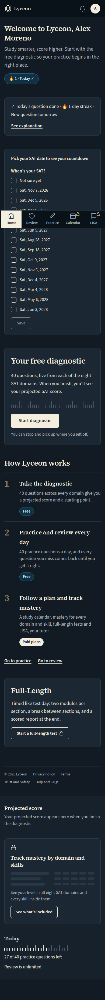 `/dashboard`, 232 KB, horizontal overflow 0px | none |

## Home, paid: chip, today's question, then today's plan

Persona: `paid`. Route: `/dashboard`.
Today's question unanswered before each capture (scheduled if missing; the persona's answer, qotd session and email-prompt state deleted).
Full page: the whole document, not just the viewport.
Prototype: none. NOT PROTOTYPED: the Home QOTD card, streak chip, email prompt and SAT-date card are new in the owner brief of 2026-10-08/09 and built to DESIGN.md's tokens; these screenshots go to Karl before merge.

| Viewport | Theme (as rendered) | Built | Prototype |
|---|---|---|---|
| desktop | light | 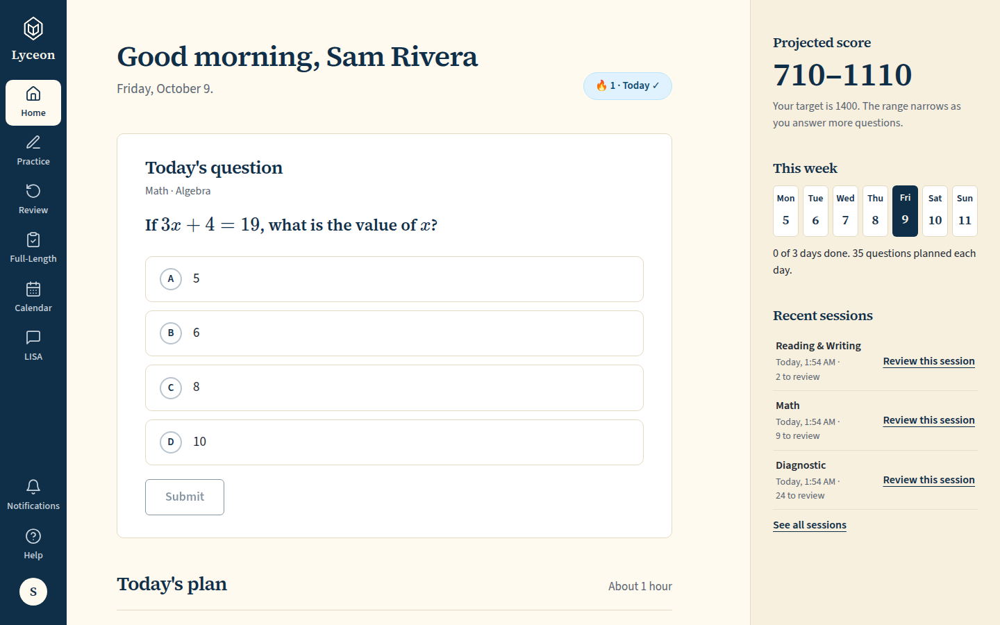 `/dashboard`, 118 KB, horizontal overflow 0px | none |
| desktop | dark | 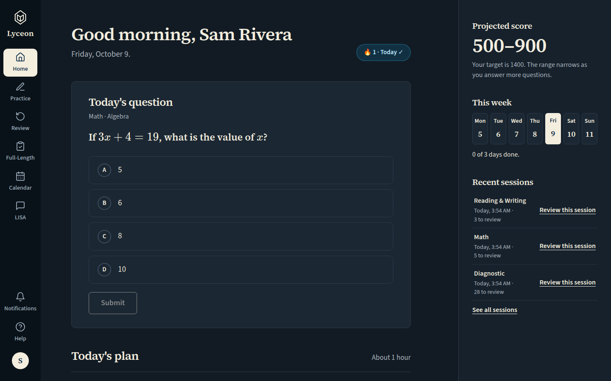 `/dashboard`, 119 KB, horizontal overflow 0px | none |
| mobile | light | 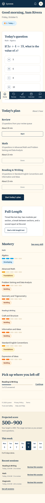 `/dashboard`, 227 KB, horizontal overflow 0px | none |
| mobile | dark | 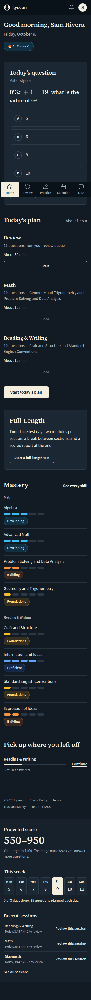 `/dashboard`, 232 KB, horizontal overflow 0px | none |

## Calendar (paid): the goal card's '🔥 N-day streak' (after today's answer)

Persona: `paid`. Route: `/calendar`.
Today's question unanswered before each capture (scheduled if missing; the persona's answer, qotd session and email-prompt state deleted).
Prototype: none. NOT PROTOTYPED: the Home QOTD card, streak chip, email prompt and SAT-date card are new in the owner brief of 2026-10-08/09 and built to DESIGN.md's tokens; these screenshots go to Karl before merge.

| Viewport | Theme (as rendered) | Built | Prototype |
|---|---|---|---|
| desktop | light | 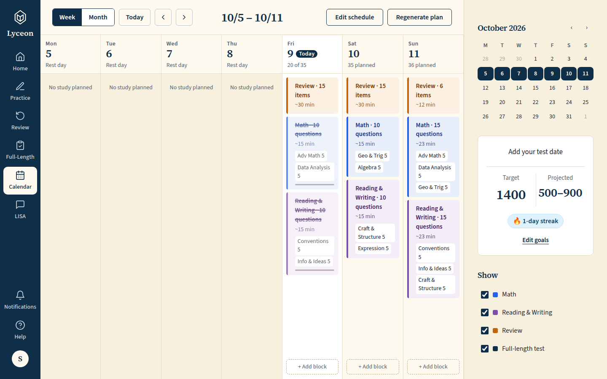 `/calendar`, 141 KB, horizontal overflow 0px | none |
| desktop | dark | 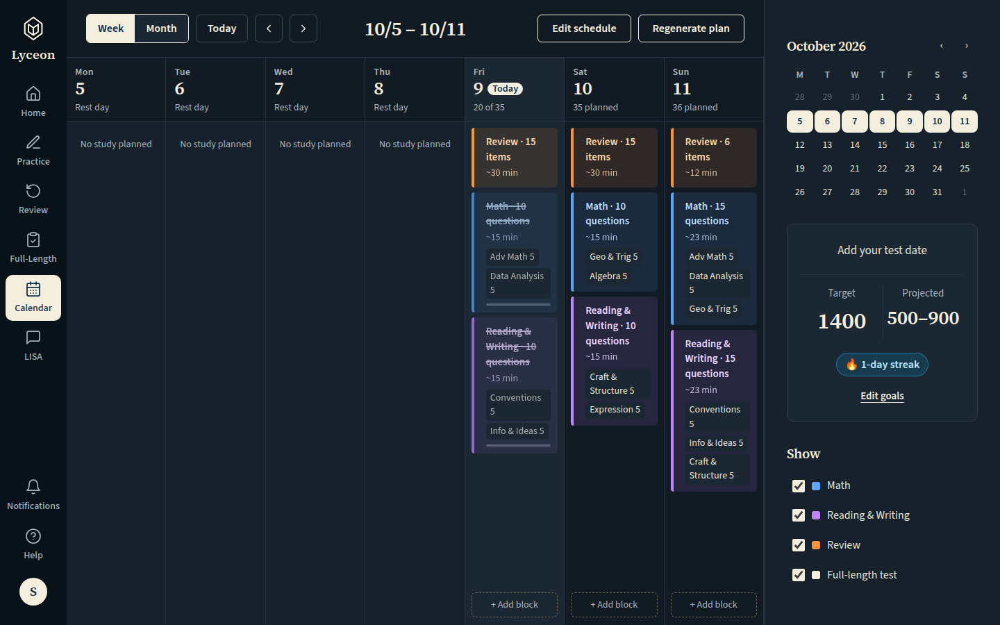 `/calendar`, 143 KB, horizontal overflow 0px | none |
| mobile | light | 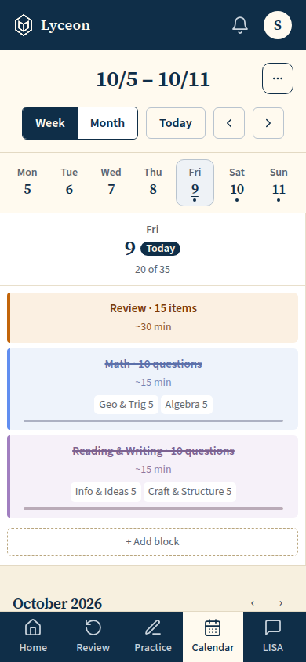 `/calendar`, 47 KB, horizontal overflow 0px | none |
| mobile | dark | 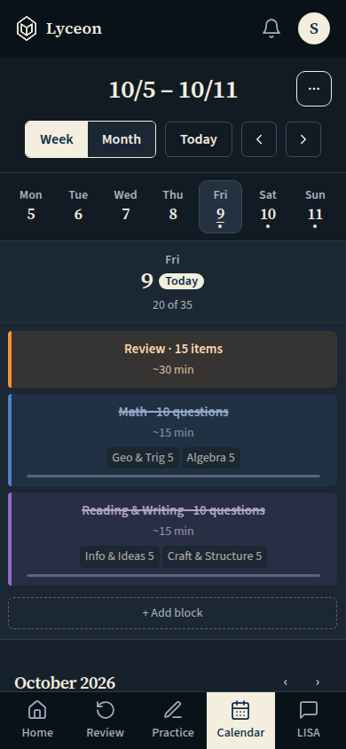 `/calendar`, 47 KB, horizontal overflow 0px | none |

## Run facts

- Seeded ids: `{"free":{"completedPracticeSessionId":"d5bb9714-3783-4361-8355-ed04cbc6fc87","openPracticeSessionId":"db2a08ba-1eef-4aaf-a3d4-823fd578cb27","openReviewSessionId":null,"diagnosticSessionId":null,"scoredExamSessionId":null,"inProgressExamSessionId":null,"lisaConversationId":null,"answered":13},"paid":{"completedPracticeSessionId":"7bd58d40-c149-4783-b8ec-cc407ae24677","openPracticeSessionId":"b2957d13-2413-4a1b-810f-5acf5ba18754","openReviewSessionId":null,"diagnosticSessionId":"a97055c4-d3e1-414c-96df-990ab43d1873","scoredExamSessionId":null,"inProgressExamSessionId":null,"lisaConversationId":null,"answered":53}}`
- Endpoints the pages asked for that the harness does not serve (answered 404): none
- Desmos (QA2-B, opt-in `STUDENT_HARNESS_DESMOS=1`): not loaded (a local-only run; the calculator shows its unavailable line)
- External hosts blocked: none
