# QA2-A The review cap on Home and Review: the refusal at the clicked button, with its two actions (1440, 1024, 390; light and dark)

Generated 2026-10-08T02:23:13.534Z by `pnpm exec tsx tests/e2e/student-harness/capture.ts QA2-A` (see `tests/e2e/student-harness/README.md`). Built = a production build of the real client (`vite preview`, or the dev server with STUDENT_HARNESS_CLIENT=dev) against the student harness (real routers over a local Postgres built from this repo's migrations; personas seeded through the real practice routes). Prototype = the signed-off `docs/plans/student-ui/design/prototype/*.dc.html`, rendered locally.

Conditions, read before comparing:
- Viewport screenshots (not full page) unless the shot says full page: desktop 1440x900, phone 390x844, and any extra size a shot names.
- The prototypes are a fixed 1440x900 canvas with no phone layout; phone rows show the desktop prototype.
- Dark is requested through the app's own per-device setting; the theme column records what the page rendered.
- No external requests: the built app's Google Fonts (Inter, Poppins) are blocked, so legacy page bodies fall back to system faces; Source Sans 3 / Source Serif 4 are self-hosted and load for both sides.
- Prototype data is illustrative; built data is the seeded personas' real payloads.

## Home, paid, at the review cap: 'Review this session' (the first recent session) pressed; the server refuses

Persona: `paid`. Route: `/dashboard`.
At the review-session cap before each capture: queue review sessions are opened through the real `POST /api/review/sessions` until the server itself refuses one with `SESSION_LIMIT_EXCEEDED`; the ones opened are ended through the real terminate route after the shot.
Must then show `[data-testid="review-cap"]` wholly inside the viewport (the capture fails otherwise).
Step: click `{"desktop":"[data-testid=\"home-recent-review\"]","mobile":"[data-testid=\"home-recent-review\"]"}`.
Also shot at w1024 1024x768 (the desktop steps and selectors).
Prototype: none. A refusal state the prototype does not draw (owner re-test, 2026-10-08, item A).

| Viewport | Theme (as rendered) | Built | Prototype |
|---|---|---|---|
| desktop | light | 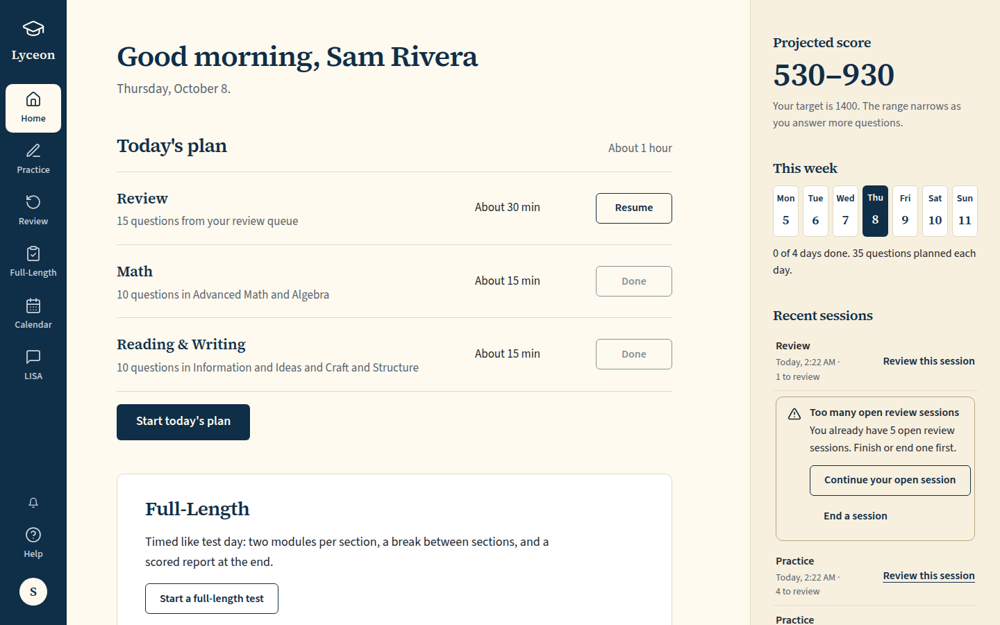 `/dashboard`, 146 KB, horizontal overflow 0px | none |
| desktop | dark | 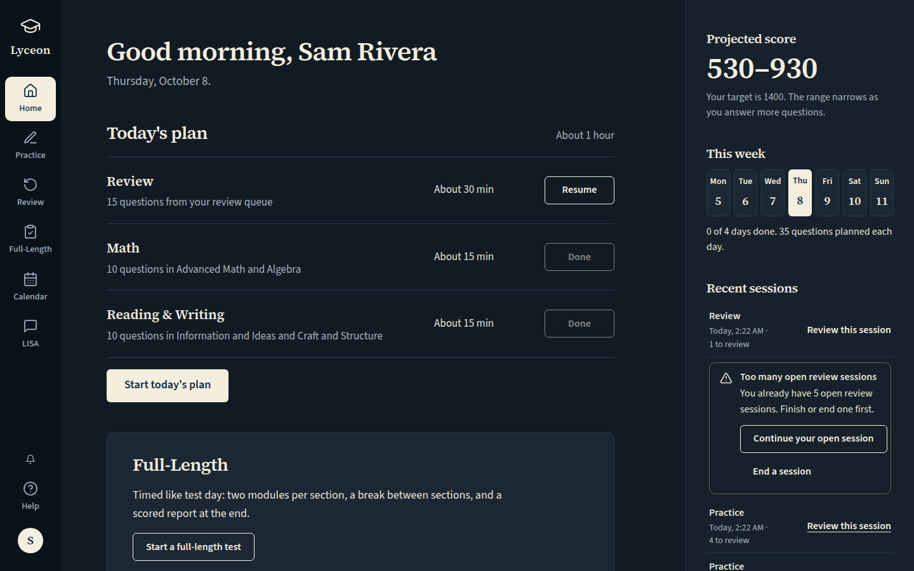 `/dashboard`, 147 KB, horizontal overflow 0px | none |
| mobile | light | 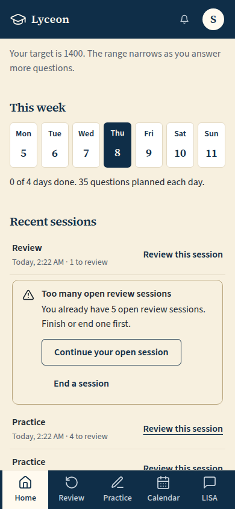 `/dashboard`, 58 KB, horizontal overflow 0px | none |
| mobile | dark | 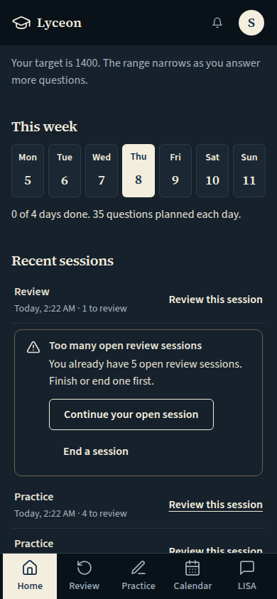 `/dashboard`, 58 KB, horizontal overflow 0px | none |
| w1024 | light | 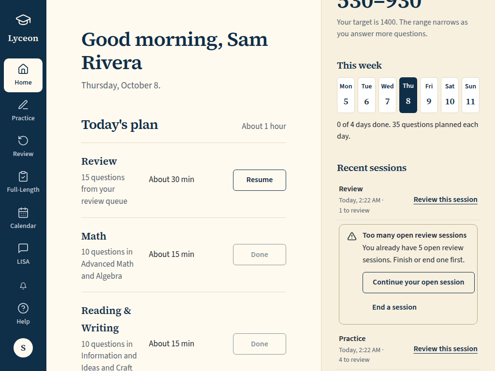 `/dashboard`, 119 KB, horizontal overflow 0px | none |
| w1024 | dark | 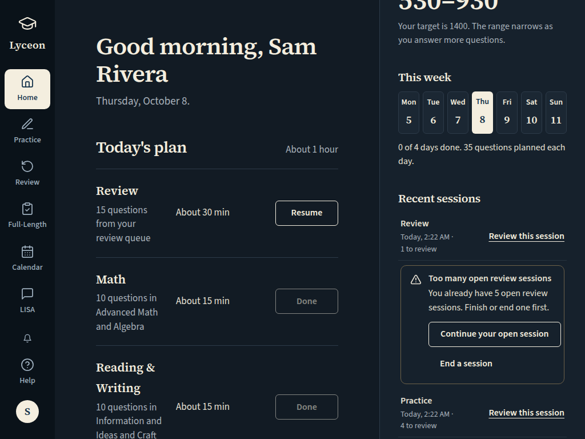 `/dashboard`, 120 KB, horizontal overflow 0px | none |

## Review, paid, at the review cap: 'Start reviewing' pressed; the server refuses

Persona: `paid`. Route: `/review`.
At the review-session cap before each capture: queue review sessions are opened through the real `POST /api/review/sessions` until the server itself refuses one with `SESSION_LIMIT_EXCEEDED`; the ones opened are ended through the real terminate route after the shot.
Must then show `[data-testid="review-cap"]` wholly inside the viewport (the capture fails otherwise).
Step: click `{"desktop":"[data-testid=\"button-start-queue\"]","mobile":"[data-testid=\"button-start-queue\"]"}`.
Also shot at w1024 1024x768 (the desktop steps and selectors).
Prototype: none. A refusal state the prototype does not draw (owner re-test, 2026-10-08, item A).

| Viewport | Theme (as rendered) | Built | Prototype |
|---|---|---|---|
| desktop | light | 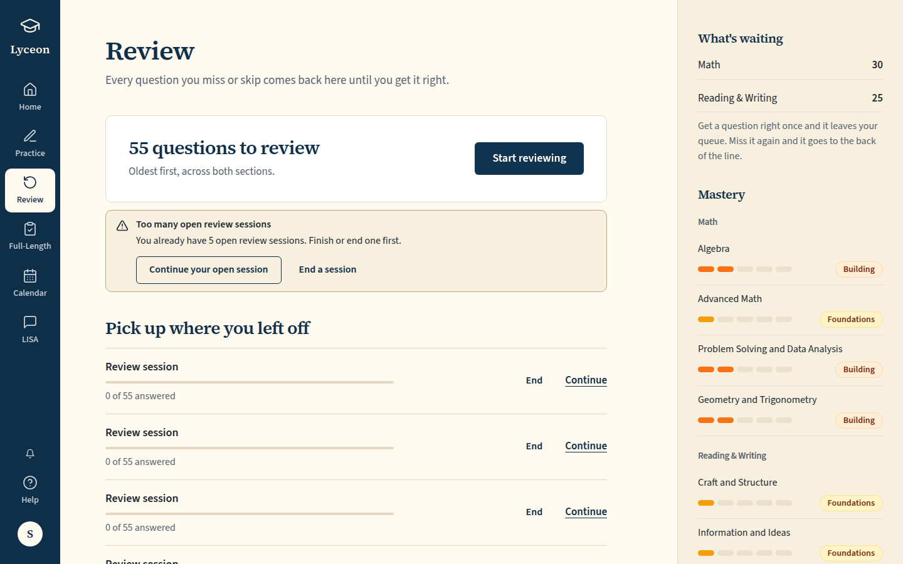 `/review`, 134 KB, horizontal overflow 0px | none |
| desktop | dark | 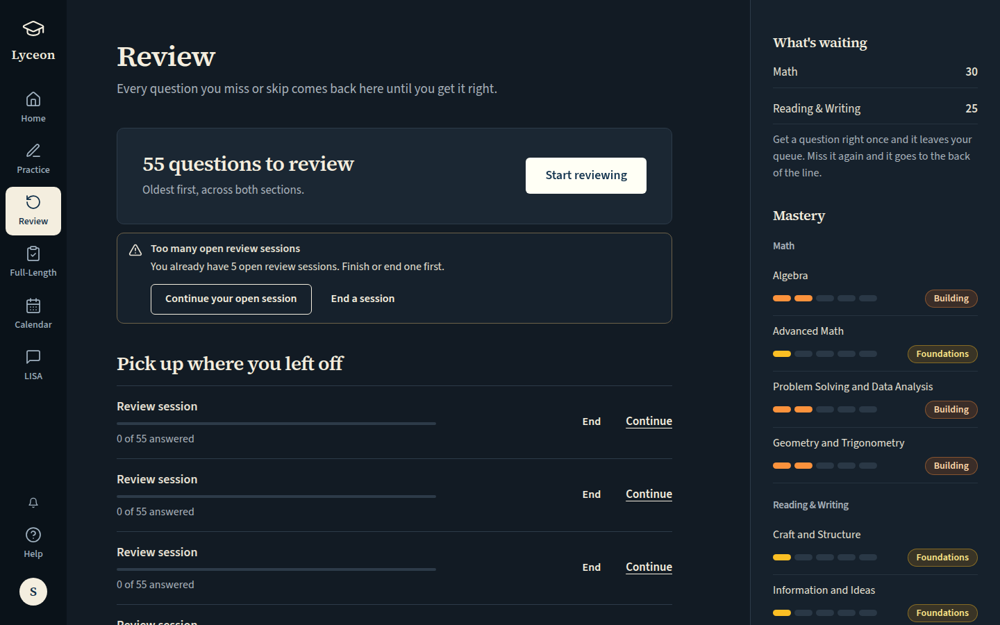 `/review`, 135 KB, horizontal overflow 0px | none |
| mobile | light | 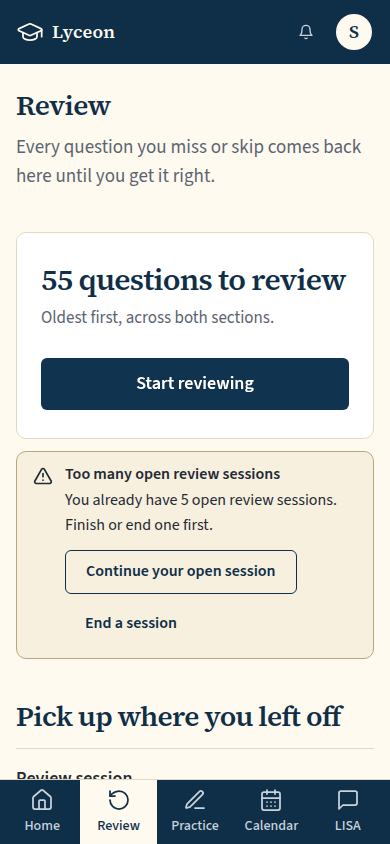 `/review`, 58 KB, horizontal overflow 0px | none |
| mobile | dark | 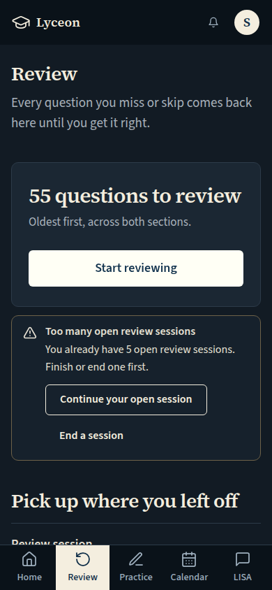 `/review`, 58 KB, horizontal overflow 0px | none |
| w1024 | light | 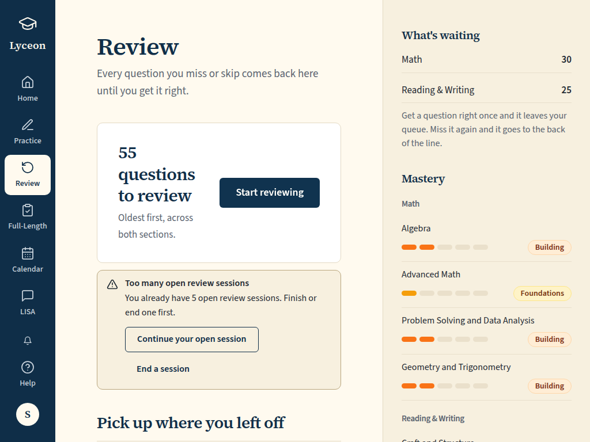 `/review`, 106 KB, horizontal overflow 0px | none |
| w1024 | dark | 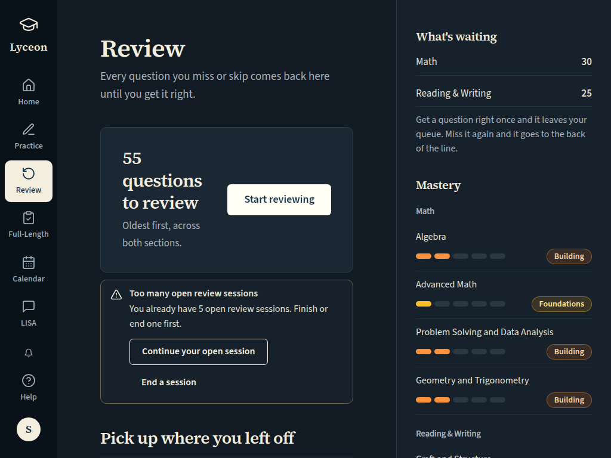 `/review`, 107 KB, horizontal overflow 0px | none |

## Review, paid, at the review cap: 'Past sessions' opened and the first Redo pressed; the server refuses

Persona: `paid`. Route: `/review`.
At the review-session cap before each capture: queue review sessions are opened through the real `POST /api/review/sessions` until the server itself refuses one with `SESSION_LIMIT_EXCEEDED`; the ones opened are ended through the real terminate route after the shot.
Must then show `[data-testid="review-cap"]` wholly inside the viewport (the capture fails otherwise).
Step: click `{"desktop":"[data-testid=\"review-past-toggle\"]","mobile":"[data-testid=\"review-past-toggle\"]"}`.
Step: click `{"desktop":"[data-testid=\"review-past-redo\"]","mobile":"[data-testid=\"review-past-redo\"]"}`.
Also shot at w1024 1024x768 (the desktop steps and selectors).
Prototype: none. A refusal state the prototype does not draw (owner re-test, 2026-10-08, item A).

| Viewport | Theme (as rendered) | Built | Prototype |
|---|---|---|---|
| desktop | light | 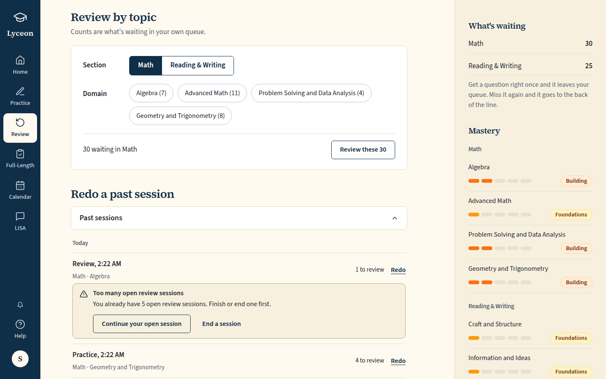 `/review`, 138 KB, horizontal overflow 0px | none |
| desktop | dark | 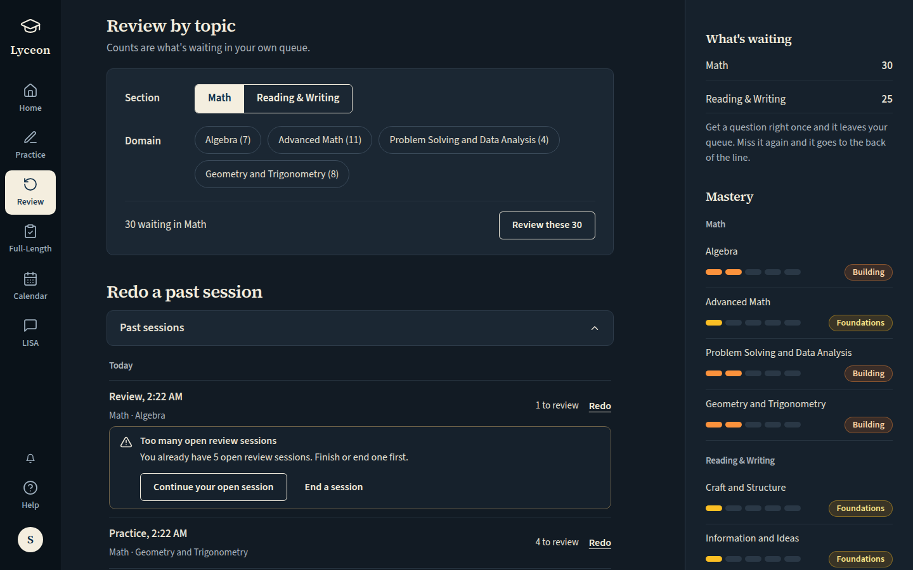 `/review`, 141 KB, horizontal overflow 0px | none |
| mobile | light | 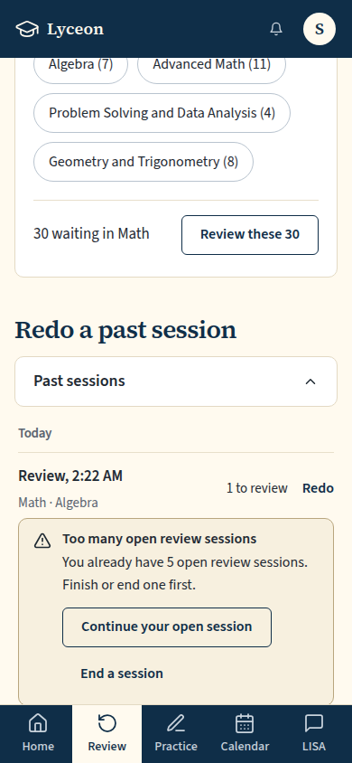 `/review`, 59 KB, horizontal overflow 0px | none |
| mobile | dark | 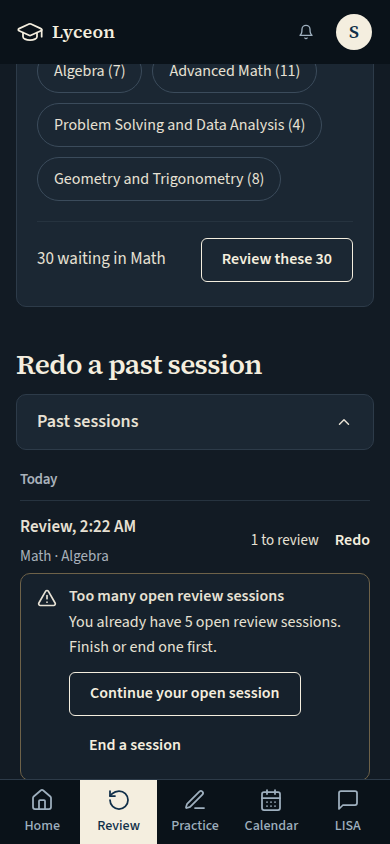 `/review`, 60 KB, horizontal overflow 0px | none |
| w1024 | light | 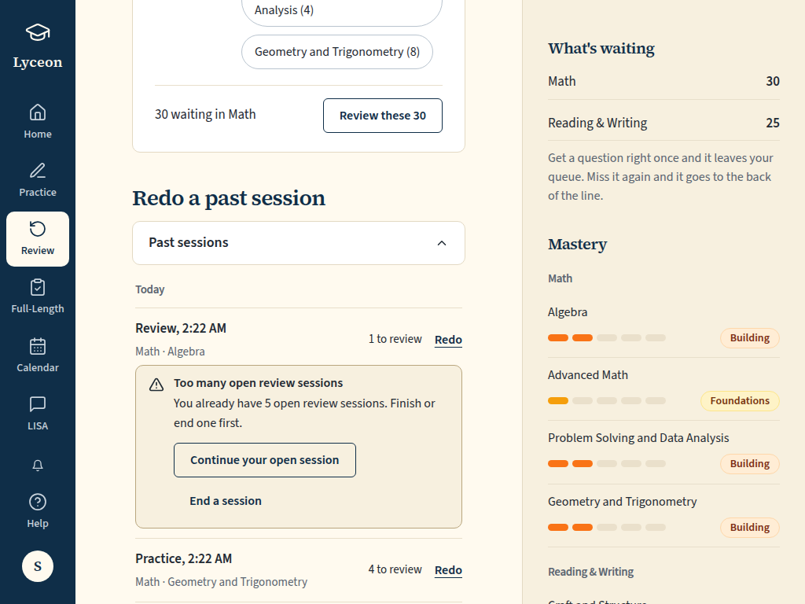 `/review`, 107 KB, horizontal overflow 0px | none |
| w1024 | dark | 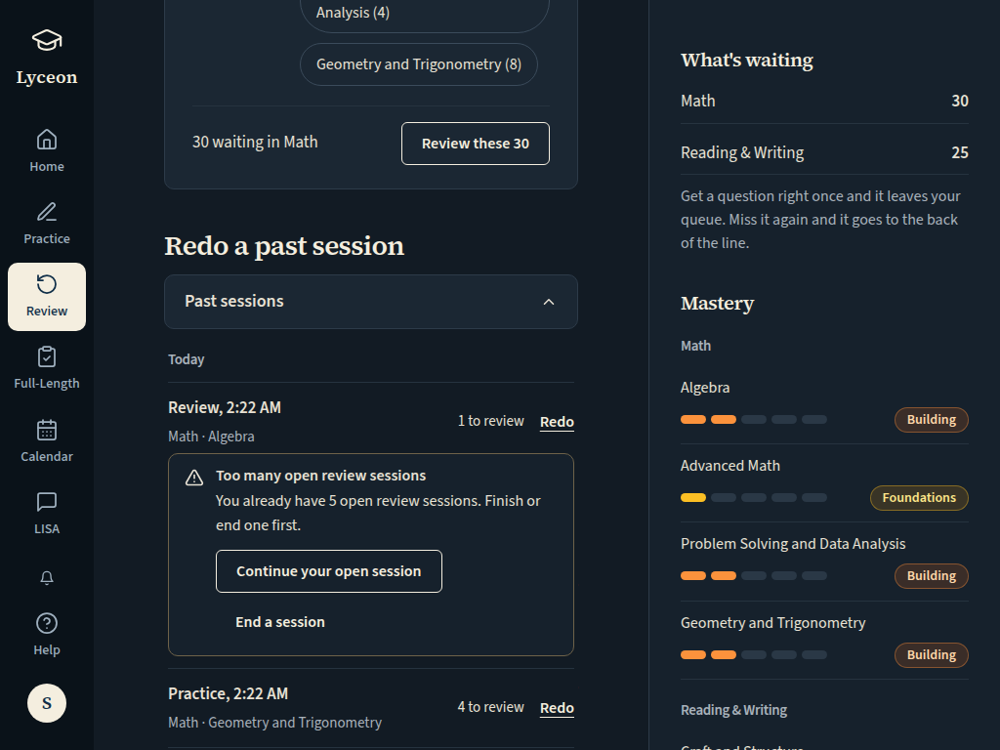 `/review`, 108 KB, horizontal overflow 0px | none |

## Run facts

- Seeded ids: `{"free":{"completedPracticeSessionId":"f4095782-51fb-4c14-98cc-2a40830ff5c4","openPracticeSessionId":"c220b2d1-ab85-4e8e-a9b7-da44b0ec3b19","openReviewSessionId":"cdd48216-78c2-4cdd-9d5b-08aeda37eafb","diagnosticSessionId":null,"scoredExamSessionId":null,"inProgressExamSessionId":null,"lisaConversationId":null,"answered":39},"paid":{"completedPracticeSessionId":"b6179ebe-06a0-47e3-adc4-8aa938d11f70","openPracticeSessionId":"ad30437f-c7e6-4509-b3ef-858ed8224df7","openReviewSessionId":"0daea19d-d0e5-4b98-971a-595824173b96","diagnosticSessionId":"d88c88d5-799f-4adb-a2a8-7e879ab6f300","scoredExamSessionId":null,"inProgressExamSessionId":null,"lisaConversationId":null,"answered":79}}`
- Endpoints the pages asked for that the harness does not serve (answered 404): none
- External hosts blocked: none
