# UI-41 shells: App shell (rail lock states), Focus shell, Bare card

Generated 2026-10-08T03:21:38.333Z by `pnpm exec tsx tests/e2e/student-harness/capture.ts UI-41` (see `tests/e2e/student-harness/README.md`). Built = a production build of the real client (`vite preview`, or the dev server with STUDENT_HARNESS_CLIENT=dev) against the student harness (real routers over a local Postgres built from this repo's migrations; personas seeded through the real practice routes). Prototype = the signed-off `docs/plans/student-ui/design/prototype/*.dc.html`, rendered locally.

Conditions, read before comparing:
- Viewport screenshots (not full page) unless the shot says full page: desktop 1440x900, phone 390x844, and any extra size a shot names.
- The prototypes are a fixed 1440x900 canvas with no phone layout; phone rows show the desktop prototype.
- Dark is requested through the app's own per-device setting; the theme column records what the page rendered.
- No external requests: the built app's Google Fonts (Inter, Poppins) are blocked, so legacy page bodies fall back to system faces; Source Sans 3 / Source Serif 4 are self-hosted and load for both sides.
- Prototype data is illustrative; built data is the seeded personas' real payloads.

## App shell, /dashboard, free (Full-Length, Calendar and LISA locked)

Persona: `free`. Route: `/dashboard`.
Preset sessionStorage: `{"lyceon:diagnostic_modal_dismissed":"1"}`.
Prototype: `Main.dc.html` (Home, plan = free).

| Viewport | Theme (as rendered) | Built | Prototype |
|---|---|---|---|
| desktop | light |  `/dashboard`, 141 KB, horizontal overflow 0px | , 141 KB |
| desktop | dark |  `/dashboard`, 142 KB, horizontal overflow 0px | , 142 KB |
| mobile | light |  `/dashboard`, 63 KB, horizontal overflow 0px |  desktop prototype (no phone layout), 141 KB |
| mobile | dark |  `/dashboard`, 64 KB, horizontal overflow 0px |  desktop prototype (no phone layout), 142 KB |

## App shell, /dashboard, paid (no locks)

Persona: `paid`. Route: `/dashboard`.
Prototype: `Main.dc.html` (Home, plan = paid).

| Viewport | Theme (as rendered) | Built | Prototype |
|---|---|---|---|
| desktop | light |  `/dashboard`, 138 KB, horizontal overflow 0px | , 147 KB |
| desktop | dark |  `/dashboard`, 138 KB, horizontal overflow 0px | , 147 KB |
| mobile | light |  `/dashboard`, 55 KB, horizontal overflow 0px |  desktop prototype (no phone layout), 147 KB |
| mobile | dark |  `/dashboard`, 55 KB, horizontal overflow 0px |  desktop prototype (no phone layout), 147 KB |

## App shell, /calendar, free (rail lock shown, page navigates and upsells)

Persona: `free`. Route: `/calendar`.
Prototype: `Calendar.dc.html` (Calendar, plan = free).

| Viewport | Theme (as rendered) | Built | Prototype |
|---|---|---|---|
| desktop | light |  `/calendar`, 85 KB, horizontal overflow 0px | , 106 KB |
| desktop | dark |  `/calendar`, 87 KB, horizontal overflow 0px | , 109 KB |
| mobile | light |  `/calendar`, 50 KB, horizontal overflow 0px |  desktop prototype (no phone layout), 106 KB |
| mobile | dark |  `/calendar`, 53 KB, horizontal overflow 0px |  desktop prototype (no phone layout), 109 KB |

## App shell, /chat, free (LISA locked)

Persona: `free`. Route: `/chat`.
Prototype: `Lisa.dc.html` (LISA, plan = free).

| Viewport | Theme (as rendered) | Built | Prototype |
|---|---|---|---|
| desktop | light |  `/chat`, 48 KB, horizontal overflow 0px | , 45 KB |
| desktop | dark |  `/chat`, 49 KB, horizontal overflow 0px | , 46 KB |
| mobile | light |  `/chat`, 38 KB, horizontal overflow 0px |  desktop prototype (no phone layout), 45 KB |
| mobile | dark |  `/chat`, 39 KB, horizontal overflow 0px |  desktop prototype (no phone layout), 46 KB |

## Upgrade modal opened from the locked LISA rail item (free, on /dashboard)

Persona: `free`. Route: `/dashboard`.
Preset sessionStorage: `{"lyceon:diagnostic_modal_dismissed":"1"}`.
Step: click `{"desktop":"[data-testid=\"rail-lisa\"]","mobile":"[data-testid=\"tab-lisa\"]"}`.
Prototype: `Main.dc.html` (Home, plan = free, LISA rail item clicked); clicked: `button[aria-label^="LISA"]`.

| Viewport | Theme (as rendered) | Built | Prototype |
|---|---|---|---|
| desktop | light |  `/dashboard`, 159 KB, horizontal overflow 0px | , 161 KB |
| desktop | dark |  `/dashboard`, 155 KB, horizontal overflow 0px | , 158 KB |
| mobile | light |  `/dashboard`, 62 KB, horizontal overflow 0px |  desktop prototype (no phone layout), 161 KB |
| mobile | dark |  `/dashboard`, 61 KB, horizontal overflow 0px |  desktop prototype (no phone layout), 158 KB |

## App shell, /dashboard, paid: the avatar menu opened (390: Settings, Help, Sign out, in the page's theme; desktop since QA 2026-10-07 item 3: the same menu, opened beside the rail)

Persona: `paid`. Route: `/dashboard`.
Step: click `{"desktop":"[data-testid=\"button-user-menu\"]","mobile":"[data-testid=\"button-user-menu\"]"}`.
Prototype: none. The prototypes have no phone layout (fixed 1440x900 canvas); the avatar menu is the owner ruling of 2026-10-05 (DESIGN.md §2 Mobile).

| Viewport | Theme (as rendered) | Built | Prototype |
|---|---|---|---|
| desktop | light | 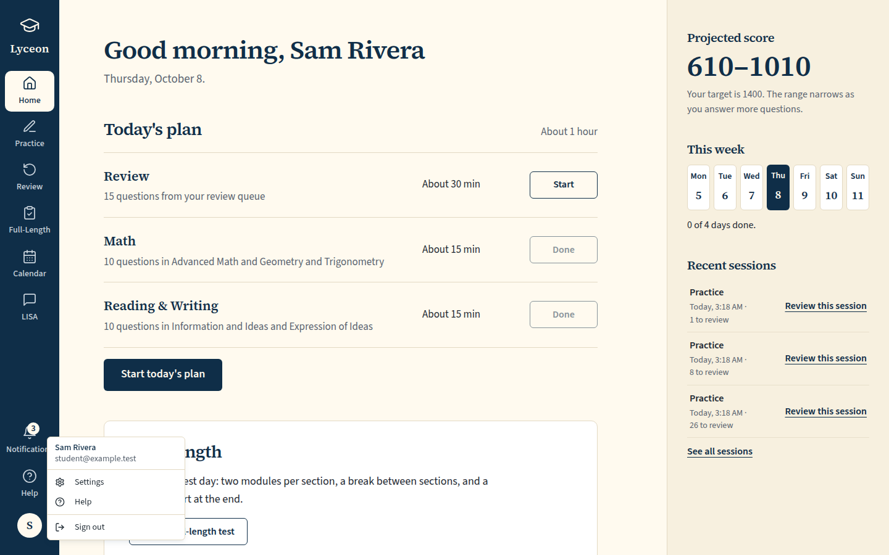 `/dashboard`, 141 KB, horizontal overflow 0px | none |
| desktop | dark | 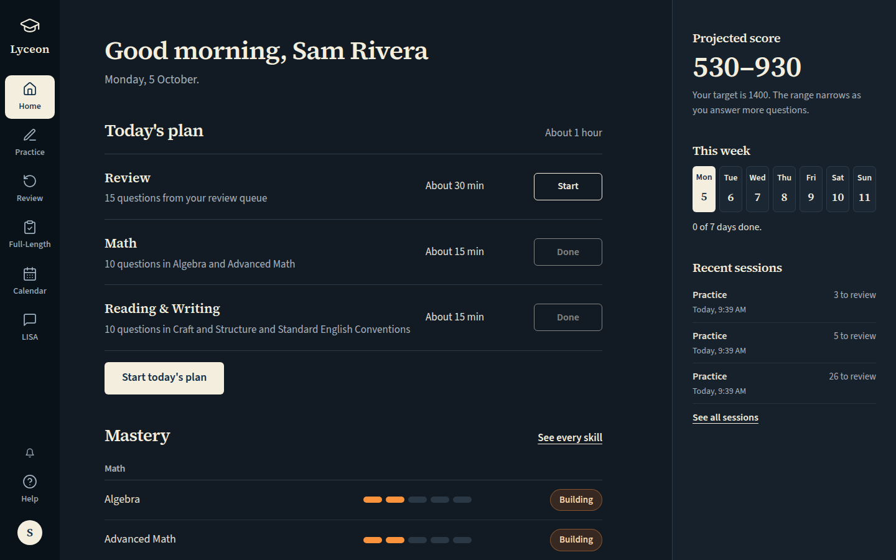 `/dashboard`, 141 KB, horizontal overflow 0px | none |
| mobile | light |  `/dashboard`, 57 KB, horizontal overflow 0px | none |
| mobile | dark |  `/dashboard`, 57 KB, horizontal overflow 0px | none |

## App shell, /dashboard, free: the avatar menu opened (390: Settings, Help, Sign out, no Full-Length; desktop since QA 2026-10-07 item 3: the same menu, beside the rail)

Persona: `free`. Route: `/dashboard`.
Preset sessionStorage: `{"lyceon:diagnostic_modal_dismissed":"1"}`.
Step: click `{"desktop":"[data-testid=\"button-user-menu\"]","mobile":"[data-testid=\"button-user-menu\"]"}`.
Prototype: none. The prototypes have no phone layout (fixed 1440x900 canvas); the avatar menu is the owner ruling of 2026-10-05 (DESIGN.md §2 Mobile).

| Viewport | Theme (as rendered) | Built | Prototype |
|---|---|---|---|
| desktop | light | 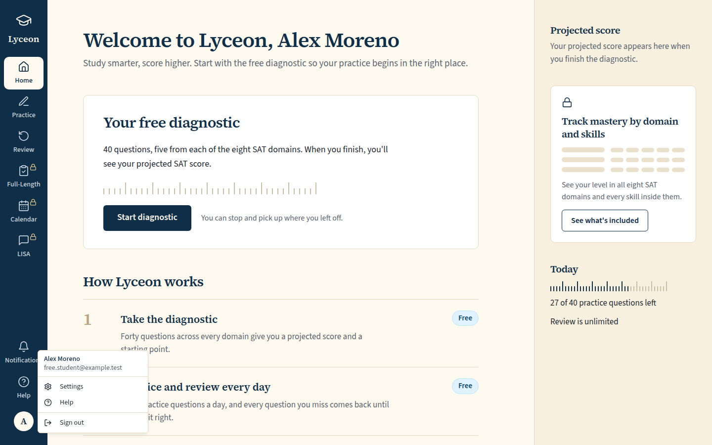 `/dashboard`, 145 KB, horizontal overflow 0px | none |
| desktop | dark | 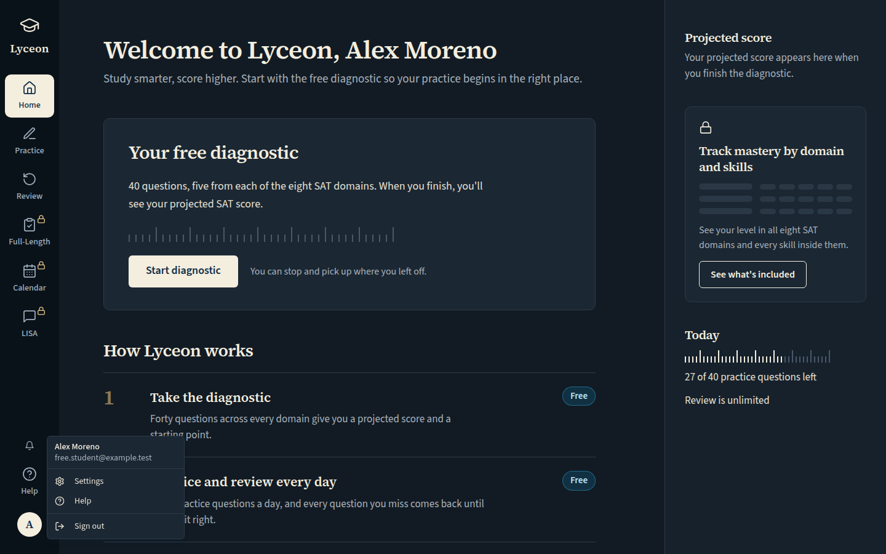 `/dashboard`, 146 KB, horizontal overflow 0px | none |
| mobile | light |  `/dashboard`, 61 KB, horizontal overflow 0px | none |
| mobile | dark |  `/dashboard`, 62 KB, horizontal overflow 0px | none |

## App shell, /practice/topics (a page still pinned light, OQ-49), paid: the avatar menu opened (a light menu in both themes at both widths, F-70; desktop since QA 2026-10-07 item 3)

Persona: `paid`. Route: `/practice/topics`.
Step: click `{"desktop":"[data-testid=\"button-user-menu\"]","mobile":"[data-testid=\"button-user-menu\"]"}`.
Prototype: none. The prototypes have no phone layout (fixed 1440x900 canvas); the menu's theme is register §8 F-70.

| Viewport | Theme (as rendered) | Built | Prototype |
|---|---|---|---|
| desktop | light |  `/practice/topics`, 65 KB, horizontal overflow 0px | none |
| desktop | dark requested; page pinned light (`data-theme-lock=light`, OQ-49) | 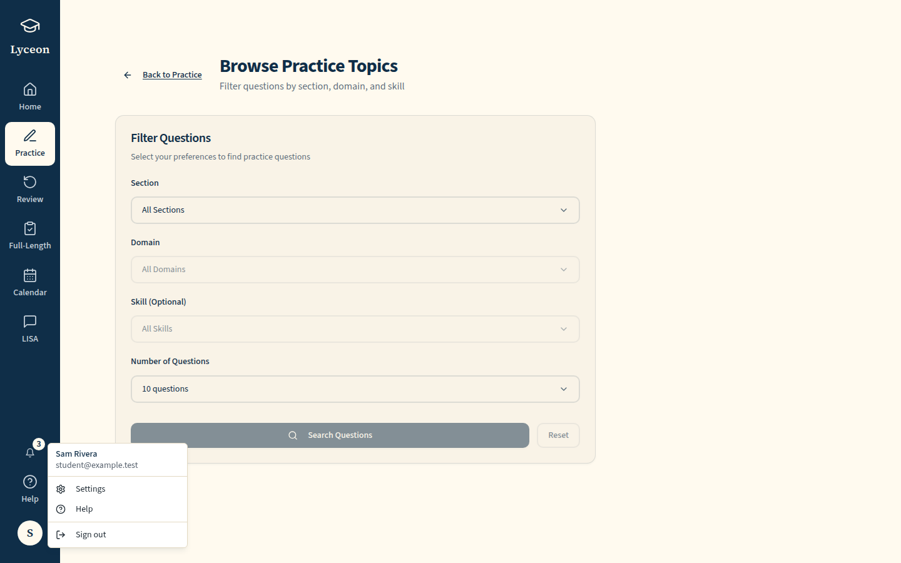 `/practice/topics`, 65 KB, horizontal overflow 0px | none |
| mobile | light |  `/practice/topics`, 42 KB, horizontal overflow 0px | none |
| mobile | dark requested; page pinned light (`data-theme-lock=light`, OQ-49) |  `/practice/topics`, 42 KB, horizontal overflow 0px | none |

## Upgrade modal opened from the locked Full-Length entry (390: Home's full-length card; desktop: the rail), free, on /dashboard

Persona: `free`. Route: `/dashboard`.
Preset sessionStorage: `{"lyceon:diagnostic_modal_dismissed":"1"}`.
Step: click `{"desktop":"[data-testid=\"rail-full-length\"]","mobile":"[data-testid=\"home-full-length-start\"]"}`.
Must then show `[data-testid="upgrade-modal"]` (the capture fails otherwise).
Prototype: `Main.dc.html` (Home, plan = free, Full-Length rail item clicked); clicked: `button[aria-label^="Full-Length"]`.

| Viewport | Theme (as rendered) | Built | Prototype |
|---|---|---|---|
| desktop | light | 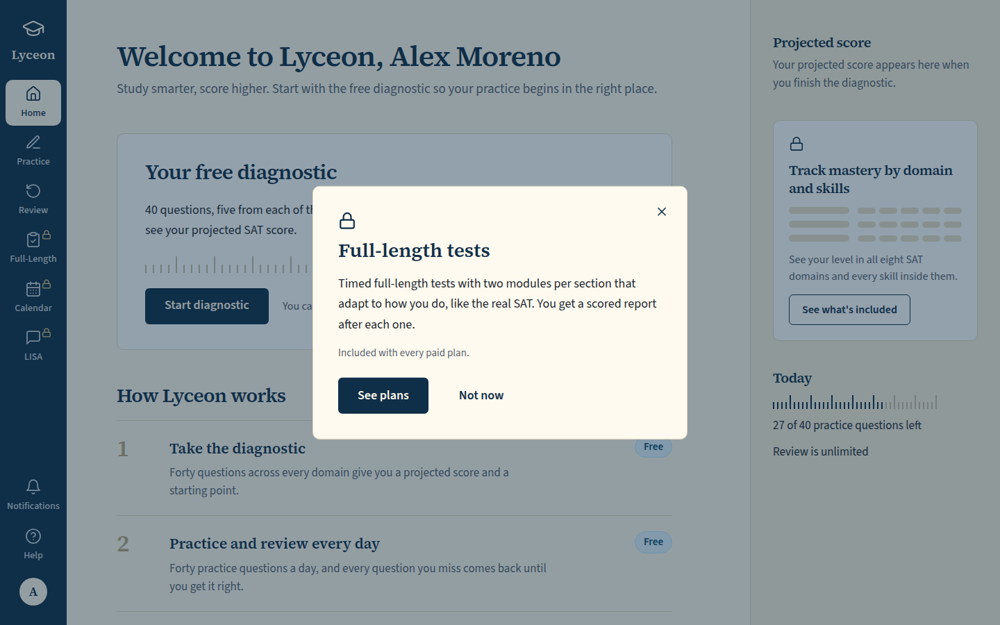 `/dashboard`, 155 KB, horizontal overflow 0px | 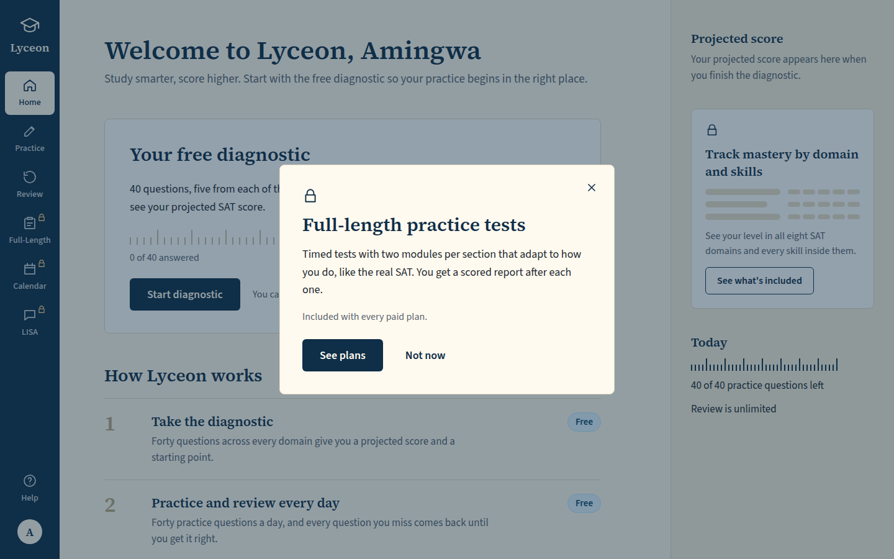, 156 KB |
| desktop | dark | 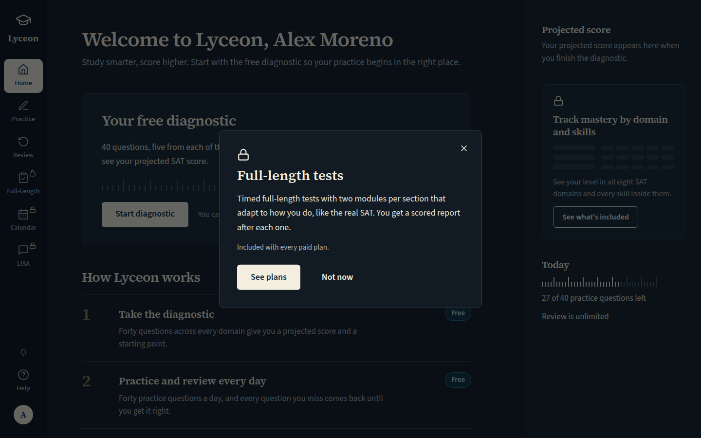 `/dashboard`, 151 KB, horizontal overflow 0px | 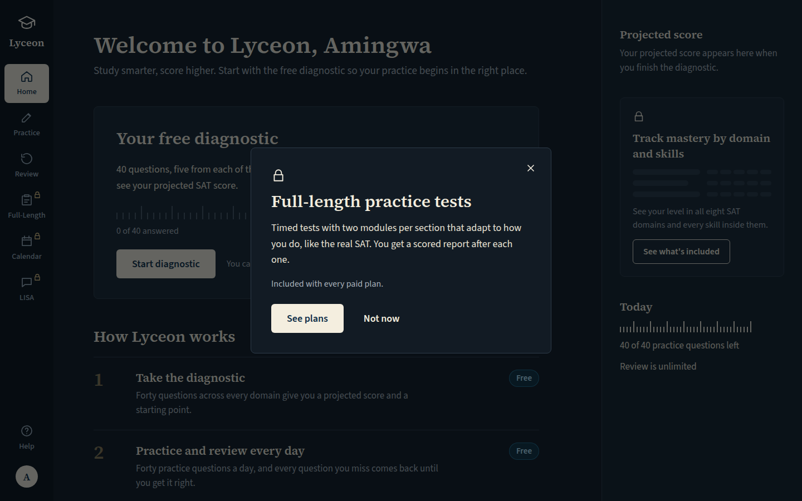, 154 KB |
| mobile | light |  `/dashboard`, 53 KB, horizontal overflow 0px |  desktop prototype (no phone layout), 156 KB |
| mobile | dark |  `/dashboard`, 52 KB, horizontal overflow 0px |  desktop prototype (no phone layout), 154 KB |

## Focus shell, practice runner (open Reading and Writing session, 3 of 10 answered)

Persona: `free`. Route: `/practice/session/{free.openPracticeSessionId}`.
Preset localStorage: `{"lyceon_client_instance_id":"student-harness-seed"}`.
Prototype: `Runner.dc.html` (Question runner (no plan prop)).

| Viewport | Theme (as rendered) | Built | Prototype |
|---|---|---|---|
| desktop | light |  `/practice/session/3d96087e-766b-4045-a4bd-fb798c96dd17`, 88 KB, horizontal overflow 0px | , 33 KB |
| desktop | dark |  `/practice/session/3d96087e-766b-4045-a4bd-fb798c96dd17`, 91 KB, horizontal overflow 0px | , 33 KB |
| mobile | light |  `/practice/session/3d96087e-766b-4045-a4bd-fb798c96dd17`, 71 KB, horizontal overflow 0px |  desktop prototype (no phone layout), 33 KB |
| mobile | dark |  `/practice/session/3d96087e-766b-4045-a4bd-fb798c96dd17`, 74 KB, horizontal overflow 0px |  desktop prototype (no phone layout), 33 KB |

## Bare card, /login, signed out

Persona: `signed-out`. Route: `/login`.
Prototype: none. No prototype screen for the Bare card; DESIGN.md §2 describes it in words (a centered card on --paper).

| Viewport | Theme (as rendered) | Built | Prototype |
|---|---|---|---|
| desktop | light |  `/login`, 38 KB, horizontal overflow 0px | none |
| desktop | dark |  `/login`, 39 KB, horizontal overflow 0px | none |
| mobile | light |  `/login`, 33 KB, horizontal overflow 0px | none |
| mobile | dark |  `/login`, 34 KB, horizontal overflow 0px | none |

## Bare card, 404 (signed in, paid)

Persona: `paid`. Route: `/no-such-page`.
Prototype: none. No prototype screen for the Bare card; DESIGN.md §2 describes it in words (a centered card on --paper).

| Viewport | Theme (as rendered) | Built | Prototype |
|---|---|---|---|
| desktop | light |  `/no-such-page`, 17 KB, horizontal overflow 0px | none |
| desktop | dark |  `/no-such-page`, 17 KB, horizontal overflow 0px | none |
| mobile | light |  `/no-such-page`, 14 KB, horizontal overflow 0px | none |
| mobile | dark |  `/no-such-page`, 14 KB, horizontal overflow 0px | none |

## QA 13: the bell with its unread badge (three unread in-app notifications, seed 'notifications'), paid, /dashboard

Persona: `paid`. Route: `/dashboard`.
Prototype: none. The prototypes draw no bell (OQ-47 placed it after sign-off); contracts/notifications.contract.md §3.

| Viewport | Theme (as rendered) | Built | Prototype |
|---|---|---|---|
| desktop | light |  `/dashboard`, 138 KB, horizontal overflow 0px | none |
| desktop | dark | 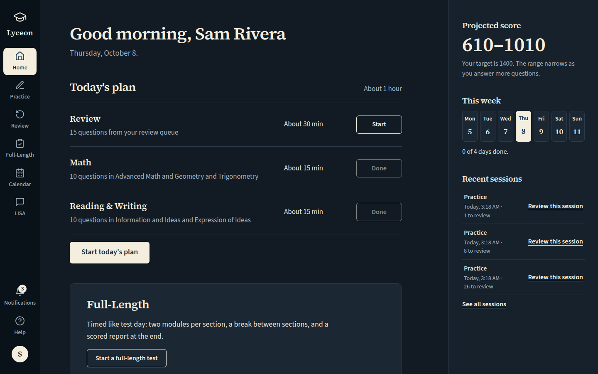 `/dashboard`, 138 KB, horizontal overflow 0px | none |
| mobile | light | 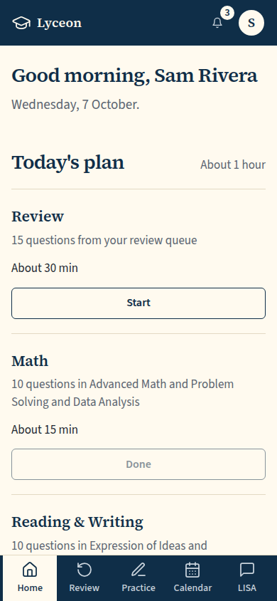 `/dashboard`, 55 KB, horizontal overflow 0px | none |
| mobile | dark | 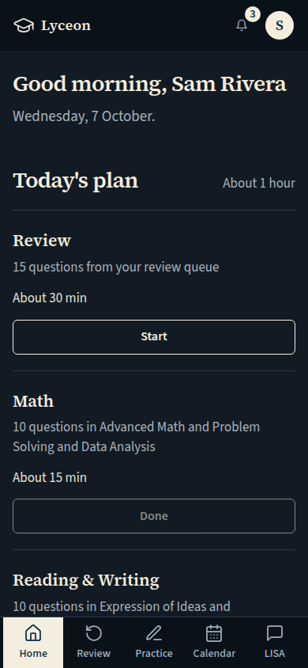 `/dashboard`, 55 KB, horizontal overflow 0px | none |

## QA 13: the notifications popover while its feed loads (GET /api/notifications held): the skeleton, not 'Loading…'

Persona: `paid`. Route: `/dashboard`.
Step: click `{"desktop":"[data-testid=\"button-notifications\"]","mobile":"[data-testid=\"button-notifications\"]"}`.
Held: the browser's `GET /api/notifications` is left unanswered through the screenshot, then aborted (it never reaches the server).
Prototype: none. The prototypes draw no bell (OQ-47 placed it after sign-off); contracts/notifications.contract.md §3.

| Viewport | Theme (as rendered) | Built | Prototype |
|---|---|---|---|
| desktop | light | 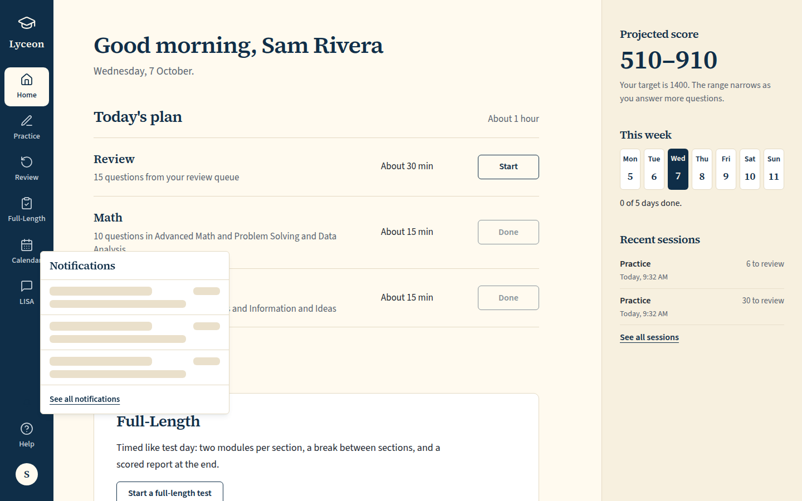 `/dashboard`, 132 KB, horizontal overflow 0px | none |
| desktop | dark | 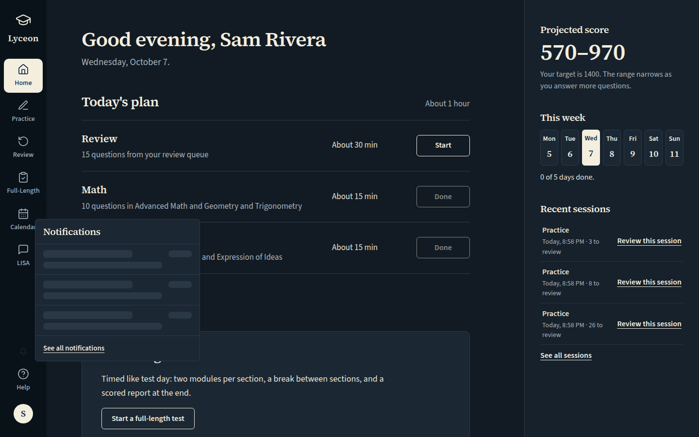 `/dashboard`, 132 KB, horizontal overflow 0px | none |
| mobile | light | 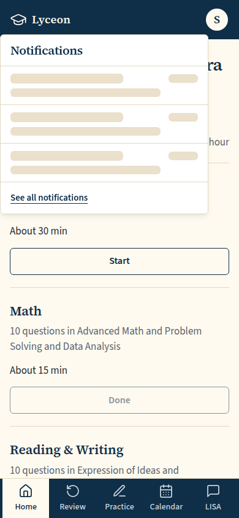 `/dashboard`, 42 KB, horizontal overflow 0px | none |
| mobile | dark | 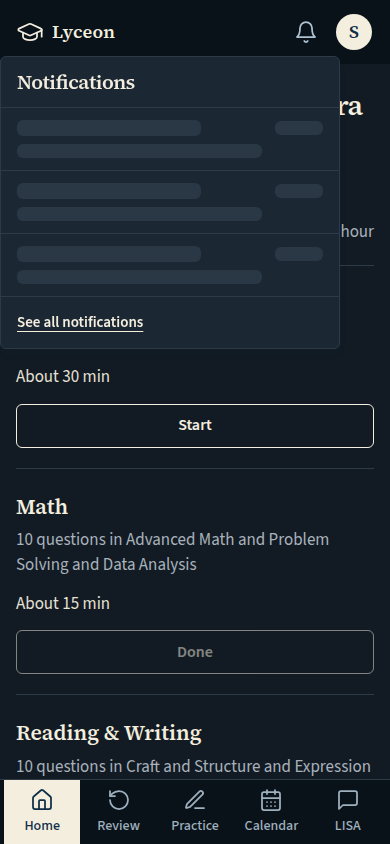 `/dashboard`, 41 KB, horizontal overflow 0px | none |

## QA 12/13: the notifications popover open with its items, on the student tokens, light and dark

Persona: `paid`. Route: `/dashboard`.
Step: click `{"desktop":"[data-testid=\"button-notifications\"]","mobile":"[data-testid=\"button-notifications\"]"}`.
Must then show `[data-testid="notification-feed"] li` (the capture fails otherwise).
Prototype: none. The prototypes draw no bell (OQ-47 placed it after sign-off); contracts/notifications.contract.md §3.

| Viewport | Theme (as rendered) | Built | Prototype |
|---|---|---|---|
| desktop | light | 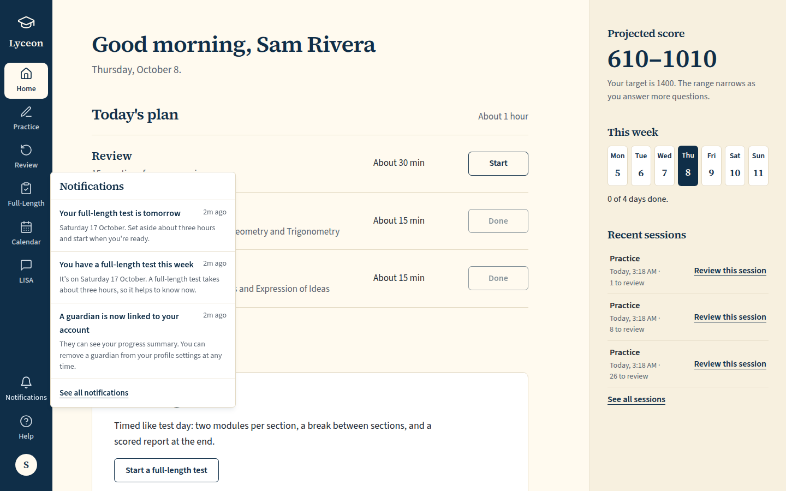 `/dashboard`, 155 KB, horizontal overflow 0px | none |
| desktop | dark | 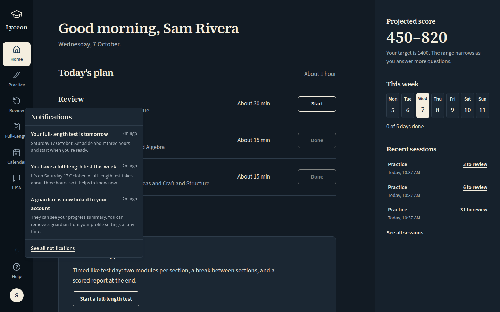 `/dashboard`, 156 KB, horizontal overflow 0px | none |
| mobile | light | 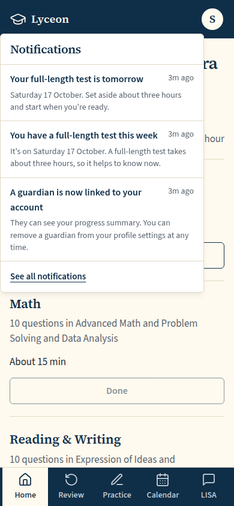 `/dashboard`, 66 KB, horizontal overflow 0px | none |
| mobile | dark | 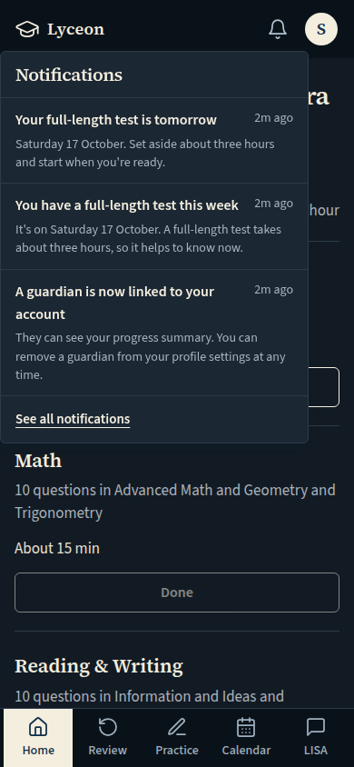 `/dashboard`, 66 KB, horizontal overflow 0px | none |

## QA 5/12: Home → 'See every skill' with the Mastery page's code chunk held: what shows while the route loads

Persona: `paid`. Route: `/dashboard`.
Step: click `{"desktop":"[data-testid=\"home-mastery\"] a[href=\"/mastery\"]","mobile":"[data-testid=\"home-mastery\"] a[href=\"/mastery\"]"}`.
Held: the browser's `GET ^/assets/mastery-[A-Za-z0-9_-]{8}\.js$` is left unanswered through the screenshot, then aborted (it never reaches the server).
Prototype: none. A loading state; the prototypes draw none.

| Viewport | Theme (as rendered) | Built | Prototype |
|---|---|---|---|
| desktop | light | 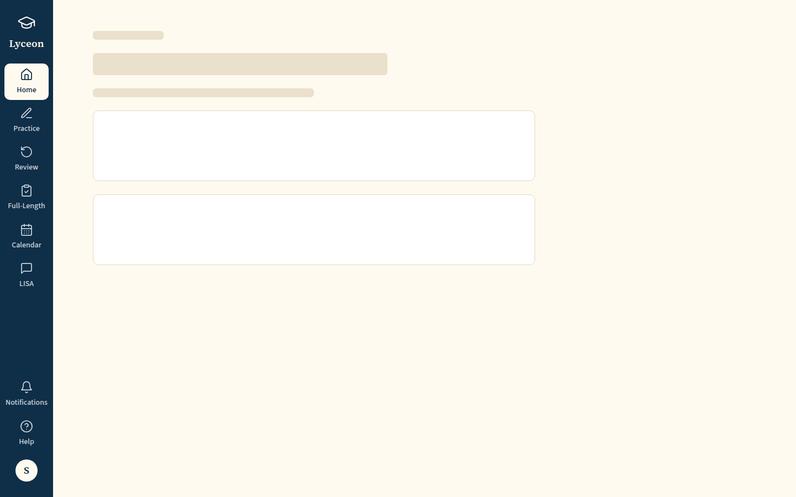 `/mastery`, 24 KB, horizontal overflow 0px | none |
| desktop | dark |  `/mastery`, 24 KB, horizontal overflow 0px | none |
| mobile | light |  `/mastery`, 14 KB, horizontal overflow 0px | none |
| mobile | dark | 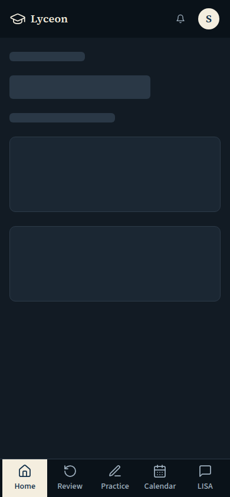 `/mastery`, 14 KB, horizontal overflow 0px | none |

## QA 5/12: /mastery opened cold (a reload) with its code chunk held: the first paint while the route loads

Persona: `paid`. Route: `/mastery`.
Held: the browser's `GET ^/assets/mastery-[A-Za-z0-9_-]{8}\.js$` is left unanswered through the screenshot, then aborted (it never reaches the server).
Prototype: none. A loading state; the prototypes draw none.

| Viewport | Theme (as rendered) | Built | Prototype |
|---|---|---|---|
| desktop | light |  `/mastery`, 24 KB, horizontal overflow 0px | none |
| desktop | dark | 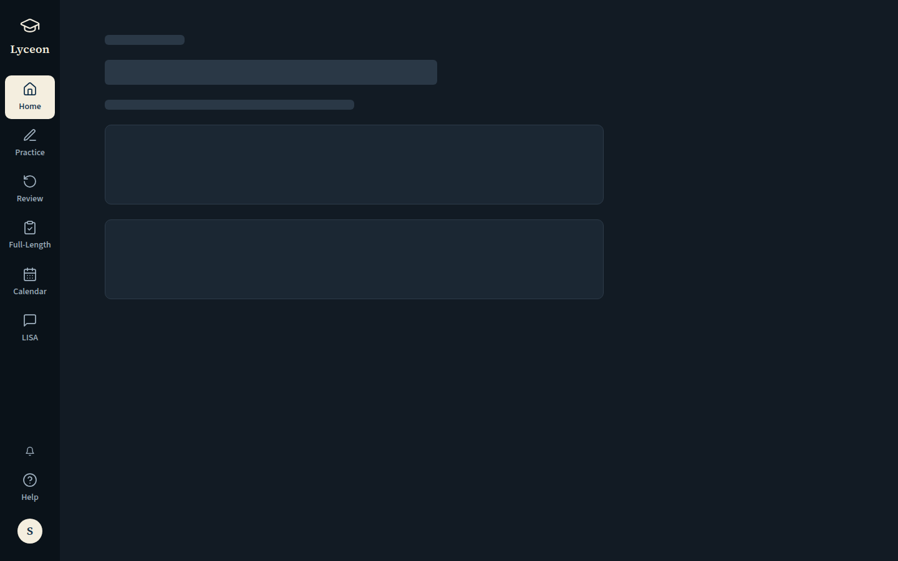 `/mastery`, 24 KB, horizontal overflow 0px | none |
| mobile | light | 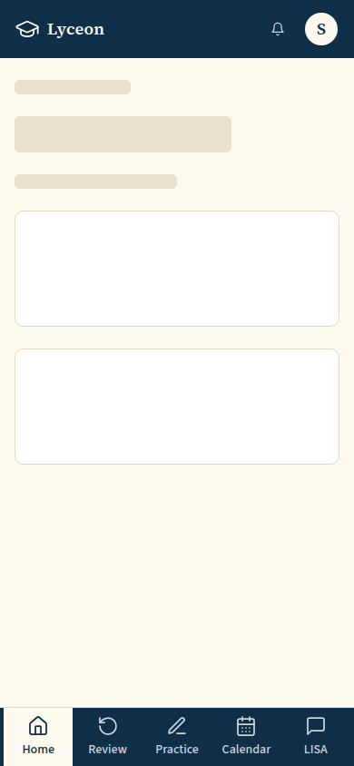 `/mastery`, 14 KB, horizontal overflow 0px | none |
| mobile | dark |  `/mastery`, 14 KB, horizontal overflow 0px | none |

## QA 2: the Math reference sheet opened from the practice runner (30-60-90 and 45-45-90 figures)

Persona: `paid`. Route: `/practice/session/{session}`.
Preset localStorage: `{"lyceon_client_instance_id":"student-harness-seed"}`.
Fresh session per capture (real create route, ended after the shot): `practice {"sections":["M"],"target_question_count":10}`.
Step: click `{"desktop":"button[aria-label=\"Reference\"]","mobile":"button[aria-label=\"Reference\"]"}`.
Must then show `[data-testid="math-reference-sheet"]` (the capture fails otherwise).
Prototype: none. Runner.dc.html has a Reference button but no sheet; the figures follow the College Board SAT reference sheet.

| Viewport | Theme (as rendered) | Built | Prototype |
|---|---|---|---|
| desktop | light | 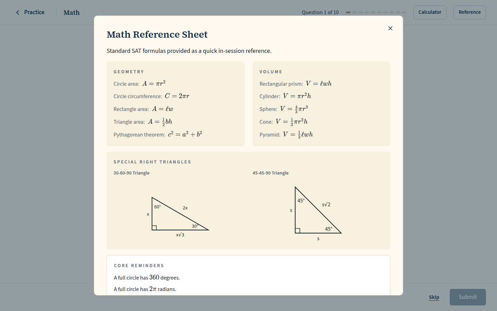 `/practice/session/ce78a867-7722-4d7e-bddd-6fd9c8b8736b`, 78 KB, horizontal overflow 0px | none |
| desktop | dark | 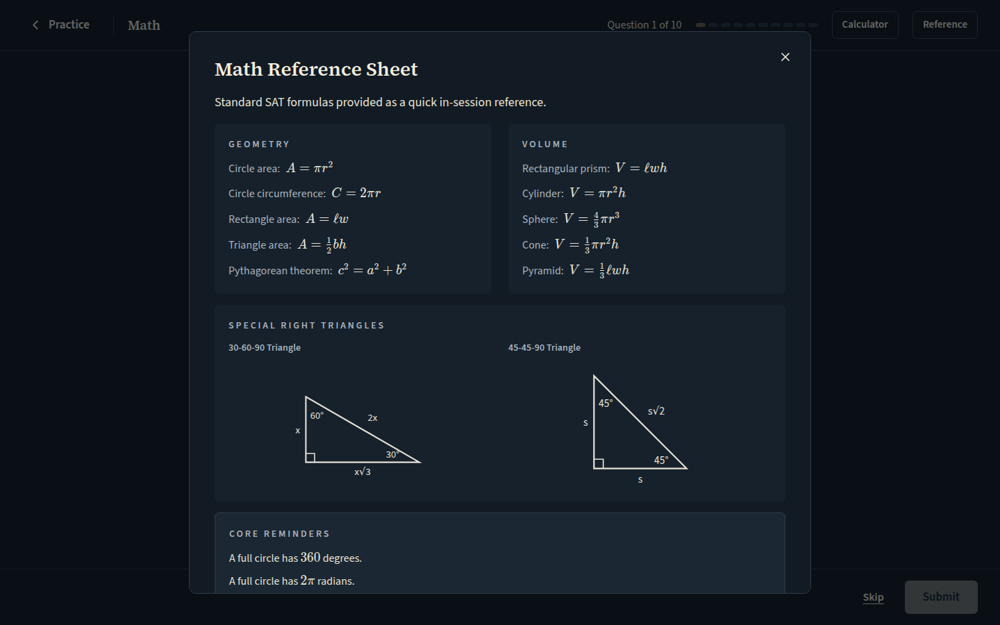 `/practice/session/8b43119c-b3cb-4300-aab8-44a66aef95c9`, 79 KB, horizontal overflow 0px | none |
| mobile | light | 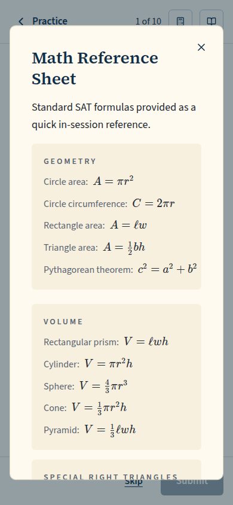 `/practice/session/86a1e80d-0fa6-4de7-8ba5-a5794ae6ce08`, 53 KB, horizontal overflow 0px | none |
| mobile | dark | 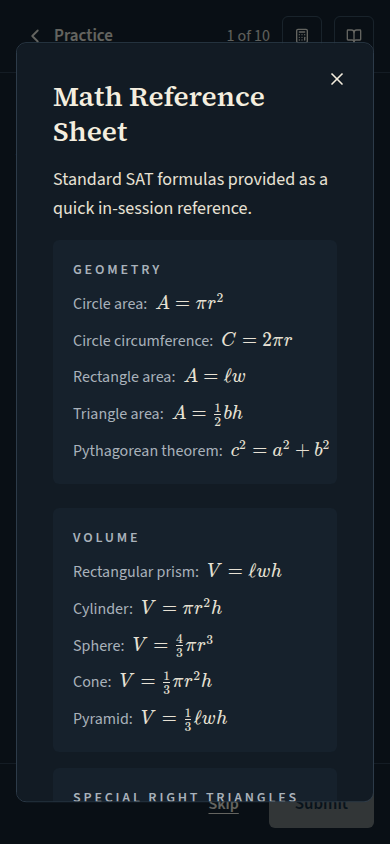 `/practice/session/f1c4bf75-76f8-4eb2-ba81-55754fafdce5`, 53 KB, horizontal overflow 0px | none |

## QA 12: the calculator panel in the practice runner, Scientific selected (our mode switch around Desmos; Desmos itself is not loaded in the local-only harness)

Persona: `paid`. Route: `/practice/session/{session}`.
Preset localStorage: `{"lyceon_client_instance_id":"student-harness-seed"}`.
Fresh session per capture (real create route, ended after the shot): `practice {"sections":["M"],"target_question_count":10}`.
Step: click `{"desktop":"button[aria-label=\"Calculator\"]","mobile":"button[aria-label=\"Calculator\"]"}`.
Step: click `{"desktop":"[data-testid=\"desmos-mode-scientific\"]","mobile":"[data-testid=\"desmos-mode-scientific\"]"}`.
Prototype: none. Runner.dc.html draws no calculator panel.

| Viewport | Theme (as rendered) | Built | Prototype |
|---|---|---|---|
| desktop | light | 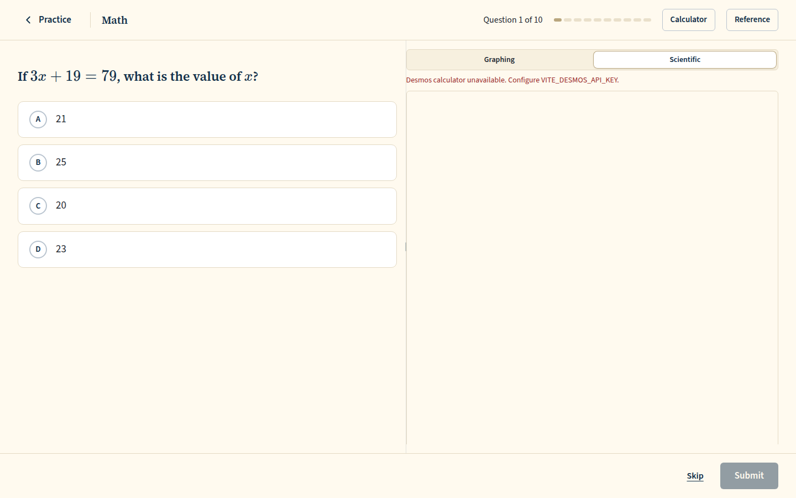 `/practice/session/3ef0e7c4-65f6-4535-8403-aa78652ccd29`, 41 KB, horizontal overflow 0px | none |
| desktop | dark | 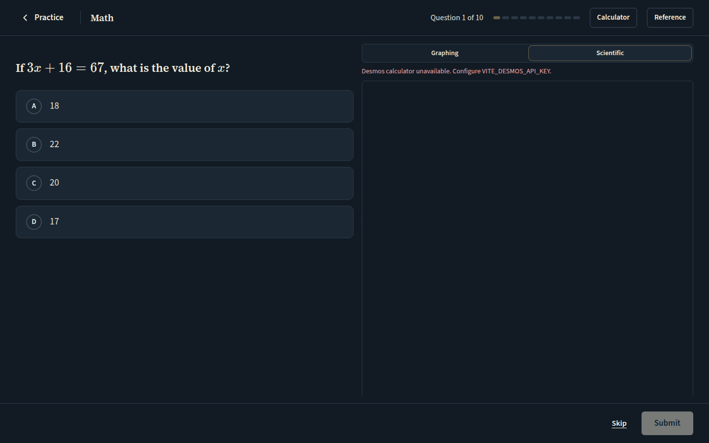 `/practice/session/270ada34-3a03-4465-8d73-055cde9d93c6`, 42 KB, horizontal overflow 0px | none |
| mobile | light | 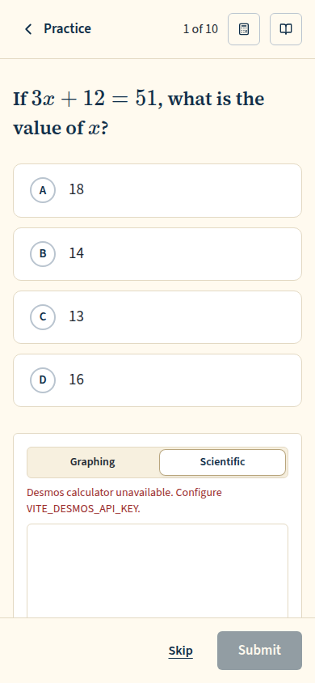 `/practice/session/a9a6cf24-f111-4873-a0f9-f72d572ae8c3`, 33 KB, horizontal overflow 0px | none |
| mobile | dark | 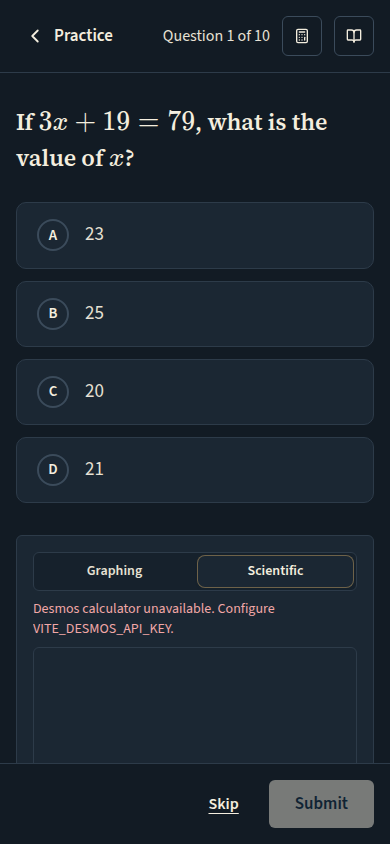 `/practice/session/dadbd9ff-82dd-440d-b696-b1e672c585a1`, 33 KB, horizontal overflow 0px | none |

## QA 12: a grid-in answered and submitted in the practice runner: the submitted answer's contrast

Persona: `paid`. Route: `/practice/session/{session}`.
Preset localStorage: `{"lyceon_client_instance_id":"student-harness-seed"}`.
Fresh session per capture (real create route, ended after the shot): `practice {"sections":["M"],"target_question_count":10}`.
Step: type `12` into `{"desktop":"input[aria-label=\"Enter your answer\"]","mobile":"input[aria-label=\"Enter your answer\"]"}`.
Step: click `{"desktop":"[data-testid=\"runner-footer\"] button:has-text(\"Submit\")","mobile":"[data-testid=\"runner-footer\"] button:has-text(\"Submit\")"}`.
Prototype: none. Runner.dc.html draws a multiple-choice item only.

| Viewport | Theme (as rendered) | Built | Prototype |
|---|---|---|---|
| desktop | light | 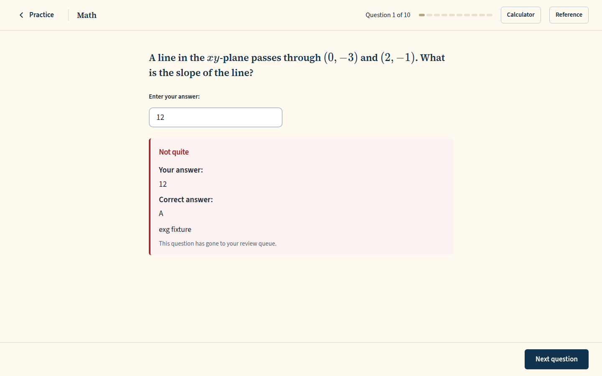 `/practice/session/78814f3e-7b2d-4d94-a088-ec17286ca591`, 49 KB, horizontal overflow 0px | none |
| desktop | dark | 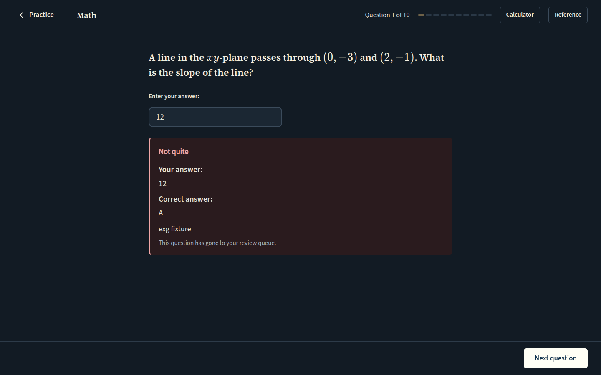 `/practice/session/49273d46-125f-48d6-9930-aa71b76705cf`, 50 KB, horizontal overflow 0px | none |
| mobile | light | 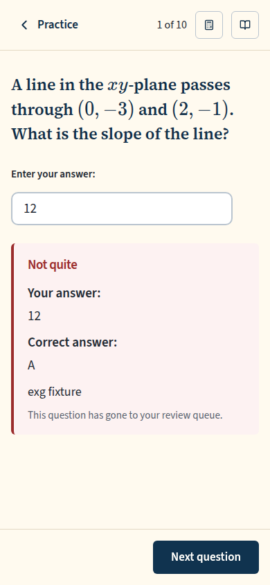 `/practice/session/c3dff956-2f9b-4fc1-bc64-4a2e3e95a7a7`, 41 KB, horizontal overflow 0px | none |
| mobile | dark | 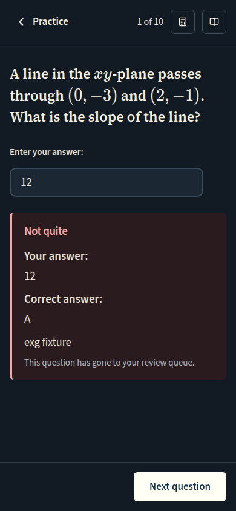 `/practice/session/622b0188-f341-41fa-8a0d-033b7fff4063`, 42 KB, horizontal overflow 0px | none |

## Run facts

- Seeded ids: `{"free":{"completedPracticeSessionId":"a0fdc7ca-3978-47b3-92a9-f978784b50b2","openPracticeSessionId":"3d96087e-766b-4045-a4bd-fb798c96dd17","openReviewSessionId":null,"diagnosticSessionId":null,"scoredExamSessionId":null,"inProgressExamSessionId":null,"lisaConversationId":null,"answered":13},"paid":{"completedPracticeSessionId":"089a4dc7-d536-46a5-a6fb-dbae0e04acdd","openPracticeSessionId":"06d23ed4-b23e-4b5b-bbd6-b49a57cc2874","openReviewSessionId":null,"diagnosticSessionId":"67b0dbb5-b9b3-4805-8036-9cbe715d8d9a","scoredExamSessionId":null,"inProgressExamSessionId":null,"lisaConversationId":null,"answered":53}}`
- Endpoints the pages asked for that the harness does not serve (answered 404): none
- Desmos (QA2-B, opt-in `STUDENT_HARNESS_DESMOS=1`): not loaded (a local-only run; the calculator shows its unavailable line)
- External hosts blocked: none
