# UI-50 Home (/dashboard): free and paid, light and dark, 1440 and 390

Generated 2026-10-05T11:36:17.218Z by `pnpm exec tsx tests/e2e/student-harness/capture.ts UI-50` (see `tests/e2e/student-harness/README.md`). Built = a production build of the real client (`vite preview`, or the dev server with STUDENT_HARNESS_CLIENT=dev) against the student harness (real routers over a local Postgres built from this repo's migrations; personas seeded through the real practice routes). Prototype = the signed-off `docs/plans/student-ui/design/prototype/*.dc.html`, rendered locally.

Conditions, read before comparing:
- Viewport screenshots (not full page) unless the shot says full page: desktop 1440x900, phone 390x844, and any extra size a shot names.
- The prototypes are a fixed 1440x900 canvas with no phone layout; phone rows show the desktop prototype.
- Dark is requested through the app's own per-device setting; the theme column records what the page rendered.
- No external requests: the built app's Google Fonts (Inter, Poppins) are blocked, so legacy page bodies fall back to system faces; Source Sans 3 / Source Serif 4 are self-hosted and load for both sides.
- Prototype data is illustrative; built data is the seeded personas' real payloads.

## Home, free (diagnostic not taken): diagnostic card, How Lyceon works; panel: projection empty state, locked mastery, today's quota

Persona: `free`. Route: `/dashboard`.
Prototype: `Main.dc.html` (Home, plan = free).

| Viewport | Theme (as rendered) | Built | Prototype |
|---|---|---|---|
| desktop | light | 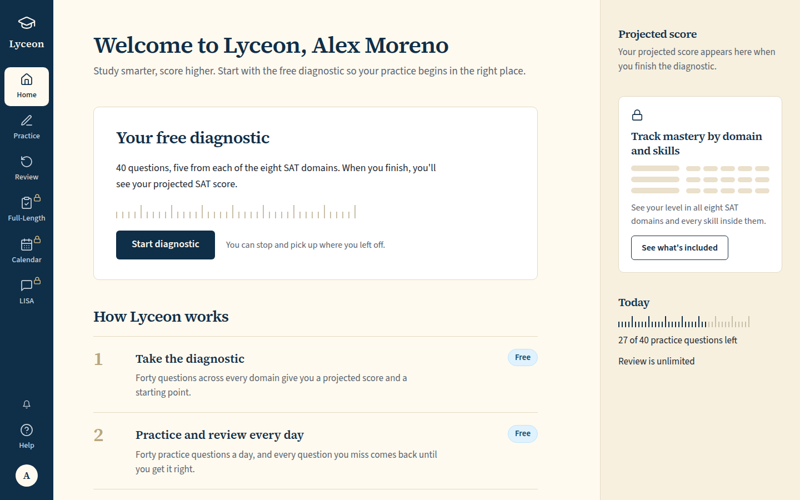 `/dashboard`, 140 KB, horizontal overflow 0px | , 141 KB |
| desktop | dark |  `/dashboard`, 140 KB, horizontal overflow 0px | , 142 KB |
| mobile | light |  `/dashboard`, 62 KB, horizontal overflow 0px |  desktop prototype (no phone layout), 141 KB |
| mobile | dark |  `/dashboard`, 63 KB, horizontal overflow 0px |  desktop prototype (no phone layout), 142 KB |

## Home, paid (diagnostic taken, calendar set up): today's plan, mastery, pick up; panel: projection, this week, recent sessions

Persona: `paid`. Route: `/dashboard`.
Prototype: `Main.dc.html` (Home, plan = paid).

| Viewport | Theme (as rendered) | Built | Prototype |
|---|---|---|---|
| desktop | light | 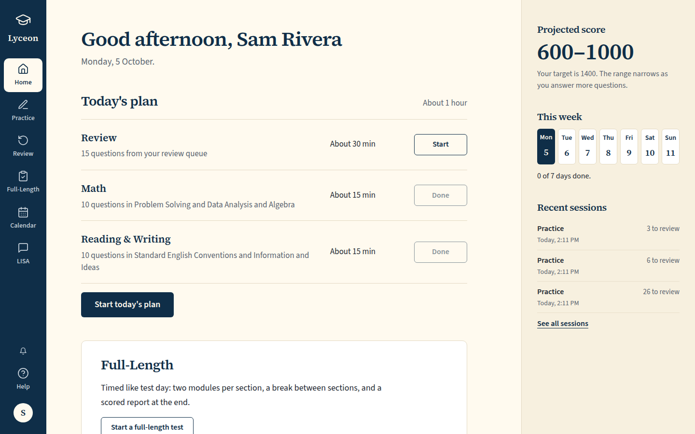 `/dashboard`, 131 KB, horizontal overflow 0px | , 147 KB |
| desktop | dark | 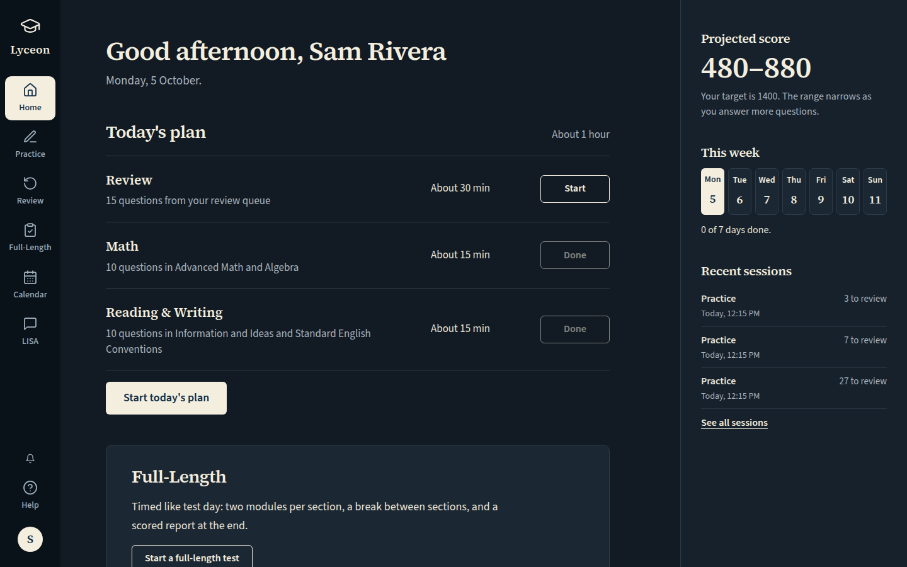 `/dashboard`, 132 KB, horizontal overflow 0px | , 147 KB |
| mobile | light |  `/dashboard`, 54 KB, horizontal overflow 0px |  desktop prototype (no phone layout), 147 KB |
| mobile | dark |  `/dashboard`, 54 KB, horizontal overflow 0px |  desktop prototype (no phone layout), 147 KB |

## Home, paid, full page (on a phone the right panel stacks under the main column; the footer ends the column)

Persona: `paid`. Route: `/dashboard`.
Full page: the whole document, not just the viewport.
Prototype: `Main.dc.html` (Home, plan = paid (the canvas is a fixed 1440x900)).

| Viewport | Theme (as rendered) | Built | Prototype |
|---|---|---|---|
| desktop | light | 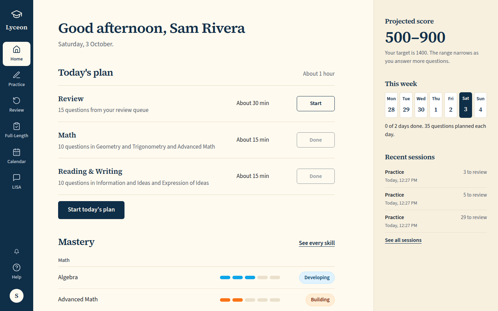 `/dashboard`, 131 KB, horizontal overflow 0px | , 147 KB |
| desktop | dark | 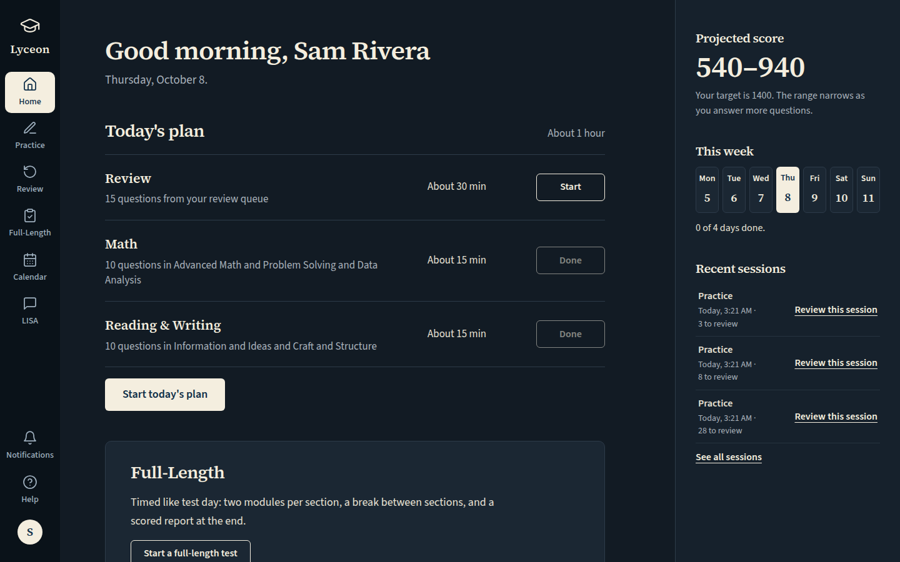 `/dashboard`, 132 KB, horizontal overflow 0px | , 147 KB |
| mobile | light |  `/dashboard`, 192 KB, horizontal overflow 0px |  desktop prototype (no phone layout), 147 KB |
| mobile | dark |  `/dashboard`, 196 KB, horizontal overflow 0px |  desktop prototype (no phone layout), 147 KB |

## Home, free, full page (on a phone the right panel stacks under the main column; the footer ends the column)

Persona: `free`. Route: `/dashboard`.
Full page: the whole document, not just the viewport.
Prototype: `Main.dc.html` (Home, plan = free (the canvas is a fixed 1440x900)).

| Viewport | Theme (as rendered) | Built | Prototype |
|---|---|---|---|
| desktop | light |  `/dashboard`, 140 KB, horizontal overflow 0px | , 141 KB |
| desktop | dark | 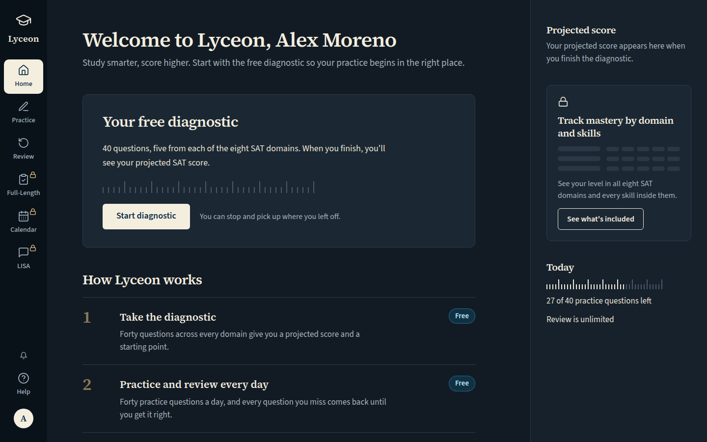 `/dashboard`, 140 KB, horizontal overflow 0px | , 142 KB |
| mobile | light |  `/dashboard`, 170 KB, horizontal overflow 0px |  desktop prototype (no phone layout), 141 KB |
| mobile | dark |  `/dashboard`, 172 KB, horizontal overflow 0px |  desktop prototype (no phone layout), 142 KB |

## Home, free: 'See what's included' on the locked mastery card opens the upgrade modal (mastery_detail)

Persona: `free`. Route: `/dashboard`.
Step: click `{"desktop":"[data-testid=\"locked-mastery-see-included\"]","mobile":"[data-testid=\"locked-mastery-see-included\"]"}`.
Prototype: `Main.dc.html` (Home, plan = free, 'See what's included' clicked); clicked: `text=See what's included`.

| Viewport | Theme (as rendered) | Built | Prototype |
|---|---|---|---|
| desktop | light | 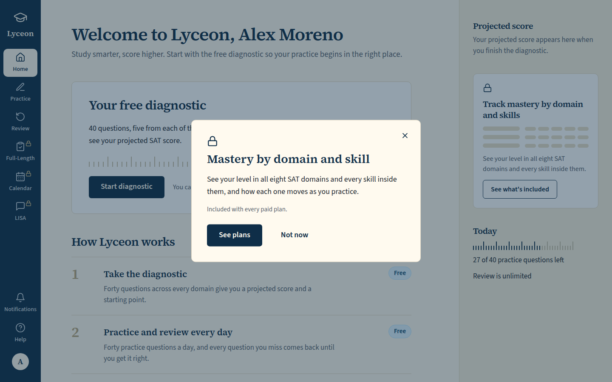 `/dashboard`, 154 KB, horizontal overflow 0px | 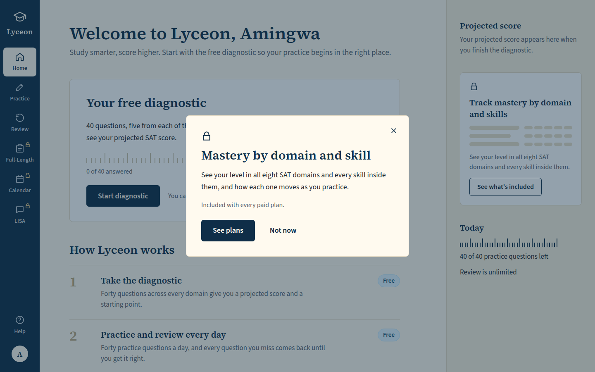, 156 KB |
| desktop | dark | 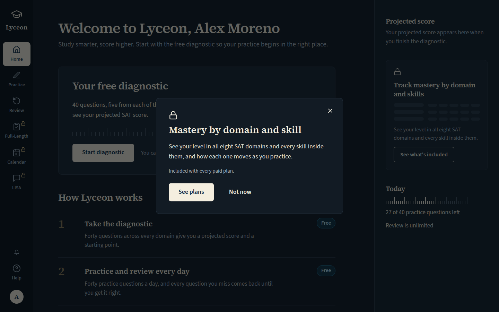 `/dashboard`, 151 KB, horizontal overflow 0px | 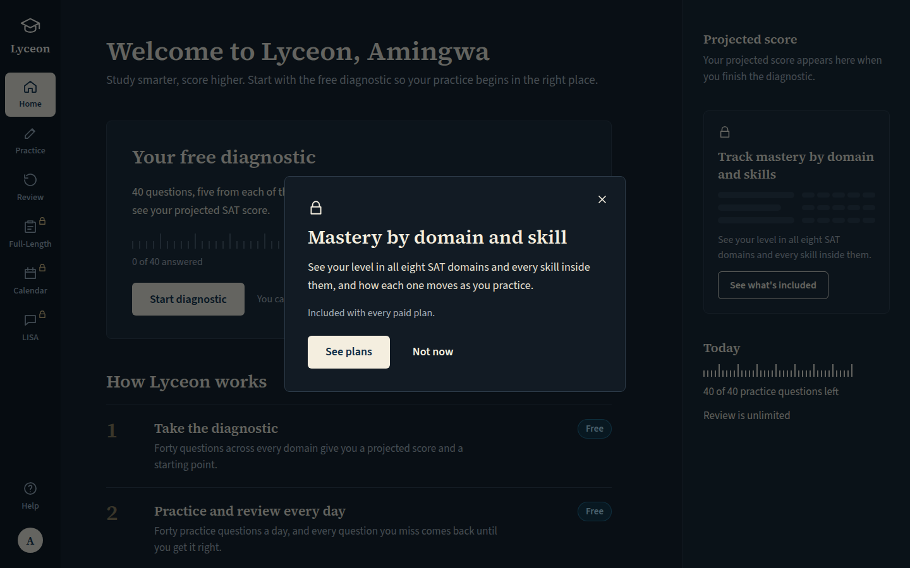, 153 KB |
| mobile | light |  `/dashboard`, 53 KB, horizontal overflow 0px |  desktop prototype (no phone layout), 156 KB |
| mobile | dark |  `/dashboard`, 53 KB, horizontal overflow 0px |  desktop prototype (no phone layout), 153 KB |

## Click path (paid): 'Start today's plan' launches today's first open block and lands in its runner

Persona: `paid`. Route: `/dashboard`.
Step: click `{"desktop":"[data-testid=\"home-start-plan\"]","mobile":"[data-testid=\"home-start-plan\"]"}`.
Click path: must land on a path matching `^/(practice|review)/session/[0-9a-f-]{36}$|^/tests/[0-9a-f-]{36}$` (the capture fails otherwise); the path it landed on is under each built shot.
Prototype: none. A click path: the screenshot is where the click landed (the runner), proven by its pathname.

| Viewport | Theme (as rendered) | Built | Prototype |
|---|---|---|---|
| desktop | light | 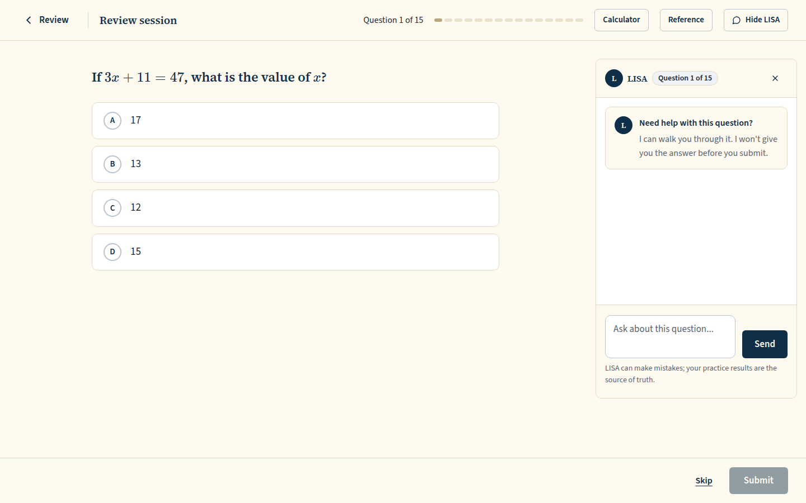 `/review/session/8f23b180-b98a-489e-bd2d-288ff7eea9c0`, 62 KB, horizontal overflow 0px | none |
| desktop | dark | 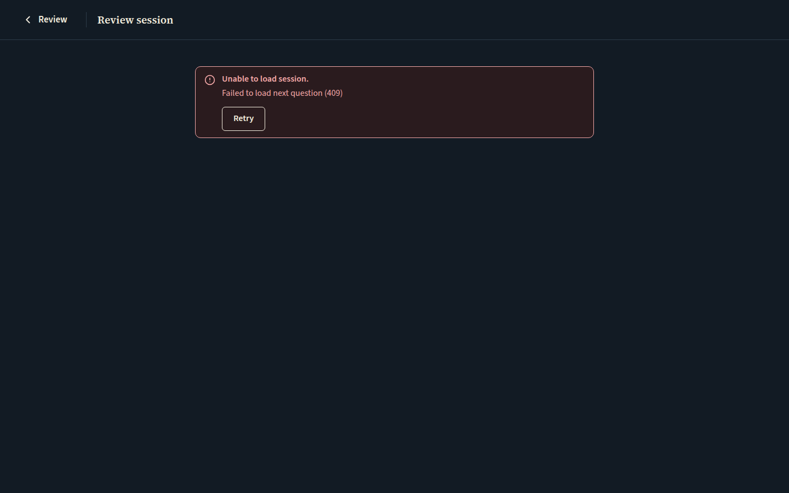 `/review/session/8f23b180-b98a-489e-bd2d-288ff7eea9c0`, 20 KB, horizontal overflow 0px | none |
| mobile | light |  `/review/session/8f23b180-b98a-489e-bd2d-288ff7eea9c0`, 13 KB, horizontal overflow 0px | none |
| mobile | dark |  `/review/session/8f23b180-b98a-489e-bd2d-288ff7eea9c0`, 13 KB, horizontal overflow 0px | none |

## Click path (paid): Home's 'Start a full-length test' card lands on the Full-Length page (owner ruling, Karl, 2026-10-05)

Persona: `paid`. Route: `/dashboard`.
Step: click `{"desktop":"[data-testid=\"home-full-length-start\"]","mobile":"[data-testid=\"home-full-length-start\"]"}`.
Click path: must land on a path matching `^/tests$` (the capture fails otherwise); the path it landed on is under each built shot.
Prototype: none. A click path: the screenshot is where the click landed (the Full-Length page; on a phone, its notice), proven by its pathname. The card is the owner ruling of 2026-10-05, not in the prototype.

| Viewport | Theme (as rendered) | Built | Prototype |
|---|---|---|---|
| desktop | light | 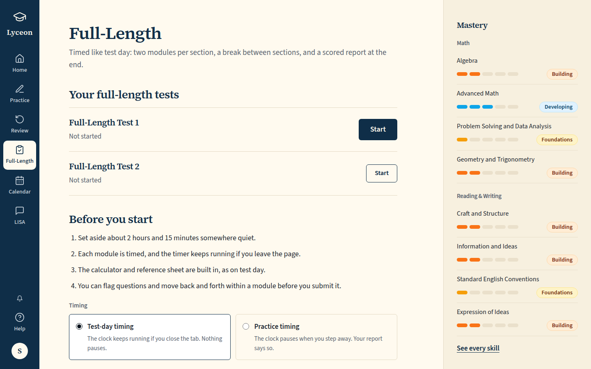 `/tests`, 140 KB, horizontal overflow 0px | none |
| desktop | dark | 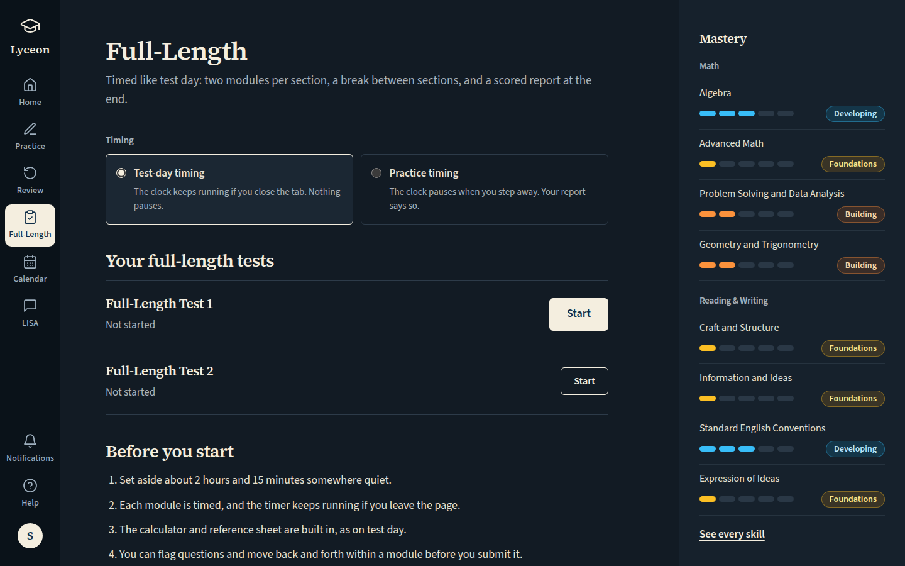 `/tests`, 143 KB, horizontal overflow 0px | none |
| mobile | light |  `/tests`, 41 KB, horizontal overflow 0px | none |
| mobile | dark |  `/tests`, 40 KB, horizontal overflow 0px | none |

## Home, free: the locked 'Start a full-length test' card opens the upgrade modal in place (exam_full_length)

Persona: `free`. Route: `/dashboard`.
Step: click `{"desktop":"[data-testid=\"home-full-length-start\"]","mobile":"[data-testid=\"home-full-length-start\"]"}`.
Must then show `[data-testid="upgrade-modal"]` (the capture fails otherwise).
Click path: must land on a path matching `^/dashboard$` (the capture fails otherwise); the path it landed on is under each built shot.
Prototype: none. The card is the owner ruling of 2026-10-05 and is not in the prototype; the modal's copy is the prototype's LYC_COPY.full (UI-41 pairs it with the rail click).

| Viewport | Theme (as rendered) | Built | Prototype |
|---|---|---|---|
| desktop | light | 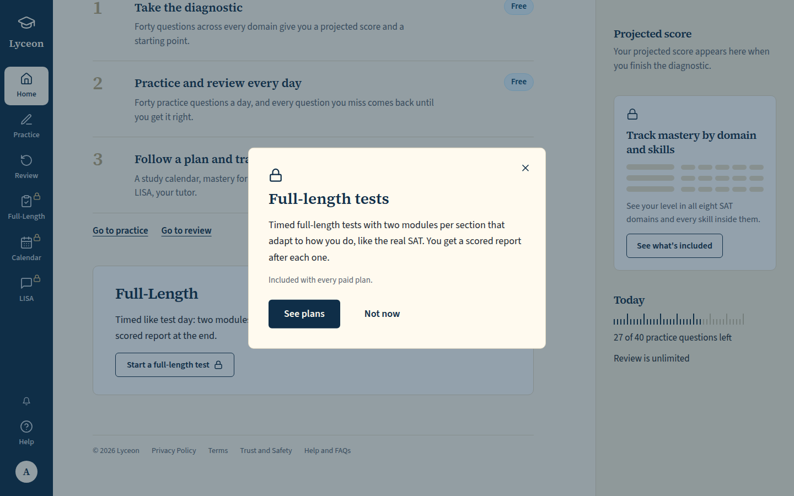 `/dashboard`, 142 KB, horizontal overflow 0px | none |
| desktop | dark | 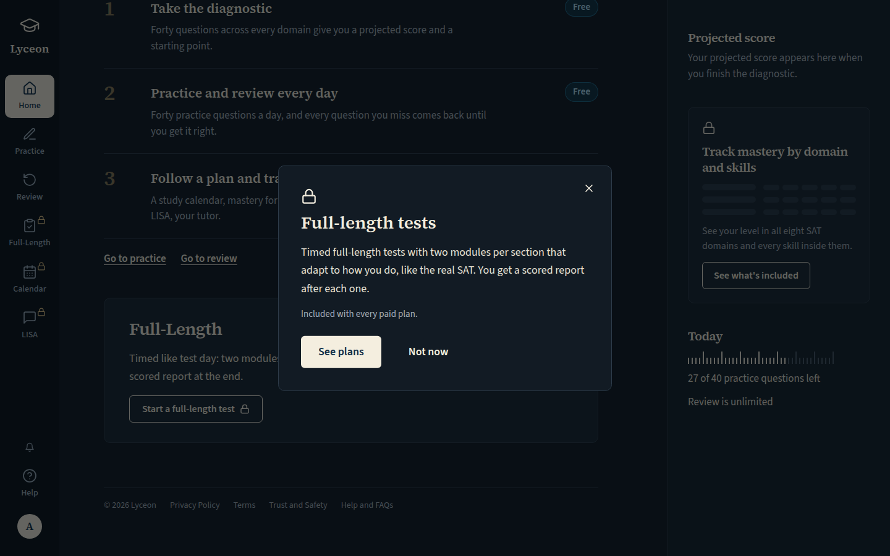 `/dashboard`, 139 KB, horizontal overflow 0px | none |
| mobile | light |  `/dashboard`, 54 KB, horizontal overflow 0px | none |
| mobile | dark |  `/dashboard`, 54 KB, horizontal overflow 0px | none |

## Click path (free): 'Start diagnostic' starts the diagnostic and lands in its runner

Persona: `free`. Route: `/dashboard`.
Step: click `{"desktop":"[data-testid=\"home-start-diagnostic\"]","mobile":"[data-testid=\"home-start-diagnostic\"]"}`.
Click path: must land on a path matching `^/practice/session/[0-9a-f-]{36}$` (the capture fails otherwise); the path it landed on is under each built shot.
Prototype: none. A click path: the screenshot is where the click landed (the diagnostic runner), proven by its pathname.

| Viewport | Theme (as rendered) | Built | Prototype |
|---|---|---|---|
| desktop | light | 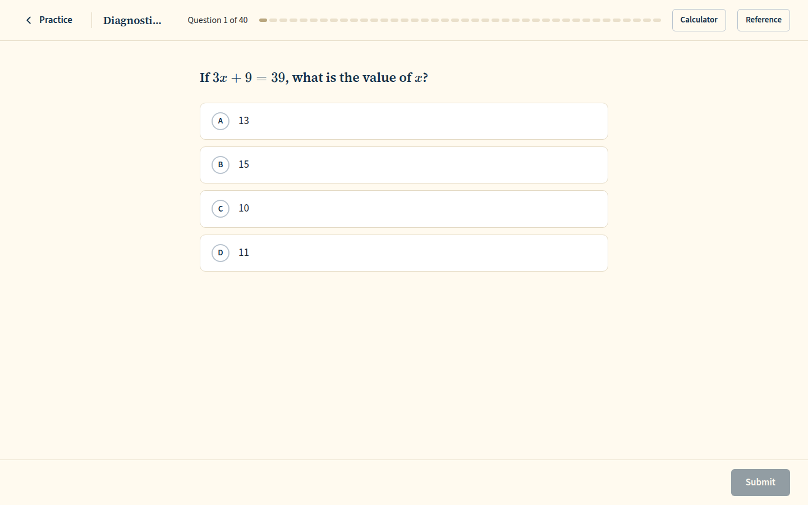 `/practice/session/c44894af-3284-463d-acea-c3e98eafa34e`, 33 KB, horizontal overflow 0px | none |
| desktop | dark | 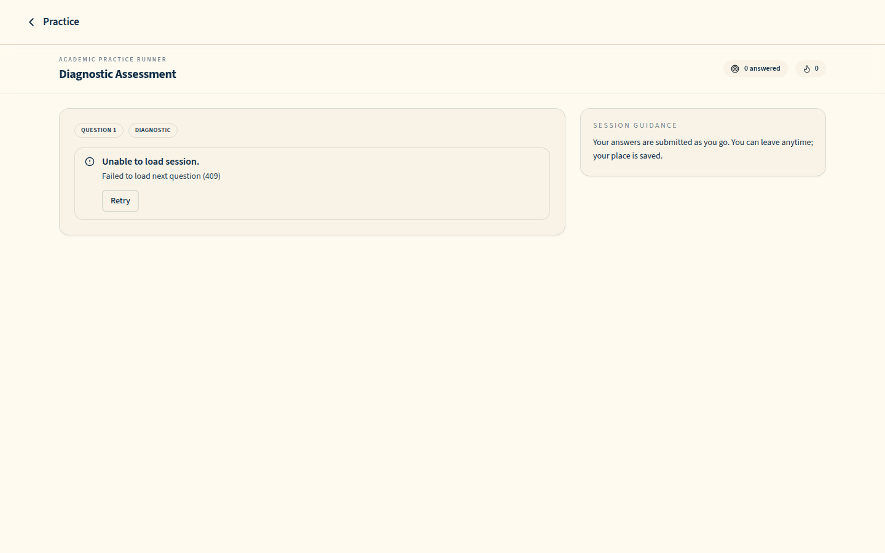 `/practice/session/c44894af-3284-463d-acea-c3e98eafa34e`, 21 KB, horizontal overflow 0px | none |
| mobile | light |  `/practice/session/c44894af-3284-463d-acea-c3e98eafa34e`, 13 KB, horizontal overflow 0px | none |
| mobile | dark |  `/practice/session/c44894af-3284-463d-acea-c3e98eafa34e`, 13 KB, horizontal overflow 0px | none |

## Run facts

- Seeded ids: `{"free":{"completedPracticeSessionId":"d26b5bf7-5f58-4bed-8d65-8be2bb374acb","openPracticeSessionId":"6c0683a6-d63c-4b6c-aeb0-3119ddfe3adb","openReviewSessionId":null,"diagnosticSessionId":null,"scoredExamSessionId":null,"inProgressExamSessionId":null,"lisaConversationId":null,"answered":13},"paid":{"completedPracticeSessionId":"326863e8-8f8b-4069-b28d-1b53fa9fd88a","openPracticeSessionId":"b7039fbd-4218-47e8-a4a3-b5e405a94c5b","openReviewSessionId":null,"diagnosticSessionId":"3c5fe4c8-bbc7-4091-9adf-e516440446ca","scoredExamSessionId":null,"inProgressExamSessionId":null,"lisaConversationId":null,"answered":53}}`
- Endpoints the pages asked for that the harness does not serve (answered 404): none
- External hosts blocked: `fonts.googleapis.com`
