# UI-51 Practice (/practice): free and paid, filters chosen, light and dark, 1440 and 390

Generated 2026-10-07T10:40:12.781Z by `pnpm exec tsx tests/e2e/student-harness/capture.ts UI-51` (see `tests/e2e/student-harness/README.md`). Built = a production build of the real client (`vite preview`, or the dev server with STUDENT_HARNESS_CLIENT=dev) against the student harness (real routers over a local Postgres built from this repo's migrations; personas seeded through the real practice routes). Prototype = the signed-off `docs/plans/student-ui/design/prototype/*.dc.html`, rendered locally.

Conditions, read before comparing:
- Viewport screenshots (not full page) unless the shot says full page: desktop 1440x900, phone 390x844, and any extra size a shot names.
- The prototypes are a fixed 1440x900 canvas with no phone layout; phone rows show the desktop prototype.
- Dark is requested through the app's own per-device setting; the theme column records what the page rendered.
- No external requests: the built app's Google Fonts (Inter, Poppins) are blocked, so legacy page bodies fall back to system faces; Source Sans 3 / Source Serif 4 are self-hosted and load for both sides.
- Prototype data is illustrative; built data is the seeded personas' real payloads.

## Practice, free: filter bar, Your session with the quota line, recent practice; panel: locked mastery, How practice counts

Persona: `free`. Route: `/practice`.
Prototype: `Practice.dc.html` (Practice, plan = free).

| Viewport | Theme (as rendered) | Built | Prototype |
|---|---|---|---|
| desktop | light | 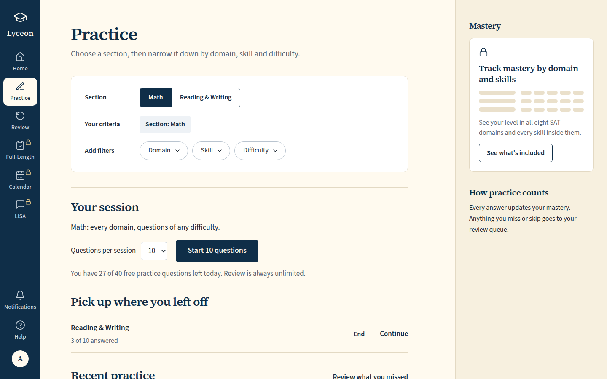 `/practice`, 122 KB, horizontal overflow 0px | 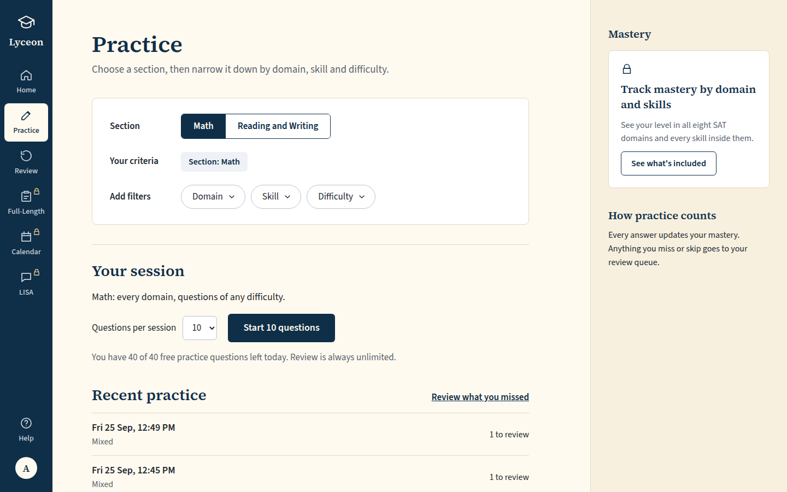, 117 KB |
| desktop | dark | 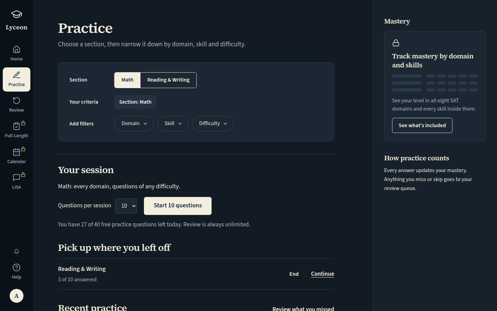 `/practice`, 124 KB, horizontal overflow 0px | 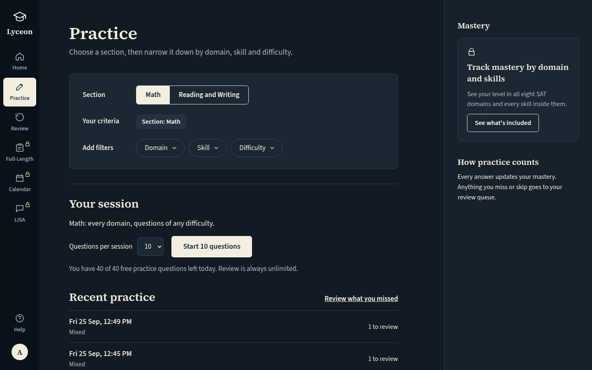, 119 KB |
| mobile | light |  `/practice`, 50 KB, horizontal overflow 0px |  desktop prototype (no phone layout), 117 KB |
| mobile | dark |  `/practice`, 50 KB, horizontal overflow 0px |  desktop prototype (no phone layout), 119 KB |

## Practice, paid: filter bar, Your session, pick up, Suggested for you, recent practice; panel: mastery rows, How practice counts

Persona: `paid`. Route: `/practice`.
Prototype: `Practice.dc.html` (Practice, plan = paid).

| Viewport | Theme (as rendered) | Built | Prototype |
|---|---|---|---|
| desktop | light |  `/practice`, 126 KB, horizontal overflow 0px | 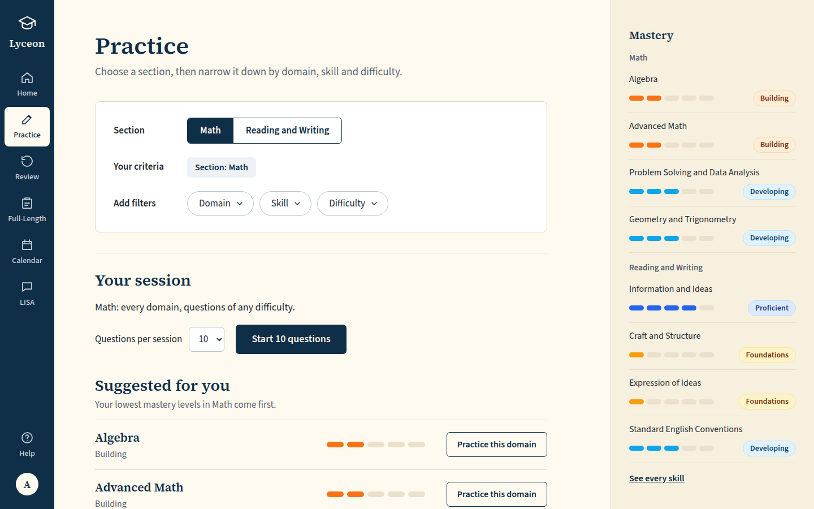, 129 KB |
| desktop | dark | 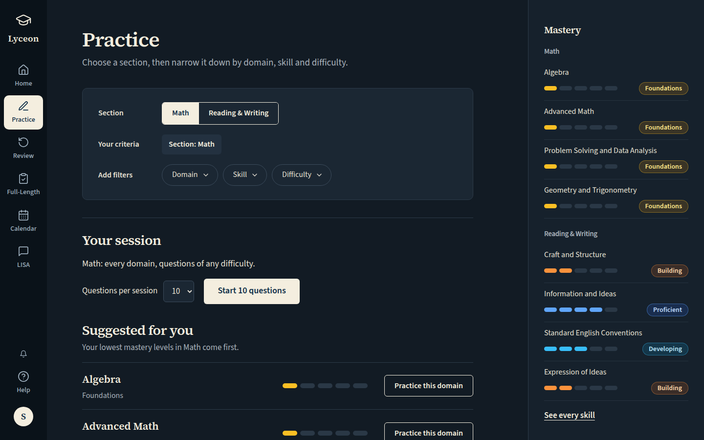 `/practice`, 128 KB, horizontal overflow 0px | 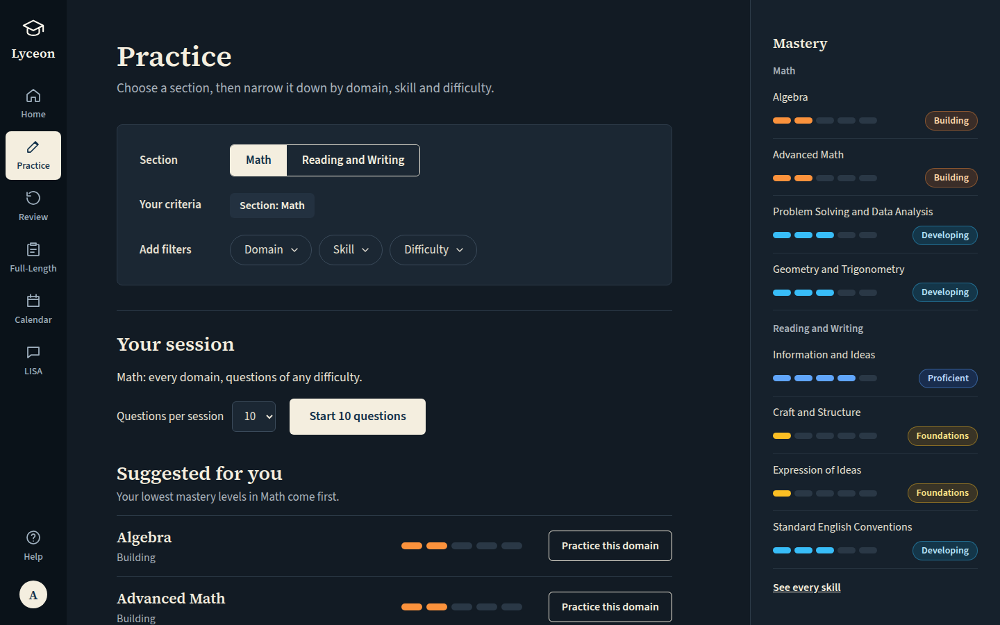, 131 KB |
| mobile | light |  `/practice`, 49 KB, horizontal overflow 0px |  desktop prototype (no phone layout), 129 KB |
| mobile | dark |  `/practice`, 50 KB, horizontal overflow 0px |  desktop prototype (no phone layout), 131 KB |

## Practice, paid, full page (on a phone the right panel stacks under the main column; the footer ends the column)

Persona: `paid`. Route: `/practice`.
Full page: the whole document, not just the viewport.
Prototype: `Practice.dc.html` (Practice, plan = paid (the canvas is a fixed 1440x900)).

| Viewport | Theme (as rendered) | Built | Prototype |
|---|---|---|---|
| desktop | light | 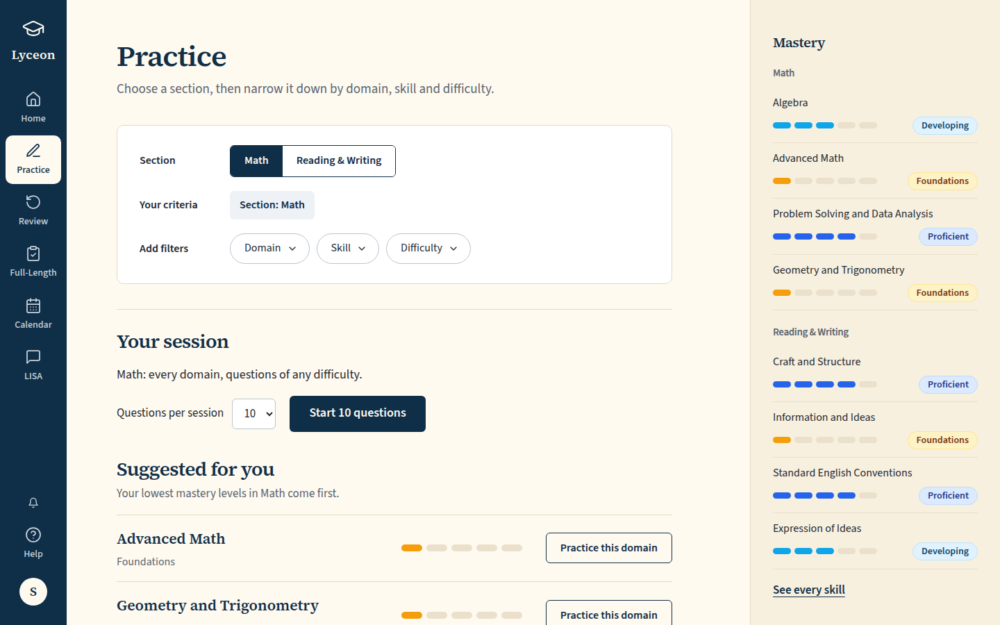 `/practice`, 126 KB, horizontal overflow 0px | , 129 KB |
| desktop | dark | 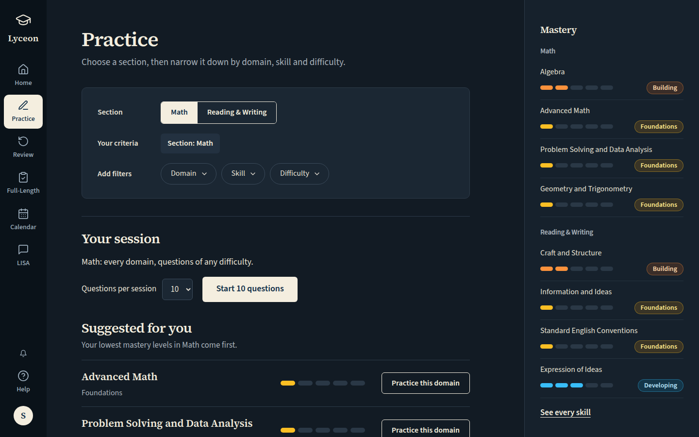 `/practice`, 128 KB, horizontal overflow 0px | , 131 KB |
| mobile | light |  `/practice`, 173 KB, horizontal overflow 0px |  desktop prototype (no phone layout), 129 KB |
| mobile | dark |  `/practice`, 176 KB, horizontal overflow 0px |  desktop prototype (no phone layout), 131 KB |

## Practice, free, full page (on a phone the right panel stacks under the main column; the footer ends the column)

Persona: `free`. Route: `/practice`.
Full page: the whole document, not just the viewport.
Prototype: `Practice.dc.html` (Practice, plan = free (the canvas is a fixed 1440x900)).

| Viewport | Theme (as rendered) | Built | Prototype |
|---|---|---|---|
| desktop | light |  `/practice`, 122 KB, horizontal overflow 0px | , 117 KB |
| desktop | dark |  `/practice`, 124 KB, horizontal overflow 0px | , 119 KB |
| mobile | light |  `/practice`, 127 KB, horizontal overflow 0px |  desktop prototype (no phone layout), 117 KB |
| mobile | dark |  `/practice`, 128 KB, horizontal overflow 0px |  desktop prototype (no phone layout), 119 KB |

## Practice, paid, with Domain: Algebra, a skill (the harness bank's one fixture skill) and Difficulty: Medium chosen through the filter bar's menus (chips and summary follow)

Persona: `paid`. Route: `/practice`.
Step: click `{"desktop":"[data-testid=\"filter-menu-domain\"]","mobile":"[data-testid=\"filter-menu-domain\"]"}`.
Step: click `{"desktop":"[role=\"menuitemcheckbox\"]:text-is(\"Algebra\")","mobile":"[role=\"menuitemcheckbox\"]:text-is(\"Algebra\")"}`.
Step: click `{"desktop":"[role=\"menuitem\"]:text-is(\"Done\")","mobile":"[role=\"menuitem\"]:text-is(\"Done\")"}`.
Step: click `{"desktop":"[data-testid=\"filter-menu-skill\"]","mobile":"[data-testid=\"filter-menu-skill\"]"}`.
Step: click `{"desktop":"[role=\"menuitemcheckbox\"]","mobile":"[role=\"menuitemcheckbox\"]"}`.
Step: click `{"desktop":"[role=\"menuitem\"]:text-is(\"Done\")","mobile":"[role=\"menuitem\"]:text-is(\"Done\")"}`.
Step: click `{"desktop":"[data-testid=\"filter-menu-difficulty\"]","mobile":"[data-testid=\"filter-menu-difficulty\"]"}`.
Step: click `{"desktop":"[role=\"menuitemcheckbox\"]:text-is(\"Medium\")","mobile":"[role=\"menuitemcheckbox\"]:text-is(\"Medium\")"}`.
Step: click `{"desktop":"[role=\"menuitem\"]:text-is(\"Done\")","mobile":"[role=\"menuitem\"]:text-is(\"Done\")"}`.
Prototype: `Practice.dc.html` (Practice, plan = paid, the same three choices clicked on the canvas); clicked: `button[aria-expanded]:has-text("Domain")`, `label:has-text("Algebra")`, `button:text-is("Done")`, `button[aria-expanded]:has-text("Skill")`, `label:has-text("Linear Functions")`, `button:text-is("Done")`, `button[aria-expanded]:has-text("Difficulty")`, `label:has-text("Medium")`, `button:text-is("Done")`.

| Viewport | Theme (as rendered) | Built | Prototype |
|---|---|---|---|
| desktop | light | 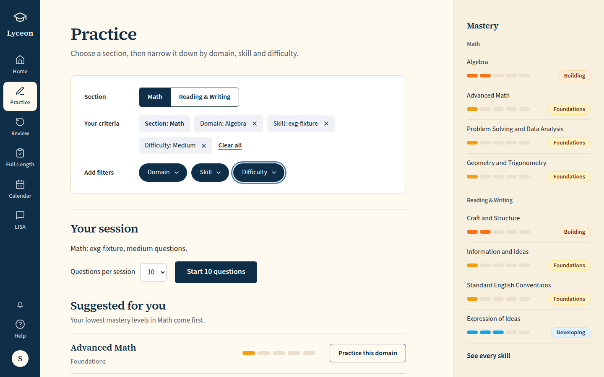 `/practice`, 128 KB, horizontal overflow 0px | 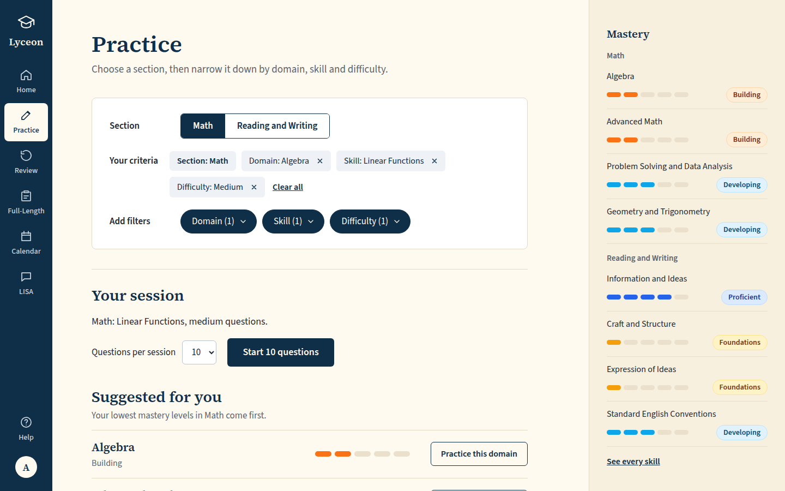, 128 KB |
| desktop | dark | 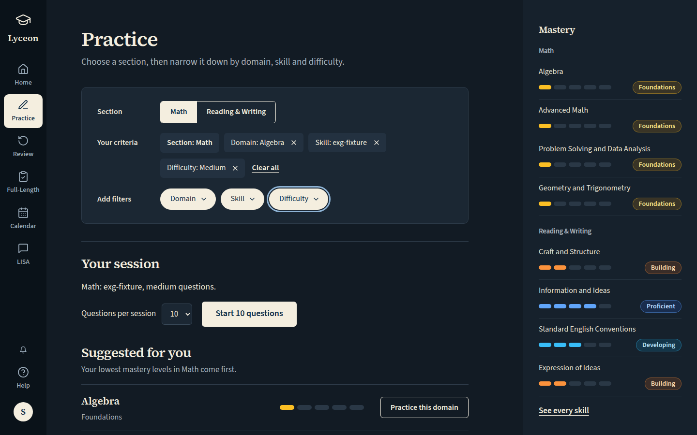 `/practice`, 130 KB, horizontal overflow 0px | 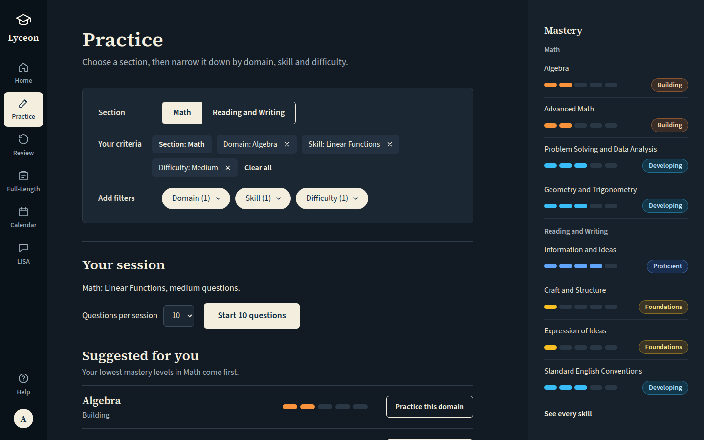, 130 KB |
| mobile | light |  `/practice`, 47 KB, horizontal overflow 0px |  desktop prototype (no phone layout), 128 KB |
| mobile | dark |  `/practice`, 47 KB, horizontal overflow 0px |  desktop prototype (no phone layout), 130 KB |

## QA item 5: Start pressed, the create held in flight: 'Starting…' with a spinner, disabled

Persona: `paid`. Route: `/practice`.
Step: click `{"desktop":"[data-testid=\"practice-start\"]","mobile":"[data-testid=\"practice-start\"]"}`.
Held: the browser's `POST /api/practice/sessions` is left unanswered through the screenshot, then aborted (it never reaches the server).
Must then show `[data-testid="practice-start"][aria-busy="true"]` (the capture fails otherwise).
Prototype: none. A pending state the prototype does not draw (owner QA list, 2026-10-07, item 5).

| Viewport | Theme (as rendered) | Built | Prototype |
|---|---|---|---|
| desktop | light | 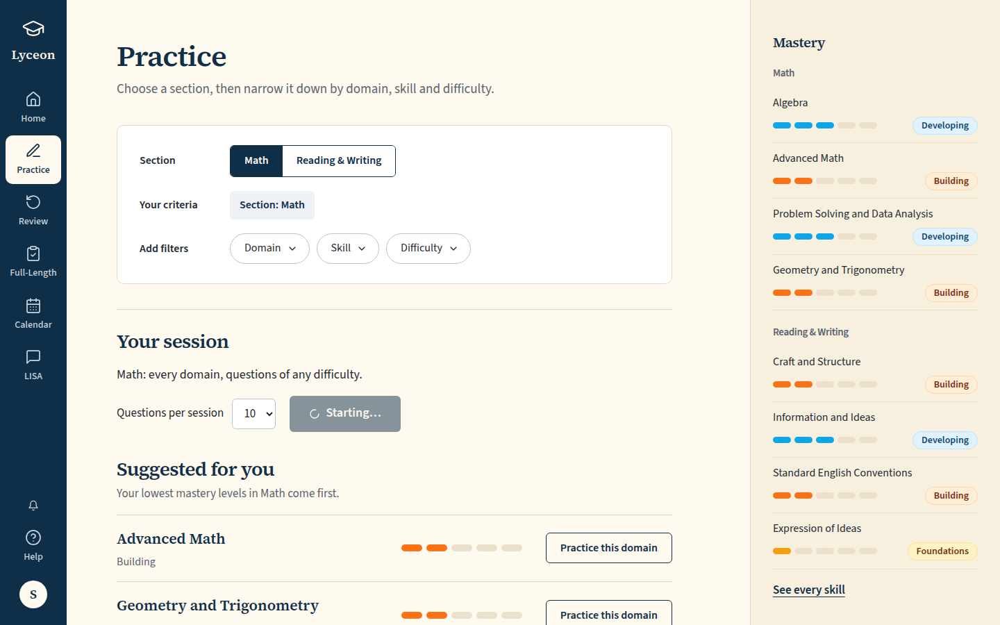 `/practice`, 125 KB, horizontal overflow 0px | none |
| desktop | dark | 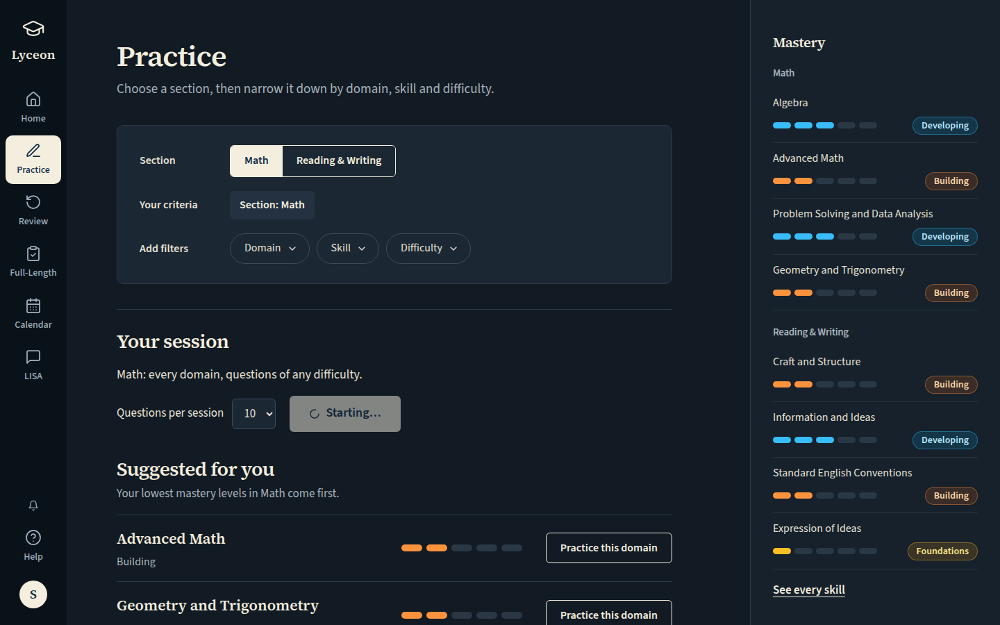 `/practice`, 127 KB, horizontal overflow 0px | none |
| mobile | light | 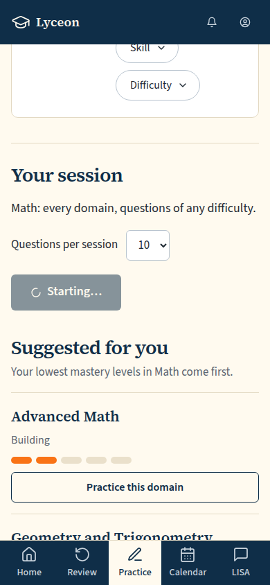 `/practice`, 47 KB, horizontal overflow 0px | none |
| mobile | dark | 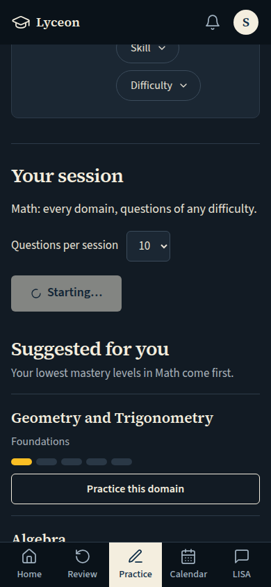 `/practice`, 48 KB, horizontal overflow 0px | none |

## Click path (paid): choose a domain, a skill and a difficulty, then Start lands in the practice runner

Persona: `paid`. Route: `/practice`.
Step: click `{"desktop":"[data-testid=\"filter-menu-domain\"]","mobile":"[data-testid=\"filter-menu-domain\"]"}`.
Step: click `{"desktop":"[role=\"menuitemcheckbox\"]:text-is(\"Algebra\")","mobile":"[role=\"menuitemcheckbox\"]:text-is(\"Algebra\")"}`.
Step: click `{"desktop":"[role=\"menuitem\"]:text-is(\"Done\")","mobile":"[role=\"menuitem\"]:text-is(\"Done\")"}`.
Step: click `{"desktop":"[data-testid=\"filter-menu-skill\"]","mobile":"[data-testid=\"filter-menu-skill\"]"}`.
Step: click `{"desktop":"[role=\"menuitemcheckbox\"]","mobile":"[role=\"menuitemcheckbox\"]"}`.
Step: click `{"desktop":"[role=\"menuitem\"]:text-is(\"Done\")","mobile":"[role=\"menuitem\"]:text-is(\"Done\")"}`.
Step: click `{"desktop":"[data-testid=\"filter-menu-difficulty\"]","mobile":"[data-testid=\"filter-menu-difficulty\"]"}`.
Step: click `{"desktop":"[role=\"menuitemcheckbox\"]:text-is(\"Medium\")","mobile":"[role=\"menuitemcheckbox\"]:text-is(\"Medium\")"}`.
Step: click `{"desktop":"[role=\"menuitem\"]:text-is(\"Done\")","mobile":"[role=\"menuitem\"]:text-is(\"Done\")"}`.
Step: click `{"desktop":"[data-testid=\"practice-start\"]","mobile":"[data-testid=\"practice-start\"]"}`.
Click path: must land on a path matching `^/practice/session/[0-9a-f-]{36}$` (the capture fails otherwise); the path it landed on is under each built shot.
Prototype: none. A click path: the screenshot is where the click landed (the runner), proven by its pathname.

| Viewport | Theme (as rendered) | Built | Prototype |
|---|---|---|---|
| desktop | light |  `/practice/session/5514ff68-ce11-47e1-ac76-a3062ccf6f83`, 40 KB, horizontal overflow 0px | none |
| desktop | dark | 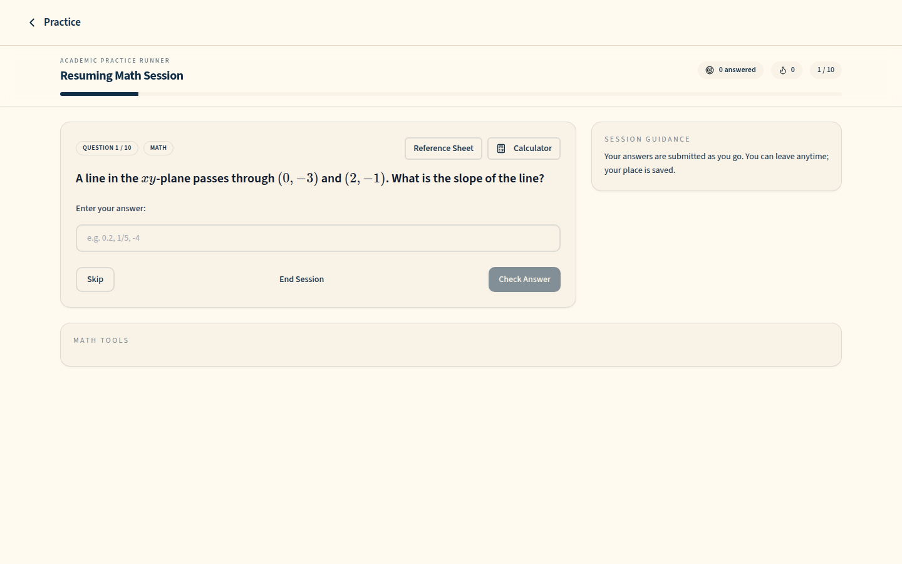 `/practice/session/15a6d973-5705-4317-9150-56266c04c71b`, 40 KB, horizontal overflow 0px | none |
| mobile | light |  `/practice/session/097eb839-d8d4-45e5-b9b2-06dcb31284bb`, 31 KB, horizontal overflow 0px | none |
| mobile | dark |  `/practice/session/dd8b63bc-f854-4710-a8bd-abe13b9b005e`, 25 KB, horizontal overflow 0px | none |

## Run facts

- Seeded ids: `{"free":{"completedPracticeSessionId":"765a255c-ae0b-4386-a045-537f9352ee06","openPracticeSessionId":"1345d180-3ce4-4bcc-9e91-4dbad121e8c0","openReviewSessionId":null,"diagnosticSessionId":null,"scoredExamSessionId":null,"inProgressExamSessionId":null,"lisaConversationId":null,"answered":13},"paid":{"completedPracticeSessionId":"4baadc1f-1dd7-42aa-a314-f080879397bc","openPracticeSessionId":"b0e0d4b8-494d-4e1d-9d27-57aa51bc382a","openReviewSessionId":null,"diagnosticSessionId":"5e5277d9-01f6-4640-9780-36d2dee31e55","scoredExamSessionId":null,"inProgressExamSessionId":null,"lisaConversationId":null,"answered":53}}`
- Endpoints the pages asked for that the harness does not serve (answered 404): none
- External hosts blocked: none
