# UI-52 Review (/review): free and paid, past sessions opened, light and dark, 1440 and 390

Generated 2026-10-07T10:37:00.758Z by `pnpm exec tsx tests/e2e/student-harness/capture.ts UI-52` (see `tests/e2e/student-harness/README.md`). Built = a production build of the real client (`vite preview`, or the dev server with STUDENT_HARNESS_CLIENT=dev) against the student harness (real routers over a local Postgres built from this repo's migrations; personas seeded through the real practice routes). Prototype = the signed-off `docs/plans/student-ui/design/prototype/*.dc.html`, rendered locally.

Conditions, read before comparing:
- Viewport screenshots (not full page) unless the shot says full page: desktop 1440x900, phone 390x844, and any extra size a shot names.
- The prototypes are a fixed 1440x900 canvas with no phone layout; phone rows show the desktop prototype.
- Dark is requested through the app's own per-device setting; the theme column records what the page rendered.
- No external requests: the built app's Google Fonts (Inter, Poppins) are blocked, so legacy page bodies fall back to system faces; Source Sans 3 / Source Serif 4 are self-hosted and load for both sides.
- Prototype data is illustrative; built data is the seeded personas' real payloads.

## Review, free: queue card, pick up where you left off, review by topic, redo a past session (collapsed); panel: what's waiting, locked mastery

Persona: `free`. Route: `/review`.
Prototype: `Review.dc.html` (Review, plan = free).

| Viewport | Theme (as rendered) | Built | Prototype |
|---|---|---|---|
| desktop | light |  `/review`, 128 KB, horizontal overflow 0px | 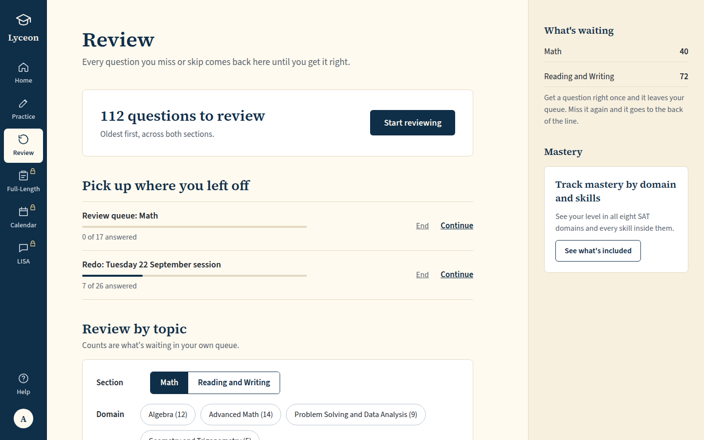, 127 KB |
| desktop | dark | 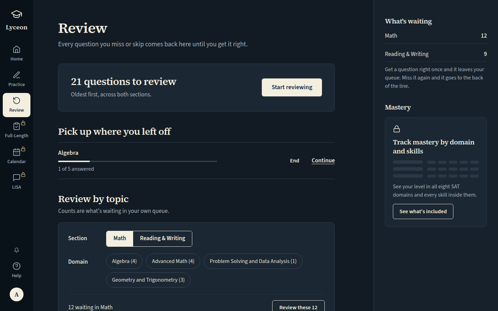 `/review`, 130 KB, horizontal overflow 0px | , 129 KB |
| mobile | light |  `/review`, 58 KB, horizontal overflow 0px |  desktop prototype (no phone layout), 127 KB |
| mobile | dark |  `/review`, 58 KB, horizontal overflow 0px |  desktop prototype (no phone layout), 129 KB |

## Review, paid: queue card, pick up where you left off, review by topic, redo a past session (collapsed); panel: what's waiting, mastery rows

Persona: `paid`. Route: `/review`.
Prototype: `Review.dc.html` (Review, plan = paid).

| Viewport | Theme (as rendered) | Built | Prototype |
|---|---|---|---|
| desktop | light | 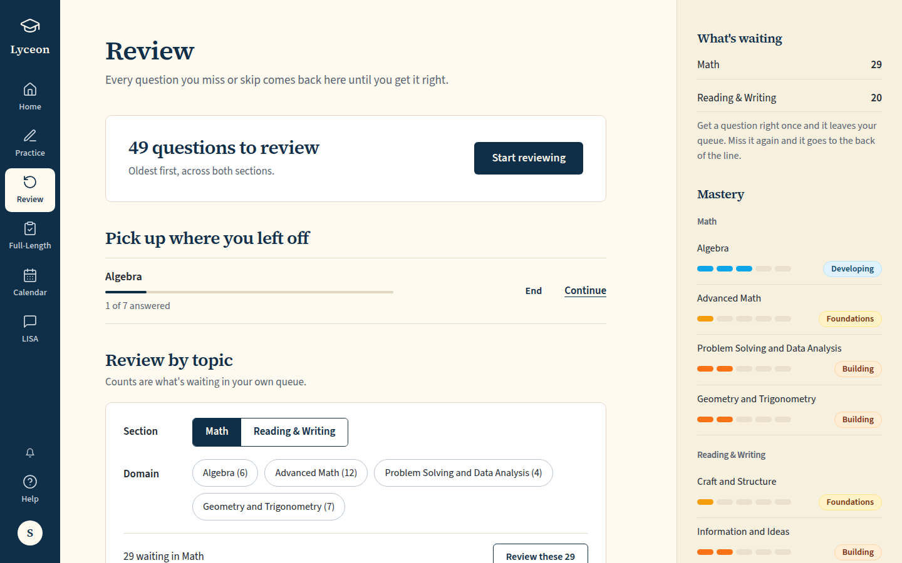 `/review`, 139 KB, horizontal overflow 0px | , 141 KB |
| desktop | dark | 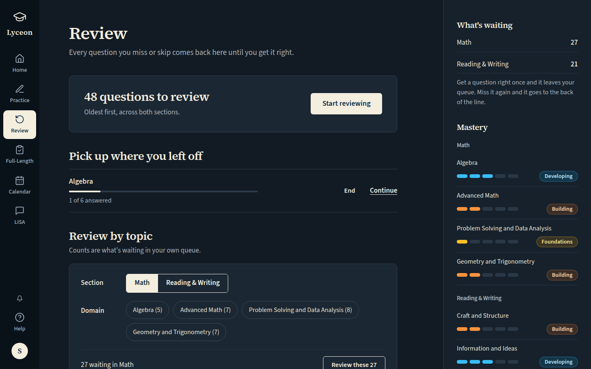 `/review`, 142 KB, horizontal overflow 0px | 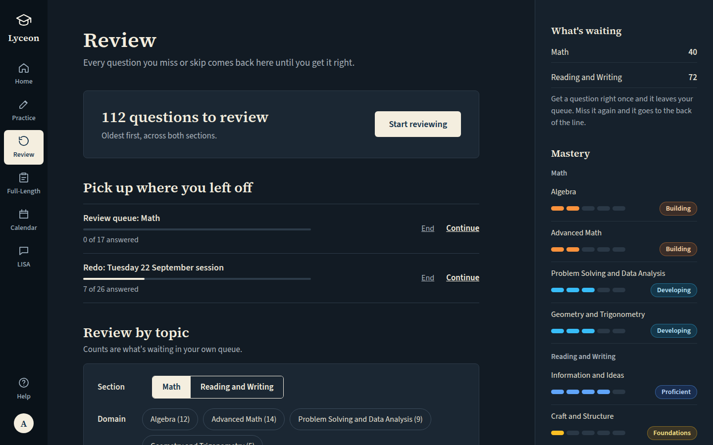, 143 KB |
| mobile | light |  `/review`, 58 KB, horizontal overflow 0px |  desktop prototype (no phone layout), 141 KB |
| mobile | dark |  `/review`, 58 KB, horizontal overflow 0px |  desktop prototype (no phone layout), 143 KB |

## Review, paid, full page (on a phone the right panel stacks under the main column; the footer ends the column)

Persona: `paid`. Route: `/review`.
Full page: the whole document, not just the viewport.
Prototype: `Review.dc.html` (Review, plan = paid (the canvas is a fixed 1440x900)).

| Viewport | Theme (as rendered) | Built | Prototype |
|---|---|---|---|
| desktop | light | 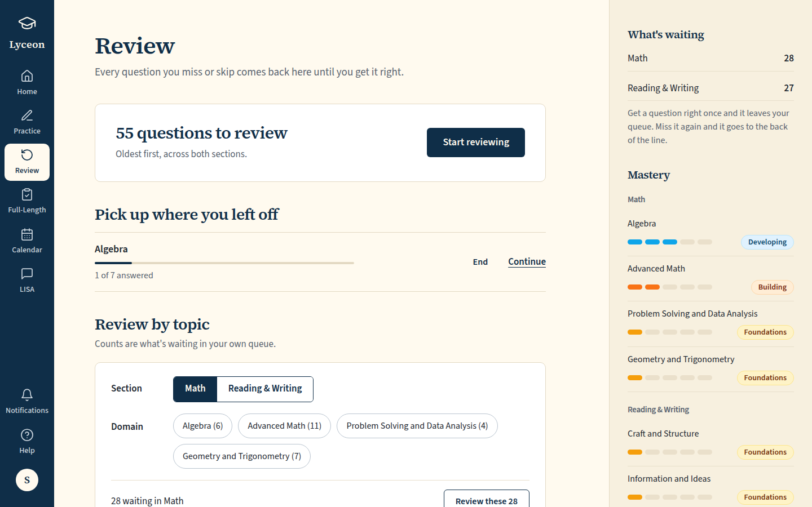 `/review`, 139 KB, horizontal overflow 0px | , 141 KB |
| desktop | dark | 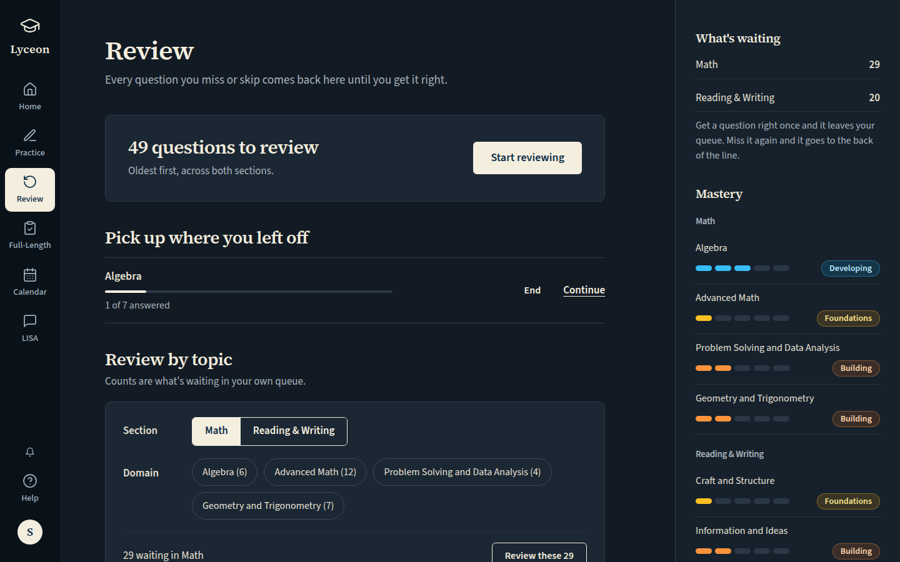 `/review`, 142 KB, horizontal overflow 0px | , 143 KB |
| mobile | light |  `/review`, 155 KB, horizontal overflow 0px |  desktop prototype (no phone layout), 141 KB |
| mobile | dark |  `/review`, 158 KB, horizontal overflow 0px |  desktop prototype (no phone layout), 143 KB |

## Review, free, full page (on a phone the right panel stacks under the main column; the footer ends the column)

Persona: `free`. Route: `/review`.
Full page: the whole document, not just the viewport.
Prototype: `Review.dc.html` (Review, plan = free (the canvas is a fixed 1440x900)).

| Viewport | Theme (as rendered) | Built | Prototype |
|---|---|---|---|
| desktop | light | 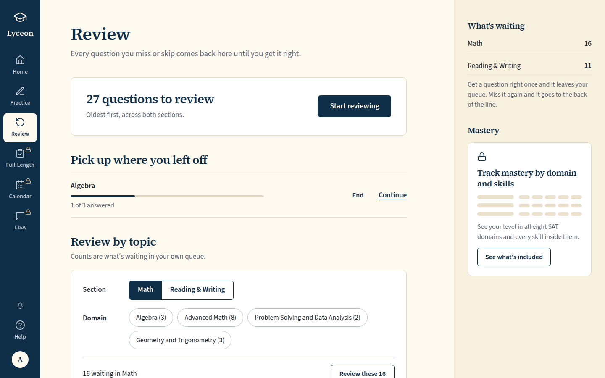 `/review`, 128 KB, horizontal overflow 0px | , 127 KB |
| desktop | dark |  `/review`, 130 KB, horizontal overflow 0px | , 129 KB |
| mobile | light |  `/review`, 131 KB, horizontal overflow 0px |  desktop prototype (no phone layout), 127 KB |
| mobile | dark |  `/review`, 132 KB, horizontal overflow 0px |  desktop prototype (no phone layout), 129 KB |

## Review, paid, 'Past sessions' opened: grouped by day, five rows, then Load more (no count, OQ-24); full page

Persona: `paid`. Route: `/review`.
Step: click `{"desktop":"[data-testid=\"review-past-toggle\"]","mobile":"[data-testid=\"review-past-toggle\"]"}`.
Full page: the whole document, not just the viewport.
Prototype: `Review.dc.html` (Review, plan = paid, 'Past sessions' clicked open on the canvas); clicked: `button[aria-controls="past-list"]`.

| Viewport | Theme (as rendered) | Built | Prototype |
|---|---|---|---|
| desktop | light | 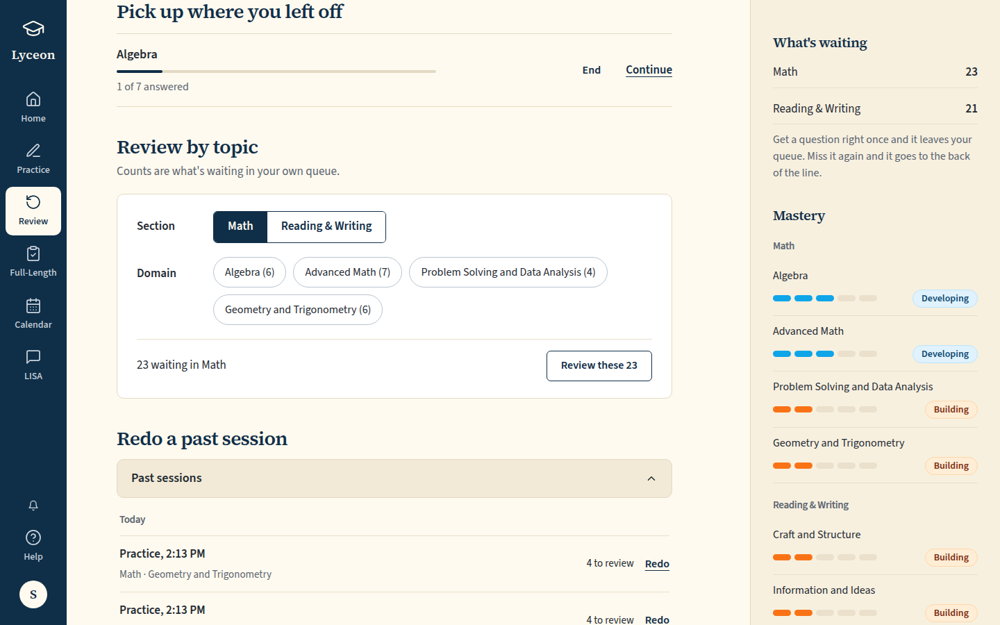 `/review`, 137 KB, horizontal overflow 0px | 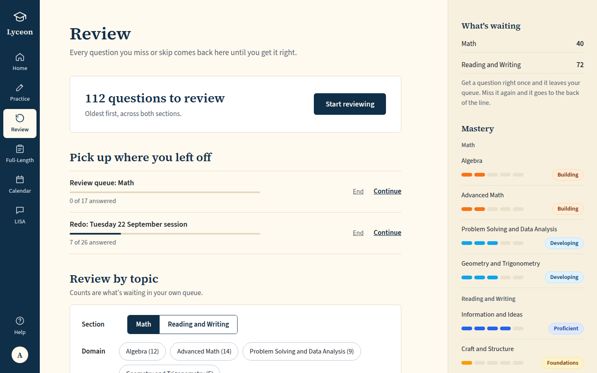, 141 KB |
| desktop | dark | 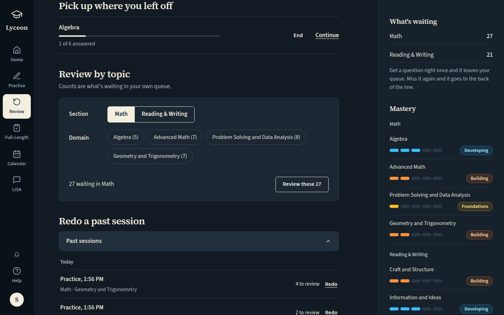 `/review`, 139 KB, horizontal overflow 0px | , 143 KB |
| mobile | light |  `/review`, 196 KB, horizontal overflow 0px |  desktop prototype (no phone layout), 141 KB |
| mobile | dark |  `/review`, 199 KB, horizontal overflow 0px |  desktop prototype (no phone layout), 143 KB |

## Review, free, 'Past sessions' opened (free has full review, SCL-110); full page

Persona: `free`. Route: `/review`.
Step: click `{"desktop":"[data-testid=\"review-past-toggle\"]","mobile":"[data-testid=\"review-past-toggle\"]"}`.
Full page: the whole document, not just the viewport.
Prototype: `Review.dc.html` (Review, plan = free, 'Past sessions' clicked open on the canvas); clicked: `button[aria-controls="past-list"]`.

| Viewport | Theme (as rendered) | Built | Prototype |
|---|---|---|---|
| desktop | light | 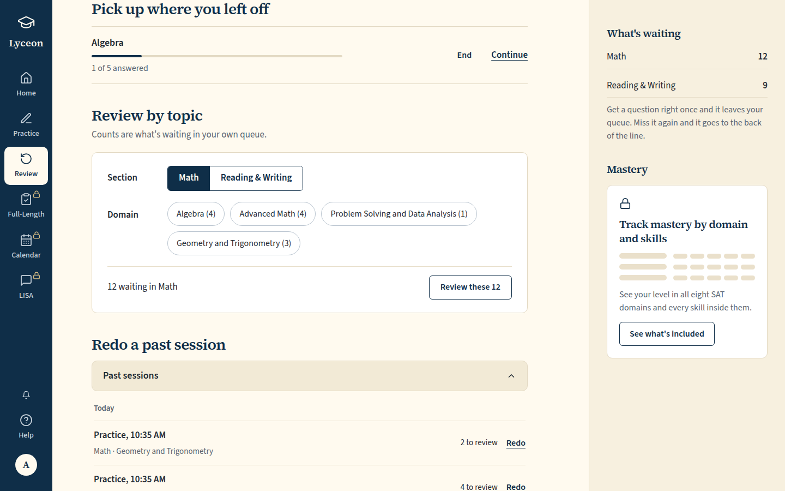 `/review`, 125 KB, horizontal overflow 0px | , 127 KB |
| desktop | dark | 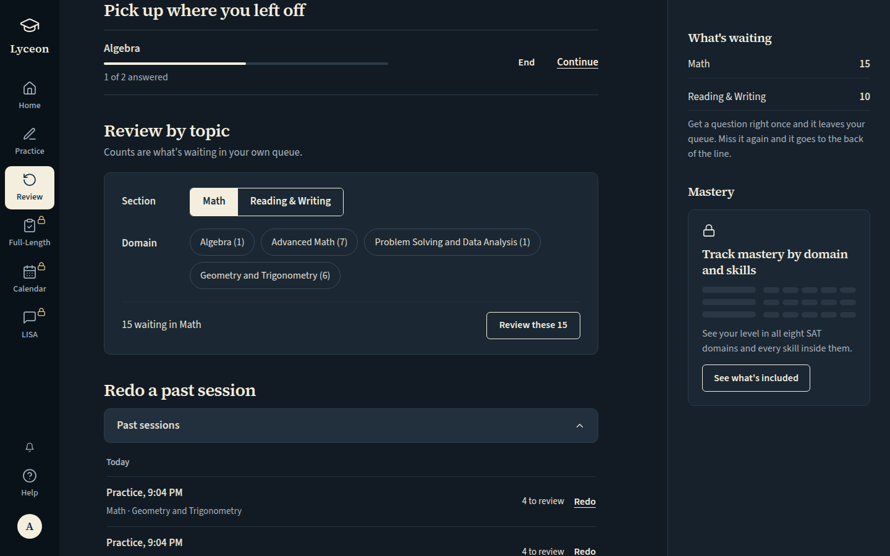 `/review`, 127 KB, horizontal overflow 0px | 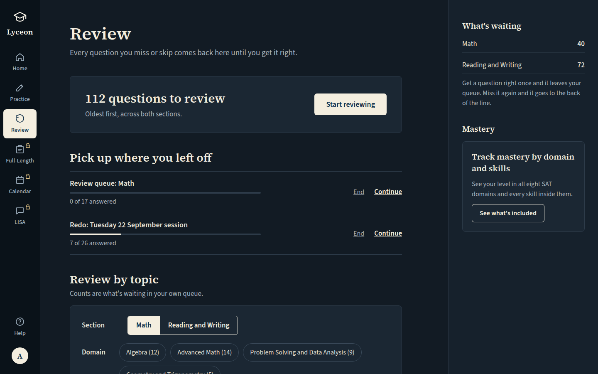, 129 KB |
| mobile | light |  `/review`, 171 KB, horizontal overflow 0px |  desktop prototype (no phone layout), 127 KB |
| mobile | dark |  `/review`, 173 KB, horizontal overflow 0px |  desktop prototype (no phone layout), 129 KB |

## QA item 5: Start reviewing pressed, the create held in flight: 'Starting…' with a spinner; the other starts wait

Persona: `paid`. Route: `/review`.
Step: click `{"desktop":"[data-testid=\"button-start-queue\"]","mobile":"[data-testid=\"button-start-queue\"]"}`.
Held: the browser's `POST /api/review/sessions` is left unanswered through the screenshot, then aborted (it never reaches the server).
Must then show `[data-testid="button-start-queue"][aria-busy="true"]` (the capture fails otherwise).
Prototype: none. A pending state the prototype does not draw (owner QA list, 2026-10-07, item 5).

| Viewport | Theme (as rendered) | Built | Prototype |
|---|---|---|---|
| desktop | light | 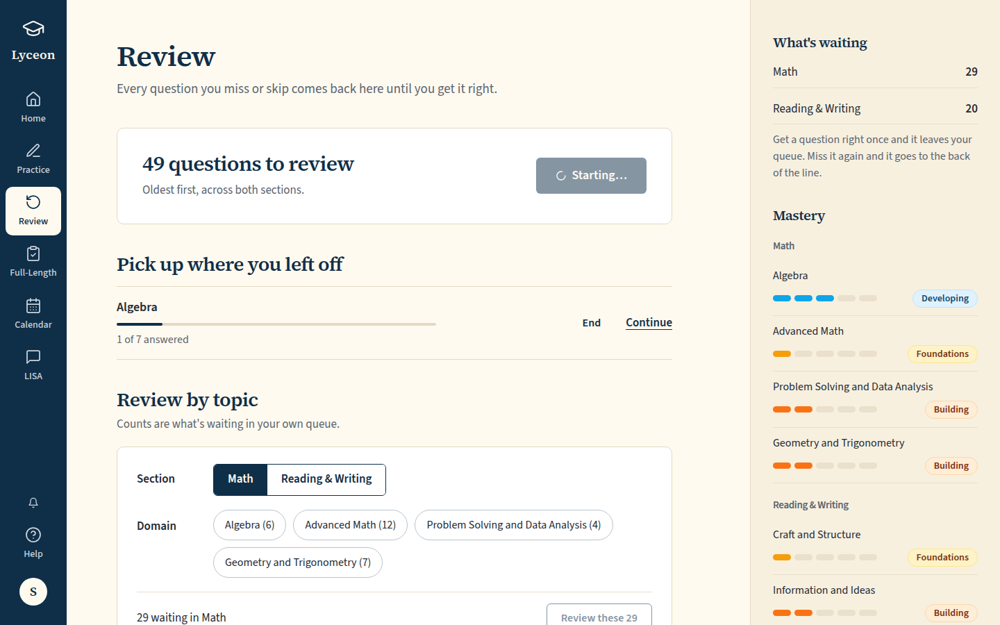 `/review`, 139 KB, horizontal overflow 0px | none |
| desktop | dark | 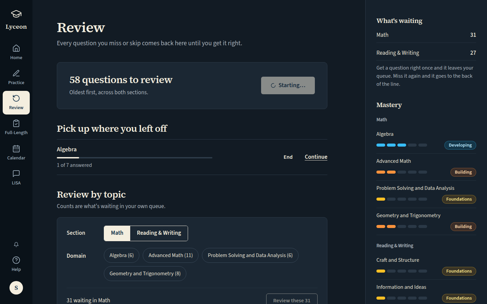 `/review`, 141 KB, horizontal overflow 0px | none |
| mobile | light | 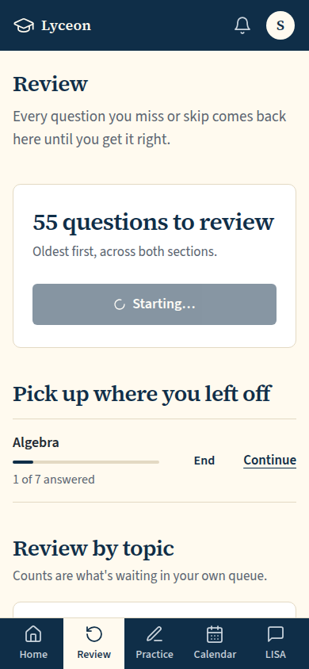 `/review`, 57 KB, horizontal overflow 0px | none |
| mobile | dark | 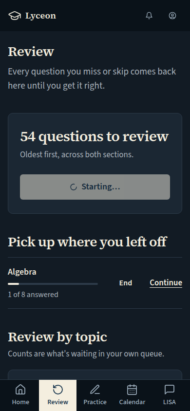 `/review`, 58 KB, horizontal overflow 0px | none |

## Click path (paid): Start reviewing lands in the review runner

Persona: `paid`. Route: `/review`.
Step: click `{"desktop":"[data-testid=\"button-start-queue\"]","mobile":"[data-testid=\"button-start-queue\"]"}`.
Click path: must land on a path matching `^/review/session/[0-9a-f-]{36}$` (the capture fails otherwise); the path it landed on is under each built shot.
Prototype: none. A click path: the screenshot is where the click landed (the runner), proven by its pathname.

| Viewport | Theme (as rendered) | Built | Prototype |
|---|---|---|---|
| desktop | light | 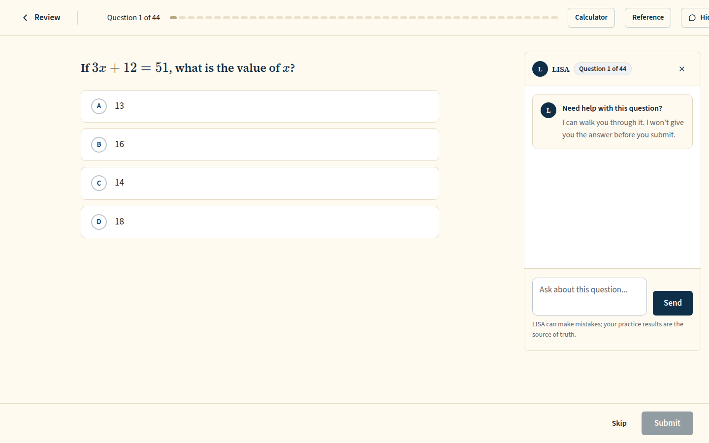 `/review/session/7ce63ece-2897-4b7f-810c-9faad242d394`, 63 KB, horizontal overflow 0px | none |
| desktop | dark | 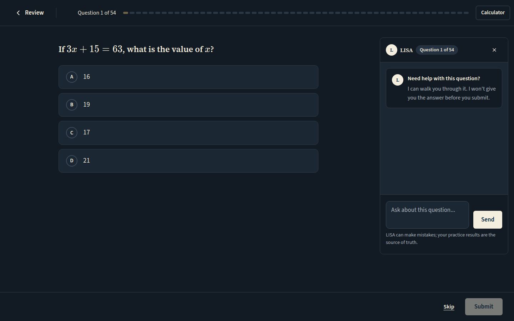 `/review/session/ecf3fd92-3031-4f73-aa51-43aee84605d5`, 63 KB, horizontal overflow 0px | none |
| mobile | light |  `/review/session/da615575-f8d4-4b8f-b785-de8ed02ae361`, 38 KB, horizontal overflow 0px | none |
| mobile | dark |  `/review/session/f763de63-5b79-4f09-a543-0f642f7b4d31`, 39 KB, horizontal overflow 0px | none |

## Run facts

- Seeded ids: `{"free":{"completedPracticeSessionId":"01ff7fa7-f0e5-4f43-b45b-de8e7e648164","openPracticeSessionId":"07711f38-382c-466a-8dc7-45c2ea0ccde2","openReviewSessionId":"7573ca65-4ec6-4a92-8ffb-d11b6b33cad8","diagnosticSessionId":null,"scoredExamSessionId":null,"inProgressExamSessionId":null,"lisaConversationId":null,"answered":39},"paid":{"completedPracticeSessionId":"19009b5a-f4e9-4821-a072-ffd93d15081c","openPracticeSessionId":"b06fc02d-7abb-457d-8447-b1b30022c3b2","openReviewSessionId":"c73208f8-8425-41e9-9b34-51171ece89ca","diagnosticSessionId":"7e8e4680-07de-4ff1-ab4a-cfd9d0b58639","scoredExamSessionId":null,"inProgressExamSessionId":null,"lisaConversationId":null,"answered":79}}`
- Endpoints the pages asked for that the harness does not serve (answered 404): none
- External hosts blocked: none
