# UI-53 Practice and review runners (Focus shell): selected, correct, incorrect, light and dark, 1440 and 390

Generated 2026-10-07T10:33:22.267Z by `pnpm exec tsx tests/e2e/student-harness/capture.ts UI-53` (see `tests/e2e/student-harness/README.md`). Built = a production build of the real client (`vite preview`, or the dev server with STUDENT_HARNESS_CLIENT=dev) against the student harness (real routers over a local Postgres built from this repo's migrations; personas seeded through the real practice routes). Prototype = the signed-off `docs/plans/student-ui/design/prototype/*.dc.html`, rendered locally.

Conditions, read before comparing:
- Viewport screenshots (not full page) unless the shot says full page: desktop 1440x900, phone 390x844, and any extra size a shot names.
- The prototypes are a fixed 1440x900 canvas with no phone layout; phone rows show the desktop prototype.
- Dark is requested through the app's own per-device setting; the theme column records what the page rendered.
- No external requests: the built app's Google Fonts (Inter, Poppins) are blocked, so legacy page bodies fall back to system faces; Source Sans 3 / Source Serif 4 are self-hosted and load for both sides.
- Prototype data is illustrative; built data is the seeded personas' real payloads.

## Practice runner, a choice selected (Submit enabled), before submitting

Persona: `paid`. Route: `/practice/session/{session}`.
Preset localStorage: `{"lyceon_client_instance_id":"student-harness-seed"}`.
Fresh session per capture (real create route, ended after the shot): `practice {"sections":["M"],"target_question_count":10}`.
Step: pick the first choice (resolved from the served item's stored order in the harness database).
Must fit the viewport (F-69): document no taller than the viewport, window unscrolled, `[data-testid="focus-shell-header"]` wholly in view, nothing to scroll in `main#main` (the capture fails otherwise); the measurement is under each built shot.
Prototype: `Runner.dc.html` (the first choice clicked); clicked: `[role="radio"] >> nth=0`.

| Viewport | Theme (as rendered) | Built | Prototype |
|---|---|---|---|
| desktop | light |  `/practice/session/ce669317-5b16-4175-8159-d0f6839c225f`, 32 KB, horizontal overflow 0px, document 900px in a 900px viewport, scrollY 0, top bar 0..73px, `main#main` 827px of content in 827px | , 33 KB |
| desktop | dark |  `/practice/session/ff8e93d0-2354-48e6-9d83-dcb7f7e03e80`, 34 KB, horizontal overflow 0px, document 900px in a 900px viewport, scrollY 0, top bar 0..73px, `main#main` 827px of content in 827px | , 33 KB |
| mobile | light |  `/practice/session/6cf07ee6-4e92-48a6-a6d9-4b39bfd57372`, 25 KB, horizontal overflow 0px, document 844px in a 844px viewport, scrollY 0, top bar 0..73px, `main#main` 771px of content in 771px |  desktop prototype (no phone layout), 33 KB |
| mobile | dark |  `/practice/session/77ef8f71-12ae-48e4-a997-7f442f0ffd3f`, 25 KB, horizontal overflow 0px, document 844px in a 844px viewport, scrollY 0, top bar 0..73px, `main#main` 771px of content in 771px |  desktop prototype (no phone layout), 33 KB |

## Practice runner, answered right: 'Correct answer' on the pick, the 'Correct' panel with the explanation, Next question

Persona: `paid`. Route: `/practice/session/{session}`.
Preset localStorage: `{"lyceon_client_instance_id":"student-harness-seed"}`.
Fresh session per capture (real create route, ended after the shot): `practice {"sections":["M"],"target_question_count":10}`.
Step: pick the correct choice (resolved from the served item's stored order in the harness database).
Step: click `{"desktop":"[data-testid=\"runner-footer\"] button:has-text(\"Submit\")","mobile":"[data-testid=\"runner-footer\"] button:has-text(\"Submit\")"}`.
Prototype: `Runner.dc.html` (the correct (second) choice, then Submit); clicked: `[role="radio"] >> nth=1`, `button:has-text("Submit")`.

| Viewport | Theme (as rendered) | Built | Prototype |
|---|---|---|---|
| desktop | light |  `/practice/session/541b3b26-c6c2-4774-bbf9-8defdc8c9075`, 39 KB, horizontal overflow 0px | , 41 KB |
| desktop | dark |  `/practice/session/48a082fe-5705-404f-a98e-0c1fa4475e66`, 39 KB, horizontal overflow 0px | , 42 KB |
| mobile | light |  `/practice/session/d2dabf87-2566-4d3a-bbb9-cef6430be042`, 29 KB, horizontal overflow 0px |  desktop prototype (no phone layout), 41 KB |
| mobile | dark |  `/practice/session/2b8802ac-4f1e-4758-b719-99c9e3761260`, 31 KB, horizontal overflow 0px |  desktop prototype (no phone layout), 42 KB |

## Practice runner, answered wrong: 'Your answer' and 'Correct answer' tags, 'Not quite', the explanation, the review-queue note

Persona: `paid`. Route: `/practice/session/{session}`.
Preset localStorage: `{"lyceon_client_instance_id":"student-harness-seed"}`.
Fresh session per capture (real create route, ended after the shot): `practice {"sections":["M"],"target_question_count":10}`.
Step: pick the incorrect choice (resolved from the served item's stored order in the harness database).
Step: click `{"desktop":"[data-testid=\"runner-footer\"] button:has-text(\"Submit\")","mobile":"[data-testid=\"runner-footer\"] button:has-text(\"Submit\")"}`.
Prototype: `Runner.dc.html` (a wrong (first) choice, then Submit); clicked: `[role="radio"] >> nth=0`, `button:has-text("Submit")`.

| Viewport | Theme (as rendered) | Built | Prototype |
|---|---|---|---|
| desktop | light |  `/practice/session/f5b288bc-0b10-4629-8d06-0d3e7858b93e`, 44 KB, horizontal overflow 0px | , 46 KB |
| desktop | dark |  `/practice/session/a63ccf3e-25a6-4fac-8b54-a233460d22ba`, 44 KB, horizontal overflow 0px | , 48 KB |
| mobile | light |  `/practice/session/39103078-ebf0-4a16-80b7-2857f18dab8d`, 35 KB, horizontal overflow 0px |  desktop prototype (no phone layout), 46 KB |
| mobile | dark |  `/practice/session/eb78af72-d0b8-4ad5-b8ac-b6f23cd355f6`, 36 KB, horizontal overflow 0px |  desktop prototype (no phone layout), 48 KB |

## Review runner, a choice selected, before submitting (LISA beside the question at 1440)

Persona: `paid`. Route: `/review/session/{session}`.
Preset localStorage: `{"lyceon_client_instance_id":"student-harness-seed"}`.
Fresh session per capture (real create route, ended after the shot): `review {"mode":"filter","filters":{"sections":["RW"]},"target_count":10}`.
Step: pick the first choice (resolved from the served item's stored order in the harness database).
Must fit the viewport (F-69): document no taller than the viewport, window unscrolled, `[data-testid="focus-shell-header"]` wholly in view, nothing to scroll in `main#main` (the capture fails otherwise); the measurement is under each built shot.
Prototype: `Runner.dc.html` (the first choice clicked (the canvas draws the practice runner; there is no review canvas)); clicked: `[role="radio"] >> nth=0`.

| Viewport | Theme (as rendered) | Built | Prototype |
|---|---|---|---|
| desktop | light |  `/review/session/9ef12670-f3df-4f4e-85fc-d9586faeae79`, 116 KB, horizontal overflow 0px, document 900px in a 900px viewport, scrollY 0, top bar 0..73px, `main#main` 827px of content in 827px | , 33 KB |
| desktop | dark |  `/review/session/61a24e7a-4bd8-47b3-9f51-6e98ebe0d087`, 120 KB, horizontal overflow 0px, document 900px in a 900px viewport, scrollY 0, top bar 0..73px, `main#main` 827px of content in 827px | , 33 KB |
| mobile | light |  `/review/session/be3cfab5-ac39-4d91-81b0-42eb80e82f78`, 73 KB, horizontal overflow 0px, document 844px in a 844px viewport, scrollY 0, top bar 0..73px, `main#main` 771px of content in 771px |  desktop prototype (no phone layout), 33 KB |
| mobile | dark |  `/review/session/a7b244bf-ac6a-4c57-95da-d4b7b40814f8`, 76 KB, horizontal overflow 0px, document 844px in a 844px viewport, scrollY 0, top bar 0..73px, `main#main` 771px of content in 771px |  desktop prototype (no phone layout), 33 KB |

## Review runner, answered right

Persona: `paid`. Route: `/review/session/{session}`.
Preset localStorage: `{"lyceon_client_instance_id":"student-harness-seed"}`.
Fresh session per capture (real create route, ended after the shot): `review {"mode":"filter","filters":{"sections":["RW"]},"target_count":10}`.
Step: pick the correct choice (resolved from the served item's stored order in the harness database).
Step: click `{"desktop":"[data-testid=\"runner-footer\"] button:has-text(\"Submit\")","mobile":"[data-testid=\"runner-footer\"] button:has-text(\"Submit\")"}`.
Prototype: `Runner.dc.html` (the correct (second) choice, then Submit); clicked: `[role="radio"] >> nth=1`, `button:has-text("Submit")`.

| Viewport | Theme (as rendered) | Built | Prototype |
|---|---|---|---|
| desktop | light |  `/review/session/9b601307-562d-4de2-b8eb-839c42757274`, 123 KB, horizontal overflow 0px | , 41 KB |
| desktop | dark |  `/review/session/ac06809f-b2fb-42a9-b083-40573396f6b9`, 126 KB, horizontal overflow 0px | , 42 KB |
| mobile | light |  `/review/session/ac2e0c89-cb52-4236-a695-cdcaf23f9fea`, 72 KB, horizontal overflow 0px |  desktop prototype (no phone layout), 41 KB |
| mobile | dark |  `/review/session/38d4d5bf-8365-4d86-97fb-7c1bc5d70803`, 81 KB, horizontal overflow 0px |  desktop prototype (no phone layout), 42 KB |

## Review runner, answered wrong (no review-queue note: the question is already in the queue)

Persona: `paid`. Route: `/review/session/{session}`.
Preset localStorage: `{"lyceon_client_instance_id":"student-harness-seed"}`.
Fresh session per capture (real create route, ended after the shot): `review {"mode":"filter","filters":{"sections":["RW"]},"target_count":10}`.
Step: pick the incorrect choice (resolved from the served item's stored order in the harness database).
Step: click `{"desktop":"[data-testid=\"runner-footer\"] button:has-text(\"Submit\")","mobile":"[data-testid=\"runner-footer\"] button:has-text(\"Submit\")"}`.
Prototype: `Runner.dc.html` (a wrong (first) choice, then Submit); clicked: `[role="radio"] >> nth=0`, `button:has-text("Submit")`.

| Viewport | Theme (as rendered) | Built | Prototype |
|---|---|---|---|
| desktop | light |  `/review/session/f0364d6f-b4ac-4eda-b40e-a4062818f6c9`, 138 KB, horizontal overflow 0px | , 46 KB |
| desktop | dark |  `/review/session/fece7512-bf45-4ba7-aba5-0f46a69b0043`, 126 KB, horizontal overflow 0px | , 48 KB |
| mobile | light |  `/review/session/88967084-f153-45bb-af9d-57589c2ee50e`, 72 KB, horizontal overflow 0px |  desktop prototype (no phone layout), 46 KB |
| mobile | dark |  `/review/session/a6f3e977-68ba-43ae-a85d-20089e2ff7e5`, 81 KB, horizontal overflow 0px |  desktop prototype (no phone layout), 48 KB |

## Review runner, LISA panel in use (OQ-54 (a), ruling 2026-10-05: student tokens, follows the device theme): a first message typed and sent creates the item's conversation (real POST /api/tutor/conversations); the student's bubble and LISA's typing dots show in the panel, and Send reads 'Sending…' (QA 2026-10-07 item 5). The turn request is held in the browser, so no turn runs. On a phone the panel stacks under the question; typing into it scrolls it into view

Persona: `paid`. Route: `/review/session/{session}`.
Preset localStorage: `{"lyceon_client_instance_id":"student-harness-seed"}`.
Fresh session per capture (real create route, ended after the shot): `review {"mode":"filter","filters":{"sections":["RW"]},"target_count":10}`.
Step: type `How should I start this one?` into `{"desktop":"[data-testid=\"scoped-tutor-panel\"] textarea[aria-label=\"Message\"]","mobile":"[data-testid=\"scoped-tutor-panel\"] textarea[aria-label=\"Message\"]"}`.
Step: click `{"desktop":"[data-testid=\"scoped-tutor-panel\"] button[aria-label=\"Send message\"]","mobile":"[data-testid=\"scoped-tutor-panel\"] button[aria-label=\"Send message\"]"}`.
Held: the browser's `POST /api/tutor/messages` is left unanswered through the screenshot, then aborted (it never reaches the server).
Must then show `[data-testid="scoped-tutor-panel"] button[aria-label="Send message"][data-pending="true"]` (the capture fails otherwise).
Must fit the viewport (F-69): document no taller than the viewport, window unscrolled, `[data-testid="focus-shell-header"]` wholly in view, nothing to scroll in `main#main` (the capture fails otherwise); the measurement is under each built shot.
Prototype: none. Not prototyped: Runner.dc.html does not draw LISA (OQ-54 (d), ruling W4-4 keeps LISA in the review runner). The panel reuses the UI-56 thread parts (Lisa.dc.html).

| Viewport | Theme (as rendered) | Built | Prototype |
|---|---|---|---|
| desktop | light |  `/review/session/8ed087ca-10fd-490a-9e7c-028e98021e8e`, 108 KB, horizontal overflow 0px, document 900px in a 900px viewport, scrollY 0, top bar 0..73px, `main#main` 827px of content in 827px | none |
| desktop | dark |  `/review/session/1a16d156-e421-47ec-9980-cfa96d3ee87c`, 110 KB, horizontal overflow 0px, document 900px in a 900px viewport, scrollY 0, top bar 0..73px, `main#main` 827px of content in 827px | none |
| mobile | light |  `/review/session/2cee84c4-54f2-48bd-8700-0ea80e6b6c15`, 27 KB, horizontal overflow 0px, document 844px in a 844px viewport, scrollY 0, top bar 0..73px, `main#main` 771px of content in 771px | none |
| mobile | dark |  `/review/session/778eb142-5178-498a-b9e4-557f4b0ada46`, 27 KB, horizontal overflow 0px, document 844px in a 844px viewport, scrollY 0, top bar 0..73px, `main#main` 771px of content in 771px | none |

## Review runner, the LISA composer focused (F-69, owner ruling 2026-10-05): the Focus shell's top bar stays in view and the document is the viewport's height (no blank band under the footer); on a phone the focus scrolls the panel into view inside the shell, never the window

Persona: `paid`. Route: `/review/session/{session}`.
Preset localStorage: `{"lyceon_client_instance_id":"student-harness-seed"}`.
Fresh session per capture (real create route, ended after the shot): `review {"mode":"filter","filters":{"sections":["RW"]},"target_count":10}`.
Step: focus `{"desktop":"[data-testid=\"scoped-tutor-panel\"] textarea[aria-label=\"Message\"]","mobile":"[data-testid=\"scoped-tutor-panel\"] textarea[aria-label=\"Message\"]"}` (no typing).
Must fit the viewport (F-69): document no taller than the viewport, window unscrolled, `[data-testid="focus-shell-header"]` wholly in view, nothing to scroll in `main#main` (the capture fails otherwise); the measurement is under each built shot.
Prototype: none. Not prototyped: Runner.dc.html does not draw LISA (OQ-54 (d)). F-69's proof shot: the shell's top bar with the composer focused.

| Viewport | Theme (as rendered) | Built | Prototype |
|---|---|---|---|
| desktop | light | 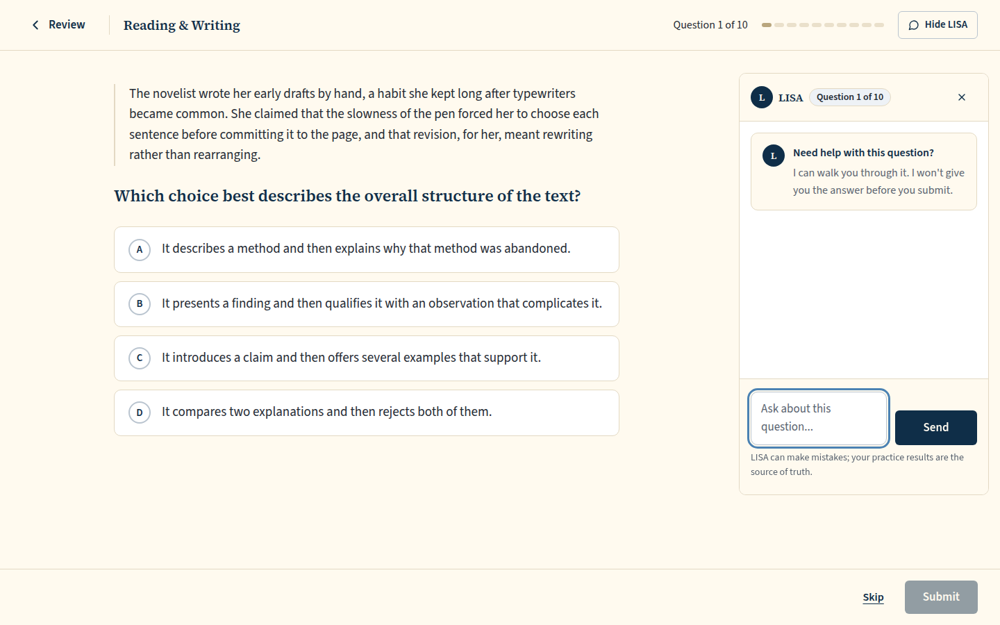 `/review/session/4d4d72fc-6beb-4e01-b7bc-c772fda52d30`, 115 KB, horizontal overflow 0px, document 900px in a 900px viewport, scrollY 0, top bar 0..73px, `main#main` 827px of content in 827px | none |
| desktop | dark | 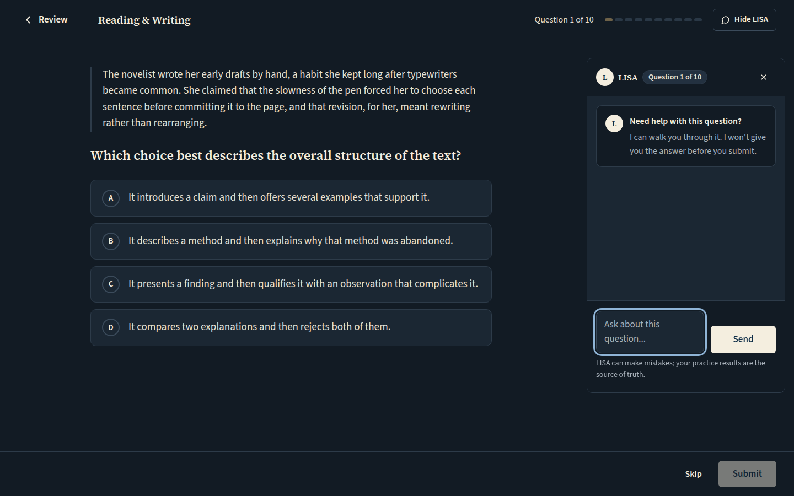 `/review/session/badcf80c-f572-4992-8128-5248f8836502`, 118 KB, horizontal overflow 0px, document 900px in a 900px viewport, scrollY 0, top bar 0..73px, `main#main` 827px of content in 827px | none |
| mobile | light | 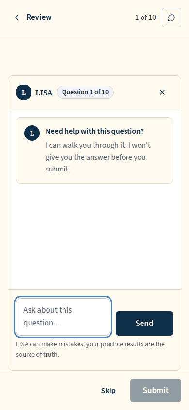 `/review/session/b9ce3a79-cda6-4b74-987e-bbecca93ee9c`, 33 KB, horizontal overflow 0px, document 844px in a 844px viewport, scrollY 0, top bar 0..73px, `main#main` 771px of content in 771px | none |
| mobile | dark | 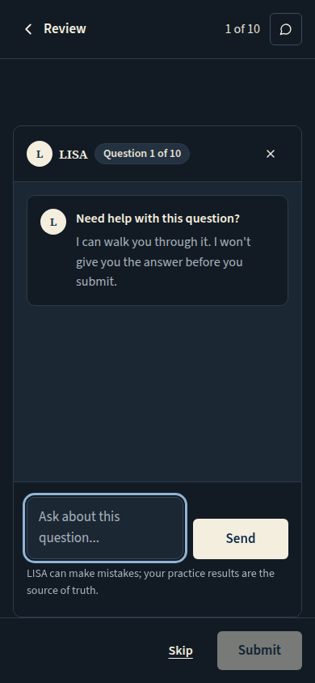 `/review/session/0a6d9a27-ff99-4462-8d6d-8bce02e2b0df`, 33 KB, horizontal overflow 0px, document 844px in a 844px viewport, scrollY 0, top bar 0..73px, `main#main` 771px of content in 771px | none |

## QA 2026-10-07 item 8: LISA hidden with the bar's toggle, then opened again with Show LISA. On a phone (LISA stacks under the question) the panel opens scrolled into view inside the shell, its header at the top of the runner's scroll area; at 1440 it is beside the question and nothing scrolls

Persona: `paid`. Route: `/review/session/{session}`.
Preset localStorage: `{"lyceon_client_instance_id":"student-harness-seed"}`.
Fresh session per capture (real create route, ended after the shot): `review {"mode":"filter","filters":{"sections":["RW"]},"target_count":10}`.
Step: click `{"desktop":"[data-testid=\"practice-tutor-toggle\"]","mobile":"[data-testid=\"practice-tutor-toggle\"]"}`.
Step: click `{"desktop":"[data-testid=\"practice-tutor-toggle\"]","mobile":"[data-testid=\"practice-tutor-toggle\"]"}`.
Must then show `[data-testid="scoped-tutor-panel"]` (the capture fails otherwise).
Must fit the viewport (F-69): document no taller than the viewport, window unscrolled, `[data-testid="focus-shell-header"]` wholly in view, nothing to scroll in `main#main` (the capture fails otherwise); the measurement is under each built shot.
Prototype: none. Not prototyped: Runner.dc.html does not draw LISA (OQ-54 (d)). QA item 8's proof shot: Show LISA on a phone brings the panel into view.

| Viewport | Theme (as rendered) | Built | Prototype |
|---|---|---|---|
| desktop | light | 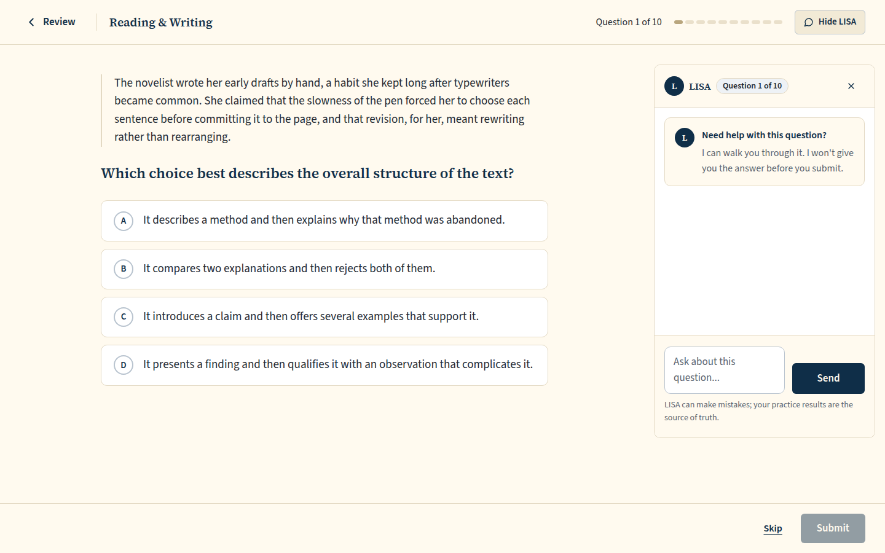 `/review/session/8ea1f9ed-56f0-4b1a-a919-18e249957755`, 115 KB, horizontal overflow 0px, document 900px in a 900px viewport, scrollY 0, top bar 0..73px, `main#main` 827px of content in 827px | none |
| desktop | dark | 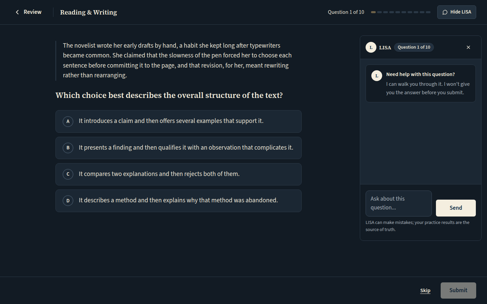 `/review/session/97b8c60c-85a2-442c-be08-df6086eafcac`, 117 KB, horizontal overflow 0px, document 900px in a 900px viewport, scrollY 0, top bar 0..73px, `main#main` 827px of content in 827px | none |
| mobile | light | 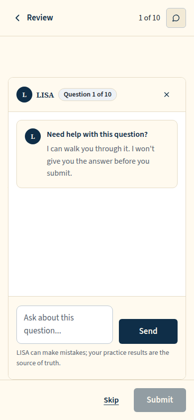 `/review/session/d32e674d-82ca-4a74-b89b-900a407d64ce`, 32 KB, horizontal overflow 0px, document 844px in a 844px viewport, scrollY 0, top bar 0..73px, `main#main` 771px of content in 771px | none |
| mobile | dark | 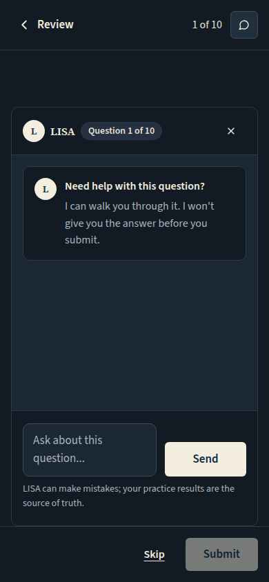 `/review/session/f33b0a64-8431-4cd1-bc70-28ccaa32ea3e`, 33 KB, horizontal overflow 0px, document 844px in a 844px viewport, scrollY 0, top bar 0..73px, `main#main` 771px of content in 771px | none |

## Review runner, free student: the server refuses LISA's on-load lookup, so the panel shows the LISA card (approved copy: LISA's headline and the prototype body, OQ-44) with Unlock LISA in place of the composer. The app's upgrade modal opens on the refusal (UI-44) and is closed with Not now before the shot; a click on the panel's question chip scrolls the panel into view (on a phone it stacks under the question)

Persona: `free`. Route: `/review/session/{session}`.
Preset localStorage: `{"lyceon_client_instance_id":"student-harness-seed"}`.
Fresh session per capture (real create route, ended after the shot): `review {"mode":"filter","filters":{"sections":["RW"]},"target_count":10}`.
Step: click `{"desktop":"[data-testid=\"upgrade-modal\"] button:has-text(\"Not now\")","mobile":"[data-testid=\"upgrade-modal\"] button:has-text(\"Not now\")"}`.
Step: click `{"desktop":"[data-testid=\"tutor-question-chip\"]","mobile":"[data-testid=\"tutor-question-chip\"]"}`.
Must then show `[data-testid="lisa-upgrade-unlock"]` (the capture fails otherwise).
Must then show no `[data-testid="upgrade-modal"]` (the capture fails otherwise).
Prototype: none. Not prototyped in the runner: the card is the Lisa.dc.html free card (plan = free) sized for the review runner's LISA panel.

| Viewport | Theme (as rendered) | Built | Prototype |
|---|---|---|---|
| desktop | light |  `/review/session/ff8217e5-05d3-48b3-b54b-be3977176bc3`, 126 KB, horizontal overflow 0px | none |
| desktop | dark |  `/review/session/93a04bad-6ec6-4bc2-a29a-c10c83994118`, 131 KB, horizontal overflow 0px | none |
| mobile | light |  `/review/session/3cb1dc27-629b-4ef0-a2dd-73478d4e0648`, 46 KB, horizontal overflow 0px | none |
| mobile | dark |  `/review/session/ed98aa18-130c-4d87-921a-15e83bbd2b05`, 51 KB, horizontal overflow 0px | none |

## Practice runner, a session shorter than asked for: OQ-35's sentence, no number

Persona: `paid`. Route: `/practice/session/{session}`.
Preset localStorage: `{"lyceon_client_instance_id":"student-harness-seed"}`.
Fresh session per capture (real create route, ended after the shot): `practice {"sections":["M"],"domains":["Geometry and Trigonometry"],"target_question_count":30}`.
Prototype: none. Not prototyped: OQ-35's ruled sentence (owner ruling 2026-10-02), shown on the first question of a shortened session.

| Viewport | Theme (as rendered) | Built | Prototype |
|---|---|---|---|
| desktop | light |  `/practice/session/dd991c56-414d-43a2-96fa-716a784a1f1c`, 42 KB, horizontal overflow 0px | none |
| desktop | dark |  `/practice/session/56f33fbe-262e-4693-8bee-ead8bd3b4a89`, 43 KB, horizontal overflow 0px | none |
| mobile | light |  `/practice/session/d9f6de23-1251-4d5e-b63c-6dc2580bb3d7`, 31 KB, horizontal overflow 0px | none |
| mobile | dark |  `/practice/session/9adf1cc2-52a8-4e32-a1ba-39ab0c1aeb69`, 32 KB, horizontal overflow 0px | none |

## Click path (practice): choose, Submit, Next question lands on 'Question 2 of M'

Persona: `paid`. Route: `/practice/session/{session}`.
Preset localStorage: `{"lyceon_client_instance_id":"student-harness-seed"}`.
Fresh session per capture (real create route, ended after the shot): `practice {"sections":["M"],"target_question_count":10}`.
Step: pick the first choice (resolved from the served item's stored order in the harness database).
Step: click `{"desktop":"[data-testid=\"runner-footer\"] button:has-text(\"Submit\")","mobile":"[data-testid=\"runner-footer\"] button:has-text(\"Submit\")"}`.
Step: click `{"desktop":"[data-testid=\"runner-footer\"] button:has-text(\"Next question\")","mobile":"[data-testid=\"runner-footer\"] button:has-text(\"Next question\")"}`.
Must then show the text `Question 2 of 10` (the capture fails otherwise).
Prototype: none. A click path: the screenshot is where Next landed, proven by the 'Question 2 of 10' text the capture waited for.

| Viewport | Theme (as rendered) | Built | Prototype |
|---|---|---|---|
| desktop | light |  `/practice/session/998f801a-ff40-4192-87b4-eab4cd2f4ebe`, 33 KB, horizontal overflow 0px | none |
| desktop | dark |  `/practice/session/b31f9d53-c015-437f-a299-a93da131eb7c`, 34 KB, horizontal overflow 0px | none |
| mobile | light |  `/practice/session/c7991ad9-1318-4c87-bdd2-d30ef3a3be66`, 26 KB, horizontal overflow 0px | none |
| mobile | dark |  `/practice/session/a2c86eac-362c-4c84-895f-9973431a7b13`, 25 KB, horizontal overflow 0px | none |

## QA item 5: Skip pressed, the skip held in flight: 'Skipping…' with a spinner, Skip and Submit disabled

Persona: `paid`. Route: `/practice/session/{session}`.
Preset localStorage: `{"lyceon_client_instance_id":"student-harness-seed"}`.
Fresh session per capture (real create route, ended after the shot): `practice {"sections":["M"],"target_question_count":10}`.
Step: click `{"desktop":"[data-testid=\"runner-skip\"]","mobile":"[data-testid=\"runner-skip\"]"}`.
Held: the browser's `POST /api/practice/sessions/*/skip` is left unanswered through the screenshot, then aborted (it never reaches the server).
Must then show `[data-testid="runner-skip"][aria-busy="true"]` (the capture fails otherwise).
Prototype: none. A pending state the prototype does not draw (owner QA list, 2026-10-07, item 5).

| Viewport | Theme (as rendered) | Built | Prototype |
|---|---|---|---|
| desktop | light | 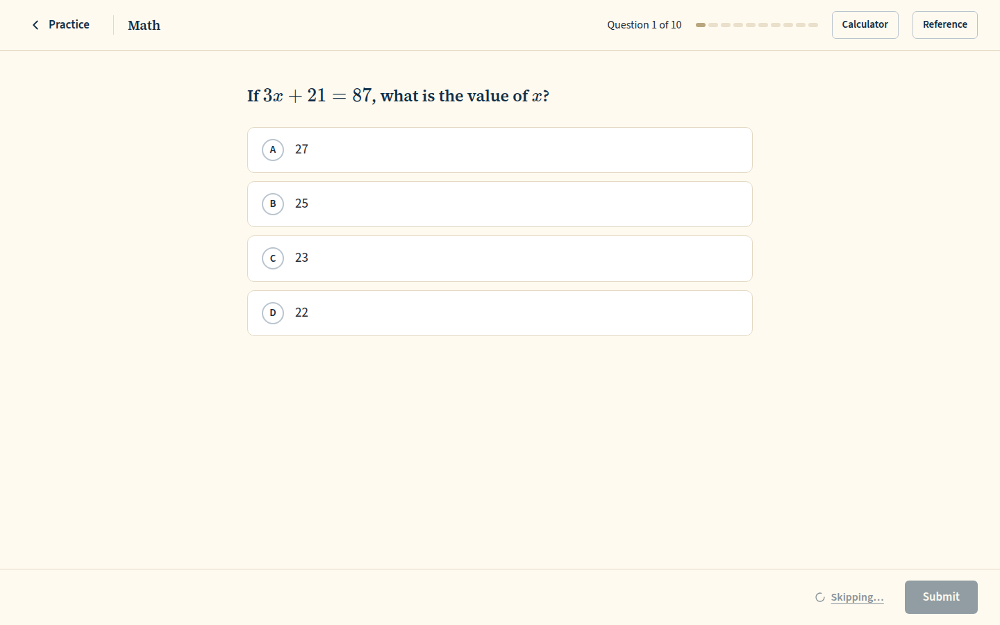 `/practice/session/dade4205-2b99-404f-907a-5a9e16ed5dd3`, 34 KB, horizontal overflow 0px | none |
| desktop | dark | 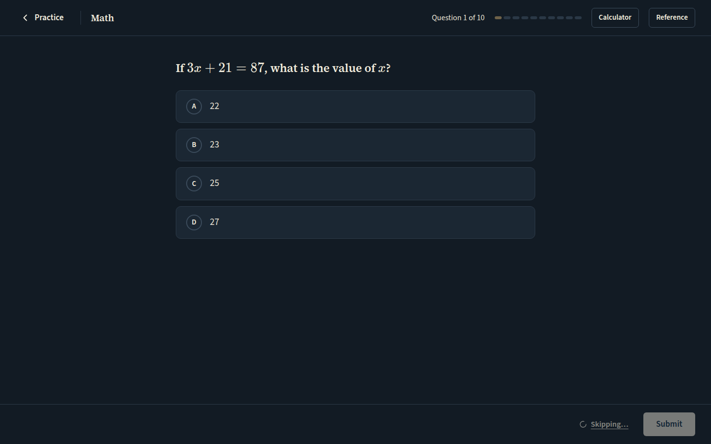 `/practice/session/2b3f7457-d71a-4b8a-bc83-6900e200ea3e`, 35 KB, horizontal overflow 0px | none |
| mobile | light | 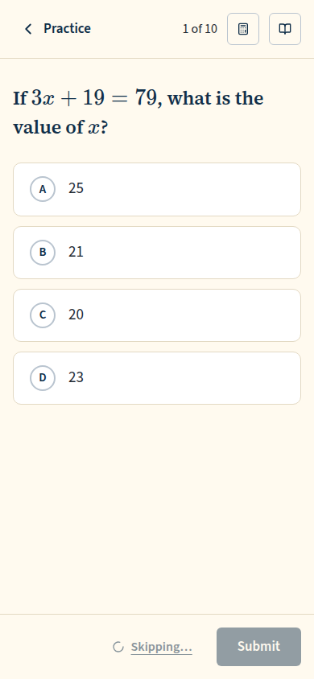 `/practice/session/c3a6f8d7-5be9-471a-821d-f84ec7408233`, 26 KB, horizontal overflow 0px | none |
| mobile | dark | 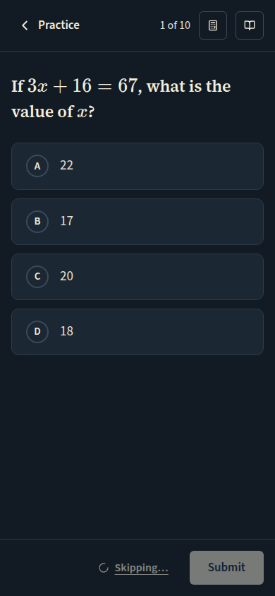 `/practice/session/ead94aa6-e455-4f2d-9451-e9fed96d9273`, 26 KB, horizontal overflow 0px | none |

## Run facts

- Seeded ids: `{"free":{"completedPracticeSessionId":"0004abca-8eb2-474e-b68c-4d8abf1585cb","openPracticeSessionId":"fab0da15-5517-45ae-838f-ceb8c2d36b9a","openReviewSessionId":null,"diagnosticSessionId":null,"scoredExamSessionId":null,"inProgressExamSessionId":null,"lisaConversationId":null,"answered":13},"paid":{"completedPracticeSessionId":"5470a442-22a9-4163-9360-7d5b71c18db2","openPracticeSessionId":"5f6acb90-5569-4161-8405-52b1a1b657cc","openReviewSessionId":null,"diagnosticSessionId":"cb67d129-b17f-4e34-bfd2-c37baef94db2","scoredExamSessionId":null,"inProgressExamSessionId":null,"lisaConversationId":null,"answered":53}}`
- Endpoints the pages asked for that the harness does not serve (answered 404): none
- External hosts blocked: none
