# UI-53 Practice and review runners (Focus shell): selected, correct, incorrect, light and dark, 1440 and 390

Generated 2026-10-05T06:52:39.656Z by `pnpm exec tsx tests/e2e/student-harness/capture.ts UI-53` (see `tests/e2e/student-harness/README.md`). Built = a production build of the real client (`vite preview`, or the dev server with STUDENT_HARNESS_CLIENT=dev) against the student harness (real routers over a local Postgres built from this repo's migrations; personas seeded through the real practice routes). Prototype = the signed-off `docs/plans/student-ui/design/prototype/*.dc.html`, rendered locally.

Conditions, read before comparing:
- Viewport screenshots (not full page) unless the shot says full page: desktop 1440x900, phone 390x844.
- The prototypes are a fixed 1440x900 canvas with no phone layout; phone rows show the desktop prototype.
- Dark is requested through the app's own per-device setting; the theme column records what the page rendered.
- No external requests: the built app's Google Fonts (Inter, Poppins) are blocked, so legacy page bodies fall back to system faces; Source Sans 3 / Source Serif 4 are self-hosted and load for both sides.
- Prototype data is illustrative; built data is the seeded personas' real payloads.

## Practice runner, a choice selected (Submit enabled), before submitting

Persona: `paid`. Route: `/practice/session/{session}`.
Preset localStorage: `{"lyceon_client_instance_id":"student-harness-seed"}`.
Fresh session per capture (real create route, ended after the shot): `practice {"sections":["M"],"target_question_count":10}`.
Step: pick the first choice (resolved from the served item's stored order in the harness database).
Prototype: `Runner.dc.html` (the first choice clicked); clicked: `[role="radio"] >> nth=0`.

| Viewport | Theme (as rendered) | Built | Prototype |
|---|---|---|---|
| desktop | light | 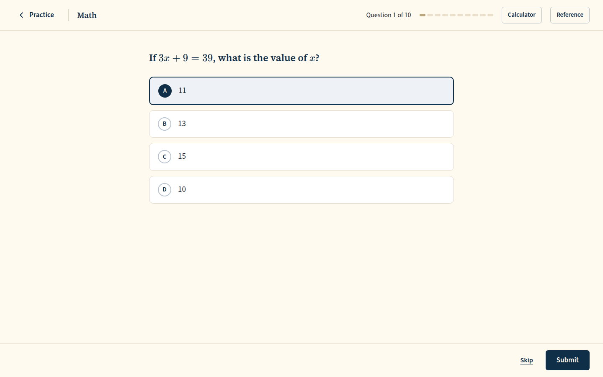 `/practice/session/978f29e0-400b-43a9-a625-6545a0e1b847`, 33 KB, horizontal overflow 0px | 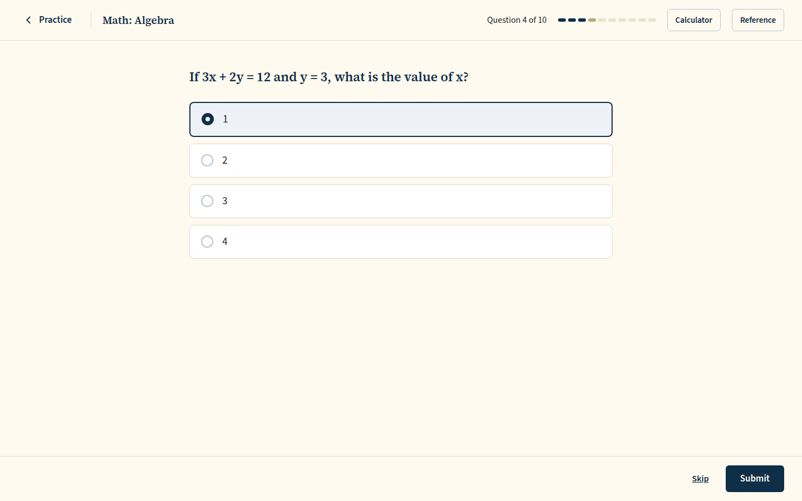, 33 KB |
| desktop | dark |  `/practice/session/03933eed-ccbf-403e-b453-cab7d4f7464c`, 34 KB, horizontal overflow 0px | 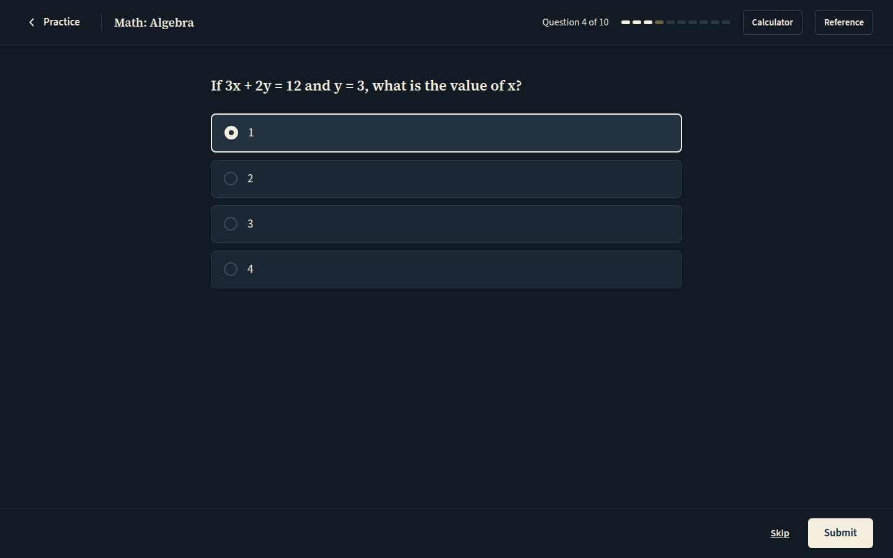, 33 KB |
| mobile | light | 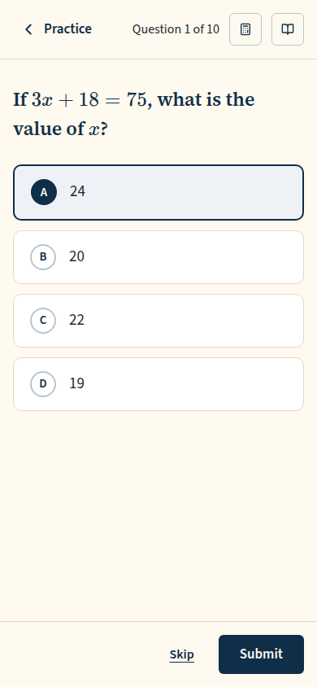 `/practice/session/6812c365-93f8-4704-96ef-3beeae254a28`, 26 KB, horizontal overflow 0px |  desktop prototype (no phone layout), 33 KB |
| mobile | dark | 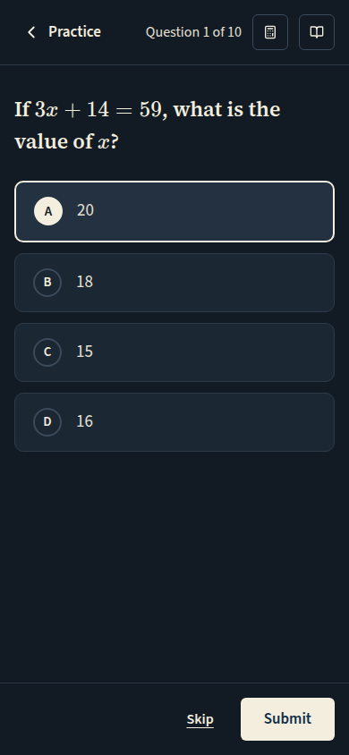 `/practice/session/c4ac9115-f3c5-48c1-b414-c422be63c1f4`, 27 KB, horizontal overflow 0px |  desktop prototype (no phone layout), 33 KB |

## Practice runner, answered right: 'Correct answer' on the pick, the 'Correct' panel with the explanation, Next question

Persona: `paid`. Route: `/practice/session/{session}`.
Preset localStorage: `{"lyceon_client_instance_id":"student-harness-seed"}`.
Fresh session per capture (real create route, ended after the shot): `practice {"sections":["M"],"target_question_count":10}`.
Step: pick the correct choice (resolved from the served item's stored order in the harness database).
Step: click `{"desktop":"[data-testid=\"runner-footer\"] button:has-text(\"Submit\")","mobile":"[data-testid=\"runner-footer\"] button:has-text(\"Submit\")"}`.
Prototype: `Runner.dc.html` (the correct (second) choice, then Submit); clicked: `[role="radio"] >> nth=1`, `button:has-text("Submit")`.

| Viewport | Theme (as rendered) | Built | Prototype |
|---|---|---|---|
| desktop | light | 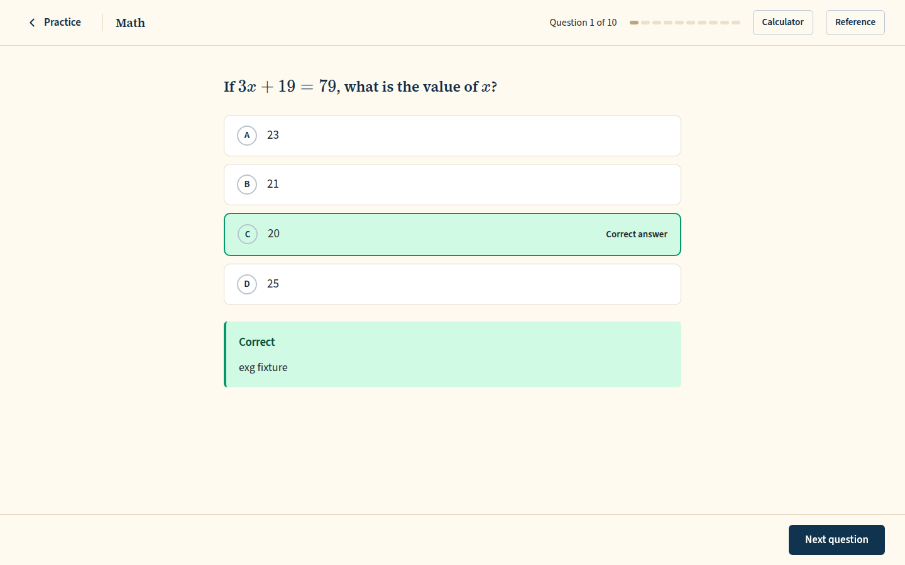 `/practice/session/981f5106-6349-4d3a-96aa-5cf941c77f2f`, 38 KB, horizontal overflow 0px | 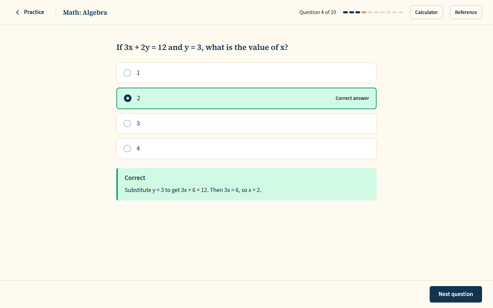, 41 KB |
| desktop | dark | 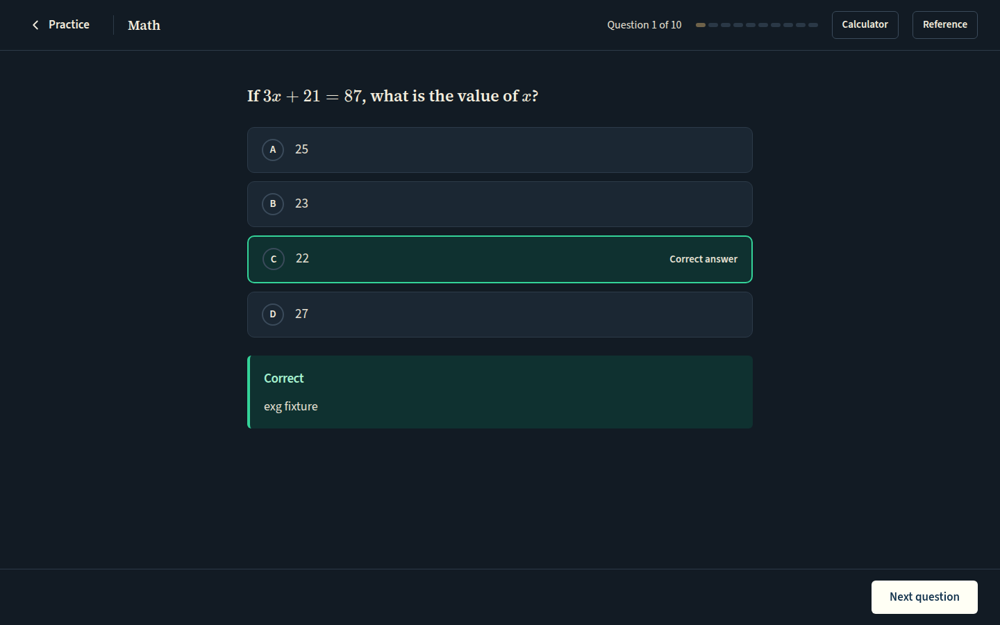 `/practice/session/6fe81865-af30-4c18-a772-8b7f2270583f`, 39 KB, horizontal overflow 0px | 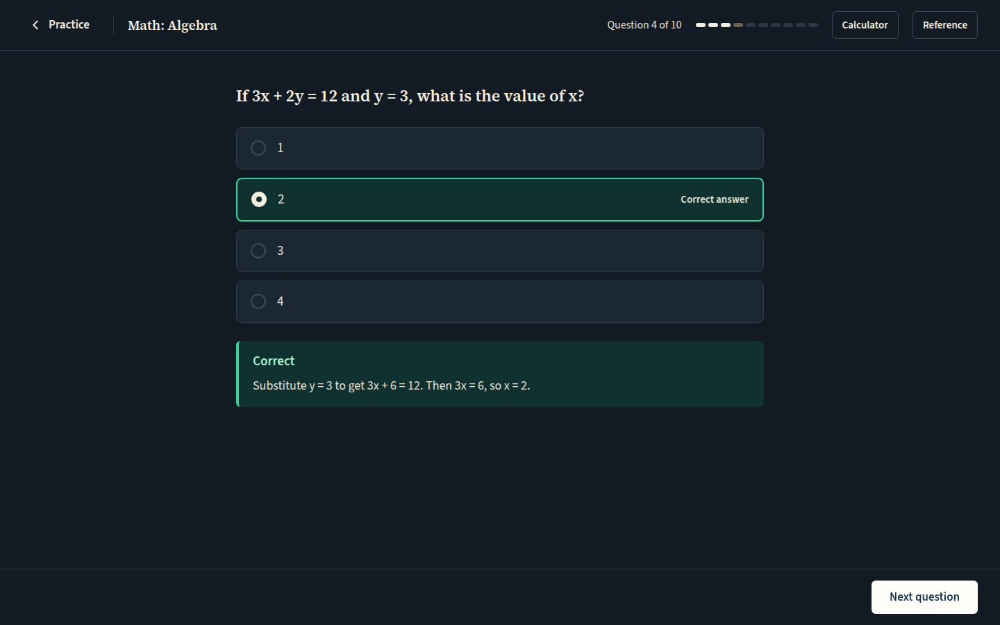, 42 KB |
| mobile | light | 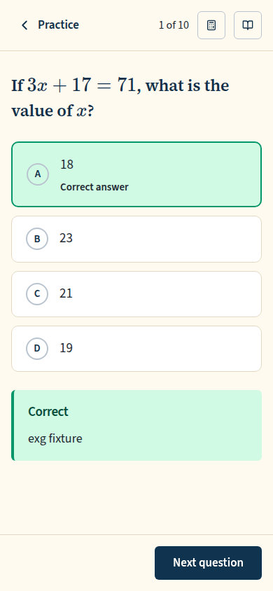 `/practice/session/cbbfc971-8e18-4c23-904f-7c2c6ce3d8b8`, 31 KB, horizontal overflow 0px |  desktop prototype (no phone layout), 41 KB |
| mobile | dark | 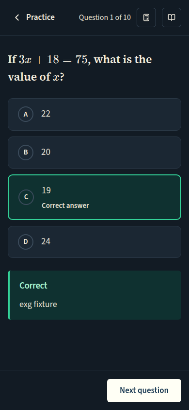 `/practice/session/77d68206-ed9e-4e6b-baa3-90eae94b276a`, 31 KB, horizontal overflow 0px |  desktop prototype (no phone layout), 42 KB |

## Practice runner, answered wrong: 'Your answer' and 'Correct answer' tags, 'Not quite', the explanation, the review-queue note

Persona: `paid`. Route: `/practice/session/{session}`.
Preset localStorage: `{"lyceon_client_instance_id":"student-harness-seed"}`.
Fresh session per capture (real create route, ended after the shot): `practice {"sections":["M"],"target_question_count":10}`.
Step: pick the incorrect choice (resolved from the served item's stored order in the harness database).
Step: click `{"desktop":"[data-testid=\"runner-footer\"] button:has-text(\"Submit\")","mobile":"[data-testid=\"runner-footer\"] button:has-text(\"Submit\")"}`.
Prototype: `Runner.dc.html` (a wrong (first) choice, then Submit); clicked: `[role="radio"] >> nth=0`, `button:has-text("Submit")`.

| Viewport | Theme (as rendered) | Built | Prototype |
|---|---|---|---|
| desktop | light | 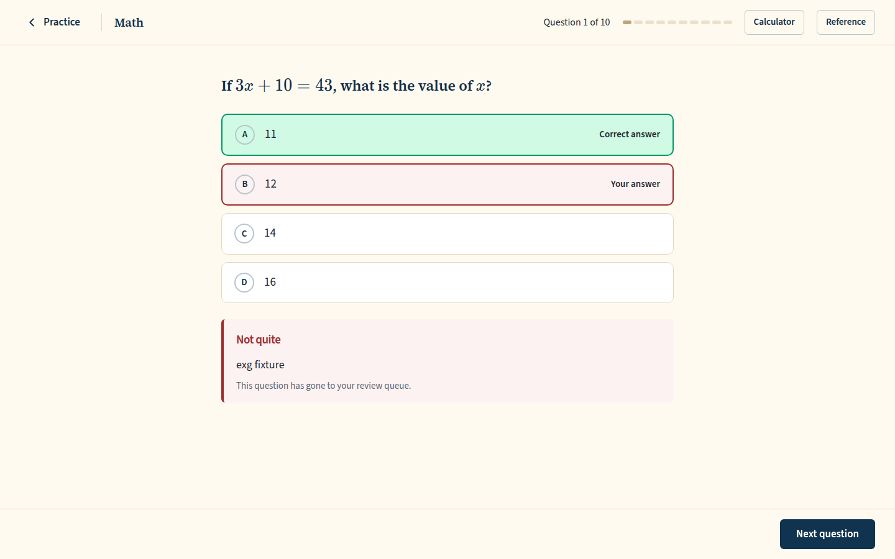 `/practice/session/c15c6e88-0a85-4982-aecd-2d9a53fd0cef`, 43 KB, horizontal overflow 0px | 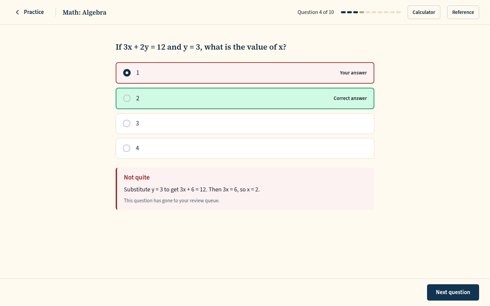, 46 KB |
| desktop | dark | 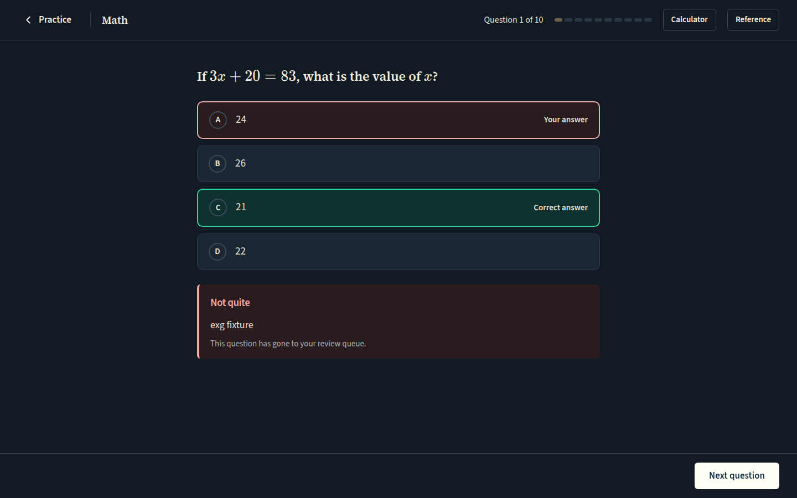 `/practice/session/be09122a-6172-4310-95bf-fe593936d975`, 44 KB, horizontal overflow 0px | 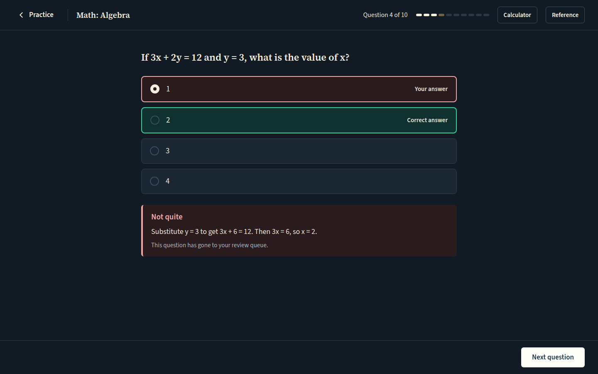, 48 KB |
| mobile | light | 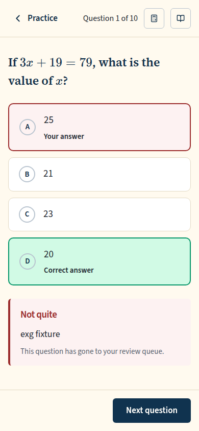 `/practice/session/234d1a7d-ed29-4281-8ce0-e254c8645eba`, 36 KB, horizontal overflow 0px |  desktop prototype (no phone layout), 46 KB |
| mobile | dark | 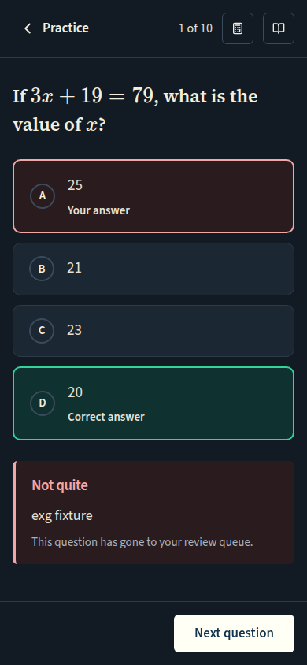 `/practice/session/cb6705c2-ba2f-4cf7-8611-d9a4e31be2ef`, 37 KB, horizontal overflow 0px |  desktop prototype (no phone layout), 48 KB |

## Review runner, a choice selected, before submitting (LISA beside the question at 1440)

Persona: `paid`. Route: `/review/session/{session}`.
Preset localStorage: `{"lyceon_client_instance_id":"student-harness-seed"}`.
Fresh session per capture (real create route, ended after the shot): `review {"mode":"filter","filters":{"sections":["RW"]},"target_count":10}`.
Step: pick the first choice (resolved from the served item's stored order in the harness database).
Prototype: `Runner.dc.html` (the first choice clicked (the canvas draws the practice runner; there is no review canvas)); clicked: `[role="radio"] >> nth=0`.

| Viewport | Theme (as rendered) | Built | Prototype |
|---|---|---|---|
| desktop | light | 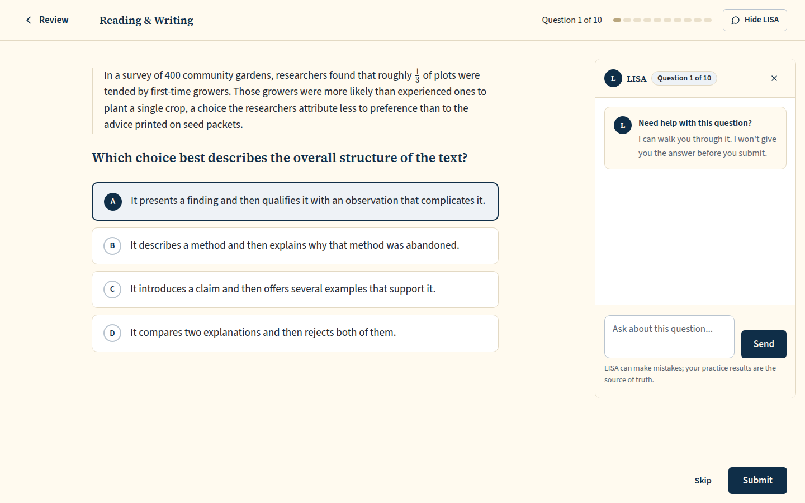 `/review/session/0139c76a-587a-49ae-ad26-e7d9f4325d99`, 117 KB, horizontal overflow 0px | , 33 KB |
| desktop | dark | 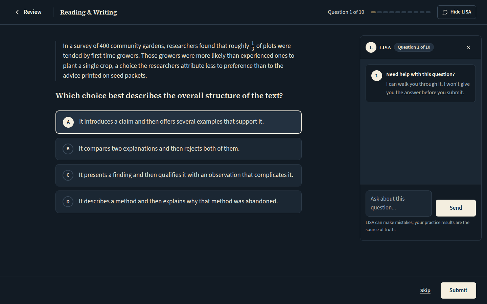 `/review/session/31fe6914-62a6-4564-a233-ad7798b418d0`, 119 KB, horizontal overflow 0px | , 33 KB |
| mobile | light | 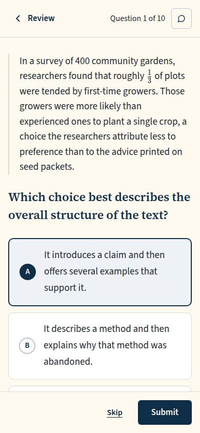 `/review/session/ceb68ee5-e2f1-4e26-888d-13dfffcadde1`, 72 KB, horizontal overflow 0px |  desktop prototype (no phone layout), 33 KB |
| mobile | dark | 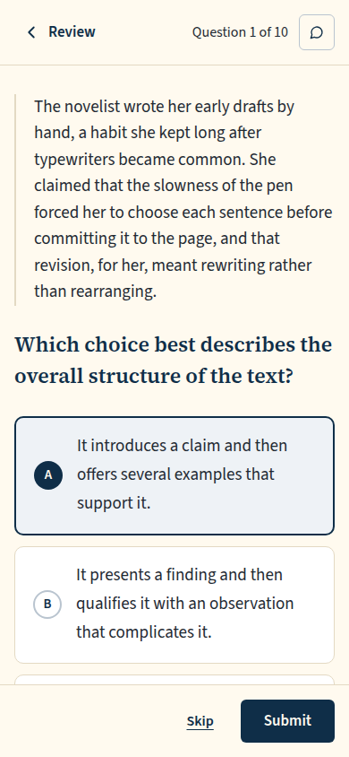 `/review/session/799eea5b-b428-4082-928c-1d94ebd22175`, 77 KB, horizontal overflow 0px |  desktop prototype (no phone layout), 33 KB |

## Review runner, answered right

Persona: `paid`. Route: `/review/session/{session}`.
Preset localStorage: `{"lyceon_client_instance_id":"student-harness-seed"}`.
Fresh session per capture (real create route, ended after the shot): `review {"mode":"filter","filters":{"sections":["RW"]},"target_count":10}`.
Step: pick the correct choice (resolved from the served item's stored order in the harness database).
Step: click `{"desktop":"[data-testid=\"runner-footer\"] button:has-text(\"Submit\")","mobile":"[data-testid=\"runner-footer\"] button:has-text(\"Submit\")"}`.
Prototype: `Runner.dc.html` (the correct (second) choice, then Submit); clicked: `[role="radio"] >> nth=1`, `button:has-text("Submit")`.

| Viewport | Theme (as rendered) | Built | Prototype |
|---|---|---|---|
| desktop | light | 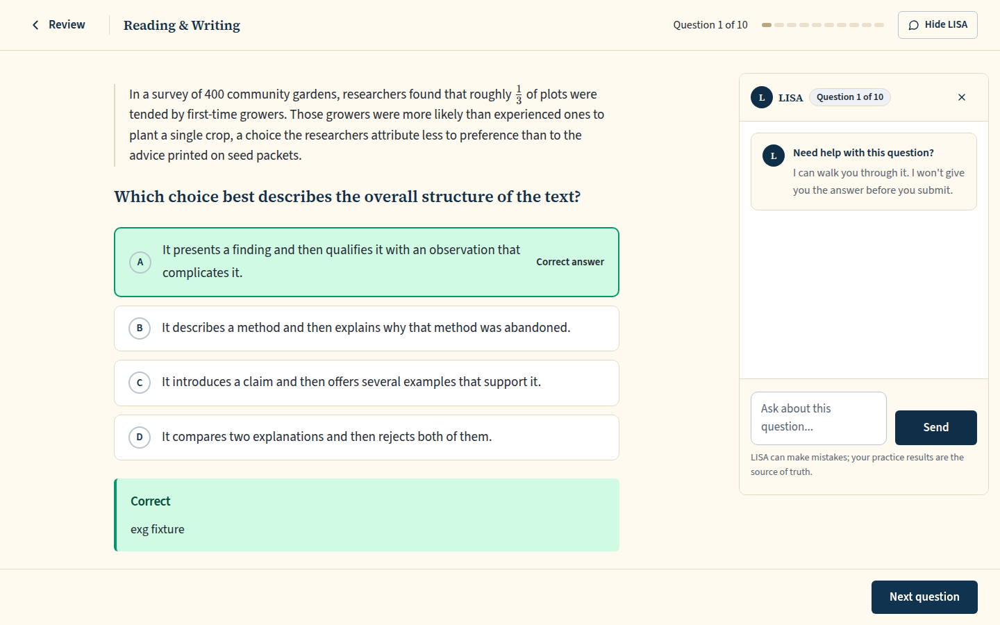 `/review/session/ae3aad39-8e8c-4c8c-9c88-2dd08d761fec`, 123 KB, horizontal overflow 0px | , 41 KB |
| desktop | dark | 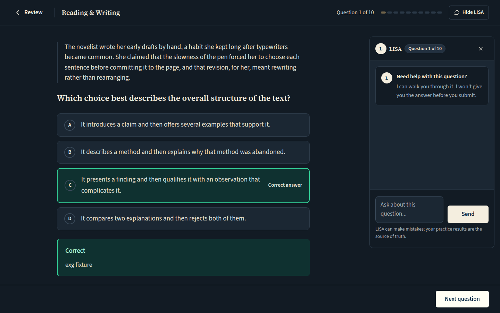 `/review/session/f22b2dad-0c99-4027-a6cc-7a2709d62604`, 126 KB, horizontal overflow 0px | , 42 KB |
| mobile | light | 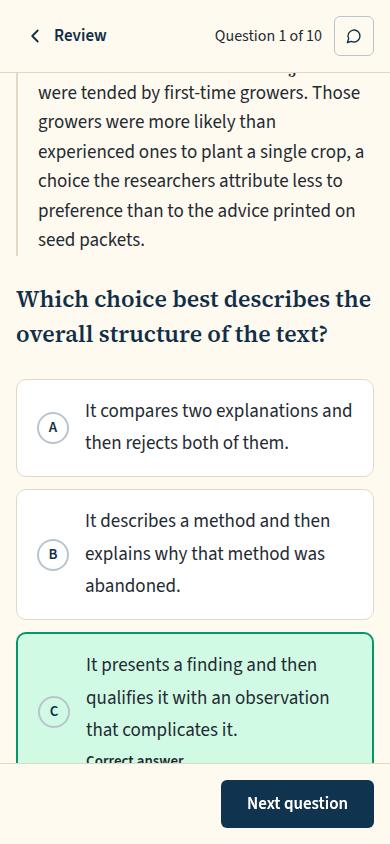 `/review/session/fb551ae6-8c29-4ff2-b6ed-68f7821e0756`, 75 KB, horizontal overflow 0px |  desktop prototype (no phone layout), 41 KB |
| mobile | dark | 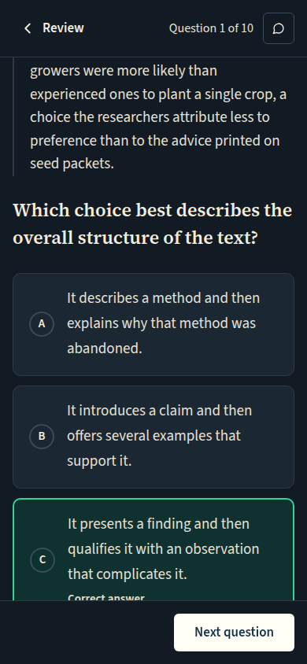 `/review/session/3701974f-4d08-4f74-84b7-0cb55c567789`, 82 KB, horizontal overflow 0px |  desktop prototype (no phone layout), 42 KB |

## Review runner, answered wrong (no review-queue note: the question is already in the queue)

Persona: `paid`. Route: `/review/session/{session}`.
Preset localStorage: `{"lyceon_client_instance_id":"student-harness-seed"}`.
Fresh session per capture (real create route, ended after the shot): `review {"mode":"filter","filters":{"sections":["RW"]},"target_count":10}`.
Step: pick the incorrect choice (resolved from the served item's stored order in the harness database).
Step: click `{"desktop":"[data-testid=\"runner-footer\"] button:has-text(\"Submit\")","mobile":"[data-testid=\"runner-footer\"] button:has-text(\"Submit\")"}`.
Prototype: `Runner.dc.html` (a wrong (first) choice, then Submit); clicked: `[role="radio"] >> nth=0`, `button:has-text("Submit")`.

| Viewport | Theme (as rendered) | Built | Prototype |
|---|---|---|---|
| desktop | light | 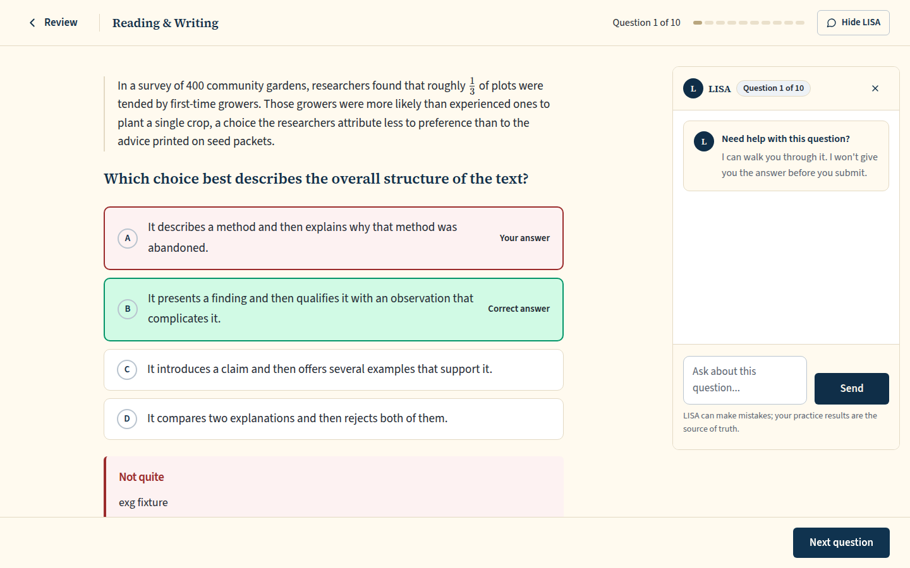 `/review/session/7cc3ac5d-99d1-42de-b90b-b6ec13447c21`, 126 KB, horizontal overflow 0px | , 46 KB |
| desktop | dark | 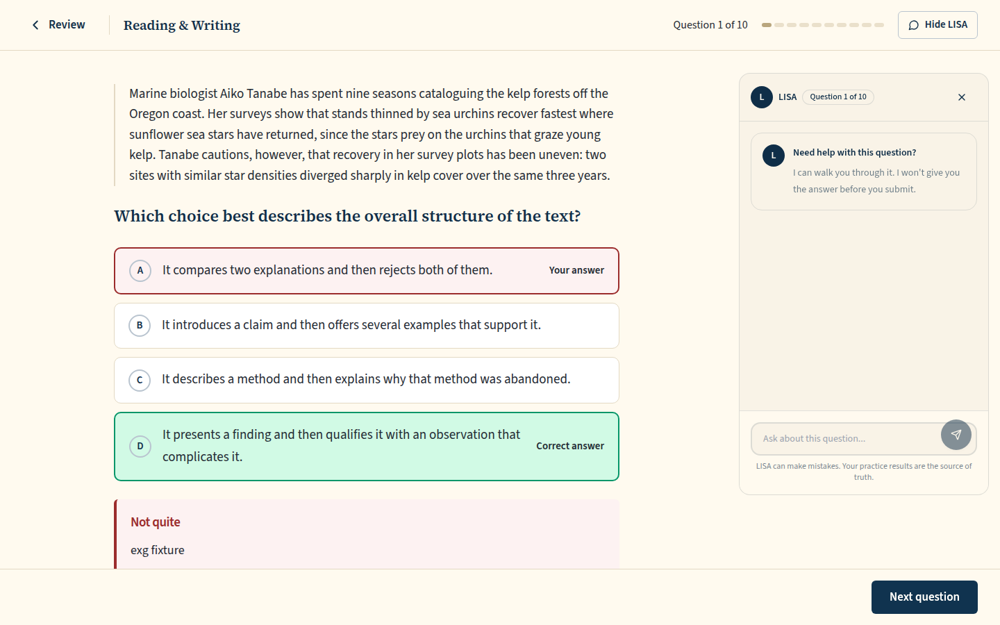 `/review/session/0243ab59-adc4-4f93-aad7-33446f98b8c3`, 141 KB, horizontal overflow 0px | , 48 KB |
| mobile | light | 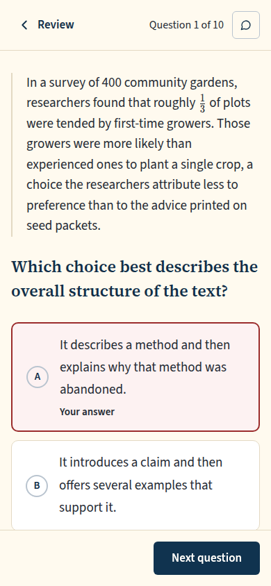 `/review/session/518adf10-cfa4-450c-9121-f21bc9bdb4ab`, 75 KB, horizontal overflow 0px |  desktop prototype (no phone layout), 46 KB |
| mobile | dark | 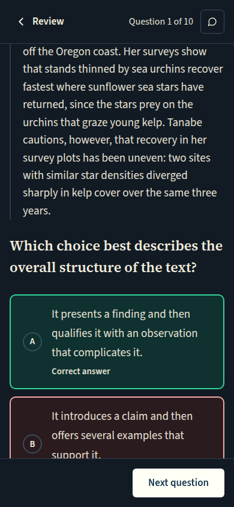 `/review/session/4c8eeb64-ceec-4ccf-b287-5f8cdf279c6d`, 82 KB, horizontal overflow 0px |  desktop prototype (no phone layout), 48 KB |

## Review runner, LISA panel in use (OQ-54 (a), ruling 2026-10-05: student tokens, follows the device theme): a first message typed and sent creates the item's conversation (real POST /api/tutor/conversations); the student's bubble and LISA's typing dots show in the panel. The turn request is held in the browser, so no turn runs. On a phone the panel stacks under the question; typing into it scrolls it into view

Persona: `paid`. Route: `/review/session/{session}`.
Preset localStorage: `{"lyceon_client_instance_id":"student-harness-seed"}`.
Fresh session per capture (real create route, ended after the shot): `review {"mode":"filter","filters":{"sections":["RW"]},"target_count":10}`.
Step: type `How should I start this one?` into `{"desktop":"[data-testid=\"scoped-tutor-panel\"] textarea[aria-label=\"Message\"]","mobile":"[data-testid=\"scoped-tutor-panel\"] textarea[aria-label=\"Message\"]"}`.
Step: click `{"desktop":"[data-testid=\"scoped-tutor-panel\"] button[aria-label=\"Send message\"]","mobile":"[data-testid=\"scoped-tutor-panel\"] button[aria-label=\"Send message\"]"}`.
Held: the browser's `POST /api/tutor/messages` is left unanswered through the screenshot, then aborted (it never reaches the server).
Must then show `[data-testid="scoped-tutor-panel"] [data-testid="lisa-typing"]` (the capture fails otherwise).
Prototype: none. Not prototyped: Runner.dc.html does not draw LISA (OQ-54 (d), ruling W4-4 keeps LISA in the review runner). The panel reuses the UI-56 thread parts (Lisa.dc.html).

| Viewport | Theme (as rendered) | Built | Prototype |
|---|---|---|---|
| desktop | light | 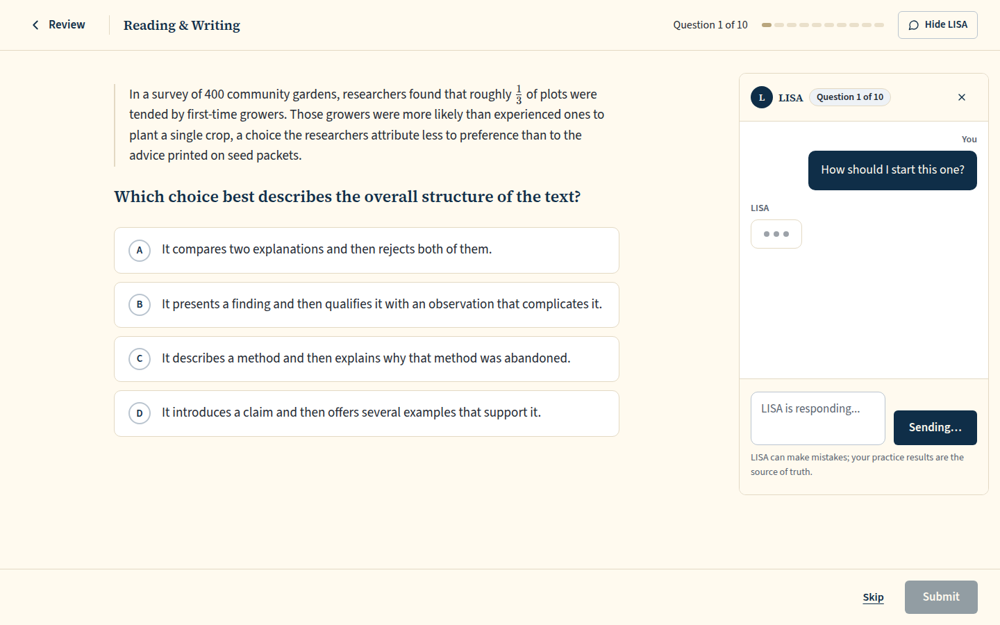 `/review/session/1e17d86b-6d43-429b-9a73-5324f4bb49a1`, 121 KB, horizontal overflow 0px | none |
| desktop | dark | 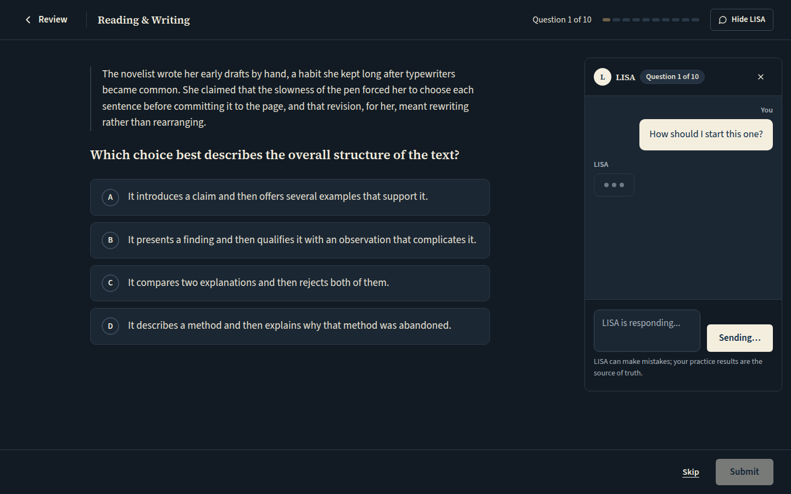 `/review/session/6bcb8a88-0257-4fbc-8d14-ba3c5de40dfd`, 126 KB, horizontal overflow 0px | none |
| mobile | light | 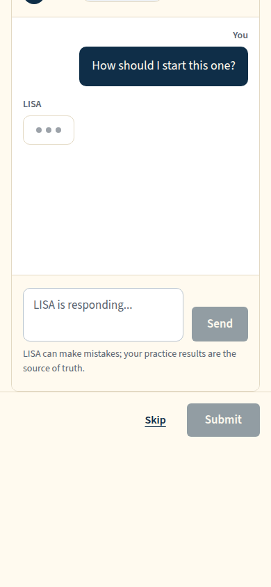 `/review/session/c9f346cb-9446-41d7-bb23-885deb9361ae`, 20 KB, horizontal overflow 0px | none |
| mobile | dark | 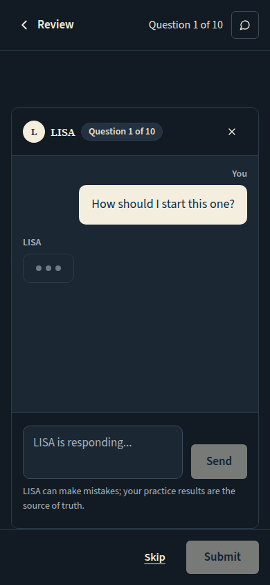 `/review/session/b8c31bc1-9243-4aae-88ad-02bfbfa05dbe`, 20 KB, horizontal overflow 0px | none |

## Review runner, free student: the server refuses LISA's on-load lookup, so the panel shows the LISA card (approved copy: LISA's headline and the prototype body, OQ-44) with Unlock LISA in place of the composer. The app's upgrade modal opens on the refusal (UI-44) and is closed with Not now before the shot; a click on the panel's question chip scrolls the panel into view (on a phone it stacks under the question)

Persona: `free`. Route: `/review/session/{session}`.
Preset localStorage: `{"lyceon_client_instance_id":"student-harness-seed"}`.
Fresh session per capture (real create route, ended after the shot): `review {"mode":"filter","filters":{"sections":["RW"]},"target_count":10}`.
Step: click `{"desktop":"[data-testid=\"upgrade-modal\"] button:has-text(\"Not now\")","mobile":"[data-testid=\"upgrade-modal\"] button:has-text(\"Not now\")"}`.
Step: click `{"desktop":"[data-testid=\"tutor-question-chip\"]","mobile":"[data-testid=\"tutor-question-chip\"]"}`.
Must then show `[data-testid="lisa-upgrade-unlock"]` (the capture fails otherwise).
Must then show no `[data-testid="upgrade-modal"]` (the capture fails otherwise).
Prototype: none. Not prototyped in the runner: the card is the Lisa.dc.html free card (plan = free) sized for the review runner's LISA panel.

| Viewport | Theme (as rendered) | Built | Prototype |
|---|---|---|---|
| desktop | light | 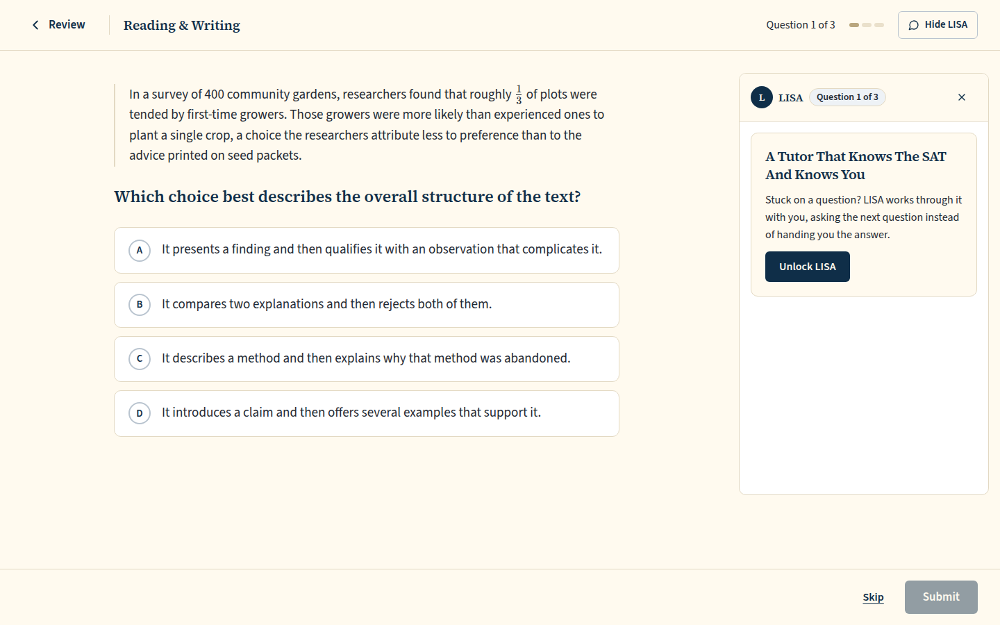 `/review/session/be8e5004-0531-44be-94ff-456a3ab3e0da`, 112 KB, horizontal overflow 0px | none |
| desktop | dark | 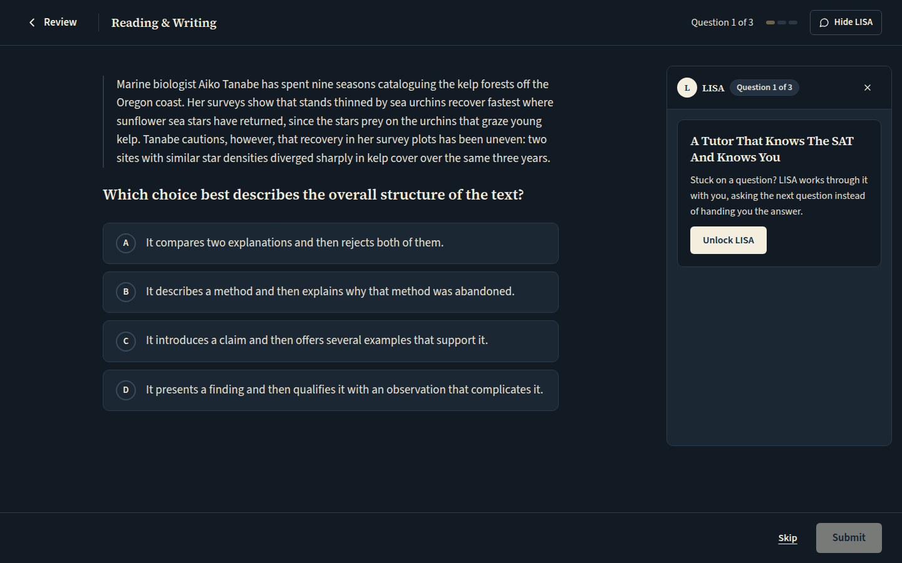 `/review/session/5d550eb3-d348-4569-9b30-53482bb69aeb`, 115 KB, horizontal overflow 0px | none |
| mobile | light | 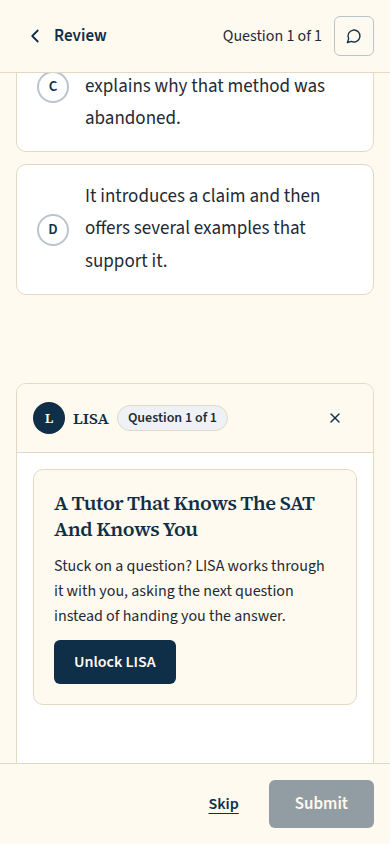 `/review/session/04a3380e-4c19-4aff-9530-1763bfadc98f`, 46 KB, horizontal overflow 0px | none |
| mobile | dark | 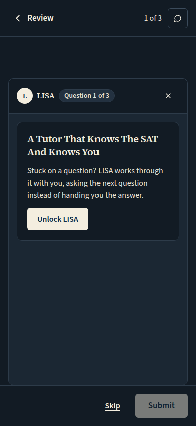 `/review/session/54659c74-6b77-4357-b2fd-5111af28767c`, 51 KB, horizontal overflow 0px | none |

## Practice runner, a session shorter than asked for: OQ-35's sentence, no number

Persona: `paid`. Route: `/practice/session/{session}`.
Preset localStorage: `{"lyceon_client_instance_id":"student-harness-seed"}`.
Fresh session per capture (real create route, ended after the shot): `practice {"sections":["M"],"domains":["Geometry and Trigonometry"],"target_question_count":30}`.
Prototype: none. Not prototyped: OQ-35's ruled sentence (owner ruling 2026-10-02), shown on the first question of a shortened session.

| Viewport | Theme (as rendered) | Built | Prototype |
|---|---|---|---|
| desktop | light | 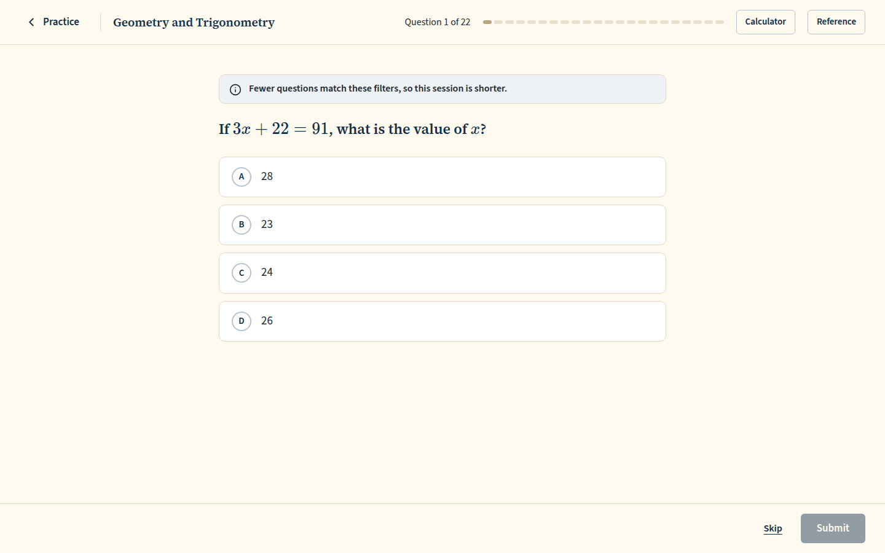 `/practice/session/fc79b91b-0b80-40fa-a5d0-5d1c90722850`, 42 KB, horizontal overflow 0px | none |
| desktop | dark | 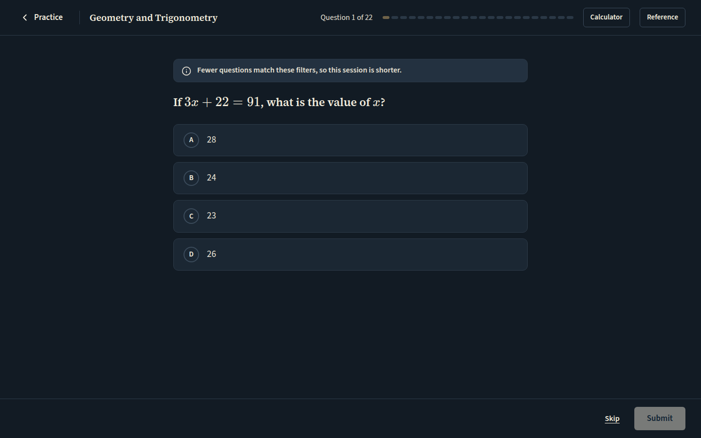 `/practice/session/af4e34dd-a447-42c4-b6aa-83a0ad20fe4b`, 42 KB, horizontal overflow 0px | none |
| mobile | light | 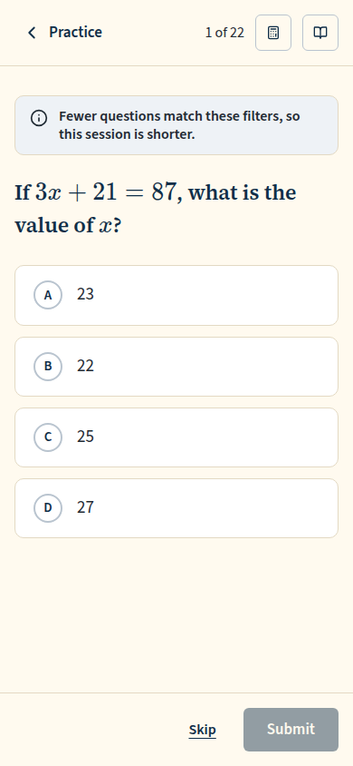 `/practice/session/d2e578e9-8e38-40c7-8a18-d85ef06cc9a9`, 32 KB, horizontal overflow 0px | none |
| mobile | dark | 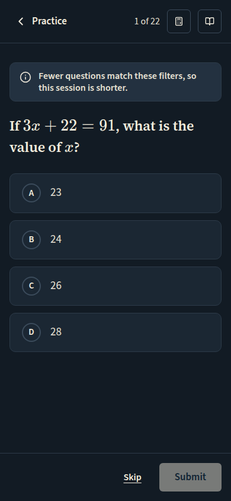 `/practice/session/5f5e973c-7fa7-447e-abbf-a34efc6374d3`, 33 KB, horizontal overflow 0px | none |

## Click path (practice): choose, Submit, Next question lands on 'Question 2 of M'

Persona: `paid`. Route: `/practice/session/{session}`.
Preset localStorage: `{"lyceon_client_instance_id":"student-harness-seed"}`.
Fresh session per capture (real create route, ended after the shot): `practice {"sections":["M"],"target_question_count":10}`.
Step: pick the first choice (resolved from the served item's stored order in the harness database).
Step: click `{"desktop":"[data-testid=\"runner-footer\"] button:has-text(\"Submit\")","mobile":"[data-testid=\"runner-footer\"] button:has-text(\"Submit\")"}`.
Step: click `{"desktop":"[data-testid=\"runner-footer\"] button:has-text(\"Next question\")","mobile":"[data-testid=\"runner-footer\"] button:has-text(\"Next question\")"}`.
Must then show the text `Question 2 of 10` (the capture fails otherwise).
Prototype: none. A click path: the screenshot is where Next landed, proven by the 'Question 2 of 10' text the capture waited for.

| Viewport | Theme (as rendered) | Built | Prototype |
|---|---|---|---|
| desktop | light |  `/practice/session/f324d791-29b1-4970-8ca1-2fba0a5f9e6b`, 38 KB, horizontal overflow 0px | none |
| desktop | dark |  `/practice/session/50d3a268-e504-4f24-9d2f-ef1e3e49b5f0`, 33 KB, horizontal overflow 0px | none |
| mobile | light | 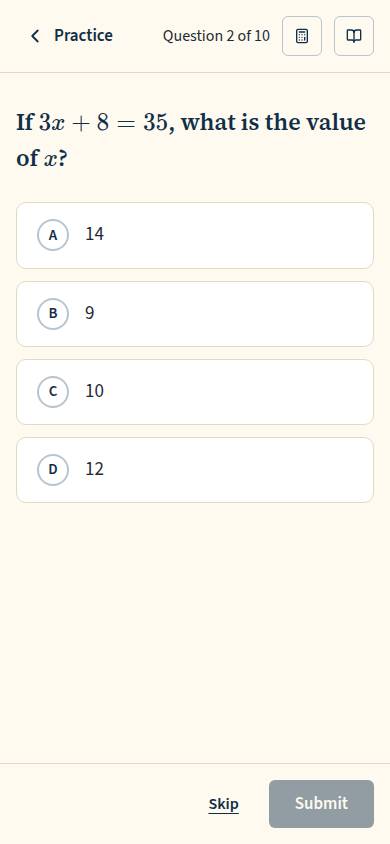 `/practice/session/6d54d516-dbfb-4b80-be47-2dae99c51ac2`, 25 KB, horizontal overflow 0px | none |
| mobile | dark | 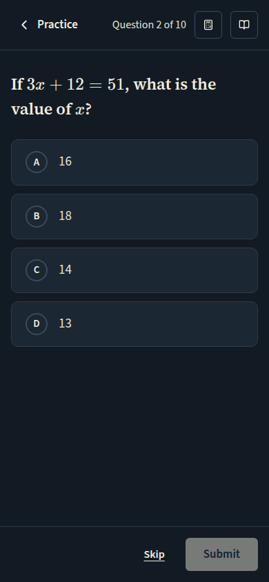 `/practice/session/94f7a60e-f0ff-4a90-8906-1ec00a769a5d`, 26 KB, horizontal overflow 0px | none |

## Run facts

- Seeded ids: `{"free":{"completedPracticeSessionId":"dbece675-1394-4ece-9ede-7c5ec0adde4d","openPracticeSessionId":"7ba1072d-a12d-43f2-904a-dca67fdfeff5","openReviewSessionId":null,"diagnosticSessionId":null,"scoredExamSessionId":null,"inProgressExamSessionId":null,"lisaConversationId":null,"answered":13},"paid":{"completedPracticeSessionId":"5a56f61d-b396-4ffe-99ef-b42f9acc3e33","openPracticeSessionId":"85fdb449-0920-464c-a3cb-8a839152a3d6","openReviewSessionId":null,"diagnosticSessionId":"51e92395-ab6e-4423-b97d-0ad390fd23ca","scoredExamSessionId":null,"inProgressExamSessionId":null,"lisaConversationId":null,"answered":53}}`
- Endpoints the pages asked for that the harness does not serve (answered 404): none
- External hosts blocked: `fonts.googleapis.com`
