# UI-53 Practice and review runners (Focus shell): selected, correct, incorrect, light and dark, 1440 and 390

Generated 2026-10-08T03:32:08.820Z by `pnpm exec tsx tests/e2e/student-harness/capture.ts UI-53` (see `tests/e2e/student-harness/README.md`). Built = a production build of the real client (`vite preview`, or the dev server with STUDENT_HARNESS_CLIENT=dev) against the student harness (real routers over a local Postgres built from this repo's migrations; personas seeded through the real practice routes). Prototype = the signed-off `docs/plans/student-ui/design/prototype/*.dc.html`, rendered locally.

Conditions, read before comparing:
- Viewport screenshots (not full page) unless the shot says full page: desktop 1440x900, phone 390x844, and any extra size a shot names.
- The prototypes are a fixed 1440x900 canvas with no phone layout; phone rows show the desktop prototype.
- Dark is requested through the app's own per-device setting; the theme column records what the page rendered.
- No external requests: the built app's Google Fonts (Inter, Poppins) are blocked, so legacy page bodies fall back to system faces; Source Sans 3 / Source Serif 4 are self-hosted and load for both sides.
- Prototype data is illustrative; built data is the seeded personas' real payloads.

## Practice runner, a choice selected (Submit enabled), before submitting

Persona: `paid`. Route: `/practice/session/{session}`.
Preset localStorage: `{"lyceon_client_instance_id":"student-harness-seed"}`.
Fresh session per capture (real create route, ended after the shot): `practice {"sections":["M"],"target_question_count":10}`.
Step: pick the first choice (resolved from the served item's stored order in the harness database).
Must fit the viewport (F-69): document no taller than the viewport, window unscrolled, `[data-testid="focus-shell-header"]` wholly in view, nothing to scroll in `main#main` (the capture fails otherwise); the measurement is under each built shot.
Prototype: `Runner.dc.html` (the first choice clicked); clicked: `[role="radio"] >> nth=0`.

| Viewport | Theme (as rendered) | Built | Prototype |
|---|---|---|---|
| desktop | light |  `/practice/session/d7c7f2db-c257-419f-9f1b-055511d1735f`, 32 KB, horizontal overflow 0px, document 900px in a 900px viewport, scrollY 0, top bar 0..73px, `main#main` 827px of content in 827px | , 33 KB |
| desktop | dark |  `/practice/session/3cc1240b-54c7-4fc7-9528-01309d8aedbf`, 33 KB, horizontal overflow 0px, document 900px in a 900px viewport, scrollY 0, top bar 0..73px, `main#main` 827px of content in 827px | , 33 KB |
| mobile | light |  `/practice/session/8df51948-368b-4f1e-8b37-7615f7a0c7ee`, 25 KB, horizontal overflow 0px, document 844px in a 844px viewport, scrollY 0, top bar 0..73px, `main#main` 771px of content in 771px |  desktop prototype (no phone layout), 33 KB |
| mobile | dark |  `/practice/session/ccd9ab19-91f8-4bb4-bc36-815c7f59f689`, 25 KB, horizontal overflow 0px, document 844px in a 844px viewport, scrollY 0, top bar 0..73px, `main#main` 771px of content in 771px |  desktop prototype (no phone layout), 33 KB |

## Practice runner, answered right: 'Correct answer' on the pick, the 'Correct' panel with the explanation, Next question

Persona: `paid`. Route: `/practice/session/{session}`.
Preset localStorage: `{"lyceon_client_instance_id":"student-harness-seed"}`.
Fresh session per capture (real create route, ended after the shot): `practice {"sections":["M"],"target_question_count":10}`.
Step: pick the correct choice (resolved from the served item's stored order in the harness database).
Step: click `{"desktop":"[data-testid=\"runner-footer\"] button:has-text(\"Submit\")","mobile":"[data-testid=\"runner-footer\"] button:has-text(\"Submit\")"}`.
Prototype: `Runner.dc.html` (the correct (second) choice, then Submit); clicked: `[role="radio"] >> nth=1`, `button:has-text("Submit")`.

| Viewport | Theme (as rendered) | Built | Prototype |
|---|---|---|---|
| desktop | light |  `/practice/session/1ae60048-e520-45d3-85aa-48f281fe31c5`, 38 KB, horizontal overflow 0px | , 41 KB |
| desktop | dark |  `/practice/session/4bfc119f-7a82-4772-9e17-b6c34ae15df4`, 38 KB, horizontal overflow 0px | , 42 KB |
| mobile | light |  `/practice/session/95996f69-fc25-4436-9dab-17b8dfb53b9b`, 30 KB, horizontal overflow 0px |  desktop prototype (no phone layout), 41 KB |
| mobile | dark |  `/practice/session/7c5f4663-d1f2-44d4-ae7d-7334d65a451c`, 31 KB, horizontal overflow 0px |  desktop prototype (no phone layout), 42 KB |

## Practice runner, answered wrong: 'Your answer' and 'Correct answer' tags, 'Not quite', the explanation, the review-queue note

Persona: `paid`. Route: `/practice/session/{session}`.
Preset localStorage: `{"lyceon_client_instance_id":"student-harness-seed"}`.
Fresh session per capture (real create route, ended after the shot): `practice {"sections":["M"],"target_question_count":10}`.
Step: pick the incorrect choice (resolved from the served item's stored order in the harness database).
Step: click `{"desktop":"[data-testid=\"runner-footer\"] button:has-text(\"Submit\")","mobile":"[data-testid=\"runner-footer\"] button:has-text(\"Submit\")"}`.
Prototype: `Runner.dc.html` (a wrong (first) choice, then Submit); clicked: `[role="radio"] >> nth=0`, `button:has-text("Submit")`.

| Viewport | Theme (as rendered) | Built | Prototype |
|---|---|---|---|
| desktop | light |  `/practice/session/87198767-383e-4d29-a25b-9b9906fd3f6c`, 43 KB, horizontal overflow 0px | , 46 KB |
| desktop | dark |  `/practice/session/f5e72c26-ccbe-48ec-bf5b-26f21fa18c7b`, 45 KB, horizontal overflow 0px | , 48 KB |
| mobile | light |  `/practice/session/5c97720a-8d06-4e6f-85e9-95a122f388e6`, 35 KB, horizontal overflow 0px |  desktop prototype (no phone layout), 46 KB |
| mobile | dark |  `/practice/session/78bc5cfe-3090-43cc-9165-240d1e7bf55e`, 35 KB, horizontal overflow 0px |  desktop prototype (no phone layout), 48 KB |

## Review runner, a choice selected, before submitting (LISA beside the question at 1440)

Persona: `paid`. Route: `/review/session/{session}`.
Preset localStorage: `{"lyceon_client_instance_id":"student-harness-seed"}`.
Fresh session per capture (real create route, ended after the shot): `review {"mode":"filter","filters":{"sections":["RW"]},"target_count":10}`.
Step: pick the first choice (resolved from the served item's stored order in the harness database).
Must fit the viewport (F-69): document no taller than the viewport, window unscrolled, `[data-testid="focus-shell-header"]` wholly in view, nothing to scroll in `main#main` (the capture fails otherwise); the measurement is under each built shot.
Prototype: `Runner.dc.html` (the first choice clicked (the canvas draws the practice runner; there is no review canvas)); clicked: `[role="radio"] >> nth=0`.

| Viewport | Theme (as rendered) | Built | Prototype |
|---|---|---|---|
| desktop | light |  `/review/session/be8af85d-5dd0-42b9-9a38-25db77cfab1f`, 116 KB, horizontal overflow 0px, document 900px in a 900px viewport, scrollY 0, top bar 0..73px, `main#main` 827px of content in 827px | , 33 KB |
| desktop | dark |  `/review/session/33f9359c-f1a3-4b85-b2bd-f89ad7f782dc`, 120 KB, horizontal overflow 0px, document 900px in a 900px viewport, scrollY 0, top bar 0..73px, `main#main` 827px of content in 827px | , 33 KB |
| mobile | light |  `/review/session/1fa919b9-a4d0-4277-aeb7-bf56194757ee`, 72 KB, horizontal overflow 0px, document 844px in a 844px viewport, scrollY 0, top bar 0..73px, `main#main` 771px of content in 771px |  desktop prototype (no phone layout), 33 KB |
| mobile | dark |  `/review/session/63e1ed9c-b209-44ad-a048-39678a183531`, 76 KB, horizontal overflow 0px, document 844px in a 844px viewport, scrollY 0, top bar 0..73px, `main#main` 771px of content in 771px |  desktop prototype (no phone layout), 33 KB |

## Review runner, answered right

Persona: `paid`. Route: `/review/session/{session}`.
Preset localStorage: `{"lyceon_client_instance_id":"student-harness-seed"}`.
Fresh session per capture (real create route, ended after the shot): `review {"mode":"filter","filters":{"sections":["RW"]},"target_count":10}`.
Step: pick the correct choice (resolved from the served item's stored order in the harness database).
Step: click `{"desktop":"[data-testid=\"runner-footer\"] button:has-text(\"Submit\")","mobile":"[data-testid=\"runner-footer\"] button:has-text(\"Submit\")"}`.
Prototype: `Runner.dc.html` (the correct (second) choice, then Submit); clicked: `[role="radio"] >> nth=1`, `button:has-text("Submit")`.

| Viewport | Theme (as rendered) | Built | Prototype |
|---|---|---|---|
| desktop | light |  `/review/session/47837a59-f0fc-4c14-9dc4-2bead554c7b5`, 123 KB, horizontal overflow 0px | , 41 KB |
| desktop | dark |  `/review/session/b66b5e32-3ca4-42c4-a433-d369cb71b318`, 124 KB, horizontal overflow 0px | , 42 KB |
| mobile | light |  `/review/session/b8151e5e-eb4c-4d14-9580-275a71654342`, 71 KB, horizontal overflow 0px |  desktop prototype (no phone layout), 41 KB |
| mobile | dark |  `/review/session/8766ad08-8077-4e97-b9b0-5710aa8da3d4`, 74 KB, horizontal overflow 0px |  desktop prototype (no phone layout), 42 KB |

## Review runner, answered wrong (no review-queue note: the question is already in the queue)

Persona: `paid`. Route: `/review/session/{session}`.
Preset localStorage: `{"lyceon_client_instance_id":"student-harness-seed"}`.
Fresh session per capture (real create route, ended after the shot): `review {"mode":"filter","filters":{"sections":["RW"]},"target_count":10}`.
Step: pick the incorrect choice (resolved from the served item's stored order in the harness database).
Step: click `{"desktop":"[data-testid=\"runner-footer\"] button:has-text(\"Submit\")","mobile":"[data-testid=\"runner-footer\"] button:has-text(\"Submit\")"}`.
Prototype: `Runner.dc.html` (a wrong (first) choice, then Submit); clicked: `[role="radio"] >> nth=0`, `button:has-text("Submit")`.

| Viewport | Theme (as rendered) | Built | Prototype |
|---|---|---|---|
| desktop | light |  `/review/session/4f2d8acd-f87f-43f8-a2a4-48018b0f10f2`, 125 KB, horizontal overflow 0px | , 46 KB |
| desktop | dark |  `/review/session/fe18a6d0-fce6-4867-b105-668bedc7cf9d`, 141 KB, horizontal overflow 0px | , 48 KB |
| mobile | light |  `/review/session/2d59557a-39cc-4602-a237-5436f8261243`, 73 KB, horizontal overflow 0px |  desktop prototype (no phone layout), 46 KB |
| mobile | dark |  `/review/session/794f1723-e43a-434b-92ef-f90f6a14edf1`, 75 KB, horizontal overflow 0px |  desktop prototype (no phone layout), 48 KB |

## Review runner, LISA panel in use (OQ-54 (a), ruling 2026-10-05: student tokens, follows the device theme): a first message typed and sent creates the item's conversation (real POST /api/tutor/conversations); the student's bubble and LISA's typing dots show in the panel, and Send reads 'Sending…' (QA 2026-10-07 item 5). The turn request is held in the browser, so no turn runs. On a phone the panel stacks under the question; typing into it scrolls it into view

Persona: `paid`. Route: `/review/session/{session}`.
Preset localStorage: `{"lyceon_client_instance_id":"student-harness-seed"}`.
Fresh session per capture (real create route, ended after the shot): `review {"mode":"filter","filters":{"sections":["RW"]},"target_count":10}`.
Step: click `{"desktop":null,"mobile":"[data-testid=\"practice-tutor-toggle\"]"}`.
Step: type `How should I start this one?` into `{"desktop":"[data-testid=\"scoped-tutor-panel\"] textarea[aria-label=\"Message\"]","mobile":"[data-testid=\"scoped-tutor-panel\"] textarea[aria-label=\"Message\"]"}`.
Step: click `{"desktop":"[data-testid=\"scoped-tutor-panel\"] button[aria-label=\"Send message\"]","mobile":"[data-testid=\"scoped-tutor-panel\"] button[aria-label=\"Send message\"]"}`.
Held: the browser's `POST /api/tutor/messages` is left unanswered through the screenshot, then aborted (it never reaches the server).
Must then show `[data-testid="scoped-tutor-panel"] button[aria-label="Send message"][data-pending="true"]` (the capture fails otherwise).
Must fit the viewport (F-69): document no taller than the viewport, window unscrolled, `[data-testid="focus-shell-header"]` wholly in view, nothing to scroll in `main#main` (the capture fails otherwise); the measurement is under each built shot.
Prototype: none. Not prototyped: Runner.dc.html does not draw LISA (OQ-54 (d), ruling W4-4 keeps LISA in the review runner). The panel reuses the UI-56 thread parts (Lisa.dc.html).

| Viewport | Theme (as rendered) | Built | Prototype |
|---|---|---|---|
| desktop | light |  `/review/session/f32371a3-aaff-48a0-9113-4c0134ffb694`, 110 KB, horizontal overflow 0px, document 900px in a 900px viewport, scrollY 0, top bar 0..73px, `main#main` 827px of content in 827px | none |
| desktop | dark |  `/review/session/4e5e8818-2cb4-43f9-af59-d319e523721c`, 113 KB, horizontal overflow 0px, document 900px in a 900px viewport, scrollY 0, top bar 0..73px, `main#main` 827px of content in 827px | none |
| mobile | light |  `/review/session/a2b5316a-fc37-4196-9c9d-966806dbb5a8`, 27 KB, horizontal overflow 0px, document 844px in a 844px viewport, scrollY 0, top bar 0..73px, `main#main` 771px of content in 771px | none |
| mobile | dark |  `/review/session/c2870fce-60fb-419b-a983-ac6ae06f2f1b`, 27 KB, horizontal overflow 0px, document 844px in a 844px viewport, scrollY 0, top bar 0..73px, `main#main` 771px of content in 771px | none |

## Review runner, the LISA composer focused (F-69, owner ruling 2026-10-05): the Focus shell's top bar stays in view and the document is the viewport's height (no blank band under the footer); on a phone the focus scrolls the panel into view inside the shell, never the window

Persona: `paid`. Route: `/review/session/{session}`.
Preset localStorage: `{"lyceon_client_instance_id":"student-harness-seed"}`.
Fresh session per capture (real create route, ended after the shot): `review {"mode":"filter","filters":{"sections":["RW"]},"target_count":10}`.
Step: click `{"desktop":null,"mobile":"[data-testid=\"practice-tutor-toggle\"]"}`.
Step: focus `{"desktop":"[data-testid=\"scoped-tutor-panel\"] textarea[aria-label=\"Message\"]","mobile":"[data-testid=\"scoped-tutor-panel\"] textarea[aria-label=\"Message\"]"}` (no typing).
Must fit the viewport (F-69): document no taller than the viewport, window unscrolled, `[data-testid="focus-shell-header"]` wholly in view, nothing to scroll in `main#main` (the capture fails otherwise); the measurement is under each built shot.
Prototype: none. Not prototyped: Runner.dc.html does not draw LISA (OQ-54 (d)). F-69's proof shot: the shell's top bar with the composer focused.

| Viewport | Theme (as rendered) | Built | Prototype |
|---|---|---|---|
| desktop | light |  `/review/session/80d730e8-f3ba-425a-8399-02f6164b0cc1`, 117 KB, horizontal overflow 0px, document 900px in a 900px viewport, scrollY 0, top bar 0..73px, `main#main` 827px of content in 827px | none |
| desktop | dark |  `/review/session/e7026e18-85d3-42f1-88a0-021b83c5e523`, 120 KB, horizontal overflow 0px, document 900px in a 900px viewport, scrollY 0, top bar 0..73px, `main#main` 827px of content in 827px | none |
| mobile | light |  `/review/session/7f7ec856-1d8d-42a0-972a-b6305d019879`, 33 KB, horizontal overflow 0px, document 844px in a 844px viewport, scrollY 0, top bar 0..73px, `main#main` 771px of content in 771px | none |
| mobile | dark |  `/review/session/ded194d3-cc5d-487e-8a09-4ab496a01beb`, 33 KB, horizontal overflow 0px, document 844px in a 844px viewport, scrollY 0, top bar 0..73px, `main#main` 771px of content in 771px | none |

## QA 2026-10-07 item 8 and QA2-D (2026-10-08): at 1440 LISA hidden with the bar's toggle, then shown again beside the question (nothing scrolls). On a phone LISA starts closed, and one tap on the bar's LISA icon opens it scrolled into view inside the shell, its header at the top of the runner's scroll area

Persona: `paid`. Route: `/review/session/{session}`.
Preset localStorage: `{"lyceon_client_instance_id":"student-harness-seed"}`.
Fresh session per capture (real create route, ended after the shot): `review {"mode":"filter","filters":{"sections":["RW"]},"target_count":10}`.
Step: click `{"desktop":"[data-testid=\"practice-tutor-toggle\"]","mobile":null}`.
Step: click `{"desktop":"[data-testid=\"practice-tutor-toggle\"]","mobile":"[data-testid=\"practice-tutor-toggle\"]"}`.
Must then show `[data-testid="scoped-tutor-panel"]` (the capture fails otherwise).
Must then have `[data-testid="scoped-tutor-panel"]` in view: its top edge inside the viewport (the capture fails otherwise).
Must fit the viewport (F-69): document no taller than the viewport, window unscrolled, `[data-testid="focus-shell-header"]` wholly in view, nothing to scroll in `main#main` (the capture fails otherwise); the measurement is under each built shot.
Prototype: none. Not prototyped: Runner.dc.html does not draw LISA (OQ-54 (d)). QA item 8's proof shot: Show LISA on a phone brings the panel into view.

| Viewport | Theme (as rendered) | Built | Prototype |
|---|---|---|---|
| desktop | light |  `/review/session/fe58650a-77df-4c0b-ac9d-e6f4809c4304`, 116 KB, horizontal overflow 0px, document 900px in a 900px viewport, scrollY 0, top bar 0..73px, `main#main` 827px of content in 827px | none |
| desktop | dark |  `/review/session/3b825132-602c-483b-bd66-03e0309a1b8e`, 119 KB, horizontal overflow 0px, document 900px in a 900px viewport, scrollY 0, top bar 0..73px, `main#main` 827px of content in 827px | none |
| mobile | light |  `/review/session/6be39007-f3fb-4a5a-af4b-ddf887db3af1`, 32 KB, horizontal overflow 0px, document 844px in a 844px viewport, scrollY 0, top bar 0..73px, `main#main` 771px of content in 771px | none |
| mobile | dark |  `/review/session/c0d15323-9c57-4bad-8270-916631cc6c11`, 33 KB, horizontal overflow 0px, document 844px in a 844px viewport, scrollY 0, top bar 0..73px, `main#main` 771px of content in 771px | none |

## QA2-D (Karl, 2026-10-08: "tapping the icon always brings it into view"): on a phone LISA opened, then the runner scrolled back up to the question (the first choice focused), then the LISA icon tapped again: the open panel is brought back into view, not closed. Desktop: LISA beside the question, untouched (control)

Persona: `paid`. Route: `/review/session/{session}`.
Preset localStorage: `{"lyceon_client_instance_id":"student-harness-seed"}`.
Fresh session per capture (real create route, ended after the shot): `review {"mode":"filter","filters":{"sections":["RW"]},"target_count":10}`.
Step: click `{"desktop":null,"mobile":"[data-testid=\"practice-tutor-toggle\"]"}`.
Step: focus `{"desktop":null,"mobile":"[data-testid=\"runner-choice\"]"}` (no typing).
Step: click `{"desktop":null,"mobile":"[data-testid=\"practice-tutor-toggle\"]"}`.
Must then show `[data-testid="scoped-tutor-panel"]` (the capture fails otherwise).
Must then have `[data-testid="scoped-tutor-panel"]` in view: its top edge inside the viewport (the capture fails otherwise).
Must fit the viewport (F-69): document no taller than the viewport, window unscrolled, `[data-testid="focus-shell-header"]` wholly in view, nothing to scroll in `main#main` (the capture fails otherwise); the measurement is under each built shot.
Prototype: none. Not prototyped: Runner.dc.html does not draw LISA (OQ-54 (d)).

| Viewport | Theme (as rendered) | Built | Prototype |
|---|---|---|---|
| desktop | light | 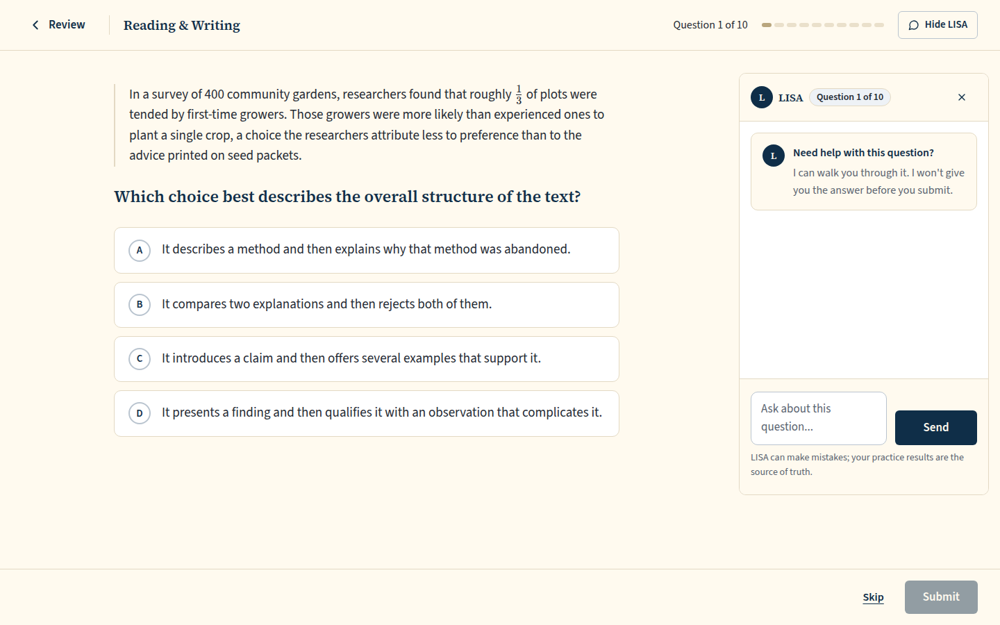 `/review/session/c952d13f-7317-4d81-899f-0884e6cd5b9e`, 116 KB, horizontal overflow 0px, document 900px in a 900px viewport, scrollY 0, top bar 0..73px, `main#main` 827px of content in 827px | none |
| desktop | dark |  `/review/session/444c1137-7baf-4d4e-ac23-994d0de6d8f0`, 119 KB, horizontal overflow 0px, document 900px in a 900px viewport, scrollY 0, top bar 0..73px, `main#main` 827px of content in 827px | none |
| mobile | light |  `/review/session/ce70c292-c664-4c2c-84b8-dd80b35a7289`, 32 KB, horizontal overflow 0px, document 844px in a 844px viewport, scrollY 0, top bar 0..73px, `main#main` 771px of content in 771px | none |
| mobile | dark | 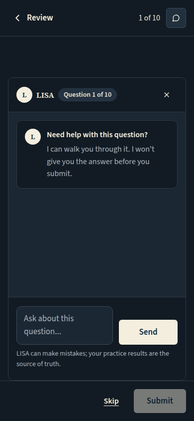 `/review/session/e8755a83-e0dc-4b7a-8a96-3a43274cfb14`, 32 KB, horizontal overflow 0px, document 844px in a 844px viewport, scrollY 0, top bar 0..73px, `main#main` 771px of content in 771px | none |

## Review runner, free student: the server refuses LISA's on-load lookup, so the panel shows the LISA card (approved copy: LISA's headline and the prototype body, OQ-44) with Unlock LISA in place of the composer. The app's upgrade modal opens on the refusal (UI-44) and is closed with Not now before the shot; a click on the panel's question chip scrolls the panel into view (on a phone it stacks under the question)

Persona: `free`. Route: `/review/session/{session}`.
Preset localStorage: `{"lyceon_client_instance_id":"student-harness-seed"}`.
Fresh session per capture (real create route, ended after the shot): `review {"mode":"filter","filters":{"sections":["RW"]},"target_count":10}`.
Step: click `{"desktop":null,"mobile":"[data-testid=\"practice-tutor-toggle\"]"}`.
Step: click `{"desktop":"[data-testid=\"upgrade-modal\"] button:has-text(\"Not now\")","mobile":"[data-testid=\"upgrade-modal\"] button:has-text(\"Not now\")"}`.
Step: click `{"desktop":"[data-testid=\"tutor-question-chip\"]","mobile":"[data-testid=\"tutor-question-chip\"]"}`.
Must then show `[data-testid="lisa-upgrade-unlock"]` (the capture fails otherwise).
Must then show no `[data-testid="upgrade-modal"]` (the capture fails otherwise).
Prototype: none. Not prototyped in the runner: the card is the Lisa.dc.html free card (plan = free) sized for the review runner's LISA panel.

| Viewport | Theme (as rendered) | Built | Prototype |
|---|---|---|---|
| desktop | light |  `/review/session/f5fd5b24-472a-4a03-bd8e-9c9f28121446`, 126 KB, horizontal overflow 0px | none |
| desktop | dark |  `/review/session/8ef63637-a89c-4dc5-b252-f976b1738108`, 131 KB, horizontal overflow 0px | none |
| mobile | light |  `/review/session/c9d1edd0-59fe-47fd-ba6d-ee932baefe6c`, 29 KB, horizontal overflow 0px | none |
| mobile | dark |  `/review/session/acfe15c4-fb62-4204-bead-061af038dfe5`, 30 KB, horizontal overflow 0px | none |

## QA2-B (Karl, 2026-10-08: "Desmos: invertedColors when the app theme is dark"): the practice runner with the Graphing calculator open. Dark: Desmos draws inverted (dark) to match the page; light: Desmos's own light look. Desmos itself shows only in a run with STUDENT_HARNESS_DESMOS=1 (see Run facts)

Persona: `paid`. Route: `/practice/session/{session}`.
Preset localStorage: `{"lyceon_client_instance_id":"student-harness-seed"}`.
Fresh session per capture (real create route, ended after the shot): `practice {"sections":["M"],"target_question_count":10}`.
Step: click `{"desktop":"[data-testid=\"practice-calculator-toggle\"]","mobile":"[data-testid=\"practice-calculator-toggle\"]"}`.
Must then show `[data-testid="desmos-calculator"]` (the capture fails otherwise).
Also shot at w1024 1024x768 (the desktop steps and selectors).
Prototype: none. Not prototyped: Runner.dc.html draws no calculator content; Desmos's own UI is Desmos's.

| Viewport | Theme (as rendered) | Built | Prototype |
|---|---|---|---|
| desktop | light | 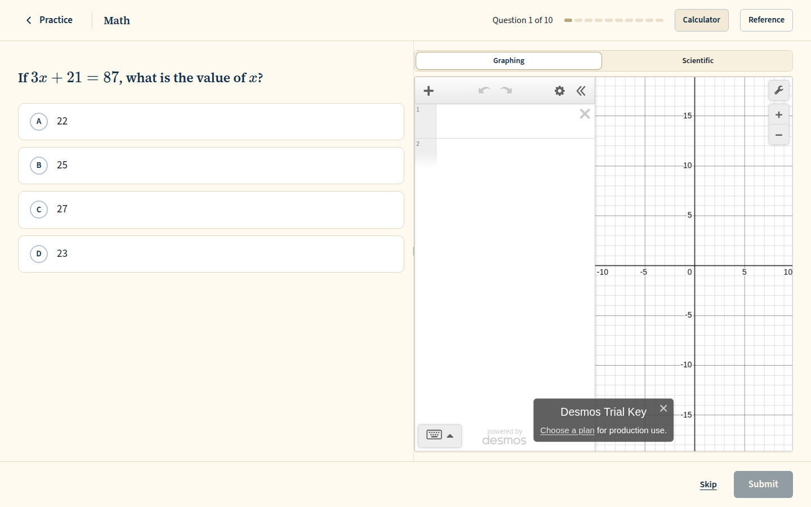 `/practice/session/cdeada82-1edb-4e77-a5de-68912aabbec8`, 72 KB, horizontal overflow 0px | none |
| desktop | dark | 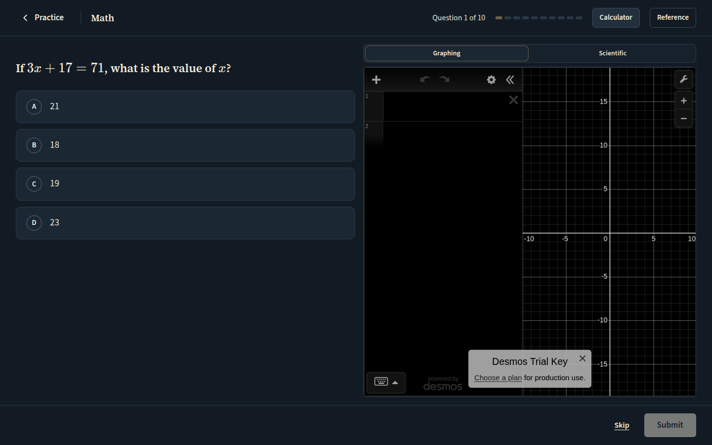 `/practice/session/fc405d83-1c00-4d02-8759-8a67aa7d2154`, 68 KB, horizontal overflow 0px | none |
| mobile | light | 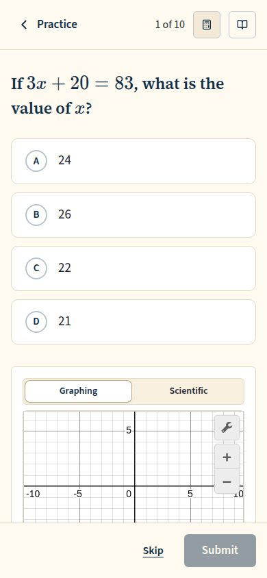 `/practice/session/4e4ab762-401a-4a7f-b7e8-f57dae1bea74`, 33 KB, horizontal overflow 0px | none |
| mobile | dark | 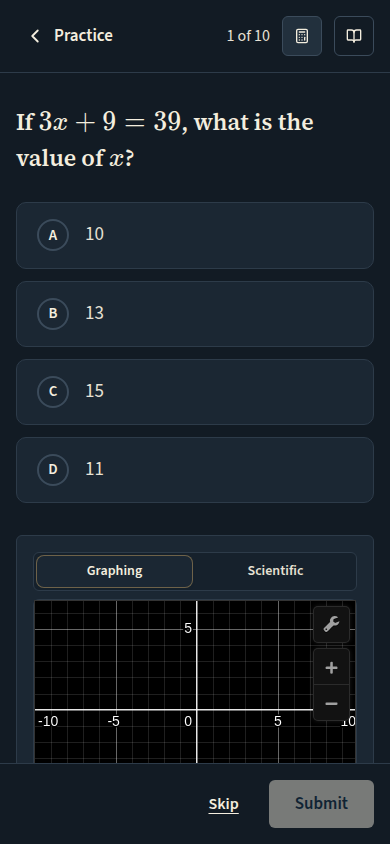 `/practice/session/c9269938-438d-4eba-abc9-2719d8183c90`, 32 KB, horizontal overflow 0px | none |
| w1024 | light | 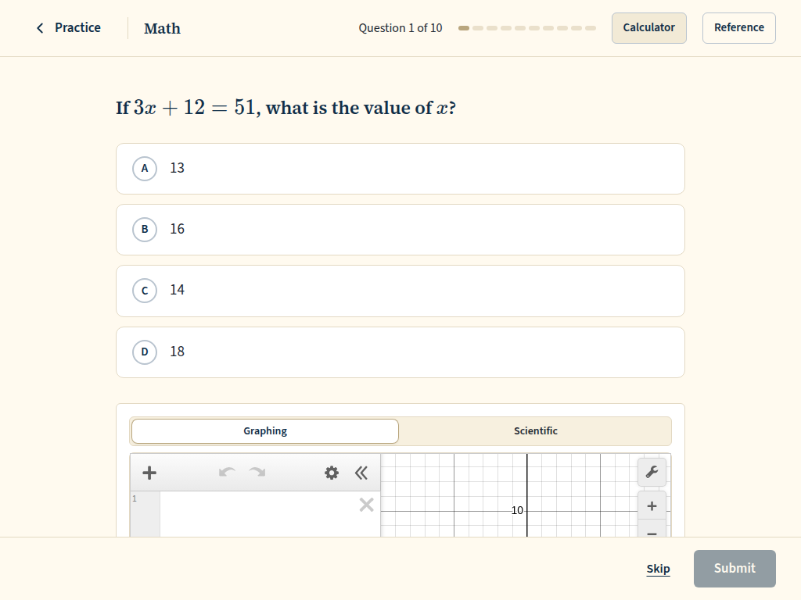 `/practice/session/d3787bd0-3c29-49f5-8d58-dec99ea15c6a`, 39 KB, horizontal overflow 0px | none |
| w1024 | dark | 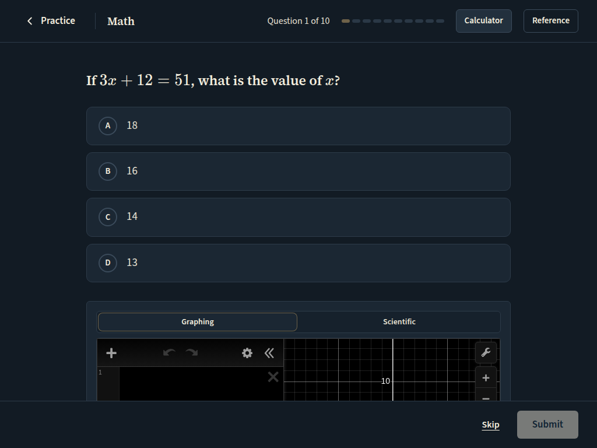 `/practice/session/fc928135-2b6d-442c-b4f6-943d8f6c14ef`, 41 KB, horizontal overflow 0px | none |

## QA2-B: the same runner with the calculator switched to Scientific (our mode switch, then Desmos's scientific calculator, inverted in dark)

Persona: `paid`. Route: `/practice/session/{session}`.
Preset localStorage: `{"lyceon_client_instance_id":"student-harness-seed"}`.
Fresh session per capture (real create route, ended after the shot): `practice {"sections":["M"],"target_question_count":10}`.
Step: click `{"desktop":"[data-testid=\"practice-calculator-toggle\"]","mobile":"[data-testid=\"practice-calculator-toggle\"]"}`.
Step: click `{"desktop":"[data-testid=\"desmos-mode-scientific\"]","mobile":"[data-testid=\"desmos-mode-scientific\"]"}`.
Must then show `[data-testid="desmos-mode-scientific"][aria-checked="true"]` (the capture fails otherwise).
Also shot at w1024 1024x768 (the desktop steps and selectors).
Prototype: none. Not prototyped: Runner.dc.html draws no calculator content; Desmos's own UI is Desmos's.

| Viewport | Theme (as rendered) | Built | Prototype |
|---|---|---|---|
| desktop | light | 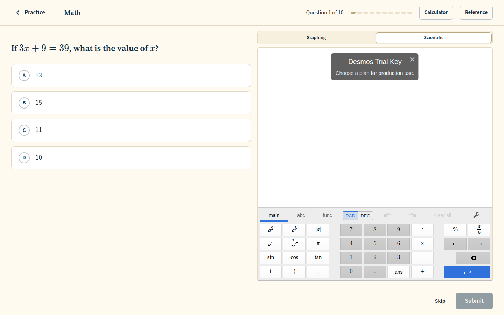 `/practice/session/db85b4d8-b898-4654-acca-5cfa43602626`, 60 KB, horizontal overflow 0px | none |
| desktop | dark | 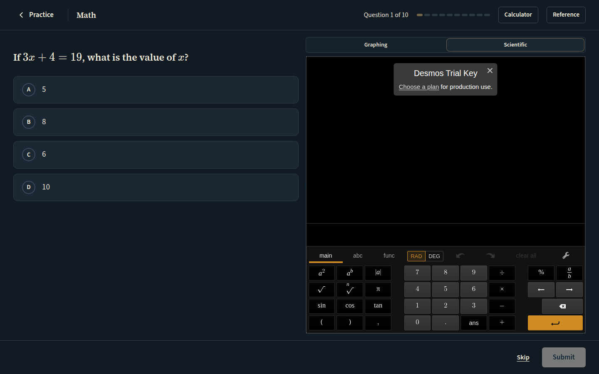 `/practice/session/30180158-a66c-4179-a75b-3358974362af`, 60 KB, horizontal overflow 0px | none |
| mobile | light | 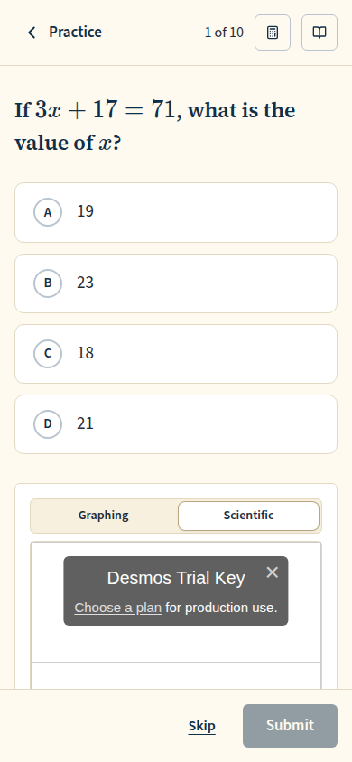 `/practice/session/bcbeb7cf-ee05-4c0e-bf1d-4235dd846a03`, 34 KB, horizontal overflow 0px | none |
| mobile | dark | 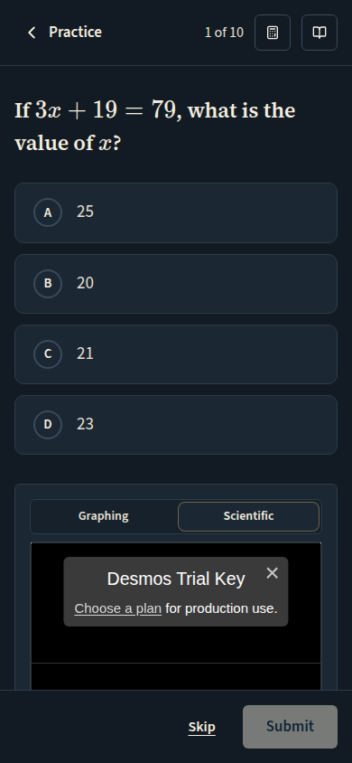 `/practice/session/4ca78525-ddde-4483-b530-70d3ebf73ffb`, 35 KB, horizontal overflow 0px | none |
| w1024 | light | 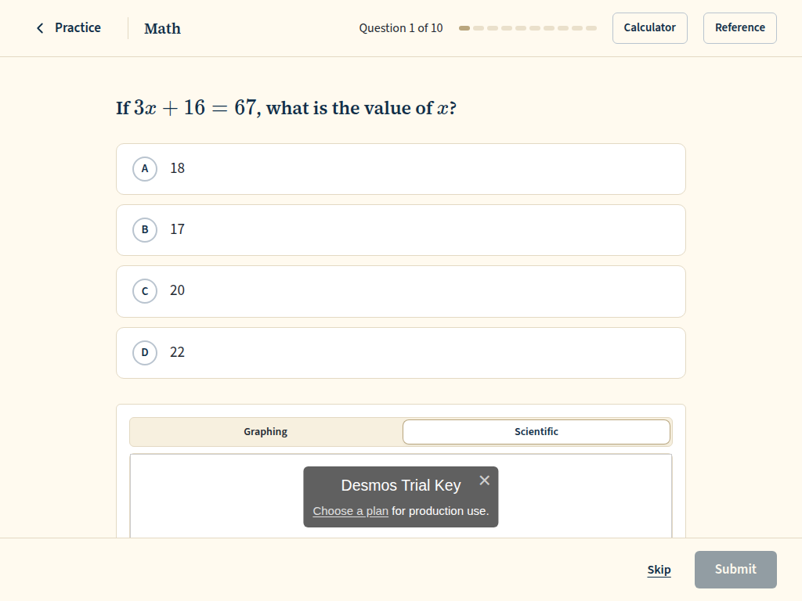 `/practice/session/05eff52c-9218-42b1-b36f-ab4cafa12929`, 41 KB, horizontal overflow 0px | none |
| w1024 | dark | 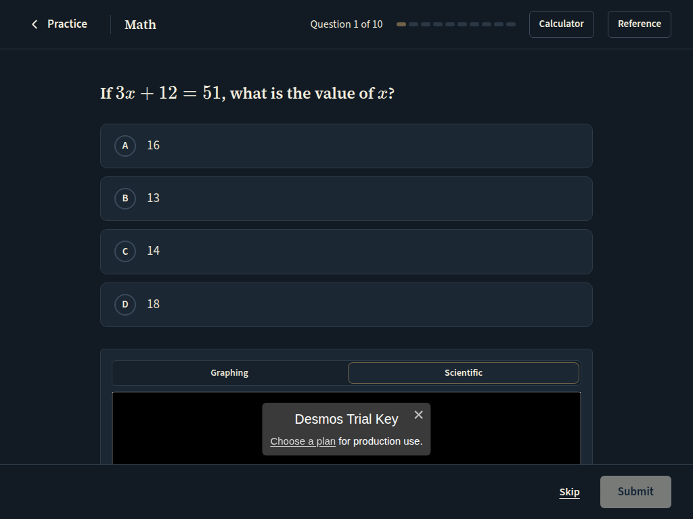 `/practice/session/c56eef73-87b8-4873-bd42-3fbb06265ef0`, 41 KB, horizontal overflow 0px | none |

## QA2-D (Karl, 2026-10-08: "Phone: the LISA panel defaults closed"): the review runner on load. At 390 (LISA stacks under the question) the panel is closed and the bar's LISA icon offers it; at 1024 and 1440 LISA is beside the question, open, as before

Persona: `paid`. Route: `/review/session/{session}`.
Preset localStorage: `{"lyceon_client_instance_id":"student-harness-seed"}`.
Fresh session per capture (real create route, ended after the shot): `review {"mode":"filter","filters":{"sections":["RW"]},"target_count":10}`.
Also shot at w1024 1024x768 (the desktop steps and selectors).
Prototype: none. Not prototyped: Runner.dc.html does not draw LISA (OQ-54 (d)).

| Viewport | Theme (as rendered) | Built | Prototype |
|---|---|---|---|
| desktop | light | 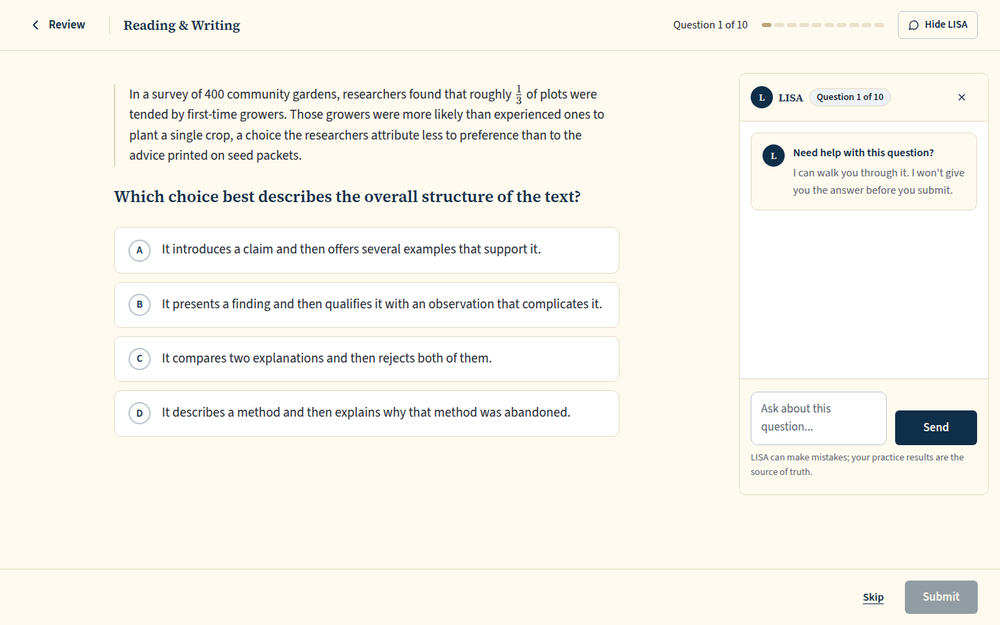 `/review/session/876585ff-3c3b-43b5-b555-5aa39e1ce428`, 116 KB, horizontal overflow 0px | none |
| desktop | dark | 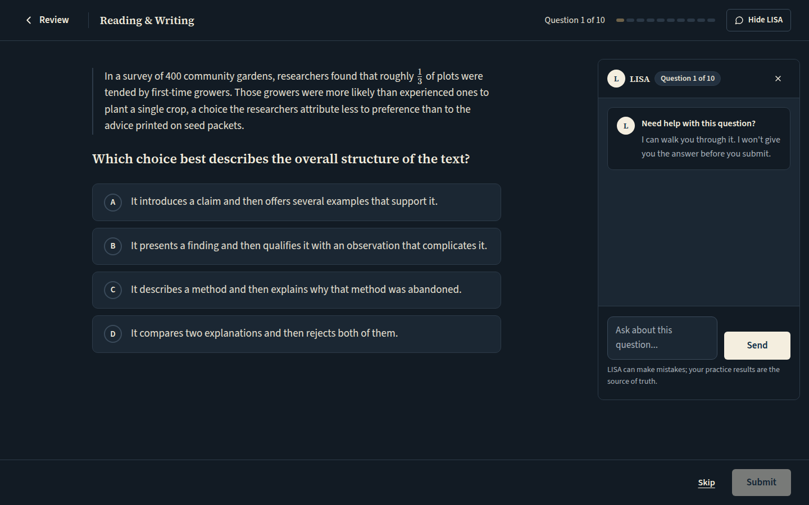 `/review/session/34e7e03c-a42d-4c4b-94e7-fc20fbd1a8d0`, 119 KB, horizontal overflow 0px | none |
| mobile | light | 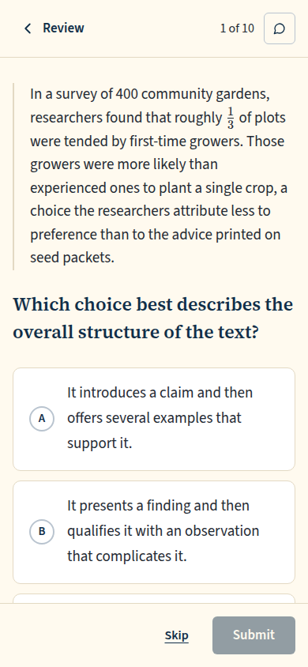 `/review/session/654dad77-bad3-496f-820e-ede812599820`, 70 KB, horizontal overflow 0px | none |
| mobile | dark | 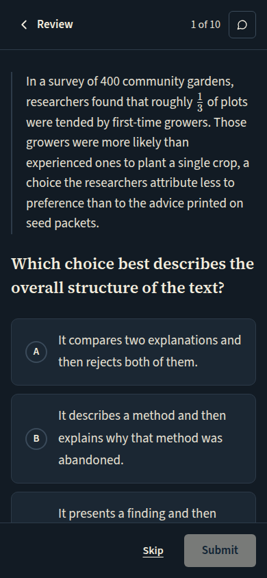 `/review/session/0125a995-ad22-41e3-9169-123b62eddac6`, 74 KB, horizontal overflow 0px | none |
| w1024 | light | 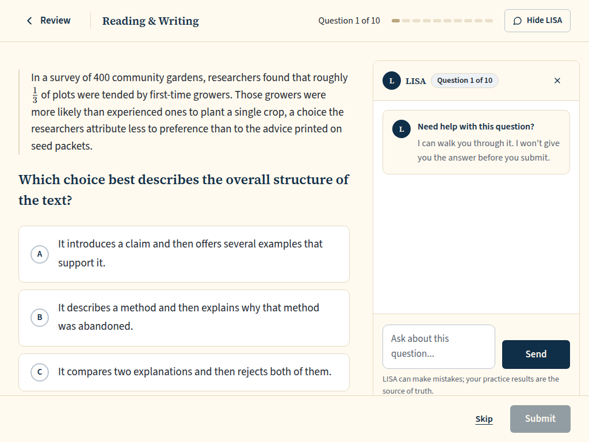 `/review/session/a54b1ce8-9e0c-4b99-ae6a-58f227b449df`, 109 KB, horizontal overflow 0px | none |
| w1024 | dark | 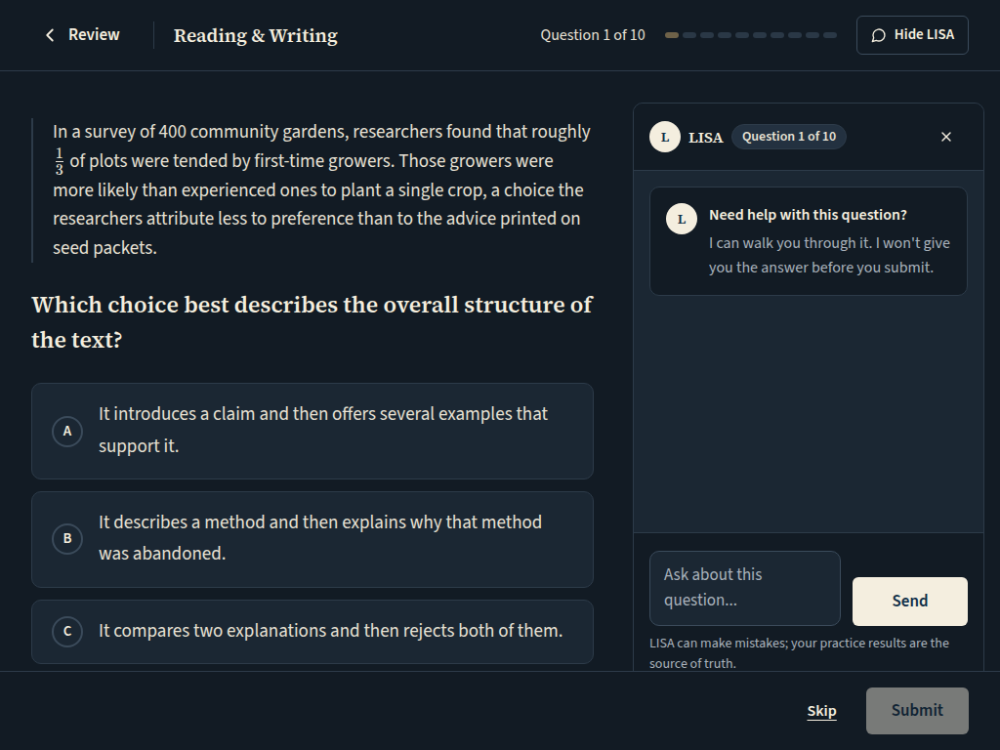 `/review/session/59ef541f-edfe-4aec-8021-6899b922ce8a`, 112 KB, horizontal overflow 0px | none |

## Practice runner, a session shorter than asked for: OQ-35's sentence, no number

Persona: `paid`. Route: `/practice/session/{session}`.
Preset localStorage: `{"lyceon_client_instance_id":"student-harness-seed"}`.
Fresh session per capture (real create route, ended after the shot): `practice {"sections":["M"],"domains":["Geometry and Trigonometry"],"target_question_count":30}`.
Prototype: none. Not prototyped: OQ-35's ruled sentence (owner ruling 2026-10-02), shown on the first question of a shortened session.

| Viewport | Theme (as rendered) | Built | Prototype |
|---|---|---|---|
| desktop | light |  `/practice/session/d4ff0a30-8853-4ad6-ac13-48e76b364001`, 42 KB, horizontal overflow 0px | none |
| desktop | dark |  `/practice/session/a50192bf-bec9-40ec-a4e7-4d42d40fe940`, 43 KB, horizontal overflow 0px | none |
| mobile | light |  `/practice/session/662d69f8-df31-4781-81ce-bb6b601b945d`, 31 KB, horizontal overflow 0px | none |
| mobile | dark |  `/practice/session/e30ae6a8-522c-4685-8628-5ee28f628e20`, 32 KB, horizontal overflow 0px | none |

## Click path (practice): choose, Submit, Next question lands on 'Question 2 of M'

Persona: `paid`. Route: `/practice/session/{session}`.
Preset localStorage: `{"lyceon_client_instance_id":"student-harness-seed"}`.
Fresh session per capture (real create route, ended after the shot): `practice {"sections":["M"],"target_question_count":10}`.
Step: pick the first choice (resolved from the served item's stored order in the harness database).
Step: click `{"desktop":"[data-testid=\"runner-footer\"] button:has-text(\"Submit\")","mobile":"[data-testid=\"runner-footer\"] button:has-text(\"Submit\")"}`.
Step: click `{"desktop":"[data-testid=\"runner-footer\"] button:has-text(\"Next question\")","mobile":"[data-testid=\"runner-footer\"] button:has-text(\"Next question\")"}`.
Must then show the text `Question 2 of 10` (the capture fails otherwise).
Prototype: none. A click path: the screenshot is where Next landed, proven by the 'Question 2 of 10' text the capture waited for.

| Viewport | Theme (as rendered) | Built | Prototype |
|---|---|---|---|
| desktop | light |  `/practice/session/028b4f6c-df76-4c01-8f18-e7df9d279117`, 33 KB, horizontal overflow 0px | none |
| desktop | dark |  `/practice/session/d9f3bd5c-0b92-475c-9164-c8d890b2eaa7`, 40 KB, horizontal overflow 0px | none |
| mobile | light |  `/practice/session/c1f8449c-a806-48e2-aaee-d0f45b08545e`, 31 KB, horizontal overflow 0px | none |
| mobile | dark |  `/practice/session/e0a23115-0b29-4130-8584-fdf1c7cf476b`, 25 KB, horizontal overflow 0px | none |

## QA item 5: Skip pressed, the skip held in flight: 'Skipping…' with a spinner, Skip and Submit disabled

Persona: `paid`. Route: `/practice/session/{session}`.
Preset localStorage: `{"lyceon_client_instance_id":"student-harness-seed"}`.
Fresh session per capture (real create route, ended after the shot): `practice {"sections":["M"],"target_question_count":10}`.
Step: click `{"desktop":"[data-testid=\"runner-skip\"]","mobile":"[data-testid=\"runner-skip\"]"}`.
Held: the browser's `POST /api/practice/sessions/*/skip` is left unanswered through the screenshot, then aborted (it never reaches the server).
Must then show `[data-testid="runner-skip"][aria-busy="true"]` (the capture fails otherwise).
Prototype: none. A pending state the prototype does not draw (owner QA list, 2026-10-07, item 5).

| Viewport | Theme (as rendered) | Built | Prototype |
|---|---|---|---|
| desktop | light |  `/practice/session/106a84b5-de79-423c-a73e-1e864c9dda89`, 34 KB, horizontal overflow 0px | none |
| desktop | dark |  `/practice/session/1e3564c1-6fd6-4717-bae7-4f40cf6a0a0d`, 35 KB, horizontal overflow 0px | none |
| mobile | light |  `/practice/session/e9b9b005-3050-4ddf-a70a-24b73e7ae855`, 25 KB, horizontal overflow 0px | none |
| mobile | dark |  `/practice/session/4c99e5f3-6221-4372-8429-2b363013c1d0`, 26 KB, horizontal overflow 0px | none |

## Run facts

- Seeded ids: `{"free":{"completedPracticeSessionId":"7967f52e-11eb-4fa6-b44f-3e76741f24ea","openPracticeSessionId":"b69899f8-d20c-4bcd-ba69-2d2f70733e6c","openReviewSessionId":null,"diagnosticSessionId":null,"scoredExamSessionId":null,"inProgressExamSessionId":null,"lisaConversationId":null,"answered":13},"paid":{"completedPracticeSessionId":"293c9250-d898-461c-a2a5-518744c4c2a6","openPracticeSessionId":"ca4411ed-940a-4741-aa9b-952ff9f81e95","openReviewSessionId":null,"diagnosticSessionId":"04e3a291-3372-480c-a980-4d9e2b5fb8c9","scoredExamSessionId":null,"inProgressExamSessionId":null,"lisaConversationId":null,"answered":53}}`
- Endpoints the pages asked for that the harness does not serve (answered 404): none
- Desmos (QA2-B, opt-in `STUDENT_HARNESS_DESMOS=1`): the real calculator script, fetched once from `www.desmos.com` and answered from a local cache
- External hosts blocked: none
