# UI-54 Full-Length home (/tests), the exam report and the timed module: free and paid, light and dark, 1440 and 390

Generated 2026-10-07T21:07:20.535Z by `pnpm exec tsx tests/e2e/student-harness/capture.ts UI-54` (see `tests/e2e/student-harness/README.md`). Built = a production build of the real client (`vite preview`, or the dev server with STUDENT_HARNESS_CLIENT=dev) against the student harness (real routers over a local Postgres built from this repo's migrations; personas seeded through the real practice routes). Prototype = the signed-off `docs/plans/student-ui/design/prototype/*.dc.html`, rendered locally.

Conditions, read before comparing:
- Viewport screenshots (not full page) unless the shot says full page: desktop 1440x900, phone 390x844, and any extra size a shot names.
- The prototypes are a fixed 1440x900 canvas with no phone layout; phone rows show the desktop prototype.
- Dark is requested through the app's own per-device setting; the theme column records what the page rendered.
- No external requests: the built app's Google Fonts (Inter, Poppins) are blocked, so legacy page bodies fall back to system faces; Source Sans 3 / Source Serif 4 are self-hosted and load for both sides.
- Prototype data is illustrative; built data is the seeded personas' real payloads.

## Full-Length, free: the in-page upgrade card; panel: the locked mastery card. No gated request

Persona: `free`. Route: `/tests`.
Must then show `[data-testid="tests-upgrade-card"]` (the capture fails otherwise).
Prototype: `FullLength.dc.html` (Full-Length, plan = free).

| Viewport | Theme (as rendered) | Built | Prototype |
|---|---|---|---|
| desktop | light | 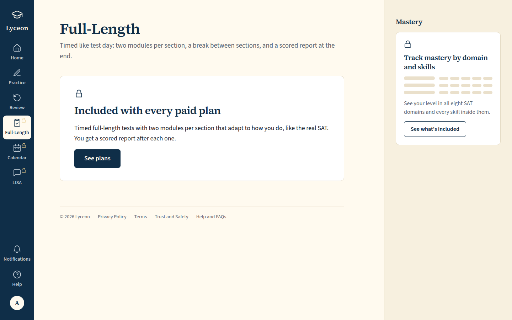 `/tests`, 84 KB, horizontal overflow 0px | 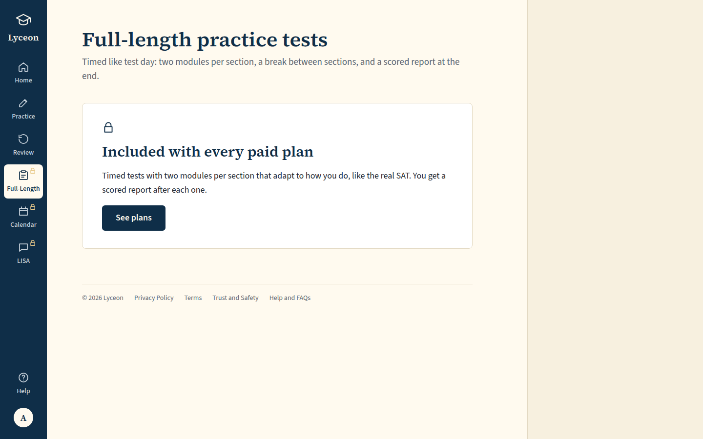, 67 KB |
| desktop | dark | 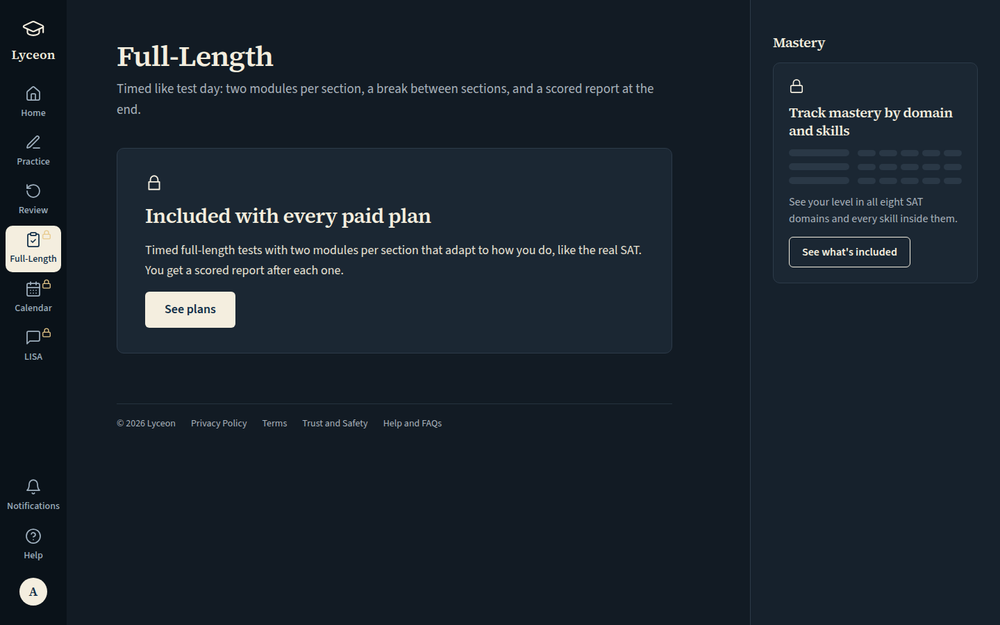 `/tests`, 85 KB, horizontal overflow 0px | 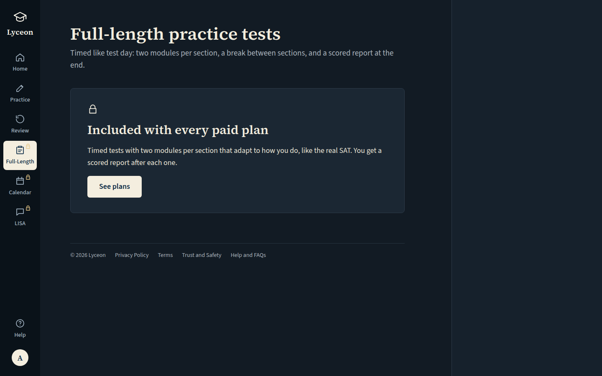, 68 KB |
| mobile | light | 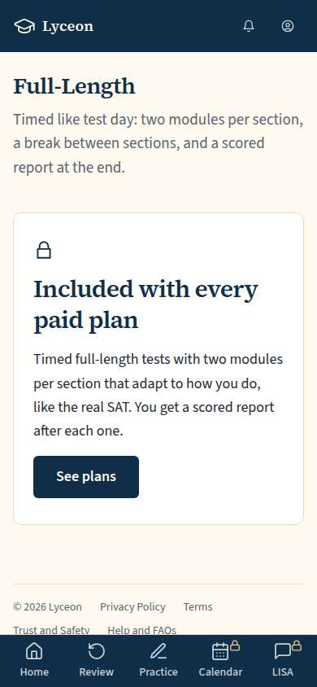 `/tests`, 58 KB, horizontal overflow 0px |  desktop prototype (no phone layout), 67 KB |
| mobile | dark | 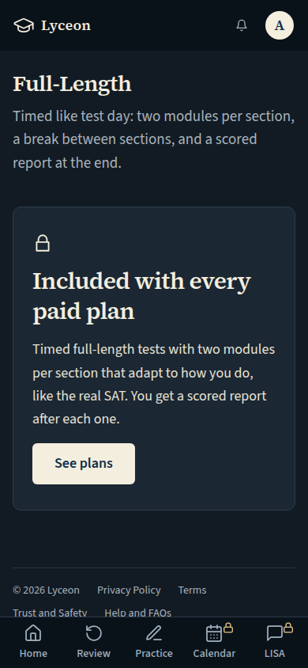 `/tests`, 58 KB, horizontal overflow 0px |  desktop prototype (no phone layout), 68 KB |

## Full-Length, paid: Full-Length Test 1 scored (score + disclosure), Full-Length Test 2 in progress (Resume, the one primary), Full-Length Test 3 not started; Before you start; panel: score history and mastery

Persona: `paid`. Route: `/tests`.
Must then show the text `In progress: Reading & Writing, Module 2` (the capture fails otherwise).
Prototype: `FullLength.dc.html` (Full-Length, plan = paid).

| Viewport | Theme (as rendered) | Built | Prototype |
|---|---|---|---|
| desktop | light | 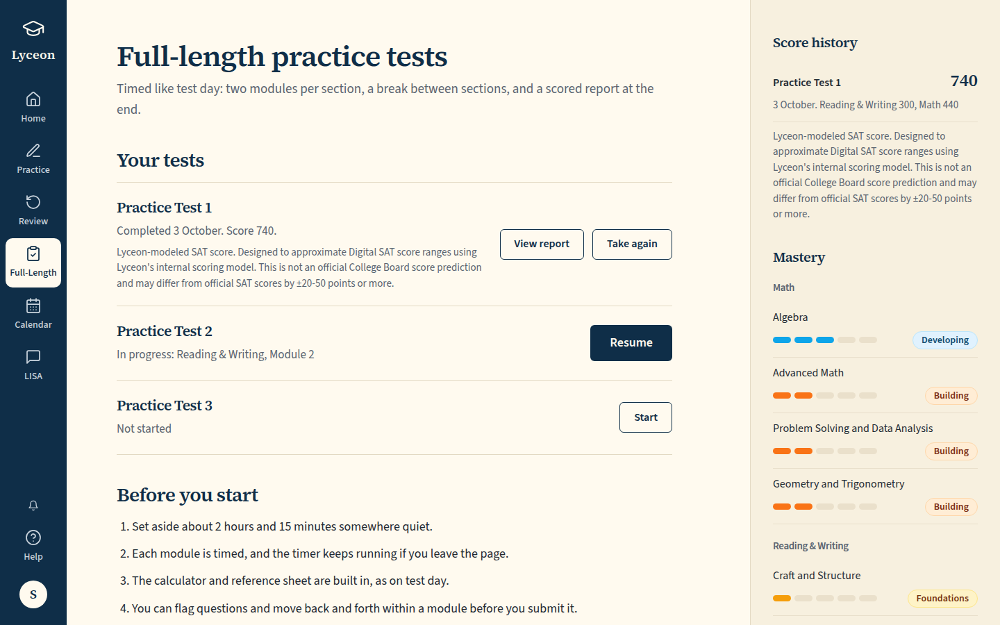 `/tests`, 164 KB, horizontal overflow 0px | 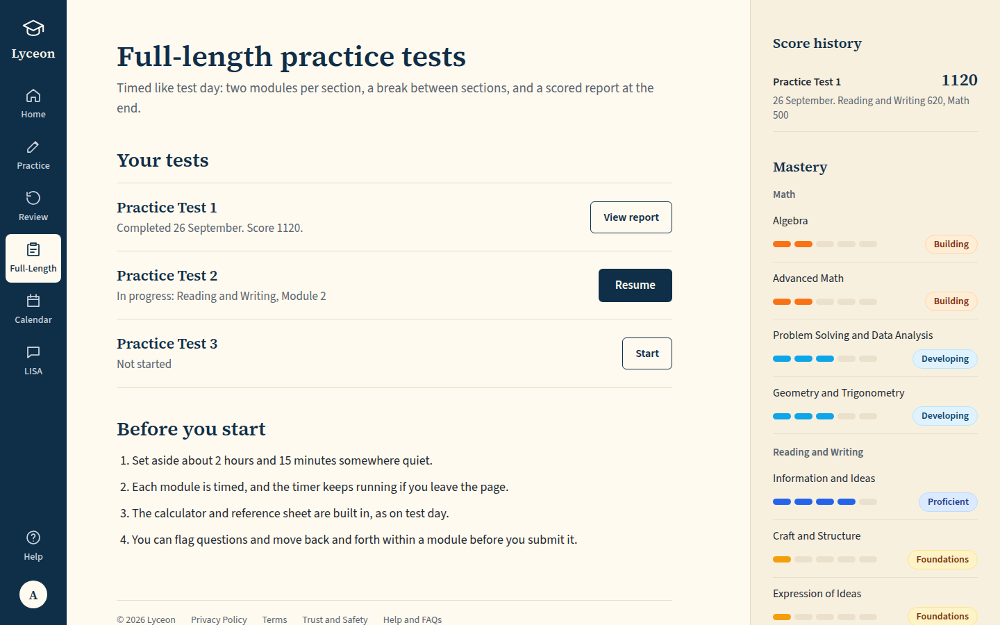, 148 KB |
| desktop | dark | 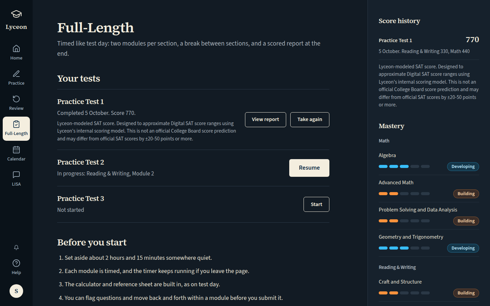 `/tests`, 163 KB, horizontal overflow 0px | 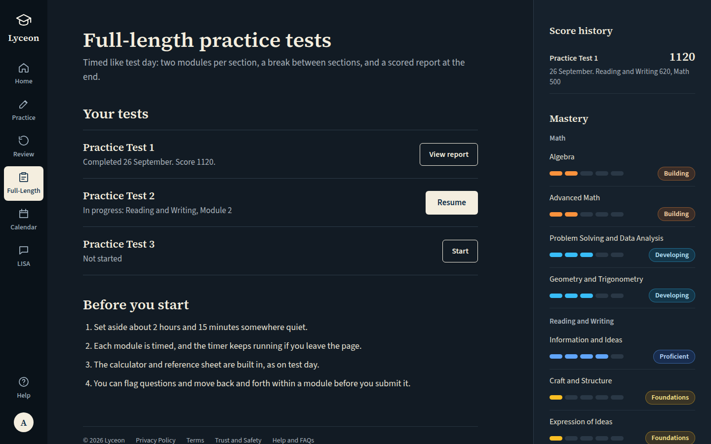, 150 KB |
| mobile | light | 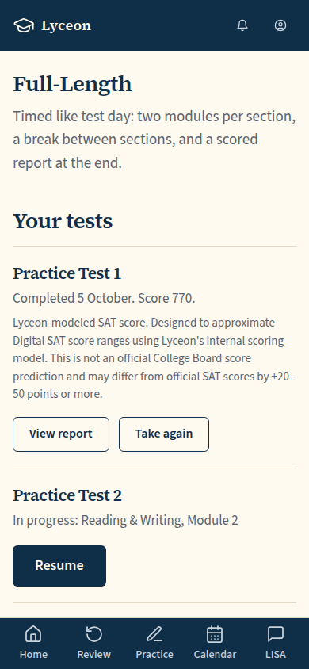 `/tests`, 67 KB, horizontal overflow 0px |  desktop prototype (no phone layout), 148 KB |
| mobile | dark |  `/tests`, 66 KB, horizontal overflow 0px |  desktop prototype (no phone layout), 150 KB |

## Full-Length, paid, full page (on a phone the right panel stacks under the main column; the footer ends the column)

Persona: `paid`. Route: `/tests`.
Must then show the text `In progress: Reading & Writing, Module 2` (the capture fails otherwise).
Full page: the whole document, not just the viewport.
Prototype: `FullLength.dc.html` (Full-Length, plan = paid (the canvas is a fixed 1440x900)).

| Viewport | Theme (as rendered) | Built | Prototype |
|---|---|---|---|
| desktop | light | 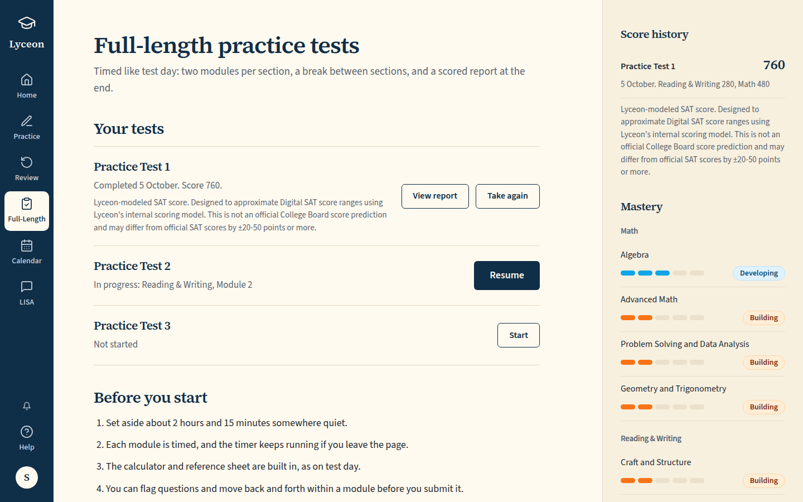 `/tests`, 164 KB, horizontal overflow 0px | , 148 KB |
| desktop | dark | 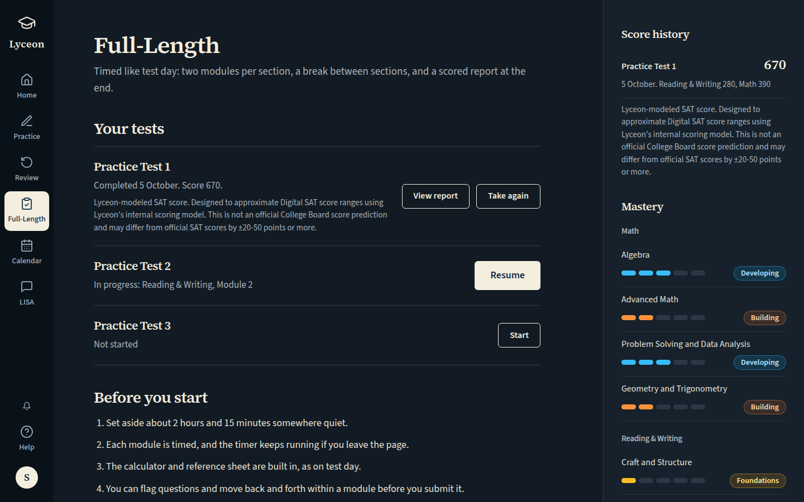 `/tests`, 163 KB, horizontal overflow 0px | , 150 KB |
| mobile | light | 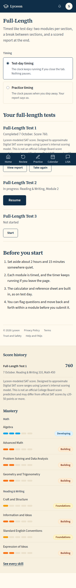 `/tests`, 199 KB, horizontal overflow 0px |  desktop prototype (no phone layout), 148 KB |
| mobile | dark | 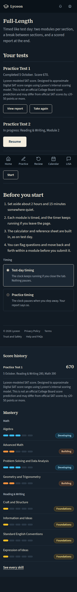 `/tests`, 201 KB, horizontal overflow 0px |  desktop prototype (no phone layout), 150 KB |

## Full-Length on a phone (OQ-63): Resume asks the shared pre-start check, "Full-length tests are built for a laptop or tablet, like test day." with Continue anyway and Close; nothing opened yet. Desktop: no tap, no notice (control)

Persona: `paid`. Route: `/tests`.
Step: click `{"desktop":null,"mobile":"[data-testid=\"tests-resume\"]"}`.
Must then show `[data-testid="tests-home"]` (the capture fails otherwise).
Prototype: none. The prototypes have no phone layout; the notice is the owner ruling of 2026-10-05 (DESIGN.md §2 Mobile).

| Viewport | Theme (as rendered) | Built | Prototype |
|---|---|---|---|
| desktop | light | 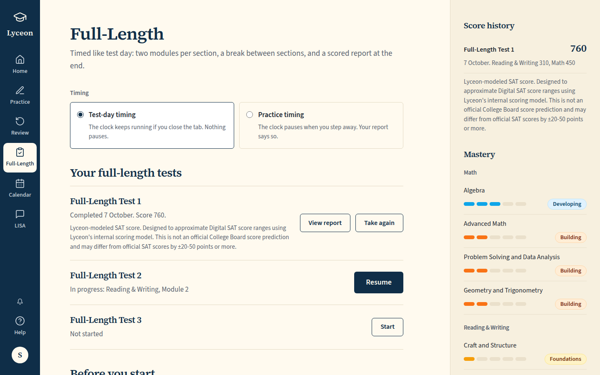 `/tests`, 164 KB, horizontal overflow 0px | none |
| desktop | dark | 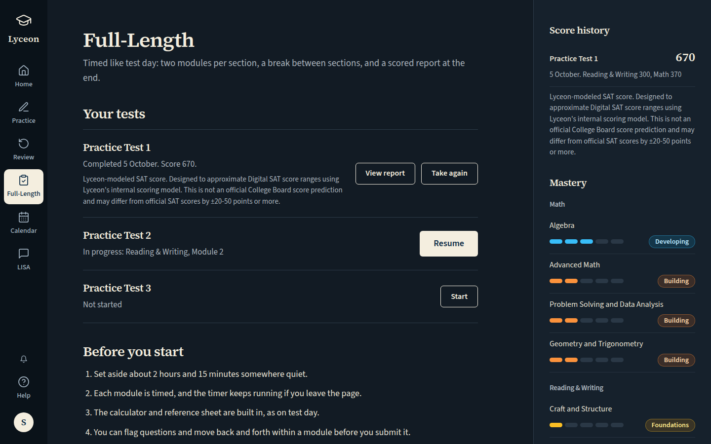 `/tests`, 163 KB, horizontal overflow 0px | none |
| mobile | light | 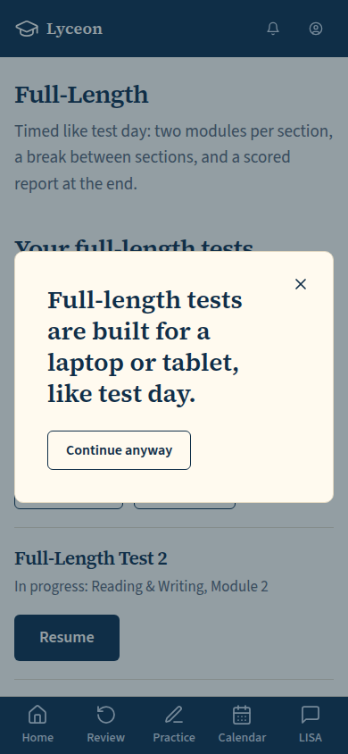 `/tests`, 66 KB, horizontal overflow 0px | none |
| mobile | dark | 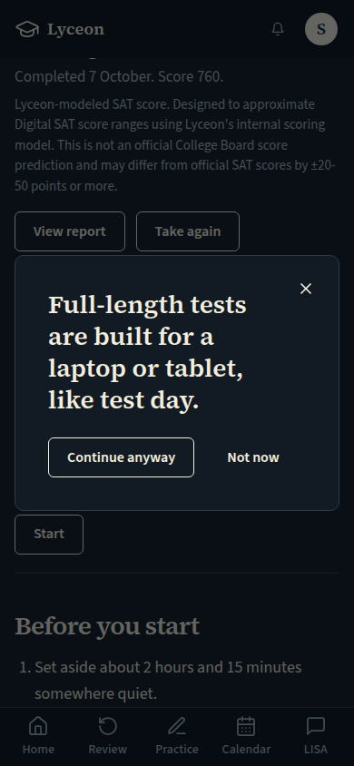 `/tests`, 64 KB, horizontal overflow 0px | none |

## Exam report (Focus shell), the scored Full-Length Test 1: total out of 1600, sections out of 800, the disclosure; Knowledge and skills, seven segments per domain

Persona: `paid`. Route: `/tests/{paid.scoredExamSessionId}/report`.
Prototype: `Report.dc.html` (Report).

| Viewport | Theme (as rendered) | Built | Prototype |
|---|---|---|---|
| desktop | light | 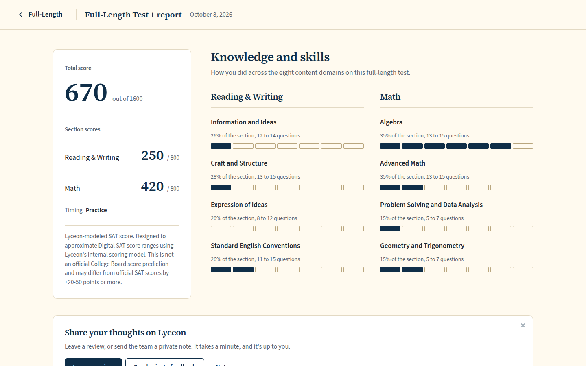 `/tests/a1501169-f613-42cd-ac8b-1e0a26e7f0f5/report`, 125 KB, horizontal overflow 0px | 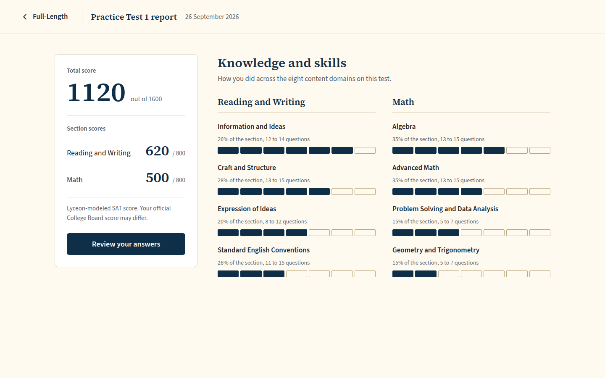, 95 KB |
| desktop | dark |  `/tests/a1501169-f613-42cd-ac8b-1e0a26e7f0f5/report`, 112 KB, horizontal overflow 0px | 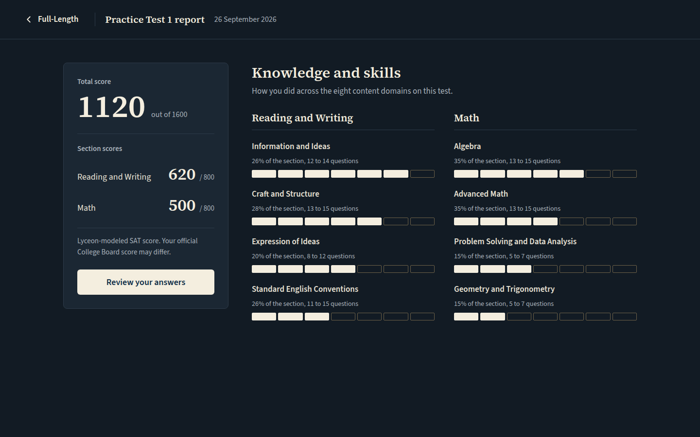, 96 KB |
| mobile | light |  `/tests/a1501169-f613-42cd-ac8b-1e0a26e7f0f5/report`, 56 KB, horizontal overflow 0px |  desktop prototype (no phone layout), 95 KB |
| mobile | dark |  `/tests/a1501169-f613-42cd-ac8b-1e0a26e7f0f5/report`, 56 KB, horizontal overflow 0px |  desktop prototype (no phone layout), 96 KB |

## Exam report, full page (on a phone the score card stacks above Knowledge and skills)

Persona: `paid`. Route: `/tests/{paid.scoredExamSessionId}/report`.
Full page: the whole document, not just the viewport.
Prototype: `Report.dc.html` (Report (the canvas is a fixed 1440x900)).

| Viewport | Theme (as rendered) | Built | Prototype |
|---|---|---|---|
| desktop | light | 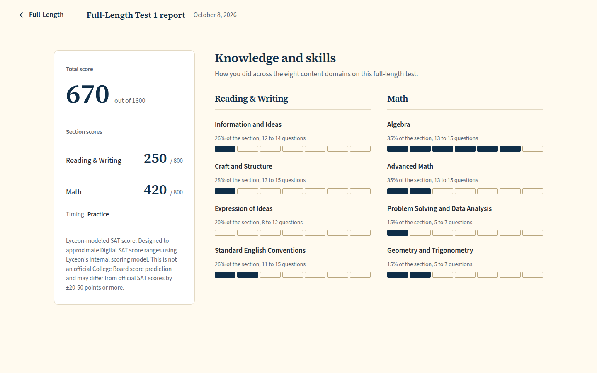 `/tests/a1501169-f613-42cd-ac8b-1e0a26e7f0f5/report`, 111 KB, horizontal overflow 0px | , 95 KB |
| desktop | dark | 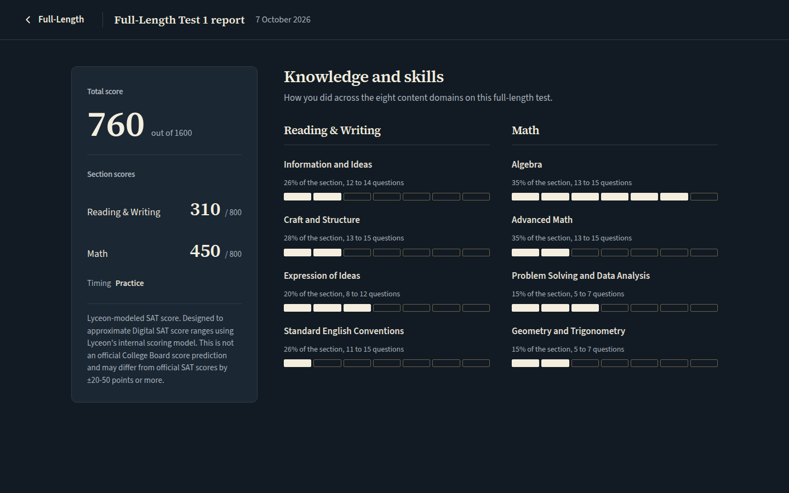 `/tests/a1501169-f613-42cd-ac8b-1e0a26e7f0f5/report`, 112 KB, horizontal overflow 0px | , 96 KB |
| mobile | light | 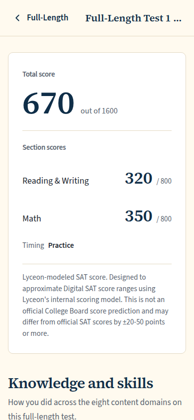 `/tests/a1501169-f613-42cd-ac8b-1e0a26e7f0f5/report`, 56 KB, horizontal overflow 0px |  desktop prototype (no phone layout), 95 KB |
| mobile | dark | 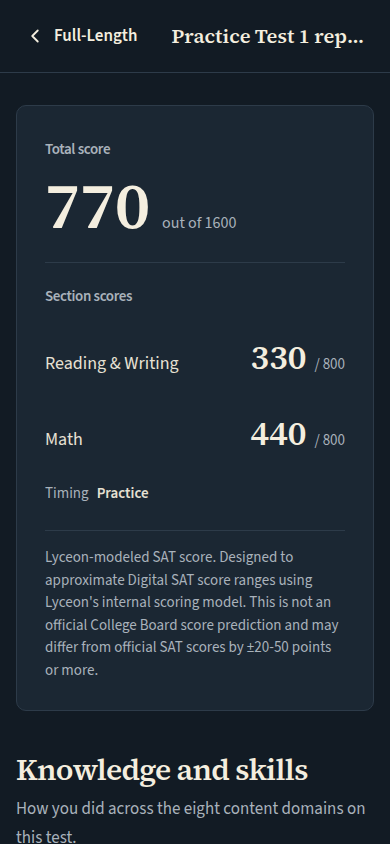 `/tests/a1501169-f613-42cd-ac8b-1e0a26e7f0f5/report`, 56 KB, horizontal overflow 0px |  desktop prototype (no phone layout), 96 KB |

## The timed module (Full-Length Test 2, Reading and Writing Module 2): Bluebook layout kept, no back arrow, light only; type on the student tokens

Persona: `paid`. Route: `/tests/{paid.inProgressExamSessionId}/RW/2`.
Must fit the viewport (F-69): document no taller than the viewport, window unscrolled, `[data-testid="focus-shell-header"]` wholly in view, nothing to scroll in `main#main` (the capture fails otherwise); the measurement is under each built shot.
Also shot at tablet 820x1180 (the mobile steps and selectors).
Prototype: none. No prototype draws the timed module: DESIGN.md §2 keeps its shipped Bluebook layout (E7b), light only.

| Viewport | Theme (as rendered) | Built | Prototype |
|---|---|---|---|
| desktop | light | 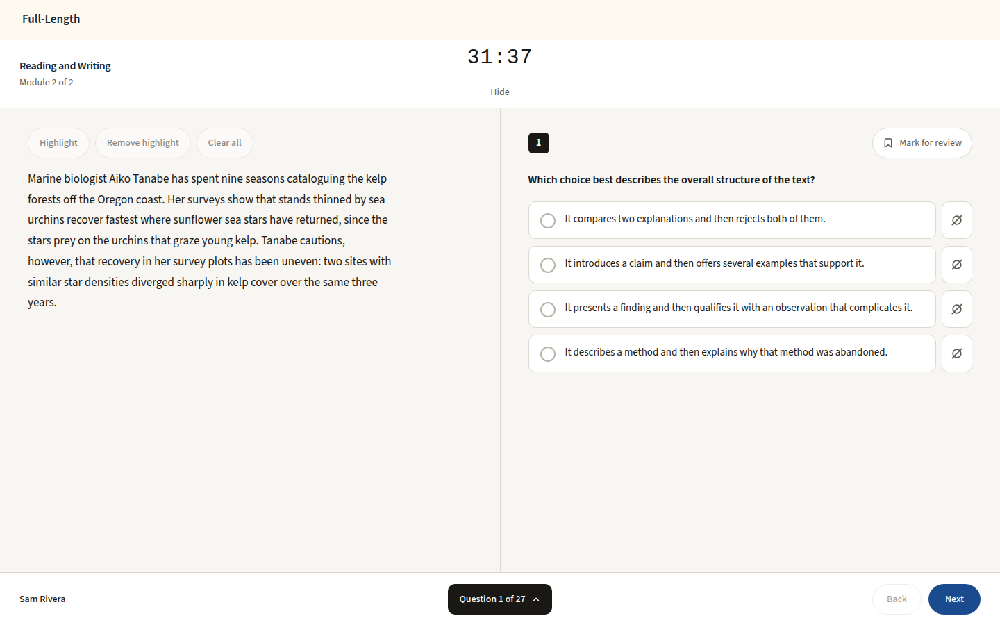 `/tests/4ab14a68-473a-49c0-a6cc-7a30ed900aeb/RW/2`, 97 KB, horizontal overflow 0px, document 900px in a 900px viewport, scrollY 0, top bar 0..58px, `main#main` 842px of content in 842px | none |
| mobile | light |  `/tests/4ab14a68-473a-49c0-a6cc-7a30ed900aeb/RW/2`, 64 KB, horizontal overflow 0px, document 844px in a 844px viewport, scrollY 0, top bar 0..58px, `main#main` 786px of content in 786px | none |
| tablet | light | 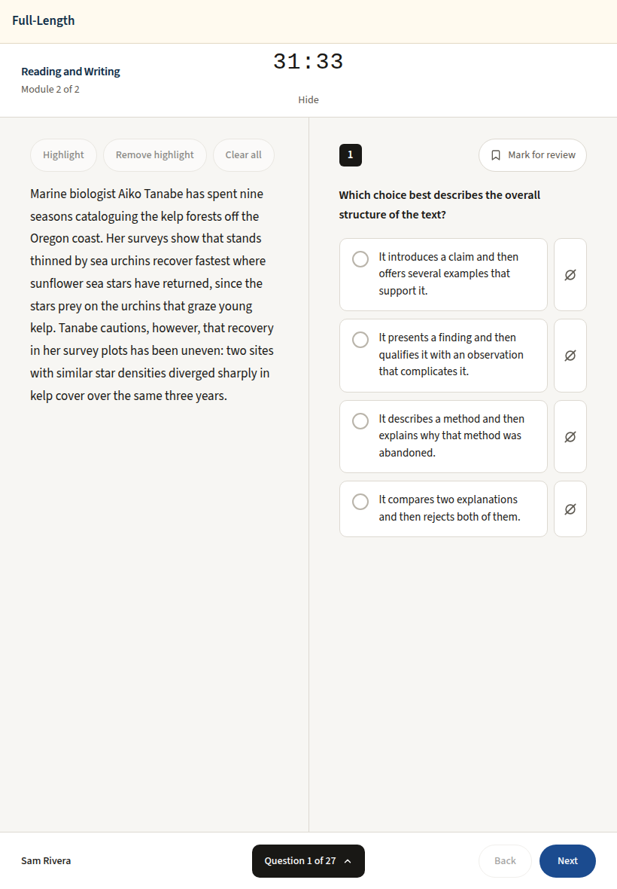 `/tests/4ab14a68-473a-49c0-a6cc-7a30ed900aeb/RW/2`, 103 KB, horizontal overflow 0px, document 1180px in a 1180px viewport, scrollY 0, top bar 0..58px, `main#main` 1122px of content in 1122px | none |

## Click path (paid): Resume, the page's one primary action (at 390 through the shared pre-start check's Continue anyway), lands on the exam session route and on to the active module

Persona: `paid`. Route: `/tests`.
Step: click `{"desktop":"[data-testid=\"tests-resume\"]","mobile":"[data-testid=\"tests-resume\"]"}`.
Step: click `{"desktop":null,"mobile":"[data-testid=\"full-length-phone-continue\"]"}`.
Click path: must land on a path matching `^/tests/[0-9a-f-]{36}(/RW/[12])?$` (the capture fails otherwise); the path it landed on is under each built shot.
Prototype: none. A click path; its proof is the landing path (the prototype's Resume is not wired).

| Viewport | Theme (as rendered) | Built | Prototype |
|---|---|---|---|
| desktop | light |  `/tests/4ab14a68-473a-49c0-a6cc-7a30ed900aeb/RW/2`, 96 KB, horizontal overflow 0px | none |
| desktop | dark requested; page pinned light (`data-theme-lock=light`, OQ-49) | 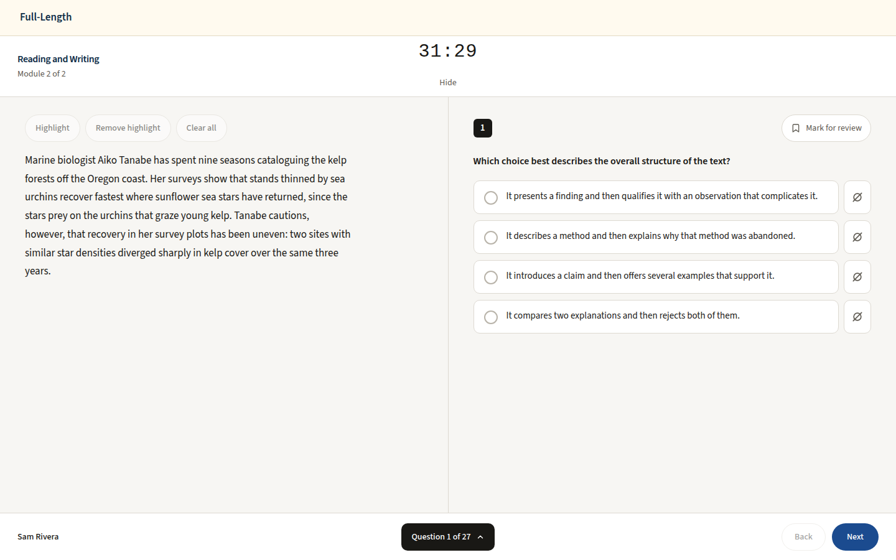 `/tests/4ab14a68-473a-49c0-a6cc-7a30ed900aeb/RW/2`, 97 KB, horizontal overflow 0px | none |
| mobile | light | 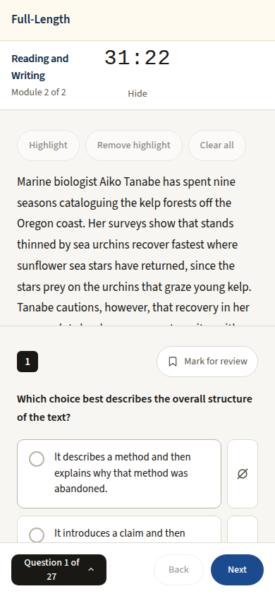 `/tests/4ab14a68-473a-49c0-a6cc-7a30ed900aeb/RW/2`, 65 KB, horizontal overflow 0px | none |
| mobile | dark requested; page pinned light (`data-theme-lock=light`, OQ-49) | 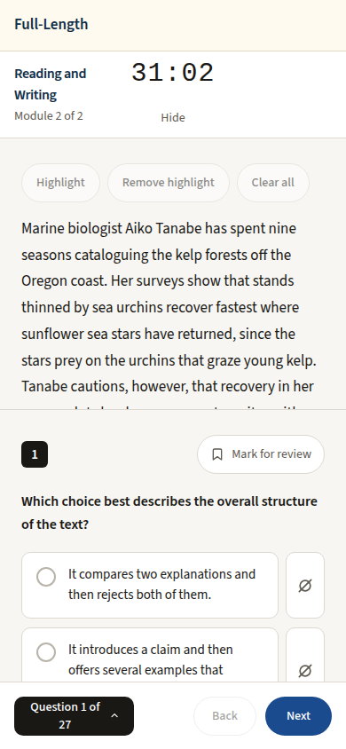 `/tests/4ab14a68-473a-49c0-a6cc-7a30ed900aeb/RW/2`, 64 KB, horizontal overflow 0px | none |

## QA item 5: a test's Start pressed (at 390 after Continue anyway), the create held in flight: 'Starting…' with a spinner, disabled

Persona: `paid`. Route: `/tests`.
Step: click `{"desktop":"[data-testid=\"tests-start\"]","mobile":"[data-testid=\"tests-start\"]"}`.
Step: click `{"desktop":null,"mobile":"[data-testid=\"full-length-phone-continue\"]"}`.
Held: the browser's `POST /api/tests/sessions` is left unanswered through the screenshot, then aborted (it never reaches the server).
Must then show `[data-testid="tests-start"][aria-busy="true"]` (the capture fails otherwise).
Prototype: none. A pending state the prototype does not draw (owner QA list, 2026-10-07, item 5).

| Viewport | Theme (as rendered) | Built | Prototype |
|---|---|---|---|
| desktop | light | 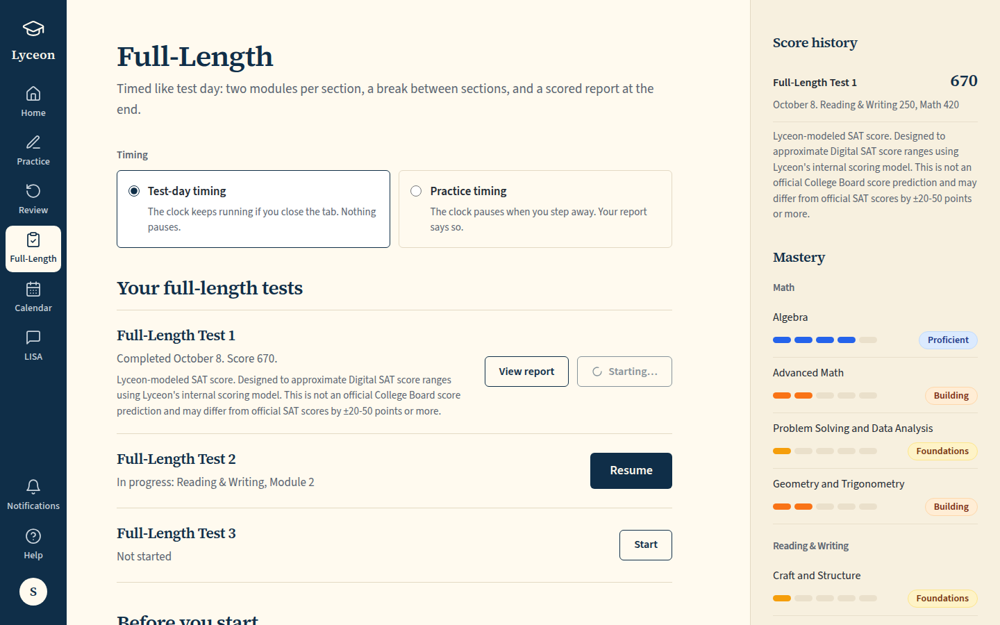 `/tests`, 165 KB, horizontal overflow 0px | none |
| desktop | dark | 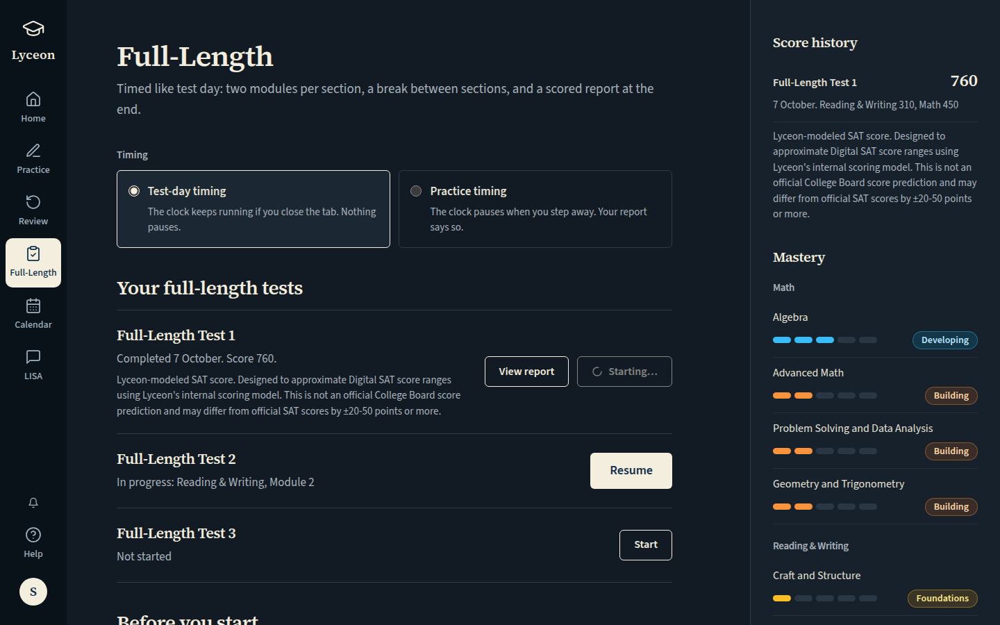 `/tests`, 164 KB, horizontal overflow 0px | none |
| mobile | light | 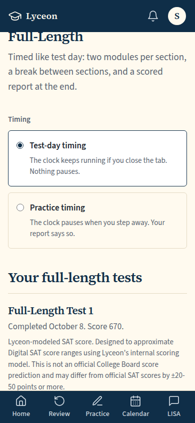 `/tests`, 71 KB, horizontal overflow 0px | none |
| mobile | dark | 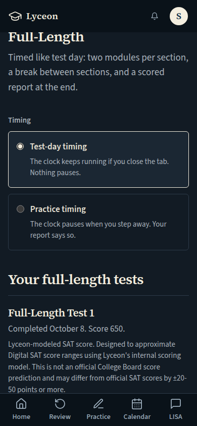 `/tests`, 70 KB, horizontal overflow 0px | none |

## Run facts

- Seeded ids: `{"free":{"completedPracticeSessionId":"c94c921b-1031-4c24-8592-1962339dfff2","openPracticeSessionId":"246094da-922d-4c8c-91c7-c00e5ef7a985","openReviewSessionId":null,"diagnosticSessionId":null,"scoredExamSessionId":null,"inProgressExamSessionId":null,"lisaConversationId":null,"answered":13},"paid":{"completedPracticeSessionId":"2b020254-ffaf-4c9b-a267-dcfec864d3be","openPracticeSessionId":"59970d0d-c8b0-4d1e-87c4-30473d230dc7","openReviewSessionId":null,"diagnosticSessionId":"b40fcb9c-7e9d-4963-b304-ff7c5ac82a10","scoredExamSessionId":"a1501169-f613-42cd-ac8b-1e0a26e7f0f5","inProgressExamSessionId":"4ab14a68-473a-49c0-a6cc-7a30ed900aeb","lisaConversationId":null,"answered":178}}`
- Endpoints the pages asked for that the harness does not serve (answered 404): none
- External hosts blocked: none
