# UI-55 Calendar (/calendar): paid week and month, Regenerate plan, free setup before and after a save; light and dark, 1440 and 390

Generated 2026-10-08T03:38:23.445Z by `pnpm exec tsx tests/e2e/student-harness/capture.ts UI-55` (see `tests/e2e/student-harness/README.md`). Built = a production build of the real client (`vite preview`, or the dev server with STUDENT_HARNESS_CLIENT=dev) against the student harness (real routers over a local Postgres built from this repo's migrations; personas seeded through the real practice routes). Prototype = the signed-off `docs/plans/student-ui/design/prototype/*.dc.html`, rendered locally.

Conditions, read before comparing:
- Viewport screenshots (not full page) unless the shot says full page: desktop 1440x900, phone 390x844, and any extra size a shot names.
- The prototypes are a fixed 1440x900 canvas with no phone layout; phone rows show the desktop prototype.
- Dark is requested through the app's own per-device setting; the theme column records what the page rendered.
- No external requests: the built app's Google Fonts (Inter, Poppins) are blocked, so legacy page bodies fall back to system faces; Source Sans 3 / Source Serif 4 are self-hosted and load for both sides.
- Prototype data is illustrative; built data is the seeded personas' real payloads.

## Calendar, paid, week: Week/Month, Today, arrows; the range centred (M/D – M/D), no streak line; Edit schedule and Regenerate plan (at 390 in the "⋯" menu right of the range title: OQ-66 (c)); the starred test day; no facts strip (SCL-211); panel: mini month (★), goal card (days until, ★ pill, Target | Projected), Show (no "Your schedule": QA 2026-10-07 item 11(e))

Persona: `paid`. Route: `/calendar`.
Prototype: `Calendar.dc.html` (Calendar, plan = paid, week).

| Viewport | Theme (as rendered) | Built | Prototype |
|---|---|---|---|
| desktop | light |  `/calendar`, 139 KB, horizontal overflow 0px | , 175 KB |
| desktop | dark |  `/calendar`, 142 KB, horizontal overflow 0px | , 182 KB |
| mobile | light |  `/calendar`, 44 KB, horizontal overflow 0px |  desktop prototype (no phone layout), 175 KB |
| mobile | dark |  `/calendar`, 44 KB, horizontal overflow 0px |  desktop prototype (no phone layout), 182 KB |

## Calendar, paid, week between the phone and desktop layouts (production QA 2026-10-07 items 11(c), 11(d); OQ-66 (c)): at 700 the range title over Week/Month, Today, arrows (left) and the "⋯" menu (right); at 1024, beside the right panel, two rows: the range title with "⋯" at its right end, then the view controls; at 1280 the range title over the controls and Edit schedule, Regenerate plan; block cards whose titles, chips and tags stay inside them. QA2-C (Karl, 2026-10-08): at 1024 and 1280 (columns under 130px) the card titles are the compact labels ("Rev 15", "Math 5", "R&W 5") in the card's colour, and a scope chip keeps one line, its name cut with an ellipsis, its count whole; no word is split

Persona: `paid`. Route: `/calendar`.
Also shot at w700 700x900 (the mobile steps and selectors).
Also shot at w1024 1024x768 (the desktop steps and selectors).
Also shot at w1280 1280x800 (the desktop steps and selectors).
Prototype: none. The prototype is a fixed 1440x900 canvas; these widths are the production QA's (2026-10-07 item 11).

| Viewport | Theme (as rendered) | Built | Prototype |
|---|---|---|---|
| desktop | light |  `/calendar`, 139 KB, horizontal overflow 0px | none |
| desktop | dark | 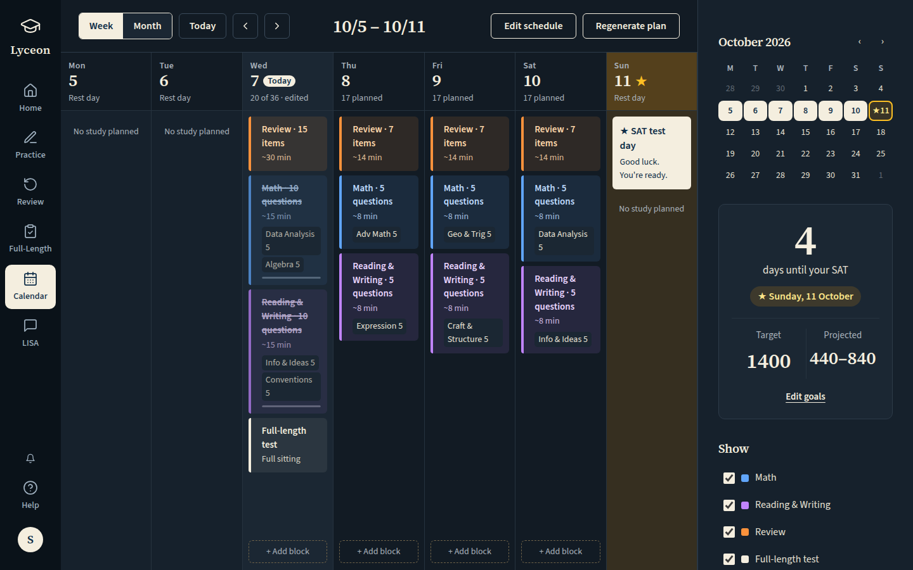 `/calendar`, 142 KB, horizontal overflow 0px | none |
| mobile | light | 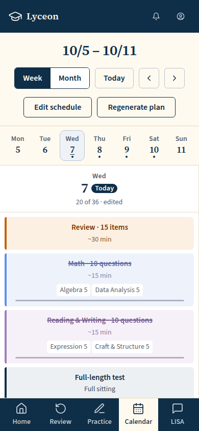 `/calendar`, 44 KB, horizontal overflow 0px | none |
| mobile | dark |  `/calendar`, 44 KB, horizontal overflow 0px | none |
| w700 | light | 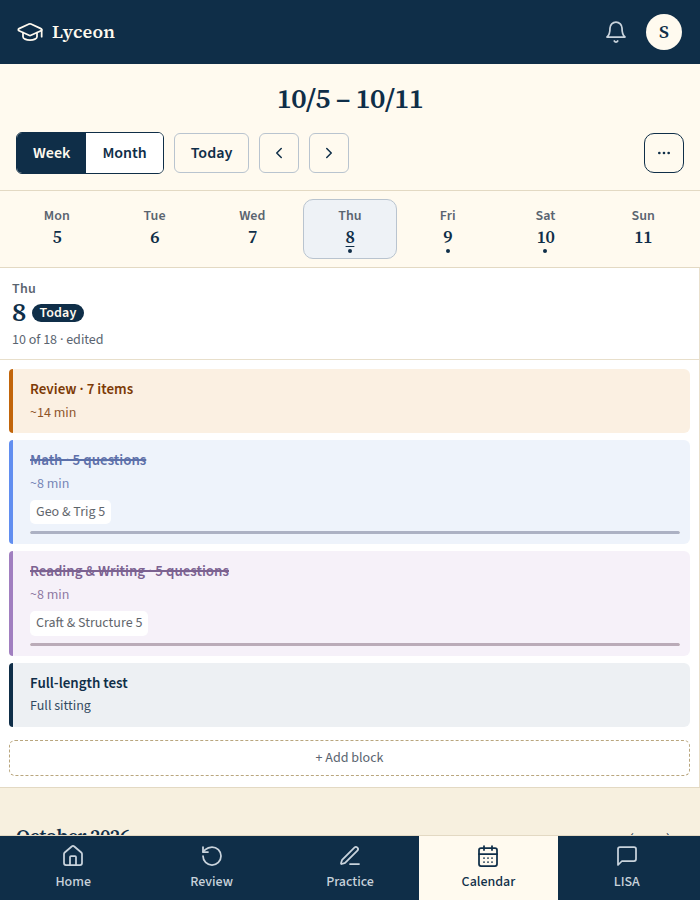 `/calendar`, 49 KB, horizontal overflow 0px | none |
| w700 | dark | 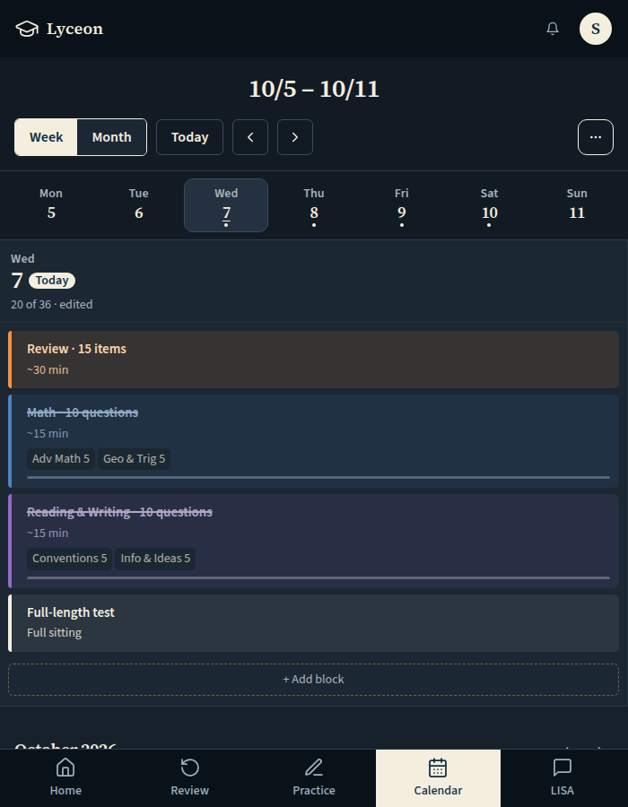 `/calendar`, 49 KB, horizontal overflow 0px | none |
| w1024 | light | 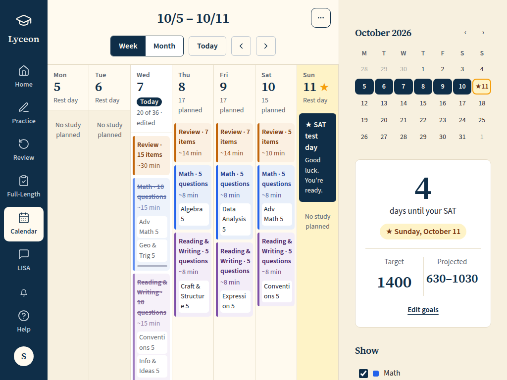 `/calendar`, 99 KB, horizontal overflow 0px | none |
| w1024 | dark | 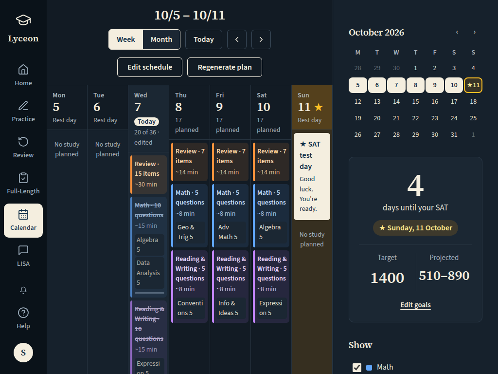 `/calendar`, 101 KB, horizontal overflow 0px | none |
| w1280 | light | 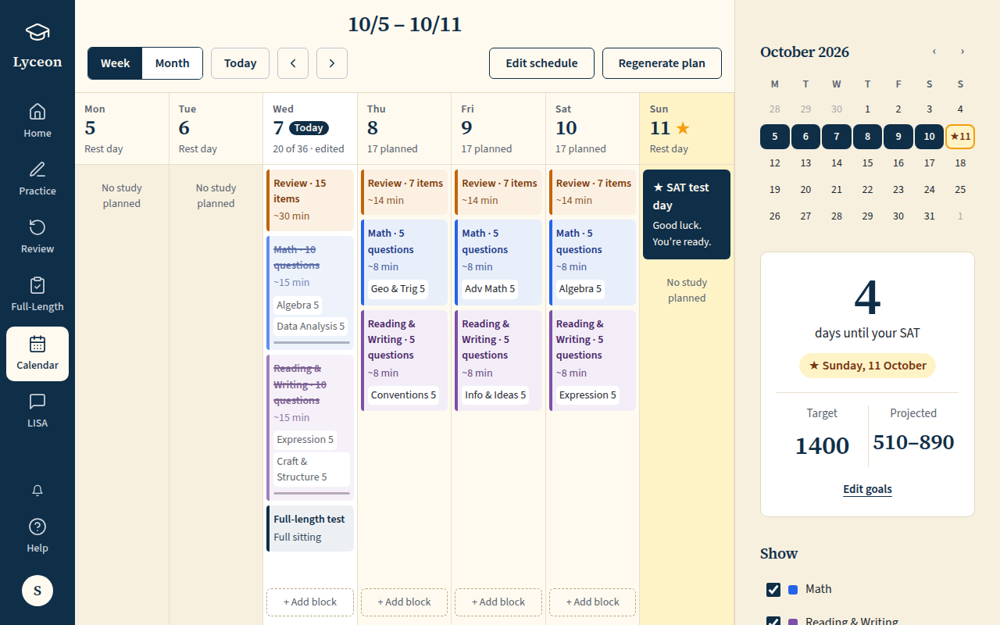 `/calendar`, 118 KB, horizontal overflow 0px | none |
| w1280 | dark | 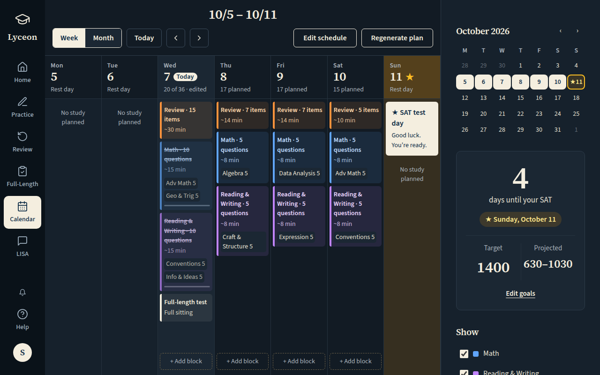 `/calendar`, 120 KB, horizontal overflow 0px | none |

## OQ-66 (c), owner ruling (Karl, 2026-10-07): below a 1200px viewport Edit schedule and Regenerate plan are in the header's "⋯" menu ("More actions"), opened here: at 1024 and 390 the menu over the page, in the page's theme. Desktop (1440, control): no "⋯"; the two buttons, as before

Persona: `paid`. Route: `/calendar`.
Step: click `{"desktop":null,"mobile":"[data-testid=\"calendar-more-actions\"]"}`.
Also shot at w1024 1024x768 (the mobile steps and selectors).
Prototype: none. The prototype is a fixed 1440x900 canvas with the two buttons; the menu is the owner ruling on OQ-66 (c).

| Viewport | Theme (as rendered) | Built | Prototype |
|---|---|---|---|
| desktop | light |  `/calendar`, 139 KB, horizontal overflow 0px | none |
| desktop | dark |  `/calendar`, 142 KB, horizontal overflow 0px | none |
| mobile | light | 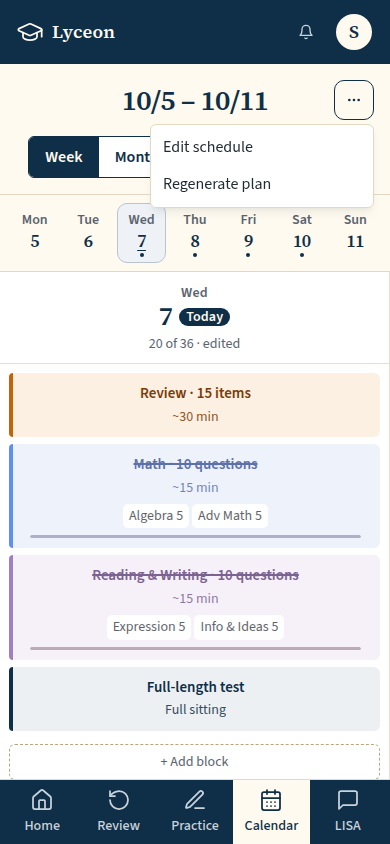 `/calendar`, 46 KB, horizontal overflow 0px | none |
| mobile | dark | 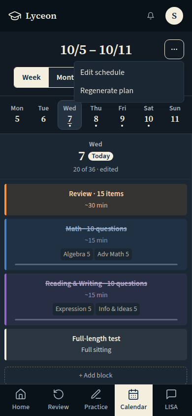 `/calendar`, 46 KB, horizontal overflow 0px | none |
| w1024 | light | 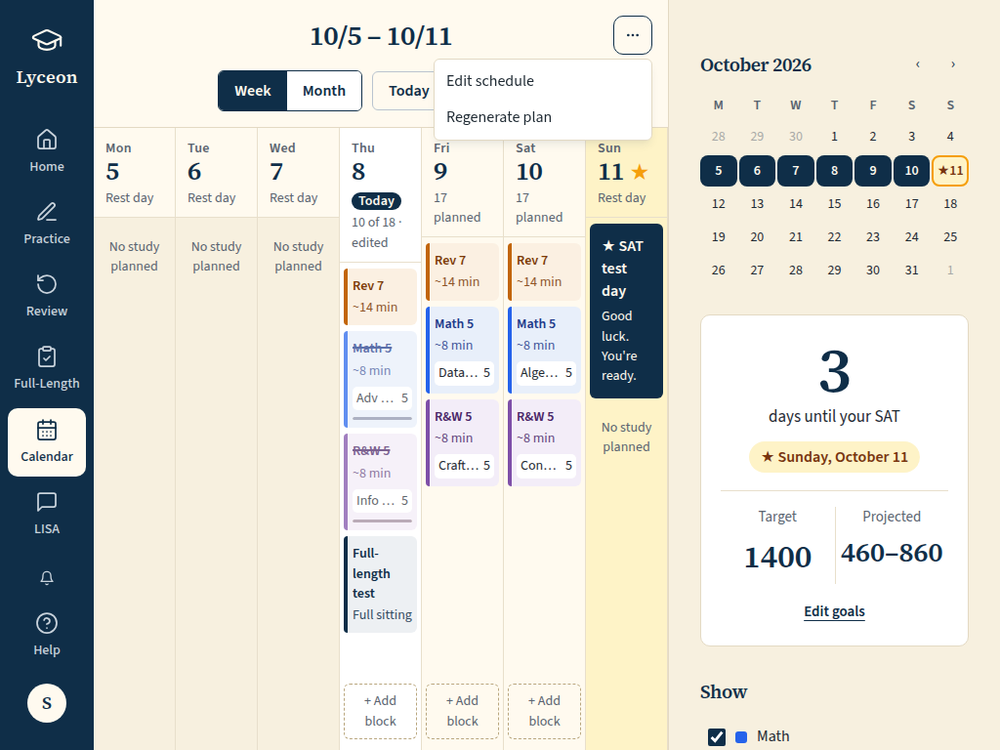 `/calendar`, 103 KB, horizontal overflow 0px | none |
| w1024 | dark | 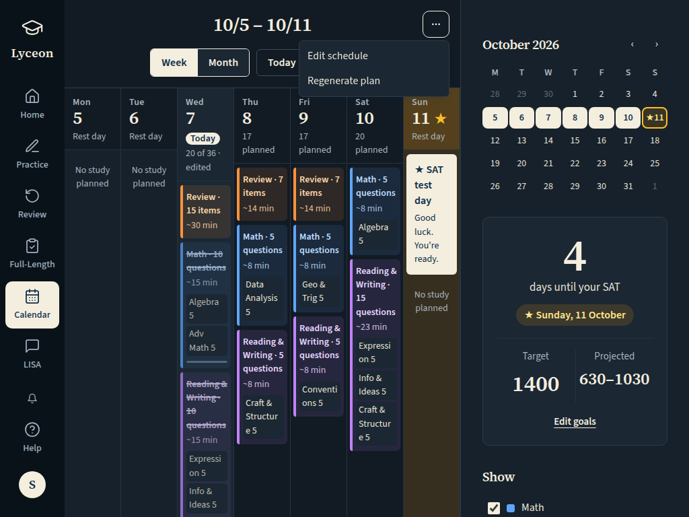 `/calendar`, 104 KB, horizontal overflow 0px | none |

## Calendar, paid, a block's detail sheet open (production QA 2026-10-07 item 11(b)): a modal dialog named by the block's title, with Close (top right); focus on Close

Persona: `paid`. Route: `/calendar`.
Step: click `{"desktop":"button.block.rev","mobile":"button.block.rev"}` (aria-disabled but clickable: forced once visible).
Must then show `[data-testid="calendar-block-sheet"][role="dialog"] [data-testid="calendar-block-sheet-close"]` (the capture fails otherwise).
Prototype: none. The prototype's blocks open no sheet; the dialog is the production QA's item 11(b).

| Viewport | Theme (as rendered) | Built | Prototype |
|---|---|---|---|
| desktop | light | 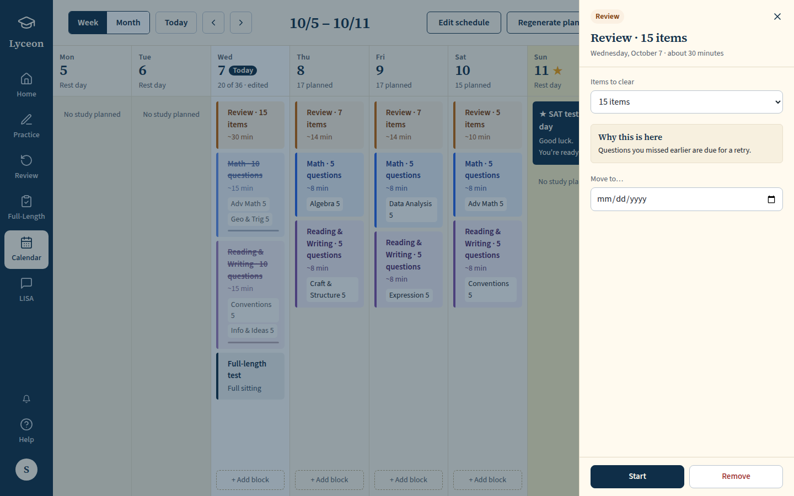 `/calendar`, 120 KB, horizontal overflow 0px | none |
| desktop | dark | 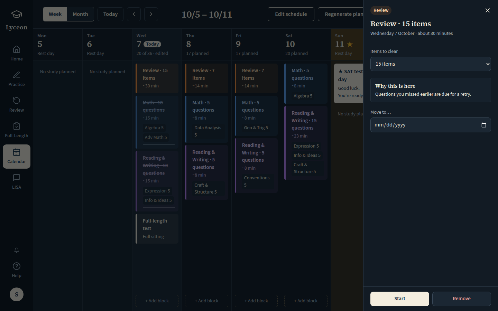 `/calendar`, 118 KB, horizontal overflow 0px | none |
| mobile | light | 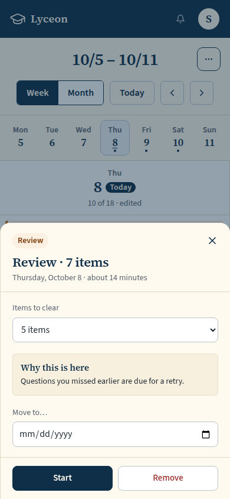 `/calendar`, 42 KB, horizontal overflow 0px | none |
| mobile | dark | 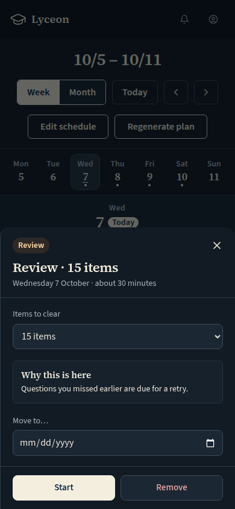 `/calendar`, 42 KB, horizontal overflow 0px | none |

## Calendar, paid, week, full page (on a phone the right panel stacks under the main column)

Persona: `paid`. Route: `/calendar`.
Full page: the whole document, not just the viewport.
Prototype: `Calendar.dc.html` (Calendar, plan = paid (the canvas is a fixed 1440x900)).

| Viewport | Theme (as rendered) | Built | Prototype |
|---|---|---|---|
| desktop | light |  `/calendar`, 139 KB, horizontal overflow 0px | , 175 KB |
| desktop | dark |  `/calendar`, 142 KB, horizontal overflow 0px | , 182 KB |
| mobile | light |  `/calendar`, 81 KB, horizontal overflow 0px |  desktop prototype (no phone layout), 175 KB |
| mobile | dark |  `/calendar`, 82 KB, horizontal overflow 0px |  desktop prototype (no phone layout), 182 KB |

## Click path (paid): the Month toggle shows the month grid, the test day starred and labelled. QA2-C (Karl, 2026-10-08): at 1024 (cells under 130px) the chips read "Rev 15", "Math 5", "R&W 5" whole; at 390 (55px cells) the count goes under the label ("Rev" over "15"), never "R…"; at 1440 the full chips

Persona: `paid`. Route: `/calendar`.
Step: click `{"desktop":"[data-testid=\"calendar-view-month\"]","mobile":"[data-testid=\"calendar-view-month\"]"}`.
Also shot at w1024 1024x768 (the desktop steps and selectors).
Prototype: `Calendar.dc.html` (Calendar, plan = paid, Month clicked); clicked: `div[role="group"][aria-label="View"] button:nth-of-type(2)`.

| Viewport | Theme (as rendered) | Built | Prototype |
|---|---|---|---|
| desktop | light |  `/calendar`, 96 KB, horizontal overflow 0px | , 87 KB |
| desktop | dark |  `/calendar`, 99 KB, horizontal overflow 0px | , 88 KB |
| mobile | light |  `/calendar`, 41 KB, horizontal overflow 0px |  desktop prototype (no phone layout), 87 KB |
| mobile | dark |  `/calendar`, 41 KB, horizontal overflow 0px |  desktop prototype (no phone layout), 88 KB |
| w1024 | light | 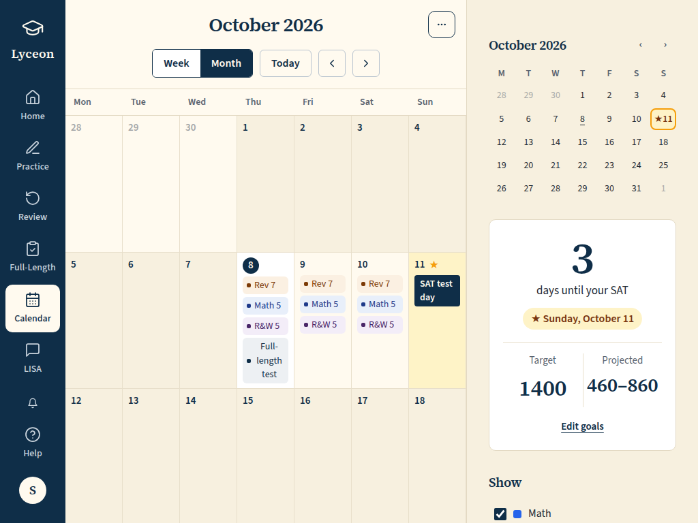 `/calendar`, 76 KB, horizontal overflow 0px |  desktop prototype (no phone layout), 87 KB |
| w1024 | dark | 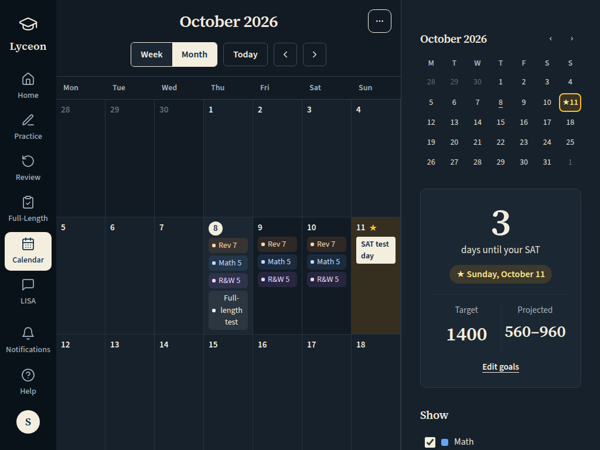 `/calendar`, 78 KB, horizontal overflow 0px |  desktop prototype (no phone layout), 88 KB |

## Click path (paid): Regenerate plan posts to POST /api/calendar/plan/regenerate and returns; the button then reads "Plan regenerated". At 390 (OQ-66 (c)) it is chosen from the "⋯" menu, which is then reopened to show the item reading "Plan regenerated"

Persona: `paid`. Route: `/calendar`.
Step: click `{"desktop":null,"mobile":"[data-testid=\"calendar-more-actions\"]"}`.
Step: click `{"desktop":"[data-testid=\"calendar-regenerate\"]","mobile":"[data-testid=\"calendar-more-regenerate\"]"}`.
Step: click `{"desktop":null,"mobile":"[data-testid=\"calendar-more-actions\"]"}`.
Must then show `[data-testid="calendar-regenerate"]:visible:text-is("Plan regenerated"), [data-testid="calendar-more-regenerate"]:text-is("Plan regenerated")` (the capture fails otherwise).
Prototype: `Calendar.dc.html` (Calendar, plan = paid, Regenerate plan clicked); clicked: `button:has-text("Regenerate plan")`.

| Viewport | Theme (as rendered) | Built | Prototype |
|---|---|---|---|
| desktop | light |  `/calendar`, 140 KB, horizontal overflow 0px | , 175 KB |
| desktop | dark |  `/calendar`, 142 KB, horizontal overflow 0px | , 181 KB |
| mobile | light |  `/calendar`, 46 KB, horizontal overflow 0px |  desktop prototype (no phone layout), 175 KB |
| mobile | dark |  `/calendar`, 46 KB, horizontal overflow 0px |  desktop prototype (no phone layout), 181 KB |

## Phone pre-start check (OQ-63), 390: today's scheduled full-length block, Start: "Full-length tests are built for a laptop or tablet, like test day." over the block sheet, with the outline Continue anyway and Close; nothing launched. Desktop (control): the block's sheet, whose Start launches at once

Persona: `paid`. Route: `/calendar`.
Step: click `{"desktop":"button[data-testid^=\"calendar-block-\"].exam","mobile":"button[data-testid^=\"calendar-block-\"].exam"}` (aria-disabled but clickable: forced once visible).
Step: click `{"desktop":null,"mobile":"[data-testid=\"calendar-block-sheet\"] footer button.primary"}`.
Must then show `[data-testid="calendar-block-sheet"]` (the capture fails otherwise).
Prototype: none. The prototypes have no phone layout and no pre-start check; the notice is the owner rulings of 2026-10-05 (OQ-63; DESIGN.md §2 Mobile).

| Viewport | Theme (as rendered) | Built | Prototype |
|---|---|---|---|
| desktop | light | 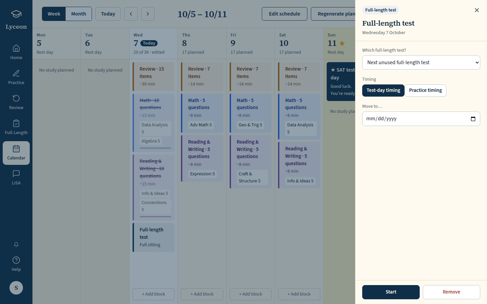 `/calendar`, 120 KB, horizontal overflow 0px | none |
| desktop | dark | 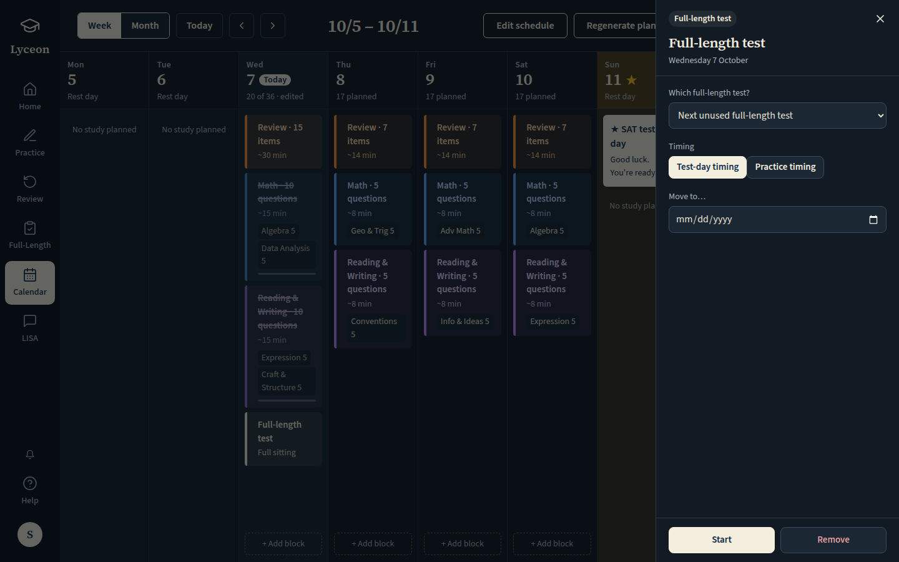 `/calendar`, 118 KB, horizontal overflow 0px | none |
| mobile | light |  `/calendar`, 49 KB, horizontal overflow 0px | none |
| mobile | dark |  `/calendar`, 47 KB, horizontal overflow 0px | none |

## Click path (OQ-63): today's full-length block, Start, and at 390 Continue anyway: the calendar launch runs (POST /api/calendar/blocks/:id/launch) and the student lands in the sitting. Desktop: Start lands there directly

Persona: `paid`. Route: `/calendar`.
Step: click `{"desktop":"button[data-testid^=\"calendar-block-\"].exam","mobile":"button[data-testid^=\"calendar-block-\"].exam"}` (aria-disabled but clickable: forced once visible).
Step: click `{"desktop":"[data-testid=\"calendar-block-sheet\"] footer button.primary","mobile":"[data-testid=\"calendar-block-sheet\"] footer button.primary"}`.
Step: click `{"desktop":null,"mobile":"[data-testid=\"full-length-phone-continue\"]"}`.
Click path: must land on a path matching `^/tests/[0-9a-f-]{36}(/.*)?$` (the capture fails otherwise); the path it landed on is under each built shot.
Prototype: none. A click path; its proof is the landing path (the prototype's blocks are not wired).

| Viewport | Theme (as rendered) | Built | Prototype |
|---|---|---|---|
| desktop | light | 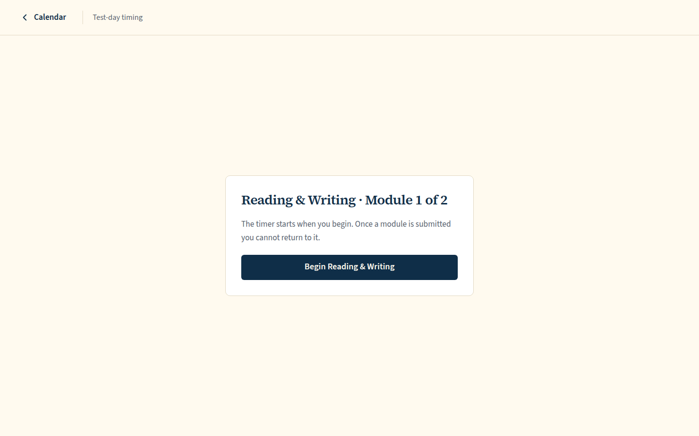 `/tests/1acaa89d-289b-4518-a82c-c9d3216d6cfc`, 33 KB, horizontal overflow 0px | none |
| desktop | dark | 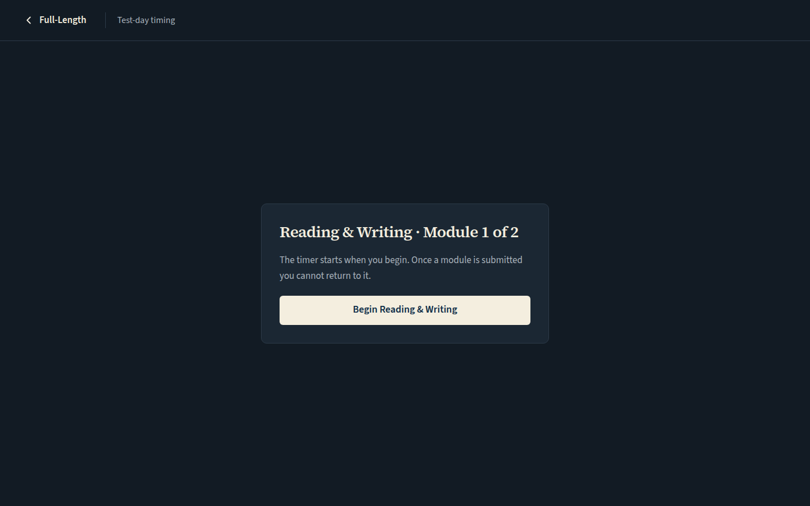 `/tests/1acaa89d-289b-4518-a82c-c9d3216d6cfc`, 33 KB, horizontal overflow 0px | none |
| mobile | light |  `/tests/1acaa89d-289b-4518-a82c-c9d3216d6cfc`, 29 KB, horizontal overflow 0px | none |
| mobile | dark |  `/tests/1acaa89d-289b-4518-a82c-c9d3216d6cfc`, 29 KB, horizontal overflow 0px | none |

## Click path (QA2-G set-up): today's review block, Start: the calendar launch runs (POST /api/calendar/blocks/:id/launch) and the student lands in the review session. The first capture starts the session; later ones find the block started and resume it

Persona: `paid`. Route: `/calendar`.
Step: click `{"desktop":"button.block.rev","mobile":"button.block.rev"}` (aria-disabled but clickable: forced once visible).
Step: click `{"desktop":"[data-testid=\"calendar-block-sheet\"] footer button.primary","mobile":"[data-testid=\"calendar-block-sheet\"] footer button.primary"}`.
Click path: must land on a path matching `^/review` (the capture fails otherwise); the path it landed on is under each built shot.
Prototype: none. A click path that puts today's review block in progress for the next shot; its proof is the landing path.

| Viewport | Theme (as rendered) | Built | Prototype |
|---|---|---|---|
| desktop | light | 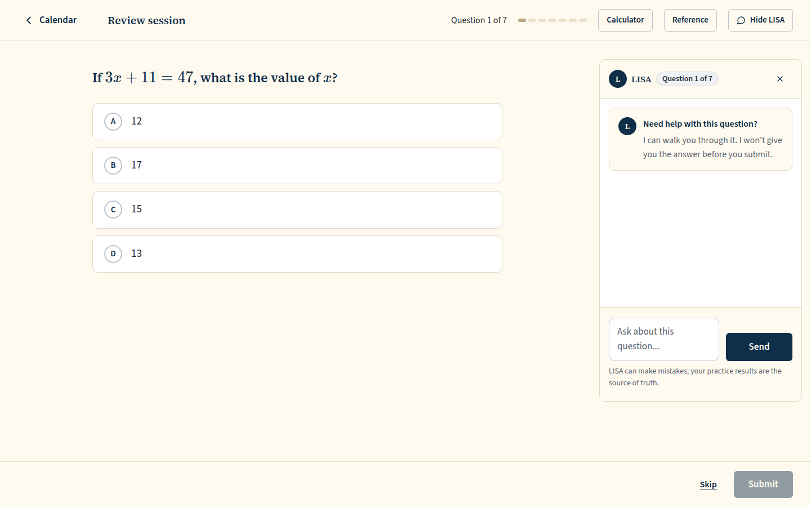 `/review/session/96fb084c-d995-4eed-97b3-d67a518a27ec`, 67 KB, horizontal overflow 0px | none |
| desktop | dark | 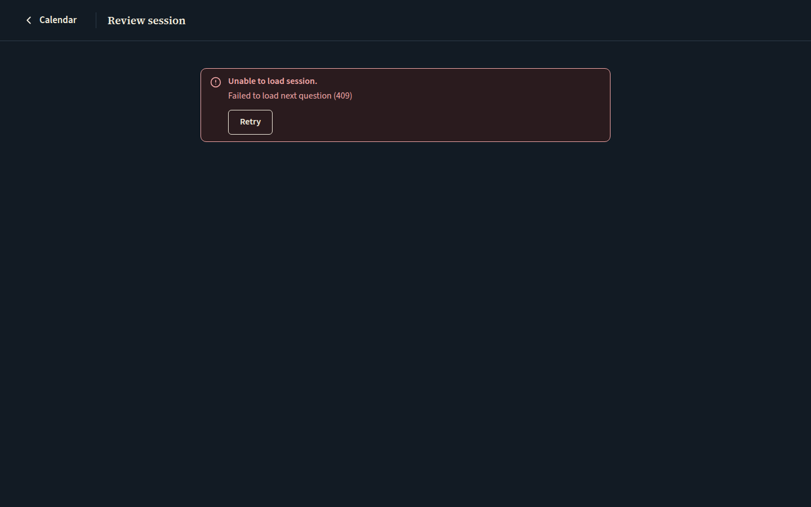 `/review/session/96fb084c-d995-4eed-97b3-d67a518a27ec`, 20 KB, horizontal overflow 0px | none |
| mobile | light | 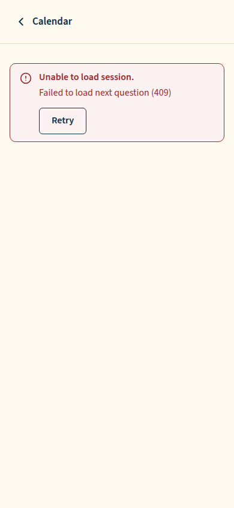 `/review/session/96fb084c-d995-4eed-97b3-d67a518a27ec`, 13 KB, horizontal overflow 0px | none |
| mobile | dark | 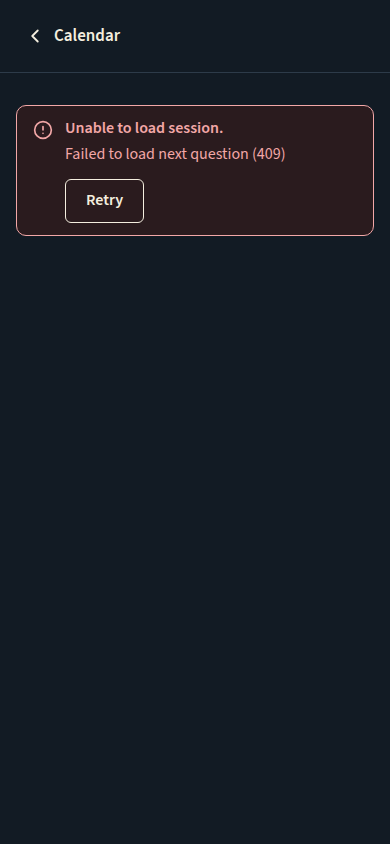 `/review/session/96fb084c-d995-4eed-97b3-d67a518a27ec`, 13 KB, horizontal overflow 0px | none |

## QA2-G (Karl, 2026-10-08: "disable 'Items to clear' while the block is in progress"): today's review block, started by the shot before (the server's §13 status `in_progress`; "🔒 started" on the card), its sheet open: Items to clear disabled, with "You can't change this while the block is in progress." under it; Resume

Persona: `paid`. Route: `/calendar`.
Step: click `{"desktop":"button.block.rev","mobile":"button.block.rev"}` (aria-disabled but clickable: forced once visible).
Must then show `[data-testid="calendar-block-sheet"] select[aria-label="Items to clear"][disabled][aria-disabled="true"] ~ [data-testid="calendar-items-locked-note"]` (the capture fails otherwise).
Also shot at w1024 1024x768 (the desktop steps and selectors).
Prototype: none. The prototype's blocks open no sheet; the locked control is Karl's production re-test item G (2026-10-08).

| Viewport | Theme (as rendered) | Built | Prototype |
|---|---|---|---|
| desktop | light | 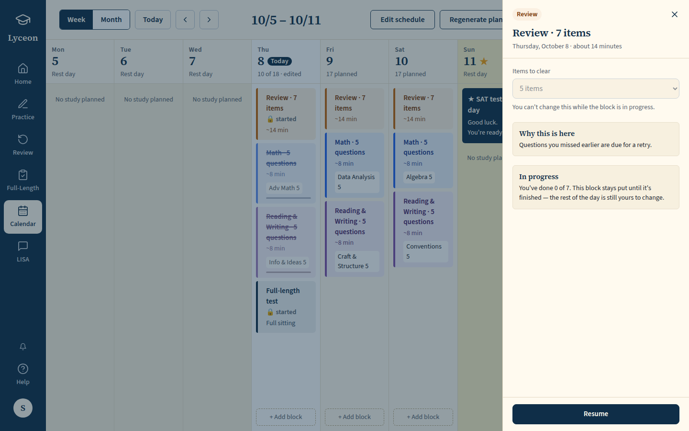 `/calendar`, 131 KB, horizontal overflow 0px | none |
| desktop | dark | 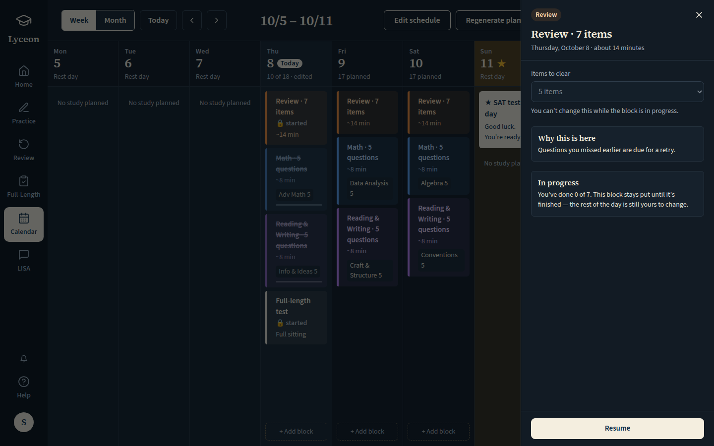 `/calendar`, 128 KB, horizontal overflow 0px | none |
| mobile | light | 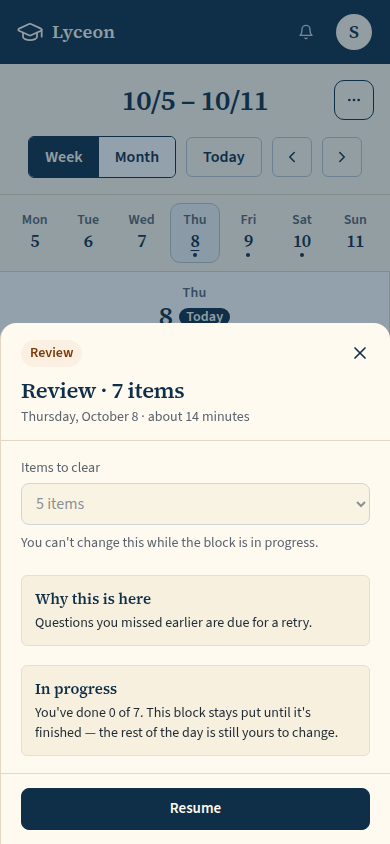 `/calendar`, 48 KB, horizontal overflow 0px | none |
| mobile | dark | 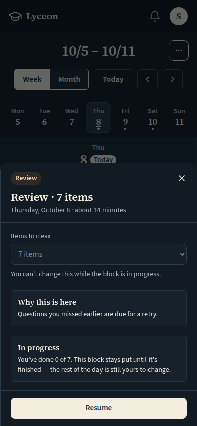 `/calendar`, 47 KB, horizontal overflow 0px | none |
| w1024 | light | 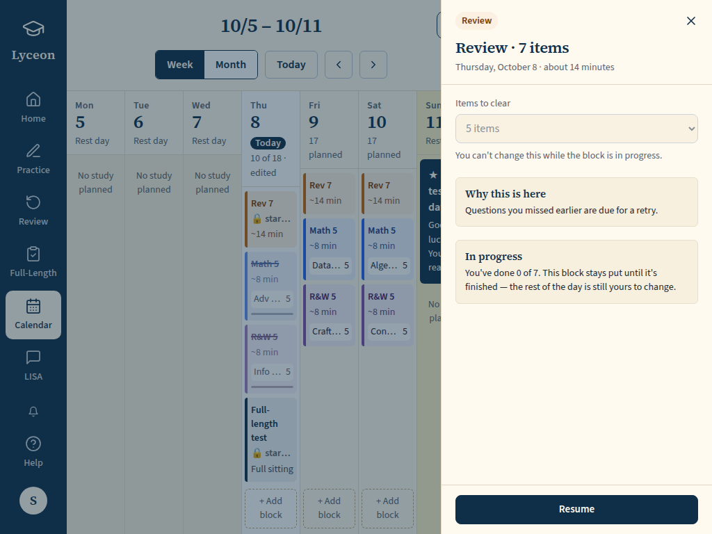 `/calendar`, 95 KB, horizontal overflow 0px | none |
| w1024 | dark | 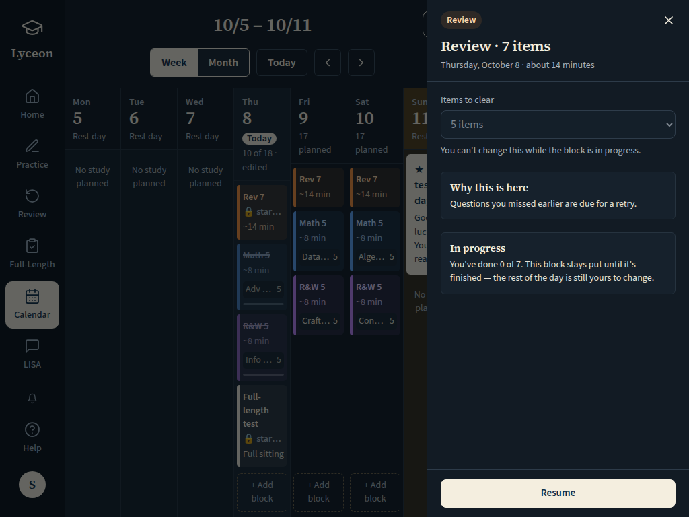 `/calendar`, 93 KB, horizontal overflow 0px | none |

## Calendar, free, no profile: the inline setup form (test date, target score, Save) and the plan upsell card; panel: mini month and the Target-only goal card, all absent

Persona: `free`. Route: `/calendar`.
Full page: the whole document, not just the viewport.
Prototype: `Calendar.dc.html` (Calendar, plan = free).

| Viewport | Theme (as rendered) | Built | Prototype |
|---|---|---|---|
| desktop | light |  `/calendar`, 85 KB, horizontal overflow 0px | , 106 KB |
| desktop | dark |  `/calendar`, 87 KB, horizontal overflow 0px | , 109 KB |
| mobile | light |  `/calendar`, 73 KB, horizontal overflow 0px |  desktop prototype (no phone layout), 106 KB |
| mobile | dark |  `/calendar`, 76 KB, horizontal overflow 0px |  desktop prototype (no phone layout), 109 KB |

## Click path (free): type a test date and a target, Save (PUT /api/calendar/profile through the real route); the card then shows them read-only with Edit goals in Settings (OQ-56 (b)), and the goal card counts down to the saved date

Persona: `free`. Route: `/calendar`.
No study profile before each capture (the persona's `student_study_profile` row is deleted from the harness database), so the save is a first save in every viewport and theme.
Step: type `2026-12-05` into `{"desktop":"[data-testid=\"calendar-free-test-date\"]","mobile":"[data-testid=\"calendar-free-test-date\"]"}`.
Step: type `1400` into `{"desktop":"[data-testid=\"calendar-free-target\"]","mobile":"[data-testid=\"calendar-free-target\"]"}`.
Step: click `{"desktop":"[data-testid=\"calendar-free-save\"]","mobile":"[data-testid=\"calendar-free-save\"]"}`.
Must then show the text `Edit goals in Settings` (the capture fails otherwise).
Full page: the whole document, not just the viewport.
Prototype: none. A click path; its proof is the saved goal the page then shows (the prototype's Save is not wired).

| Viewport | Theme (as rendered) | Built | Prototype |
|---|---|---|---|
| desktop | light |  `/calendar`, 95 KB, horizontal overflow 0px | none |
| desktop | dark |  `/calendar`, 97 KB, horizontal overflow 0px | none |
| mobile | light |  `/calendar`, 85 KB, horizontal overflow 0px | none |
| mobile | dark |  `/calendar`, 88 KB, horizontal overflow 0px | none |

## Calendar, free, with the profile saved: the card shows the saved answers read-only with Edit goals in Settings (read from GET /api/calendar/profile, no plan read; OQ-56 (b)); panel: the ★ test date and Target

Persona: `free`. Route: `/calendar`.
Full page: the whole document, not just the viewport.
Prototype: `Calendar.dc.html` (Calendar, plan = free (the canvas shows its own sample date and target)).

| Viewport | Theme (as rendered) | Built | Prototype |
|---|---|---|---|
| desktop | light |  `/calendar`, 95 KB, horizontal overflow 0px | , 106 KB |
| desktop | dark |  `/calendar`, 97 KB, horizontal overflow 0px | , 109 KB |
| mobile | light |  `/calendar`, 85 KB, horizontal overflow 0px |  desktop prototype (no phone layout), 106 KB |
| mobile | dark |  `/calendar`, 88 KB, horizontal overflow 0px |  desktop prototype (no phone layout), 109 KB |

## Run facts

- Seeded ids: `{"free":{"completedPracticeSessionId":"8d55e41a-f37d-46eb-a2ec-aee6bc3d1495","openPracticeSessionId":"a82059e6-0b2c-4a2b-ad28-f06582ed01fb","openReviewSessionId":null,"diagnosticSessionId":null,"scoredExamSessionId":null,"inProgressExamSessionId":null,"lisaConversationId":null,"answered":13},"paid":{"completedPracticeSessionId":"826fa5db-b948-4402-8b3c-882af7e8487a","openPracticeSessionId":"31a52897-ca84-4b74-ba47-636d53728f4d","openReviewSessionId":null,"diagnosticSessionId":"a4021077-34e8-4b95-b858-8e2f17e7f498","scoredExamSessionId":null,"inProgressExamSessionId":null,"lisaConversationId":null,"answered":53}}`
- Endpoints the pages asked for that the harness does not serve (answered 404): none
- Desmos (QA2-B, opt-in `STUDENT_HARNESS_DESMOS=1`): not loaded (a local-only run; the calculator shows its unavailable line)
- External hosts blocked: none
