# UI-55 Calendar (/calendar): paid week and month, Regenerate plan, free setup before and after a save; light and dark, 1440 and 390

Generated 2026-10-03T17:34:31.710Z by `pnpm exec tsx tests/e2e/student-harness/capture.ts UI-55` (see `tests/e2e/student-harness/README.md`). Built = a production build of the real client (`vite preview`, or the dev server with STUDENT_HARNESS_CLIENT=dev) against the student harness (real routers over a local Postgres built from this repo's migrations; personas seeded through the real practice routes). Prototype = the signed-off `docs/plans/student-ui/design/prototype/*.dc.html`, rendered locally.

Conditions, read before comparing:
- Viewport screenshots (not full page) unless the shot says full page: desktop 1440x900, phone 390x844.
- The prototypes are a fixed 1440x900 canvas with no phone layout; phone rows show the desktop prototype.
- Dark is requested through the app's own per-device setting; the theme column records what the page rendered.
- No external requests: the built app's Google Fonts (Inter, Poppins) are blocked, so legacy page bodies fall back to system faces; Source Sans 3 / Source Serif 4 are self-hosted and load for both sides.
- Prototype data is illustrative; built data is the seeded personas' real payloads.

## Calendar, paid, week: Week/Month, Today, arrows; the range centred (M/D – M/D); Edit schedule and Regenerate plan; the starred test day; panel: mini month (★), goal card (days until, ★ pill, Target | Projected), Your schedule, Show

Persona: `paid`. Route: `/calendar`.
Prototype: `Calendar.dc.html` (Calendar, plan = paid, week).

| Viewport | Theme (as rendered) | Built | Prototype |
|---|---|---|---|
| desktop | light |  `/calendar`, 141 KB, horizontal overflow 0px | , 175 KB |
| desktop | dark | 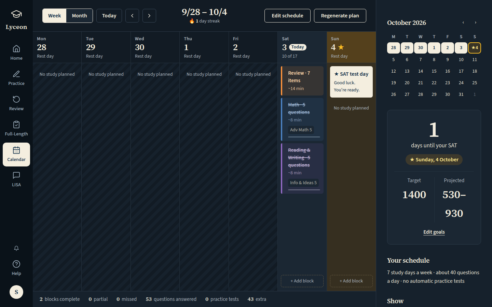 `/calendar`, 142 KB, horizontal overflow 0px | 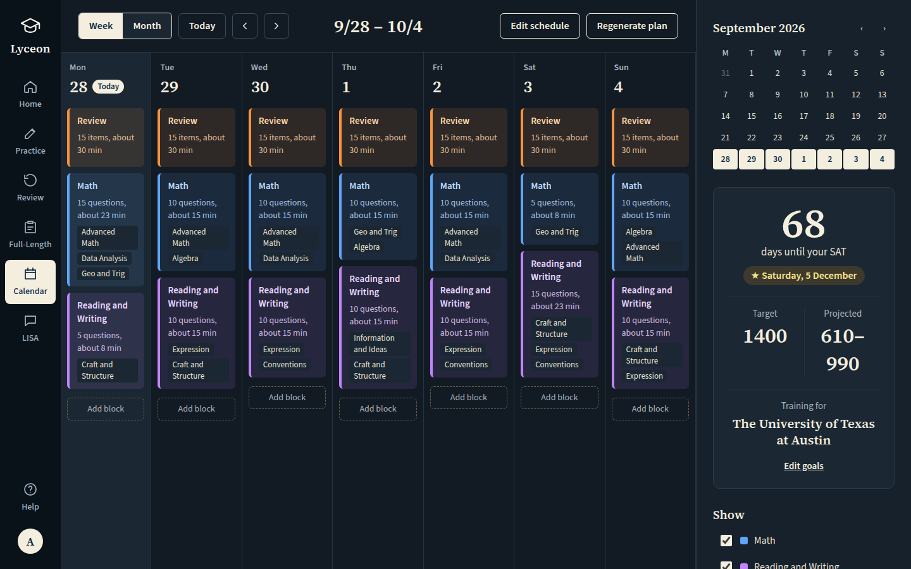, 182 KB |
| mobile | light |  `/calendar`, 44 KB, horizontal overflow 0px |  desktop prototype (no phone layout), 175 KB |
| mobile | dark |  `/calendar`, 44 KB, horizontal overflow 0px |  desktop prototype (no phone layout), 182 KB |

## Calendar, paid, week, full page (on a phone the right panel stacks under the main column)

Persona: `paid`. Route: `/calendar`.
Full page: the whole document, not just the viewport.
Prototype: `Calendar.dc.html` (Calendar, plan = paid (the canvas is a fixed 1440x900)).

| Viewport | Theme (as rendered) | Built | Prototype |
|---|---|---|---|
| desktop | light | 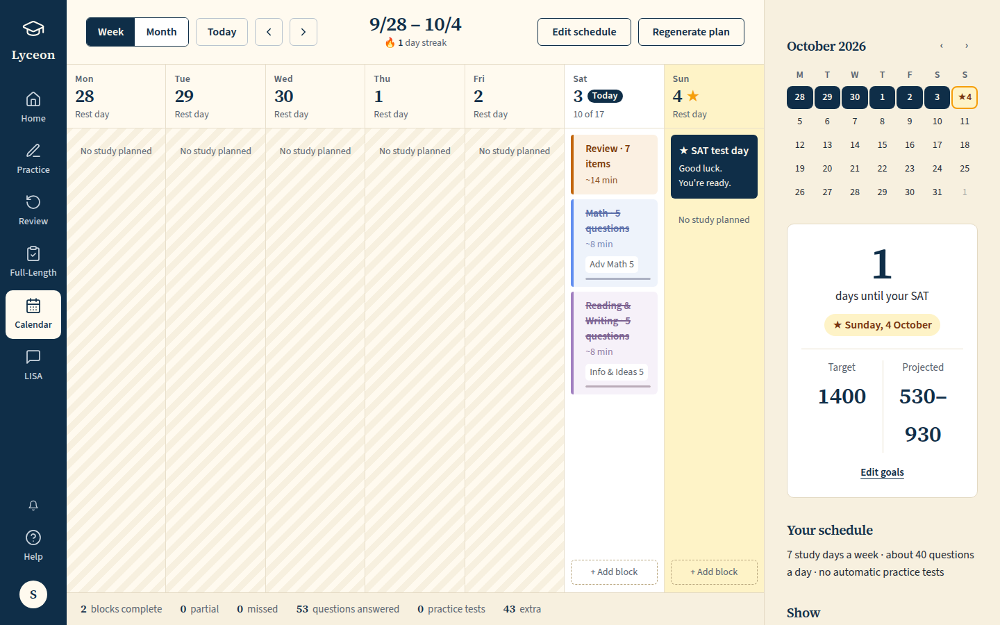 `/calendar`, 141 KB, horizontal overflow 0px | , 175 KB |
| desktop | dark |  `/calendar`, 142 KB, horizontal overflow 0px | , 182 KB |
| mobile | light |  `/calendar`, 97 KB, horizontal overflow 0px |  desktop prototype (no phone layout), 175 KB |
| mobile | dark |  `/calendar`, 98 KB, horizontal overflow 0px |  desktop prototype (no phone layout), 182 KB |

## Click path (paid): the Month toggle shows the month grid, the test day starred and labelled

Persona: `paid`. Route: `/calendar`.
Step: click `{"desktop":"[data-testid=\"calendar-view-month\"]","mobile":"[data-testid=\"calendar-view-month\"]"}`.
Prototype: `Calendar.dc.html` (Calendar, plan = paid, Month clicked); clicked: `div[role="group"][aria-label="View"] button:nth-of-type(2)`.

| Viewport | Theme (as rendered) | Built | Prototype |
|---|---|---|---|
| desktop | light | 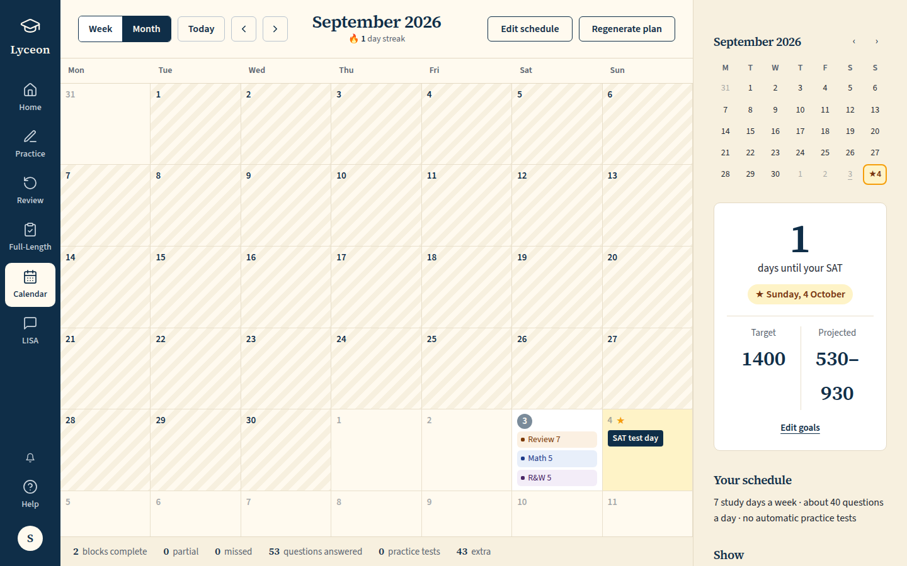 `/calendar`, 122 KB, horizontal overflow 0px | 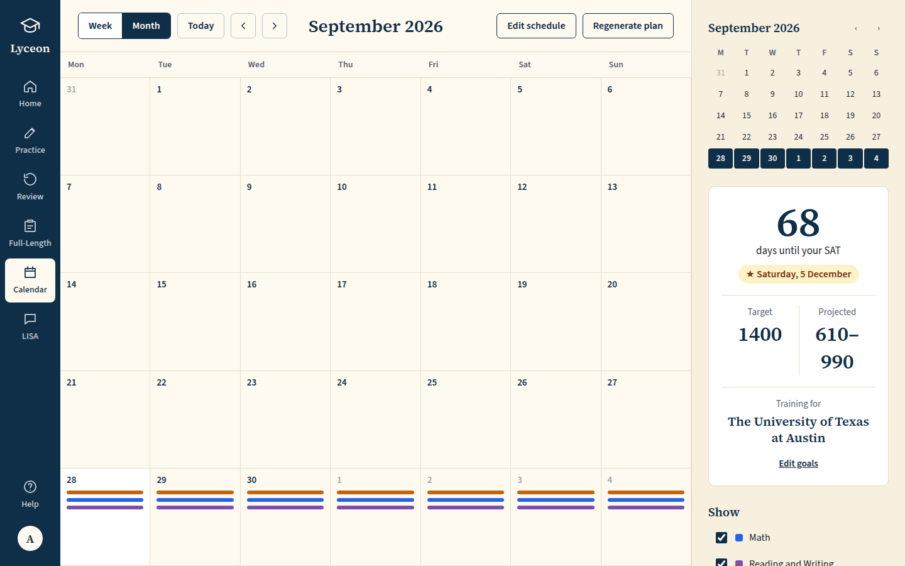, 87 KB |
| desktop | dark | 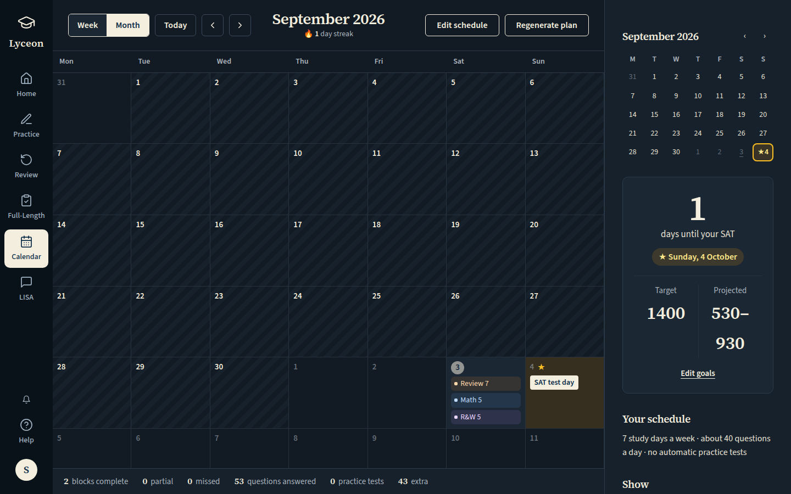 `/calendar`, 124 KB, horizontal overflow 0px | 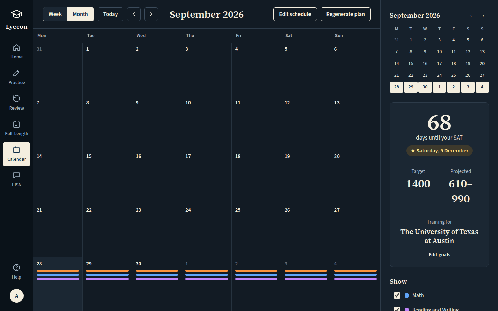, 88 KB |
| mobile | light |  `/calendar`, 42 KB, horizontal overflow 0px |  desktop prototype (no phone layout), 87 KB |
| mobile | dark |  `/calendar`, 42 KB, horizontal overflow 0px |  desktop prototype (no phone layout), 88 KB |

## Click path (paid): Regenerate plan posts to POST /api/calendar/plan/regenerate and returns; the button then reads "Plan regenerated"

Persona: `paid`. Route: `/calendar`.
Step: click `{"desktop":"[data-testid=\"calendar-regenerate\"]","mobile":"[data-testid=\"calendar-regenerate\"]"}`.
Must then show the text `Plan regenerated` (the capture fails otherwise).
Prototype: `Calendar.dc.html` (Calendar, plan = paid, Regenerate plan clicked); clicked: `button:has-text("Regenerate plan")`.

| Viewport | Theme (as rendered) | Built | Prototype |
|---|---|---|---|
| desktop | light | 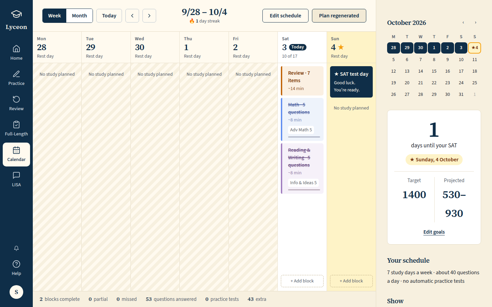 `/calendar`, 142 KB, horizontal overflow 0px | 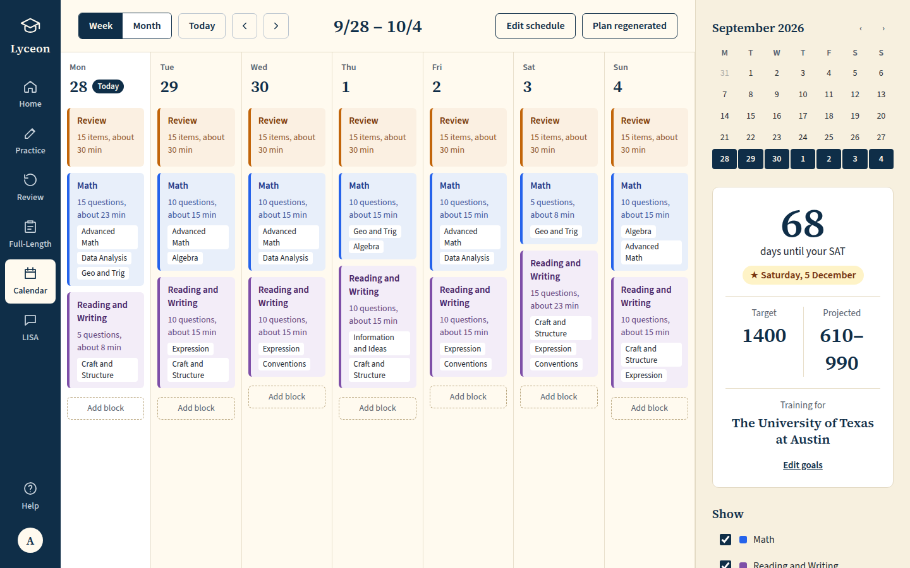, 175 KB |
| desktop | dark | 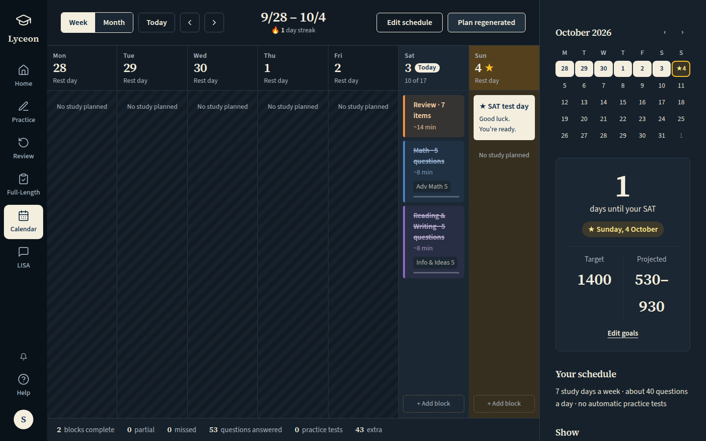 `/calendar`, 143 KB, horizontal overflow 0px | , 181 KB |
| mobile | light |  `/calendar`, 44 KB, horizontal overflow 0px |  desktop prototype (no phone layout), 175 KB |
| mobile | dark |  `/calendar`, 45 KB, horizontal overflow 0px |  desktop prototype (no phone layout), 181 KB |

## Calendar, free, no profile: the inline setup form (test date, target score, Save) and the plan upsell card; panel: mini month and the Target-only goal card, all absent

Persona: `free`. Route: `/calendar`.
Full page: the whole document, not just the viewport.
Prototype: `Calendar.dc.html` (Calendar, plan = free).

| Viewport | Theme (as rendered) | Built | Prototype |
|---|---|---|---|
| desktop | light | 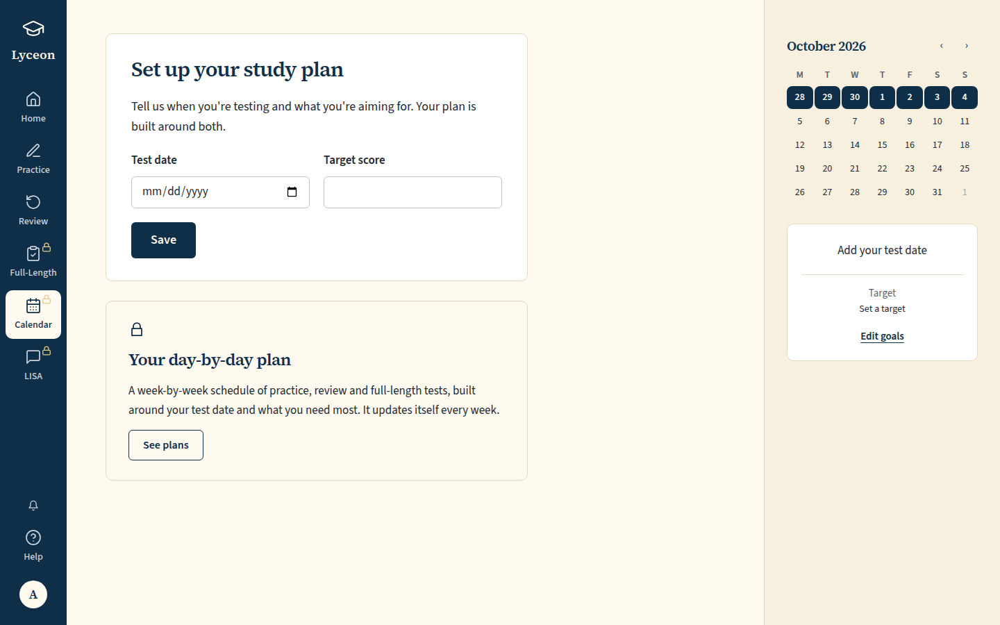 `/calendar`, 83 KB, horizontal overflow 0px | , 106 KB |
| desktop | dark | 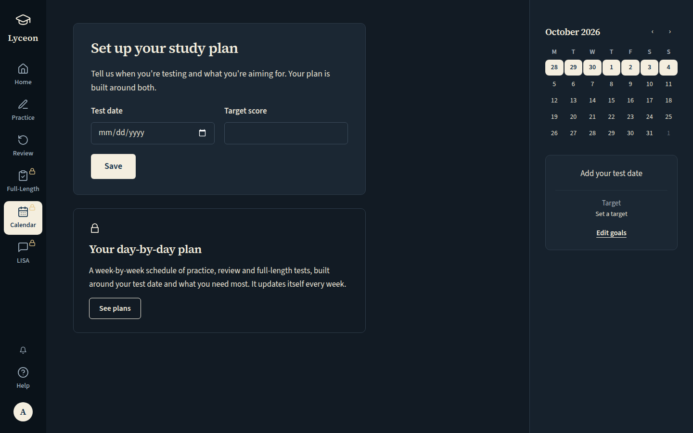 `/calendar`, 86 KB, horizontal overflow 0px | 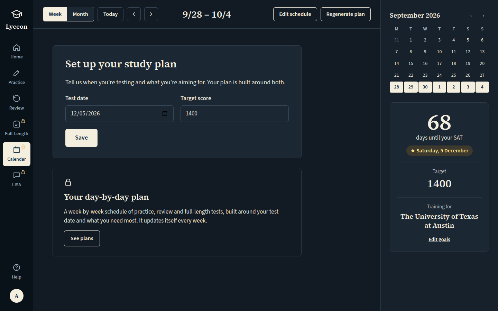, 109 KB |
| mobile | light |  `/calendar`, 72 KB, horizontal overflow 0px |  desktop prototype (no phone layout), 106 KB |
| mobile | dark |  `/calendar`, 75 KB, horizontal overflow 0px |  desktop prototype (no phone layout), 109 KB |

## Click path (free): type a test date and a target, Save (PUT /api/calendar/profile through the real route); the goal card then counts down to the saved date

Persona: `free`. Route: `/calendar`.
Step: type `2026-12-05` into `{"desktop":"[data-testid=\"calendar-free-test-date\"]","mobile":"[data-testid=\"calendar-free-test-date\"]"}`.
Step: type `1400` into `{"desktop":"[data-testid=\"calendar-free-target\"]","mobile":"[data-testid=\"calendar-free-target\"]"}`.
Step: click `{"desktop":"[data-testid=\"calendar-free-save\"]","mobile":"[data-testid=\"calendar-free-save\"]"}`.
Must then show the text `days until your SAT` (the capture fails otherwise).
Full page: the whole document, not just the viewport.
Prototype: none. A click path; its proof is the saved goal the page then shows (the prototype's Save is not wired).

| Viewport | Theme (as rendered) | Built | Prototype |
|---|---|---|---|
| desktop | light |  `/calendar`, 91 KB, horizontal overflow 0px | none |
| desktop | dark |  `/calendar`, 93 KB, horizontal overflow 0px | none |
| mobile | light |  `/calendar`, 80 KB, horizontal overflow 0px | none |
| mobile | dark |  `/calendar`, 83 KB, horizontal overflow 0px | none |

## Calendar, free, with the profile saved: the form shows the saved answers (read from GET /api/calendar/profile, no plan read); panel: the ★ test date and Target

Persona: `free`. Route: `/calendar`.
Full page: the whole document, not just the viewport.
Prototype: `Calendar.dc.html` (Calendar, plan = free (the canvas shows its own sample date and target)).

| Viewport | Theme (as rendered) | Built | Prototype |
|---|---|---|---|
| desktop | light | 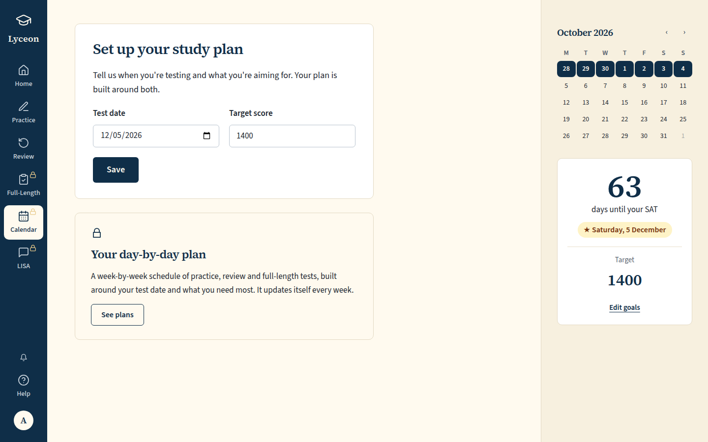 `/calendar`, 91 KB, horizontal overflow 0px | , 106 KB |
| desktop | dark | 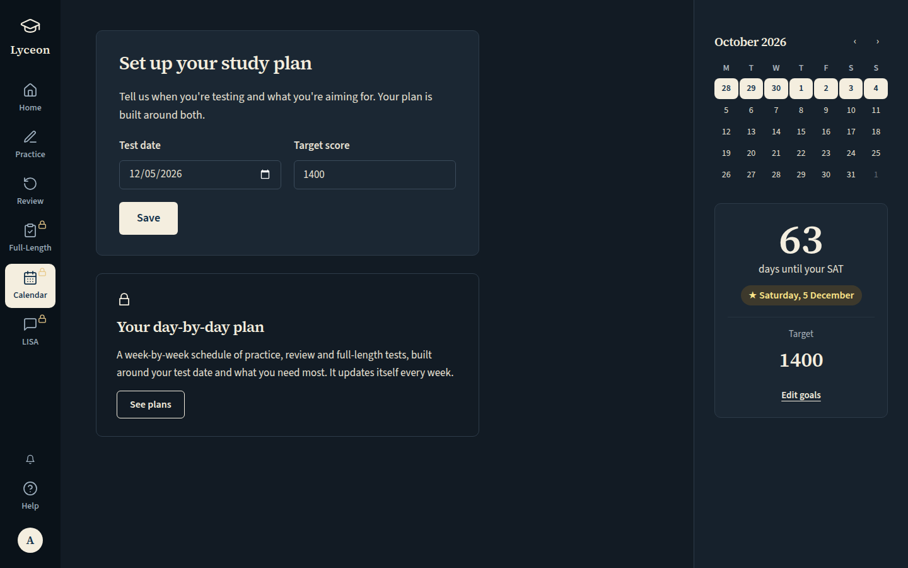 `/calendar`, 93 KB, horizontal overflow 0px | , 109 KB |
| mobile | light |  `/calendar`, 80 KB, horizontal overflow 0px |  desktop prototype (no phone layout), 106 KB |
| mobile | dark |  `/calendar`, 83 KB, horizontal overflow 0px |  desktop prototype (no phone layout), 109 KB |

## Run facts

- Seeded ids: `{"free":{"completedPracticeSessionId":"a0c0df4d-8655-44bd-b98e-961cba526d84","openPracticeSessionId":"e6ceefaf-9739-402c-95f8-5afaee7378c1","openReviewSessionId":null,"diagnosticSessionId":null,"scoredExamSessionId":null,"inProgressExamSessionId":null,"answered":13},"paid":{"completedPracticeSessionId":"ac00fa97-b48a-40fc-b687-05483e64336f","openPracticeSessionId":"df2d6559-87ae-44f4-9f64-f0991378d3b2","openReviewSessionId":null,"diagnosticSessionId":"5094324c-77b4-44a4-8988-523f2369a06f","scoredExamSessionId":null,"inProgressExamSessionId":null,"answered":53}}`
- Endpoints the pages asked for that the harness does not serve (answered 404): none
- External hosts blocked: `fonts.googleapis.com`
