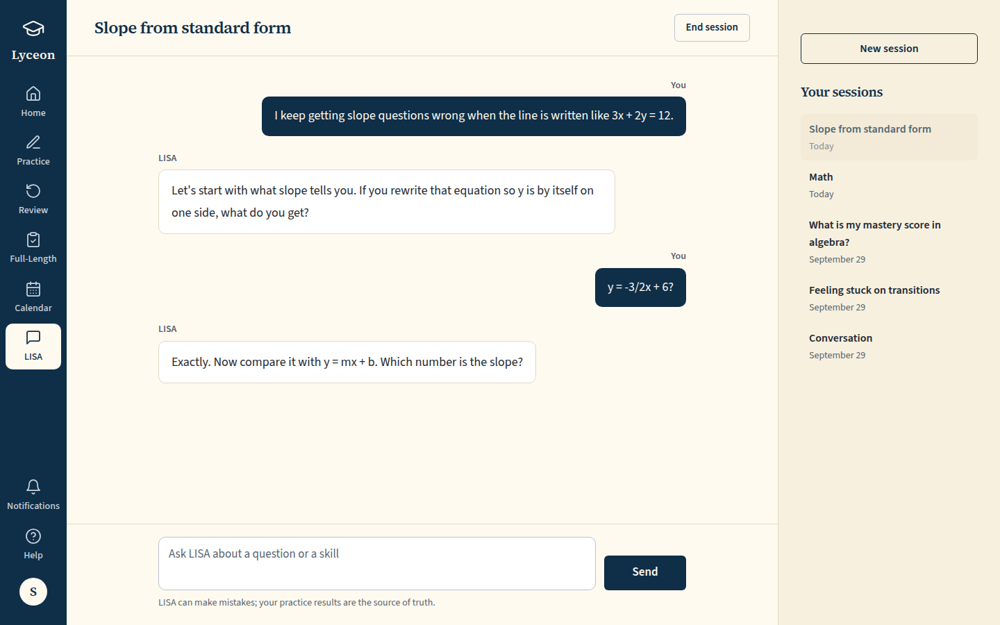
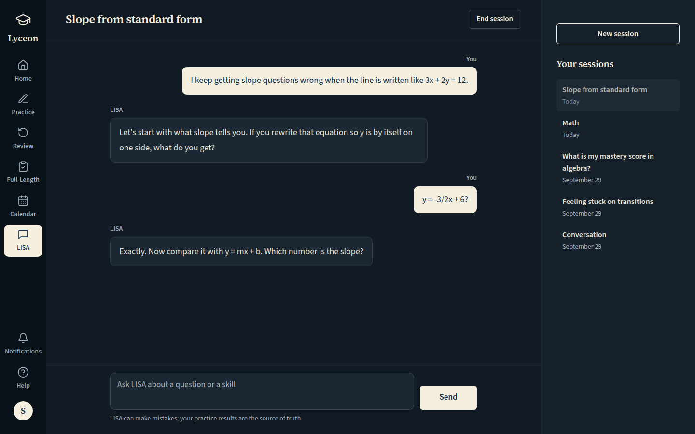
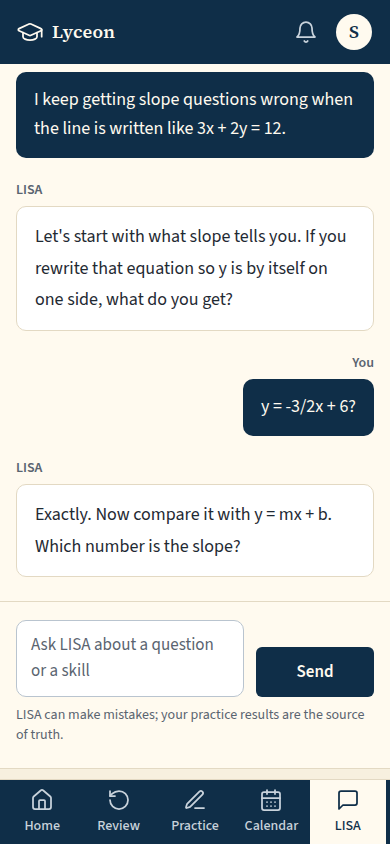

# UI-56 LISA (/chat): paid conversation, typing, New session; free locked card and Unlock LISA; light and dark, 1440 and 390

Generated 2026-10-08T03:39:47.041Z by `pnpm exec tsx tests/e2e/student-harness/capture.ts UI-56` (see `tests/e2e/student-harness/README.md`). Built = a production build of the real client (`vite preview`, or the dev server with STUDENT_HARNESS_CLIENT=dev) against the student harness (real routers over a local Postgres built from this repo's migrations; personas seeded through the real practice routes). Prototype = the signed-off `docs/plans/student-ui/design/prototype/*.dc.html`, rendered locally.

Conditions, read before comparing:
- Viewport screenshots (not full page) unless the shot says full page: desktop 1440x900, phone 390x844, and any extra size a shot names.
- The prototypes are a fixed 1440x900 canvas with no phone layout; phone rows show the desktop prototype.
- Dark is requested through the app's own per-device setting; the theme column records what the page rendered.
- No external requests: the built app's Google Fonts (Inter, Poppins) are blocked, so legacy page bodies fall back to system faces; Source Sans 3 / Source Serif 4 are self-hosted and load for both sides.
- Prototype data is illustrative; built data is the seeded personas' real payloads.

## LISA, paid: the conversation in the 760px column (You / LISA labels), the composer and the disclaimer; panel: New session, "Your sessions" (Today / date), the open one current

Persona: `paid`. Route: `/chat?conversationId={paid.lisaConversationId}`.
Prototype: `Lisa.dc.html` (LISA, plan = paid).

| Viewport | Theme (as rendered) | Built | Prototype |
|---|---|---|---|
| desktop | light |  `/chat`, 91 KB, horizontal overflow 0px | , 89 KB |
| desktop | dark |  `/chat`, 93 KB, horizontal overflow 0px | , 90 KB |
| mobile | light |  `/chat`, 55 KB, horizontal overflow 0px |  desktop prototype (no phone layout), 89 KB |
| mobile | dark |  `/chat`, 56 KB, horizontal overflow 0px |  desktop prototype (no phone layout), 90 KB |

## LISA, paid, full page (on a phone the right panel stacks under the composer)

Persona: `paid`. Route: `/chat?conversationId={paid.lisaConversationId}`.
Full page: the whole document, not just the viewport.
Prototype: `Lisa.dc.html` (LISA, plan = paid (the canvas is a fixed 1440x900)).

| Viewport | Theme (as rendered) | Built | Prototype |
|---|---|---|---|
| desktop | light |  `/chat`, 91 KB, horizontal overflow 0px | , 89 KB |
| desktop | dark |  `/chat`, 93 KB, horizontal overflow 0px | , 90 KB |
| mobile | light |  `/chat`, 83 KB, horizontal overflow 0px |  desktop prototype (no phone layout), 89 KB |
| mobile | dark |  `/chat`, 84 KB, horizontal overflow 0px |  desktop prototype (no phone layout), 90 KB |

## Click path (paid): type a message and press Send; the student's bubble shows at once, then LISA's typing bubble (three dots, still under reduced motion), and Send reads 'Sending…', disabled and busy, from the click (QA 2026-10-07 item 5). The request is held in the browser, so no turn runs

Persona: `paid`. Route: `/chat?conversationId={paid.lisaConversationId}`.
Step: type `So the slope is -3/2?` into `{"desktop":"textarea[aria-label=\"Message\"]","mobile":"textarea[aria-label=\"Message\"]"}`.
Step: click `{"desktop":"button[aria-label=\"Send message\"]","mobile":"button[aria-label=\"Send message\"]"}`.
Held: the browser's `POST /api/tutor/messages` is left unanswered through the screenshot, then aborted (it never reaches the server).
Must then show `button[aria-label="Send message"][data-pending="true"]` (the capture fails otherwise).
Prototype: `Lisa.dc.html` (LISA, plan = paid (the canvas's typing state needs a typed draft; its steps are clicks only, so it is shown idle)).

| Viewport | Theme (as rendered) | Built | Prototype |
|---|---|---|---|
| desktop | light |  `/chat`, 97 KB, horizontal overflow 0px | , 89 KB |
| desktop | dark |  `/chat`, 98 KB, horizontal overflow 0px | , 90 KB |
| mobile | light |  `/chat`, 46 KB, horizontal overflow 0px |  desktop prototype (no phone layout), 89 KB |
| mobile | dark |  `/chat`, 47 KB, horizontal overflow 0px |  desktop prototype (no phone layout), 90 KB |

## Click path (paid): New session opens an empty column under "New session" with the short prompt (QA 2026-10-07 items 9 and 15: nothing is created until the first message, so the history does not gain a blank session)

Persona: `paid`. Route: `/chat?conversationId={paid.lisaConversationId}`.
Step: click `{"desktop":"[data-testid=\"lisa-new-session\"]","mobile":"[data-testid=\"lisa-new-session\"]"}`.
Must then show `[data-testid="lisa-empty-prompt"]` (the capture fails otherwise).
Must then show no `[data-testid="tutor-bubble"]` (the capture fails otherwise).
Prototype: `Lisa.dc.html` (LISA, plan = paid, New session clicked (the canvas does not clear its column)); clicked: `button:has-text("New session")`.

| Viewport | Theme (as rendered) | Built | Prototype |
|---|---|---|---|
| desktop | light |  `/chat`, 65 KB, horizontal overflow 0px | , 89 KB |
| desktop | dark |  `/chat`, 65 KB, horizontal overflow 0px | , 90 KB |
| mobile | light |  `/chat`, 46 KB, horizontal overflow 0px |  desktop prototype (no phone layout), 89 KB |
| mobile | dark |  `/chat`, 46 KB, horizontal overflow 0px |  desktop prototype (no phone layout), 90 KB |

## QA 2026-10-07 item 15 and titles: from the empty column, pick "Slope from standard form" in the history. On a phone (the history under the composer) the conversation and its composer come into view; at 1440 the column shows its last turn and the list keeps the pick in view. The history shows the crisis-flagged session as "Conversation", never its first message

Persona: `paid`. Route: `/chat`.
Step: click `{"desktop":"[data-testid=\"lisa-history-item\"]:has-text(\"Slope from standard form\")","mobile":"[data-testid=\"lisa-history-item\"]:has-text(\"Slope from standard form\")"}`.
Must then show `[data-testid="tutor-bubble"]` (the capture fails otherwise).
Prototype: none. Not prototyped: Lisa.dc.html is a fixed 1440x900 canvas with no phone layout and no crisis-flagged history row (QA 2026-10-07 items 15 and 1).

| Viewport | Theme (as rendered) | Built | Prototype |
|---|---|---|---|
| desktop | light |  `/chat`, 91 KB, horizontal overflow 0px | none |
| desktop | dark |  `/chat`, 93 KB, horizontal overflow 0px | none |
| mobile | light |  `/chat`, 55 KB, horizontal overflow 0px | none |
| mobile | dark |  `/chat`, 56 KB, horizontal overflow 0px | none |

## LISA, free: the locked card (shipped headline "A Tutor That Knows The SAT And Knows You", the prototype body, Unlock LISA); the right panel empty; no tutor request

Persona: `free`. Route: `/chat`.
Prototype: `Lisa.dc.html` (LISA, plan = free).

| Viewport | Theme (as rendered) | Built | Prototype |
|---|---|---|---|
| desktop | light |  `/chat`, 48 KB, horizontal overflow 0px | , 45 KB |
| desktop | dark |  `/chat`, 49 KB, horizontal overflow 0px | , 46 KB |
| mobile | light |  `/chat`, 38 KB, horizontal overflow 0px |  desktop prototype (no phone layout), 45 KB |
| mobile | dark |  `/chat`, 39 KB, horizontal overflow 0px |  desktop prototype (no phone layout), 46 KB |

## Click path (free): Unlock LISA opens the upgrade modal for tutor_access (See plans, Not now)

Persona: `free`. Route: `/chat`.
Step: click `{"desktop":"[data-testid=\"lisa-unlock\"]","mobile":"[data-testid=\"lisa-unlock\"]"}`.
Must then show `[data-testid="upgrade-modal"]` (the capture fails otherwise).
Prototype: `Lisa.dc.html` (LISA, plan = free, the locked LISA rail item clicked (the canvas's modal; its Unlock LISA is a plain link)); clicked: `button[aria-label="LISA, included with a paid plan"]`.

| Viewport | Theme (as rendered) | Built | Prototype |
|---|---|---|---|
| desktop | light |  `/chat`, 77 KB, horizontal overflow 0px | , 75 KB |
| desktop | dark |  `/chat`, 76 KB, horizontal overflow 0px | , 75 KB |
| mobile | light |  `/chat`, 54 KB, horizontal overflow 0px |  desktop prototype (no phone layout), 75 KB |
| mobile | dark |  `/chat`, 54 KB, horizontal overflow 0px |  desktop prototype (no phone layout), 75 KB |

## Run facts

- Seeded ids: `{"free":{"completedPracticeSessionId":"9376860c-c82a-4975-b52c-b9c165c9205e","openPracticeSessionId":"e1fae974-b789-48b2-ac2c-2435532f9a23","openReviewSessionId":null,"diagnosticSessionId":null,"scoredExamSessionId":null,"inProgressExamSessionId":null,"lisaConversationId":null,"answered":13},"paid":{"completedPracticeSessionId":"9f1e2aa6-a48f-49ef-83d1-02f51b342e98","openPracticeSessionId":"e7f23093-b5bd-4cb4-9ede-df9d20b38da5","openReviewSessionId":null,"diagnosticSessionId":"2b3d63b7-d36b-4b7a-9d37-3dc802758078","scoredExamSessionId":null,"inProgressExamSessionId":null,"lisaConversationId":"c2aa07e2-a578-499a-a4e7-97a80247d88a","answered":53}}`
- Endpoints the pages asked for that the harness does not serve (answered 404): none
- Desmos (QA2-B, opt-in `STUDENT_HARNESS_DESMOS=1`): not loaded (a local-only run; the calculator shows its unavailable line)
- External hosts blocked: none
