# UI-56 LISA (/chat): paid conversation, typing, New session; free locked card and Unlock LISA; light and dark, 1440 and 390

Generated 2026-10-03T18:29:04.917Z by `pnpm exec tsx tests/e2e/student-harness/capture.ts UI-56` (see `tests/e2e/student-harness/README.md`). Built = a production build of the real client (`vite preview`, or the dev server with STUDENT_HARNESS_CLIENT=dev) against the student harness (real routers over a local Postgres built from this repo's migrations; personas seeded through the real practice routes). Prototype = the signed-off `docs/plans/student-ui/design/prototype/*.dc.html`, rendered locally.

Conditions, read before comparing:
- Viewport screenshots (not full page) unless the shot says full page: desktop 1440x900, phone 390x844.
- The prototypes are a fixed 1440x900 canvas with no phone layout; phone rows show the desktop prototype.
- Dark is requested through the app's own per-device setting; the theme column records what the page rendered.
- No external requests: the built app's Google Fonts (Inter, Poppins) are blocked, so legacy page bodies fall back to system faces; Source Sans 3 / Source Serif 4 are self-hosted and load for both sides.
- Prototype data is illustrative; built data is the seeded personas' real payloads.

## LISA, paid: the conversation in the 760px column (You / LISA labels), the composer and the disclaimer; panel: New session, "Your sessions" (Today / date), the open one current

Persona: `paid`. Route: `/chat?conversationId={paid.lisaConversationId}`.
Prototype: `Lisa.dc.html` (LISA, plan = paid).

| Viewport | Theme (as rendered) | Built | Prototype |
|---|---|---|---|
| desktop | light |  `/chat`, 87 KB, horizontal overflow 0px | 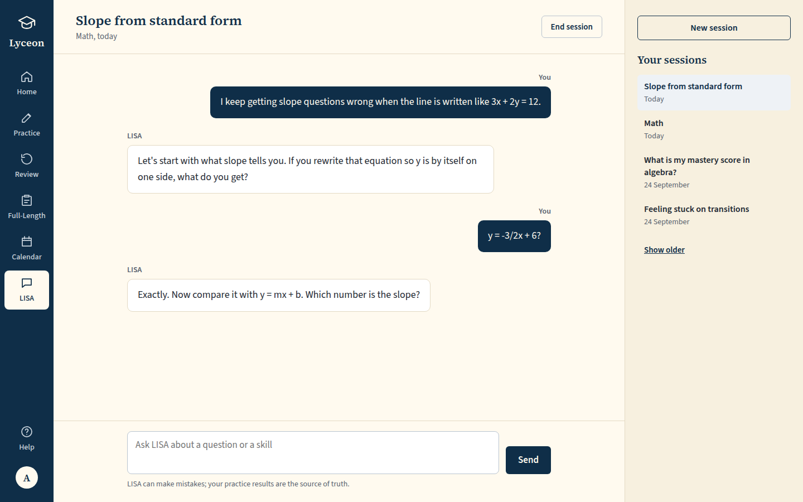, 89 KB |
| desktop | dark | 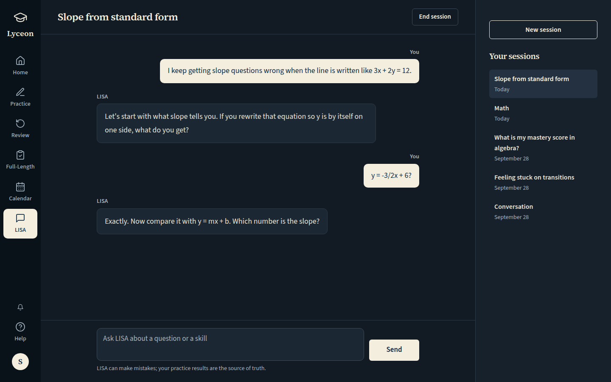 `/chat`, 88 KB, horizontal overflow 0px | , 90 KB |
| mobile | light |  `/chat`, 45 KB, horizontal overflow 0px |  desktop prototype (no phone layout), 89 KB |
| mobile | dark | 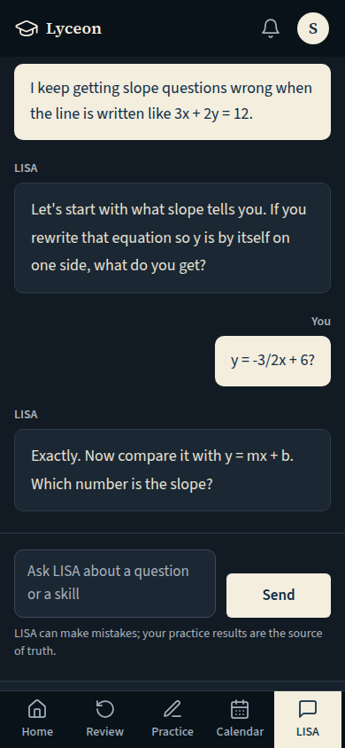 `/chat`, 46 KB, horizontal overflow 0px |  desktop prototype (no phone layout), 90 KB |

## LISA, paid, full page (on a phone the right panel stacks under the composer)

Persona: `paid`. Route: `/chat?conversationId={paid.lisaConversationId}`.
Full page: the whole document, not just the viewport.
Prototype: `Lisa.dc.html` (LISA, plan = paid (the canvas is a fixed 1440x900)).

| Viewport | Theme (as rendered) | Built | Prototype |
|---|---|---|---|
| desktop | light | 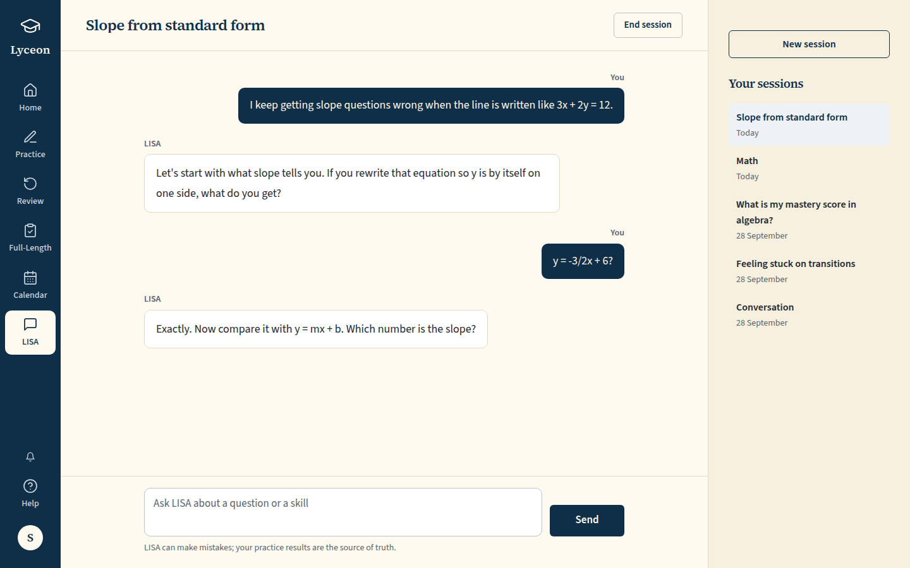 `/chat`, 87 KB, horizontal overflow 0px | , 89 KB |
| desktop | dark | 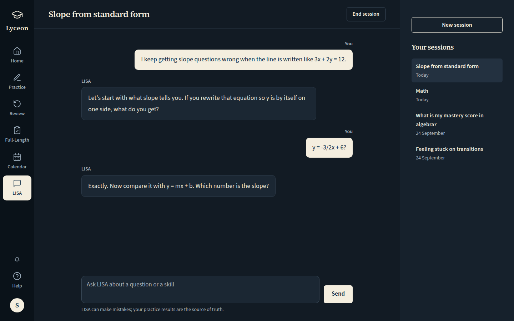 `/chat`, 88 KB, horizontal overflow 0px | , 90 KB |
| mobile | light | 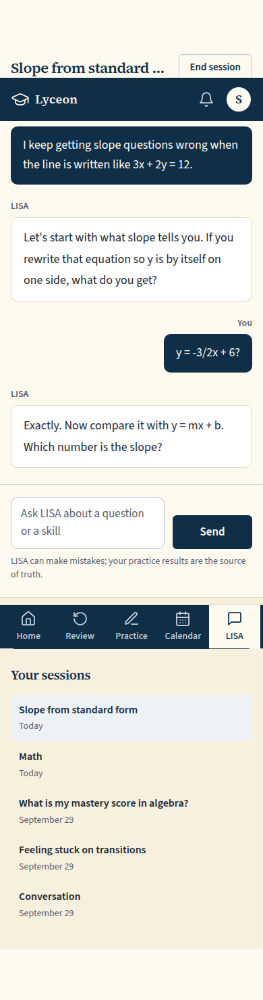 `/chat`, 76 KB, horizontal overflow 0px |  desktop prototype (no phone layout), 89 KB |
| mobile | dark | 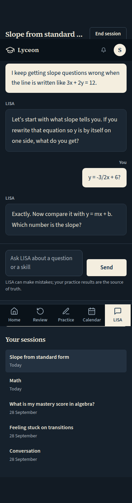 `/chat`, 78 KB, horizontal overflow 0px |  desktop prototype (no phone layout), 90 KB |

## Click path (paid): type a message and press Send; the student's bubble shows at once, then LISA's typing bubble (three dots, still under reduced motion), Send disabled. The request is held in the browser, so no turn runs

Persona: `paid`. Route: `/chat?conversationId={paid.lisaConversationId}`.
Step: type `So the slope is -3/2?` into `{"desktop":"textarea[aria-label=\"Message\"]","mobile":"textarea[aria-label=\"Message\"]"}`.
Step: click `{"desktop":"button[aria-label=\"Send message\"]","mobile":"button[aria-label=\"Send message\"]"}`.
Held: the browser's `POST /api/tutor/messages` is left unanswered through the screenshot, then aborted (it never reaches the server).
Must then show `[data-testid="lisa-typing"]` (the capture fails otherwise).
Prototype: `Lisa.dc.html` (LISA, plan = paid (the canvas's typing state needs a typed draft; its steps are clicks only, so it is shown idle)).

| Viewport | Theme (as rendered) | Built | Prototype |
|---|---|---|---|
| desktop | light | 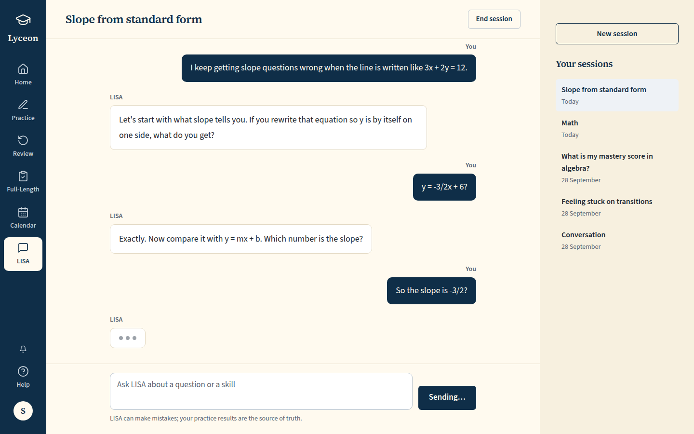 `/chat`, 91 KB, horizontal overflow 0px | , 89 KB |
| desktop | dark | 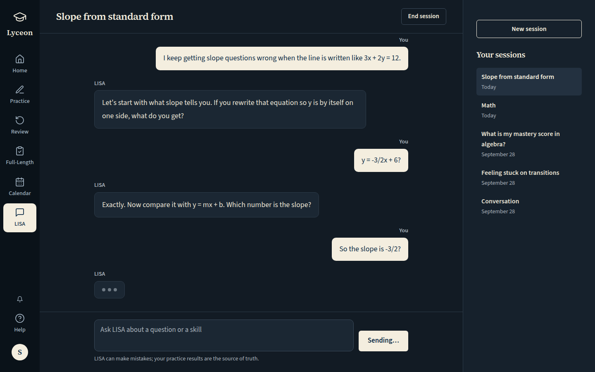 `/chat`, 92 KB, horizontal overflow 0px | , 90 KB |
| mobile | light | 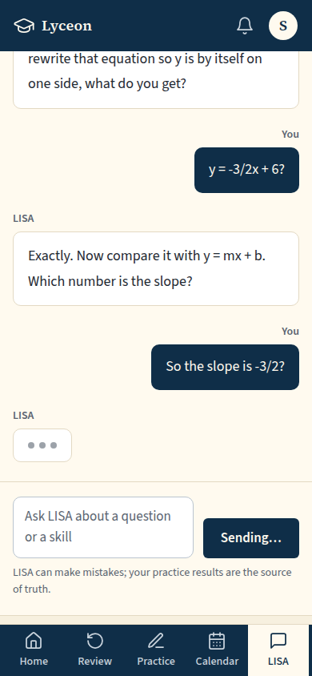 `/chat`, 41 KB, horizontal overflow 0px |  desktop prototype (no phone layout), 89 KB |
| mobile | dark | 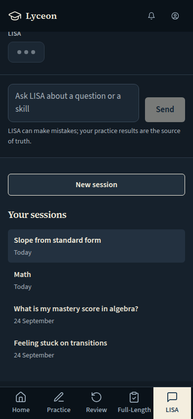 `/chat`, 41 KB, horizontal overflow 0px |  desktop prototype (no phone layout), 90 KB |

## Click path (paid): New session creates a conversation (real POST /api/tutor/conversations) and opens its empty column under "New session"; the history gains it

Persona: `paid`. Route: `/chat?conversationId={paid.lisaConversationId}`.
Step: click `{"desktop":"[data-testid=\"lisa-new-session\"]","mobile":"[data-testid=\"lisa-new-session\"]"}`.
Must then show no `[data-testid="tutor-bubble"]` (the capture fails otherwise).
Prototype: `Lisa.dc.html` (LISA, plan = paid, New session clicked (the canvas does not clear its column)); clicked: `button:has-text("New session")`.

| Viewport | Theme (as rendered) | Built | Prototype |
|---|---|---|---|
| desktop | light | 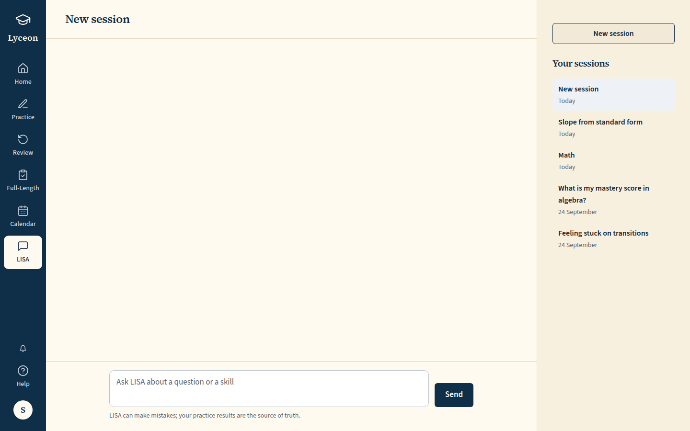 `/chat`, 55 KB, horizontal overflow 0px | , 89 KB |
| desktop | dark | 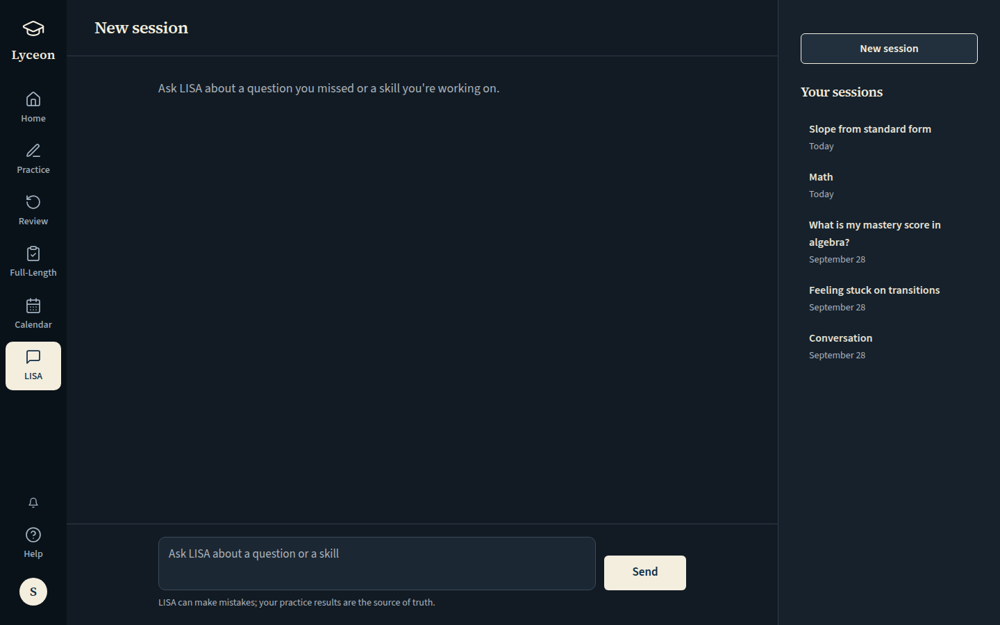 `/chat`, 58 KB, horizontal overflow 0px | 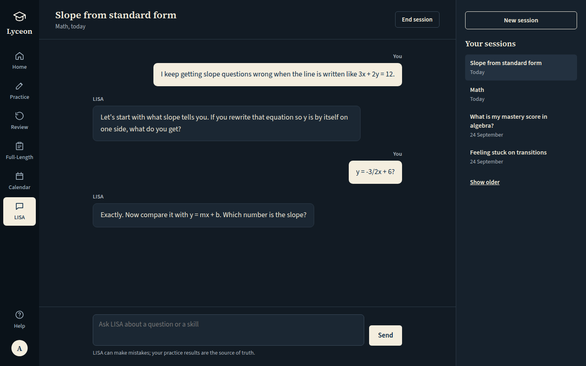, 90 KB |
| mobile | light | 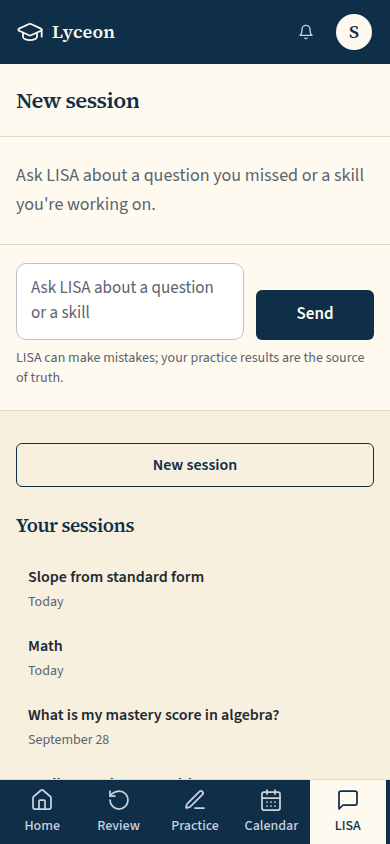 `/chat`, 36 KB, horizontal overflow 0px |  desktop prototype (no phone layout), 89 KB |
| mobile | dark | 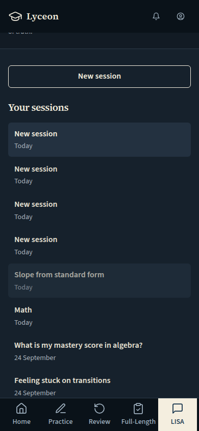 `/chat`, 38 KB, horizontal overflow 0px |  desktop prototype (no phone layout), 90 KB |

## LISA, free: the locked card (shipped headline "A Tutor That Knows The SAT And Knows You", the prototype body, Unlock LISA); the right panel empty; no tutor request

Persona: `free`. Route: `/chat`.
Prototype: `Lisa.dc.html` (LISA, plan = free).

| Viewport | Theme (as rendered) | Built | Prototype |
|---|---|---|---|
| desktop | light |  `/chat`, 46 KB, horizontal overflow 0px | , 45 KB |
| desktop | dark | 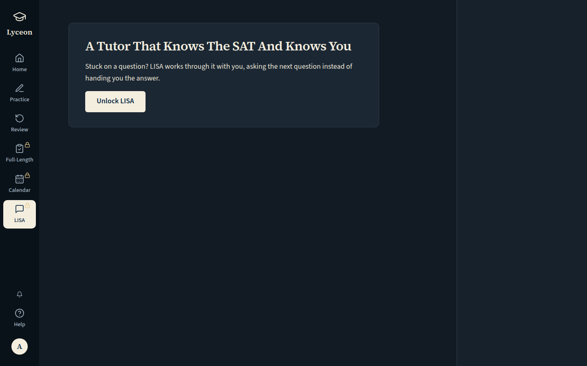 `/chat`, 47 KB, horizontal overflow 0px | 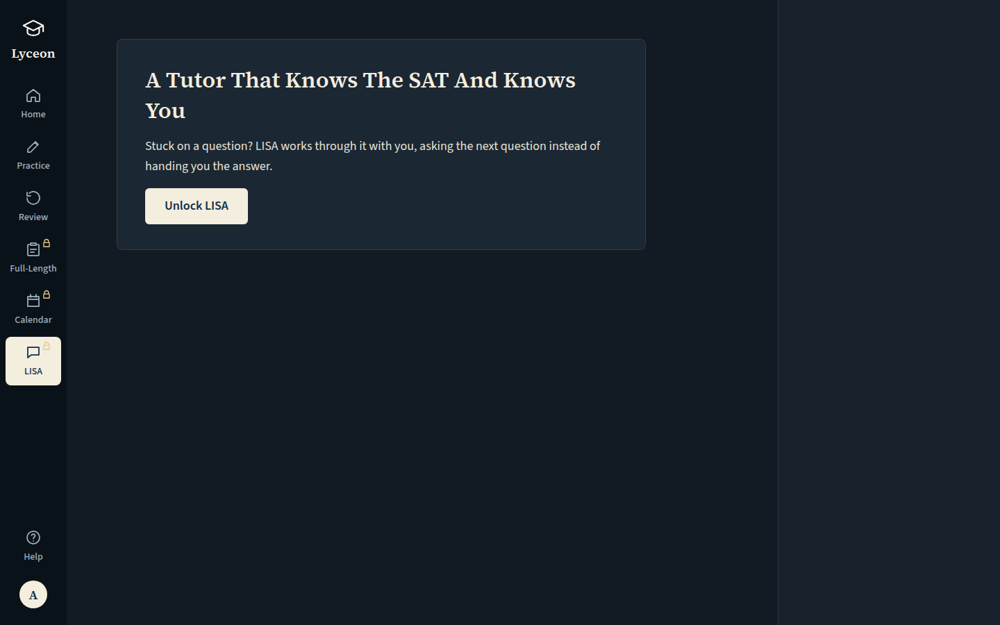, 46 KB |
| mobile | light | 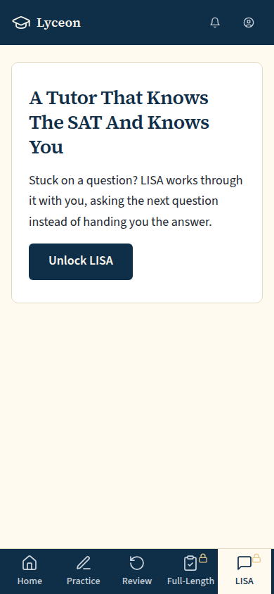 `/chat`, 38 KB, horizontal overflow 0px |  desktop prototype (no phone layout), 45 KB |
| mobile | dark |  `/chat`, 39 KB, horizontal overflow 0px |  desktop prototype (no phone layout), 46 KB |

## Click path (free): Unlock LISA opens the upgrade modal for tutor_access (See plans, Not now)

Persona: `free`. Route: `/chat`.
Step: click `{"desktop":"[data-testid=\"lisa-unlock\"]","mobile":"[data-testid=\"lisa-unlock\"]"}`.
Must then show `[data-testid="upgrade-modal"]` (the capture fails otherwise).
Prototype: `Lisa.dc.html` (LISA, plan = free, the locked LISA rail item clicked (the canvas's modal; its Unlock LISA is a plain link)); clicked: `button[aria-label="LISA, included with a paid plan"]`.

| Viewport | Theme (as rendered) | Built | Prototype |
|---|---|---|---|
| desktop | light | 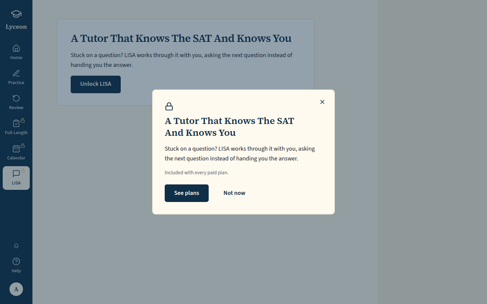 `/chat`, 76 KB, horizontal overflow 0px | 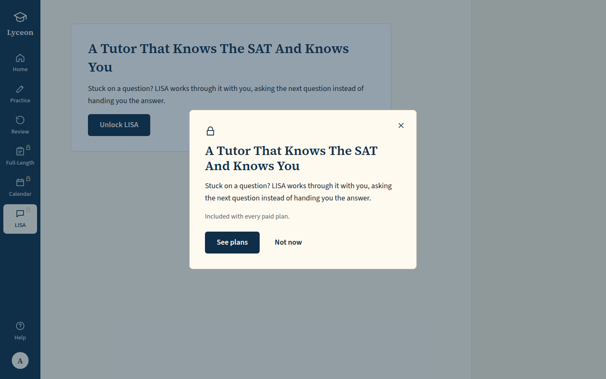, 75 KB |
| desktop | dark | 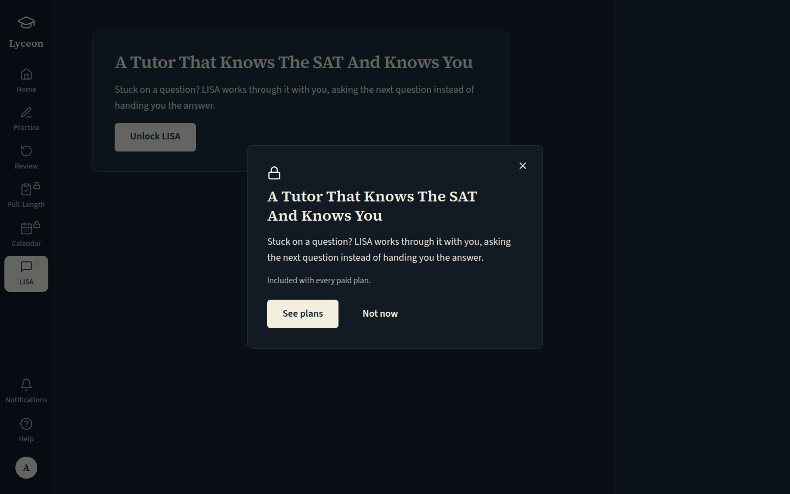 `/chat`, 75 KB, horizontal overflow 0px | 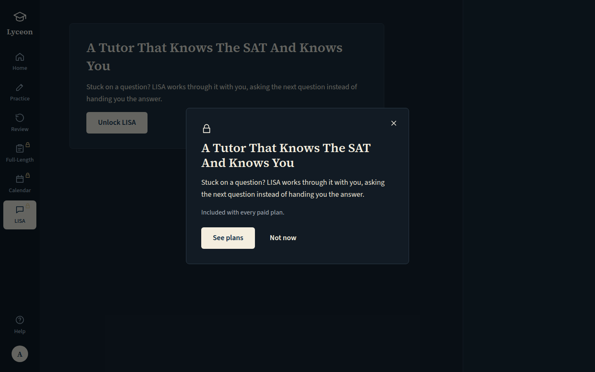, 75 KB |
| mobile | light | 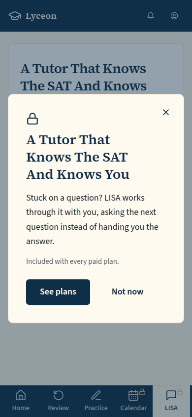 `/chat`, 54 KB, horizontal overflow 0px |  desktop prototype (no phone layout), 75 KB |
| mobile | dark | 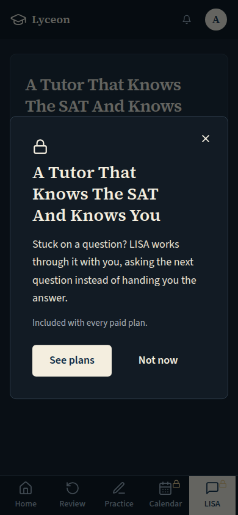 `/chat`, 53 KB, horizontal overflow 0px |  desktop prototype (no phone layout), 75 KB |

## Run facts

- Seeded ids: `{"free":{"completedPracticeSessionId":"c5321ee5-d058-4988-a497-1814ae2c5503","openPracticeSessionId":"aa162262-b400-49c3-98e2-005949127ae8","openReviewSessionId":null,"diagnosticSessionId":null,"scoredExamSessionId":null,"inProgressExamSessionId":null,"lisaConversationId":null,"answered":13},"paid":{"completedPracticeSessionId":"131e9759-82c3-4c3e-80e3-c63e778bd9d5","openPracticeSessionId":"5df8152e-ff12-4bfe-b874-d4a8bfbd0974","openReviewSessionId":null,"diagnosticSessionId":"a3e0a7be-6845-418c-ad37-55def6843736","scoredExamSessionId":null,"inProgressExamSessionId":null,"lisaConversationId":"3daa2183-5390-4f68-9c4e-c05348420cde","answered":53}}`
- Endpoints the pages asked for that the harness does not serve (answered 404): none
- External hosts blocked: `fonts.googleapis.com`
