# UI-57 Mastery (/mastery, not prototyped): paid domains and an opened skills list, free locked card; light and dark, 1440 and 390

Generated 2026-10-03T19:06:20.049Z by `pnpm exec tsx tests/e2e/student-harness/capture.ts UI-57` (see `tests/e2e/student-harness/README.md`). Built = a production build of the real client (`vite preview`, or the dev server with STUDENT_HARNESS_CLIENT=dev) against the student harness (real routers over a local Postgres built from this repo's migrations; personas seeded through the real practice routes). Prototype = the signed-off `docs/plans/student-ui/design/prototype/*.dc.html`, rendered locally.

Conditions, read before comparing:
- Viewport screenshots (not full page) unless the shot says full page: desktop 1440x900, phone 390x844.
- The prototypes are a fixed 1440x900 canvas with no phone layout; phone rows show the desktop prototype.
- Dark is requested through the app's own per-device setting; the theme column records what the page rendered.
- No external requests: the built app's Google Fonts (Inter, Poppins) are blocked, so legacy page bodies fall back to system faces; Source Sans 3 / Source Serif 4 are self-hosted and load for both sides.
- Prototype data is illustrative; built data is the seeded personas' real payloads.

## Mastery, paid: the eight domains as wide mastery rows, Math then Reading & Writing (no right panel, no footer)

Persona: `paid`. Route: `/mastery`.
Full page: the whole document, not just the viewport.
Prototype: `Main.dc.html` (NOT PROTOTYPED. Visual reference only: Home, plan = paid (its Mastery block uses the same wide rows)).

| Viewport | Theme (as rendered) | Built | Prototype |
|---|---|---|---|
| desktop | light | 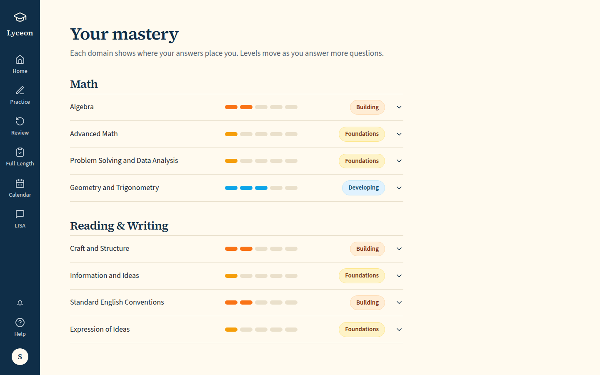 `/mastery`, 86 KB, horizontal overflow 0px | 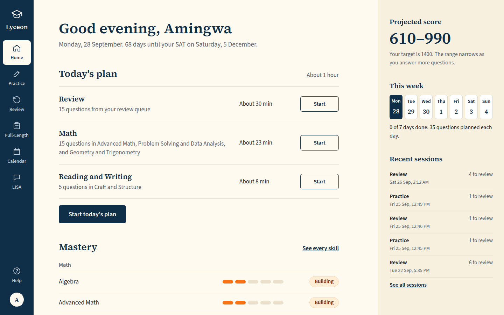, 147 KB |
| desktop | dark | 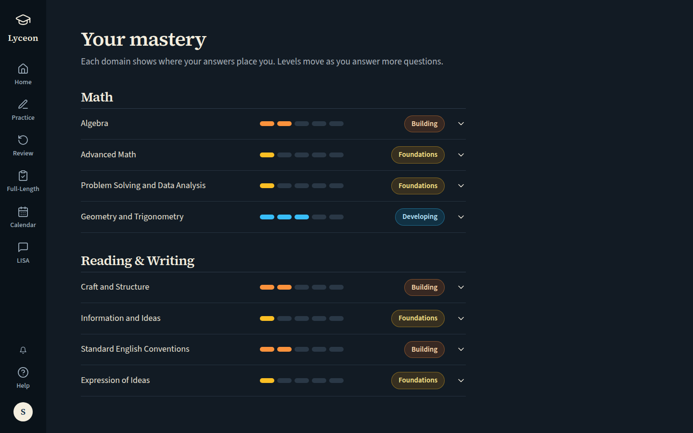 `/mastery`, 89 KB, horizontal overflow 0px | , 147 KB |
| mobile | light |  `/mastery`, 72 KB, horizontal overflow 0px |  desktop prototype (no phone layout), 147 KB |
| mobile | dark |  `/mastery`, 75 KB, horizontal overflow 0px |  desktop prototype (no phone layout), 147 KB |

## Mastery, paid, Algebra opened: its skills listed beneath it, measured and unmeasured, with one outline 'Practise Algebra'

Persona: `paid`. Route: `/mastery`.
Step: click `{"desktop":"[data-testid=\"mastery-domain\"][data-domain=\"Algebra\"] > button","mobile":"[data-testid=\"mastery-domain\"][data-domain=\"Algebra\"] > button"}`.
Must then show `[data-testid="skill-list"]` (the capture fails otherwise).
Full page: the whole document, not just the viewport.
Prototype: `Main.dc.html` (NOT PROTOTYPED. Visual reference only: Home, plan = paid (its Mastery block uses the same wide rows)).

| Viewport | Theme (as rendered) | Built | Prototype |
|---|---|---|---|
| desktop | light | 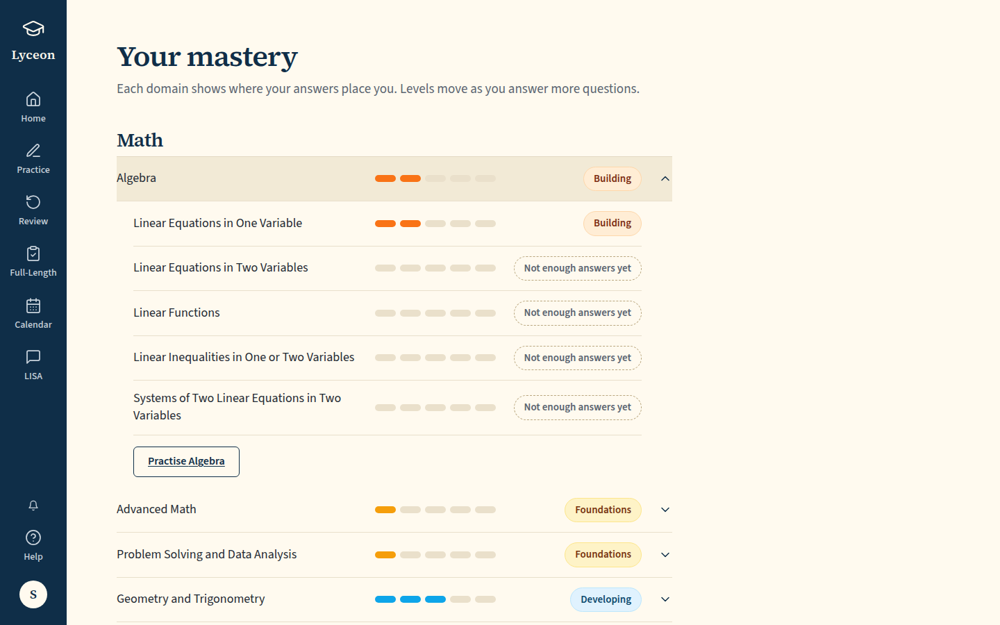 `/mastery`, 101 KB, horizontal overflow 0px | , 147 KB |
| desktop | dark | 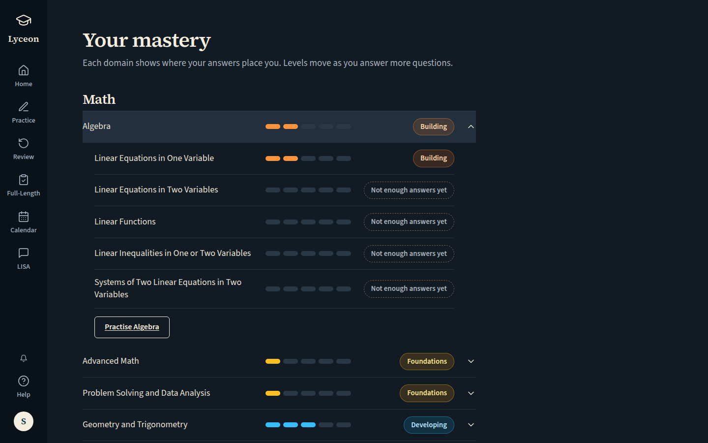 `/mastery`, 103 KB, horizontal overflow 0px | , 147 KB |
| mobile | light |  `/mastery`, 116 KB, horizontal overflow 0px |  desktop prototype (no phone layout), 147 KB |
| mobile | dark |  `/mastery`, 119 KB, horizontal overflow 0px |  desktop prototype (no phone layout), 147 KB |

## Mastery, free: the locked mastery card, no mastery request (the feature-access map locks mastery_detail)

Persona: `free`. Route: `/mastery`.
Prototype: `Practice.dc.html` (NOT PROTOTYPED. Visual reference only: Practice, plan = free (the locked mastery card in its right panel)).

| Viewport | Theme (as rendered) | Built | Prototype |
|---|---|---|---|
| desktop | light | 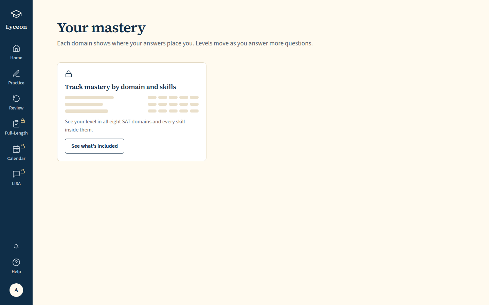 `/mastery`, 52 KB, horizontal overflow 0px | , 117 KB |
| desktop | dark | 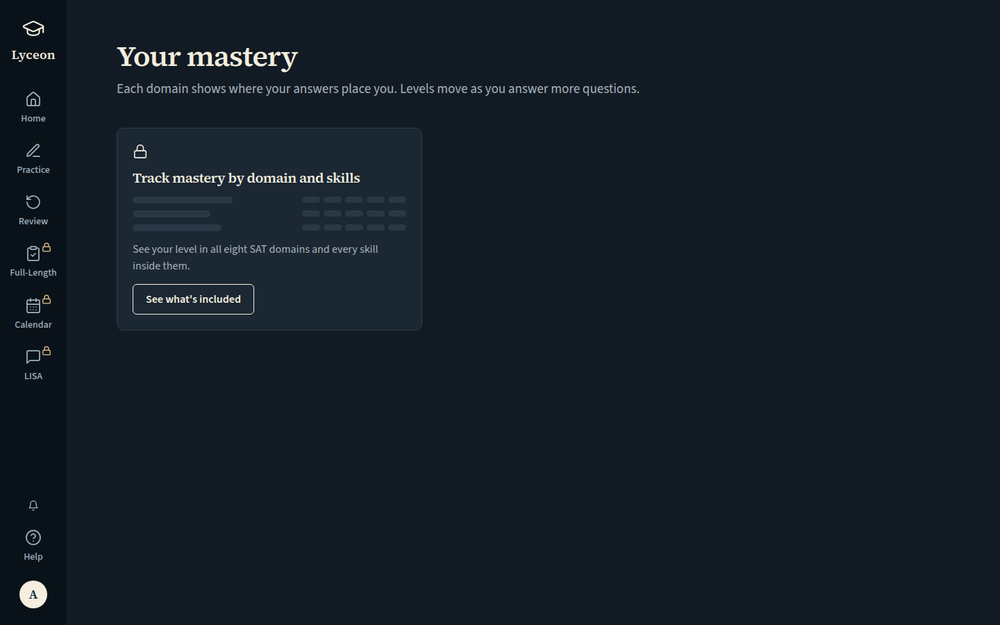 `/mastery`, 53 KB, horizontal overflow 0px | , 119 KB |
| mobile | light |  `/mastery`, 44 KB, horizontal overflow 0px |  desktop prototype (no phone layout), 117 KB |
| mobile | dark |  `/mastery`, 44 KB, horizontal overflow 0px |  desktop prototype (no phone layout), 119 KB |

## Mastery, free: 'See what's included' opens the upgrade modal for mastery_detail

Persona: `free`. Route: `/mastery`.
Step: click `{"desktop":"[data-testid=\"locked-mastery-see-included\"]","mobile":"[data-testid=\"locked-mastery-see-included\"]"}`.
Must then show `[data-testid="upgrade-modal"]` (the capture fails otherwise).
Prototype: `Practice.dc.html` (NOT PROTOTYPED. Visual reference only: Practice, plan = free (the canvas is not clicked; its modal copy is the same mastery_detail copy)).

| Viewport | Theme (as rendered) | Built | Prototype |
|---|---|---|---|
| desktop | light | 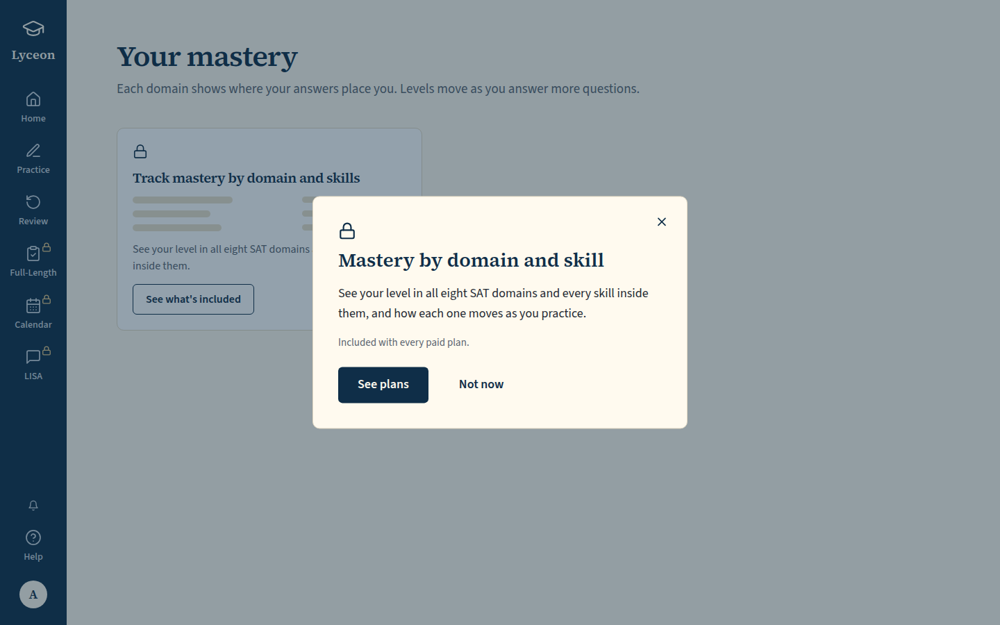 `/mastery`, 77 KB, horizontal overflow 0px | , 117 KB |
| desktop | dark | 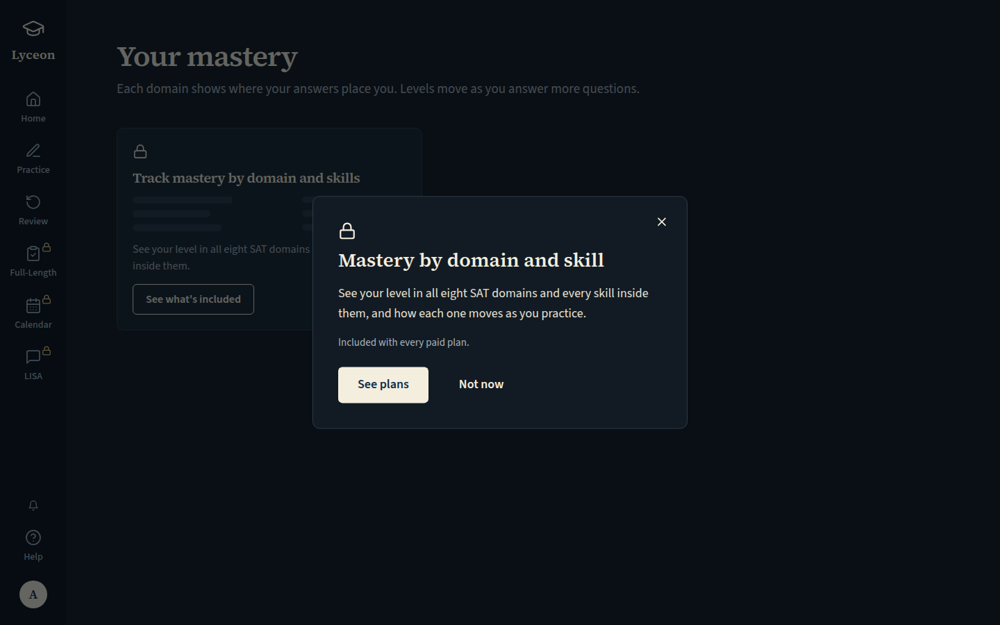 `/mastery`, 76 KB, horizontal overflow 0px | , 119 KB |
| mobile | light |  `/mastery`, 53 KB, horizontal overflow 0px |  desktop prototype (no phone layout), 117 KB |
| mobile | dark |  `/mastery`, 53 KB, horizontal overflow 0px |  desktop prototype (no phone layout), 119 KB |

## Click path (paid): Home's 'See every skill' lands on /mastery

Persona: `paid`. Route: `/dashboard`.
Step: click `{"desktop":"[data-testid=\"home-mastery\"] a[href=\"/mastery\"]","mobile":"[data-testid=\"home-mastery\"] a[href=\"/mastery\"]"}`.
Must then show `[data-testid="mastery-domain"]` (the capture fails otherwise).
Click path: must land on a path matching `^/mastery$` (the capture fails otherwise); the path it landed on is under each built shot.
Prototype: none. A click path: the screenshot is where the click landed (/mastery), proven by its pathname.

| Viewport | Theme (as rendered) | Built | Prototype |
|---|---|---|---|
| desktop | light | 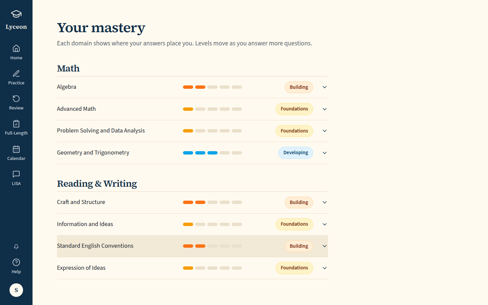 `/mastery`, 87 KB, horizontal overflow 0px | none |
| desktop | dark | 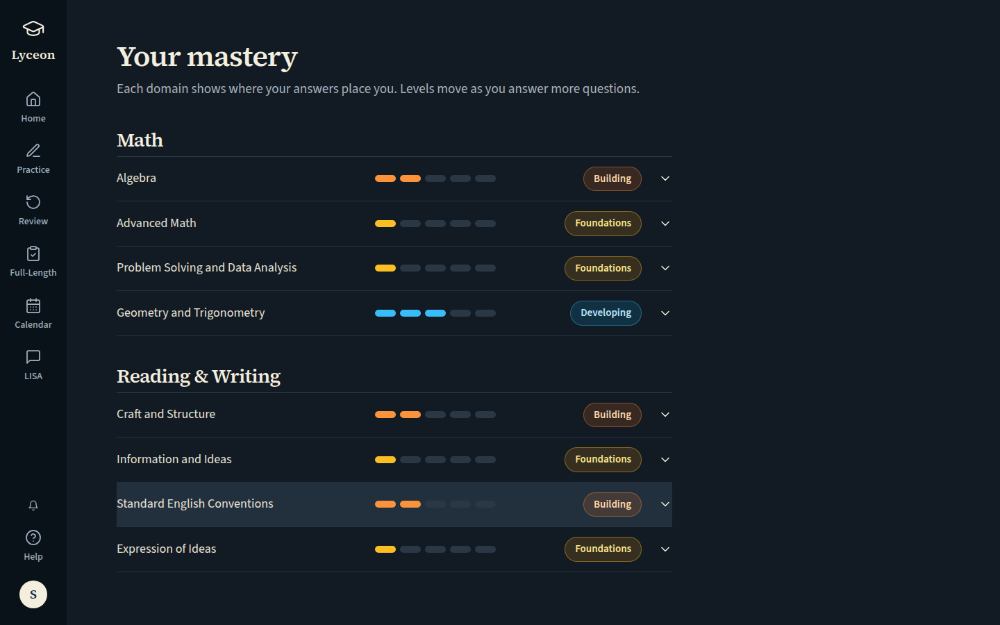 `/mastery`, 89 KB, horizontal overflow 0px | none |
| mobile | light |  `/mastery`, 50 KB, horizontal overflow 0px | none |
| mobile | dark |  `/mastery`, 51 KB, horizontal overflow 0px | none |

## Run facts

- Seeded ids: `{"free":{"completedPracticeSessionId":"88889755-8097-421c-8491-db7e90b088c4","openPracticeSessionId":"7e3a3480-5313-4cd7-befa-967c925d08d1","openReviewSessionId":null,"diagnosticSessionId":null,"scoredExamSessionId":null,"inProgressExamSessionId":null,"lisaConversationId":null,"answered":13},"paid":{"completedPracticeSessionId":"49dd5c79-391b-4193-a881-a16c52b4879c","openPracticeSessionId":"7ceb6e5b-eac2-496f-bbe7-55b617e3fa40","openReviewSessionId":null,"diagnosticSessionId":"fd619b00-6630-4d18-af34-e6fdc5e03221","scoredExamSessionId":null,"inProgressExamSessionId":null,"lisaConversationId":null,"answered":53}}`
- Endpoints the pages asked for that the harness does not serve (answered 404): none
- External hosts blocked: `fonts.googleapis.com`
