# UI-59 Bare-card pages (sign in, sign up, reset, profile completion, update password, account recovery, guardian required, 404, pending deletion, error screen), all NOT PROTOTYPED; light and dark, 1440 and 390

Generated 2026-10-07T21:12:47.706Z by `pnpm exec tsx tests/e2e/student-harness/capture.ts UI-59` (see `tests/e2e/student-harness/README.md`). Built = a production build of the real client (`vite preview`, or the dev server with STUDENT_HARNESS_CLIENT=dev) against the student harness (real routers over a local Postgres built from this repo's migrations; personas seeded through the real practice routes). Prototype = the signed-off `docs/plans/student-ui/design/prototype/*.dc.html`, rendered locally.

Conditions, read before comparing:
- Viewport screenshots (not full page) unless the shot says full page: desktop 1440x900, phone 390x844, and any extra size a shot names.
- The prototypes are a fixed 1440x900 canvas with no phone layout; phone rows show the desktop prototype.
- Dark is requested through the app's own per-device setting; the theme column records what the page rendered.
- No external requests: the built app's Google Fonts (Inter, Poppins) are blocked, so legacy page bodies fall back to system faces; Source Sans 3 / Source Serif 4 are self-hosted and load for both sides.
- Prototype data is illustrative; built data is the seeded personas' real payloads.

## /login, signed out: Sign In tab

Persona: `signed-out`. Route: `/login`.
Full page: the whole document, not just the viewport.
Prototype: none. NOT PROTOTYPED (DESIGN.md §4): the bare-card pages and the pending-deletion screen are built to the shell spec (§2 Bare card); these screenshots go to Karl before merge.

| Viewport | Theme (as rendered) | Built | Prototype |
|---|---|---|---|
| desktop | light | 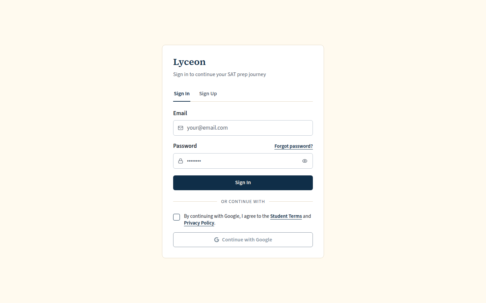 `/login`, 38 KB, horizontal overflow 0px | none |
| desktop | dark |  `/login`, 39 KB, horizontal overflow 0px | none |
| mobile | light |  `/login`, 33 KB, horizontal overflow 0px | none |
| mobile | dark |  `/login`, 34 KB, horizontal overflow 0px | none |

## /login?error=google_oauth_failed (a code the real OAuth callback redirects with): the human message as an alert

Persona: `signed-out`. Route: `/login?error=google_oauth_failed`.
Full page: the whole document, not just the viewport.
Prototype: none. NOT PROTOTYPED (DESIGN.md §4): the bare-card pages and the pending-deletion screen are built to the shell spec (§2 Bare card); these screenshots go to Karl before merge.

| Viewport | Theme (as rendered) | Built | Prototype |
|---|---|---|---|
| desktop | light | 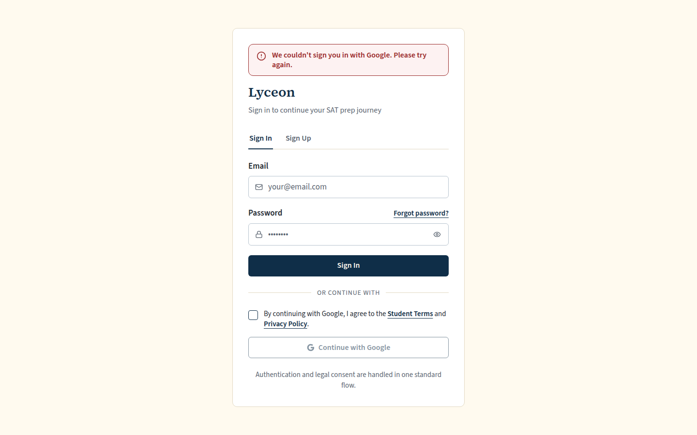 `/login`, 46 KB, horizontal overflow 0px | none |
| desktop | dark | 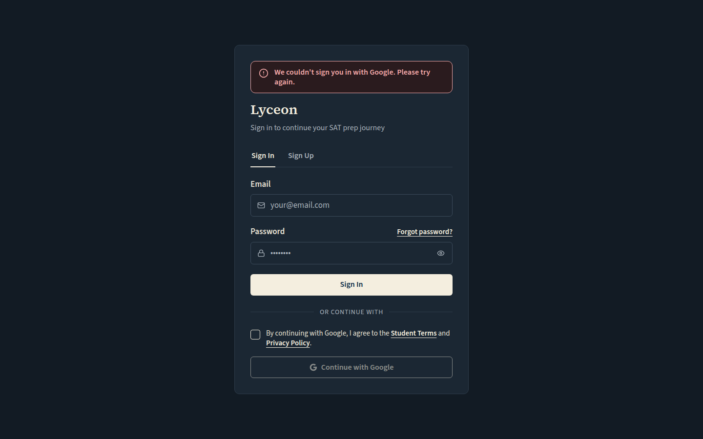 `/login`, 46 KB, horizontal overflow 0px | none |
| mobile | light | 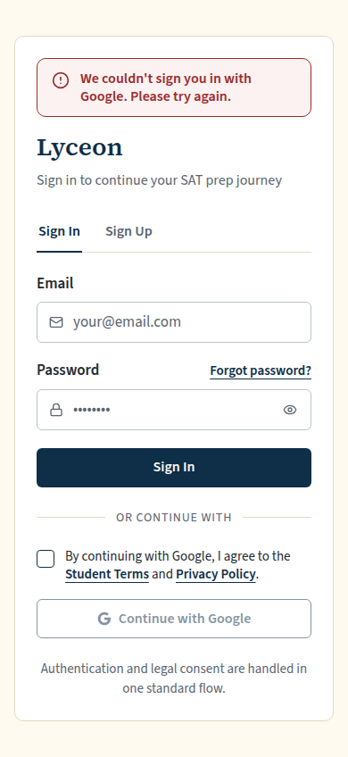 `/login`, 39 KB, horizontal overflow 0px | none |
| mobile | dark | 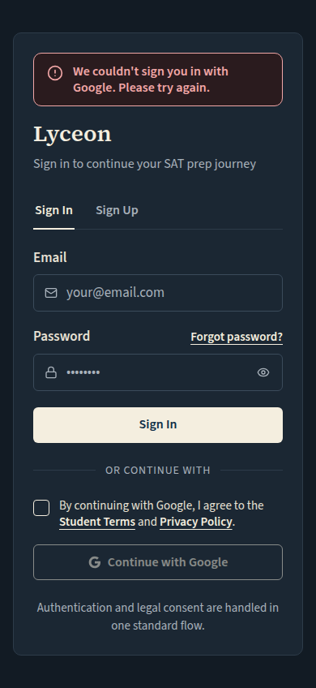 `/login`, 40 KB, horizontal overflow 0px | none |

## /login → Sign Up tab (the student sign-up form)

Persona: `signed-out`. Route: `/login`.
Step: click `{"desktop":"[data-testid=\"tab-signup\"]","mobile":"[data-testid=\"tab-signup\"]"}`.
Must then show `[data-testid="button-signup"]` (the capture fails otherwise).
Full page: the whole document, not just the viewport.
Prototype: none. NOT PROTOTYPED (DESIGN.md §4): the bare-card pages and the pending-deletion screen are built to the shell spec (§2 Bare card); these screenshots go to Karl before merge.

| Viewport | Theme (as rendered) | Built | Prototype |
|---|---|---|---|
| desktop | light | 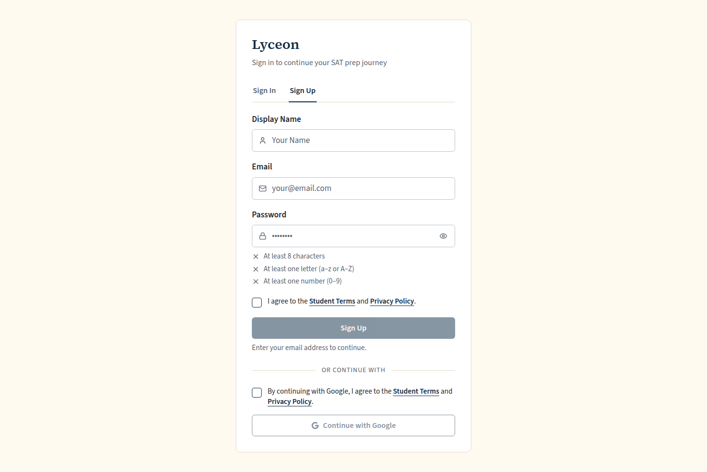 `/login`, 57 KB, horizontal overflow 0px | none |
| desktop | dark | 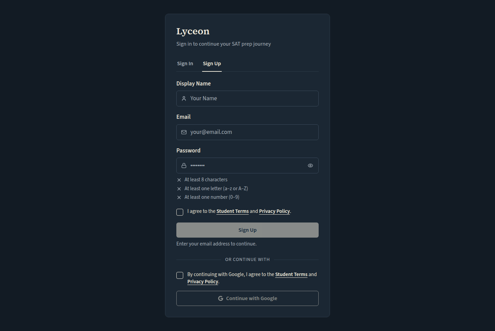 `/login`, 58 KB, horizontal overflow 0px | none |
| mobile | light | 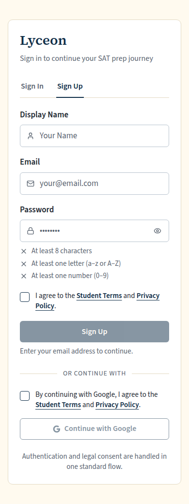 `/login`, 50 KB, horizontal overflow 0px | none |
| mobile | dark | 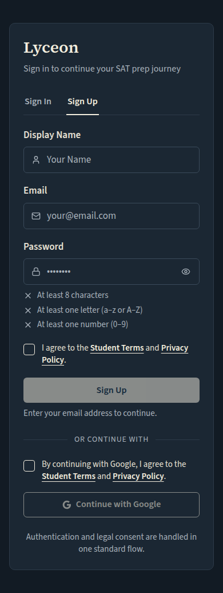 `/login`, 51 KB, horizontal overflow 0px | none |

## /login → Forgot password? (reset mode)

Persona: `signed-out`. Route: `/login`.
Step: click `{"desktop":"button:has-text(\"Forgot password?\")","mobile":"button:has-text(\"Forgot password?\")"}`.
Must then show `[data-testid="button-reset"]` (the capture fails otherwise).
Full page: the whole document, not just the viewport.
Prototype: none. NOT PROTOTYPED (DESIGN.md §4): the bare-card pages and the pending-deletion screen are built to the shell spec (§2 Bare card); these screenshots go to Karl before merge.

| Viewport | Theme (as rendered) | Built | Prototype |
|---|---|---|---|
| desktop | light | 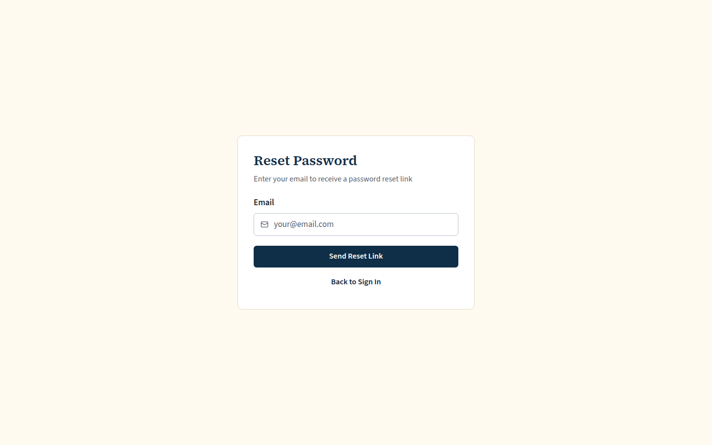 `/login`, 25 KB, horizontal overflow 0px | none |
| desktop | dark | 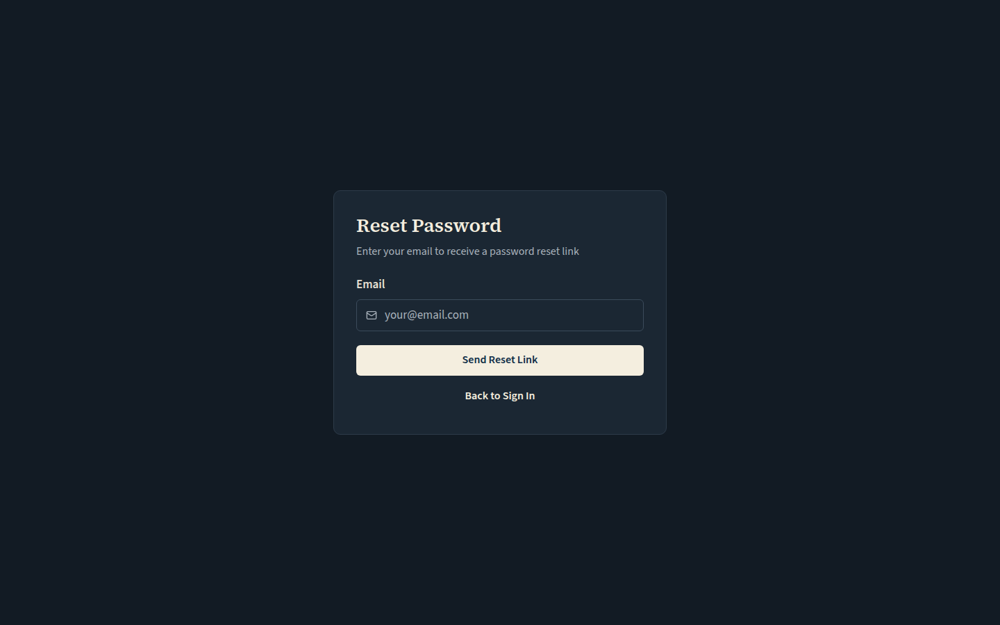 `/login`, 25 KB, horizontal overflow 0px | none |
| mobile | light | 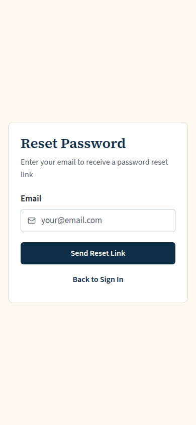 `/login`, 21 KB, horizontal overflow 0px | none |
| mobile | dark | 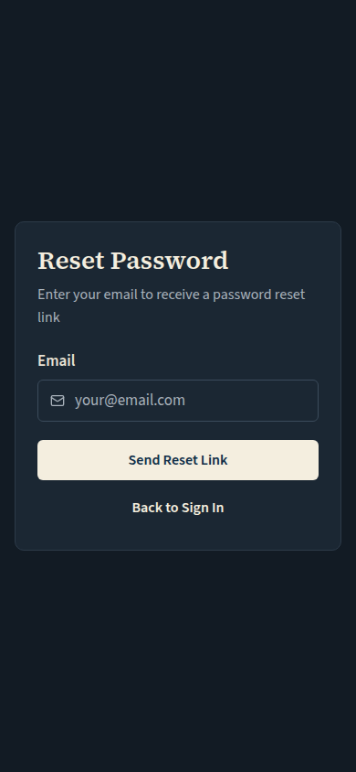 `/login`, 21 KB, horizontal overflow 0px | none |

## /profile/complete: a student with no completed profile (the onboarding persona)

Persona: `onboarding`. Route: `/profile/complete`.
Full page: the whole document, not just the viewport.
Prototype: none. NOT PROTOTYPED (DESIGN.md §4): the bare-card pages and the pending-deletion screen are built to the shell spec (§2 Bare card); these screenshots go to Karl before merge.

| Viewport | Theme (as rendered) | Built | Prototype |
|---|---|---|---|
| desktop | light | 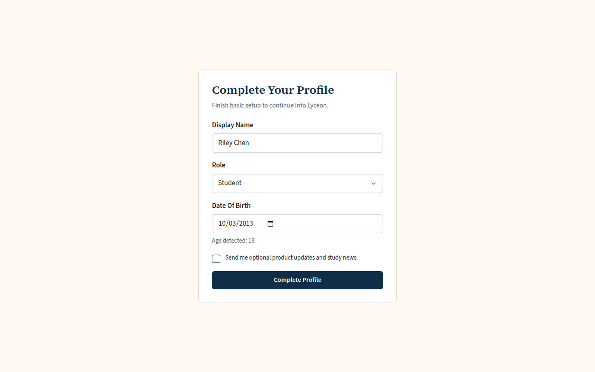 `/profile/complete`, 36 KB, horizontal overflow 0px | none |
| desktop | dark | 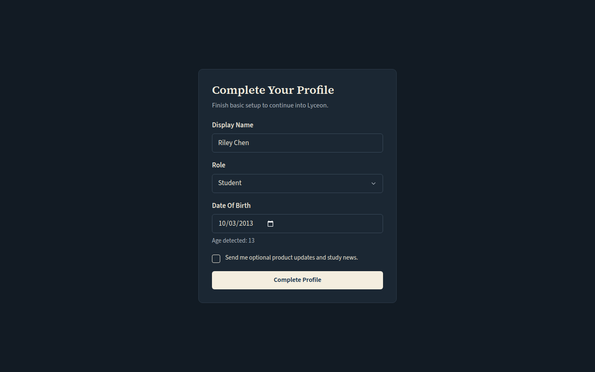 `/profile/complete`, 37 KB, horizontal overflow 0px | none |
| mobile | light | 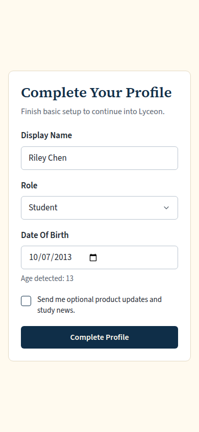 `/profile/complete`, 31 KB, horizontal overflow 0px | none |
| mobile | dark | 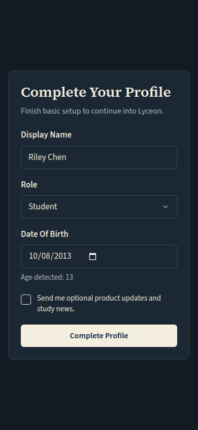 `/profile/complete`, 32 KB, horizontal overflow 0px | none |

## /update-password: the form a recovery-granted student sees (the page reads no grant; the server's POST does)

Persona: `paid`. Route: `/update-password`.
Full page: the whole document, not just the viewport.
Prototype: none. NOT PROTOTYPED (DESIGN.md §4): the bare-card pages and the pending-deletion screen are built to the shell spec (§2 Bare card); these screenshots go to Karl before merge.

| Viewport | Theme (as rendered) | Built | Prototype |
|---|---|---|---|
| desktop | light | 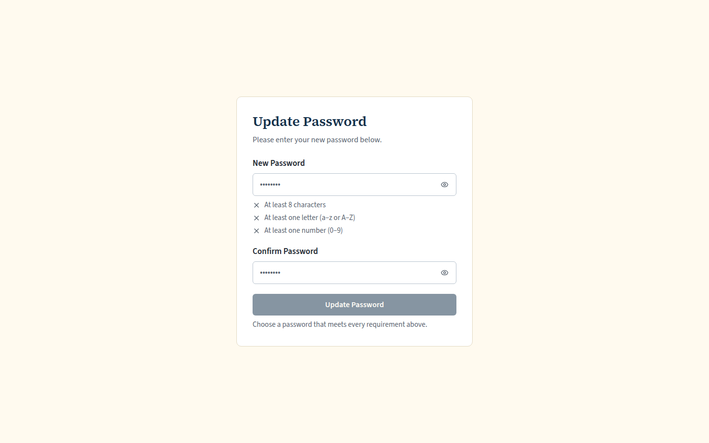 `/update-password`, 40 KB, horizontal overflow 0px | none |
| desktop | dark |  `/update-password`, 40 KB, horizontal overflow 0px | none |
| mobile | light |  `/update-password`, 33 KB, horizontal overflow 0px | none |
| mobile | dark |  `/update-password`, 33 KB, horizontal overflow 0px | none |

## /update-password, submitted with no recovery grant: the page after the refusal. FINDING (unchanged, pre-existing): no message shows, because RequireRole swaps the page for its loader while the request runs (authLoading) and the remounted form has lost its error

Persona: `paid`. Route: `/update-password`.
Step: type `Harness-pass-59` into `{"desktop":"[data-testid=\"input-new-password\"]","mobile":"[data-testid=\"input-new-password\"]"}`.
Step: type `Harness-pass-59` into `{"desktop":"[data-testid=\"input-confirm-password\"]","mobile":"[data-testid=\"input-confirm-password\"]"}`.
Step: click `{"desktop":"[data-testid=\"button-update-password\"]","mobile":"[data-testid=\"button-update-password\"]"}`.
Must then show `[data-testid="input-new-password"]` (the capture fails otherwise).
Must then show no `[data-testid="full-page-loader"]` (the capture fails otherwise).
Full page: the whole document, not just the viewport.
Prototype: none. NOT PROTOTYPED (DESIGN.md §4): the bare-card pages and the pending-deletion screen are built to the shell spec (§2 Bare card); these screenshots go to Karl before merge.

| Viewport | Theme (as rendered) | Built | Prototype |
|---|---|---|---|
| desktop | light |  `/update-password`, 40 KB, horizontal overflow 0px | none |
| desktop | dark | 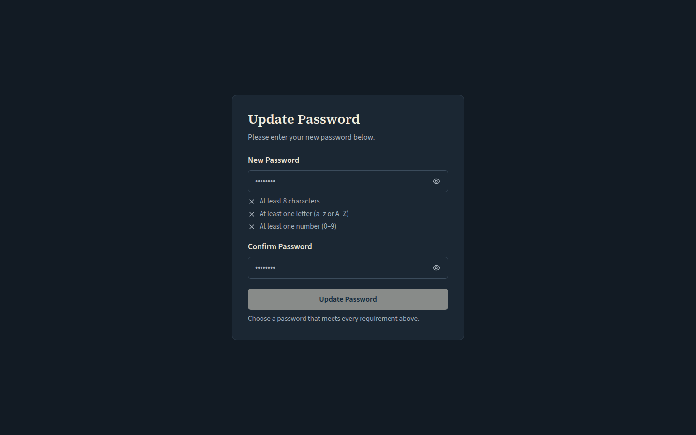 `/update-password`, 40 KB, horizontal overflow 0px | none |
| mobile | light | 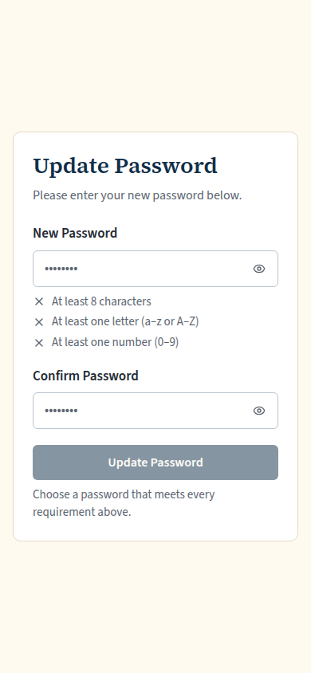 `/update-password`, 33 KB, horizontal overflow 0px | none |
| mobile | dark | 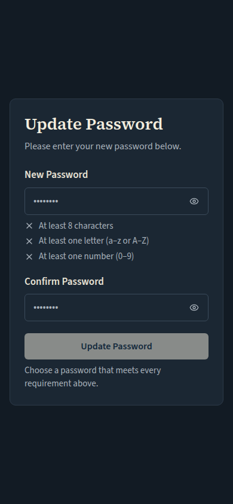 `/update-password`, 33 KB, horizontal overflow 0px | none |

## /account/recover?token=… a token the real recovery route does not know: invalid or expired

Persona: `signed-out`. Route: `/account/recover?token=student-harness-unknown-token`.
Full page: the whole document, not just the viewport.
Prototype: none. NOT PROTOTYPED (DESIGN.md §4): the bare-card pages and the pending-deletion screen are built to the shell spec (§2 Bare card); these screenshots go to Karl before merge.

| Viewport | Theme (as rendered) | Built | Prototype |
|---|---|---|---|
| desktop | light | 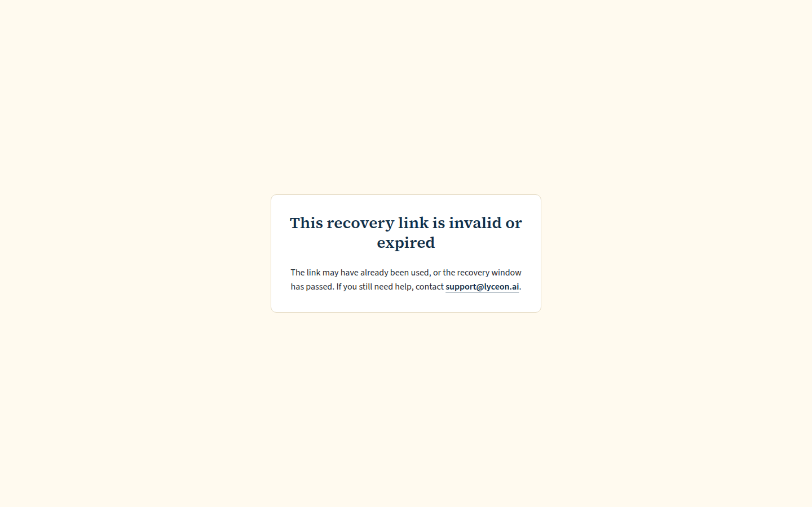 `/account/recover`, 28 KB, horizontal overflow 0px | none |
| desktop | dark | 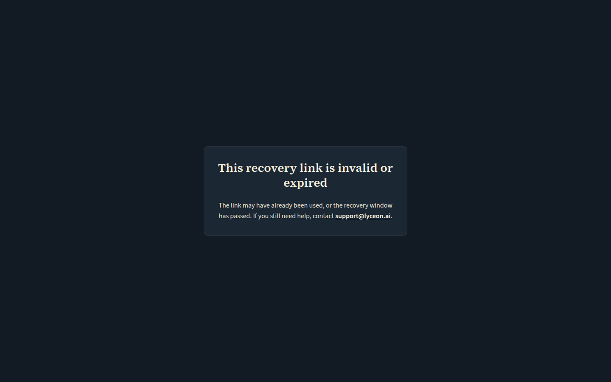 `/account/recover`, 29 KB, horizontal overflow 0px | none |
| mobile | light | 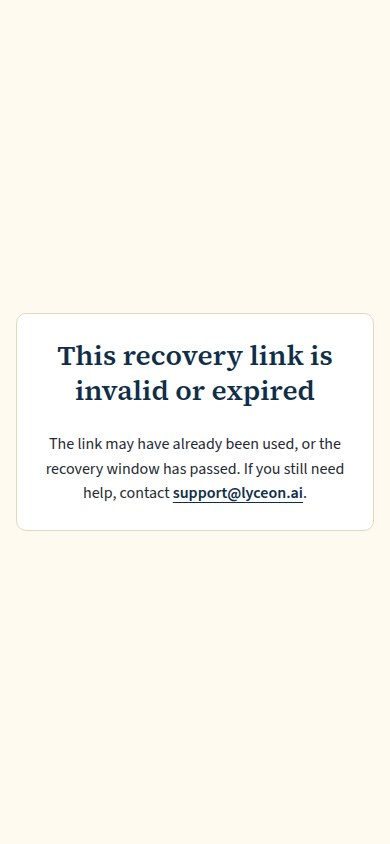 `/account/recover`, 24 KB, horizontal overflow 0px | none |
| mobile | dark | 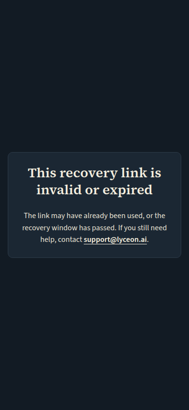 `/account/recover`, 24 KB, horizontal overflow 0px | none |

## /guardian-required: an under-13 student with no guardian link (link-code panel, guardians panel, sign out)

Persona: `under13`. Route: `/guardian-required`.
Full page: the whole document, not just the viewport.
Prototype: none. NOT PROTOTYPED (DESIGN.md §4): the bare-card pages and the pending-deletion screen are built to the shell spec (§2 Bare card); these screenshots go to Karl before merge.

| Viewport | Theme (as rendered) | Built | Prototype |
|---|---|---|---|
| desktop | light | 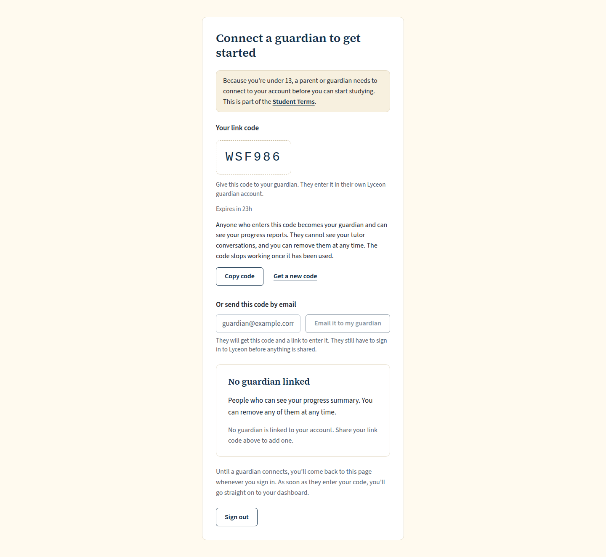 `/guardian-required`, 123 KB, horizontal overflow 0px | none |
| desktop | dark | 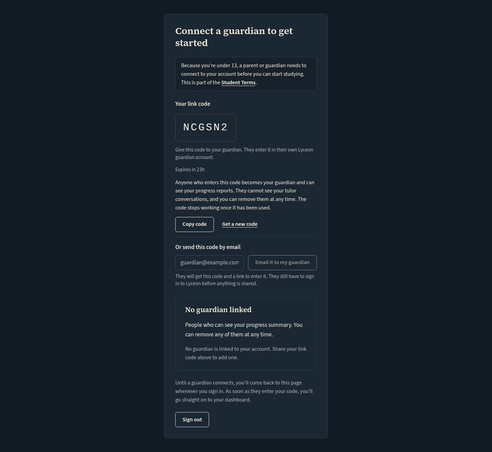 `/guardian-required`, 125 KB, horizontal overflow 0px | none |
| mobile | light | 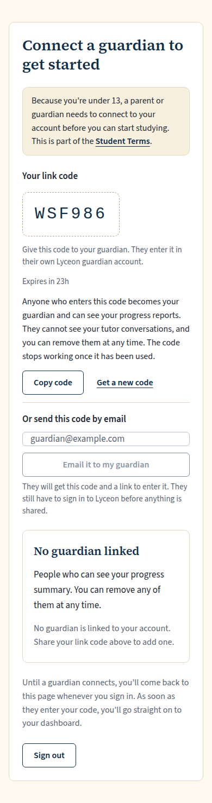 `/guardian-required`, 106 KB, horizontal overflow 0px | none |
| mobile | dark | 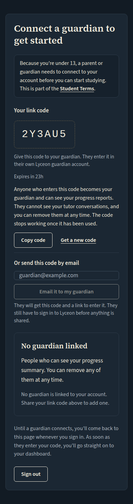 `/guardian-required`, 109 KB, horizontal overflow 0px | none |

## 404 (/no-such-page), signed in: the SEO page ("Page not found") and its link home

Persona: `paid`. Route: `/no-such-page`.
Full page: the whole document, not just the viewport.
Prototype: none. NOT PROTOTYPED (DESIGN.md §4): the bare-card pages and the pending-deletion screen are built to the shell spec (§2 Bare card); these screenshots go to Karl before merge.

| Viewport | Theme (as rendered) | Built | Prototype |
|---|---|---|---|
| desktop | light | 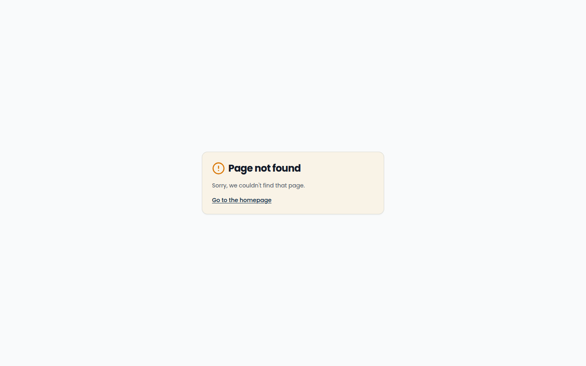 `/no-such-page`, 18 KB, horizontal overflow 0px | none |
| desktop | dark |  `/no-such-page`, 18 KB, horizontal overflow 0px | none |
| mobile | light |  `/no-such-page`, 15 KB, horizontal overflow 0px | none |
| mobile | dark | 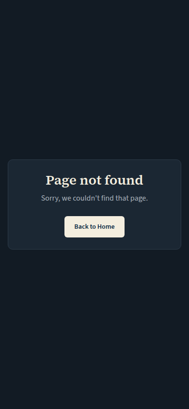 `/no-such-page`, 15 KB, horizontal overflow 0px | none |

## Click path: 404 → Go to the homepage lands on /

Persona: `paid`. Route: `/no-such-page`.
Step: click `{"desktop":"a[href=\"/\"]","mobile":"a[href=\"/\"]"}`.
Click path: must land on a path matching `^/$` (the capture fails otherwise); the path it landed on is under each built shot.
Prototype: none. NOT PROTOTYPED (DESIGN.md §4): the bare-card pages and the pending-deletion screen are built to the shell spec (§2 Bare card); these screenshots go to Karl before merge.

| Viewport | Theme (as rendered) | Built | Prototype |
|---|---|---|---|
| desktop | light | 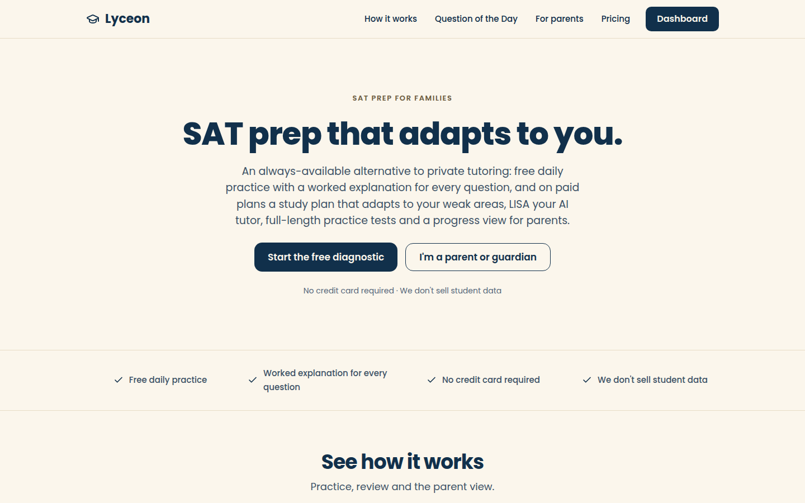 `/`, 96 KB, horizontal overflow 0px | none |
| desktop | dark | 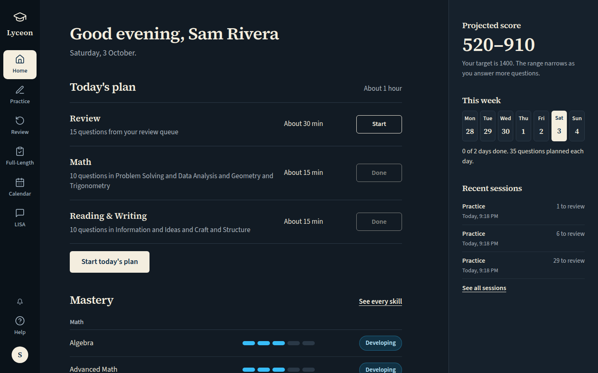 `/`, 96 KB, horizontal overflow 0px | none |
| mobile | light | 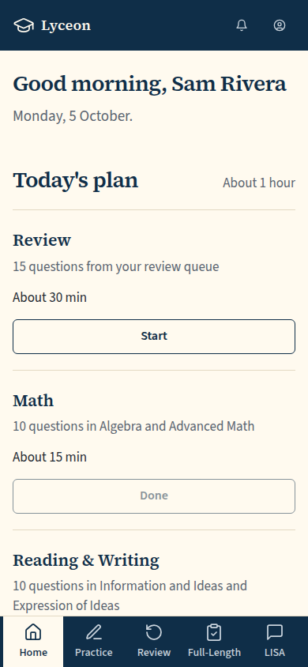 `/`, 68 KB, horizontal overflow 0px | none |
| mobile | dark | 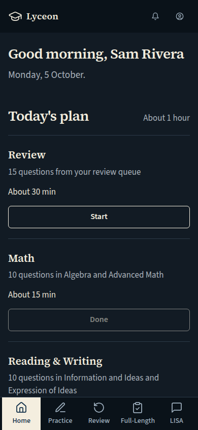 `/`, 68 KB, horizontal overflow 0px | none |

## The pending-deletion screen: a student on whom the real request_account_deletion has run, opening /dashboard

Persona: `deleting`. Route: `/dashboard`.
Full page: the whole document, not just the viewport.
Prototype: none. NOT PROTOTYPED (DESIGN.md §4): the bare-card pages and the pending-deletion screen are built to the shell spec (§2 Bare card); these screenshots go to Karl before merge.

| Viewport | Theme (as rendered) | Built | Prototype |
|---|---|---|---|
| desktop | light | 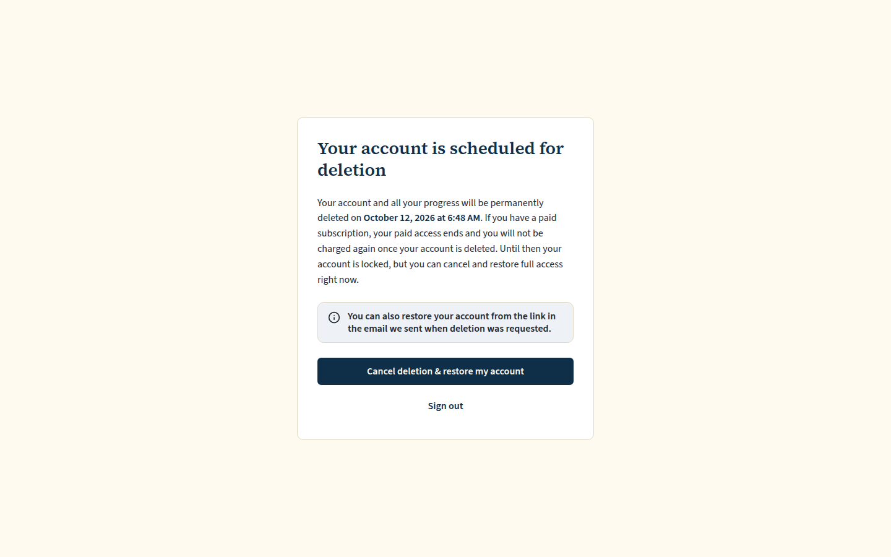 `/dashboard`, 55 KB, horizontal overflow 0px | none |
| desktop | dark | 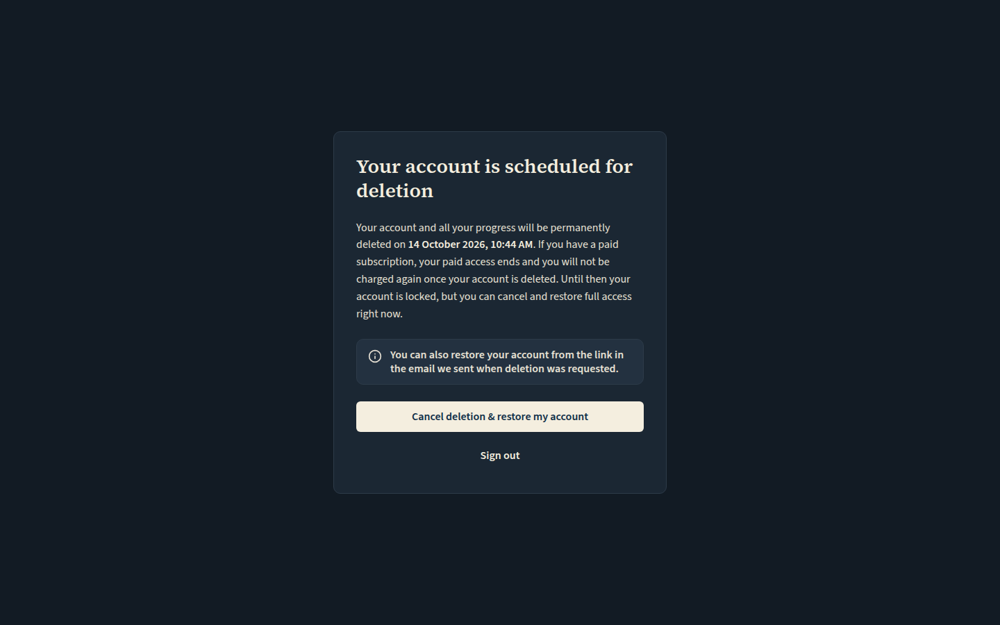 `/dashboard`, 57 KB, horizontal overflow 0px | none |
| mobile | light | 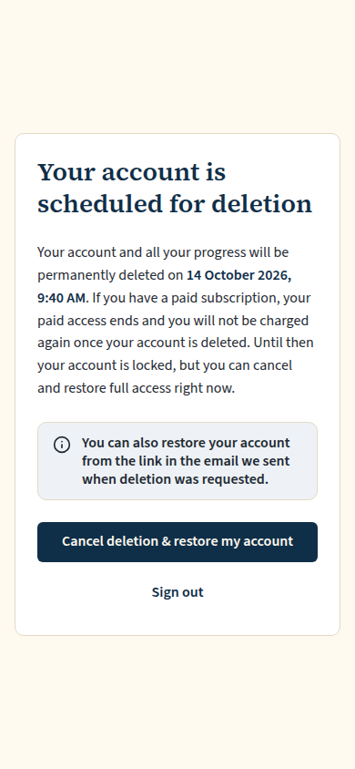 `/dashboard`, 46 KB, horizontal overflow 0px | none |
| mobile | dark | 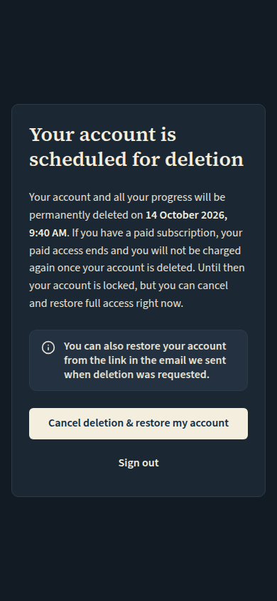 `/dashboard`, 48 KB, horizontal overflow 0px | none |

## The error screen: /update-password whose code chunk fails to load (App's ErrorBoundary)

Persona: `paid`. Route: `/update-password`.
Full page: the whole document, not just the viewport.
Failed in the browser: requests whose path matches `^/assets/update-password-[^/]+\.js$` get a network error and never reach the server. The page's lazy code chunk fails to load, as it does in production when the network drops or a deploy replaces the chunk; React.lazy throws into App's ErrorBoundary.
Prototype: none. NOT PROTOTYPED (DESIGN.md §4): the bare-card pages and the pending-deletion screen are built to the shell spec (§2 Bare card); these screenshots go to Karl before merge.

| Viewport | Theme (as rendered) | Built | Prototype |
|---|---|---|---|
| desktop | light | 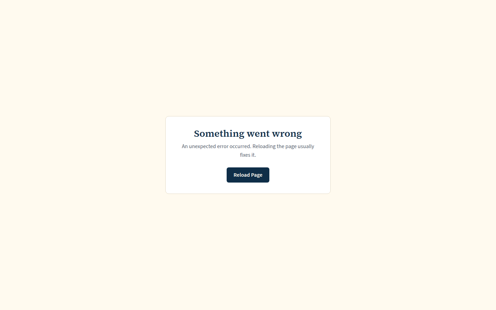 `/update-password`, 21 KB, horizontal overflow 0px | none |
| desktop | dark | 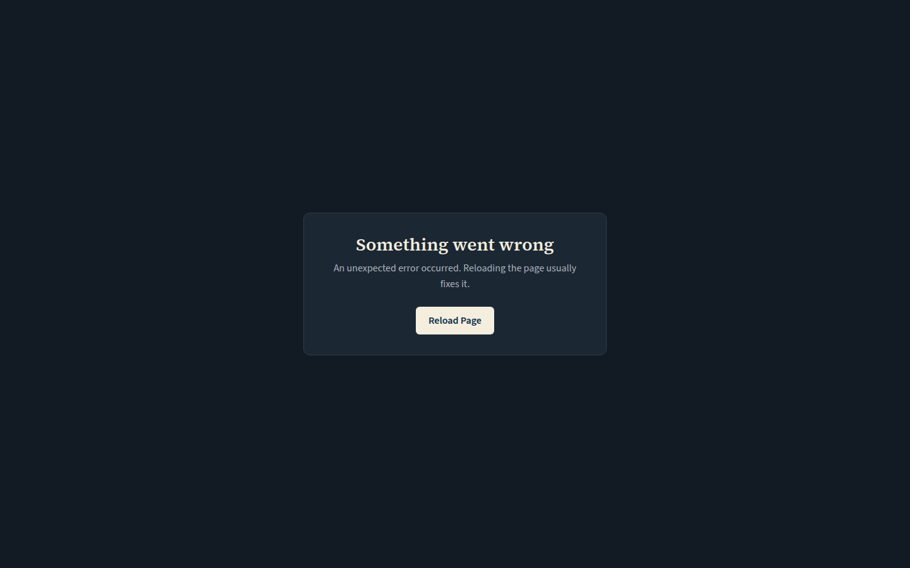 `/update-password`, 21 KB, horizontal overflow 0px | none |
| mobile | light | 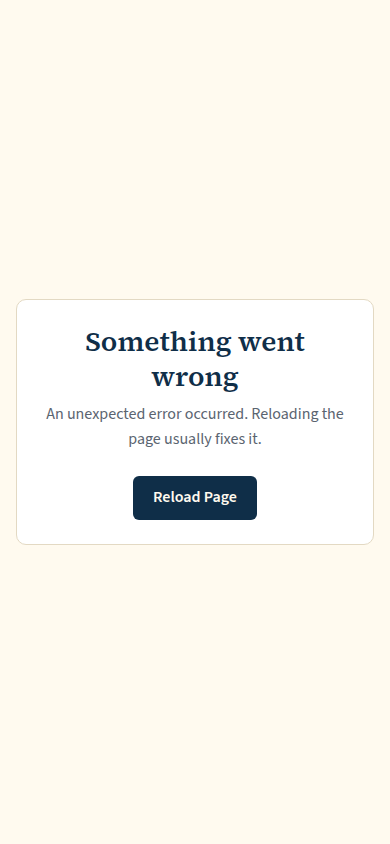 `/update-password`, 18 KB, horizontal overflow 0px | none |
| mobile | dark | 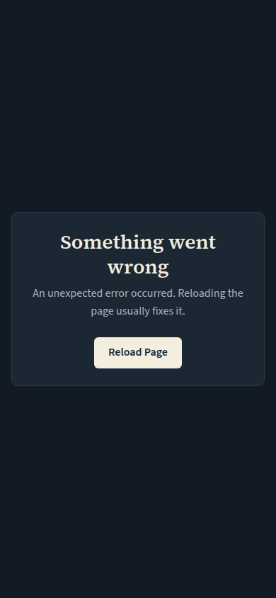 `/update-password`, 19 KB, horizontal overflow 0px | none |

## Run facts

- Seeded ids: `{"free":{"completedPracticeSessionId":"6aa223a6-7276-43ed-b80c-2bd1b0be799c","openPracticeSessionId":"85949fc7-fe5f-4b2a-ab89-d8bf52b50398","openReviewSessionId":null,"diagnosticSessionId":null,"scoredExamSessionId":null,"inProgressExamSessionId":null,"lisaConversationId":null,"answered":13},"paid":{"completedPracticeSessionId":"f6266377-55d6-47d3-b4be-65cda1210115","openPracticeSessionId":"6839a269-eb00-4dea-ba7e-15cc6f1b78f8","openReviewSessionId":null,"diagnosticSessionId":"8f9f4a3a-5a4b-4948-b4fd-31e809f9ce15","scoredExamSessionId":null,"inProgressExamSessionId":null,"lisaConversationId":null,"answered":53}}`
- Endpoints the pages asked for that the harness does not serve (answered 404): none
- External hosts blocked: none
