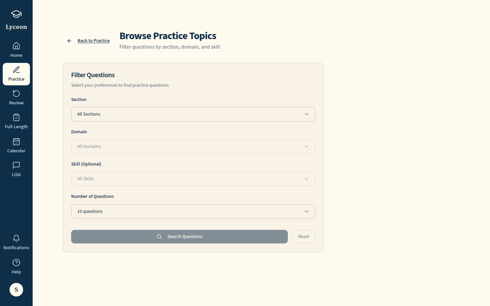
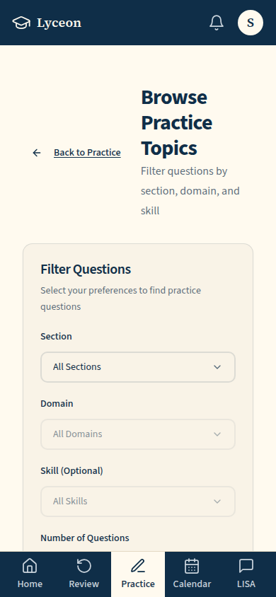
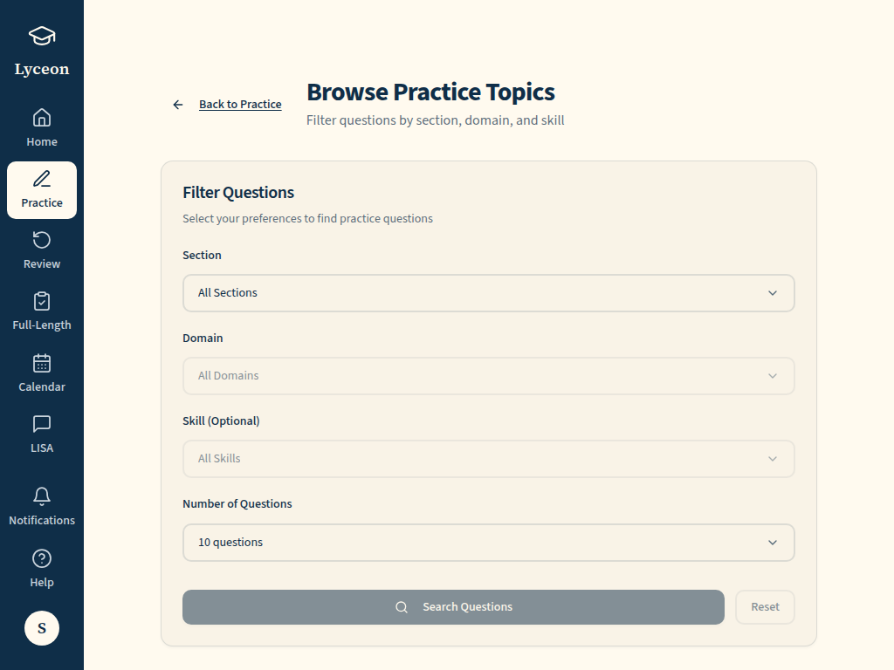

# OQ-68 (a) /practice/topics, paid: the retired topic browser and its redirect to Practice (1440, 1024, 390; light and dark)

Generated 2026-10-08T21:10:55.210Z by `pnpm exec tsx tests/e2e/student-harness/capture.ts W6-OQ-68a` (see `tests/e2e/student-harness/README.md`). Built = a production build of the real client (`vite preview`, or the dev server with STUDENT_HARNESS_CLIENT=dev) against the student harness (real routers over a local Postgres built from this repo's migrations; personas seeded through the real practice routes). Prototype = the signed-off `docs/plans/student-ui/design/prototype/*.dc.html`, rendered locally.

Conditions, read before comparing:
- Viewport screenshots (not full page) unless the shot says full page: desktop 1440x900, phone 390x844, and any extra size a shot names.
- The prototypes are a fixed 1440x900 canvas with no phone layout; phone rows show the desktop prototype.
- Dark is requested through the app's own per-device setting; the theme column records what the page rendered.
- No external requests: the built app's Google Fonts (Inter, Poppins) are blocked, so legacy page bodies fall back to system faces; Source Sans 3 / Source Serif 4 are self-hosted and load for both sides.
- Prototype data is illustrative; built data is the seeded personas' real payloads.

## /practice/topics, paid: before, the topic browser; after, Practice (history replace)

Persona: `paid`. Route: `/practice/topics`.
Also shot at w1024 1024x768 (the desktop steps and selectors).
Click path: must land on a path matching `^/practice(/topics)?$` (the capture fails otherwise); the path it landed on is under each built shot.
Prototype: none. Not compared with a prototype: a before/after pair for one ruling.

| Viewport | Theme (as rendered) | Built | Prototype |
|---|---|---|---|
| desktop | light |  `/practice/topics`, 57 KB, horizontal overflow 0px | none |
| desktop | dark requested; page pinned light (`data-theme-lock=light`, OQ-49) |  `/practice/topics`, 57 KB, horizontal overflow 0px | none |
| mobile | light |  `/practice/topics`, 41 KB, horizontal overflow 0px | none |
| mobile | dark requested; page pinned light (`data-theme-lock=light`, OQ-49) |  `/practice/topics`, 41 KB, horizontal overflow 0px | none |
| w1024 | light |  `/practice/topics`, 55 KB, horizontal overflow 0px | none |
| w1024 | dark requested; page pinned light (`data-theme-lock=light`, OQ-49) |  `/practice/topics`, 55 KB, horizontal overflow 0px | none |

## Run facts

- Seeded ids: `{"free":{"completedPracticeSessionId":"0e49d217-9ff1-4e28-ad13-ae79464cb3f6","openPracticeSessionId":"64fe0c22-fe07-449f-a5cd-f98c8ed4bb70","openReviewSessionId":null,"diagnosticSessionId":null,"scoredExamSessionId":null,"inProgressExamSessionId":null,"lisaConversationId":null,"answered":13},"paid":{"completedPracticeSessionId":"da43fc25-cde8-4025-8baa-af620d11eadb","openPracticeSessionId":"849a6a90-8d88-4e5a-a653-517cb0583c6c","openReviewSessionId":null,"diagnosticSessionId":"7a57746e-efa8-4e6e-80e1-11dc21984745","scoredExamSessionId":null,"inProgressExamSessionId":null,"lisaConversationId":null,"answered":53}}`
- Endpoints the pages asked for that the harness does not serve (answered 404): none
- Desmos (QA2-B, opt-in `STUDENT_HARNESS_DESMOS=1`): not loaded (a local-only run; the calculator shows its unavailable line)
- External hosts blocked: none
