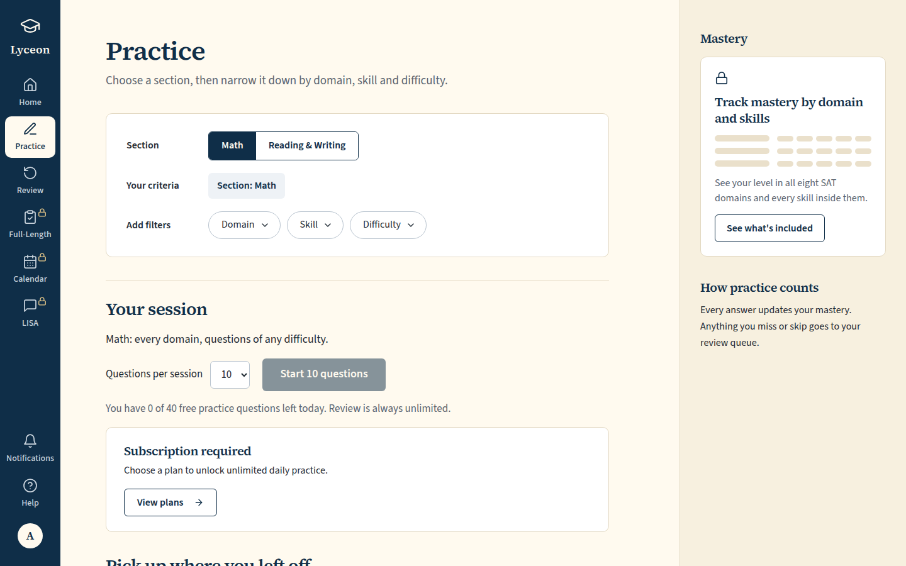
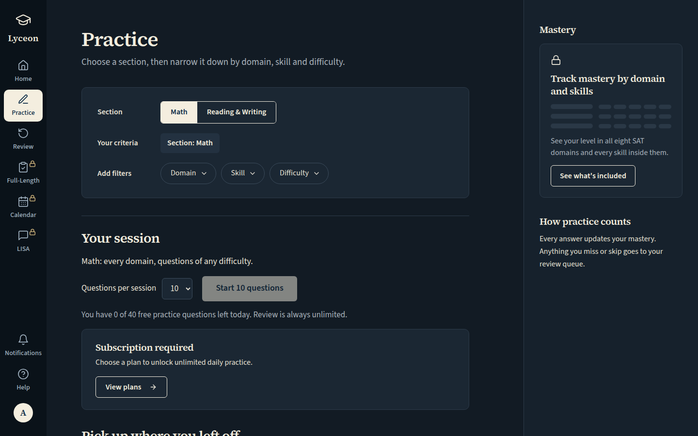
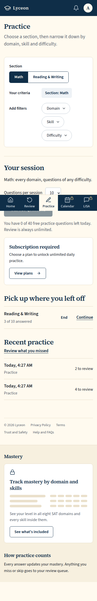
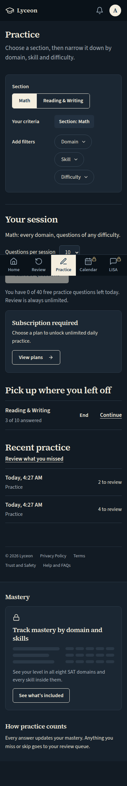
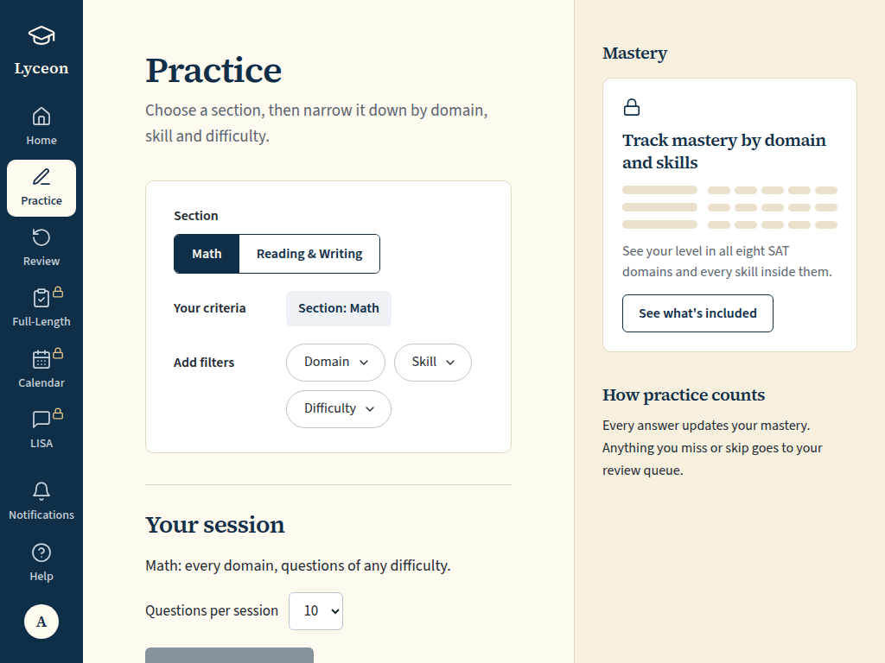
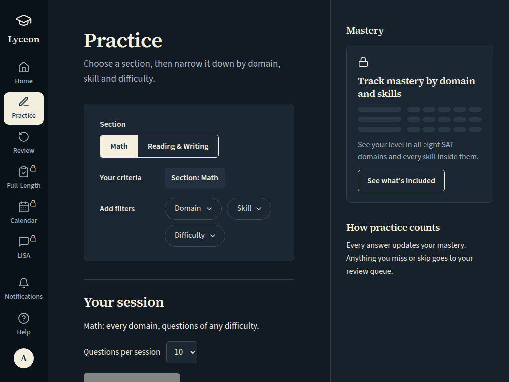

# W6 UI-65 Practice, free, 0 questions left today: the daily-limit billing card (1440, 1024, 390; light and dark)

Generated 2026-10-08T04:27:25.902Z by `pnpm exec tsx tests/e2e/student-harness/capture.ts W6-UI-65` (see `tests/e2e/student-harness/README.md`). Built = a production build of the real client (`vite preview`, or the dev server with STUDENT_HARNESS_CLIENT=dev) against the student harness (real routers over a local Postgres built from this repo's migrations; personas seeded through the real practice routes). Prototype = the signed-off `docs/plans/student-ui/design/prototype/*.dc.html`, rendered locally.

Conditions, read before comparing:
- Viewport screenshots (not full page) unless the shot says full page: desktop 1440x900, phone 390x844, and any extra size a shot names.
- The prototypes are a fixed 1440x900 canvas with no phone layout; phone rows show the desktop prototype.
- Dark is requested through the app's own per-device setting; the theme column records what the page rendered.
- No external requests: the built app's Google Fonts (Inter, Poppins) are blocked, so legacy page bodies fall back to system faces; Source Sans 3 / Source Serif 4 are self-hosted and load for both sides.
- Prototype data is illustrative; built data is the seeded personas' real payloads.

## Practice, free, 0 left today: Start disabled, the daily-limit card under it

Persona: `free`. Route: `/practice`.
Stubbed in the browser: `GET /api/practice/quota` is answered by the browser itself and never reaches the server. The free persona's real quota has questions left after the base seed; answering the rest through the real routes before every capture would spend them across shots. The body is built by the shared `practiceQuotaSchema` with `remaining: 0`, the value the real route returns exactly when the serve route answers 402.
Full page: the whole document, not just the viewport.
Also shot at w1024 1024x768 (the desktop steps and selectors).
Prototype: none. Not compared with a prototype: a before/after pair for one row.

| Viewport | Theme (as rendered) | Built | Prototype |
|---|---|---|---|
| desktop | light |  `/practice`, 117 KB, horizontal overflow 0px | none |
| desktop | dark |  `/practice`, 119 KB, horizontal overflow 0px | none |
| mobile | light |  `/practice`, 138 KB, horizontal overflow 0px | none |
| mobile | dark |  `/practice`, 140 KB, horizontal overflow 0px | none |
| w1024 | light |  `/practice`, 91 KB, horizontal overflow 0px | none |
| w1024 | dark |  `/practice`, 93 KB, horizontal overflow 0px | none |

## Run facts

- Seeded ids: `{"free":{"completedPracticeSessionId":"22c52784-be77-4ffd-8de0-f08f0c5f34d8","openPracticeSessionId":"990269d7-da3c-4746-a0a9-3e61de8d2546","openReviewSessionId":null,"diagnosticSessionId":null,"scoredExamSessionId":null,"inProgressExamSessionId":null,"lisaConversationId":null,"answered":13},"paid":{"completedPracticeSessionId":"7e048dfa-e1d3-41de-a3a5-c161194c37fb","openPracticeSessionId":"3e69a22b-7271-4736-b39e-3f28f655a245","openReviewSessionId":null,"diagnosticSessionId":"7a7f3d0b-b0e5-478c-ba68-064a610c43fc","scoredExamSessionId":null,"inProgressExamSessionId":null,"lisaConversationId":null,"answered":53}}`
- Endpoints the pages asked for that the harness does not serve (answered 404): none
- Desmos (QA2-B, opt-in `STUDENT_HARNESS_DESMOS=1`): not loaded (a local-only run; the calculator shows its unavailable line)
- External hosts blocked: none
