# W6 UI-66 Home and Practice, paid: recent-session rows named by their criteria (1440, 1024, 390; light and dark)

Generated 2026-10-08T04:31:53.994Z by `pnpm exec tsx tests/e2e/student-harness/capture.ts W6-UI-66` (see `tests/e2e/student-harness/README.md`). Built = a production build of the real client (`vite preview`, or the dev server with STUDENT_HARNESS_CLIENT=dev) against the student harness (real routers over a local Postgres built from this repo's migrations; personas seeded through the real practice routes). Prototype = the signed-off `docs/plans/student-ui/design/prototype/*.dc.html`, rendered locally.

Conditions, read before comparing:
- Viewport screenshots (not full page) unless the shot says full page: desktop 1440x900, phone 390x844, and any extra size a shot names.
- The prototypes are a fixed 1440x900 canvas with no phone layout; phone rows show the desktop prototype.
- Dark is requested through the app's own per-device setting; the theme column records what the page rendered.
- No external requests: the built app's Google Fonts (Inter, Poppins) are blocked, so legacy page bodies fall back to system faces; Source Sans 3 / Source Serif 4 are self-hosted and load for both sides.
- Prototype data is illustrative; built data is the seeded personas' real payloads.

## Home, paid: Recent sessions in the right panel

Persona: `paid`. Route: `/dashboard`.
Full page: the whole document, not just the viewport.
Also shot at w1024 1024x768 (the desktop steps and selectors).
Prototype: none. Not compared with a prototype: a before/after pair for one row.

| Viewport | Theme (as rendered) | Built | Prototype |
|---|---|---|---|
| desktop | light | 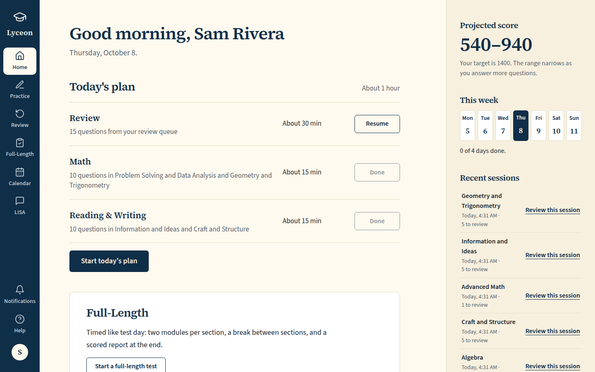 `/dashboard`, 154 KB, horizontal overflow 0px | none |
| desktop | dark | 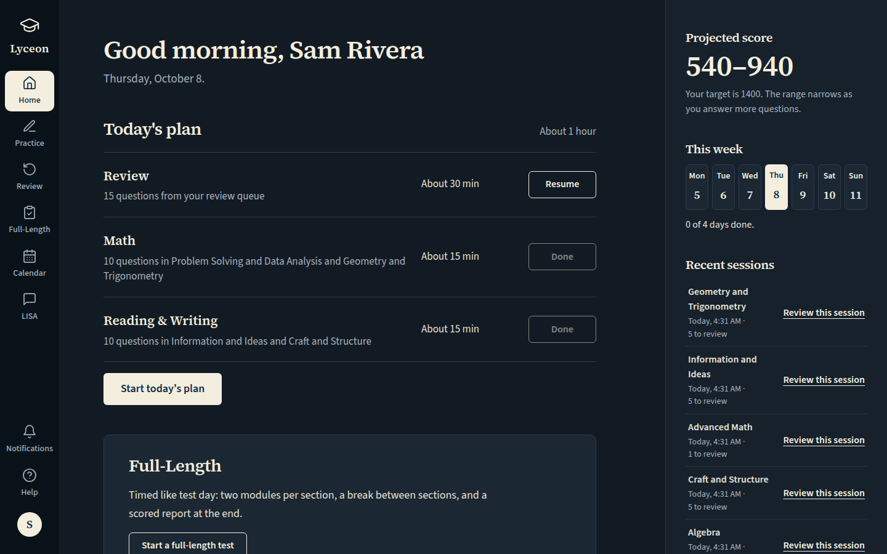 `/dashboard`, 155 KB, horizontal overflow 0px | none |
| mobile | light | 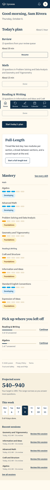 `/dashboard`, 219 KB, horizontal overflow 0px | none |
| mobile | dark | 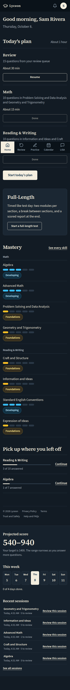 `/dashboard`, 223 KB, horizontal overflow 0px | none |
| w1024 | light | 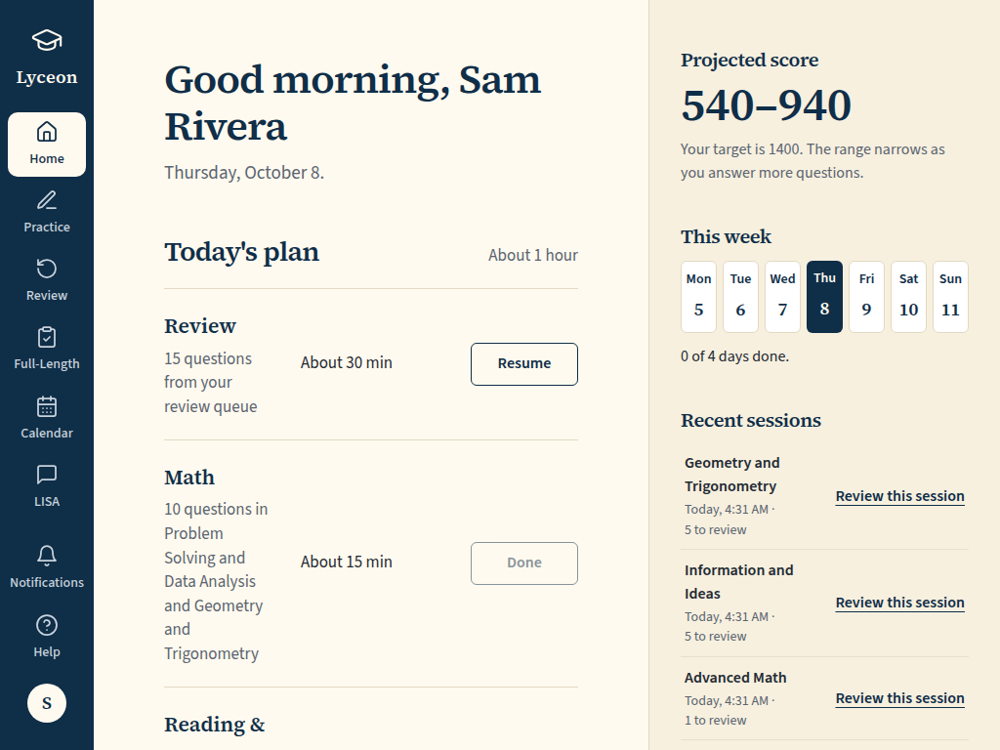 `/dashboard`, 113 KB, horizontal overflow 0px | none |
| w1024 | dark | 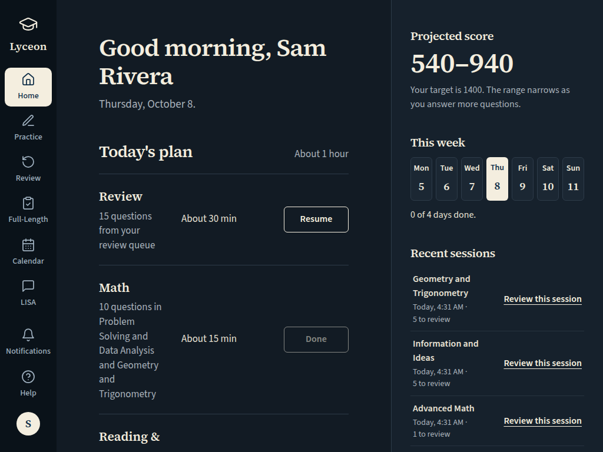 `/dashboard`, 114 KB, horizontal overflow 0px | none |

## Practice, paid: Recent practice

Persona: `paid`. Route: `/practice`.
Full page: the whole document, not just the viewport.
Also shot at w1024 1024x768 (the desktop steps and selectors).
Prototype: none. Not compared with a prototype: a before/after pair for one row.

| Viewport | Theme (as rendered) | Built | Prototype |
|---|---|---|---|
| desktop | light | 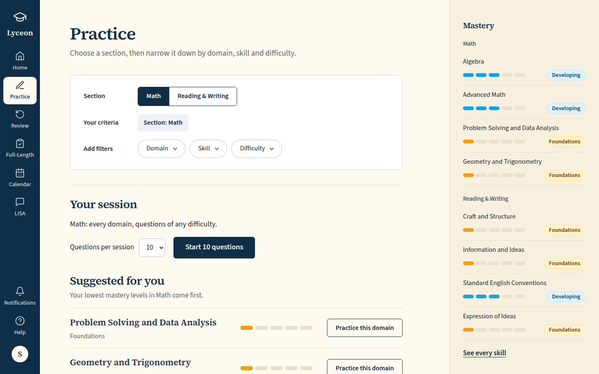 `/practice`, 134 KB, horizontal overflow 0px | none |
| desktop | dark | 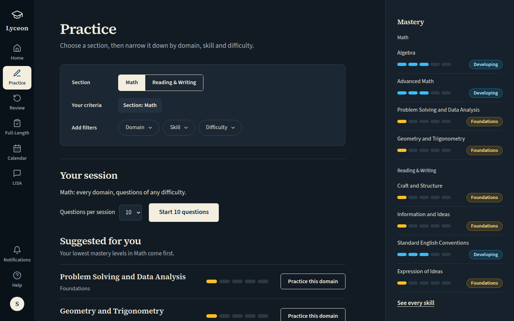 `/practice`, 136 KB, horizontal overflow 0px | none |
| mobile | light | 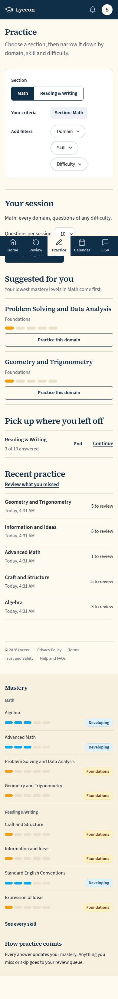 `/practice`, 192 KB, horizontal overflow 0px | none |
| mobile | dark | 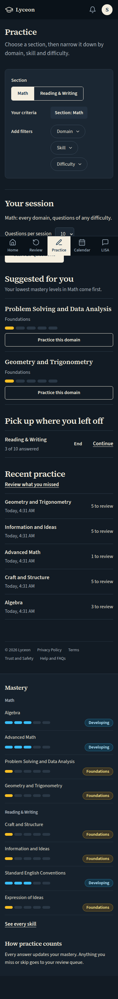 `/practice`, 195 KB, horizontal overflow 0px | none |
| w1024 | light | 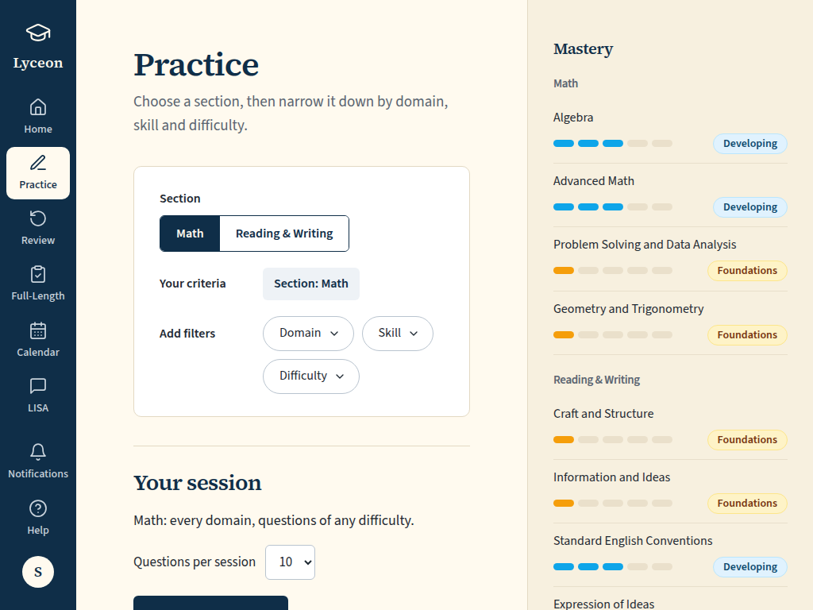 `/practice`, 98 KB, horizontal overflow 0px | none |
| w1024 | dark | 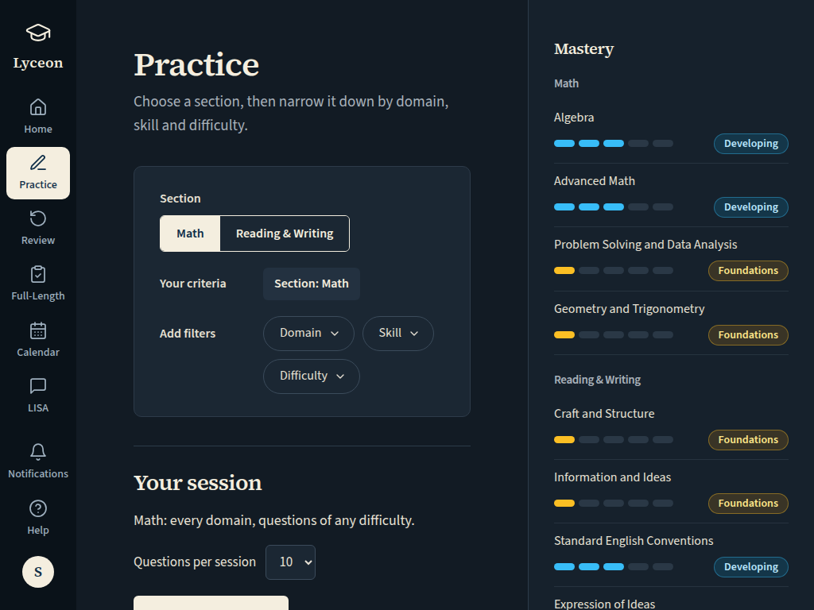 `/practice`, 100 KB, horizontal overflow 0px | none |

## Run facts

- Seeded ids: `{"free":{"completedPracticeSessionId":"ef9b1e10-6d25-46e7-a0d9-aaeb0873e43c","openPracticeSessionId":"26c2d24a-3d0d-40af-9d14-e546e3ee61bc","openReviewSessionId":"bab6d37d-ad03-46ae-926c-897fc2cf2265","diagnosticSessionId":null,"scoredExamSessionId":null,"inProgressExamSessionId":null,"lisaConversationId":null,"answered":39},"paid":{"completedPracticeSessionId":"22ad7fb9-0e6e-485b-a9b0-951108640a6b","openPracticeSessionId":"1a1a445c-9728-4a6e-894f-c9286ae6da07","openReviewSessionId":"e6033481-5fb2-484f-997b-0e839b7ca94c","diagnosticSessionId":"9fa6b2af-fe9f-4c5d-8631-181c4c6c5d4b","scoredExamSessionId":null,"inProgressExamSessionId":null,"lisaConversationId":null,"answered":79}}`
- Endpoints the pages asked for that the harness does not serve (answered 404): none
- Desmos (QA2-B, opt-in `STUDENT_HARNESS_DESMOS=1`): not loaded (a local-only run; the calculator shows its unavailable line)
- External hosts blocked: none
